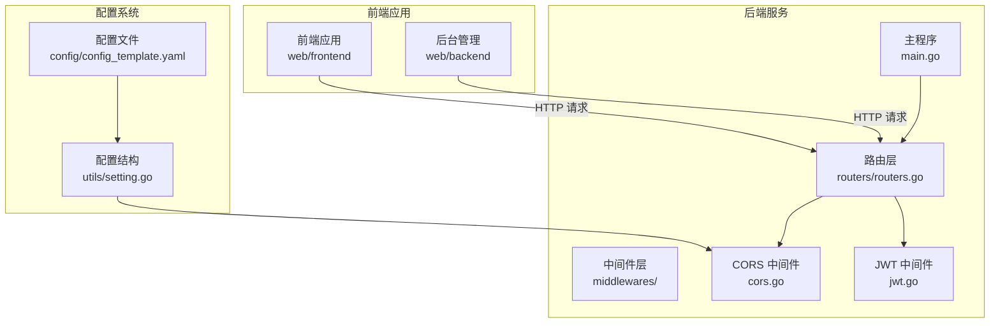
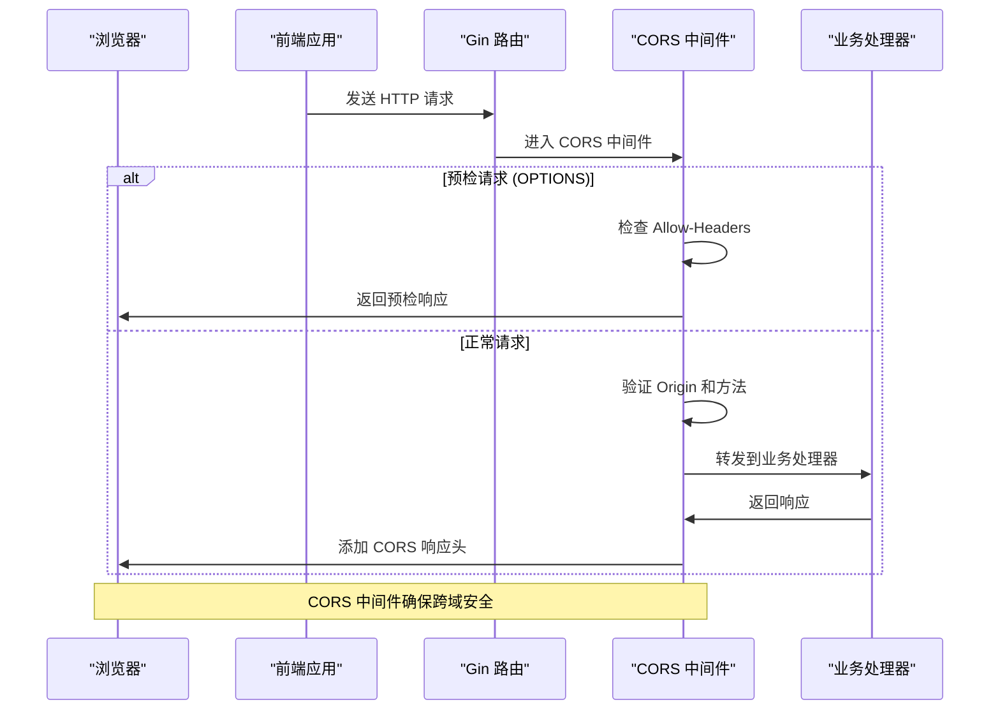
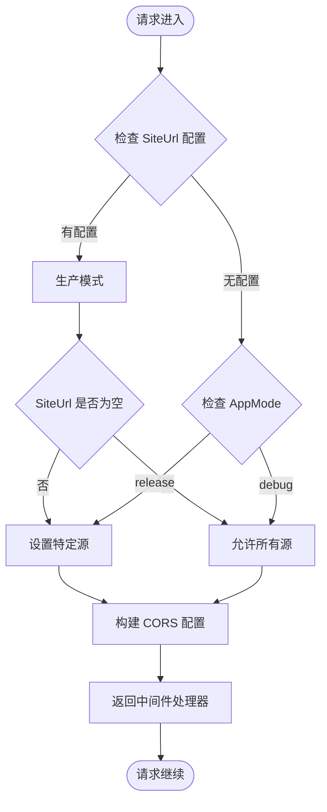
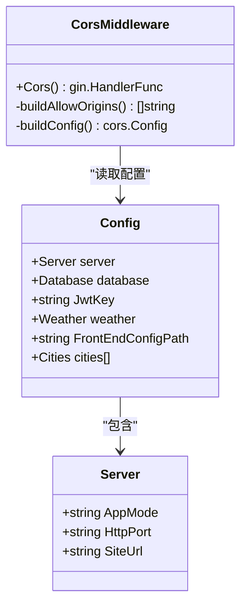
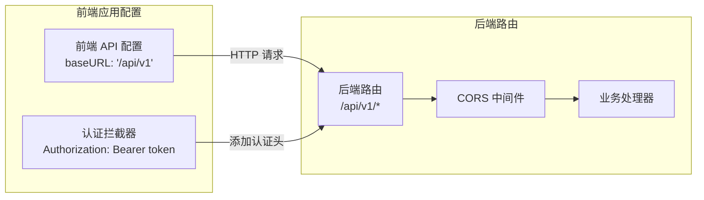
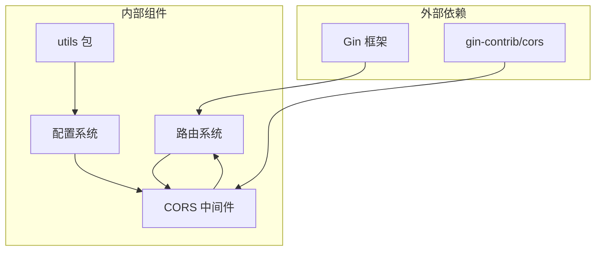
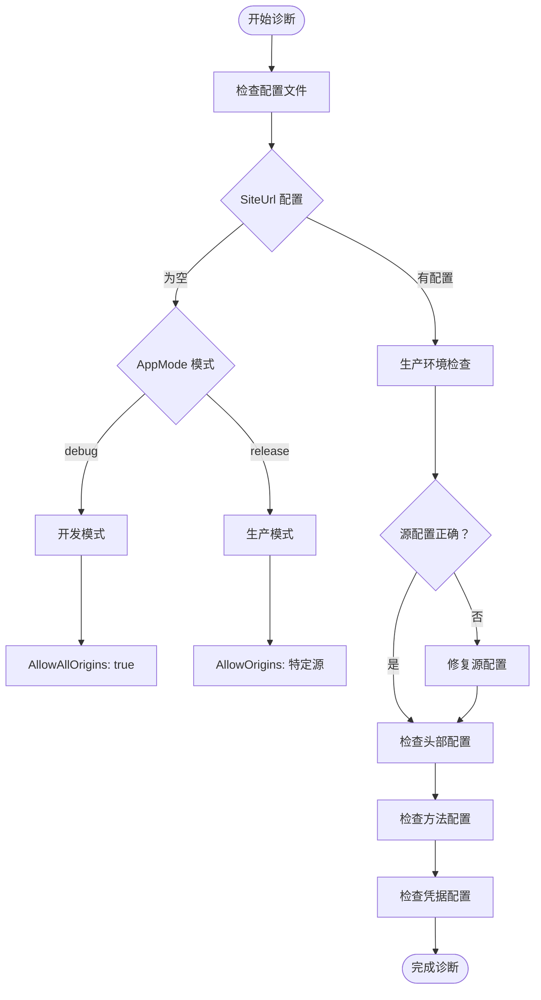

# CORS 跨域处理中间件

<cite>
**本文引用的文件**
- [middlewares/cors.go](file://middlewares/cors.go)
- [routers/routers.go](file://routers/routers.go)
- [main.go](file://main.go)
- [utils/setting.go](file://utils/setting.go)
- [config/config_template.yaml](file://config/config_template.yaml)
- [middlewares/jwt.go](file://middlewares/jwt.go)
- [web/frontend/src/services/api.ts](file://web/frontend/src/services/api.ts)
- [web/backend/src/services/api.ts](file://web/backend/src/services/api.ts)
</cite>

## 目录
1. [简介](#简介)
2. [项目结构](#项目结构)
3. [核心组件](#核心组件)
4. [架构概览](#架构概览)
5. [详细组件分析](#详细组件分析)
6. [依赖关系分析](#依赖关系分析)
7. [性能考量](#性能考量)
8. [故障排除指南](#故障排除指南)
9. [结论](#结论)

## 简介

YanBlog 的 CORS（跨域资源共享）中间件是后端服务与前端应用通信的关键组件。它解决了现代 Web 应用中常见的浏览器同源策略限制问题，使得前端应用能够安全地访问后端 API 接口。

### 浏览器同源策略概述

浏览器出于安全考虑实施了同源策略，限制来自不同源的网页脚本访问 DOM 或数据。同源定义为协议、主机和端口完全相同。

### CORS 的重要性

在 YanBlog 架构中，前端应用（Vue.js）通过 `/api/v1` 路径访问后端 API，这种跨域访问需要 CORS 中间件来处理预检请求和响应头设置。

## 项目结构

YanBlog 采用前后端分离架构，CORS 中间件位于中间件层，与路由层紧密集成：



**图表来源**
- [main.go:12-31](file://main.go#L12-L31)
- [routers/routers.go:13-24](file://routers/routers.go#L13-L24)
- [middlewares/cors.go:14-39](file://middlewares/cors.go#L14-L39)

**章节来源**
- [main.go:12-31](file://main.go#L12-L31)
- [routers/routers.go:13-24](file://routers/routers.go#L13-L24)

## 核心组件

### CORS 中间件实现

CORS 中间件基于 Gin 框架的 gin-contrib/cors 库实现，提供了灵活的跨域配置能力。

#### 主要特性

1. **智能源控制**：根据运行模式动态调整允许的源
2. **方法白名单**：明确允许的 HTTP 方法
3. **头部控制**：精确控制允许的请求和响应头部
4. **凭证处理**：安全的凭据传递机制
5. **缓存优化**：预检请求结果缓存

#### 配置选项详解

| 配置项 | 默认值 | 描述 | 安全影响 |
|--------|--------|------|----------|
| AllowAllOrigins | false | 允许所有来源 | 高风险，仅开发环境 |
| AllowOrigins | []string{} | 明确允许的源列表 | 安全，推荐生产环境 |
| AllowMethods | ["GET","POST","PUT","DELETE","OPTIONS"] | 允许的HTTP方法 | 中等，限制范围 |
| AllowHeaders | ["Origin","Content-Type","Authorization"] | 允许的请求头部 | 中等，最小化原则 |
| ExposeHeaders | ["Content-Length","Authorization"] | 允许暴露的响应头部 | 低，增强客户端访问 |
| AllowCredentials | false | 是否允许携带凭据 | 高风险，谨慎使用 |
| MaxAge | 12小时 | 预检请求缓存时间 | 低，提升性能 |

**章节来源**
- [middlewares/cors.go:16-39](file://middlewares/cors.go#L16-L39)

## 架构概览

CORS 中间件在整个请求处理流程中的位置：



**图表来源**
- [routers/routers.go:20-24](file://routers/routers.go#L20-L24)
- [middlewares/cors.go:29-38](file://middlewares/cors.go#L29-L38)

## 详细组件分析

### CORS 中间件设计原理

#### 智能源控制策略



**图表来源**
- [middlewares/cors.go:17-27](file://middlewares/cors.go#L17-L27)

#### 配置加载机制

CORS 中间件依赖全局配置系统：



**图表来源**
- [utils/setting.go:14-42](file://utils/setting.go#L14-L42)
- [middlewares/cors.go:16-39](file://middlewares/cors.go#L16-L39)

**章节来源**
- [middlewares/cors.go:16-39](file://middlewares/cors.go#L16-L39)
- [utils/setting.go:14-42](file://utils/setting.go#L14-L42)

### 前端集成分析

#### 前端请求配置

前端应用通过相对路径访问后端 API：



**图表来源**
- [web/frontend/src/services/api.ts:3-9](file://web/frontend/src/services/api.ts#L3-L9)
- [web/backend/src/services/api.ts:6-12](file://web/backend/src/services/api.ts#L6-L12)

**章节来源**
- [web/frontend/src/services/api.ts:3-9](file://web/frontend/src/services/api.ts#L3-L9)
- [web/backend/src/services/api.ts:6-12](file://web/backend/src/services/api.ts#L6-L12)

## 依赖关系分析

### 组件耦合度分析



**图表来源**
- [middlewares/cors.go:4-12](file://middlewares/cors.go#L4-L12)
- [routers/routers.go:3-11](file://routers/routers.go#L3-L11)

### 配置依赖链

CORS 中间件的配置依赖关系：

1. **配置文件** → **配置结构** → **运行模式判断** → **源控制策略**
2. **SiteUrl 配置** → **生产环境源限制** → **安全边界设定**
3. **AppMode 配置** → **开发环境宽松策略** → **调试便利性**

**章节来源**
- [middlewares/cors.go:17-27](file://middlewares/cors.go#L17-L27)
- [utils/setting.go:47-64](file://utils/setting.go#L47-L64)

## 性能考量

### 缓存策略

CORS 中间件设置了 12 小时的预检请求缓存时间，这可以显著减少重复的预检请求开销。

### 内存使用

- 每个请求都会进行源验证和头部检查
- 配置信息在进程启动时加载，运行时只读访问
- 中间件处理器复用，避免重复创建

### 网络优化

- 预检请求缓存减少了网络往返次数
- 最小化允许的头部列表降低了请求大小
- 明确的方法白名单避免了不必要的 OPTIONS 请求

## 故障排除指南

### 常见跨域问题诊断

#### 问题 1：CORS 预检失败

**症状**：
```
Access to fetch at 'http://localhost:8080/api/v1/articles' from origin 'http://localhost:3000' 
has been blocked by CORS policy: Method X is not allowed by Access-Control-Allow-Methods
```

**诊断步骤**：
1. 检查请求方法是否在 AllowMethods 列表中
2. 验证请求头是否在 AllowHeaders 中
3. 确认源是否被允许

**解决方案**：
- 修改 AllowMethods 或 AllowHeaders 配置
- 确保前端请求符合后端允许的范围

#### 问题 2：凭据传递失败

**症状**：
```
Access to fetch at 'http://localhost:8080/api/v1/login' from origin 'http://localhost:3000' 
has been blocked by CORS policy: The value of the 'Access-Control-Allow-Credentials' 
header in the response is '' which must be 'true' when the request's credentials mode is 'include'
```

**诊断步骤**：
1. 检查 AllowCredentials 配置
2. 验证前端是否设置了 withCredentials
3. 确认源是否在 AllowOrigins 列表中

**解决方案**：
- 将 AllowCredentials 设置为 true
- 确保使用特定源而非 AllowAllOrigins

#### 问题 3：生产环境访问受限

**症状**：
```
Access to fetch at 'https://yourdomain.com/api/v1/articles' from origin 'https://yourdomain.com' 
has been blocked by CORS policy: The value of the 'Access-Control-Allow-Origin' header in the response 
must not contain more than one origin
```

**诊断步骤**：
1. 检查 SiteUrl 配置是否正确
2. 验证 AllowOrigins 数组长度
3. 确认生产环境域名配置

**解决方案**：
- 设置正确的 SiteUrl 配置
- 确保 AllowOrigins 只包含一个源

### 配置验证工具



**图表来源**
- [middlewares/cors.go:17-39](file://middlewares/cors.go#L17-L39)
- [utils/setting.go:14-42](file://utils/setting.go#L14-L42)

**章节来源**
- [middlewares/cors.go:17-39](file://middlewares/cors.go#L17-L39)
- [utils/setting.go:14-42](file://utils/setting.go#L14-L42)

## 结论

YanBlog 的 CORS 跨域处理中间件通过智能化的配置策略，在安全性与功能性之间取得了良好平衡：

### 设计优势

1. **环境感知**：根据运行模式自动调整安全级别
2. **最小权限原则**：默认只允许必要方法和头部
3. **生产安全**：生产环境强制特定源限制
4. **开发便利**：开发环境提供宽松的调试支持

### 最佳实践建议

1. **生产环境**：始终设置明确的 SiteUrl 配置
2. **安全优先**：避免使用 AllowAllOrigins
3. **最小化原则**：只允许必要的 HTTP 方法和头部
4. **定期审查**：定期检查和更新 CORS 配置
5. **监控告警**：建立 CORS 相关的监控指标

### 部署建议

- **开发环境**：启用 AllowAllOrigins，便于多前端调试
- **测试环境**：设置特定源，模拟生产环境行为
- **生产环境**：严格限制源列表，启用凭据验证

通过合理配置 CORS 中间件，YanBlog 实现了既安全又灵活的跨域访问机制，为前后端分离架构提供了坚实的技术基础。