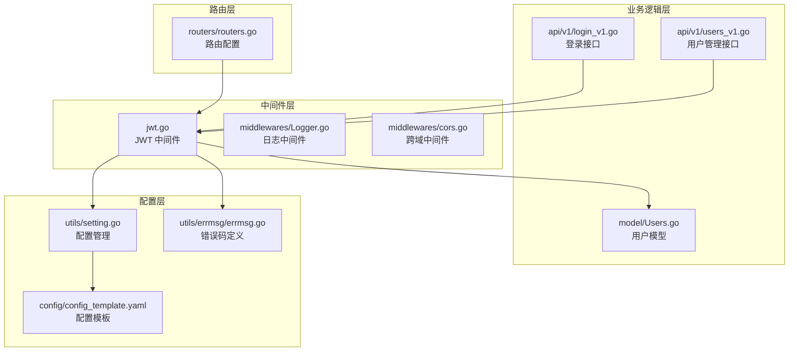
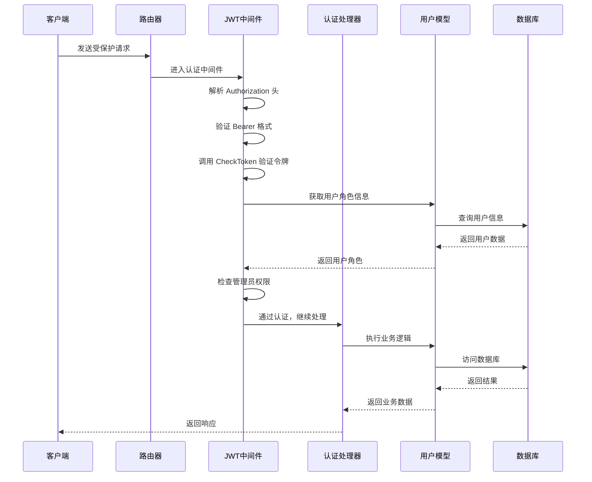
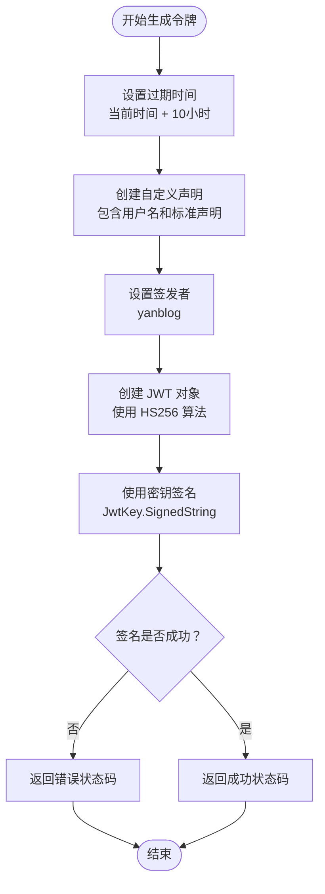
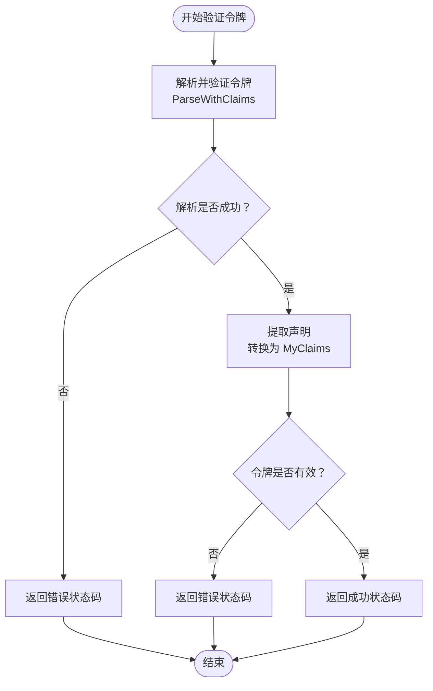
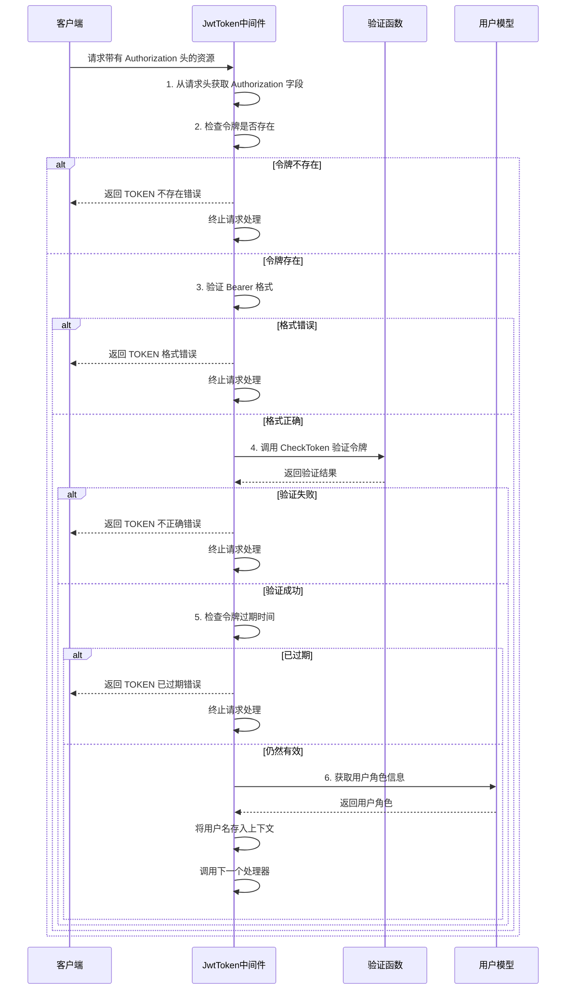
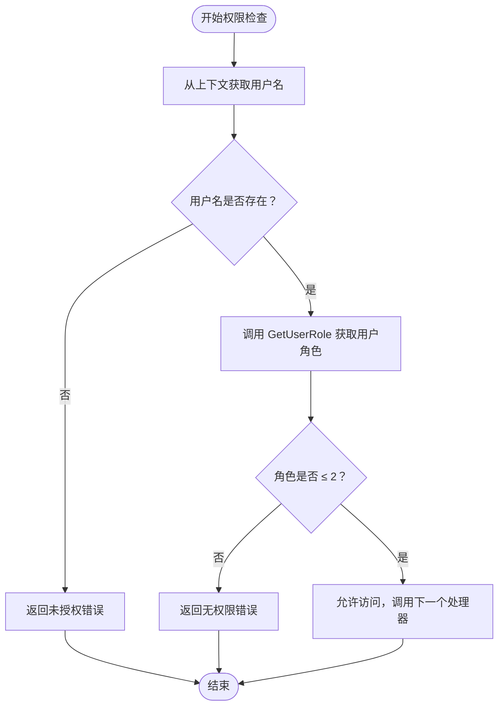
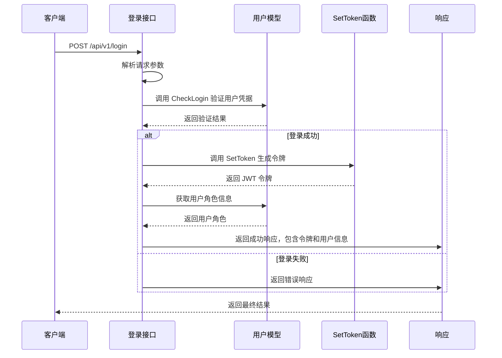
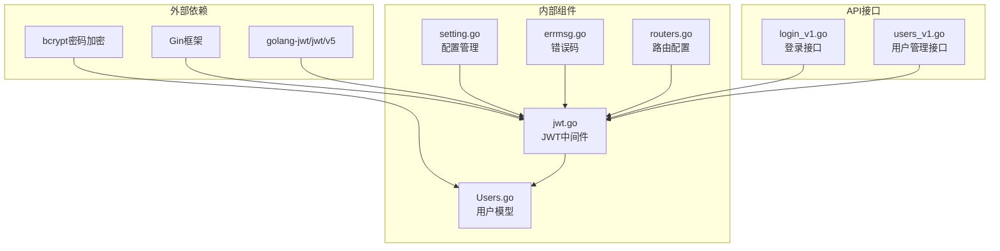

# JWT 认证中间件

<cite>
**本文档引用的文件**
- [jwt.go](file://middlewares/jwt.go)
- [Users.go](file://model/Users.go)
- [login_v1.go](file://api/v1/login_v1.go)
- [routers.go](file://routers/routers.go)
- [setting.go](file://utils/setting.go)
- [errmsg.go](file://utils/errmsg/errmsg.go)
- [users_v1.go](file://api/v1/users_v1.go)
- [config_template.yaml](file://config/config_template.yaml)
</cite>

## 目录
1. [简介](#简介)
2. [项目结构](#项目结构)
3. [核心组件](#核心组件)
4. [架构概览](#架构概览)
5. [详细组件分析](#详细组件分析)
6. [依赖关系分析](#依赖关系分析)
7. [性能考虑](#性能考虑)
8. [故障排除指南](#故障排除指南)
9. [结论](#结论)

## 简介

YanBlog 的 JWT 认证中间件是一个基于 Gin 框架的安全认证系统，实现了完整的用户身份验证和授权机制。该系统采用 JSON Web Token (JWT) 标准，提供了令牌生成、验证、过期管理和权限控制等功能。

本认证系统的核心特性包括：
- 基于 HS256 签名算法的 JWT 令牌生成
- 自定义声明结构，包含用户名和标准 JWT 声明
- 10 小时有效期的令牌管理
- 管理员权限分级控制
- 动态配置密钥刷新机制

## 项目结构

JWT 认证相关的文件分布如下：

**图表来源**
- [jwt.go:1-157](file://middlewares/jwt.go#L1-L157)
- [Users.go:1-245](file://model/Users.go#L1-L245)
- [login_v1.go:1-59](file://api/v1/login_v1.go#L1-L59)
- [routers.go:1-122](file://routers/routers.go#L1-L122)

**章节来源**
- [jwt.go:1-157](file://middlewares/jwt.go#L1-L157)
- [routers.go:13-122](file://routers/routers.go#L13-L122)

## 核心组件

### JWT 中间件核心功能

JWT 中间件包含三个主要组件：

1. **SetToken**: 生成 JWT 令牌
2. **CheckToken**: 验证 JWT 令牌
3. **JwtToken**: 完整的认证中间件流程

### 用户角色系统

系统采用三层用户权限模型：
- **超级管理员 (Role: 1)**: 拥有最高权限，可管理所有用户和系统设置
- **管理员 (Role: 2)**: 可管理普通用户，有限的系统管理权限
- **普通用户 (Role: 3)**: 仅能访问基本功能

### 错误码系统

系统定义了完整的错误码体系，涵盖认证相关的各种错误场景：
- TOKEN 不存在: ERROR_TOKEN_EXIST
- TOKEN 格式错误: ERROR_TOKEN_TYPE_WRONG  
- TOKEN 不正确: ERROR_TOKEN_WRONG
- TOKEN 已过期: ERROR_TOKEN_RUNTIME
- 用户无权限: ERROR_USER_NO_RIGHT

**章节来源**
- [jwt.go:22-25](file://middlewares/jwt.go#L22-L25)
- [Users.go:12-17](file://model/Users.go#L12-L17)
- [errmsg.go:3-28](file://utils/errmsg/errmsg.go#L3-L28)

## 架构概览

JWT 认证系统的整体架构采用中间件模式，通过 Gin 的中间件链实现认证和授权。

**图表来源**
- [jwt.go:98-157](file://middlewares/jwt.go#L98-L157)
- [Users.go:239-244](file://model/Users.go#L239-L244)

## 详细组件分析

### SetToken 函数实现

SetToken 函数负责生成新的 JWT 令牌，其工作流程如下：

**图表来源**
- [jwt.go:27-49](file://middlewares/jwt.go#L27-L49)

#### 令牌结构设计

生成的 JWT 令牌包含以下结构：

**头部 (Header)**:
- `alg`: HS256 (HMAC SHA256 签名算法)
- `typ`: JWT (令牌类型)

**载荷 (Payload)**:
- `username`: 用户名 (自定义声明)
- `exp`: 过期时间 (标准声明)
- `iat`: 签发时间 (标准声明)  
- `nbf`: 生效时间 (标准声明)
- `iss`: 签发者 (标准声明: yanblog)

**章节来源**
- [jwt.go:30-49](file://middlewares/jwt.go#L30-L49)

### CheckToken 函数验证流程

CheckToken 函数负责验证 JWT 令牌的有效性，包括多个层面的检查：

**图表来源**
- [jwt.go:51-69](file://middlewares/jwt.go#L51-L69)

#### 验证流程详解

1. **令牌解析**: 使用 `jwt.ParseWithClaims` 解析令牌字符串
2. **密钥验证**: 通过回调函数提供验证密钥
3. **签名验证**: 使用 HS256 算法验证令牌签名
4. **声明提取**: 将声明转换为 `MyClaims` 结构
5. **有效性检查**: 验证令牌的完整性

**章节来源**
- [jwt.go:54-69](file://middlewares/jwt.go#L54-L69)

### JwtToken 中间件完整认证流程

JwtToken 中间件实现了完整的认证流程，包含六个关键步骤：

**图表来源**
- [jwt.go:98-157](file://middlewares/jwt.go#L98-L157)

#### 认证步骤详解

1. **请求头解析**: 从 `Authorization` 头部获取令牌
2. **存在性检查**: 验证令牌是否存在于请求头中
3. **格式验证**: 检查是否为标准的 `Bearer token` 格式
4. **令牌验证**: 调用 `CheckToken` 函数验证令牌有效性
5. **过期检查**: 验证令牌是否仍在有效期内
6. **上下文设置**: 将用户名信息存入 Gin 上下文供后续使用

**章节来源**
- [jwt.go:100-157](file://middlewares/jwt.go#L100-L157)

### AdminRequired 管理员权限中间件

AdminRequired 中间件实现了管理员权限控制，确保只有具有足够权限的用户才能访问特定资源：

**图表来源**
- [jwt.go:71-96](file://middlewares/jwt.go#L71-L96)

#### 权限控制逻辑

管理员权限中间件采用"角色码 ≤ 2"的判断逻辑：
- **超级管理员 (Role: 1)**: 可以执行所有管理员操作
- **管理员 (Role: 2)**: 可以执行管理员操作
- **普通用户 (Role: 3)**: 无管理员权限

这种设计确保了权限的层次性和安全性。

**章节来源**
- [jwt.go:71-96](file://middlewares/jwt.go#L71-L96)

### 登录流程集成

登录接口与 JWT 中间件的集成展示了完整的认证流程：

**图表来源**
- [login_v1.go:13-59](file://api/v1/login_v1.go#L13-L59)

**章节来源**
- [login_v1.go:15-58](file://api/v1/login_v1.go#L15-L58)

## 依赖关系分析

JWT 认证中间件的依赖关系图显示了各组件之间的交互：

**图表来源**
- [jwt.go:3-13](file://middlewares/jwt.go#L3-L13)
- [Users.go:3-9](file://model/Users.go#L3-L9)
- [setting.go:3-12](file://utils/setting.go#L3-L12)

### 组件耦合度分析

JWT 中间件的设计体现了良好的关注点分离：

1. **低耦合**: 中间件只依赖于用户模型的最小接口
2. **高内聚**: 认证逻辑集中在单一文件中
3. **可测试性**: 清晰的函数边界便于单元测试
4. **可扩展性**: 支持动态配置密钥刷新

**章节来源**
- [jwt.go:15-20](file://middlewares/jwt.go#L15-L20)
- [setting.go:132-148](file://utils/setting.go#L132-L148)

## 性能考虑

### 令牌生成性能

- **HS256 算法**: 使用对称加密算法，性能优异
- **10 小时有效期**: 平衡了安全性与用户体验
- **内存缓存**: JWT 密钥在内存中缓存，避免频繁读取

### 验证性能优化

- **即时验证**: 令牌验证在内存中完成，无网络延迟
- **零拷贝**: 使用 Go 的原生字符串处理
- **批量处理**: 支持并发请求处理

### 内存管理

- **垃圾回收**: Go 的自动内存管理减少内存泄漏风险
- **连接池**: 数据库连接使用连接池优化
- **缓存策略**: 用户角色信息可在业务层缓存

## 故障排除指南

### 常见问题及解决方案

#### 1. TOKEN 不存在错误 (ERROR_TOKEN_EXIST)

**症状**: 返回 "TOKEN不存在,请重新登陆"

**原因**: 请求头缺少 Authorization 字段

**解决方案**:
- 确保客户端正确设置 Authorization 头
- 检查前端是否正确存储和发送令牌

#### 2. TOKEN 格式错误 (ERROR_TOKEN_TYPE_WRONG)

**症状**: 返回 "TOKEN格式错误,请重新登陆"

**原因**: Authorization 头格式不正确

**解决方案**:
- 确保使用 "Bearer {token}" 格式
- 检查令牌前缀是否正确

#### 3. TOKEN 不正确 (ERROR_TOKEN_WRONG)

**症状**: 返回 "TOKEN不正确,请重新登陆"

**原因**: 令牌被篡改或密钥不匹配

**解决方案**:
- 检查服务器密钥配置
- 确认令牌未被修改
- 验证密钥长度和格式

#### 4. TOKEN 已过期 (ERROR_TOKEN_RUNTIME)

**症状**: 返回 "TOKEN已过期,请重新登陆"

**原因**: 令牌超过 10 小时有效期

**解决方案**:
- 引导用户重新登录获取新令牌
- 考虑延长令牌有效期（谨慎）

#### 5. 无权限错误 (ERROR_USER_NO_RIGHT)

**症状**: 返回 "该用户无权限"

**原因**: 用户角色不足

**解决方案**:
- 检查用户角色设置
- 确认管理员权限分配
- 验证权限中间件配置

### 调试技巧

1. **启用详细日志**: 在开发环境中启用 Gin 的调试模式
2. **检查配置**: 验证 JWT 密钥配置正确性
3. **测试令牌**: 使用在线 JWT 解析工具验证令牌结构
4. **监控性能**: 使用性能分析工具检测认证瓶颈

**章节来源**
- [errmsg.go:30-57](file://utils/errmsg/errmsg.go#L30-L57)
- [jwt.go:108-151](file://middlewares/jwt.go#L108-L151)

## 结论

YanBlog 的 JWT 认证中间件提供了一个完整、安全且高效的用户身份验证解决方案。其设计特点包括：

### 技术优势

1. **安全性**: 采用标准 JWT 协议和 HS256 签名算法
2. **易用性**: 简洁的 API 设计和清晰的错误处理
3. **可维护性**: 良好的代码组织和注释规范
4. **可扩展性**: 支持动态配置和权限扩展

### 最佳实践建议

1. **密钥管理**: 
   - 使用强随机密钥（至少 32 字节）
   - 定期轮换密钥
   - 在生产环境使用环境变量存储

2. **令牌策略**:
   - 根据业务需求调整有效期
   - 考虑实现刷新令牌机制
   - 实施令牌撤销机制

3. **安全加固**:
   - 添加 IP 绑定或设备绑定
   - 实现多因素认证
   - 监控异常登录行为

4. **性能优化**:
   - 实施令牌缓存策略
   - 优化数据库查询
   - 使用连接池管理

该认证系统为 YanBlog 提供了坚实的安全基础，支持未来的功能扩展和安全增强。