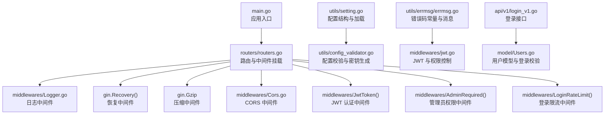
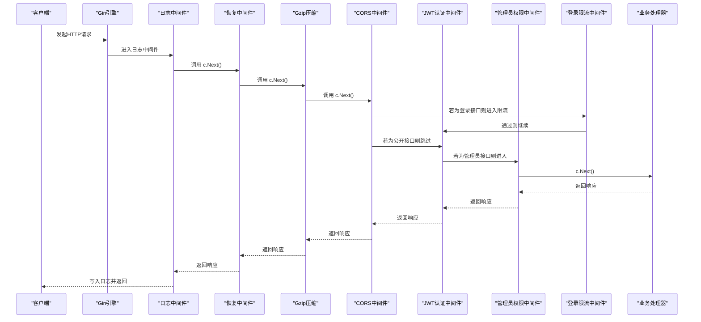
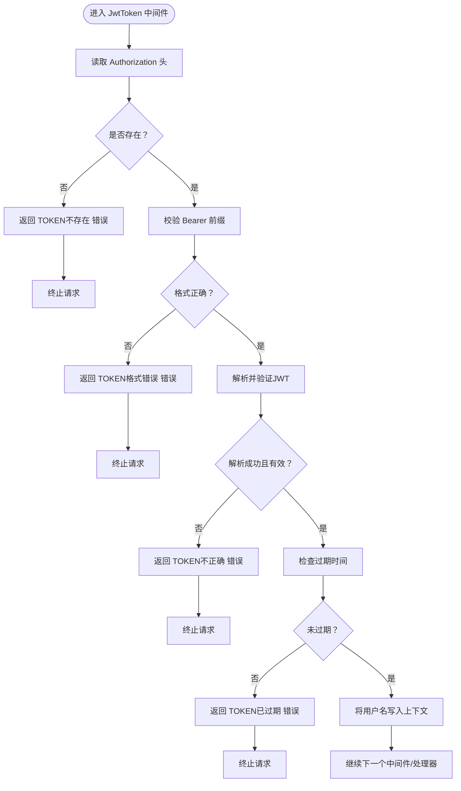
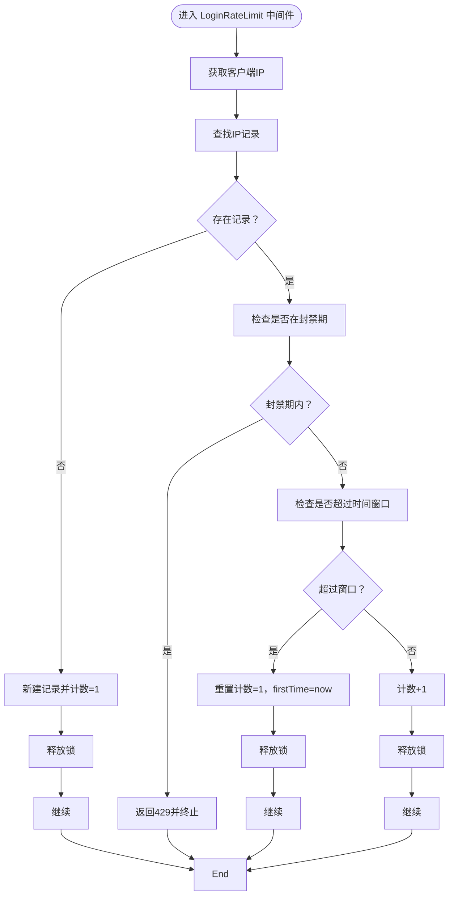
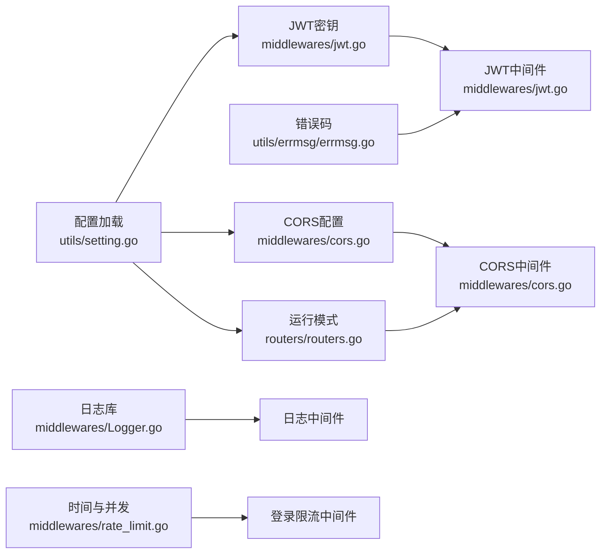

# 中间件和拦截器

<cite>
**本文引用的文件**
- [main.go](file://main.go)
- [routers/routers.go](file://routers/routers.go)
- [middlewares/jwt.go](file://middlewares/jwt.go)
- [middlewares/cors.go](file://middlewares/cors.go)
- [middlewares/Logger.go](file://middlewares/Logger.go)
- [middlewares/rate_limit.go](file://middlewares/rate_limit.go)
- [utils/setting.go](file://utils/setting.go)
- [utils/config_validator.go](file://utils/config_validator.go)
- [utils/errmsg/errmsg.go](file://utils/errmsg/errmsg.go)
- [api\v1\login_v1.go](file://api\v1\login_v1.go)
- [model/Users.go](file://model/Users.go)
</cite>

## 目录
1. [简介](#简介)
2. [项目结构](#项目结构)
3. [核心组件](#核心组件)
4. [架构总览](#架构总览)
5. [详细组件分析](#详细组件分析)
6. [依赖分析](#依赖分析)
7. [性能考量](#性能考量)
8. [故障排查指南](#故障排查指南)
9. [结论](#结论)
10. [附录](#附录)

## 简介
本文件面向后端开发者，系统性梳理 YanBlog 的中间件体系与拦截器实现，重点覆盖：
- Gin 框架中间件的组织与链式执行顺序
- JWT 认证中间件的工作原理、令牌生成与验证流程、权限控制机制
- CORS 跨域处理中间件的配置策略与安全注意事项
- 日志记录中间件的实现细节、请求日志、错误日志与性能监控
- 限流控制中间件的算法实现与配置选项
- 中间件链式处理的调试方法与最佳实践
- 自定义中间件的开发指南与扩展建议

## 项目结构
YanBlog 的中间件位于 middlewares 目录，配合路由层 routers/routers.go 进行全局与分组挂载；配置由 utils/setting.go 与 utils/config_validator.go 提供，错误码集中于 utils/errmsg/errmsg.go；业务示例集中在 api/v1 下，如登录接口演示了 JWT 令牌生成与使用。

图表来源
- [main.go:12-31](file://main.go#L12-L31)
- [routers/routers.go:13-122](file://routers/routers.go#L13-L122)
- [middlewares/Logger.go:18-103](file://middlewares/Logger.go#L18-L103)
- [middlewares/cors.go:16-39](file://middlewares/cors.go#L16-L39)
- [middlewares/jwt.go:98-157](file://middlewares/jwt.go#L98-L157)
- [middlewares/rate_limit.go:50-98](file://middlewares/rate_limit.go#L50-L98)
- [utils/setting.go:14-44](file://utils/setting.go#L14-L44)
- [utils/config_validator.go:13-54](file://utils/config_validator.go#L13-L54)
- [utils/errmsg/errmsg.go:3-28](file://utils/errmsg/errmsg.go#L3-L28)
- [api\v1\login_v1.go:13-59](file://api\v1\login_v1.go#L13-L59)
- [model/Users.go:214-237](file://model/Users.go#L214-L237)

章节来源
- [main.go:12-31](file://main.go#L12-L31)
- [routers/routers.go:13-122](file://routers/routers.go#L13-L122)

## 核心组件
- 日志中间件：记录请求耗时、状态码、客户端 IP、User-Agent、响应大小，并按级别写入轮转日志文件，同时收集 Gin 错误。
- CORS 中间件：基于配置动态允许来源，生产环境默认仅允许配置的站点 URL，开发模式允许所有来源；限定允许的方法与头部。
- JWT 认证中间件：从 Authorization 请求头解析 Bearer 令牌，验证签名与过期时间，将用户名注入上下文；提供管理员权限中间件。
- 登录限流中间件：基于客户端 IP 的滑动窗口计数，超过阈值在封禁时间内拒绝请求，定期清理过期记录。
- 路由与中间件挂载：全局中间件（日志、恢复、Gzip、CORS）先于分组中间件（JWT、AdminRequired）执行；登录接口单独挂载登录限流。

章节来源
- [middlewares/Logger.go:18-103](file://middlewares/Logger.go#L18-L103)
- [middlewares/cors.go:16-39](file://middlewares/cors.go#L16-L39)
- [middlewares/jwt.go:98-157](file://middlewares/jwt.go#L98-L157)
- [middlewares/rate_limit.go:50-98](file://middlewares/rate_limit.go#L50-L98)
- [routers/routers.go:20-45](file://routers/routers.go#L20-L45)

## 架构总览
下图展示请求在中间件链中的流转与关键决策点，包括 CORS、JWT、管理员权限、登录限流与日志记录。

图表来源
- [routers/routers.go:20-45](file://routers/routers.go#L20-L45)
- [middlewares/Logger.go:62-101](file://middlewares/Logger.go#L62-L101)
- [middlewares/cors.go:29-38](file://middlewares/cors.go#L29-L38)
- [middlewares/jwt.go:100-156](file://middlewares/jwt.go#L100-L156)
- [middlewares/rate_limit.go:50-97](file://middlewares/rate_limit.go#L50-L97)

## 详细组件分析

### JWT 认证中间件与权限控制
- 令牌生成：使用 HS256 签名，声明包含用户名与过期时间，默认有效期 10 小时；密钥来自配置，支持运行时刷新。
- 令牌验证：解析并验证签名与过期时间；若无效或过期，返回相应错误码。
- 权限控制：将用户名注入上下文；管理员权限中间件根据用户角色码判断是否放行。
- 集成方式：全局挂载于需要认证的分组；登录接口独立挂载登录限流中间件。

图表来源
- [middlewares/jwt.go:100-156](file://middlewares/jwt.go#L100-L156)
- [utils/errmsg/errmsg.go:11-16](file://utils/errmsg/errmsg.go#L11-L16)

章节来源
- [middlewares/jwt.go:15-157](file://middlewares/jwt.go#L15-L157)
- [utils/setting.go:30](file://utils/setting.go#L30)
- [utils/config_validator.go:28-36](file://utils/config_validator.go#L28-L36)
- [routers/routers.go:39-45](file://routers/routers.go#L39-L45)
- [api\v1\login_v1.go:37-45](file://api\v1\login_v1.go#L37-L45)
- [model/Users.go:239-244](file://model/Users.go#L239-L244)

### CORS 跨域处理中间件
- 动态来源：优先使用配置中的站点 URL；开发模式（AppMode=debug）允许所有来源；否则仅允许配置来源。
- 方法与头部：允许 GET/POST/PUT/DELETE/OPTIONS，允许 Origin、Content-Type、Authorization；暴露 Content-Length、Authorization。
- 凭据与缓存：默认不允许凭据；预检请求缓存 12 小时。
- 安全建议：生产环境严格限制 AllowOrigins，避免使用 AllowAllOrigins；如需携带 Cookie，应谨慎开启 AllowCredentials 并明确 AllowOrigins。

章节来源
- [middlewares/cors.go:16-39](file://middlewares/cors.go#L16-L39)
- [utils/setting.go:14-42](file://utils/setting.go#L14-L42)

### 日志记录中间件
- 输出目标：默认写入 log/log 文件；初始化轮转失败时回退到标准输出。
- 轮转策略：按天轮转，保留 7 天；按级别统一写入。
- 记录字段：主机名、状态码、耗时（毫秒）、客户端 IP、方法、路径、响应大小、User-Agent、私有错误。
- 级别选择：5xx 错误级别为 Error，4xx 为 Warn，其他为 Info；若有私有错误则额外记录。

章节来源
- [middlewares/Logger.go:18-103](file://middlewares/Logger.go#L18-L103)

### 登录限流中间件
- 算法：基于客户端 IP 的滑动窗口计数，窗口 15 分钟，最大尝试 5 次，封禁 30 分钟。
- 清理：每 10 分钟清理一次过期记录，避免内存膨胀。
- 行为：在封禁期内直接返回 429；超过窗口重置计数；在窗口内累加计数。

图表来源
- [middlewares/rate_limit.go:50-98](file://middlewares/rate_limit.go#L50-L98)

章节来源
- [middlewares/rate_limit.go:17-48](file://middlewares/rate_limit.go#L17-L48)
- [routers/routers.go:116](file://routers/routers.go#L116)

### 中间件链式执行顺序与调试
- 全局中间件（日志、恢复、Gzip、CORS）先于分组中间件执行；分组中间件（JWT、AdminRequired）再按注册顺序执行。
- 调试建议：
  - 使用日志中间件观察请求耗时与状态码。
  - 在 JWT 中间件前后插入简单日志，确认用户名注入与权限判定。
  - 对 CORS 问题，检查 AllowOrigins 与 AllowCredentials 配置。
  - 登录限流异常时，检查 IP 获取与封禁时间逻辑。

章节来源
- [routers/routers.go:20-45](file://routers/routers.go#L20-L45)
- [middlewares/Logger.go:62-101](file://middlewares/Logger.go#L62-L101)

### 自定义中间件开发指南与最佳实践
- 设计原则
  - 保持单一职责：每个中间件专注一个功能（认证、限流、日志、CORS 等）。
  - 早失败：在中间件尽早发现并返回错误，减少后续处理开销。
  - 不破坏上下文：仅在必要时向上下文写入数据，并保证键名唯一。
  - 可测试：将外部依赖（如配置、数据库）抽象为接口，便于单元测试。
- 实现要点
  - 使用 c.Next() 正确传递控制权；在 defer 中进行收尾（如日志记录）。
  - 对外暴露工厂函数 gin.HandlerFunc，便于在路由中直接挂载。
  - 配置与资源：尽量从配置中心或全局变量读取，避免硬编码。
  - 性能：避免在中间件中做阻塞 IO；必要时使用异步或缓存。
- 扩展建议
  - 引入指标采集：在日志中间件基础上增加 Prometheus 指标上报。
  - 结合 Redis：将限流与速率限制迁移到分布式缓存，支持多实例部署。
  - 统一鉴权：将权限判定抽象为策略接口，支持更细粒度的 RBAC。

## 依赖分析
- 中间件依赖
  - JWT 中间件依赖配置中的 JwtKey、错误码与用户模型的角色判定。
  - CORS 中间件依赖配置中的站点 URL 与运行模式。
  - 日志中间件依赖轮转库与日志库。
  - 登录限流中间件依赖时间与并发控制。
- 路由依赖
  - 路由在全局与分组层面挂载中间件，形成清晰的执行链路。
- 配置与密钥
  - 配置加载与校验负责生成临时 JwtKey 并在启动后刷新中间件密钥。

图表来源
- [utils/setting.go:14-44](file://utils/setting.go#L14-L44)
- [middlewares/jwt.go:15](file://middlewares/jwt.go#L15)
- [middlewares/cors.go:18-27](file://middlewares/cors.go#L18-L27)
- [routers/routers.go:14](file://routers/routers.go#L14)
- [utils/errmsg/errmsg.go:3-28](file://utils/errmsg/errmsg.go#L3-L28)
- [middlewares/Logger.go:30-60](file://middlewares/Logger.go#L30-L60)
- [middlewares/rate_limit.go:34-48](file://middlewares/rate_limit.go#L34-L48)

章节来源
- [utils/setting.go:14-44](file://utils/setting.go#L14-L44)
- [middlewares/jwt.go:15](file://middlewares/jwt.go#L15)
- [middlewares/cors.go:18-27](file://middlewares/cors.go#L18-L27)
- [routers/routers.go:14](file://routers/routers.go#L14)
- [utils/errmsg/errmsg.go:3-28](file://utils/errmsg/errmsg.go#L3-L28)
- [middlewares/Logger.go:30-60](file://middlewares/Logger.go#L30-L60)
- [middlewares/rate_limit.go:34-48](file://middlewares/rate_limit.go#L34-L48)

## 性能考量
- 中间件顺序：将轻量中间件（Gzip、CORS）置于日志之前，减少不必要的日志开销。
- 日志轮转：按天轮转可避免单文件过大；注意磁盘空间与 IO 压力。
- 限流策略：滑动窗口计数在高并发下需关注锁竞争；可考虑使用布隆过滤器或分布式缓存。
- JWT 密钥刷新：配置热更新后及时刷新中间件密钥，避免旧密钥导致的验证失败。
- 错误处理：在中间件中尽早返回错误，减少后续处理与序列化成本。

## 故障排查指南
- JWT 相关
  - TOKEN不存在/格式错误/不正确/已过期：检查 Authorization 头格式与签名密钥；确认 JwtKey 是否正确加载。
  - 无权限：检查用户角色码与 AdminRequired 判定逻辑。
- CORS 相关
  - 预检失败：确认 AllowOrigins 与 AllowCredentials 配置；检查请求方法与头部是否在 AllowMethods/AllowHeaders 中。
- 登录限流
  - 429 频繁出现：检查封禁时间与窗口设置；确认客户端 IP 获取是否正确。
- 日志相关
  - 日志轮转失败：检查 log 目录权限与磁盘空间；确认轮转库初始化是否成功。
- 配置相关
  - JwtKey 为空：配置校验会生成临时密钥并在启动后刷新中间件密钥；建议设置永久密钥。

章节来源
- [utils/config_validator.go:13-54](file://utils/config_validator.go#L13-L54)
- [middlewares/jwt.go:18-20](file://middlewares/jwt.go#L18-L20)
- [middlewares/cors.go:18-27](file://middlewares/cors.go#L18-L27)
- [middlewares/rate_limit.go:34-48](file://middlewares/rate_limit.go#L34-L48)
- [middlewares/Logger.go:42-45](file://middlewares/Logger.go#L42-L45)

## 结论
YanBlog 的中间件体系围绕 Gin 的中间件链构建，实现了认证、跨域、限流与日志等关键能力。通过合理的中间件顺序与配置策略，既能保障安全性与稳定性，又能兼顾性能与可观测性。建议在生产环境中严格限制 CORS 来源、妥善管理 JWT 密钥、结合分布式缓存优化限流策略，并持续完善日志与指标体系。

## 附录
- 配置项与默认行为
  - JwtKey：建议使用至少 64 位随机字符串；为空时会生成临时密钥并在启动后刷新。
  - SiteUrl：生产环境仅允许该来源；开发模式允许所有来源。
  - AppMode：debug 模式下 CORS 允许所有来源。
- 错误码参考
  - TOKEN 相关错误码：TOKEN不存在、TOKEN格式错误、TOKEN不正确、TOKEN已过期。
  - 权限相关错误码：该用户无权限。

章节来源
- [utils/config_validator.go:28-36](file://utils/config_validator.go#L28-L36)
- [utils/setting.go:14-42](file://utils/setting.go#L14-L42)
- [utils/errmsg/errmsg.go:11-16](file://utils/errmsg/errmsg.go#L11-L16)
- [utils/errmsg/errmsg.go:15](file://utils/errmsg/errmsg.go#L15)