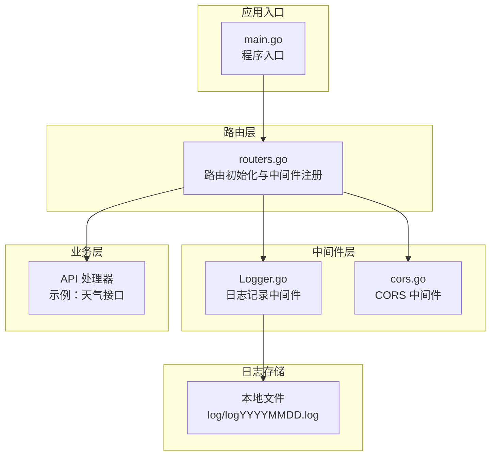
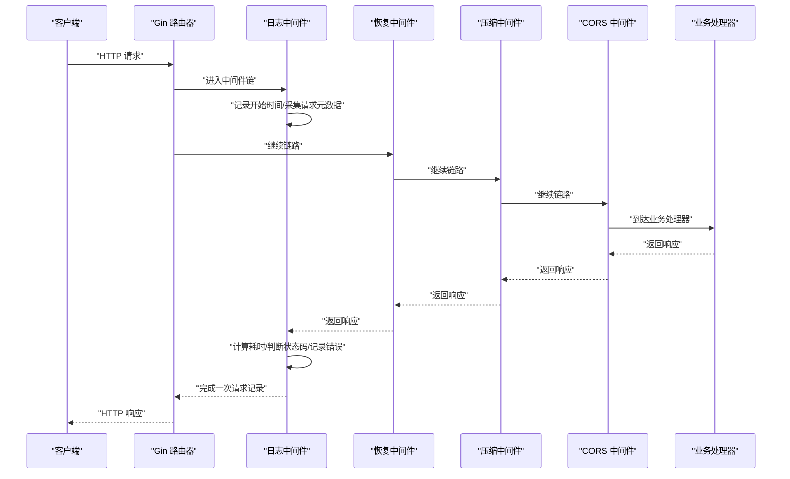
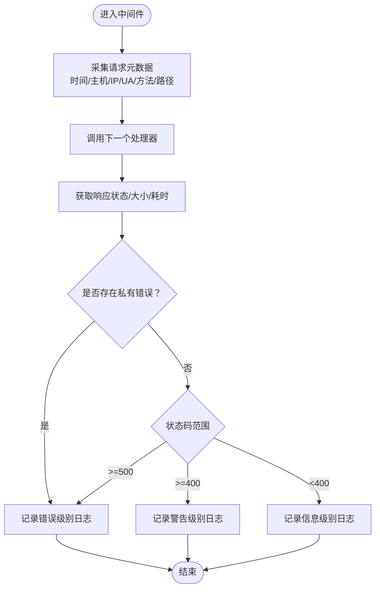
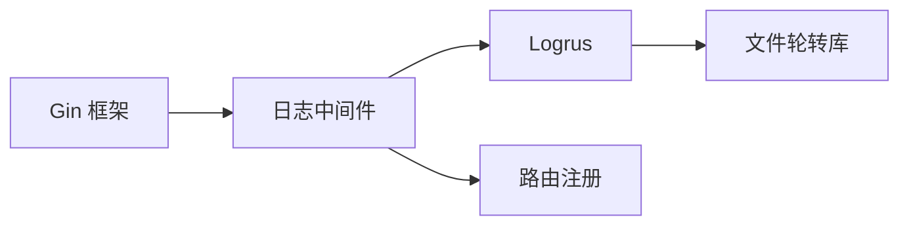

# 日志记录中间件

<cite>
**本文引用的文件**
- [Logger.go](file://middlewares/Logger.go)
- [routers.go](file://routers/routers.go)
- [main.go](file://main.go)
- [response.go](file://utils/response.go)
- [cors.go](file://middlewares/cors.go)
</cite>

## 目录
1. [简介](#简介)
2. [项目结构](#项目结构)
3. [核心组件](#核心组件)
4. [架构总览](#架构总览)
5. [详细组件分析](#详细组件分析)
6. [依赖分析](#依赖分析)
7. [性能考虑](#性能考虑)
8. [故障排查指南](#故障排查指南)
9. [结论](#结论)
10. [附录](#附录)

## 简介
本文件针对 YanBlog 的日志记录中间件进行系统化说明，重点阐述其在请求处理流程中的作用与位置、日志内容与格式、日志级别与输出配置、日志轮转与存储策略，并给出日志分析与监控的最佳实践，以及自定义日志格式与扩展能力的实现思路。

## 项目结构
日志中间件位于中间件层，作为 Gin 路由器的全局中间件之一，在请求进入业务处理器之前与之后分别执行，负责采集请求元数据、计算耗时、记录响应状态与错误信息，并将日志写入本地文件，同时具备基于时间的日志轮转能力。

图表来源
- [main.go:12-31](file://main.go#L12-L31)
- [routers.go:13-25](file://routers/routers.go#L13-L25)
- [Logger.go:18-102](file://middlewares/Logger.go#L18-L102)
- [cors.go:14-39](file://middlewares/cors.go#L14-L39)

章节来源
- [main.go:12-31](file://main.go#L12-L31)
- [routers.go:13-25](file://routers/routers.go#L13-L25)

## 核心组件
- 日志记录中间件：负责在请求生命周期内采集关键指标并输出文本格式日志，支持按天轮转与按级别统一输出。
- 路由与中间件注册：在路由初始化时注册日志中间件，确保所有请求均被记录。
- 响应封装工具：统一的响应结构便于在业务层快速返回标准格式，减少异常路径的复杂度。

章节来源
- [Logger.go:18-102](file://middlewares/Logger.go#L18-L102)
- [routers.go:13-25](file://routers/routers.go#L13-L25)
- [response.go:17-54](file://utils/response.go#L17-L54)

## 架构总览
日志中间件在 Gin 请求处理链路中的位置如下：

图表来源
- [routers.go:13-25](file://routers/routers.go#L13-L25)
- [Logger.go:62-101](file://middlewares/Logger.go#L62-L101)

## 详细组件分析

### 日志中间件实现与职责
- 作用与位置
  - 作为全局中间件，在业务处理器之前与之后执行，确保每个请求都被完整记录。
  - 与恢复中间件、Gzip 压缩、CORS 等中间件共同构成完整的请求处理链。
- 日志内容与格式
  - 时间戳：采用固定格式的时间戳字符串。
  - 请求元数据：主机名、客户端 IP、请求方法、请求路径、User-Agent。
  - 响应信息：状态码、响应体大小、处理耗时。
  - 错误信息：当请求携带私有错误时，会记录该错误消息。
- 日志级别与输出
  - 级别判定规则：状态码 ≥ 500 记为错误级别；4xx 记为警告级别；2xx 记为信息级别。
  - 输出目标：统一写入本地文件，文件名包含日期后缀，按天轮转。
- 日志轮转与存储策略
  - 轮转策略：按天轮转，保留最近 7 天的日志文件。
  - 存储位置：当前工作目录下的 log 子目录，文件名为 logYYYYMMDD.log。
  - 容错处理：若轮转初始化失败，则降级为标准输出，不影响请求处理。
- 性能影响
  - 日志记录为同步 I/O，但仅在请求结束时执行，对吞吐影响有限。
  - 建议在生产环境中结合外部日志收集系统集中处理。

图表来源
- [Logger.go:62-101](file://middlewares/Logger.go#L62-L101)

章节来源
- [Logger.go:18-102](file://middlewares/Logger.go#L18-L102)
- [routers.go:13-25](file://routers/routers.go#L13-L25)

### 请求处理流程中的日志记录
- 注册顺序：日志中间件在恢复中间件、Gzip 压缩与 CORS 之后注册，确保这些中间件产生的状态与错误也能被记录。
- 生命周期：在 c.Next() 之后才记录日志，以获得最终的状态码与响应体大小。
- 错误捕获：当请求对象包含私有错误时，会将其字符串化并记录为错误级别日志。

章节来源
- [routers.go:21-24](file://routers/routers.go#L21-L24)
- [Logger.go:62-101](file://middlewares/Logger.go#L62-L101)

### 日志级别与输出配置
- 级别映射
  - 统一输出：所有级别（Debug/Info/Warn/Error/Fatal/Panic）都写入同一文件句柄。
  - 动态级别：当前设置为 Debug 级别，意味着 Debug 及以上级别的日志都会被输出。
- 时间格式：固定时间戳格式，便于日志聚合与检索。
- 降级机制：当日志轮转初始化失败时，自动切换到标准输出，避免因日志子系统异常导致请求中断。

章节来源
- [Logger.go:34](file://middlewares/Logger.go#L34)
- [Logger.go:56-58](file://middlewares/Logger.go#L56-L58)
- [Logger.go:42-44](file://middlewares/Logger.go#L42-L44)

### 日志轮转与存储策略
- 轮转规则：按天轮转，文件名包含日期后缀，例如 log20250329.log。
- 保留策略：最大保留时间为 7 天，超过期限的旧文件会被清理。
- 目录与文件：确保 log 目录存在；若轮转失败则回退到标准输出。
- 建议：生产环境建议将日志目录挂载到持久化存储，并配合外部日志收集系统（如 ELK、Fluentd、Loki）进行集中存储与分析。

章节来源
- [Logger.go:19](file://middlewares/Logger.go#L19)
- [Logger.go:21-24](file://middlewares/Logger.go#L21-L24)
- [Logger.go:36-40](file://middlewares/Logger.go#L36-L40)

### 自定义日志格式与扩展
- 自定义格式
  - 当前使用文本格式化器，时间戳格式固定。
  - 可替换为 JSON 格式化器以提升机器可读性与结构化分析能力。
- 扩展能力
  - 可增加额外字段：如请求 ID、用户标识、租户信息等。
  - 可接入外部日志系统：通过 Hook 或 Writer 将日志发送至远程系统。
  - 可按环境/路由/用户群体进行差异化输出与采样。

章节来源
- [Logger.go:56-58](file://middlewares/Logger.go#L56-L58)

## 依赖分析
- 组件耦合
  - 日志中间件依赖 Gin 上下文以获取请求元数据与状态码。
  - 依赖 Logrus 进行日志记录与 Hook 管理。
  - 依赖文件轮转库按天切割日志文件。
- 外部依赖
  - Gin：Web 框架与中间件生态。
  - Logrus：结构化日志库。
  - file-rotatelogs：文件轮转库。
  - lfshook：将日志写入文件的 Hook 实现。

图表来源
- [Logger.go:3-13](file://middlewares/Logger.go#L3-L13)
- [routers.go:13-25](file://routers/routers.go#L13-L25)

章节来源
- [Logger.go:3-13](file://middlewares/Logger.go#L3-L13)
- [routers.go:13-25](file://routers/routers.go#L13-L25)

## 性能考虑
- I/O 开销：每次请求结束时进行一次同步写入，通常开销较小。
- 轮转成本：按天轮转在午夜附近可能产生少量额外 I/O，建议在低峰时段进行维护。
- 建议优化
  - 生产环境启用异步写入或缓冲批量写入。
  - 使用外部日志系统集中处理，减轻应用服务器 I/O 压力。
  - 对高频接口进行采样记录，降低日志体量。

## 故障排查指南
- 日志目录不可写
  - 现象：日志中间件打印错误并降级为标准输出。
  - 排查：确认 log 目录存在且具有写权限。
- 轮转初始化失败
  - 现象：提示轮转初始化失败，使用标准输出。
  - 排查：检查磁盘空间、权限与时间配置，必要时禁用轮转或调整保留策略。
- 日志缺失
  - 现象：某些请求未见日志。
  - 排查：确认日志中间件在路由初始化时已注册；检查其他中间件是否提前中断请求。
- 错误未记录
  - 现象：业务错误未出现在日志中。
  - 排查：确认业务层是否将错误标记为私有类型；检查响应封装是否正确返回。

章节来源
- [Logger.go:21-24](file://middlewares/Logger.go#L21-L24)
- [Logger.go:42-44](file://middlewares/Logger.go#L42-L44)
- [Logger.go:91-93](file://middlewares/Logger.go#L91-L93)

## 结论
YanBlog 的日志中间件以简洁可靠的方式实现了请求级日志记录，具备按天轮转与多级别统一输出的能力。通过合理的配置与外部日志系统的集成，可在保障可观测性的前提下满足生产环境的性能与运维需求。建议在生产环境中进一步完善日志格式、扩展字段与外部采集能力，并结合监控告警体系进行问题定位与性能分析。

## 附录
- 日志字段说明
  - HostName：主机名
  - status：HTTP 响应状态码
  - SpendTime：请求耗时（毫秒）
  - Ip：客户端 IP
  - Method：HTTP 方法
  - Path：请求路径
  - DataSize：响应体大小
  - Agent：User-Agent
- 最佳实践
  - 使用统一的响应封装工具，确保错误信息可被中间件捕获。
  - 在生产环境启用外部日志系统，避免本地磁盘压力。
  - 对高并发接口进行采样或分级记录，平衡可观测性与性能。
  - 将日志目录挂载到持久化存储，定期备份与清理。