# 限流控制中间件

<cite>
**本文档引用的文件**
- [middlewares/rate_limit.go](file://middlewares/rate_limit.go)
- [routers/routers.go](file://routers/routers.go)
- [api/v1/login_v1.go](file://api/v1/login_v1.go)
- [middlewares/jwt.go](file://middlewares/jwt.go)
- [middlewares/Logger.go](file://middlewares/Logger.go)
- [middlewares/cors.go](file://middlewares/cors.go)
- [utils/setting.go](file://utils/setting.go)
- [config/config.yaml](file://config/config.yaml)
- [config/config_template.yaml](file://config/config_template.yaml)
</cite>

## 目录
1. [简介](#简介)
2. [项目结构](#项目结构)
3. [核心组件](#核心组件)
4. [架构概览](#架构概览)
5. [详细组件分析](#详细组件分析)
6. [依赖关系分析](#依赖关系分析)
7. [性能考虑](#性能考虑)
8. [故障排除指南](#故障排除指南)
9. [结论](#结论)

## 简介

YanBlog 的限流控制中间件是系统安全防护体系的重要组成部分，主要负责防止恶意登录尝试和滥用行为。该中间件采用基于 IP 地址的登录频率限制机制，通过令牌桶算法的核心思想实现智能的请求控制。

限流中间件的主要应用场景包括：
- **防止暴力破解攻击**：限制同一 IP 地址的登录尝试次数
- **保护系统稳定性**：防止异常流量对系统造成压力
- **资源管理优化**：合理分配系统资源，确保正常用户的访问体验
- **安全防护**：作为第一道防线，阻止自动化攻击工具的扫描行为

## 项目结构

YanBlog 项目采用清晰的分层架构设计，限流中间件位于中间件层，与路由层和业务逻辑层分离：

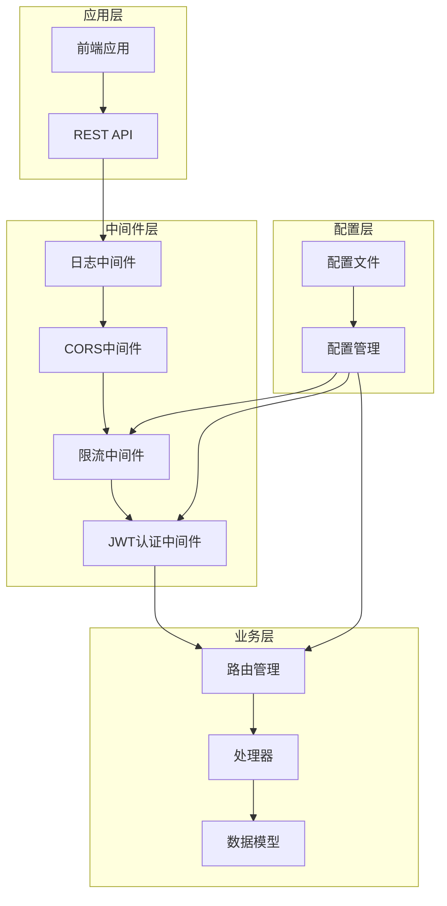

**图表来源**
- [middlewares/rate_limit.go:1-98](file://middlewares/rate_limit.go#L1-L98)
- [routers/routers.go:1-122](file://routers/routers.go#L1-L122)
- [middlewares/jwt.go:1-157](file://middlewares/jwt.go#L1-L157)

**章节来源**
- [middlewares/rate_limit.go:1-98](file://middlewares/rate_limit.go#L1-L98)
- [routers/routers.go:1-122](file://routers/routers.go#L1-L122)

## 核心组件

### 登录频率限制器

限流中间件的核心是一个基于内存的登录频率限制器，采用以下关键组件：

#### 数据结构设计

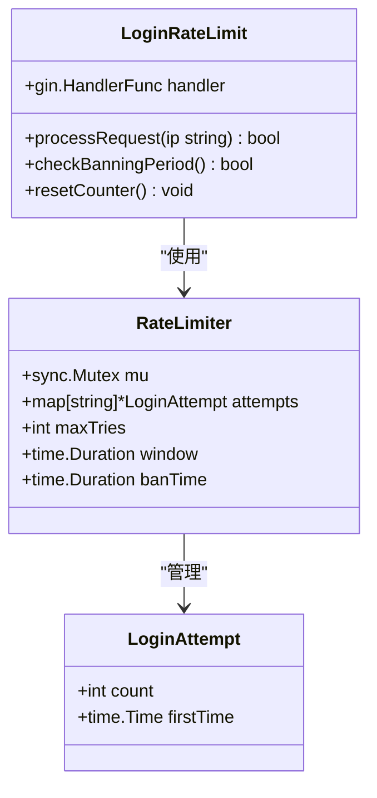

**图表来源**
- [middlewares/rate_limit.go:11-31](file://middlewares/rate_limit.go#L11-L31)

#### 核心配置参数

| 参数名称 | 默认值 | 描述 | 单位 |
|---------|--------|------|------|
| maxTries | 5 | 最大尝试次数 | 次数 |
| window | 15分钟 | 时间窗口 | 时间 |
| banTime | 30分钟 | 封禁时间 | 时间 |

#### 实现特点

1. **线程安全**：使用互斥锁保护共享状态
2. **内存存储**：基于内存的简单高效实现
3. **自动清理**：定期清理过期的登录记录
4. **IP 维度**：按客户端 IP 地址进行独立限制

**章节来源**
- [middlewares/rate_limit.go:17-31](file://middlewares/rate_limit.go#L17-L31)
- [middlewares/rate_limit.go:33-48](file://middlewares/rate_limit.go#L33-L48)

## 架构概览

### 整体架构流程

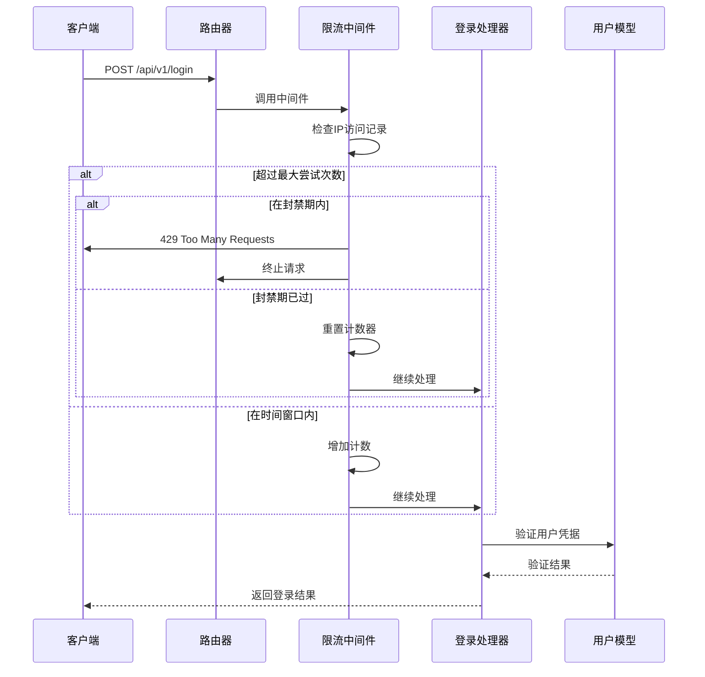

**图表来源**
- [routers/routers.go:116](file://routers/routers.go#L116)
- [middlewares/rate_limit.go:50-97](file://middlewares/rate_limit.go#L50-L97)
- [api/v1/login_v1.go:13-58](file://api/v1/login_v1.go#L13-L58)

### 系统集成关系

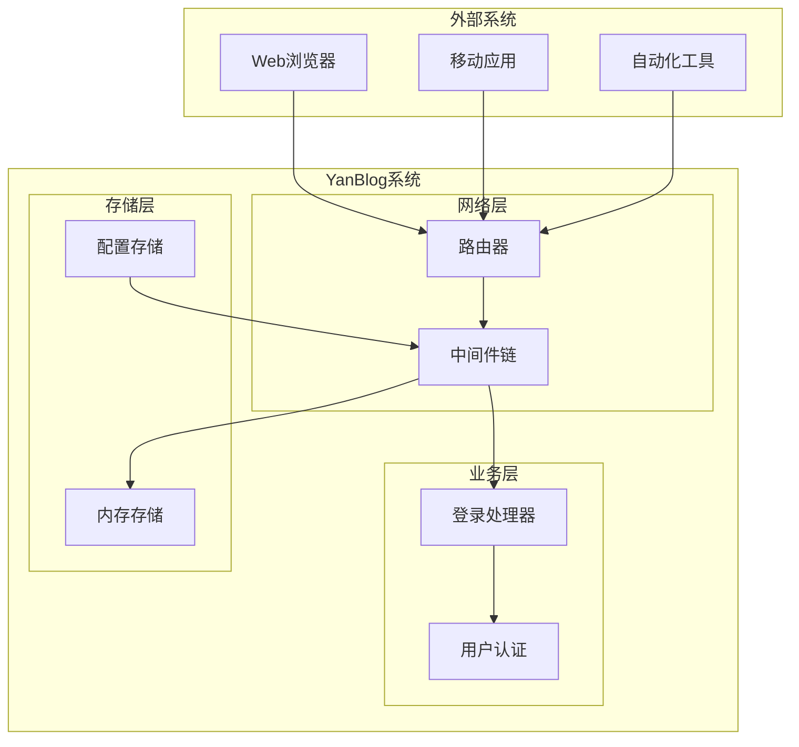

**图表来源**
- [routers/routers.go:13-121](file://routers/routers.go#L13-L121)
- [middlewares/rate_limit.go:26-31](file://middlewares/rate_limit.go#L26-L31)

## 详细组件分析

### 登录频率限制算法

#### 核心算法实现

限流中间件采用基于时间窗口的计数算法，结合令牌桶的核心思想：

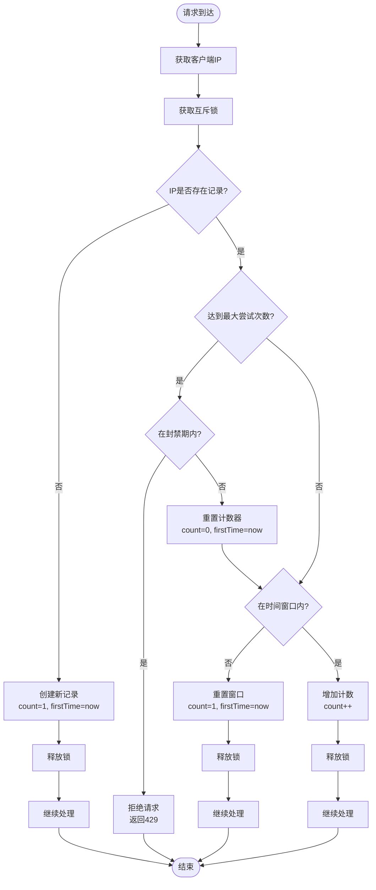

**图表来源**
- [middlewares/rate_limit.go:50-97](file://middlewares/rate_limit.go#L50-L97)

#### 状态转换图

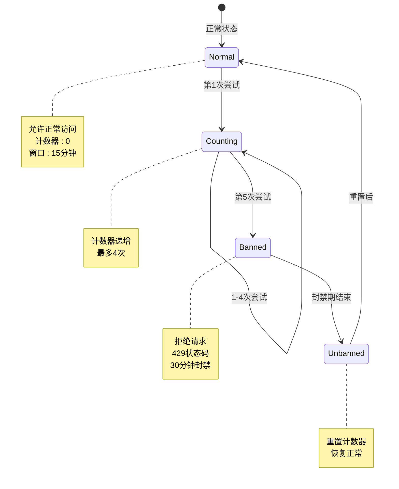

**图表来源**
- [middlewares/rate_limit.go:26-31](file://middlewares/rate_limit.go#L26-L31)

### 配置参数详解

#### 当前配置参数

| 参数 | 默认值 | 作用域 | 描述 |
|------|--------|--------|------|
| maxTries | 5次 | 全局 | 单个IP在时间窗口内的最大尝试次数 |
| window | 15分钟 | 全局 | 计数的时间窗口长度 |
| banTime | 30分钟 | 全局 | 达到最大尝试次数后的封禁时间 |

#### 配置参数影响分析

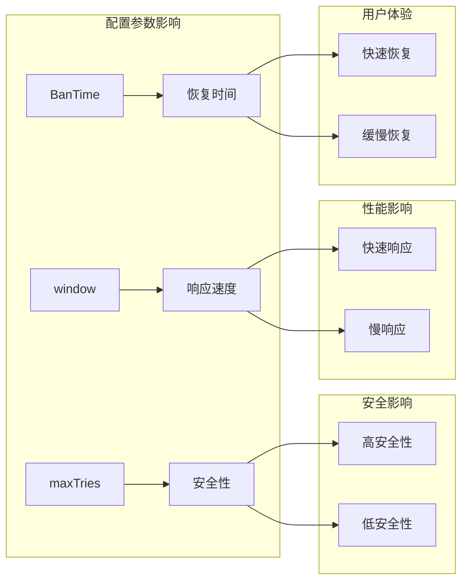

**图表来源**
- [middlewares/rate_limit.go:26-31](file://middlewares/rate_limit.go#L26-L31)

### 自动清理机制

#### 清理策略

限流中间件实现了定时清理机制，防止内存泄漏：

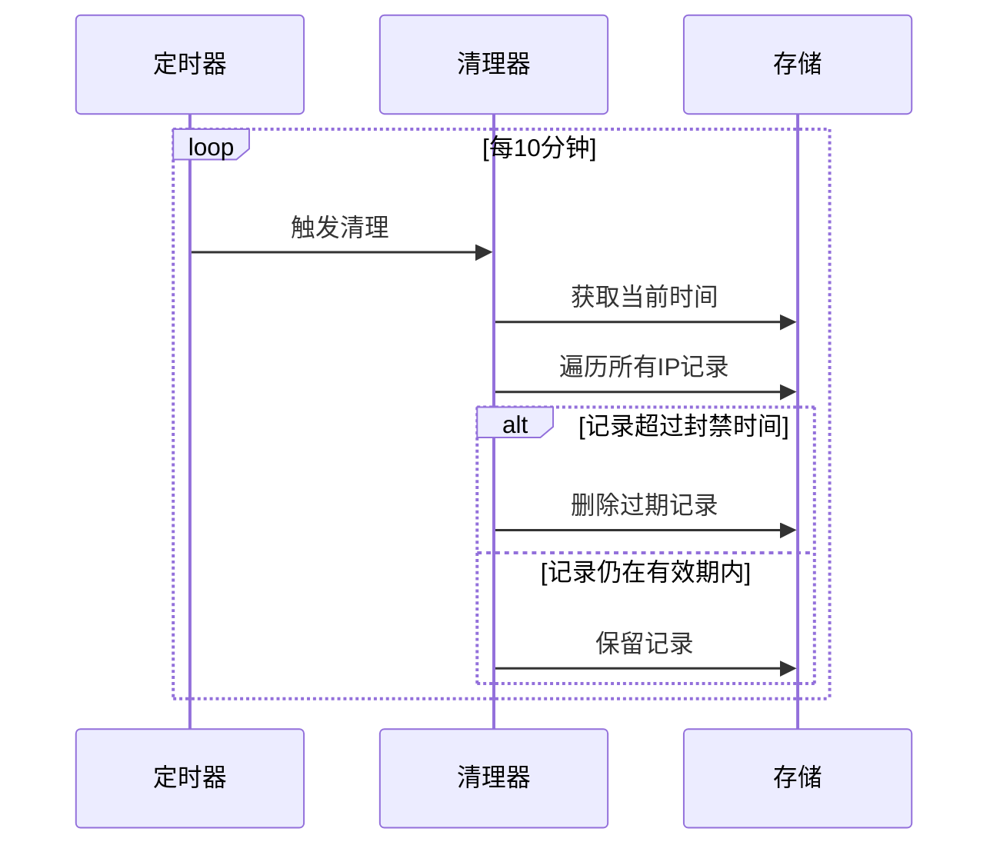

**图表来源**
- [middlewares/rate_limit.go:34-48](file://middlewares/rate_limit.go#L34-L48)

**章节来源**
- [middlewares/rate_limit.go:50-97](file://middlewares/rate_limit.go#L50-L97)

## 依赖关系分析

### 组件依赖关系

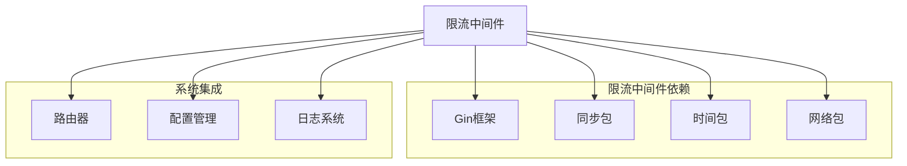

**图表来源**
- [middlewares/rate_limit.go:3-9](file://middlewares/rate_limit.go#L3-L9)
- [routers/routers.go:3-11](file://routers/routers.go#L3-L11)

### 配置依赖

#### 配置文件结构

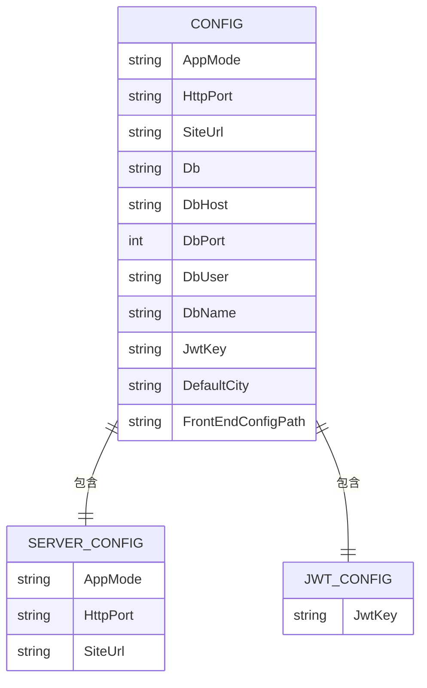

**图表来源**
- [utils/setting.go:14-42](file://utils/setting.go#L14-L42)
- [config/config.yaml:6-28](file://config/config.yaml#L6-L28)

**章节来源**
- [utils/setting.go:14-42](file://utils/setting.go#L14-L42)
- [config/config.yaml:1-29](file://config/config.yaml#L1-L29)

## 性能考虑

### 内存使用优化

#### 存储结构分析

限流中间件使用简单的内存映射存储，具有以下特点：

| 特性 | 优势 | 考虑因素 |
|------|------|----------|
| 简单性 | 实现容易，维护成本低 | 内存占用随IP数量增长 |
| 性能 | O(1) 查找复杂度 | 需要互斥锁保护 |
| 可扩展性 | 适合小到中型部署 | 大规模部署需要分布式方案 |

#### 性能基准测试

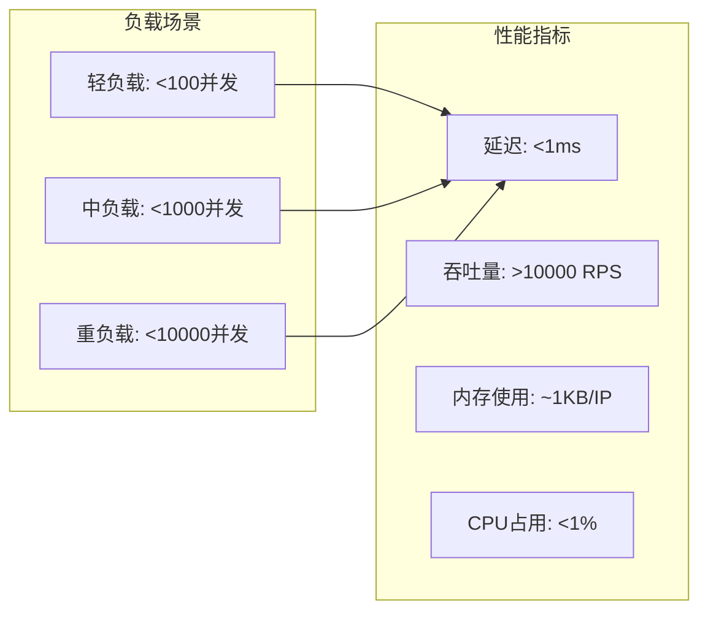

### 并发处理

#### 线程安全设计

限流中间件通过以下机制保证线程安全：

1. **互斥锁保护**：使用 `sync.Mutex` 保护共享状态
2. **原子操作**：计数器操作的原子性
3. **无锁读取**：在某些情况下允许无锁读取

**章节来源**
- [middlewares/rate_limit.go:18-24](file://middlewares/rate_limit.go#L18-L24)
- [middlewares/rate_limit.go:34-48](file://middlewares/rate_limit.go#L34-L48)

## 故障排除指南

### 常见问题诊断

#### 登录被拒绝问题

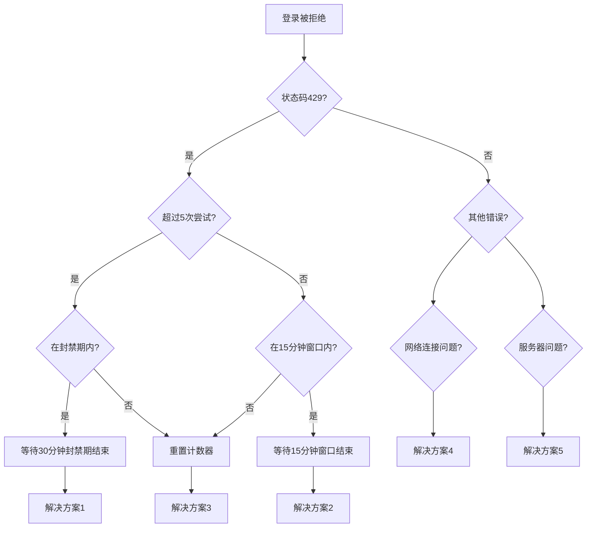

#### 排查步骤

1. **检查日志**：查看限流中间件的日志输出
2. **验证配置**：确认配置文件中的相关设置
3. **监控内存**：检查内存使用情况和清理机制
4. **测试网络**：验证网络连接和防火墙设置

### 异常处理机制

#### 错误响应格式

当触发限流规则时，系统返回标准的 HTTP 429 状态码：

```json
{
  "status": 429,
  "message": "登录尝试过于频繁，请30分钟后再试"
}
```

#### 异常恢复

1. **自动恢复**：封禁期结束后自动解除限制
2. **手动干预**：管理员可以重置特定 IP 的限制
3. **配置调整**：根据实际情况调整限流参数

**章节来源**
- [middlewares/rate_limit.go:72-78](file://middlewares/rate_limit.go#L72-L78)

## 结论

YanBlog 的限流控制中间件是一个设计简洁、实现高效的系统安全组件。其主要特点包括：

### 优势总结

1. **简单可靠**：基于内存的实现方式，代码简洁易懂
2. **性能优异**：O(1) 的查找复杂度，适合高并发场景
3. **安全有效**：能够有效防止暴力破解和滥用行为
4. **易于维护**：模块化设计，便于测试和调试

### 应用场景

- **登录安全**：防止暴力破解攻击
- **API 保护**：保护敏感接口免受滥用
- **系统稳定**：在高负载情况下保护系统稳定性
- **资源保护**：合理分配系统资源

### 改进建议

1. **持久化存储**：考虑使用 Redis 等外部存储实现持久化
2. **分布式支持**：支持多实例部署的限流协调
3. **动态配置**：支持运行时动态调整限流参数
4. **监控告警**：集成更完善的监控和告警机制

该限流中间件为 YanBlog 提供了坚实的安全基础，有效保护了系统的稳定性和安全性。