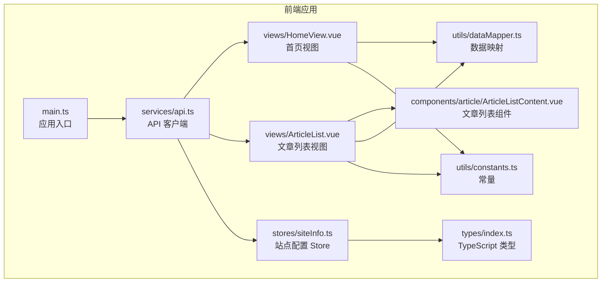
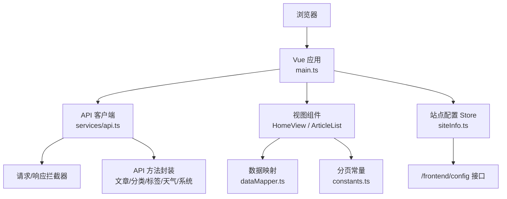
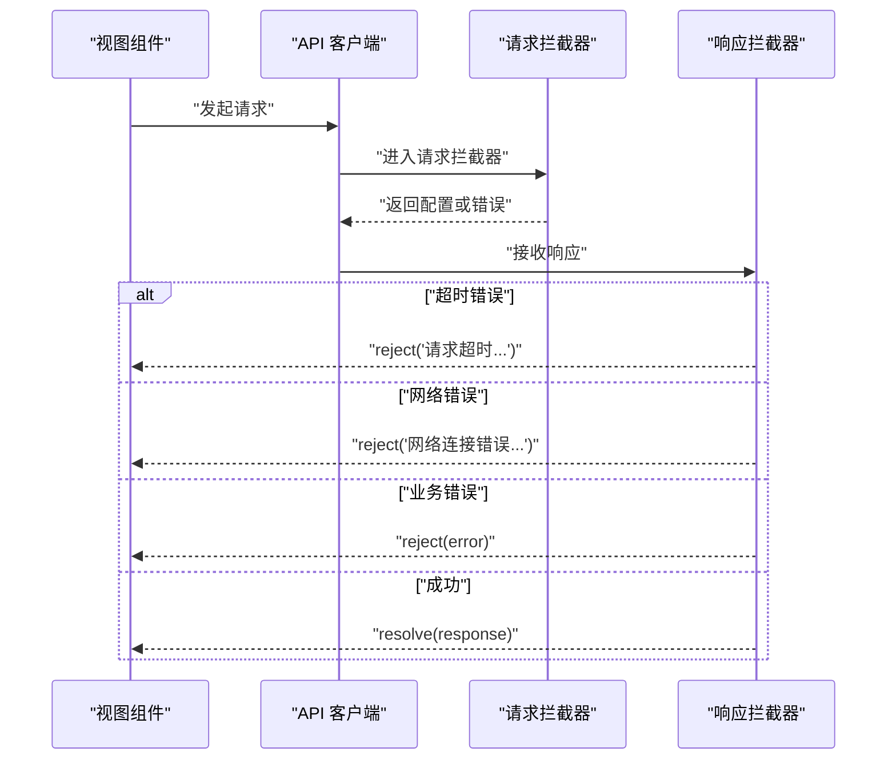
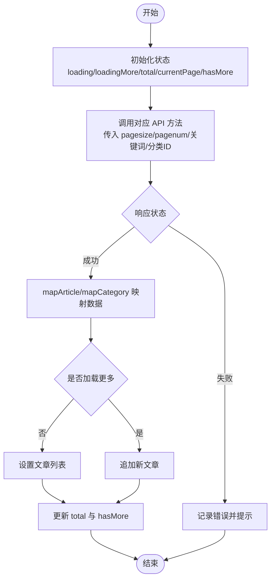
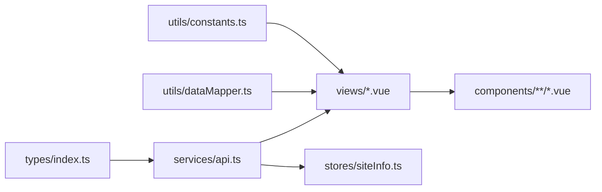

# API 集成

<cite>
**本文引用的文件**
- [web/frontend/src/services/api.ts](file://web/frontend/src/services/api.ts)
- [web/frontend/src/types/index.ts](file://web/frontend/src/types/index.ts)
- [web/frontend/src/stores/siteInfo.ts](file://web/frontend/src/stores/siteInfo.ts)
- [web/frontend/src/views/HomeView.vue](file://web/frontend/src/views/HomeView.vue)
- [web/frontend/src/views/ArticleList.vue](file://web/frontend/src/views/ArticleList.vue)
- [web/frontend/src/components/article/ArticleListContent.vue](file://web/frontend/src/components/article/ArticleListContent.vue)
- [web/frontend/src/utils/constants.ts](file://web/frontend/src/utils/constants.ts)
- [web/frontend/src/utils/dataMapper.ts](file://web/frontend/src/utils/dataMapper.ts)
- [web/frontend/src/main.ts](file://web/frontend/src/main.ts)
- [web/frontend/env.d.ts](file://web/frontend/env.d.ts)
- [web/frontend/package.json](file://web/frontend/package.json)
- [web/backend/src/utils/request.ts](file://web/backend/src/utils/request.ts)
- [web/backend/src/types/axios.d.ts](file://web/backend/src/types/axios.d.ts)
</cite>

## 目录
1. [简介](#简介)
2. [项目结构](#项目结构)
3. [核心组件](#核心组件)
4. [架构总览](#架构总览)
5. [详细组件分析](#详细组件分析)
6. [依赖分析](#依赖分析)
7. [性能考虑](#性能考虑)
8. [故障排查指南](#故障排查指南)
9. [结论](#结论)
10. [附录](#附录)

## 简介
本文件面向前台展示网站的 API 集成，系统性说明前端 API 客户端的封装与配置、请求/响应拦截器、错误处理与重试机制、数据类型与 TypeScript 接口规范、API 方法封装（GET/POST/PUT/DELETE）、分页数据获取与处理、缓存与预加载策略、以及基于环境变量的动态配置管理。文档同时提供最佳实践与扩展指南，帮助开发者快速集成与维护 API。

## 项目结构
前端 API 集成主要位于 web/frontend 目录，核心文件包括：
- API 客户端与方法封装：services/api.ts
- 类型定义：types/index.ts
- 站点配置与预加载：stores/siteInfo.ts
- 视图层调用示例：views/HomeView.vue、views/ArticleList.vue
- 组件内分页与滚动加载：components/article/ArticleListContent.vue
- 工具常量与数据映射：utils/constants.ts、utils/dataMapper.ts
- 应用入口与全局错误处理：main.ts、env.d.ts、package.json

图表来源
- [web/frontend/src/main.ts:1-28](file://web/frontend/src/main.ts#L1-L28)
- [web/frontend/src/services/api.ts:1-137](file://web/frontend/src/services/api.ts#L1-L137)
- [web/frontend/src/types/index.ts:1-71](file://web/frontend/src/types/index.ts#L1-L71)
- [web/frontend/src/stores/siteInfo.ts:1-261](file://web/frontend/src/stores/siteInfo.ts#L1-L261)
- [web/frontend/src/views/HomeView.vue:1-133](file://web/frontend/src/views/HomeView.vue#L1-L133)
- [web/frontend/src/views/ArticleList.vue:1-225](file://web/frontend/src/views/ArticleList.vue#L1-L225)
- [web/frontend/src/components/article/ArticleListContent.vue:1-266](file://web/frontend/src/components/article/ArticleListContent.vue#L1-L266)
- [web/frontend/src/utils/constants.ts:1-48](file://web/frontend/src/utils/constants.ts#L1-L48)
- [web/frontend/src/utils/dataMapper.ts:1-50](file://web/frontend/src/utils/dataMapper.ts#L1-L50)

章节来源
- [web/frontend/src/main.ts:1-28](file://web/frontend/src/main.ts#L1-L28)
- [web/frontend/src/services/api.ts:1-137](file://web/frontend/src/services/api.ts#L1-L137)
- [web/frontend/src/types/index.ts:1-71](file://web/frontend/src/types/index.ts#L1-L71)
- [web/frontend/src/stores/siteInfo.ts:1-261](file://web/frontend/src/stores/siteInfo.ts#L1-L261)
- [web/frontend/src/views/HomeView.vue:1-133](file://web/frontend/src/views/HomeView.vue#L1-L133)
- [web/frontend/src/views/ArticleList.vue:1-225](file://web/frontend/src/views/ArticleList.vue#L1-L225)
- [web/frontend/src/components/article/ArticleListContent.vue:1-266](file://web/frontend/src/components/article/ArticleListContent.vue#L1-L266)
- [web/frontend/src/utils/constants.ts:1-48](file://web/frontend/src/utils/constants.ts#L1-L48)
- [web/frontend/src/utils/dataMapper.ts:1-50](file://web/frontend/src/utils/dataMapper.ts#L1-L50)

## 核心组件
- API 客户端与拦截器
  - 基础配置：baseURL、超时、默认 Content-Type
  - 请求拦截器：日志记录与错误处理
  - 响应拦截器：超时、网络错误、业务错误统一处理
  - 取消请求：AbortController 包装，支持主动中断
- API 方法封装
  - 文章、分类、标签、天气、系统状态等模块化 API
  - 统一返回结构：Promise 包裹 axios 实例
- 类型系统
  - Article、Category、Tag、User、PaginatedResponse、ApiResponse、PaginationParams、SearchParams
- 分页与数据映射
  - 常量集中管理分页大小
  - 数据映射函数将后端字段映射为前端类型
- 站点配置与预加载
  - 优先从后端 API 获取 YAML 配置，失败回退到静态文件
  - 本地开发环境自动覆盖后台地址
  - 支持在线更新配置并持久化

章节来源
- [web/frontend/src/services/api.ts:1-137](file://web/frontend/src/services/api.ts#L1-L137)
- [web/frontend/src/types/index.ts:1-71](file://web/frontend/src/types/index.ts#L1-L71)
- [web/frontend/src/stores/siteInfo.ts:1-261](file://web/frontend/src/stores/siteInfo.ts#L1-L261)
- [web/frontend/src/utils/constants.ts:1-48](file://web/frontend/src/utils/constants.ts#L1-L48)
- [web/frontend/src/utils/dataMapper.ts:1-50](file://web/frontend/src/utils/dataMapper.ts#L1-L50)

## 架构总览
前端通过 axios 创建统一客户端，集中处理请求与响应拦截、错误处理与取消控制；视图层通过模块化的 API 方法访问后端接口；Pinia Store 负责站点配置的拉取、缓存与更新；组件层负责分页、滚动加载与 UI 展示。

图表来源
- [web/frontend/src/main.ts:1-28](file://web/frontend/src/main.ts#L1-L28)
- [web/frontend/src/services/api.ts:1-137](file://web/frontend/src/services/api.ts#L1-L137)
- [web/frontend/src/stores/siteInfo.ts:1-261](file://web/frontend/src/stores/siteInfo.ts#L1-L261)
- [web/frontend/src/views/HomeView.vue:1-133](file://web/frontend/src/views/HomeView.vue#L1-L133)
- [web/frontend/src/views/ArticleList.vue:1-225](file://web/frontend/src/views/ArticleList.vue#L1-L225)
- [web/frontend/src/utils/dataMapper.ts:1-50](file://web/frontend/src/utils/dataMapper.ts#L1-L50)
- [web/frontend/src/utils/constants.ts:1-48](file://web/frontend/src/utils/constants.ts#L1-L48)

## 详细组件分析

### API 客户端与拦截器
- 基础配置
  - baseURL 设为“/api/v1”，便于与后端路由前缀一致
  - 超时设置为 15 秒，避免长时间阻塞
  - 默认 JSON 内容类型
- 请求拦截器
  - 日志记录请求方法与 URL
  - 发生错误时统一 reject 并输出错误信息
- 响应拦截器
  - 超时错误（ECONNABORTED）统一提示“请求超时，请稍后重试”
  - 无响应（网络错误）统一提示“网络连接错误，请检查后端服务是否启动”
  - 其他错误透传，交由调用方处理
- 取消请求
  - createAbortController 提供 AbortController
  - requestWithCancel 包装 axios 请求，返回可 abort 的 Promise

图表来源
- [web/frontend/src/services/api.ts:28-64](file://web/frontend/src/services/api.ts#L28-L64)

章节来源
- [web/frontend/src/services/api.ts:1-137](file://web/frontend/src/services/api.ts#L1-L137)

### API 方法封装（GET/POST/PUT/DELETE）
- 文章相关
  - 获取文章列表、搜索、按分类筛选、详情、置顶、热门、相关、随机、相邻文章
- 分类相关
  - 获取分类列表与分类信息
- 标签相关
  - 获取标签列表
- 天气相关
  - 获取天气信息（可选城市参数）
- 系统状态
  - 获取系统状态信息
- 方法特点
  - 统一使用 apiClient 实例
  - 参数以对象形式传递，如分页参数 pagesize/pagenum、搜索关键字 keyword、分类 ID cid 等
  - 返回值为 axios Promise，调用方可直接 await 并解构 data

章节来源
- [web/frontend/src/services/api.ts:66-137](file://web/frontend/src/services/api.ts#L66-L137)

### 分页数据获取与处理
- 常量管理
  - DEFAULT_PAGE_SIZE、ARTICLE_LIST_PAGE_SIZE、HOME_PAGE_SIZE
- 首页分页
  - 置顶文章：一次性获取全部（num=-1）
  - 最新文章：第 1 页，根据 total 判断是否有更多
  - 加载更多：页码递增，追加新文章，更新 hasMore
- 文章列表分页
  - 支持三种筛选优先级：搜索 > 分类 > 全部
  - 每次筛选重置到第 1 页，清空历史数据
  - 使用 IntersectionObserver 触发“加载更多”
- 数据映射
  - mapArticle/mapCategory 将后端字段映射为前端类型，保证组件消费的一致性

图表来源
- [web/frontend/src/views/HomeView.vue:48-105](file://web/frontend/src/views/HomeView.vue#L48-L105)
- [web/frontend/src/views/ArticleList.vue:85-149](file://web/frontend/src/views/ArticleList.vue#L85-L149)
- [web/frontend/src/components/article/ArticleListContent.vue:102-136](file://web/frontend/src/components/article/ArticleListContent.vue#L102-L136)
- [web/frontend/src/utils/dataMapper.ts:1-50](file://web/frontend/src/utils/dataMapper.ts#L1-L50)
- [web/frontend/src/utils/constants.ts:14-19](file://web/frontend/src/utils/constants.ts#L14-L19)

章节来源
- [web/frontend/src/views/HomeView.vue:1-133](file://web/frontend/src/views/HomeView.vue#L1-L133)
- [web/frontend/src/views/ArticleList.vue:1-225](file://web/frontend/src/views/ArticleList.vue#L1-L225)
- [web/frontend/src/components/article/ArticleListContent.vue:1-266](file://web/frontend/src/components/article/ArticleListContent.vue#L1-L266)
- [web/frontend/src/utils/constants.ts:1-48](file://web/frontend/src/utils/constants.ts#L1-L48)
- [web/frontend/src/utils/dataMapper.ts:1-50](file://web/frontend/src/utils/dataMapper.ts#L1-L50)

### 错误处理与用户提示
- 拦截器层面
  - 超时：统一提示“请求超时，请稍后重试”
  - 网络错误：统一提示“网络连接错误，请检查后端服务是否启动”
  - 业务错误：透传后端 message，交由调用方处理
- 视图层处理
  - try/catch 包裹 API 调用，记录错误并停止 loading
  - 首页与列表页分别设置 topLoading/latestLoading/loadingMore 控制加载态
- 全局错误处理
  - 应用入口设置 errorHandler，捕获组件异常，避免白屏

章节来源
- [web/frontend/src/services/api.ts:28-64](file://web/frontend/src/services/api.ts#L28-L64)
- [web/frontend/src/views/HomeView.vue:48-105](file://web/frontend/src/views/HomeView.vue#L48-L105)
- [web/frontend/src/views/ArticleList.vue:85-149](file://web/frontend/src/views/ArticleList.vue#L85-L149)
- [web/frontend/src/main.ts:21-26](file://web/frontend/src/main.ts#L21-L26)

### 数据类型与 TypeScript 接口规范
- 基础类型
  - Article：id、title、categoryId、categoryName、desc、content、img、top、tags、views、pdf_url、createdAt、updatedAt
  - Category：id、name
  - Tag：id、name
  - User：id、username、role、createdAt、updatedAt
- 响应类型
  - PaginatedResponse<T>：data[]、total、status、message
  - ApiResponse<T>：status、data、message
- 参数类型
  - PaginationParams：pagesize、pagenum
  - SearchParams：继承 PaginationParams，增加 keyword、cid

章节来源
- [web/frontend/src/types/index.ts:1-71](file://web/frontend/src/types/index.ts#L1-L71)

### 缓存策略与数据预加载
- 站点配置预加载
  - 首次访问尝试从 /frontend/config 拉取 YAML 配置
  - 若失败则回退到静态 /config.yaml
  - 本地开发环境自动将 admin_url 覆盖为 /admin
  - 支持 PUT /frontend/config 在线更新配置
- 预加载与刷新
  - 提供 refreshConfig 用于手动刷新配置
- 前端缓存建议
  - 首页热门/置顶文章可在 Store 中缓存，减少重复请求
  - 文章详情与相邻文章可按 ID 缓存，避免重复查询

章节来源
- [web/frontend/src/stores/siteInfo.ts:189-253](file://web/frontend/src/stores/siteInfo.ts#L189-L253)

### 环境变量与动态配置
- Vite 环境类型声明
  - env.d.ts 声明 Vite 环境类型，确保类型安全
- 依赖与运行时
  - package.json 指定 Node 版本与依赖，确保构建与运行一致性
- 后端 API 客户端（对比参考）
  - 后端同样使用 axios，设置 baseURL 为 /api，并在请求头注入 Authorization
  - 响应拦截器根据后端约定 status=200 透传数据，否则 reject message

章节来源
- [web/frontend/env.d.ts:1-2](file://web/frontend/env.d.ts#L1-L2)
- [web/frontend/package.json:1-45](file://web/frontend/package.json#L1-L45)
- [web/backend/src/utils/request.ts:1-51](file://web/backend/src/utils/request.ts#L1-L51)
- [web/backend/src/types/axios.d.ts:1-15](file://web/backend/src/types/axios.d.ts#L1-L15)

## 依赖分析
- 组件耦合
  - 视图层仅依赖 services/api.ts 的命名空间导出，低耦合
  - stores 与 services 解耦，通过 apiClient 间接通信
- 外部依赖
  - axios：HTTP 客户端
  - js-yaml：站点配置解析
  - element-plus、vue、vue-router、pinia：UI 与状态管理
- 潜在循环依赖
  - 当前结构清晰，未发现循环导入

图表来源
- [web/frontend/src/types/index.ts:1-71](file://web/frontend/src/types/index.ts#L1-L71)
- [web/frontend/src/services/api.ts:1-137](file://web/frontend/src/services/api.ts#L1-L137)
- [web/frontend/src/utils/constants.ts:1-48](file://web/frontend/src/utils/constants.ts#L1-L48)
- [web/frontend/src/utils/dataMapper.ts:1-50](file://web/frontend/src/utils/dataMapper.ts#L1-L50)
- [web/frontend/src/views/HomeView.vue:1-133](file://web/frontend/src/views/HomeView.vue#L1-L133)
- [web/frontend/src/views/ArticleList.vue:1-225](file://web/frontend/src/views/ArticleList.vue#L1-L225)
- [web/frontend/src/components/article/ArticleListContent.vue:1-266](file://web/frontend/src/components/article/ArticleListContent.vue#L1-L266)
- [web/frontend/src/stores/siteInfo.ts:1-261](file://web/frontend/src/stores/siteInfo.ts#L1-L261)

章节来源
- [web/frontend/src/services/api.ts:1-137](file://web/frontend/src/services/api.ts#L1-L137)
- [web/frontend/src/views/HomeView.vue:1-133](file://web/frontend/src/views/HomeView.vue#L1-L133)
- [web/frontend/src/views/ArticleList.vue:1-225](file://web/frontend/src/views/ArticleList.vue#L1-L225)
- [web/frontend/src/components/article/ArticleListContent.vue:1-266](file://web/frontend/src/components/article/ArticleListContent.vue#L1-L266)
- [web/frontend/src/stores/siteInfo.ts:1-261](file://web/frontend/src/stores/siteInfo.ts#L1-L261)
- [web/frontend/src/utils/constants.ts:1-48](file://web/frontend/src/utils/constants.ts#L1-L48)
- [web/frontend/src/utils/dataMapper.ts:1-50](file://web/frontend/src/utils/dataMapper.ts#L1-L50)
- [web/frontend/src/types/index.ts:1-71](file://web/frontend/src/types/index.ts#L1-L71)

## 性能考虑
- 请求取消
  - 使用 AbortController 主动中断不再需要的请求，避免资源浪费
- 分页与懒加载
  - IntersectionObserver 触发加载更多，减少不必要的请求
  - 骨架屏提升感知性能，改善首屏体验
- 缓存策略
  - 热门/置顶文章与分类列表可缓存，降低后端压力
  - 配置项采用预加载与本地覆盖，减少二次请求
- 超时与重试
  - 建议在调用层对幂等请求增加有限重试（如 1-2 次），结合错误分类与指数退避

## 故障排查指南
- 常见问题
  - “请求超时”：检查 baseURL 与代理配置，确认后端可达
  - “网络连接错误”：确认后端服务已启动，跨域配置正确
  - “业务错误”：查看后端返回 message，定位具体业务异常
- 调试建议
  - 在请求拦截器中开启日志，记录 method、url、params
  - 在视图层打印响应 data 结构，核对字段映射
  - 使用浏览器 Network 面板观察请求与响应状态码
- 错误处理
  - 全局 errorHandler 捕获组件异常，避免白屏
  - Store 中对配置拉取失败进行降级处理

章节来源
- [web/frontend/src/services/api.ts:28-64](file://web/frontend/src/services/api.ts#L28-L64)
- [web/frontend/src/main.ts:21-26](file://web/frontend/src/main.ts#L21-L26)
- [web/frontend/src/stores/siteInfo.ts:189-253](file://web/frontend/src/stores/siteInfo.ts#L189-L253)

## 结论
该前端 API 集成方案以 axios 为核心，通过统一客户端、拦截器与类型系统，实现了清晰的请求/响应处理、完善的错误提示与取消控制；配合分页与数据映射，满足首页与文章列表的高性能展示需求；站点配置的预加载与动态更新进一步提升了可用性。建议在现有基础上引入有限重试与缓存优化，以增强稳定性与用户体验。

## 附录
- 最佳实践
  - 为每个 API 方法添加明确的 TypeScript 参数与返回类型
  - 在视图层统一处理 loading 与错误状态，避免重复逻辑
  - 对热点数据（如热门文章、分类列表）实施缓存策略
  - 使用 AbortController 管理并发请求，及时取消无用请求
- 扩展指南
  - 新增 API：在 services/api.ts 中新增命名空间方法，遵循现有命名与参数风格
  - 新增类型：在 types/index.ts 中补充接口定义，保持前后端一致
  - 新增视图：参考 HomeView 与 ArticleList 的分页与加载更多模式
  - 配置扩展：在 stores/siteInfo.ts 中扩展 SiteInfo 接口与 fetch/update 流程