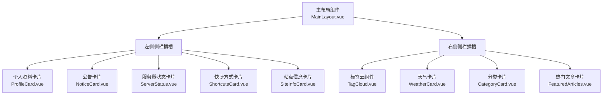
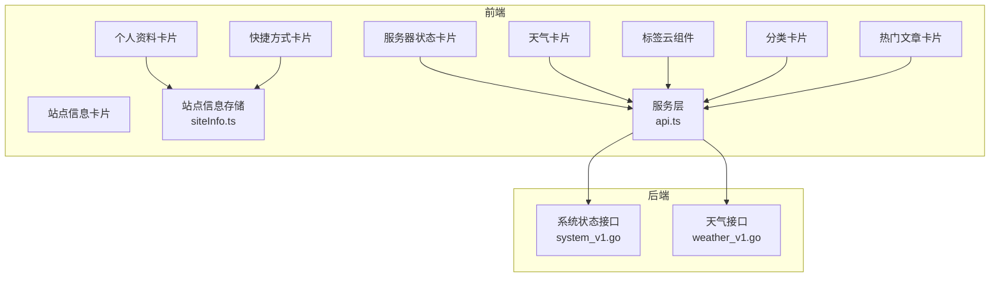
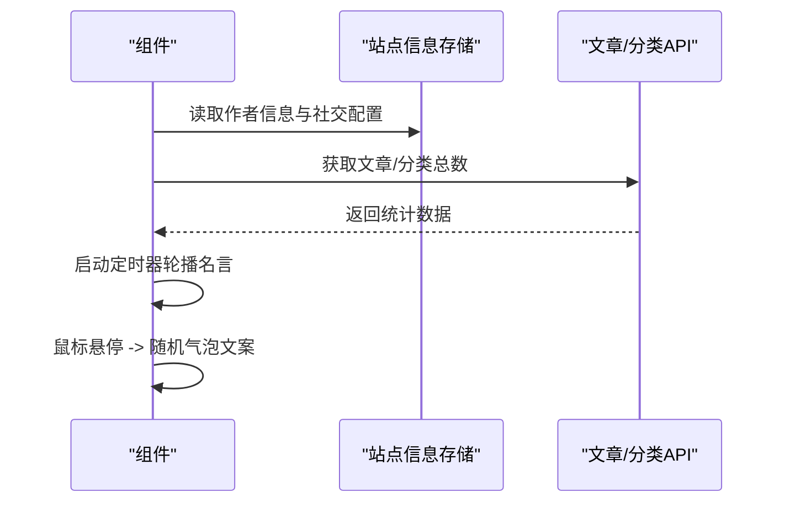
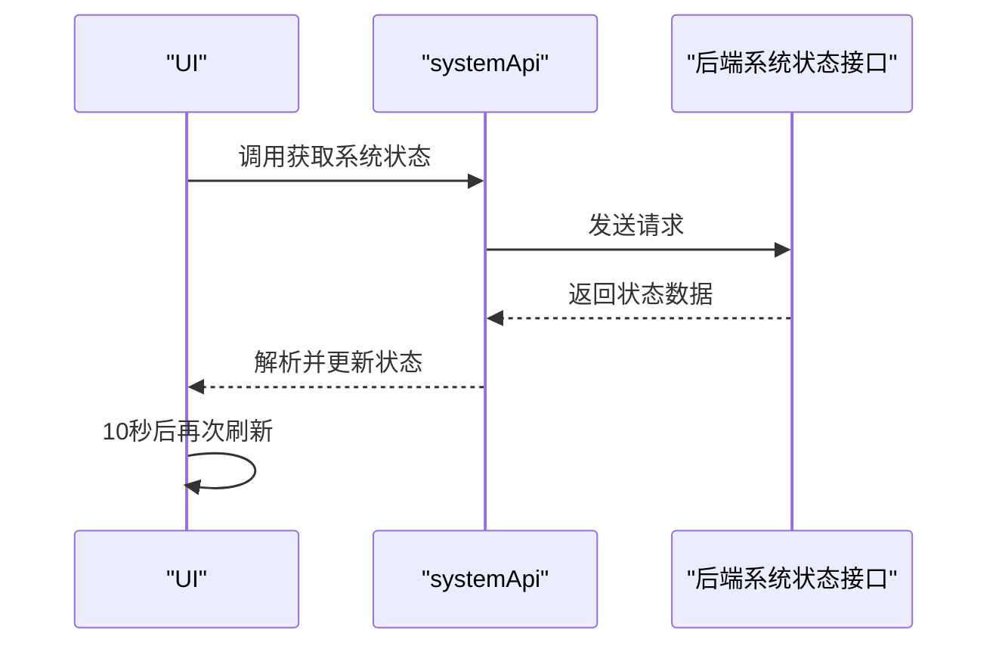
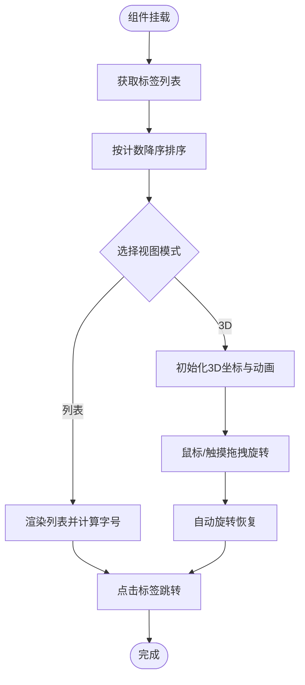
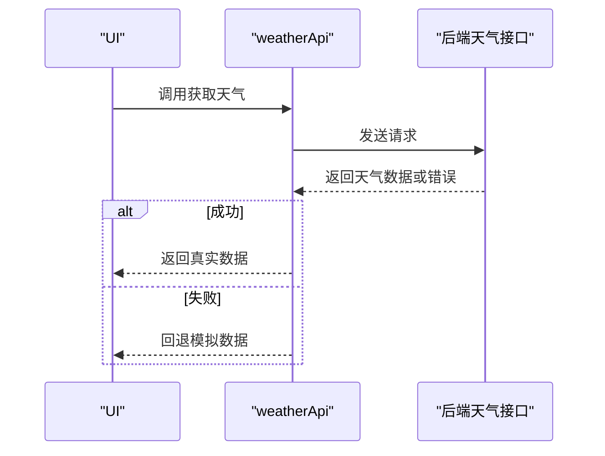
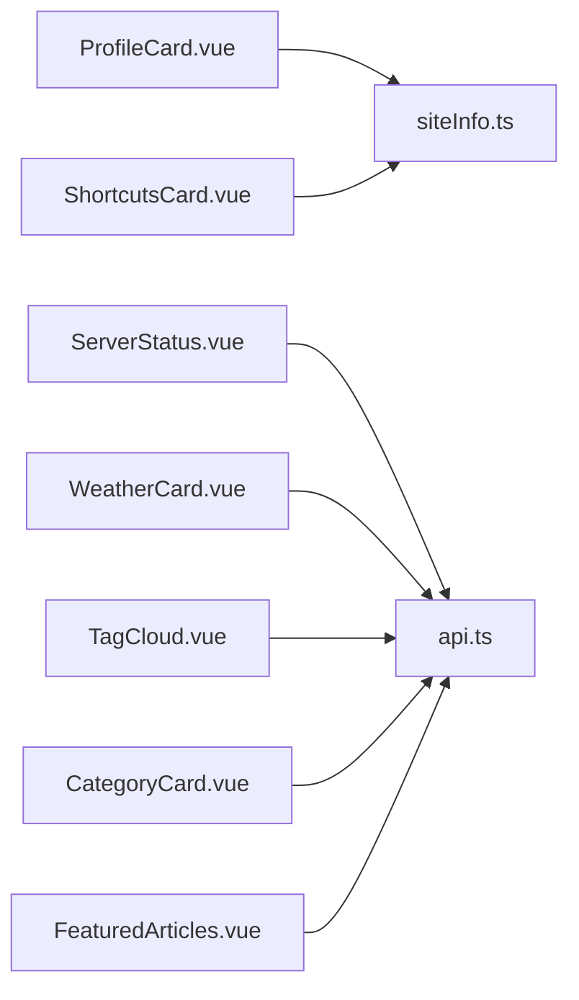

# 侧边栏组件

<cite>
**本文引用的文件**
- [ProfileCard.vue](file://web/frontend/src/components/sidebar/ProfileCard.vue)
- [NoticeCard.vue](file://web/frontend/src/components/sidebar/NoticeCard.vue)
- [ServerStatus.vue](file://web/frontend/src/components/sidebar/ServerStatus.vue)
- [ShortcutsCard.vue](file://web/frontend/src/components/sidebar/ShortcutsCard.vue)
- [SiteInfoCard.vue](file://web/frontend/src/components/sidebar/SiteInfoCard.vue)
- [TagCloud.vue](file://web/frontend/src/components/sidebar/TagCloud.vue)
- [WeatherCard.vue](file://web/frontend/src/components/sidebar/WeatherCard.vue)
- [CategoryCard.vue](file://web/frontend/src/components/sidebar/CategoryCard.vue)
- [FeaturedArticles.vue](file://web/frontend/src/components/sidebar/FeaturedArticles.vue)
- [MainLayout.vue](file://web/frontend/src/components/layout/MainLayout.vue)
- [api.ts](file://web/frontend/src/services/api.ts)
- [siteInfo.ts](file://web/frontend/src/stores/siteInfo.ts)
- [system_v1.go](file://api/v1/system_v1.go)
- [weather_v1.go](file://api/v1/weather_v1.go)
</cite>

## 目录
1. [简介](#简介)
2. [项目结构](#项目结构)
3. [核心组件](#核心组件)
4. [架构总览](#架构总览)
5. [详细组件分析](#详细组件分析)
6. [依赖关系分析](#依赖关系分析)
7. [性能考量](#性能考量)
8. [故障排查指南](#故障排查指南)
9. [结论](#结论)
10. [附录](#附录)

## 简介
本文件面向前台展示网站的侧边栏组件，系统性梳理各卡片组件的功能、数据流与交互机制，并提供布局与响应式适配建议、缓存与更新策略以及扩展与定制指南。重点覆盖以下组件：
- 个人资料卡片：头像、社交链接、统计信息、名言轮播与悬停气泡
- 公告卡片：内容占位与样式
- 服务器状态卡片：系统监控指标展示与定时刷新
- 快捷方式卡片：外部链接与图标配置
- 站点信息卡片：基础统计信息
- 标签云组件：权重计算、列表/3D视图、交互与动画
- 天气卡片：实时数据获取与降级策略
- 分类卡片与热门文章卡片：内容聚合与导航

## 项目结构
侧边栏组件位于前端工程的侧边栏目录下，统一采用卡片式布局；整体布局由主布局组件控制左右侧栏的宽度、粘性定位与响应式断点。

**图表来源**
- [MainLayout.vue:1-130](file://web/frontend/src/components/layout/MainLayout.vue#L1-L130)
- [ProfileCard.vue:1-333](file://web/frontend/src/components/sidebar/ProfileCard.vue#L1-L333)
- [NoticeCard.vue:1-25](file://web/frontend/src/components/sidebar/NoticeCard.vue#L1-L25)
- [ServerStatus.vue:1-205](file://web/frontend/src/components/sidebar/ServerStatus.vue#L1-L205)
- [ShortcutsCard.vue:1-95](file://web/frontend/src/components/sidebar/ShortcutsCard.vue#L1-L95)
- [SiteInfoCard.vue:1-62](file://web/frontend/src/components/sidebar/SiteInfoCard.vue#L1-L62)
- [TagCloud.vue:1-718](file://web/frontend/src/components/sidebar/TagCloud.vue#L1-L718)
- [WeatherCard.vue:1-245](file://web/frontend/src/components/sidebar/WeatherCard.vue#L1-L245)
- [CategoryCard.vue:1-115](file://web/frontend/src/components/sidebar/CategoryCard.vue#L1-L115)
- [FeaturedArticles.vue:1-262](file://web/frontend/src/components/sidebar/FeaturedArticles.vue#L1-L262)

**章节来源**
- [MainLayout.vue:1-130](file://web/frontend/src/components/layout/MainLayout.vue#L1-L130)

## 核心组件
- 个人资料卡片：展示作者头像、简介、社交链接、文章/分类统计与名言轮播；支持悬停气泡提示。
- 公告卡片：基础公告展示区域。
- 服务器状态卡片：周期性拉取系统状态并可视化展示内存/CPU/磁盘使用率。
- 快捷方式卡片：基于站点配置渲染外部链接与图标。
- 站点信息卡片：展示站点运行天数等静态统计。
- 标签云组件：支持列表与3D视图，按标签计数计算字号权重，提供交互旋转与连线绘制。
- 天气卡片：优先调用后端天气接口，失败时回退到本地模拟数据。
- 分类卡片与热门文章卡片：内容聚合与路由跳转。

**章节来源**
- [ProfileCard.vue:1-333](file://web/frontend/src/components/sidebar/ProfileCard.vue#L1-L333)
- [NoticeCard.vue:1-25](file://web/frontend/src/components/sidebar/NoticeCard.vue#L1-L25)
- [ServerStatus.vue:1-205](file://web/frontend/src/components/sidebar/ServerStatus.vue#L1-L205)
- [ShortcutsCard.vue:1-95](file://web/frontend/src/components/sidebar/ShortcutsCard.vue#L1-L95)
- [SiteInfoCard.vue:1-62](file://web/frontend/src/components/sidebar/SiteInfoCard.vue#L1-L62)
- [TagCloud.vue:1-718](file://web/frontend/src/components/sidebar/TagCloud.vue#L1-L718)
- [WeatherCard.vue:1-245](file://web/frontend/src/components/sidebar/WeatherCard.vue#L1-L245)
- [CategoryCard.vue:1-115](file://web/frontend/src/components/sidebar/CategoryCard.vue#L1-L115)
- [FeaturedArticles.vue:1-262](file://web/frontend/src/components/sidebar/FeaturedArticles.vue#L1-L262)

## 架构总览
侧边栏组件通过 Pinia 状态管理共享站点配置，通过统一的服务层发起 API 请求，后端提供系统状态与天气接口。

**图表来源**
- [siteInfo.ts](file://web/frontend/src/stores/siteInfo.ts)
- [api.ts](file://web/frontend/src/services/api.ts)
- [system_v1.go](file://api/v1/system_v1.go)
- [weather_v1.go](file://api/v1/weather_v1.go)

## 详细组件分析

### 个人资料卡片
- 数据来源：Pinia 站点信息存储、文章/分类数量 API。
- 展示内容：头像、作者名、简介、社交链接、文章/分类统计、名言轮播与悬停气泡。
- 交互机制：定时器驱动名言轮播；悬停触发随机气泡文案；离开隐藏气泡。
- 性能注意：卸载时清理定时器，避免内存泄漏。

**图表来源**
- [ProfileCard.vue:58-125](file://web/frontend/src/components/sidebar/ProfileCard.vue#L58-L125)

**章节来源**
- [ProfileCard.vue:1-333](file://web/frontend/src/components/sidebar/ProfileCard.vue#L1-L333)

### 公告卡片
- 当前实现为静态占位，可替换为动态内容或轮播展示。

**章节来源**
- [NoticeCard.vue:1-25](file://web/frontend/src/components/sidebar/NoticeCard.vue#L1-L25)

### 服务器状态卡片
- 数据来源：系统状态接口，周期性刷新（每10秒）。
- 可视化：内存/CPU/磁盘使用率进度条，带颜色区分。
- 错误处理：失败时显示错误消息与重试按钮；演示场景下可回退到模拟数据。

**图表来源**
- [ServerStatus.vue:66-108](file://web/frontend/src/components/sidebar/ServerStatus.vue#L66-L108)
- [system_v1.go](file://api/v1/system_v1.go)

**章节来源**
- [ServerStatus.vue:1-205](file://web/frontend/src/components/sidebar/ServerStatus.vue#L1-L205)

### 快捷方式卡片
- 数据来源：Pinia 站点信息存储中的快捷方式数组。
- 展示：图标、颜色块与名称，点击跳转至目标链接。

**章节来源**
- [ShortcutsCard.vue:1-95](file://web/frontend/src/components/sidebar/ShortcutsCard.vue#L1-L95)
- [siteInfo.ts](file://web/frontend/src/stores/siteInfo.ts)

### 站点信息卡片
- 展示：文章总数、建站天数、全站字数、最后更新时间。
- 建站天数：基于固定起始日期计算至今的天数。

**章节来源**
- [SiteInfoCard.vue:1-62](file://web/frontend/src/components/sidebar/SiteInfoCard.vue#L1-L62)

### 标签云组件
- 数据来源：标签列表 API，排序后按计数映射字号。
- 视图模式：
  - 列表视图：支持“查看更多”展开/收起。
  - 3D 视图：斐波那契球分布初始化，Canvas 绘制到标签的连线，鼠标/触摸拖拽旋转，自动旋转恢复。
- 权重计算：根据标签出现次数映射到固定字号档位。
- 交互：点击标签跳转到对应关键词的文章列表页。

**图表来源**
- [TagCloud.vue:372-446](file://web/frontend/src/components/sidebar/TagCloud.vue#L372-L446)

**章节来源**
- [TagCloud.vue:1-718](file://web/frontend/src/components/sidebar/TagCloud.vue#L1-L718)

### 天气卡片
- 数据来源：天气接口；失败时回退到本地模拟数据。
- 展示：城市、温度、天气描述与风力、湿度等细节。
- 主题适配：深色主题下的全局样式覆盖。

**图表来源**
- [WeatherCard.vue:63-96](file://web/frontend/src/components/sidebar/WeatherCard.vue#L63-L96)
- [weather_v1.go](file://api/v1/weather_v1.go)

**章节来源**
- [WeatherCard.vue:1-245](file://web/frontend/src/components/sidebar/WeatherCard.vue#L1-L245)

### 分类卡片与热门文章卡片
- 分类卡片：展示分类网格，点击进入分类详情。
- 热门文章卡片：骨架屏加载、错误重试、空态提示；点击跳转文章详情。

**章节来源**
- [CategoryCard.vue:1-115](file://web/frontend/src/components/sidebar/CategoryCard.vue#L1-L115)
- [FeaturedArticles.vue:1-262](file://web/frontend/src/components/sidebar/FeaturedArticles.vue#L1-L262)

## 依赖关系分析
- 组件间耦合：侧边栏组件彼此独立，主要通过 Pinia 存储与服务层 API 间接耦合。
- 外部依赖：后端系统状态与天气接口；图标字体库。
- 可能的循环依赖：无直接文件级循环导入。

**图表来源**
- [ProfileCard.vue:58-65](file://web/frontend/src/components/sidebar/ProfileCard.vue#L58-L65)
- [ShortcutsCard.vue:19-25](file://web/frontend/src/components/sidebar/ShortcutsCard.vue#L19-L25)
- [ServerStatus.vue:33-35](file://web/frontend/src/components/sidebar/ServerStatus.vue#L33-L35)
- [WeatherCard.vue:47-49](file://web/frontend/src/components/sidebar/WeatherCard.vue#L47-L49)
- [TagCloud.vue:85-87](file://web/frontend/src/components/sidebar/TagCloud.vue#L85-L87)
- [CategoryCard.vue:23-25](file://web/frontend/src/components/sidebar/CategoryCard.vue#L23-L25)
- [FeaturedArticles.vue:49-51](file://web/frontend/src/components/sidebar/FeaturedArticles.vue#L49-L51)

## 性能考量
- 定时器与生命周期：个人资料卡片与服务器状态卡片均使用定时器，需在卸载阶段清理，避免内存泄漏。
- 3D 动画：标签云的 3D 视图使用 requestAnimationFrame 与 Canvas 绘制，建议在不可见时暂停动画以节省资源。
- 网络请求：服务器状态与天气卡片应避免频繁请求，当前实现已设置刷新间隔；标签云与热门文章提供重试按钮。
- 响应式：主布局组件已提供多断点适配，侧边栏卡片在窄屏下自动换列或单列显示。

**章节来源**
- [ProfileCard.vue:121-125](file://web/frontend/src/components/sidebar/ProfileCard.vue#L121-L125)
- [ServerStatus.vue:106-108](file://web/frontend/src/components/sidebar/ServerStatus.vue#L106-L108)
- [TagCloud.vue:262-273](file://web/frontend/src/components/sidebar/TagCloud.vue#L262-L273)
- [MainLayout.vue:85-129](file://web/frontend/src/components/layout/MainLayout.vue#L85-L129)

## 故障排查指南
- 服务器状态卡片
  - 症状：持续显示错误或不更新
  - 排查：确认后端系统状态接口可用；检查网络拦截器与跨域配置；观察错误消息与重试按钮是否生效
- 天气卡片
  - 症状：始终显示模拟数据
  - 排查：确认后端天气接口可达；检查接口返回格式；确认服务层封装正确
- 标签云组件
  - 症状：3D 视图不旋转或连线异常
  - 排查：确认容器尺寸变化后的 Canvas 尺寸同步；检查 requestAnimationFrame 是否被暂停；验证标签计数与字号映射
- 个人资料卡片
  - 症状：名言不轮播或气泡不显示
  - 排查：确认定时器存在且未被清理；检查站点配置中的名言数组是否为空

**章节来源**
- [ServerStatus.vue:24-28](file://web/frontend/src/components/sidebar/ServerStatus.vue#L24-L28)
- [WeatherCard.vue:63-96](file://web/frontend/src/components/sidebar/WeatherCard.vue#L63-L96)
- [TagCloud.vue:154-161](file://web/frontend/src/components/sidebar/TagCloud.vue#L154-L161)
- [ProfileCard.vue:87-93](file://web/frontend/src/components/sidebar/ProfileCard.vue#L87-L93)

## 结论
侧边栏组件以卡片形式组织，职责清晰、耦合度低，具备良好的可维护性与扩展性。通过 Pinia 管理站点配置、通过服务层统一封装 API 请求，配合主布局的响应式设计，可在桌面与移动端提供一致体验。建议在生产环境中完善错误上报与埋点，优化 3D 动画在后台时的资源占用，并对关键接口增加缓存策略以提升性能。

## 附录

### 布局调整与响应式适配
- 左右侧栏宽度与粘性定位在主布局中定义，支持多断点自适应。
- 在窄屏下侧栏会变为横向滚动或单列显示，确保内容可读性。

**章节来源**
- [MainLayout.vue:65-129](file://web/frontend/src/components/layout/MainLayout.vue#L65-L129)

### 缓存策略与更新机制
- 服务器状态与天气卡片：通过定时器定期刷新，失败时保留上次成功状态或回退模拟数据。
- 标签云与热门文章：提供重试按钮，骨架屏提升加载体验。
- 个人资料卡片：文章/分类统计一次性获取，名言轮播独立定时器。

**章节来源**
- [ServerStatus.vue:100-108](file://web/frontend/src/components/sidebar/ServerStatus.vue#L100-L108)
- [WeatherCard.vue:63-96](file://web/frontend/src/components/sidebar/WeatherCard.vue#L63-L96)
- [TagCloud.vue:372-412](file://web/frontend/src/components/sidebar/TagCloud.vue#L372-L412)
- [FeaturedArticles.vue:77-111](file://web/frontend/src/components/sidebar/FeaturedArticles.vue#L77-L111)
- [ProfileCard.vue:95-119](file://web/frontend/src/components/sidebar/ProfileCard.vue#L95-L119)

### 扩展与定制指南
- 新增卡片
  - 建议遵循现有卡片结构：统一的头部、内容区与样式命名空间
  - 使用服务层 API 或 Pinia 存储进行数据接入
- 个性化配置
  - 快捷方式与社交链接：通过站点配置存储进行管理
  - 标签云：可扩展更多视图模式或交互行为
- 主题与样式
  - 使用 CSS 变量与深色主题适配，确保在不同主题下可读性良好

**章节来源**
- [ShortcutsCard.vue:19-25](file://web/frontend/src/components/sidebar/ShortcutsCard.vue#L19-L25)
- [TagCloud.vue:140-152](file://web/frontend/src/components/sidebar/TagCloud.vue#L140-L152)
- [WeatherCard.vue:102-122](file://web/frontend/src/components/sidebar/WeatherCard.vue#L102-L122)