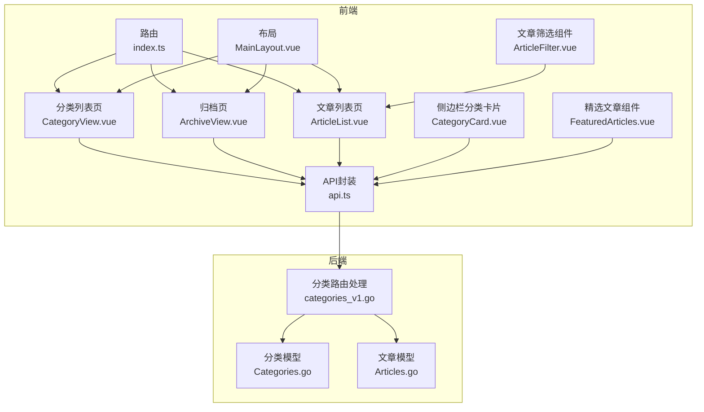
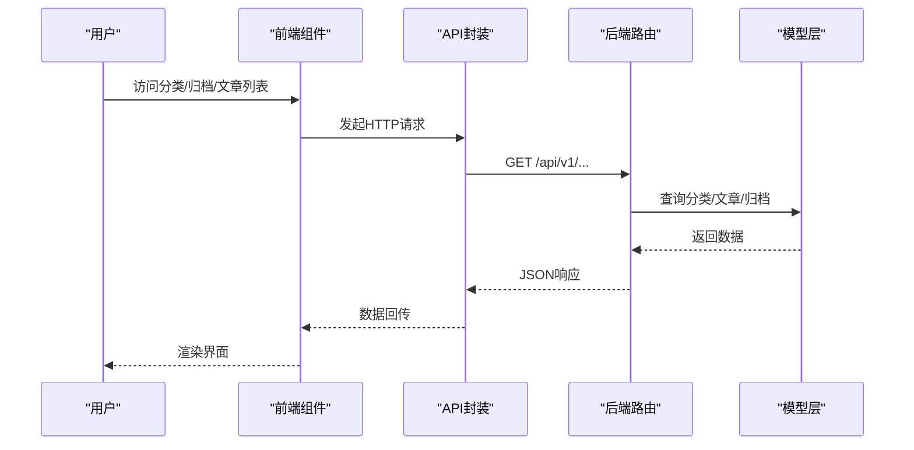
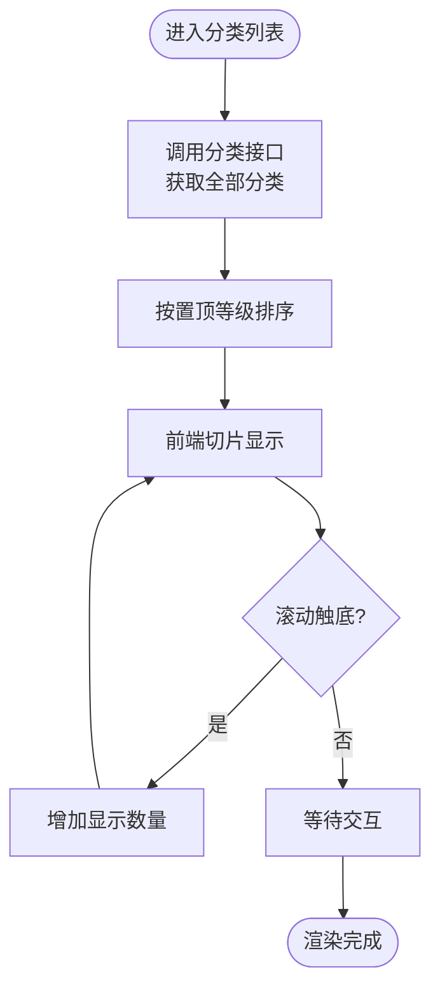
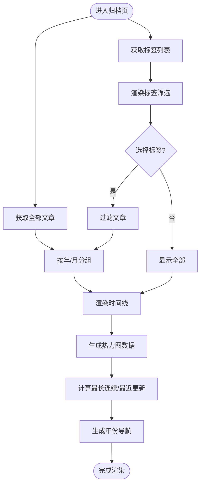
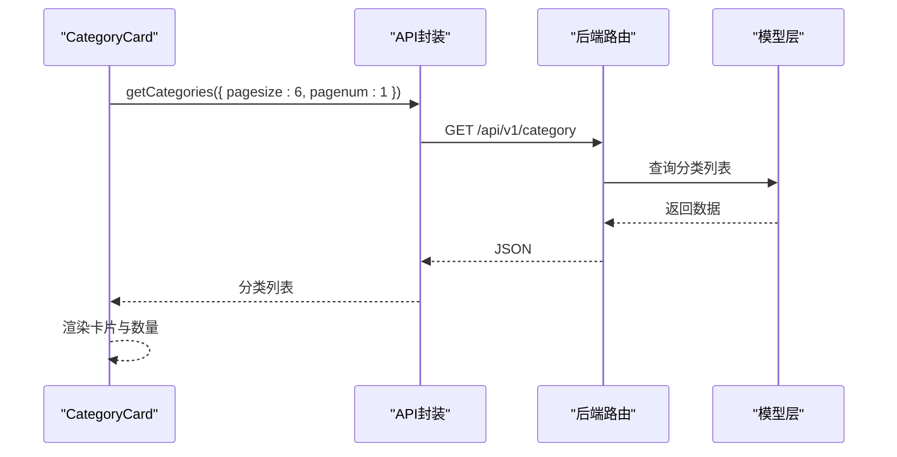
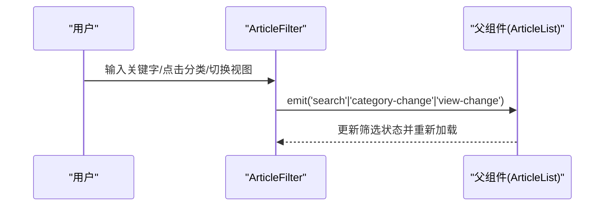
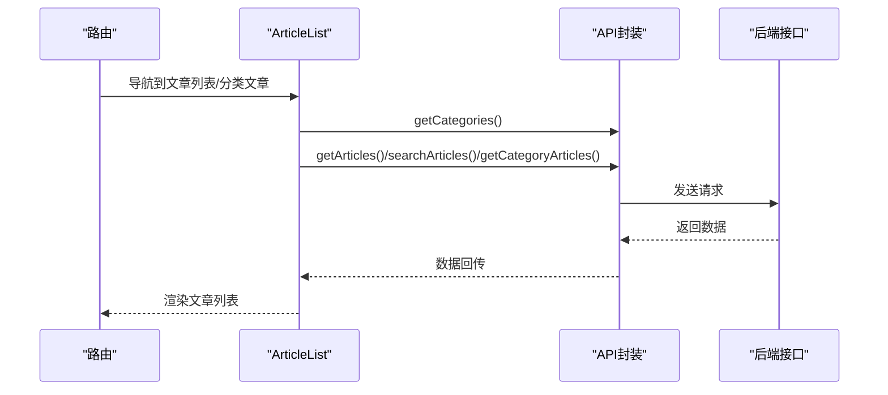
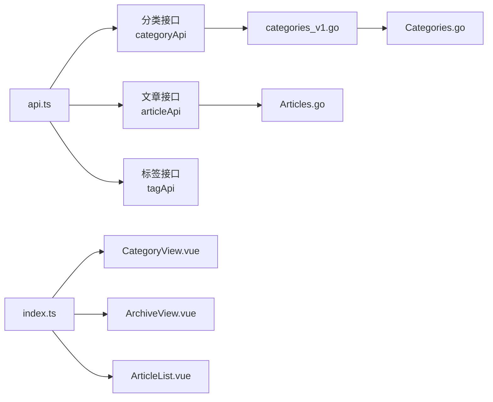

# 分类与归档

<cite>
**本文引用的文件**
- [CategoryView.vue](file://web/frontend/src/views/CategoryView.vue)
- [ArchiveView.vue](file://web/frontend/src/views/ArchiveView.vue)
- [CategoryCard.vue](file://web/frontend/src/components/sidebar/CategoryCard.vue)
- [ArticleFilter.vue](file://web/frontend/src/components/article/ArticleFilter.vue)
- [ArticleList.vue](file://web/frontend/src/views/ArticleList.vue)
- [MainLayout.vue](file://web/frontend/src/components/layout/MainLayout.vue)
- [api.ts](file://web/frontend/src/services/api.ts)
- [index.ts](file://web/frontend/src/router/index.ts)
- [categories_v1.go](file://api/v1/categories_v1.go)
- [Categories.go](file://model/Categories.go)
- [Articles.go](file://model/Articles.go)
- [FeaturedArticles.vue](file://web/frontend/src/components/sidebar/FeaturedArticles.vue)
</cite>

## 目录
1. [简介](#简介)
2. [项目结构](#项目结构)
3. [核心组件](#核心组件)
4. [架构概览](#架构概览)
5. [详细组件分析](#详细组件分析)
6. [依赖关系分析](#依赖关系分析)
7. [性能考虑](#性能考虑)
8. [故障排查指南](#故障排查指南)
9. [结论](#结论)
10. [附录](#附录)

## 简介
本文件聚焦于前台展示网站的“分类与归档”功能，涵盖以下方面：
- 分类页面的实现：分类列表展示、文章数量统计、分类筛选与跳转。
- 归档页面的时间线展示：按月/年分组的文章列表与贡献热力图。
- 侧边栏分类卡片组件的数据获取与展示逻辑。
- 精选文章组件的推荐策略与展示。
- 分类导航与面包屑的实现思路与SEO建议。
- 分类与文章的关联关系及数据同步机制。
- 分类页面的缓存策略与性能优化建议。
- 开发者扩展与自定义指南。

## 项目结构
前端采用Vue 3 + TypeScript + Vite，路由通过Vue Router管理；后端使用Gin框架提供REST API；模型层通过GORM访问数据库。分类与归档功能主要分布在以下模块：
- 视图层：分类列表页、归档页、文章列表页、侧边栏组件。
- 服务层：统一的API客户端封装，提供分类、文章、标签等接口。
- 路由层：定义分类、归档、文章列表等页面路由。
- 模型层：定义分类、文章、标签等实体及其查询方法。

图表来源
- [index.ts:1-73](file://web/frontend/src/router/index.ts#L1-L73)
- [MainLayout.vue:1-130](file://web/frontend/src/components/layout/MainLayout.vue#L1-L130)
- [CategoryView.vue:1-375](file://web/frontend/src/views/CategoryView.vue#L1-L375)
- [ArchiveView.vue:1-888](file://web/frontend/src/views/ArchiveView.vue#L1-L888)
- [ArticleList.vue:1-225](file://web/frontend/src/views/ArticleList.vue#L1-L225)
- [ArticleFilter.vue:1-272](file://web/frontend/src/components/article/ArticleFilter.vue#L1-L272)
- [CategoryCard.vue:1-115](file://web/frontend/src/components/sidebar/CategoryCard.vue#L1-L115)
- [FeaturedArticles.vue:1-262](file://web/frontend/src/components/sidebar/FeaturedArticles.vue#L1-L262)
- [api.ts:1-137](file://web/frontend/src/services/api.ts#L1-L137)
- [categories_v1.go:1-166](file://api/v1/categories_v1.go#L1-L166)
- [Categories.go:1-203](file://model/Categories.go#L1-L203)
- [Articles.go:1-389](file://model/Articles.go#L1-L389)

章节来源
- [index.ts:1-73](file://web/frontend/src/router/index.ts#L1-L73)
- [api.ts:1-137](file://web/frontend/src/services/api.ts#L1-L137)

## 核心组件
- 分类列表页：展示所有分类，支持置顶排序、懒加载、图片错误回退、点击跳转至对应文章列表。
- 归档页：展示文章时间线（年/月分组）、标签筛选、贡献热力图、年份快速导航。
- 侧边栏分类卡片：展示部分分类与文章数量，点击进入分类详情页。
- 文章筛选组件：提供分类Tab、搜索、视图切换（网格/列表）。
- 文章列表页：聚合筛选条件，调用后端接口分页加载文章。
- 精选文章组件：展示热门文章，支持骨架屏与错误重试。

章节来源
- [CategoryView.vue:1-375](file://web/frontend/src/views/CategoryView.vue#L1-L375)
- [ArchiveView.vue:1-888](file://web/frontend/src/views/ArchiveView.vue#L1-L888)
- [CategoryCard.vue:1-115](file://web/frontend/src/components/sidebar/CategoryCard.vue#L1-L115)
- [ArticleFilter.vue:1-272](file://web/frontend/src/components/article/ArticleFilter.vue#L1-L272)
- [ArticleList.vue:1-225](file://web/frontend/src/views/ArticleList.vue#L1-L225)
- [FeaturedArticles.vue:1-262](file://web/frontend/src/components/sidebar/FeaturedArticles.vue#L1-L262)

## 架构概览
从前端到后端的数据流如下：
- 前端通过API封装调用后端REST接口。
- 后端路由处理分类与文章相关请求，调用模型层进行数据库操作。
- 模型层负责查询、统计（如分类文章数量）、聚合（如归档按月统计）。

图表来源
- [api.ts:105-121](file://web/frontend/src/services/api.ts#L105-L121)
- [categories_v1.go:55-67](file://api/v1/categories_v1.go#L55-L67)
- [Categories.go:95-128](file://model/Categories.go#L95-L128)
- [Articles.go:248-271](file://model/Articles.go#L248-L271)

## 详细组件分析

### 分类列表页（CategoryView）
- 功能要点
  - 一次性拉取所有分类（pagesize=-1），按置顶等级排序，再进行前端切片展示。
  - 支持无限滚动：当触发器可见时，每次增加显示数量。
  - 图片加载失败自动回退至默认封面。
  - 点击分类卡片跳转至对应分类的文章列表页。
- 数据来源
  - 通过API封装调用后端分类列表接口，返回包含文章数量的分类集合。
- 性能与体验
  - 初始一次性拉取，避免多次请求；滚动加载提升长列表体验。
  - 图片错误回退保障稳定性。

图表来源
- [CategoryView.vue:94-150](file://web/frontend/src/views/CategoryView.vue#L94-L150)

章节来源
- [CategoryView.vue:51-191](file://web/frontend/src/views/CategoryView.vue#L51-L191)
- [api.ts:105-114](file://web/frontend/src/services/api.ts#L105-L114)
- [categories_v1.go:55-67](file://api/v1/categories_v1.go#L55-L67)
- [Categories.go:95-128](file://model/Categories.go#L95-L128)

### 归档页（ArchiveView）
- 功能要点
  - 获取全部文章构建时间线，按年/月分组展示。
  - 提供标签筛选，支持展开/收起标签列表。
  - 展示贡献热力图（GitHub风格），计算最长连续天数与最近更新时间。
  - 年份导航快速定位到对应年份。
- 数据来源
  - 获取全部文章用于时间线与热力图；标签列表来自标签接口。
- 关键算法
  - 日期聚合：根据数据库日期格式化函数按月分组统计。
  - 最长连续：遍历日期序列，维护当前连续长度与最大长度。

图表来源
- [ArchiveView.vue:325-427](file://web/frontend/src/views/ArchiveView.vue#L325-L427)
- [Articles.go:248-271](file://model/Articles.go#L248-L271)

章节来源
- [ArchiveView.vue:156-427](file://web/frontend/src/views/ArchiveView.vue#L156-L427)
- [Articles.go:248-271](file://model/Articles.go#L248-L271)

### 侧边栏分类卡片（CategoryCard）
- 功能要点
  - 仅拉取少量分类（默认6个）用于侧边栏展示。
  - 展示分类名称与文章数量，点击进入分类详情页。
- 数据来源
  - 调用分类列表接口，限制数量与页码。

图表来源
- [CategoryCard.vue:35-48](file://web/frontend/src/components/sidebar/CategoryCard.vue#L35-L48)
- [api.ts:105-114](file://web/frontend/src/services/api.ts#L105-L114)
- [categories_v1.go:55-67](file://api/v1/categories_v1.go#L55-L67)
- [Categories.go:95-128](file://model/Categories.go#L95-L128)

章节来源
- [CategoryCard.vue:23-49](file://web/frontend/src/components/sidebar/CategoryCard.vue#L23-L49)
- [api.ts:105-114](file://web/frontend/src/services/api.ts#L105-L114)

### 文章筛选组件（ArticleFilter）
- 功能要点
  - 分类Tab：支持“全部文章”与各分类；点击切换筛选。
  - 搜索：输入框支持防抖（300ms），回车触发搜索。
  - 视图切换：网格/列表两种视图。
- 交互流程
  - 分类切换、搜索、视图切换均通过事件向上抛出，由父组件处理。

图表来源
- [ArticleFilter.vue:78-129](file://web/frontend/src/components/article/ArticleFilter.vue#L78-L129)
- [ArticleList.vue:172-189](file://web/frontend/src/views/ArticleList.vue#L172-L189)

章节来源
- [ArticleFilter.vue:61-129](file://web/frontend/src/components/article/ArticleFilter.vue#L61-L129)
- [ArticleList.vue:35-212](file://web/frontend/src/views/ArticleList.vue#L35-L212)

### 文章列表页（ArticleList）
- 功能要点
  - 统一处理分类筛选、搜索、分页加载。
  - 根据路由参数（分类ID）或本地选择（分类Tab）决定查询方式。
  - 支持“加载更多”，基于后端分页。
- 数据来源
  - 文章列表、分类列表分别通过API封装调用后端接口。

图表来源
- [ArticleList.vue:85-197](file://web/frontend/src/views/ArticleList.vue#L85-L197)
- [api.ts:67-103](file://web/frontend/src/services/api.ts#L67-L103)
- [index.ts:23-28](file://web/frontend/src/router/index.ts#L23-L28)

章节来源
- [ArticleList.vue:35-212](file://web/frontend/src/views/ArticleList.vue#L35-L212)
- [api.ts:67-103](file://web/frontend/src/services/api.ts#L67-L103)
- [index.ts:23-28](file://web/frontend/src/router/index.ts#L23-L28)

### 精选文章组件（FeaturedArticles）
- 功能要点
  - 通过热门文章接口获取列表，支持骨架屏与错误重试。
  - 展示标题与分类信息，点击跳转文章详情。
- 数据来源
  - 调用热门文章接口，映射为前端文章对象。

章节来源
- [FeaturedArticles.vue:76-120](file://web/frontend/src/components/sidebar/FeaturedArticles.vue#L76-L120)
- [api.ts:88-90](file://web/frontend/src/services/api.ts#L88-L90)
- [Articles.go:180-188](file://model/Articles.go#L180-L188)

## 依赖关系分析
- 前端组件依赖API封装，API封装统一管理基础URL、超时、拦截器与取消控制器。
- 路由定义了分类、归档、文章列表等页面，ArticleList同时承载分类文章与通用文章列表。
- 后端路由处理分类与文章相关请求，模型层提供查询与聚合能力。

图表来源
- [api.ts:1-137](file://web/frontend/src/services/api.ts#L1-L137)
- [categories_v1.go:1-166](file://api/v1/categories_v1.go#L1-L166)
- [Categories.go:1-203](file://model/Categories.go#L1-L203)
- [Articles.go:1-389](file://model/Articles.go#L1-L389)
- [index.ts:1-73](file://web/frontend/src/router/index.ts#L1-L73)

章节来源
- [api.ts:1-137](file://web/frontend/src/services/api.ts#L1-L137)
- [index.ts:1-73](file://web/frontend/src/router/index.ts#L1-L73)

## 性能考虑
- 分类列表
  - 一次性拉取全部分类，避免频繁请求；结合前端切片与滚动加载，降低首屏压力。
  - 图片错误回退至默认封面，提升稳定性。
- 归档页
  - 时间线与热力图均基于后端聚合结果，避免前端复杂计算。
  - 标签列表支持展开/收起，减少DOM节点数量。
- 文章列表
  - 后端分页加载，支持“加载更多”，避免一次性传输大量数据。
  - 搜索采用防抖，降低请求频率。
- 通用
  - API封装统一超时与错误处理，便于统一优化。
  - 布局组件支持响应式与粘性侧边栏，提升移动端体验。

章节来源
- [CategoryView.vue:94-150](file://web/frontend/src/views/CategoryView.vue#L94-L150)
- [ArchiveView.vue:325-427](file://web/frontend/src/views/ArchiveView.vue#L325-L427)
- [ArticleList.vue:85-156](file://web/frontend/src/views/ArticleList.vue#L85-L156)
- [ArticleFilter.vue:96-121](file://web/frontend/src/components/article/ArticleFilter.vue#L96-L121)
- [api.ts:1-64](file://web/frontend/src/services/api.ts#L1-L64)

## 故障排查指南
- 分类列表空白
  - 检查分类接口返回状态与数据结构，确认映射字段一致。
  - 查看图片加载错误回调是否正确回退默认封面。
- 归档时间线异常
  - 确认后端归档接口返回的日期格式与前端解析一致。
  - 检查标签筛选逻辑，确保标签字符串拆分与匹配正确。
- 文章列表不刷新
  - 确认路由参数变化或筛选条件变更后是否触发重置与重新加载。
  - 检查分页参数与hasMore状态，避免重复加载。
- 热力图数据异常
  - 核对日期聚合逻辑与数据库日期格式化函数差异。
  - 检查最长连续天数计算边界条件。

章节来源
- [CategoryView.vue:87-91](file://web/frontend/src/views/CategoryView.vue#L87-L91)
- [ArchiveView.vue:342-402](file://web/frontend/src/views/ArchiveView.vue#L342-L402)
- [ArticleList.vue:172-204](file://web/frontend/src/views/ArticleList.vue#L172-L204)

## 结论
本系统在前端实现了清晰的分类与归档展示，配合后端模型层的高效查询与聚合，形成了稳定、可扩展的功能体系。通过合理的数据流设计与性能优化策略，能够满足长列表与复杂筛选场景的需求。后续可在SEO优化、缓存策略与推荐算法等方面进一步增强。

## 附录

### 分类与文章的关联关系与数据同步
- 关联关系
  - 文章模型包含分类外键，查询文章时可预加载分类信息。
  - 分类模型提供文章数量统计，用于分类列表与侧边栏展示。
- 数据同步
  - 分类删除时需检查是否仍有文章关联；若存在则拒绝删除。
  - 文章更新时，若修改分类ID，需确保新分类存在且有效。

章节来源
- [Articles.go:11-25](file://model/Articles.go#L11-L25)
- [Categories.go:108-128](file://model/Categories.go#L108-L128)
- [Categories.go:165-180](file://model/Categories.go#L165-L180)

### 分类导航与面包屑实现（建议）
- 当前前端未实现面包屑组件，可在主布局中引入面包屑组件，根据路由动态生成层级。
- 建议在分类详情页与归档页补充面包屑，提升SEO与用户体验。
- 面包屑项可包含“首页 -> 分类/归档 -> 当前页”。

[本节为概念性建议，不直接分析具体文件]

### 分类页面的缓存策略与性能优化（建议）
- 前端
  - 对分类列表与热门文章设置短期缓存，结合失效时间与手动刷新按钮。
  - 对归档页的热力图与时间线数据设置合理缓存策略，避免重复计算。
- 后端
  - 对分类列表与热门文章接口增加缓存层，减少数据库压力。
  - 对归档聚合查询设置索引与分区策略，提升查询效率。

[本节为通用建议，不直接分析具体文件]

### 开发者扩展与自定义指南
- 新增分类筛选维度
  - 在文章筛选组件中扩展筛选项（如标签、作者），并在父组件中处理筛选逻辑。
- 自定义推荐算法
  - 在精选文章组件中替换热门文章接口为自定义算法（如基于标签相似度、时间衰减等）。
- SEO优化
  - 为分类与归档页面生成结构化数据与元信息，提升搜索引擎收录。
  - 为分类详情页生成动态标题与描述，包含分类名称与文章数量。

[本节为通用建议，不直接分析具体文件]