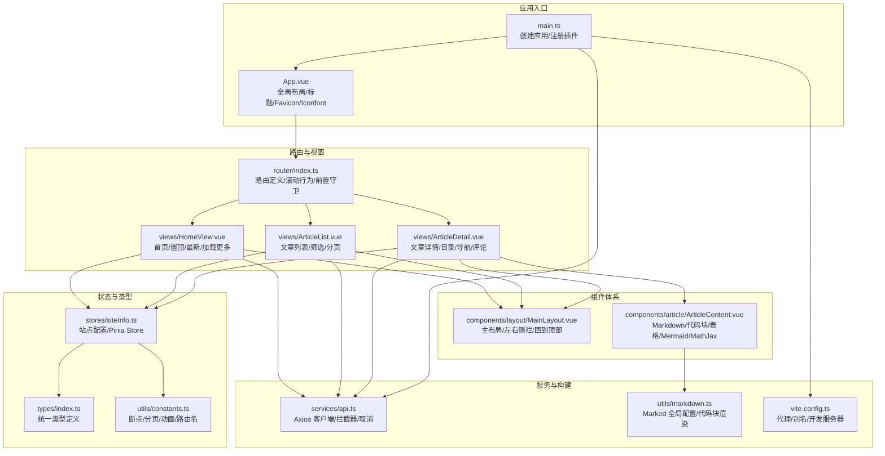
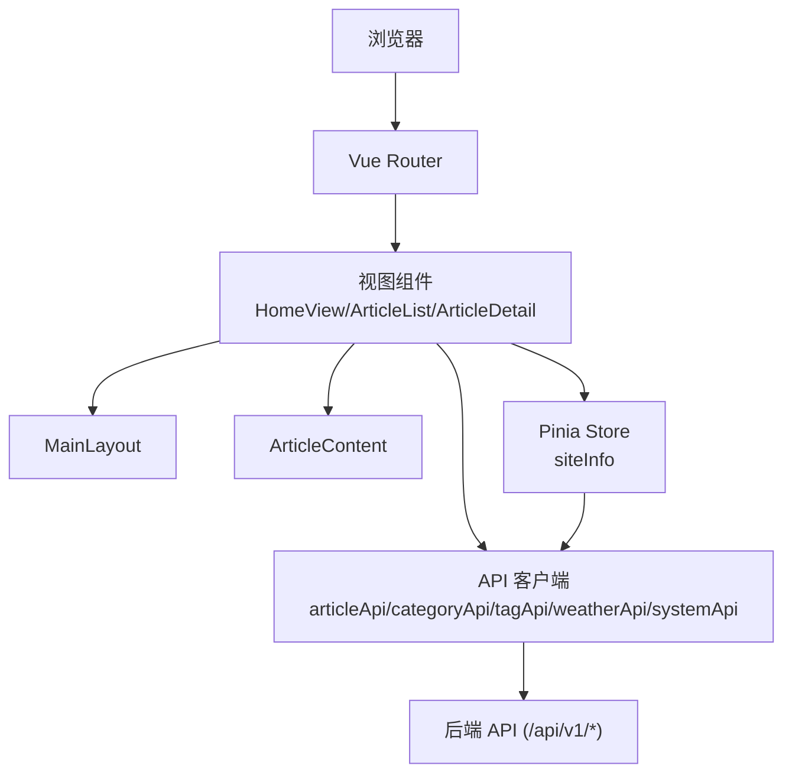
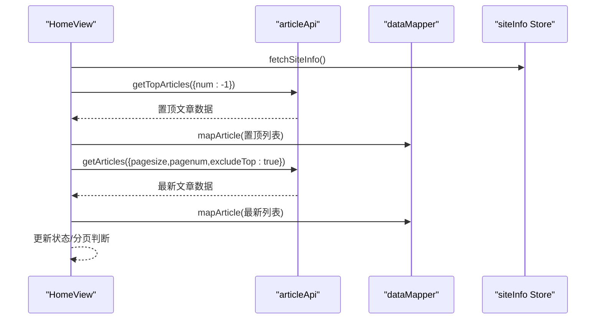
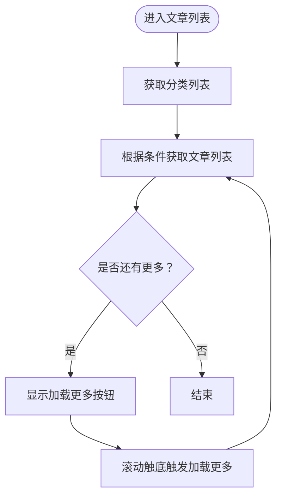
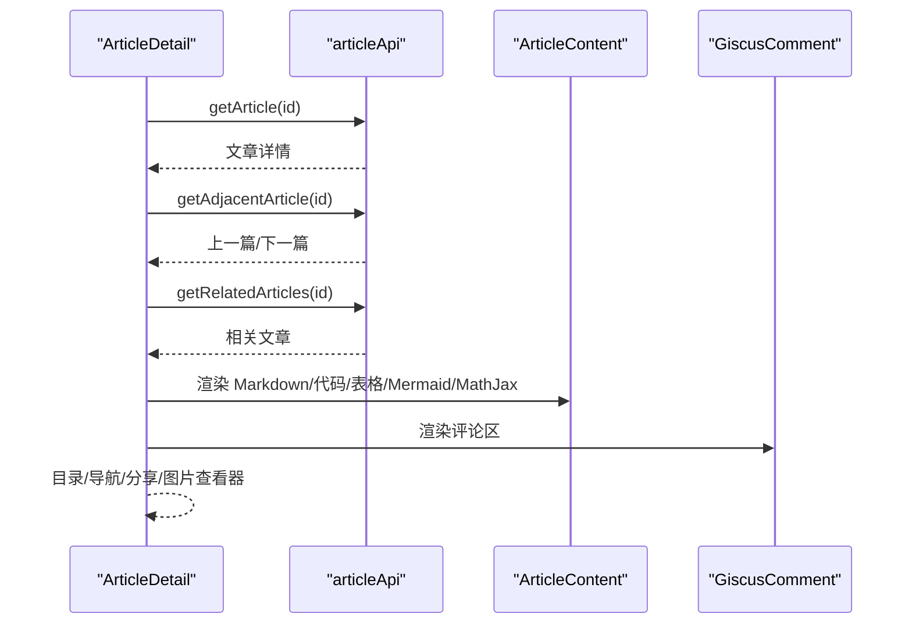
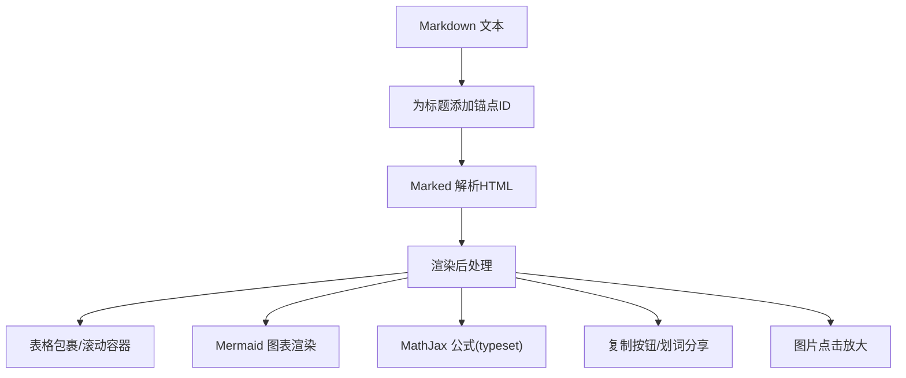
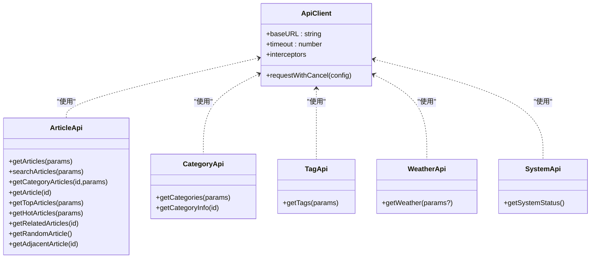
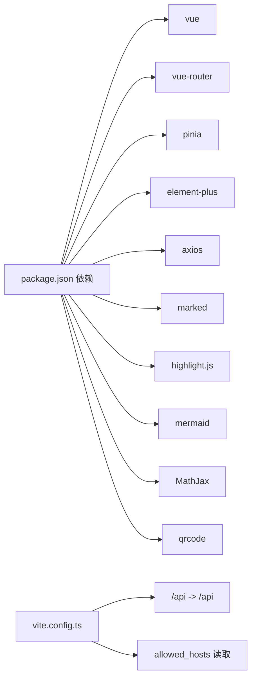

# 前台展示网站

<cite>
**本文引用的文件**
- [web/frontend/src/main.ts](file://web/frontend/src/main.ts)
- [web/frontend/src/App.vue](file://web/frontend/src/App.vue)
- [web/frontend/src/router/index.ts](file://web/frontend/src/router/index.ts)
- [web/frontend/package.json](file://web/frontend/package.json)
- [web/frontend/vite.config.ts](file://web/frontend/vite.config.ts)
- [web/frontend/src/components/layout/MainLayout.vue](file://web/frontend/src/components/layout/MainLayout.vue)
- [web/frontend/src/views/HomeView.vue](file://web/frontend/src/views/HomeView.vue)
- [web/frontend/src/views/ArticleList.vue](file://web/frontend/src/views/ArticleList.vue)
- [web/frontend/src/views/ArticleDetail.vue](file://web/frontend/src/views/ArticleDetail.vue)
- [web/frontend/src/services/api.ts](file://web/frontend/src/services/api.ts)
- [web/frontend/src/components/article/ArticleContent.vue](file://web/frontend/src/components/article/ArticleContent.vue)
- [web/frontend/src/utils/markdown.ts](file://web/frontend/src/utils/markdown.ts)
- [web/frontend/src/stores/siteInfo.ts](file://web/frontend/src/stores/siteInfo.ts)
- [web/frontend/src/types/index.ts](file://web/frontend/src/types/index.ts)
- [web/frontend/src/utils/constants.ts](file://web/frontend/src/utils/constants.ts)
</cite>

## 目录
1. [简介](#简介)
2. [项目结构](#项目结构)
3. [核心组件](#核心组件)
4. [架构总览](#架构总览)
5. [详细组件分析](#详细组件分析)
6. [依赖关系分析](#依赖关系分析)
7. [性能考虑](#性能考虑)
8. [故障排查指南](#故障排查指南)
9. [结论](#结论)
10. [附录](#附录)

## 简介
本文件面向前端开发者，系统性梳理 YanBlog 前台展示网站的架构与实现，覆盖基于 Vue 3 + TypeScript 的技术栈、文章展示、分类浏览、归档功能、响应式布局与移动端适配、Element Plus 组件库与主题定制、文章内容渲染与评论系统、SEO 优化方案、导航栏/侧边栏/页脚布局、API 客户端集成与数据获取模式、静态资源管理与性能优化策略，并提供组件开发与页面构建的最佳实践。

## 项目结构
前台位于 web/frontend 目录，采用 Vite + Vue 3 + TypeScript + Pinia + Element Plus 技术栈，路由采用 Vue Router，通过 Axios 进行 API 交互，Markdown 内容由 Marked + Highlight.js 渲染，Mermaid 支持流程图等可视化，Giscus 集成评论系统。

**图表来源**
- [web/frontend/src/main.ts:1-28](file://web/frontend/src/main.ts#L1-L28)
- [web/frontend/src/App.vue:1-215](file://web/frontend/src/App.vue#L1-L215)
- [web/frontend/src/router/index.ts:1-73](file://web/frontend/src/router/index.ts#L1-L73)
- [web/frontend/src/components/layout/MainLayout.vue:1-130](file://web/frontend/src/components/layout/MainLayout.vue#L1-L130)
- [web/frontend/src/views/HomeView.vue:1-133](file://web/frontend/src/views/HomeView.vue#L1-L133)
- [web/frontend/src/views/ArticleList.vue:1-225](file://web/frontend/src/views/ArticleList.vue#L1-L225)
- [web/frontend/src/views/ArticleDetail.vue:1-800](file://web/frontend/src/views/ArticleDetail.vue#L1-L800)
- [web/frontend/src/components/article/ArticleContent.vue:1-800](file://web/frontend/src/components/article/ArticleContent.vue#L1-L800)
- [web/frontend/src/services/api.ts:1-137](file://web/frontend/src/services/api.ts#L1-L137)
- [web/frontend/src/utils/markdown.ts:1-71](file://web/frontend/src/utils/markdown.ts#L1-L71)
- [web/frontend/src/stores/siteInfo.ts:1-261](file://web/frontend/src/stores/siteInfo.ts#L1-L261)
- [web/frontend/src/types/index.ts:1-71](file://web/frontend/src/types/index.ts#L1-L71)
- [web/frontend/src/utils/constants.ts:1-48](file://web/frontend/src/utils/constants.ts#L1-L48)
- [web/frontend/vite.config.ts:1-56](file://web/frontend/vite.config.ts#L1-L56)

**章节来源**
- [web/frontend/src/main.ts:1-28](file://web/frontend/src/main.ts#L1-L28)
- [web/frontend/src/App.vue:1-215](file://web/frontend/src/App.vue#L1-L215)
- [web/frontend/src/router/index.ts:1-73](file://web/frontend/src/router/index.ts#L1-L73)
- [web/frontend/package.json:1-45](file://web/frontend/package.json#L1-L45)
- [web/frontend/vite.config.ts:1-56](file://web/frontend/vite.config.ts#L1-L56)

## 核心组件
- 应用入口与全局配置：初始化 Vue 应用、注册 Pinia、Vue Router、Element Plus、全局错误处理、懒加载指令、Marked 全局配置。
- 全局布局与页面标题/Favicon/Iconfont 注入：在 App.vue 中按站点配置动态注入图标字体样式与图标、Favicon、页面标题切换。
- 路由系统：定义首页、文章列表、文章详情、分类列表、归档、关于、404 等路由；设置滚动行为与参数校验。
- 主布局组件：提供容器、左右侧栏插槽、粘性侧栏、回到顶部、响应式断点适配。
- 文章内容渲染：Markdown 解析、代码高亮、表格包裹、Mermaid 图表、MathJax 数学公式、划词分享、图片点击放大、锚点跳转。
- API 客户端：封装 Axios 实例、请求/响应拦截器、请求取消、文章/分类/标签/天气/系统状态等接口。
- 站点配置 Store：拉取并缓存前端配置（支持 API 与静态文件回退），环境变量覆盖，更新配置。
- 类型与常量：统一的类型定义与断点/分页/动画/路由名常量，减少魔法数。

**章节来源**
- [web/frontend/src/main.ts:1-28](file://web/frontend/src/main.ts#L1-L28)
- [web/frontend/src/App.vue:26-111](file://web/frontend/src/App.vue#L26-L111)
- [web/frontend/src/router/index.ts:4-73](file://web/frontend/src/router/index.ts#L4-L73)
- [web/frontend/src/components/layout/MainLayout.vue:1-130](file://web/frontend/src/components/layout/MainLayout.vue#L1-L130)
- [web/frontend/src/components/article/ArticleContent.vue:1-800](file://web/frontend/src/components/article/ArticleContent.vue#L1-L800)
- [web/frontend/src/services/api.ts:1-137](file://web/frontend/src/services/api.ts#L1-L137)
- [web/frontend/src/stores/siteInfo.ts:110-261](file://web/frontend/src/stores/siteInfo.ts#L110-L261)
- [web/frontend/src/types/index.ts:1-71](file://web/frontend/src/types/index.ts#L1-L71)
- [web/frontend/src/utils/constants.ts:1-48](file://web/frontend/src/utils/constants.ts#L1-L48)

## 架构总览
前台采用“单页应用 + 统一 API 客户端”的前后端分离模式，路由驱动视图切换，组件负责业务与展示，Pinia 管理站点配置等全局状态，Element Plus 提供基础 UI 能力，Markdown 生态负责内容渲染，Giscus 提供评论能力。

**图表来源**
- [web/frontend/src/router/index.ts:1-73](file://web/frontend/src/router/index.ts#L1-L73)
- [web/frontend/src/views/HomeView.vue:1-133](file://web/frontend/src/views/HomeView.vue#L1-L133)
- [web/frontend/src/views/ArticleList.vue:1-225](file://web/frontend/src/views/ArticleList.vue#L1-L225)
- [web/frontend/src/views/ArticleDetail.vue:1-L800)
- [web/frontend/src/components/layout/MainLayout.vue:1-130](file://web/frontend/src/components/layout/MainLayout.vue#L1-L130)
- [web/frontend/src/components/article/ArticleContent.vue:1-800](file://web/frontend/src/components/article/ArticleContent.vue#L1-L800)
- [web/frontend/src/services/api.ts:1-137](file://web/frontend/src/services/api.ts#L1-L137)
- [web/frontend/src/stores/siteInfo.ts:110-261](file://web/frontend/src/stores/siteInfo.ts#L110-L261)

## 详细组件分析

### 应用入口与全局配置
- 创建应用实例，注册 Pinia、Router、Element Plus，安装懒加载指令。
- 全局错误处理：捕获子组件异常，避免白屏，记录组件名与信息。
- 引入 Marked 全局配置，保证所有页面的代码块渲染风格一致。
- 注入 Element Plus 暗色主题 CSS。

**章节来源**
- [web/frontend/src/main.ts:1-28](file://web/frontend/src/main.ts#L1-L28)

### 全局布局与页面元信息
- Loading 动画与骨架屏体验：首屏加载完成后隐藏。
- 页面标题切换：窗口失焦时替换标题，聚焦恢复。
- 动态注入 Iconfont 样式或回退内联样式，支持自定义图标字体。
- 动态注入 Favicon，提升品牌识别度。
- 全局背景与过渡动画，增强视觉体验。

**章节来源**
- [web/frontend/src/App.vue:1-215](file://web/frontend/src/App.vue#L1-L215)

### 路由系统与参数校验
- 定义首页、文章列表、文章详情、分类文章、分类页、归档、关于、404 路由。
- 滚动行为：支持返回时恢复滚动位置，否则滚动至顶部。
- 全局前置守卫：校验动态参数（如文章 ID）必须为合法数字，非法则重定向至 404。

**章节来源**
- [web/frontend/src/router/index.ts:1-73](file://web/frontend/src/router/index.ts#L1-L73)

### 主布局组件（MainLayout）
- 结构：容器、内容区、左右侧栏插槽、回到顶部。
- 响应式：在不同断点下调整侧栏宽度、布局方向与卡片尺寸。
- 粘性侧栏：顶部固定，滚动时保持可见，提升导航体验。

**章节来源**
- [web/frontend/src/components/layout/MainLayout.vue:1-130](file://web/frontend/src/components/layout/MainLayout.vue#L1-L130)

### 首页（HomeView）
- 数据流：获取置顶文章与最新文章，支持“加载更多”无限滚动。
- 分页：使用常量配置每页条数，计算是否还有更多数据。
- 组件组合：HeroSection、TopArticles、LatestArticles、Sidebar。

**图表来源**
- [web/frontend/src/views/HomeView.vue:26-105](file://web/frontend/src/views/HomeView.vue#L26-L105)
- [web/frontend/src/services/api.ts:66-103](file://web/frontend/src/services/api.ts#L66-L103)

**章节来源**
- [web/frontend/src/views/HomeView.vue:1-133](file://web/frontend/src/views/HomeView.vue#L1-L133)

### 文章列表（ArticleList）
- 功能：分类筛选、关键词搜索、视图模式切换（网格/列表）、分页加载。
- 策略：搜索优先于分类筛选，路由参数与本地选择共同决定查询条件。
- 响应式：根据断点切换布局与侧栏展示。

**图表来源**
- [web/frontend/src/views/ArticleList.vue:35-212](file://web/frontend/src/views/ArticleList.vue#L35-L212)
- [web/frontend/src/services/api.ts:66-121](file://web/frontend/src/services/api.ts#L66-L121)

**章节来源**
- [web/frontend/src/views/ArticleList.vue:1-225](file://web/frontend/src/views/ArticleList.vue#L1-L225)

### 文章详情（ArticleDetail）
- 功能：文章内容渲染、固定目录（大屏悬浮/小屏遮罩展开）、上一篇/下一篇导航、相关推荐、图片查看器、分享卡片、评论区（Giscus）。
- 交互：锚点跳转、划词分享、键盘事件（Esc/左右键）、窗口尺寸变化时目录状态切换。
- 性能：图片懒加载、目录展开时锁定滚动、目录状态持久化。

**图表来源**
- [web/frontend/src/views/ArticleDetail.vue:157-453](file://web/frontend/src/views/ArticleDetail.vue#L157-L453)
- [web/frontend/src/components/article/ArticleContent.vue:1-800](file://web/frontend/src/components/article/ArticleContent.vue#L1-L800)
- [web/frontend/src/services/api.ts:66-103](file://web/frontend/src/services/api.ts#L66-L103)

**章节来源**
- [web/frontend/src/views/ArticleDetail.vue:1-800](file://web/frontend/src/views/ArticleDetail.vue#L1-L800)

### 文章内容渲染（ArticleContent）
- Markdown：Marked 解析，添加标题锚点 ID，支持 Mermaid 图表与 KaTeX 数学公式。
- 代码块：Highlight.js 高亮，Mac 风格代码块 UI，行号、复制按钮。
- 表格：自动包裹横向滚动容器，提升移动端可读性。
- 交互：图片点击放大、划词分享、锚点平滑跳转、复制按钮反馈。

**图表来源**
- [web/frontend/src/components/article/ArticleContent.vue:169-318](file://web/frontend/src/components/article/ArticleContent.vue#L169-L318)
- [web/frontend/src/utils/markdown.ts:10-71](file://web/frontend/src/utils/markdown.ts#L10-L71)

**章节来源**
- [web/frontend/src/components/article/ArticleContent.vue:1-800](file://web/frontend/src/components/article/ArticleContent.vue#L1-L800)
- [web/frontend/src/utils/markdown.ts:1-71](file://web/frontend/src/utils/markdown.ts#L1-L71)

### API 客户端与数据获取模式
- Axios 实例：统一 baseURL、超时、请求头。
- 请求/响应拦截器：日志、超时与网络错误统一处理。
- 请求取消：AbortController 包装，避免竞态与内存泄漏。
- 接口封装：文章、分类、标签、天气、系统状态等模块化 API。

**图表来源**
- [web/frontend/src/services/api.ts:1-137](file://web/frontend/src/services/api.ts#L1-L137)

**章节来源**
- [web/frontend/src/services/api.ts:1-137](file://web/frontend/src/services/api.ts#L1-L137)

### 站点配置 Store（siteInfo）
- 功能：拉取前端配置（优先 API，回退静态文件），环境覆盖（本地开发），更新配置。
- 数据：博客名称、作者信息、Logo、Favicon、页面标题、Iconfont、音乐播放器、快捷方式、社交/联系、评论配置等。
- 使用：App.vue 动态注入图标字体与 Favicon，视图组件读取以渲染界面。

**章节来源**
- [web/frontend/src/stores/siteInfo.ts:110-261](file://web/frontend/src/stores/siteInfo.ts#L110-L261)
- [web/frontend/src/App.vue:54-101](file://web/frontend/src/App.vue#L54-L101)

### 类型与常量
- 类型：Article、Category、Tag、User、PaginatedResponse、ApiResponse、PaginationParams、SearchParams。
- 常量：BREAKPOINTS、PAGINATION、ARTICLE、ANIMATION、ROUTES。

**章节来源**
- [web/frontend/src/types/index.ts:1-71](file://web/frontend/src/types/index.ts#L1-L71)
- [web/frontend/src/utils/constants.ts:1-48](file://web/frontend/src/utils/constants.ts#L1-L48)

## 依赖关系分析
- 开发与运行时依赖：Vue 3、Vue Router、Pinia、Element Plus、Axios、Marked、Highlight.js、Mermaid、MathJax、QRCode 等。
- 构建工具：Vite 插件（Vue、JSX、DevTools），开发服务器代理到后端 API。
- 代理规则：/api 前缀转发至后端，/uploads 直接转发，支持 allowed_hosts 读取自 public/config.yaml。

**图表来源**
- [web/frontend/package.json:16-44](file://web/frontend/package.json#L16-L44)
- [web/frontend/vite.config.ts:26-56](file://web/frontend/vite.config.ts#L26-L56)

**章节来源**
- [web/frontend/package.json:1-45](file://web/frontend/package.json#L1-L45)
- [web/frontend/vite.config.ts:1-56](file://web/frontend/vite.config.ts#L1-L56)

## 性能考虑
- 资源加载
  - 图片懒加载：通过 v-lazy 指令与图片点击放大结合，降低初始渲染压力。
  - 代码分割：路由级异步加载组件，减少首屏体积。
  - 静态资源：通过 Vite 别名与构建优化，合理利用浏览器缓存。
- 渲染优化
  - 无限滚动：分页加载，避免一次性渲染大量节点。
  - 目录与评论：按需渲染，小屏时目录遮罩避免阻塞滚动。
  - Mermaid/数学公式：按需渲染，主题切换时重新渲染图表。
- 网络优化
  - 请求取消：避免重复请求与竞态，减少无效渲染。
  - 超时与错误统一处理：提升稳定性与用户体验。
- 响应式与移动端
  - 断点适配：侧栏布局、卡片尺寸、导航交互随屏幕变化。
  - 小屏目录：遮罩层与滚动锁定，避免影响正文阅读。

[本节为通用指导，不直接分析具体文件]

## 故障排查指南
- 路由参数非法
  - 现象：访问文章详情报错或 404。
  - 处理：确认路由参数为纯数字，必要时重定向至首页或 404。
  - 参考：[web/frontend/src/router/index.ts:61-70](file://web/frontend/src/router/index.ts#L61-L70)
- API 超时/网络错误
  - 现象：请求长时间无响应或提示网络错误。
  - 处理：检查后端服务状态、代理配置、allowed_hosts 是否正确。
  - 参考：[web/frontend/src/services/api.ts:28-64](file://web/frontend/src/services/api.ts#L28-L64)，[web/frontend/vite.config.ts:37-56](file://web/frontend/vite.config.ts#L37-L56)
- 图标字体与 Favicon
  - 现象：图标不显示或页面标题未切换。
  - 处理：确认站点配置中的 iconfont_url 与 favicon 字段，检查动态注入逻辑。
  - 参考：[web/frontend/src/App.vue:54-101](file://web/frontend/src/App.vue#L54-L101)，[web/frontend/src/stores/siteInfo.ts:189-219](file://web/frontend/src/stores/siteInfo.ts#L189-L219)
- 目录与图片查看器
  - 现象：目录不展开、遮罩无法关闭、图片无法放大。
  - 处理：检查 isTocOpen 状态、事件监听与 body 滚动控制。
  - 参考：[web/frontend/src/views/ArticleDetail.vue:345-452](file://web/frontend/src/views/ArticleDetail.vue#L345-L452)
- 代码块与 Mermaid
  - 现象：代码块样式异常、Mermaid 图表不渲染。
  - 处理：确认 Marked 全局配置、主题切换监听、Mermaid 渲染调用。
  - 参考：[web/frontend/src/utils/markdown.ts:10-71](file://web/frontend/src/utils/markdown.ts#L10-L71)，[web/frontend/src/components/article/ArticleContent.vue:128-148](file://web/frontend/src/components/article/ArticleContent.vue#L128-L148)

**章节来源**
- [web/frontend/src/router/index.ts:61-70](file://web/frontend/src/router/index.ts#L61-L70)
- [web/frontend/src/services/api.ts:28-64](file://web/frontend/src/services/api.ts#L28-L64)
- [web/frontend/vite.config.ts:37-56](file://web/frontend/vite.config.ts#L37-L56)
- [web/frontend/src/App.vue:54-101](file://web/frontend/src/App.vue#L54-L101)
- [web/frontend/src/stores/siteInfo.ts:189-219](file://web/frontend/src/stores/siteInfo.ts#L189-L219)
- [web/frontend/src/views/ArticleDetail.vue:345-452](file://web/frontend/src/views/ArticleDetail.vue#L345-L452)
- [web/frontend/src/utils/markdown.ts:10-71](file://web/frontend/src/utils/markdown.ts#L10-L71)
- [web/frontend/src/components/article/ArticleContent.vue:128-148](file://web/frontend/src/components/article/ArticleContent.vue#L128-L148)

## 结论
YanBlog 前台采用现代化前端技术栈，围绕路由与组件化构建清晰的页面与交互，配合 Pinia 管理站点配置、Axios 统一 API 访问、Marked/Mermaid/MathJax 的内容渲染生态，以及 Element Plus 的 UI 基础设施，实现了良好的可维护性与扩展性。通过响应式布局与移动端适配策略，兼顾了桌面与移动用户的阅读体验。建议后续持续完善 SEO、性能监控与自动化测试，进一步提升质量与稳定性。

[本节为总结性内容，不直接分析具体文件]

## 附录
- 最佳实践清单
  - 组件职责单一，通过 Props/Events 明确父子通信。
  - 使用 Pinia 管理跨组件共享状态，避免深层传递。
  - API 请求统一通过 api.ts 封装，便于拦截与取消。
  - 响应式断点集中管理，避免散落的媒体查询。
  - 文章内容渲染遵循“解析-后处理-按需渲染”的流程，确保性能与可维护性。
  - 评论系统与第三方 SDK 按需加载，避免阻塞首屏。
  - 构建阶段开启压缩与缓存策略，生产环境启用 HTTPS 与安全头。

[本节为通用指导，不直接分析具体文件]