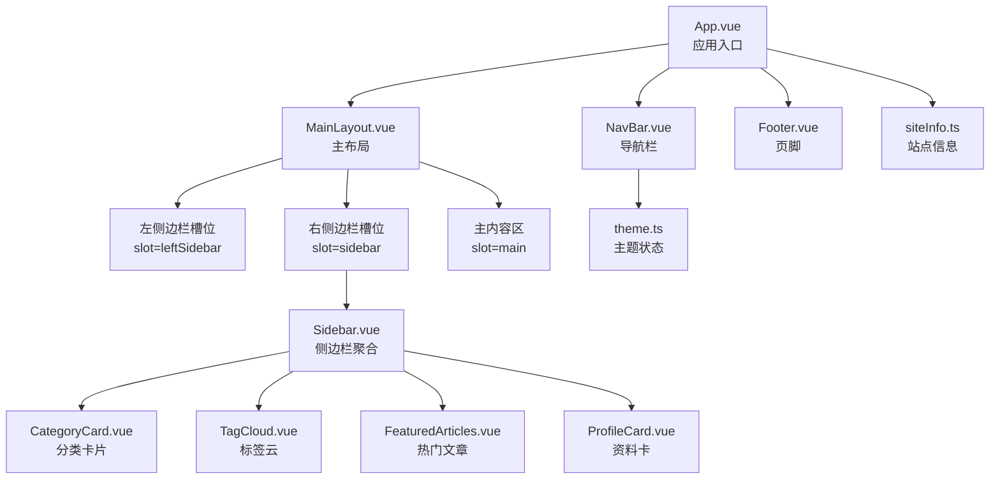
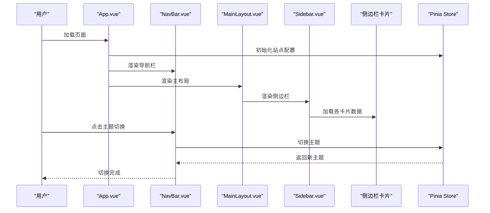
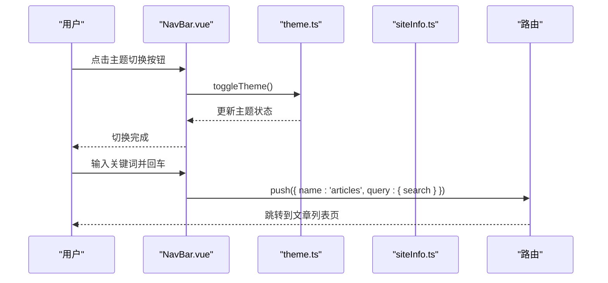
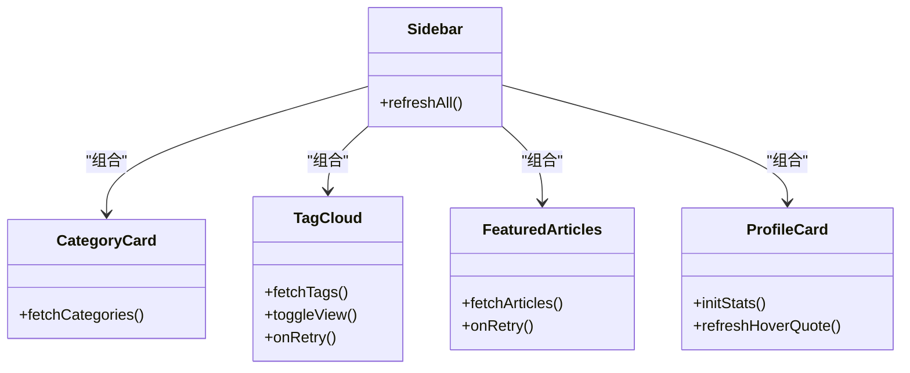
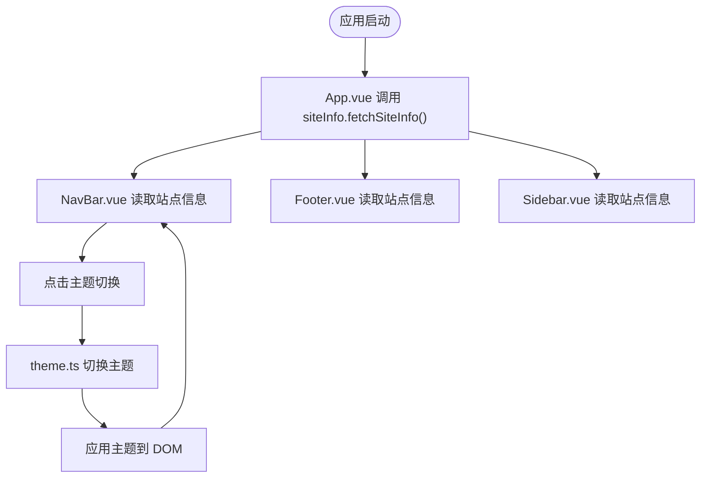
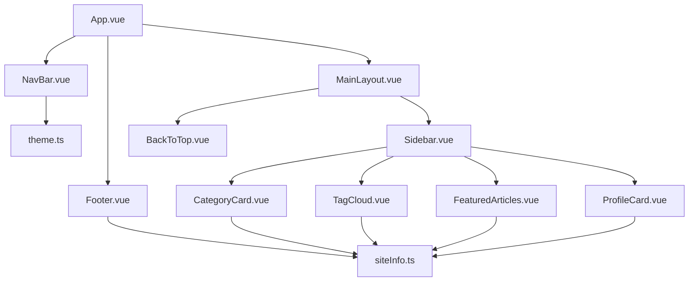

# 布局系统

<cite>
**本文档引用的文件**
- [MainLayout.vue](file://web/frontend/src/components/layout/MainLayout.vue)
- [NavBar.vue](file://web/frontend/src/components/NavBar.vue)
- [Footer.vue](file://web/frontend/src/components/Footer.vue)
- [Sidebar.vue](file://web/frontend/src/components/Sidebar.vue)
- [CategoryCard.vue](file://web/frontend/src/components/sidebar/CategoryCard.vue)
- [TagCloud.vue](file://web/frontend/src/components/sidebar/TagCloud.vue)
- [FeaturedArticles.vue](file://web/frontend/src/components/sidebar/FeaturedArticles.vue)
- [ProfileCard.vue](file://web/frontend/src/components/sidebar/ProfileCard.vue)
- [theme.ts](file://web/frontend/src/stores/theme.ts)
- [siteInfo.ts](file://web/frontend/src/stores/siteInfo.ts)
- [App.vue](file://web/frontend/src/App.vue)
- [main.css](file://web/frontend/src/assets/main.css)
- [base.css](file://web/frontend/src/assets/base.css)
- [index.ts](file://web/frontend/src/router/index.ts)
</cite>

## 目录
1. [简介](#简介)
2. [项目结构](#项目结构)
3. [核心组件](#核心组件)
4. [架构总览](#架构总览)
5. [详细组件分析](#详细组件分析)
6. [依赖关系分析](#依赖关系分析)
7. [性能考量](#性能考量)
8. [故障排查指南](#故障排查指南)
9. [结论](#结论)
10. [附录](#附录)

## 简介
本文件面向前台展示网站的布局系统，重点围绕主布局组件 MainLayout 的设计与实现进行深入解析，涵盖响应式布局策略、网格系统的使用方式；导航栏组件的菜单结构、用户交互与移动端适配；页脚组件的功能与版权信息展示；侧边栏组件的模块化设计（分类卡片、标签云、热门文章等）；以及布局组件之间的通信机制与状态管理。同时提供布局样式的定制选项与主题切换功能的实现细节，并给出布局组件的扩展与自定义指南，帮助开发者快速理解并高效迭代前端布局。

## 项目结构
前台布局系统主要由以下层次构成：
- 应用入口与顶层容器：App.vue 负责加载站点配置、注入图标字体与 Favicon、设置页面标题、管理全局过渡动画与加载态。
- 布局骨架：MainLayout.vue 提供三栏布局（左右侧边栏 + 主内容区），支持全宽模式与响应式断点。
- 导航与页脚：NavBar.vue 实现桌面与移动端双态导航、主题切换、搜索、下拉社交菜单与浮动阅读进度；Footer.vue 展示版权、ICP、相关链接等信息。
- 侧边栏模块：Sidebar.vue 作为聚合容器，组合多个功能卡片（分类、标签云、热门文章、资料卡等），并暴露统一刷新接口。
- 状态管理：Pinia Store 中的 theme.ts 与 siteInfo.ts 提供主题切换与站点信息的集中管理。
- 样式体系：base.css 定义 CSS 变量与深色模式映射；main.css 提供全局样式与媒体查询。

**图表来源**
- [App.vue:1-215](file://web/frontend/src/App.vue#L1-L215)
- [MainLayout.vue:1-130](file://web/frontend/src/components/layout/MainLayout.vue#L1-L130)
- [NavBar.vue:1-971](file://web/frontend/src/components/NavBar.vue#L1-L971)
- [Footer.vue:1-182](file://web/frontend/src/components/Footer.vue#L1-L182)
- [Sidebar.vue:1-80](file://web/frontend/src/components/Sidebar.vue#L1-L80)
- [CategoryCard.vue:1-115](file://web/frontend/src/components/sidebar/CategoryCard.vue#L1-L115)
- [TagCloud.vue:1-718](file://web/frontend/src/components/sidebar/TagCloud.vue#L1-L718)
- [FeaturedArticles.vue:1-262](file://web/frontend/src/components/sidebar/FeaturedArticles.vue#L1-L262)
- [ProfileCard.vue:1-333](file://web/frontend/src/components/sidebar/ProfileCard.vue#L1-L333)
- [theme.ts:1-39](file://web/frontend/src/stores/theme.ts#L1-L39)
- [siteInfo.ts:1-261](file://web/frontend/src/stores/siteInfo.ts#L1-L261)

**章节来源**
- [App.vue:1-215](file://web/frontend/src/App.vue#L1-L215)
- [MainLayout.vue:1-130](file://web/frontend/src/components/layout/MainLayout.vue#L1-L130)
- [NavBar.vue:1-971](file://web/frontend/src/components/NavBar.vue#L1-L971)
- [Footer.vue:1-182](file://web/frontend/src/components/Footer.vue#L1-L182)
- [Sidebar.vue:1-80](file://web/frontend/src/components/Sidebar.vue#L1-L80)
- [CategoryCard.vue:1-115](file://web/frontend/src/components/sidebar/CategoryCard.vue#L1-L115)
- [TagCloud.vue:1-718](file://web/frontend/src/components/sidebar/TagCloud.vue#L1-L718)
- [FeaturedArticles.vue:1-262](file://web/frontend/src/components/sidebar/FeaturedArticles.vue#L1-L262)
- [ProfileCard.vue:1-333](file://web/frontend/src/components/sidebar/ProfileCard.vue#L1-L333)
- [theme.ts:1-39](file://web/frontend/src/stores/theme.ts#L1-L39)
- [siteInfo.ts:1-261](file://web/frontend/src/stores/siteInfo.ts#L1-L261)
- [main.css:1-331](file://web/frontend/src/assets/main.css#L1-L331)
- [base.css:1-187](file://web/frontend/src/assets/base.css#L1-L187)

## 核心组件
本节聚焦主布局组件 MainLayout 的设计与实现要点，包括响应式策略、网格系统、插槽机制与样式组织。

- 插槽与布局结构
  - 左侧边栏槽位：通过条件渲染判断是否存在插槽内容，避免空占位造成布局浪费。
  - 主内容区：使用弹性布局撑满剩余空间，确保内容区在不同屏幕宽度下的自适应。
  - 右侧边栏槽位：同样支持按需渲染，便于在不同页面插入不同的侧边栏内容。
  - 返回顶部组件：在容器内尾部引入，提升长页面的可访问性。

- 响应式策略
  - 容器宽度：默认最大宽度约束，配合全宽模式属性实现内容区的横向扩展。
  - 内容区布局：采用 Flexbox 布局，设置最小高度与对齐方式，保证在不同断点下内容区的稳定高度。
  - 侧边栏宽度：在桌面端固定宽度，在中等屏（992px）以下转为纵向堆叠，侧边栏以行内流式布局自适应，卡片具备最小宽度保障可读性。
  - 移动端适配：在 768px 以下进一步调整为单列布局，卡片宽度为 100%，确保触控友好。

- 样式组织
  - 使用 CSS 变量与媒体查询，结合 scoped 样式减少全局污染。
  - 通过类名组合与断点规则，实现“桌面优先”的渐进增强策略。

**章节来源**
- [MainLayout.vue:1-130](file://web/frontend/src/components/layout/MainLayout.vue#L1-L130)
- [main.css:85-91](file://web/frontend/src/assets/main.css#L85-L91)
- [base.css:26-123](file://web/frontend/src/assets/base.css#L26-L123)

## 架构总览
布局系统采用“容器 + 模块化卡片”的分层架构：
- 容器层：App.vue 负责全局加载与资源注入；MainLayout.vue 提供三栏布局骨架。
- 导航层：NavBar.vue 负责站点导航、主题切换、移动端抽屉与搜索。
- 内容层：路由视图通过 App.vue 的路由插槽注入到 MainLayout 的主内容区。
- 侧边栏层：Sidebar.vue 聚合多个功能卡片，每个卡片独立负责数据获取与渲染。
- 状态层：theme.ts 与 siteInfo.ts 提供主题与站点信息的集中管理，供各组件消费。

**图表来源**
- [App.vue:1-215](file://web/frontend/src/App.vue#L1-L215)
- [NavBar.vue:1-971](file://web/frontend/src/components/NavBar.vue#L1-L971)
- [MainLayout.vue:1-130](file://web/frontend/src/components/layout/MainLayout.vue#L1-L130)
- [Sidebar.vue:1-80](file://web/frontend/src/components/Sidebar.vue#L1-L80)
- [theme.ts:1-39](file://web/frontend/src/stores/theme.ts#L1-L39)
- [siteInfo.ts:1-261](file://web/frontend/src/stores/siteInfo.ts#L1-L261)

## 详细组件分析

### 主布局组件 MainLayout
- 设计目标
  - 提供稳定的三栏布局骨架，支持左右侧边栏与主内容区的灵活组合。
  - 通过 props 控制全宽模式，满足不同页面的布局需求。
  - 以插槽形式解耦内容，提高复用性与可维护性。

- 响应式策略
  - 在桌面端维持固定宽度的侧边栏与弹性主内容区。
  - 在中等屏（992px）以下，侧边栏改为行内流式布局，卡片具备最小宽度保障可读性。
  - 在 768px 以下，整体转为单列布局，侧边栏卡片宽度为 100%。

- 样式与网格
  - 使用 Flexbox 与 gap 实现栅格化布局，避免传统表格型网格带来的复杂性。
  - 通过媒体查询在不同断点下调整容器内边距与侧边栏宽度，确保视觉一致性。

- 扩展建议
  - 如需新增侧边栏区域，可在 MainLayout 中增加新的插槽与对应的响应式规则。
  - 对于需要固定定位的侧边栏，可结合 sticky 定位与 top 偏移，确保与导航栏高度协调。

**章节来源**
- [MainLayout.vue:1-130](file://web/frontend/src/components/layout/MainLayout.vue#L1-L130)
- [main.css:85-91](file://web/frontend/src/assets/main.css#L85-L91)
- [base.css:26-123](file://web/frontend/src/assets/base.css#L26-L123)

### 导航栏组件 NavBar
- 菜单结构
  - 桌面端：Logo 区域、居中导航菜单（首页、文章、分类、归档、关于），关于项支持下拉社交菜单。
  - 移动端：汉堡菜单抽屉，包含搜索框、导航项、社交链接与管理入口。

- 用户交互
  - 主题切换：点击切换图标在明暗主题间切换，状态持久化至本地存储。
  - 搜索功能：支持回车触发，跳转到文章列表并携带查询参数。
  - 浮动进度：根据滚动进度绘制圆形进度条，支持悬浮显示。

- 移动端适配
  - 抽屉式菜单，遮罩层与抽屉分离，确保交互体验与层级清晰。
  - 在打开抽屉时禁止背景滚动，避免误操作。

- 与状态管理
  - 通过 Pinia Store 的 siteInfo 与 theme，动态绑定站点名称、Logo、社交链接与主题状态。

**图表来源**
- [NavBar.vue:1-971](file://web/frontend/src/components/NavBar.vue#L1-L971)
- [theme.ts:1-39](file://web/frontend/src/stores/theme.ts#L1-L39)
- [siteInfo.ts:1-261](file://web/frontend/src/stores/siteInfo.ts#L1-L261)
- [index.ts:1-73](file://web/frontend/src/router/index.ts#L1-L73)

**章节来源**
- [NavBar.vue:1-971](file://web/frontend/src/components/NavBar.vue#L1-L971)
- [theme.ts:1-39](file://web/frontend/src/stores/theme.ts#L1-L39)
- [siteInfo.ts:1-261](file://web/frontend/src/stores/siteInfo.ts#L1-L261)
- [index.ts:1-73](file://web/frontend/src/router/index.ts#L1-L73)

### 页脚组件 Footer
- 功能概述
  - 展示站点名称、标语、邮箱、版权信息与 ICP 备案链接（可选）。
  - 支持展示作品集与相关链接，增强外部关联。

- 版权信息展示
  - 通过站点配置中的 footer 字段控制显示内容与样式。
  - 在移动端与平板端调整为垂直堆叠布局，提升可读性。

- 与站点配置的关系
  - 页脚内容完全由 siteInfo.store 提供，无需硬编码，便于运营配置。

**章节来源**
- [Footer.vue:1-182](file://web/frontend/src/components/Footer.vue#L1-L182)
- [siteInfo.ts:1-261](file://web/frontend/src/stores/siteInfo.ts#L1-L261)

### 侧边栏组件 Sidebar 与模块化卡片
- 聚合容器
  - Sidebar.vue 作为聚合容器，统一引入天气、快捷方式、热门文章、服务器状态、标签云等卡片。
  - 暴露统一的刷新方法，便于在父组件中批量刷新各卡片数据。

- 卡片模块化设计
  - CategoryCard：展示分类网格，支持跳转到分类详情。
  - TagCloud：支持列表与 3D 视图切换，内置动画与交互，支持重试与加载状态。
  - FeaturedArticles：展示热门文章列表，支持骨架屏与错误重试。
  - ProfileCard：展示作者信息、社交链接、统计数据与名言轮播，支持悬停气泡提示。

- 数据获取与状态
  - 各卡片通过独立的 API 接口获取数据，使用 Pinia Store 的 siteInfo 与 theme 提供的配置。
  - 错误处理与加载状态通过局部状态管理，避免影响整体布局。

**图表来源**
- [Sidebar.vue:1-80](file://web/frontend/src/components/Sidebar.vue#L1-L80)
- [CategoryCard.vue:1-115](file://web/frontend/src/components/sidebar/CategoryCard.vue#L1-L115)
- [TagCloud.vue:1-718](file://web/frontend/src/components/sidebar/TagCloud.vue#L1-L718)
- [FeaturedArticles.vue:1-262](file://web/frontend/src/components/sidebar/FeaturedArticles.vue#L1-L262)
- [ProfileCard.vue:1-333](file://web/frontend/src/components/sidebar/ProfileCard.vue#L1-L333)

**章节来源**
- [Sidebar.vue:1-80](file://web/frontend/src/components/Sidebar.vue#L1-L80)
- [CategoryCard.vue:1-115](file://web/frontend/src/components/sidebar/CategoryCard.vue#L1-L115)
- [TagCloud.vue:1-718](file://web/frontend/src/components/sidebar/TagCloud.vue#L1-L718)
- [FeaturedArticles.vue:1-262](file://web/frontend/src/components/sidebar/FeaturedArticles.vue#L1-L262)
- [ProfileCard.vue:1-333](file://web/frontend/src/components/sidebar/ProfileCard.vue#L1-L333)

### 布局组件间的通信机制与状态管理
- 主题切换
  - theme.ts 使用 Pinia 管理主题状态，监听变化并写入本地存储，同时通过 DOM 属性与类名切换深色模式。
  - NavBar.vue 通过 Pinia Store 的 theme 方法触发切换，实现 UI 与状态的一致性。

- 站点信息
  - siteInfo.ts 提供站点配置的获取、更新与刷新能力，App.vue 在挂载阶段调用 fetchSiteInfo，确保导航栏、页脚与侧边栏卡片能及时获取最新配置。
  - Footer.vue 与 NavBar.vue 均通过 storeToRefs 读取站点信息，实现响应式更新。

- 侧边栏刷新
  - Sidebar.vue 暴露 refreshAll 方法，内部调用各卡片的刷新方法，便于在父组件中统一触发数据刷新。

**图表来源**
- [App.vue:1-215](file://web/frontend/src/App.vue#L1-L215)
- [siteInfo.ts:1-261](file://web/frontend/src/stores/siteInfo.ts#L1-L261)
- [NavBar.vue:1-971](file://web/frontend/src/components/NavBar.vue#L1-L971)
- [Footer.vue:1-182](file://web/frontend/src/components/Footer.vue#L1-L182)
- [Sidebar.vue:1-80](file://web/frontend/src/components/Sidebar.vue#L1-L80)
- [theme.ts:1-39](file://web/frontend/src/stores/theme.ts#L1-L39)

**章节来源**
- [theme.ts:1-39](file://web/frontend/src/stores/theme.ts#L1-L39)
- [siteInfo.ts:1-261](file://web/frontend/src/stores/siteInfo.ts#L1-L261)
- [App.vue:1-215](file://web/frontend/src/App.vue#L1-L215)
- [NavBar.vue:1-971](file://web/frontend/src/components/NavBar.vue#L1-L971)
- [Footer.vue:1-182](file://web/frontend/src/components/Footer.vue#L1-L182)
- [Sidebar.vue:1-80](file://web/frontend/src/components/Sidebar.vue#L1-L80)

### 布局样式的定制选项与主题切换
- CSS 变量体系
  - base.css 定义了明/暗两套颜色变量，通过 :root 与 [data-theme="dark"] 实现主题切换。
  - main.css 与各组件 scoped 样式均使用这些变量，确保全局一致的视觉风格。

- 主题切换流程
  - theme.ts 读取本地存储或系统偏好，初始化主题；切换时写入本地存储并应用到 DOM。
  - NavBar.vue 的主题切换按钮与 SVG 图标根据当前主题显示不同形态。

- 定制建议
  - 如需扩展主题变量，可在 base.css 中新增变量并在组件中引用。
  - 若需多主题方案，可在 theme.ts 中扩展状态与切换逻辑，并在 DOM 上应用额外类名。

**章节来源**
- [base.css:26-123](file://web/frontend/src/assets/base.css#L26-L123)
- [main.css:1-331](file://web/frontend/src/assets/main.css#L1-L331)
- [theme.ts:1-39](file://web/frontend/src/stores/theme.ts#L1-L39)
- [NavBar.vue:1-971](file://web/frontend/src/components/NavBar.vue#L1-L971)

### 开发者扩展与自定义指南
- 新增侧边栏卡片
  - 在 Sidebar.vue 中引入新卡片组件，并在模板中添加对应节点。
  - 如需统一刷新，可在 Sidebar.vue 中扩展 refreshAll 方法，调用新卡片的刷新方法。

- 自定义主布局
  - 在 MainLayout.vue 中新增插槽与响应式规则，确保在不同断点下布局稳定。
  - 如需全宽模式，可通过 props 控制容器类名，配合媒体查询调整内边距。

- 优化交互体验
  - 在 NavBar.vue 中扩展移动端抽屉的交互细节，如滑动关闭、点击遮罩关闭等。
  - 在侧边栏卡片中完善错误处理与加载状态，提升弱网环境下的用户体验。

- 性能优化建议
  - 使用虚拟滚动或分页加载大量数据的卡片（如标签云、热门文章）。
  - 对 3D 动画卡片（如 TagCloud）在离开可视区域时暂停动画，回到可视区域时恢复。

**章节来源**
- [MainLayout.vue:1-130](file://web/frontend/src/components/layout/MainLayout.vue#L1-L130)
- [Sidebar.vue:1-80](file://web/frontend/src/components/Sidebar.vue#L1-L80)
- [TagCloud.vue:1-718](file://web/frontend/src/components/sidebar/TagCloud.vue#L1-L718)
- [FeaturedArticles.vue:1-262](file://web/frontend/src/components/sidebar/FeaturedArticles.vue#L1-L262)

## 依赖关系分析
- 组件依赖
  - App.vue 依赖 NavBar、Footer、LoadingSpinner 与 Pinia Store。
  - MainLayout.vue 依赖 BackToTop 并通过插槽承载内容。
  - Sidebar.vue 依赖多个卡片组件，并向父组件暴露刷新方法。
  - 各卡片组件依赖 API 服务与 Pinia Store 的 siteInfo 与 theme。

- 状态依赖
  - theme.ts 与 siteInfo.ts 为全局共享状态，被导航栏、页脚与侧边栏卡片广泛使用。
  - NavBar.vue 与 Footer.vue 通过 storeToRefs 读取状态，实现响应式更新。

**图表来源**
- [App.vue:1-215](file://web/frontend/src/App.vue#L1-L215)
- [MainLayout.vue:1-130](file://web/frontend/src/components/layout/MainLayout.vue#L1-L130)
- [NavBar.vue:1-971](file://web/frontend/src/components/NavBar.vue#L1-L971)
- [Footer.vue:1-182](file://web/frontend/src/components/Footer.vue#L1-L182)
- [Sidebar.vue:1-80](file://web/frontend/src/components/Sidebar.vue#L1-L80)
- [CategoryCard.vue:1-115](file://web/frontend/src/components/sidebar/CategoryCard.vue#L1-L115)
- [TagCloud.vue:1-718](file://web/frontend/src/components/sidebar/TagCloud.vue#L1-L718)
- [FeaturedArticles.vue:1-262](file://web/frontend/src/components/sidebar/FeaturedArticles.vue#L1-L262)
- [ProfileCard.vue:1-333](file://web/frontend/src/components/sidebar/ProfileCard.vue#L1-L333)
- [theme.ts:1-39](file://web/frontend/src/stores/theme.ts#L1-L39)
- [siteInfo.ts:1-261](file://web/frontend/src/stores/siteInfo.ts#L1-L261)

**章节来源**
- [App.vue:1-215](file://web/frontend/src/App.vue#L1-L215)
- [MainLayout.vue:1-130](file://web/frontend/src/components/layout/MainLayout.vue#L1-L130)
- [NavBar.vue:1-971](file://web/frontend/src/components/NavBar.vue#L1-L971)
- [Footer.vue:1-182](file://web/frontend/src/components/Footer.vue#L1-L182)
- [Sidebar.vue:1-80](file://web/frontend/src/components/Sidebar.vue#L1-L80)
- [CategoryCard.vue:1-115](file://web/frontend/src/components/sidebar/CategoryCard.vue#L1-L115)
- [TagCloud.vue:1-718](file://web/frontend/src/components/sidebar/TagCloud.vue#L1-L718)
- [FeaturedArticles.vue:1-262](file://web/frontend/src/components/sidebar/FeaturedArticles.vue#L1-L262)
- [ProfileCard.vue:1-333](file://web/frontend/src/components/sidebar/ProfileCard.vue#L1-L333)
- [theme.ts:1-39](file://web/frontend/src/stores/theme.ts#L1-L39)
- [siteInfo.ts:1-261](file://web/frontend/src/stores/siteInfo.ts#L1-L261)

## 性能考量
- 动画与交互
  - 3D 标签云使用 requestAnimationFrame 控制动画，离开可视区域时应停止动画以节省资源。
  - 热门文章与标签云在加载时使用骨架屏，减少白屏时间与布局抖动。

- 资源加载
  - App.vue 在挂载阶段异步加载站点配置与图标字体，避免阻塞首屏渲染。
  - 图片与视频采用自适应宽高与圆角，兼顾美观与性能。

- 响应式与布局
  - 通过媒体查询与 Flexbox 实现自适应布局，减少复杂计算与重排。
  - 侧边栏卡片在移动端转为单列布局，降低渲染压力。

[本节为通用指导，无需特定文件来源]

## 故障排查指南
- 主题切换无效
  - 检查 theme.ts 是否正确写入本地存储与应用 DOM 属性。
  - 确认 base.css 中的主题变量是否生效。

- 站点信息未更新
  - 确认 App.vue 是否在挂载阶段调用了 siteInfo.fetchSiteInfo。
  - 检查 API 返回的数据结构与字段是否与 store 定义一致。

- 侧边栏卡片数据为空
  - 检查各卡片组件的 API 请求是否成功，确认错误处理与重试逻辑。
  - 确认 Sidebar.vue 的 refreshAll 方法是否正确调用各卡片的刷新方法。

- 移动端抽屉无法关闭
  - 检查 NavBar.vue 中抽屉开关逻辑与背景滚动禁用/启用的时机。

**章节来源**
- [theme.ts:1-39](file://web/frontend/src/stores/theme.ts#L1-L39)
- [siteInfo.ts:1-261](file://web/frontend/src/stores/siteInfo.ts#L1-L261)
- [App.vue:1-215](file://web/frontend/src/App.vue#L1-L215)
- [NavBar.vue:1-971](file://web/frontend/src/components/NavBar.vue#L1-L971)
- [Sidebar.vue:1-80](file://web/frontend/src/components/Sidebar.vue#L1-L80)
- [TagCloud.vue:1-718](file://web/frontend/src/components/sidebar/TagCloud.vue#L1-L718)
- [FeaturedArticles.vue:1-262](file://web/frontend/src/components/sidebar/FeaturedArticles.vue#L1-L262)

## 结论
该布局系统以 MainLayout 为核心骨架，结合 NavBar、Footer 与 Sidebar 的模块化设计，实现了高可复用、强响应式的前端布局。通过 Pinia Store 的集中状态管理与 CSS 变量的主题体系，系统在易维护性与可定制性方面表现优异。开发者可基于现有插槽与卡片机制快速扩展新功能，并通过媒体查询与动画优化持续提升用户体验。

[本节为总结性内容，无需特定文件来源]

## 附录
- 常用断点参考
  - 桌面端：≥ 1200px
  - 中等屏：992px - 1199px
  - 平板端：768px - 991px
  - 移动端：< 768px

- 主题变量命名规范
  - 背景系：--color-background, --color-background-soft, --color-background-mute
  - 边框与阴影：--color-border, --color-border-hover, --color-shadow
  - 文本与强调色：--color-text, --color-text-secondary, --color-accent

[本节为通用参考，无需特定文件来源]