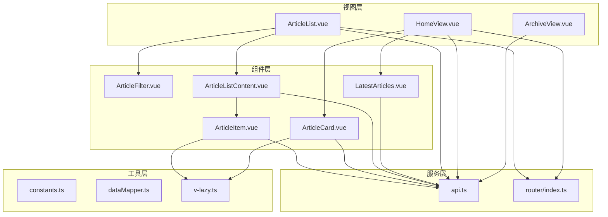
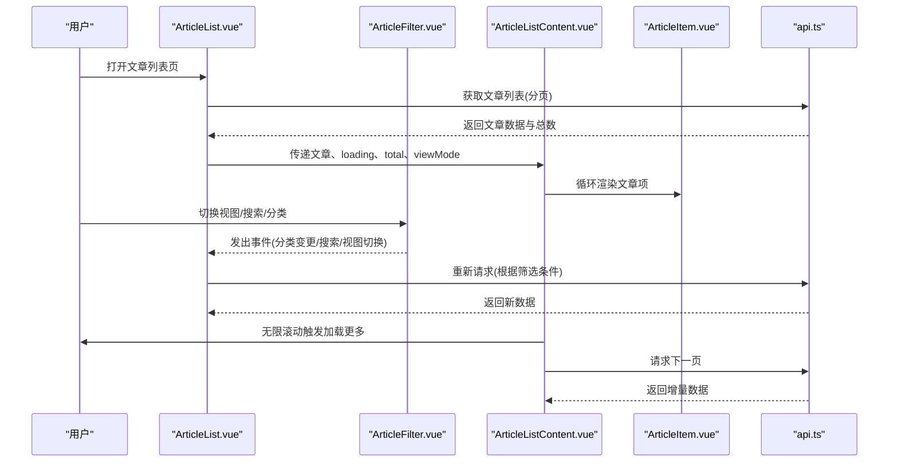
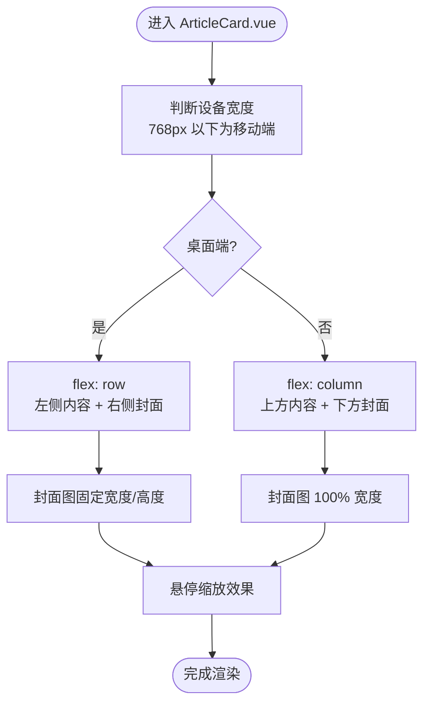
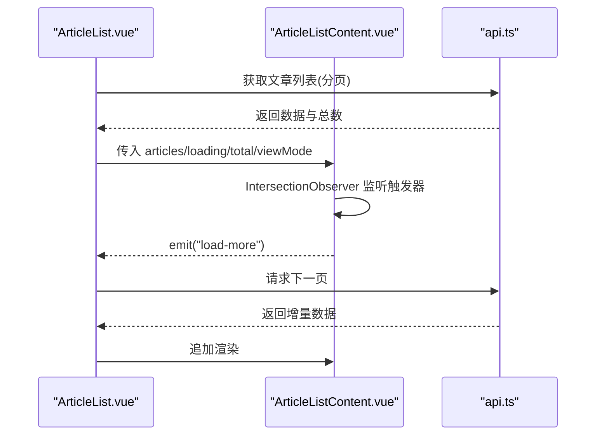
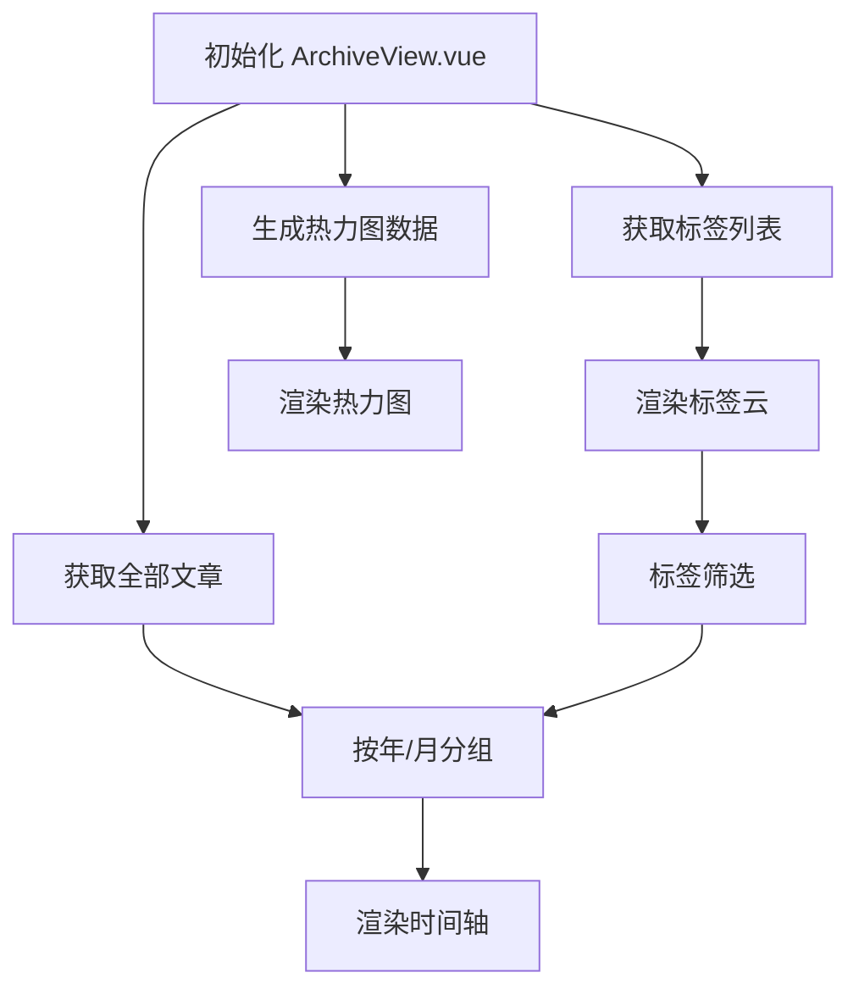
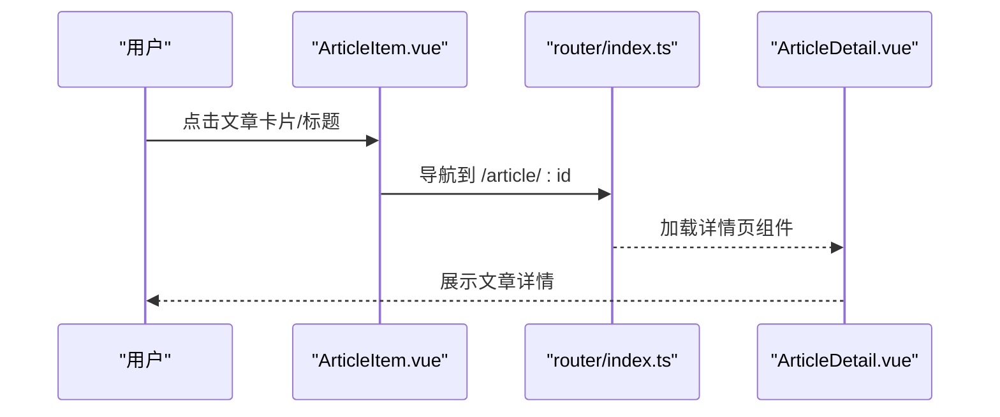
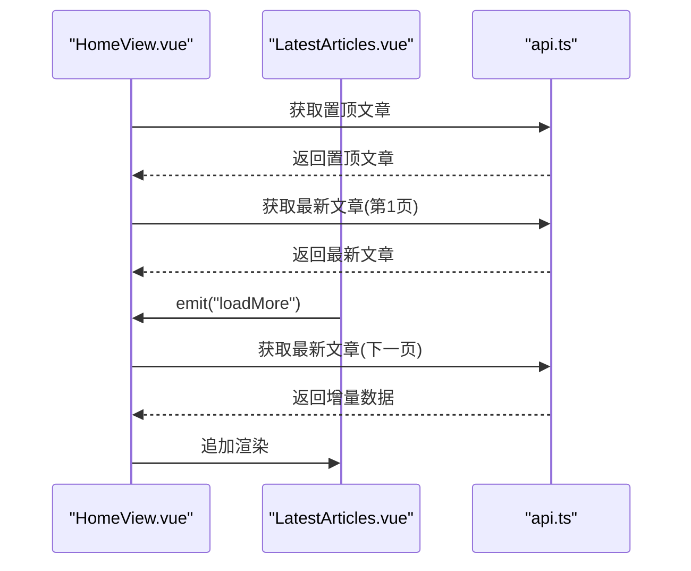
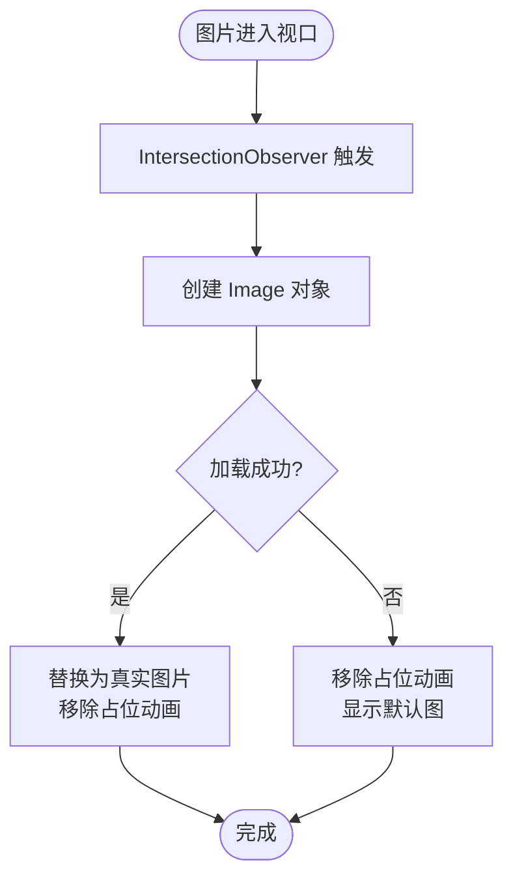
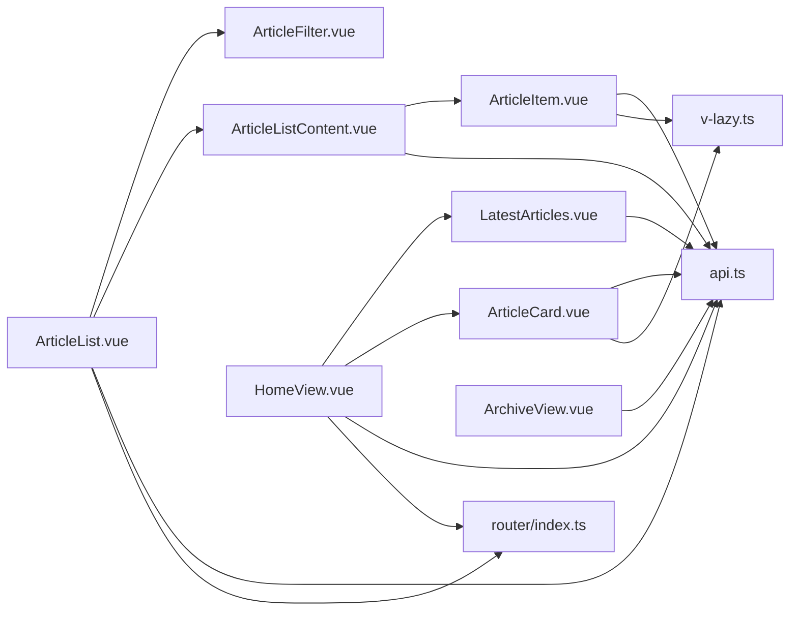

# 文章列表展示

<cite>
**本文引用的文件**
- [ArticleListContent.vue](file://web/frontend/src/components/article/ArticleListContent.vue)
- [ArticleList.vue](file://web/frontend/src/views/ArticleList.vue)
- [HomeView.vue](file://web/frontend/src/views/HomeView.vue)
- [ArticleCard.vue](file://web/frontend/src/components/home/ArticleCard.vue)
- [LatestArticles.vue](file://web/frontend/src/components/home/LatestArticles.vue)
- [ArchiveView.vue](file://web/frontend/src/views/ArchiveView.vue)
- [ArticleItem.vue](file://web/frontend/src/components/article/ArticleItem.vue)
- [ArticleFilter.vue](file://web/frontend/src/components/article/ArticleFilter.vue)
- [api.ts](file://web/frontend/src/services/api.ts)
- [constants.ts](file://web/frontend/src/utils/constants.ts)
- [dataMapper.ts](file://web/frontend/src/utils/dataMapper.ts)
- [v-lazy.ts](file://web/frontend/src/directives/v-lazy.ts)
- [index.ts](file://web/frontend/src/router/index.ts)
</cite>

## 目录
1. [引言](#引言)
2. [项目结构](#项目结构)
3. [核心组件](#核心组件)
4. [架构概览](#架构概览)
5. [详细组件分析](#详细组件分析)
6. [依赖关系分析](#依赖关系分析)
7. [性能考虑](#性能考虑)
8. [故障排查指南](#故障排查指南)
9. [结论](#结论)
10. [附录](#附录)

## 引言
本文件聚焦于文章列表展示功能，涵盖首页文章卡片布局与响应式适配、文章列表内容组件的数据获取与渲染机制、归档页面的时间轴展示与分类筛选、文章项组件的点击跳转与预览效果、最新文章组件的动态更新与缓存策略、懒加载实现与性能优化方案，以及分页机制与无限滚动的集成指南。目标是帮助开发者快速理解并扩展该功能模块。

## 项目结构
前端采用 Vue 3 + TypeScript 架构，文章列表相关逻辑主要分布在以下目录：
- 视图层：文章列表页、首页、归档页
- 组件层：文章卡片、文章列表内容、文章筛选器、最新文章等
- 服务层：API 客户端封装与路由配置
- 工具层：常量、数据映射、指令（懒加载）

**图表来源**
- [ArticleList.vue:1-225](file://web/frontend/src/views/ArticleList.vue#L1-L225)
- [ArticleListContent.vue:1-266](file://web/frontend/src/components/article/ArticleListContent.vue#L1-L266)
- [ArticleItem.vue:1-322](file://web/frontend/src/components/article/ArticleItem.vue#L1-L322)
- [ArticleFilter.vue:1-272](file://web/frontend/src/components/article/ArticleFilter.vue#L1-L272)
- [HomeView.vue:1-133](file://web/frontend/src/views/HomeView.vue#L1-L133)
- [ArticleCard.vue:1-269](file://web/frontend/src/components/home/ArticleCard.vue#L1-L269)
- [LatestArticles.vue:1-177](file://web/frontend/src/components/home/LatestArticles.vue#L1-L177)
- [ArchiveView.vue:1-888](file://web/frontend/src/views/ArchiveView.vue#L1-L888)
- [api.ts:1-137](file://web/frontend/src/services/api.ts#L1-L137)
- [router/index.ts:1-73](file://web/frontend/src/router/index.ts#L1-L73)
- [constants.ts:1-48](file://web/frontend/src/utils/constants.ts#L1-L48)
- [dataMapper.ts:1-50](file://web/frontend/src/utils/dataMapper.ts#L1-L50)
- [v-lazy.ts:1-63](file://web/frontend/src/directives/v-lazy.ts#L1-L63)

**章节来源**
- [ArticleList.vue:1-225](file://web/frontend/src/views/ArticleList.vue#L1-L225)
- [ArticleListContent.vue:1-266](file://web/frontend/src/components/article/ArticleListContent.vue#L1-L266)
- [ArticleItem.vue:1-322](file://web/frontend/src/components/article/ArticleItem.vue#L1-L322)
- [ArticleFilter.vue:1-272](file://web/frontend/src/components/article/ArticleFilter.vue#L1-L272)
- [HomeView.vue:1-133](file://web/frontend/src/views/HomeView.vue#L1-L133)
- [ArticleCard.vue:1-269](file://web/frontend/src/components/home/ArticleCard.vue#L1-L269)
- [LatestArticles.vue:1-177](file://web/frontend/src/components/home/LatestArticles.vue#L1-L177)
- [ArchiveView.vue:1-888](file://web/frontend/src/views/ArchiveView.vue#L1-L888)
- [api.ts:1-137](file://web/frontend/src/services/api.ts#L1-L137)
- [router/index.ts:1-73](file://web/frontend/src/router/index.ts#L1-L73)
- [constants.ts:1-48](file://web/frontend/src/utils/constants.ts#L1-L48)
- [dataMapper.ts:1-50](file://web/frontend/src/utils/dataMapper.ts#L1-L50)
- [v-lazy.ts:1-63](file://web/frontend/src/directives/v-lazy.ts#L1-L63)

## 核心组件
- 文章列表内容组件：负责网格/列表视图、骨架屏、无限滚动触发、空状态与加载状态管理。
- 文章项组件：承载单篇文章卡片，支持网格/列表两种布局、标签截断、高亮搜索关键词、懒加载封面图。
- 文章筛选器：提供分类 Tab、搜索输入（带防抖）、视图切换（网格/列表）。
- 首页最新文章组件：首页“最新文章”区域，支持分页加载更多。
- 归档页面：时间轴展示、标签筛选、贡献热力图、年导航。
- API 服务：统一的 axios 客户端与请求拦截器、取消控制器。
- 懒加载指令：IntersectionObserver 实现的图片懒加载，含占位动画。

**章节来源**
- [ArticleListContent.vue:1-266](file://web/frontend/src/components/article/ArticleListContent.vue#L1-L266)
- [ArticleItem.vue:1-322](file://web/frontend/src/components/article/ArticleItem.vue#L1-L322)
- [ArticleFilter.vue:1-272](file://web/frontend/src/components/article/ArticleFilter.vue#L1-L272)
- [LatestArticles.vue:1-177](file://web/frontend/src/components/home/LatestArticles.vue#L1-L177)
- [ArchiveView.vue:1-888](file://web/frontend/src/views/ArchiveView.vue#L1-L888)
- [api.ts:1-137](file://web/frontend/src/services/api.ts#L1-L137)
- [v-lazy.ts:1-63](file://web/frontend/src/directives/v-lazy.ts#L1-L63)

## 架构概览
文章列表展示涉及三层交互：
- 视图层：ArticleList.vue、HomeView.vue、ArchiveView.vue
- 组件层：ArticleListContent.vue、ArticleItem.vue、ArticleFilter.vue、ArticleCard.vue、LatestArticles.vue
- 服务层：api.ts 提供文章、分类、标签等 API；router/index.ts 管理路由与参数校验；constants.ts 定义分页与断点；dataMapper.ts 统一数据映射；v-lazy.ts 提供懒加载指令

**图表来源**
- [ArticleList.vue:1-225](file://web/frontend/src/views/ArticleList.vue#L1-L225)
- [ArticleFilter.vue:1-272](file://web/frontend/src/components/article/ArticleFilter.vue#L1-L272)
- [ArticleListContent.vue:1-266](file://web/frontend/src/components/article/ArticleListContent.vue#L1-L266)
- [ArticleItem.vue:1-322](file://web/frontend/src/components/article/ArticleItem.vue#L1-L322)
- [api.ts:1-137](file://web/frontend/src/services/api.ts#L1-L137)

## 详细组件分析

### 首页文章卡片布局与响应式适配
- 布局结构：卡片采用左右布局（桌面端），左侧内容区，右侧封面图；移动端自动切换为上下布局。
- 样式特性：悬停时卡片提升阴影与轻微位移；封面图固定尺寸并支持缩放过渡；标题与摘要使用行数限制与省略号处理。
- 响应式断点：在 768px 以下自动切换为移动端布局，封面图宽度调整为 100%，内容区与封面图顺序互换。

**图表来源**
- [ArticleCard.vue:1-269](file://web/frontend/src/components/home/ArticleCard.vue#L1-L269)

**章节来源**
- [ArticleCard.vue:1-269](file://web/frontend/src/components/home/ArticleCard.vue#L1-L269)

### 文章列表内容组件的数据获取与渲染机制
- 数据流：ArticleList.vue 通过 api.ts 获取文章列表，支持搜索优先、分类筛选、全量文章三种模式；ArticleListContent.vue 负责渲染与无限滚动。
- 无限滚动：使用 IntersectionObserver 监听“加载更多”触发器，在接近可视区域时发出 load-more 事件，ArticleList.vue 增量加载下一页。
- 骨架屏：在首次加载且无数据时显示骨架屏，网格/列表两种布局分别对应不同骨架模板。
- 空状态：无数据时显示“暂无文章”。

**图表来源**
- [ArticleList.vue:1-225](file://web/frontend/src/views/ArticleList.vue#L1-L225)
- [ArticleListContent.vue:1-266](file://web/frontend/src/components/article/ArticleListContent.vue#L1-L266)
- [api.ts:1-137](file://web/frontend/src/services/api.ts#L1-L137)

**章节来源**
- [ArticleList.vue:1-225](file://web/frontend/src/views/ArticleList.vue#L1-L225)
- [ArticleListContent.vue:1-266](file://web/frontend/src/components/article/ArticleListContent.vue#L1-L266)

### 归档页面的文章时间轴展示与分类筛选功能
- 时间轴：按年/月分组文章，使用时间轴样式展示，支持平滑滚动到指定年份。
- 标签筛选：顶部标签云，支持展开/收起，点击切换筛选；兼容多种标签字段格式。
- 贡献热力图：GitHub 风格的 52 周热力图，按日统计文章发布数量并分级着色。
- 数据来源：一次性获取全部文章，便于时间轴与热力图计算。

**图表来源**
- [ArchiveView.vue:1-888](file://web/frontend/src/views/ArchiveView.vue#L1-L888)

**章节来源**
- [ArchiveView.vue:1-888](file://web/frontend/src/views/ArchiveView.vue#L1-L888)

### 文章项组件的点击跳转与预览效果
- 路由跳转：文章标题与封面均使用 router-link 导航至文章详情页。
- 预览效果：网格模式下标题与描述使用省略号处理，列表模式下提供更丰富的元信息与描述。
- 搜索高亮：在搜索结果页，标题与描述中的关键词会被高亮标记。
- 懒加载：封面图使用 v-lazy 指令，结合 IntersectionObserver 实现延迟加载与占位动画。

**图表来源**
- [ArticleItem.vue:1-322](file://web/frontend/src/components/article/ArticleItem.vue#L1-L322)
- [router/index.ts:1-73](file://web/frontend/src/router/index.ts#L1-L73)

**章节来源**
- [ArticleItem.vue:1-322](file://web/frontend/src/components/article/ArticleItem.vue#L1-L322)
- [router/index.ts:1-73](file://web/frontend/src/router/index.ts#L1-L73)

### 最新文章组件的动态更新与缓存策略
- 动态更新：HomeView.vue 中“最新文章”区域支持分页加载更多，每次请求下一页并追加到现有列表。
- 缓存策略：前端未实现专用缓存；建议在 store 中引入轻量缓存（如内存缓存）以减少重复请求，或在路由离开时保留状态。
- 性能优化：结合懒加载与骨架屏，保证首屏渲染流畅。

**图表来源**
- [HomeView.vue:1-133](file://web/frontend/src/views/HomeView.vue#L1-L133)
- [LatestArticles.vue:1-177](file://web/frontend/src/components/home/LatestArticles.vue#L1-L177)
- [api.ts:1-137](file://web/frontend/src/services/api.ts#L1-L137)

**章节来源**
- [HomeView.vue:1-133](file://web/frontend/src/views/HomeView.vue#L1-L133)
- [LatestArticles.vue:1-177](file://web/frontend/src/components/home/LatestArticles.vue#L1-L177)

### 懒加载实现与性能优化方案
- 懒加载指令：v-lazy 基于 IntersectionObserver，在元素进入可视区域前不加载真实图片，先显示占位动画，加载完成后替换为真实图片。
- 图片优化：使用 object-fit: cover 保持封面图比例一致；移动端与桌面端封面尺寸差异化处理。
- 骨架屏：在加载过程中显示骨架屏，降低感知延迟。
- 防抖搜索：ArticleFilter.vue 对搜索输入进行 300ms 防抖，避免频繁请求。
- 分页与无限滚动：ArticleList.vue 与 ArticleListContent.vue 结合使用，既支持分页也支持无限滚动。

**图表来源**
- [v-lazy.ts:1-63](file://web/frontend/src/directives/v-lazy.ts#L1-L63)
- [ArticleItem.vue:1-322](file://web/frontend/src/components/article/ArticleItem.vue#L1-L322)
- [ArticleCard.vue:1-269](file://web/frontend/src/components/home/ArticleCard.vue#L1-L269)

**章节来源**
- [v-lazy.ts:1-63](file://web/frontend/src/directives/v-lazy.ts#L1-L63)
- [ArticleItem.vue:1-322](file://web/frontend/src/components/article/ArticleItem.vue#L1-L322)
- [ArticleCard.vue:1-269](file://web/frontend/src/components/home/ArticleCard.vue#L1-L269)
- [ArticleFilter.vue:1-272](file://web/frontend/src/components/article/ArticleFilter.vue#L1-L272)

### 分页机制与无限滚动集成指南
- 分页参数：constants.ts 中定义默认分页大小，文章列表页使用 12，首页使用 10。
- 无限滚动：ArticleListContent.vue 使用 IntersectionObserver 监听“加载更多”触发器，当接近底部时触发 load-more 事件。
- 集成步骤：
  1) 在父组件中监听 load-more 事件并增加页码。
  2) 调用 api.ts 的相应接口获取下一页数据。
  3) 将新数据追加到现有列表，更新 total 与 hasMore 状态。
  4) 在 ArticleListContent.vue 中根据 total 与当前长度决定是否显示“没有更多”。

**章节来源**
- [constants.ts:1-48](file://web/frontend/src/utils/constants.ts#L1-L48)
- [ArticleListContent.vue:1-266](file://web/frontend/src/components/article/ArticleListContent.vue#L1-L266)
- [ArticleList.vue:1-225](file://web/frontend/src/views/ArticleList.vue#L1-L225)
- [api.ts:1-137](file://web/frontend/src/services/api.ts#L1-L137)

## 依赖关系分析
- 组件耦合：ArticleList.vue 与 ArticleListContent.vue 通过事件通信实现无限滚动；ArticleFilter.vue 与 ArticleList.vue 通过事件通信实现筛选与视图切换。
- 服务依赖：所有文章相关操作通过 api.ts 的 axios 客户端发起，统一拦截器处理错误与超时。
- 数据映射：dataMapper.ts 将后端字段映射为前端统一类型，减少各组件重复逻辑。
- 路由依赖：router/index.ts 定义文章详情路由，参数校验确保安全。

**图表来源**
- [ArticleList.vue:1-225](file://web/frontend/src/views/ArticleList.vue#L1-L225)
- [ArticleListContent.vue:1-266](file://web/frontend/src/components/article/ArticleListContent.vue#L1-L266)
- [ArticleItem.vue:1-322](file://web/frontend/src/components/article/ArticleItem.vue#L1-L322)
- [HomeView.vue:1-133](file://web/frontend/src/views/HomeView.vue#L1-L133)
- [LatestArticles.vue:1-177](file://web/frontend/src/components/home/LatestArticles.vue#L1-L177)
- [ArticleCard.vue:1-269](file://web/frontend/src/components/home/ArticleCard.vue#L1-L269)
- [ArchiveView.vue:1-888](file://web/frontend/src/views/ArchiveView.vue#L1-L888)
- [api.ts:1-137](file://web/frontend/src/services/api.ts#L1-L137)
- [router/index.ts:1-73](file://web/frontend/src/router/index.ts#L1-L73)
- [v-lazy.ts:1-63](file://web/frontend/src/directives/v-lazy.ts#L1-L63)

**章节来源**
- [ArticleList.vue:1-225](file://web/frontend/src/views/ArticleList.vue#L1-L225)
- [ArticleListContent.vue:1-266](file://web/frontend/src/components/article/ArticleListContent.vue#L1-L266)
- [ArticleItem.vue:1-322](file://web/frontend/src/components/article/ArticleItem.vue#L1-L322)
- [HomeView.vue:1-133](file://web/frontend/src/views/HomeView.vue#L1-L133)
- [LatestArticles.vue:1-177](file://web/frontend/src/components/home/LatestArticles.vue#L1-L177)
- [ArticleCard.vue:1-269](file://web/frontend/src/components/home/ArticleCard.vue#L1-L269)
- [ArchiveView.vue:1-888](file://web/frontend/src/views/ArchiveView.vue#L1-L888)
- [api.ts:1-137](file://web/frontend/src/services/api.ts#L1-L137)
- [router/index.ts:1-73](file://web/frontend/src/router/index.ts#L1-L73)
- [v-lazy.ts:1-63](file://web/frontend/src/directives/v-lazy.ts#L1-L63)

## 性能考虑
- 图片懒加载：v-lazy 指令减少初始渲染压力，提升首屏性能。
- 骨架屏：在加载过程中提供视觉反馈，改善感知性能。
- 防抖搜索：降低高频输入带来的请求压力。
- 分页与无限滚动：合理设置分页大小与触发阈值，避免一次性加载过多数据。
- 数据映射：集中处理字段差异，减少重复计算与 DOM 操作。
- 错误处理：统一的请求拦截器与错误提示，避免页面崩溃影响用户体验。

[本节为通用性能指导，无需特定文件引用]

## 故障排查指南
- 请求超时与网络错误：api.ts 的响应拦截器会捕获超时与网络异常，返回统一错误消息。检查后端服务状态与网络连通性。
- 参数非法：router/index.ts 的全局前置守卫会对动态参数进行校验，非法 ID 将被重定向到 404 页面。
- 无限滚动无效：确认 ArticleListContent.vue 的 IntersectionObserver 是否正确挂载与销毁，触发器元素是否存在。
- 搜索无结果：检查 ArticleList.vue 的筛选逻辑与 API 返回状态码，确保 keyword 与 cid 参数正确传递。
- 归档数据为空：ArchiveView.vue 需要一次性获取全部文章，若 total 为 0，检查后端文章接口与数据源。

**章节来源**
- [api.ts:1-137](file://web/frontend/src/services/api.ts#L1-L137)
- [router/index.ts:1-73](file://web/frontend/src/router/index.ts#L1-L73)
- [ArticleListContent.vue:1-266](file://web/frontend/src/components/article/ArticleListContent.vue#L1-L266)
- [ArticleList.vue:1-225](file://web/frontend/src/views/ArticleList.vue#L1-L225)
- [ArchiveView.vue:1-888](file://web/frontend/src/views/ArchiveView.vue#L1-L888)

## 结论
本文档系统梳理了文章列表展示功能的布局设计、数据获取与渲染、筛选与时间轴、点击跳转与预览、动态更新与懒加载、分页与无限滚动等关键环节。通过统一的服务层与指令层，前端实现了良好的可维护性与性能表现。建议后续在 store 中引入轻量缓存与状态持久化，进一步提升用户体验。

[本节为总结性内容，无需特定文件引用]

## 附录
- 常用分页大小：文章列表页 12，首页 10
- 响应式断点：768px
- 关键 API：文章列表、搜索、分类文章、文章详情、置顶文章、热门文章、标签列表、天气、系统状态

**章节来源**
- [constants.ts:1-48](file://web/frontend/src/utils/constants.ts#L1-L48)
- [api.ts:1-137](file://web/frontend/src/services/api.ts#L1-L137)