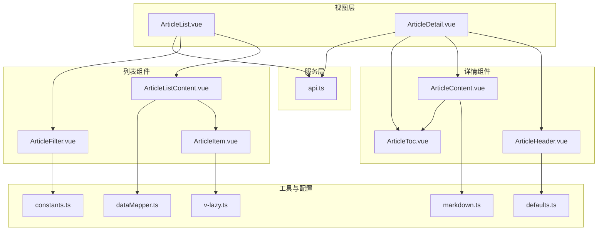
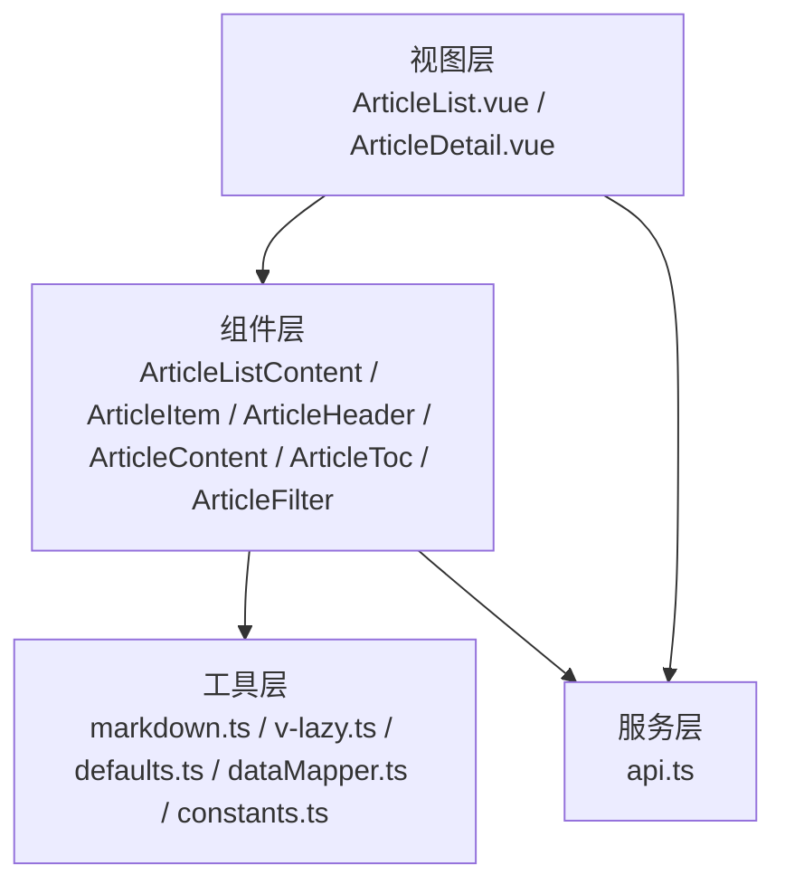
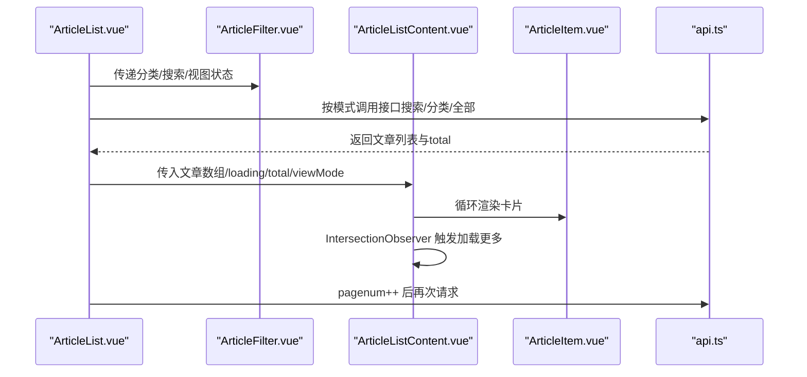
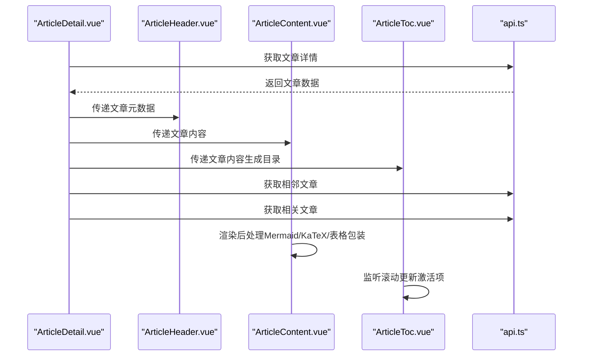
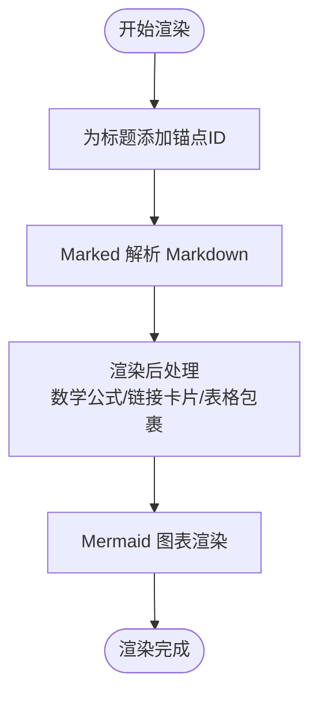
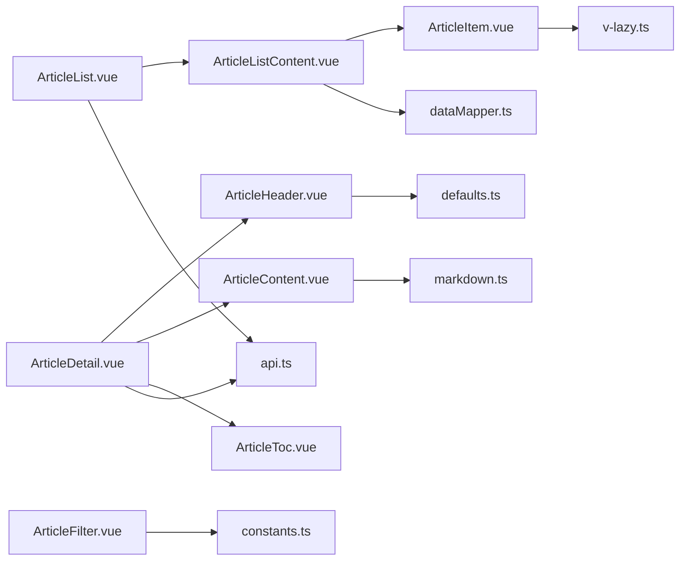

# 文章模块

<cite>
**本文引用的文件**
- [web\frontend\src\views\ArticleList.vue](file://web\frontend\src\views\ArticleList.vue)
- [web\frontend\src\views\ArticleDetail.vue](file://web\frontend\src\views\ArticleDetail.vue)
- [web\frontend\src\components\article\ArticleListContent.vue](file://web\frontend\src\components\article\ArticleListContent.vue)
- [web\frontend\src\components\article\ArticleItem.vue](file://web\frontend\src\components\article\ArticleItem.vue)
- [web\frontend\src\components\article\ArticleHeader.vue](file://web\frontend\src\components\article\ArticleHeader.vue)
- [web\frontend\src\components\article\ArticleContent.vue](file://web\frontend\src\components\article\ArticleContent.vue)
- [web\frontend\src\components\article\ArticleToc.vue](file://web\frontend\src\components\article\ArticleToc.vue)
- [web\frontend\src\components\article\ArticleFilter.vue](file://web\frontend\src\components\article\ArticleFilter.vue)
- [web\frontend\src\components\home\ArticleCard.vue](file://web\frontend\src\components\home\ArticleCard.vue)
- [web\frontend\src\utils\markdown.ts](file://web\frontend\src\utils\markdown.ts)
- [web\frontend\src\directives\v-lazy.ts](file://web\frontend\src\directives\v-lazy.ts)
- [web\frontend\src\services\api.ts](file://web\frontend\src\services\api.ts)
- [web\frontend\src\types\index.ts](file://web\frontend\src\types\index.ts)
- [web\frontend\src\utils\constants.ts](file://web\frontend\src\utils\constants.ts)
- [web\frontend\src\utils\defaults.ts](file://web\frontend\src\utils\defaults.ts)
- [web\frontend\src\utils\dataMapper.ts](file://web\frontend\src\utils\dataMapper.ts)
</cite>

## 目录
1. [引言](#引言)
2. [项目结构](#项目结构)
3. [核心组件](#核心组件)
4. [架构总览](#架构总览)
5. [详细组件分析](#详细组件分析)
6. [依赖关系分析](#依赖关系分析)
7. [性能考虑](#性能考虑)
8. [故障排查指南](#故障排查指南)
9. [结论](#结论)
10. [附录](#附录)

## 引言
本文件面向开发者与维护者，系统性梳理前台展示网站的文章模块实现，涵盖首页文章列表、文章详情页、文章头部元数据、Markdown 渲染与代码高亮、目录生成与锚点跳转、筛选与搜索、分页与懒加载、以及性能优化与扩展建议。文档通过“代码级”分析与“可视化图示”帮助快速理解与高效迭代。

## 项目结构
文章模块主要位于前端工程的 views 与 components/article 目录，配合工具函数、指令与服务层，形成清晰的分层与职责划分：
- 视图层：ArticleList.vue（文章列表）、ArticleDetail.vue（文章详情）
- 组件层：ArticleListContent.vue、ArticleItem.vue、ArticleHeader.vue、ArticleContent.vue、ArticleToc.vue、ArticleFilter.vue、ArticleCard.vue（首页卡片）
- 工具与配置：markdown.ts（Marked/Hljs 配置）、v-lazy.ts（懒加载指令）、constants.ts（常量）、defaults.ts（默认资源）、dataMapper.ts（数据映射）
- 服务层：api.ts（Axios 客户端与文章/分类 API）

**图表来源**
- [web\frontend\src\views\ArticleList.vue](file://web\frontend\src\views\ArticleList.vue)
- [web\frontend\src\views\ArticleDetail.vue](file://web\frontend\src\views\ArticleDetail.vue)
- [web\frontend\src\components\article\ArticleListContent.vue](file://web\frontend\src\components\article\ArticleListContent.vue)
- [web\frontend\src\components\article\ArticleItem.vue](file://web\frontend\src\components\article\ArticleItem.vue)
- [web\frontend\src\components\article\ArticleHeader.vue](file://web\frontend\src\components\article\ArticleHeader.vue)
- [web\frontend\src\components\article\ArticleContent.vue](file://web\frontend\src\components\article\ArticleContent.vue)
- [web\frontend\src\components\article\ArticleToc.vue](file://web\frontend\src\components\article\ArticleToc.vue)
- [web\frontend\src\components\article\ArticleFilter.vue](file://web\frontend\src\components\article\ArticleFilter.vue)
- [web\frontend\src\utils\markdown.ts](file://web\frontend\src\utils\markdown.ts)
- [web\frontend\src\directives\v-lazy.ts](file://web\frontend\src\directives\v-lazy.ts)
- [web\frontend\src\services\api.ts](file://web\frontend\src\services\api.ts)
- [web\frontend\src\types\index.ts](file://web\frontend\src\types\index.ts)
- [web\frontend\src\utils\constants.ts](file://web\frontend\src\utils\constants.ts)
- [web\frontend\src\utils\defaults.ts](file://web\frontend\src\utils\defaults.ts)
- [web\frontend\src\utils\dataMapper.ts](file://web\frontend\src\utils\dataMapper.ts)

**章节来源**
- [web\frontend\src\views\ArticleList.vue](file://web\frontend\src\views\ArticleList.vue)
- [web\frontend\src\views\ArticleDetail.vue](file://web\frontend\src\views\ArticleDetail.vue)
- [web\frontend\src\components\article\ArticleListContent.vue](file://web\frontend\src\components\article\ArticleListContent.vue)
- [web\frontend\src\components\article\ArticleItem.vue](file://web\frontend\src\components\article\ArticleItem.vue)
- [web\frontend\src\components\article\ArticleHeader.vue](file://web\frontend\src\components\article\ArticleHeader.vue)
- [web\frontend\src\components\article\ArticleContent.vue](file://web\frontend\src\components\article\ArticleContent.vue)
- [web\frontend\src\components\article\ArticleToc.vue](file://web\frontend\src\components\article\ArticleToc.vue)
- [web\frontend\src\components\article\ArticleFilter.vue](file://web\frontend\src\components\article\ArticleFilter.vue)
- [web\frontend\src\components\home\ArticleCard.vue](file://web\frontend\src\components\home\ArticleCard.vue)
- [web\frontend\src\utils\markdown.ts](file://web\frontend\src\utils\markdown.ts)
- [web\frontend\src\directives\v-lazy.ts](file://web\frontend\src\directives\v-lazy.ts)
- [web\frontend\src\services\api.ts](file://web\frontend\src\services\api.ts)
- [web\frontend\src\types\index.ts](file://web\frontend\src\types\index.ts)
- [web\frontend\src\utils\constants.ts](file://web\frontend\src\utils\constants.ts)
- [web\frontend\src\utils\defaults.ts](file://web\frontend\src\utils\defaults.ts)
- [web\frontend\src\utils\dataMapper.ts](file://web\frontend\src\utils\dataMapper.ts)

## 核心组件
- 文章列表视图：负责筛选、分页、加载更多与骨架屏展示，承载列表/网格两种视图模式。
- 文章详情视图：负责文章内容渲染、目录生成、相关推荐、上一篇/下一篇导航、评论区集成与图片查看器。
- 文章头部组件：展示标题、作者、发布时间、字数、阅读时间、分类等元数据，并提供分享与评论操作。
- 文章内容组件：基于 Marked 渲染 Markdown，集成 Mermaid 图表、KaTeX 数学公式、代码高亮、链接卡片、划词分享等。
- 文章目录组件：从 Markdown 内容提取 H1/H2 标题生成目录，支持滚动联动与锚点跳转。
- 文章筛选组件：提供分类 Tab、搜索输入（带防抖）与视图切换。
- 文章卡片组件：用于首页与列表的卡片展示，包含封面、标题、摘要、标签、日期与阅读量等。
- 懒加载指令：为图片提供 IntersectionObserver 实现的懒加载与占位动画。
- Markdown 配置：集中配置 Marked 渲染器与代码高亮样式。
- API 服务：封装 Axios 客户端与文章/分类相关接口。
- 类型与常量：统一类型定义、分页与断点常量、默认资源与数据映射工具。

**章节来源**
- [web\frontend\src\views\ArticleList.vue](file://web\frontend\src\views\ArticleList.vue)
- [web\frontend\src\views\ArticleDetail.vue](file://web\frontend\src\views\ArticleDetail.vue)
- [web\frontend\src\components\article\ArticleListContent.vue](file://web\frontend\src\components\article\ArticleListContent.vue)
- [web\frontend\src\components\article\ArticleItem.vue](file://web\frontend\src\components\article\ArticleItem.vue)
- [web\frontend\src\components\article\ArticleHeader.vue](file://web\frontend\src\components\article\ArticleHeader.vue)
- [web\frontend\src\components\article\ArticleContent.vue](file://web\frontend\src\components\article\ArticleContent.vue)
- [web\frontend\src\components\article\ArticleToc.vue](file://web\frontend\src\components\article\ArticleToc.vue)
- [web\frontend\src\components\article\ArticleFilter.vue](file://web\frontend\src\components\article\ArticleFilter.vue)
- [web\frontend\src\components\home\ArticleCard.vue](file://web\frontend\src\components\home\ArticleCard.vue)
- [web\frontend\src\directives\v-lazy.ts](file://web\frontend\src\directives\v-lazy.ts)
- [web\frontend\src\utils\markdown.ts](file://web\frontend\src\utils\markdown.ts)
- [web\frontend\src\services\api.ts](file://web\frontend\src\services\api.ts)
- [web\frontend\src\types\index.ts](file://web\frontend\src\types\index.ts)
- [web\frontend\src\utils\constants.ts](file://web\frontend\src\utils\constants.ts)
- [web\frontend\src\utils\defaults.ts](file://web\frontend\src\utils\defaults.ts)
- [web\frontend\src\utils\dataMapper.ts](file://web\frontend\src\utils\dataMapper.ts)

## 架构总览
文章模块采用“视图 + 组件 + 工具 + 服务”的分层架构：
- 视图层负责路由与状态编排，调用服务层获取数据。
- 组件层承担 UI 与交互逻辑，内部通过工具函数与常量保证一致性。
- 服务层封装 API 客户端与接口，统一错误处理与请求取消能力。
- 工具层提供 Markdown 渲染、懒加载、默认资源与数据映射等通用能力。

**图表来源**
- [web\frontend\src\views\ArticleList.vue](file://web\frontend\src\views\ArticleList.vue)
- [web\frontend\src\views\ArticleDetail.vue](file://web\frontend\src\views\ArticleDetail.vue)
- [web\frontend\src\components\article\ArticleListContent.vue](file://web\frontend\src\components\article\ArticleListContent.vue)
- [web\frontend\src\components\article\ArticleItem.vue](file://web\frontend\src\components\article\ArticleItem.vue)
- [web\frontend\src\components\article\ArticleHeader.vue](file://web\frontend\src\components\article\ArticleHeader.vue)
- [web\frontend\src\components\article\ArticleContent.vue](file://web\frontend\src\components\article\ArticleContent.vue)
- [web\frontend\src\components\article\ArticleToc.vue](file://web\frontend\src\components\article\ArticleToc.vue)
- [web\frontend\src\components\article\ArticleFilter.vue](file://web\frontend\src\components\article\ArticleFilter.vue)
- [web\frontend\src\utils\markdown.ts](file://web\frontend\src\utils\markdown.ts)
- [web\frontend\src\directives\v-lazy.ts](file://web\frontend\src\directives\v-lazy.ts)
- [web\frontend\src\utils\defaults.ts](file://web\frontend\src\utils\defaults.ts)
- [web\frontend\src\utils\dataMapper.ts](file://web\frontend\src\utils\dataMapper.ts)
- [web\frontend\src\utils\constants.ts](file://web\frontend\src\utils\constants.ts)
- [web\frontend\src\services\api.ts](file://web\frontend\src\services\api.ts)

## 详细组件分析

### 首页文章列表实现
- 文章卡片设计
  - 支持网格与列表双模式，列表模式下封面图与摘要并列展示，网格模式下封面图上方、标题与元数据紧凑排列。
  - 标题支持搜索关键词高亮；标签最多显示3个并进行中英文逗号兼容处理；日期格式化为本地化字符串；阅读量展示。
  - 网格模式卡片悬停有阴影与缩放效果，列表模式卡片底部有分隔线与元信息行。
- 加载策略与骨架屏
  - 列表组件在首次加载且无数据时显示 Element Plus 骨架屏，网格与列表分别对应不同布局骨架。
- 分页机制
  - 使用 IntersectionObserver 监听“加载触发器”，接近可视区域时触发“加载更多”，避免滚动到底部才加载。
  - 分页参数来自常量配置，支持搜索优先、分类筛选、全部文章三种模式，后端返回 total 控制“没有更多”。

**图表来源**
- [web\frontend\src\views\ArticleList.vue](file://web\frontend\src\views\ArticleList.vue)
- [web\frontend\src\components\article\ArticleFilter.vue](file://web\frontend\src\components\article\ArticleFilter.vue)
- [web\frontend\src\components\article\ArticleListContent.vue](file://web\frontend\src\components\article\ArticleListContent.vue)
- [web\frontend\src\components\article\ArticleItem.vue](file://web\frontend\src\components\article\ArticleItem.vue)
- [web\frontend\src\services\api.ts](file://web\frontend\src\services\api.ts)

**章节来源**
- [web\frontend\src\views\ArticleList.vue](file://web\frontend\src\views\ArticleList.vue)
- [web\frontend\src\components\article\ArticleListContent.vue](file://web\frontend\src\components\article\ArticleListContent.vue)
- [web\frontend\src\components\article\ArticleItem.vue](file://web\frontend\src\components\article\ArticleItem.vue)
- [web\frontend\src\components\article\ArticleFilter.vue](file://web\frontend\src\components\article\ArticleFilter.vue)
- [web\frontend\src\utils\constants.ts](file://web\frontend\src\utils\constants.ts)
- [web\frontend\src\utils\dataMapper.ts](file://web\frontend\src\utils\dataMapper.ts)

### 文章详情页实现
- 内容渲染
  - 文章头部展示标题、作者、发布时间、字数、阅读时间、分类与封面图；提供评论与分享按钮。
  - 文章内容使用 Marked 渲染，支持链接卡片、表格包裹、Mermaid 图表与 KaTeX 公式；图片点击进入查看器，支持滚轮缩放与键盘导航。
- 目录生成
  - 从 Markdown 内容提取 H1/H2 标题生成目录，滚动时联动高亮，点击锚点平滑跳转至对应标题位置。
- 相关推荐
  - 通过“相关文章”接口获取若干文章卡片，展示封面、标题与发布日期。
- 上一篇/下一篇
  - 通过“相邻文章”接口获取前后文卡片，支持封面懒加载与标题溢出处理。

**图表来源**
- [web\frontend\src\views\ArticleDetail.vue](file://web\frontend\src\views\ArticleDetail.vue)
- [web\frontend\src\components\article\ArticleHeader.vue](file://web\frontend\src\components\article\ArticleHeader.vue)
- [web\frontend\src\components\article\ArticleContent.vue](file://web\frontend\src\components\article\ArticleContent.vue)
- [web\frontend\src\components\article\ArticleToc.vue](file://web\frontend\src\components\article\ArticleToc.vue)
- [web\frontend\src\services\api.ts](file://web\frontend\src\services\api.ts)

**章节来源**
- [web\frontend\src\views\ArticleDetail.vue](file://web\frontend\src\views\ArticleDetail.vue)
- [web\frontend\src\components\article\ArticleHeader.vue](file://web\frontend\src\components\article\ArticleHeader.vue)
- [web\frontend\src\components\article\ArticleContent.vue](file://web\frontend\src\components\article\ArticleContent.vue)
- [web\frontend\src\components\article\ArticleToc.vue](file://web\frontend\src\components\article\ArticleToc.vue)
- [web\frontend\src\services\api.ts](file://web\frontend\src\services\api.ts)

### 文章头部组件（元数据）
- 展示字段：标题、作者头像与姓名、发布时间、字数统计、阅读时间、分类标签。
- 字数与阅读时间计算：去除 HTML 标签后分别统计中文字符与英文单词，中文约 200 字/分钟、英文约 150 词/分钟，向上取整。
- 默认头像与封面：优先使用站点配置，缺失时回退内置资源。

**章节来源**
- [web\frontend\src\components\article\ArticleHeader.vue](file://web\frontend\src\components\article\ArticleHeader.vue)
- [web\frontend\src\utils\defaults.ts](file://web\frontend\src\utils\defaults.ts)

### 文章内容组件（Markdown 渲染与代码高亮）
- 渲染流程
  - 为标题添加锚点 ID，便于目录与锚点跳转。
  - 使用 Marked 渲染 Markdown，随后进行数学公式扫描、链接卡片处理与表格包裹。
  - Mermaid 图表在渲染后异步执行渲染，失败时输出错误提示。
- 代码高亮
  - 通过全局 Marked 渲染器注入，支持自动语言识别与行号渲染，复制按钮与浅色/深色主题适配。
- 交互增强
  - 支持图片点击放大、划词分享、复制代码块、锚点平滑滚动与键盘导航。

**图表来源**
- [web\frontend\src\components\article\ArticleContent.vue](file://web\frontend\src\components\article\ArticleContent.vue)
- [web\frontend\src\utils\markdown.ts](file://web\frontend\src\utils\markdown.ts)

**章节来源**
- [web\frontend\src\components\article\ArticleContent.vue](file://web\frontend\src\components\article\ArticleContent.vue)
- [web\frontend\src\utils\markdown.ts](file://web\frontend\src\utils\markdown.ts)

### 文章目录组件（自动生成与锚点跳转）
- 目录生成
  - 从 Markdown 内容中提取 H1/H2 标题，构建目录项，仅保留两级标题。
- 活动状态
  - 监听滚动事件，根据当前可视区域内的标题更新激活项，并自动滚动目录使激活项可见。
- 锚点跳转
  - 点击目录项时，根据标题锚点进行平滑滚动跳转；移动端点击后自动收起目录。

**章节来源**
- [web\frontend\src\components\article\ArticleToc.vue](file://web\frontend\src\components\article\ArticleToc.vue)

### 文章筛选组件（搜索与过滤）
- 分类 Tab：支持“全部文章”与分类列表切换，切换后重置到第 1 页。
- 搜索：输入框支持防抖（300ms），回车触发搜索，路由查询 keyword 同步更新。
- 视图切换：网格/列表视图切换，影响卡片布局与骨架屏形态。

**章节来源**
- [web\frontend\src\components\article\ArticleFilter.vue](file://web\frontend\src\components\article\ArticleFilter.vue)
- [web\frontend\src\views\ArticleList.vue](file://web\frontend\src\views\ArticleList.vue)

### 性能优化与懒加载
- 懒加载图片
  - v-lazy 指令基于 IntersectionObserver，在进入视口前不加载真实图片，使用渐变 shimmer 占位，提升首屏性能。
- 骨架屏
  - 列表组件在首次加载时显示骨架屏，减少白屏与布局抖动。
- 渲染后处理
  - Mermaid/KaTeX 表格包裹等处理在 mounted 与 updated 生命周期执行，避免阻塞主线程。
- 分页与无限滚动
  - 使用 IntersectionObserver 触发加载更多，降低频繁滚动事件开销。

**章节来源**
- [web\frontend\src\directives\v-lazy.ts](file://web\frontend\src\directives\v-lazy.ts)
- [web\frontend\src\components\article\ArticleListContent.vue](file://web\frontend\src\components\article\ArticleListContent.vue)
- [web\frontend\src\components\article\ArticleContent.vue](file://web\frontend\src\components\article\ArticleContent.vue)

### 扩展与定制指南
- 新增文章类型
  - 在类型定义中扩展 Article 接口（如新增字段），并在 dataMapper 中映射后端字段。
- 自定义 Markdown 渲染
  - 在 markdown.ts 中调整 Marked 渲染器钩子或引入额外渲染规则。
- 目录层级扩展
  - 在 ArticleToc.vue 中修改标题提取逻辑，支持更多层级。
- 搜索策略
  - 在 ArticleFilter.vue 中调整防抖阈值或增加搜索历史。
- 图片懒加载
  - 在 v-lazy.ts 中调整 rootMargin、threshold 或占位动画样式。
- API 扩展
  - 在 api.ts 中新增接口方法，并在视图/组件中调用。

**章节来源**
- [web\frontend\src\types\index.ts](file://web\frontend\src\types\index.ts)
- [web\frontend\src\utils\dataMapper.ts](file://web\frontend\src\utils\dataMapper.ts)
- [web\frontend\src\utils\markdown.ts](file://web\frontend\src\utils\markdown.ts)
- [web\frontend\src\components\article\ArticleToc.vue](file://web\frontend\src\components\article\ArticleToc.vue)
- [web\frontend\src\components\article\ArticleFilter.vue](file://web\frontend\src\components\article\ArticleFilter.vue)
- [web\frontend\src\directives\v-lazy.ts](file://web\frontend\src\directives\v-lazy.ts)
- [web\frontend\src\services\api.ts](file://web\frontend\src\services\api.ts)

## 依赖关系分析
- 组件耦合
  - ArticleList.vue 与 ArticleListContent.vue 通过 props 传递文章数据与状态；ArticleListContent.vue 与 ArticleItem.vue 为父子关系，后者依赖懒加载指令。
  - ArticleDetail.vue 与 ArticleHeader.vue、ArticleContent.vue、ArticleToc.vue 为组合关系，前者负责数据获取与状态管理。
- 外部依赖
  - Marked 与 highlight.js 用于 Markdown 与代码高亮；Mermaid 用于图表渲染；Axios 用于 API 请求；Element Plus 骨架屏与 Tooltip 组件。
- 潜在风险
  - 目录与内容锚点依赖标题 ID 生成一致性；Mermaid/KaTeX 渲染失败需兜底提示；IntersectionObserver 在部分旧浏览器需 polyfill。

**图表来源**
- [web\frontend\src\components\article\ArticleItem.vue](file://web\frontend\src\components\article\ArticleItem.vue)
- [web\frontend\src\components\article\ArticleListContent.vue](file://web\frontend\src\components\article\ArticleListContent.vue)
- [web\frontend\src\views\ArticleList.vue](file://web\frontend\src\views\ArticleList.vue)
- [web\frontend\src\views\ArticleDetail.vue](file://web\frontend\src\views\ArticleDetail.vue)
- [web\frontend\src\components\article\ArticleHeader.vue](file://web\frontend\src\components\article\ArticleHeader.vue)
- [web\frontend\src\components\article\ArticleContent.vue](file://web\frontend\src\components\article\ArticleContent.vue)
- [web\frontend\src\components\article\ArticleToc.vue](file://web\frontend\src\components\article\ArticleToc.vue)
- [web\frontend\src\components\article\ArticleFilter.vue](file://web\frontend\src\components\article\ArticleFilter.vue)
- [web\frontend\src\directives\v-lazy.ts](file://web\frontend\src\directives\v-lazy.ts)
- [web\frontend\src\utils\markdown.ts](file://web\frontend\src\utils\markdown.ts)
- [web\frontend\src\services\api.ts](file://web\frontend\src\services\api.ts)
- [web\frontend\src\utils\defaults.ts](file://web\frontend\src\utils\defaults.ts)
- [web\frontend\src\utils\dataMapper.ts](file://web\frontend\src\utils\dataMapper.ts)
- [web\frontend\src\utils\constants.ts](file://web\frontend\src\utils\constants.ts)

**章节来源**
- [web\frontend\src\components\article\ArticleItem.vue](file://web\frontend\src\components\article\ArticleItem.vue)
- [web\frontend\src\components\article\ArticleListContent.vue](file://web\frontend\src\components\article\ArticleListContent.vue)
- [web\frontend\src\views\ArticleList.vue](file://web\frontend\src\views\ArticleList.vue)
- [web\frontend\src\views\ArticleDetail.vue](file://web\frontend\src\views\ArticleDetail.vue)
- [web\frontend\src\components\article\ArticleHeader.vue](file://web\frontend\src\components\article\ArticleHeader.vue)
- [web\frontend\src\components\article\ArticleContent.vue](file://web\frontend\src\components\article\ArticleContent.vue)
- [web\frontend\src\components\article\ArticleToc.vue](file://web\frontend\src\components\article\ArticleToc.vue)
- [web\frontend\src\components\article\ArticleFilter.vue](file://web\frontend\src\components\article\ArticleFilter.vue)
- [web\frontend\src\directives\v-lazy.ts](file://web\frontend\src\directives\v-lazy.ts)
- [web\frontend\src\utils\markdown.ts](file://web\frontend\src\utils\markdown.ts)
- [web\frontend\src\services\api.ts](file://web\frontend\src\services\api.ts)
- [web\frontend\src\utils\defaults.ts](file://web\frontend\src\utils\defaults.ts)
- [web\frontend\src\utils\dataMapper.ts](file://web\frontend\src\utils\dataMapper.ts)
- [web\frontend\src\utils\constants.ts](file://web\frontend\src\utils\constants.ts)

## 性能考虑
- 骨架屏与懒加载：显著降低首屏等待与图片加载成本。
- IntersectionObserver：滚动加载更高效，避免高频 scroll 事件。
- 渲染后处理：在 mounted/updated 中执行，避免阻塞初始渲染。
- 代码高亮：按需渲染，失败时降级为原文本，保障稳定性。
- 目录联动：仅在必要时滚动目录，减少 DOM 操作。

[本节为通用指导，无需特定文件引用]

## 故障排查指南
- 文章列表不加载
  - 检查路由参数与查询参数是否正确传递；确认 API 返回状态码与 total 是否一致。
- 目录不显示或不跳转
  - 确认 Markdown 内容中存在 H1/H2 标题；检查锚点 ID 生成与目录项匹配。
- Mermaid 图表渲染失败
  - 查看控制台错误信息；确认代码块语言为 mermaid；检查主题切换时的重新渲染逻辑。
- 图片不显示或加载缓慢
  - 检查 v-lazy 指令是否生效；确认占位元素与 rootMargin 配置；核对图片地址与跨域设置。
- 搜索无结果
  - 确认防抖定时器是否被清理；检查后端搜索接口参数与分页参数。

**章节来源**
- [web\frontend\src\components\article\ArticleListContent.vue](file://web\frontend\src\components\article\ArticleListContent.vue)
- [web\frontend\src\components\article\ArticleToc.vue](file://web\frontend\src\components\article\ArticleToc.vue)
- [web\frontend\src\components\article\ArticleContent.vue](file://web\frontend\src\components\article\ArticleContent.vue)
- [web\frontend\src\directives\v-lazy.ts](file://web\frontend\src\directives\v-lazy.ts)
- [web\frontend\src\services\api.ts](file://web\frontend\src\services\api.ts)

## 结论
文章模块通过清晰的分层设计与完善的工具链，实现了高性能、可扩展的前台展示能力。列表与详情页分别针对不同场景优化：列表强调加载效率与视觉密度，详情页强调内容可读性与交互体验。后续可在目录层级、搜索策略与渲染扩展方面进一步增强。

[本节为总结性内容，无需特定文件引用]

## 附录
- 常用常量与分页配置：断点、分页尺寸、动画时长、路由名称等。
- 默认资源：封面与头像回退路径。
- 类型定义：统一的 Article/Category/Tag/Pagination/ApiResponse 等类型。

**章节来源**
- [web\frontend\src\utils\constants.ts](file://web\frontend\src\utils\constants.ts)
- [web\frontend\src\utils\defaults.ts](file://web\frontend\src\utils\defaults.ts)
- [web\frontend\src\types\index.ts](file://web\frontend\src\types\index.ts)