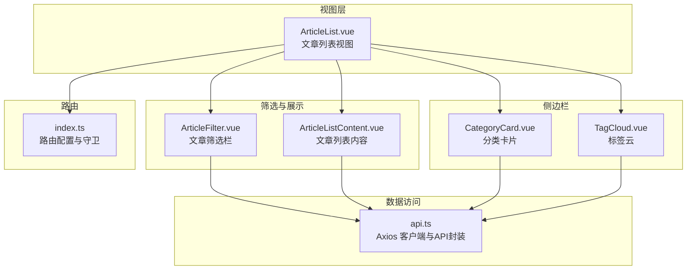
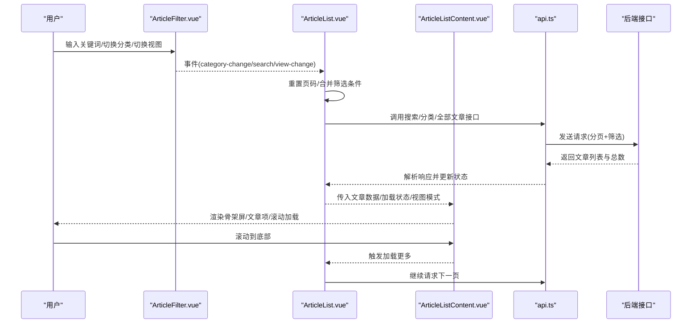
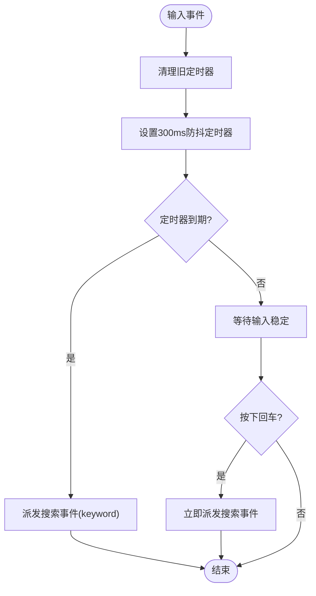
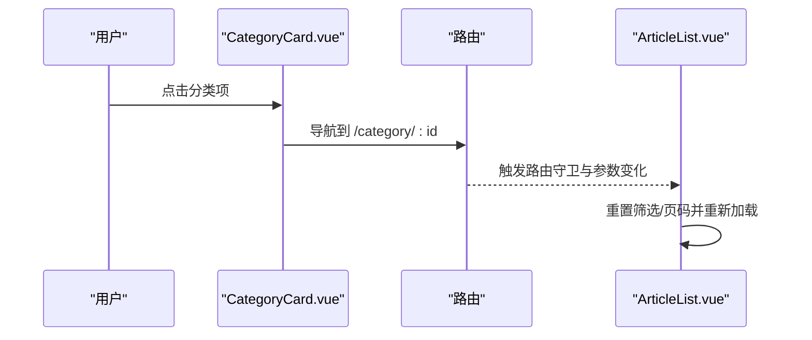
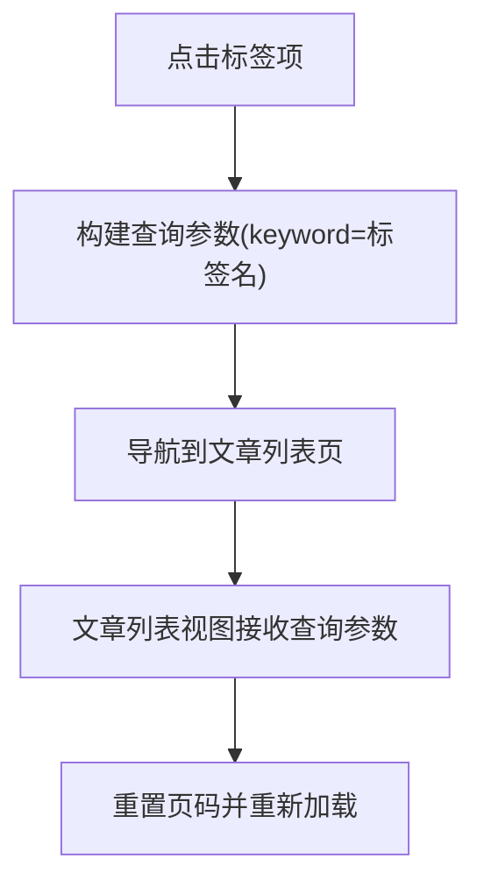
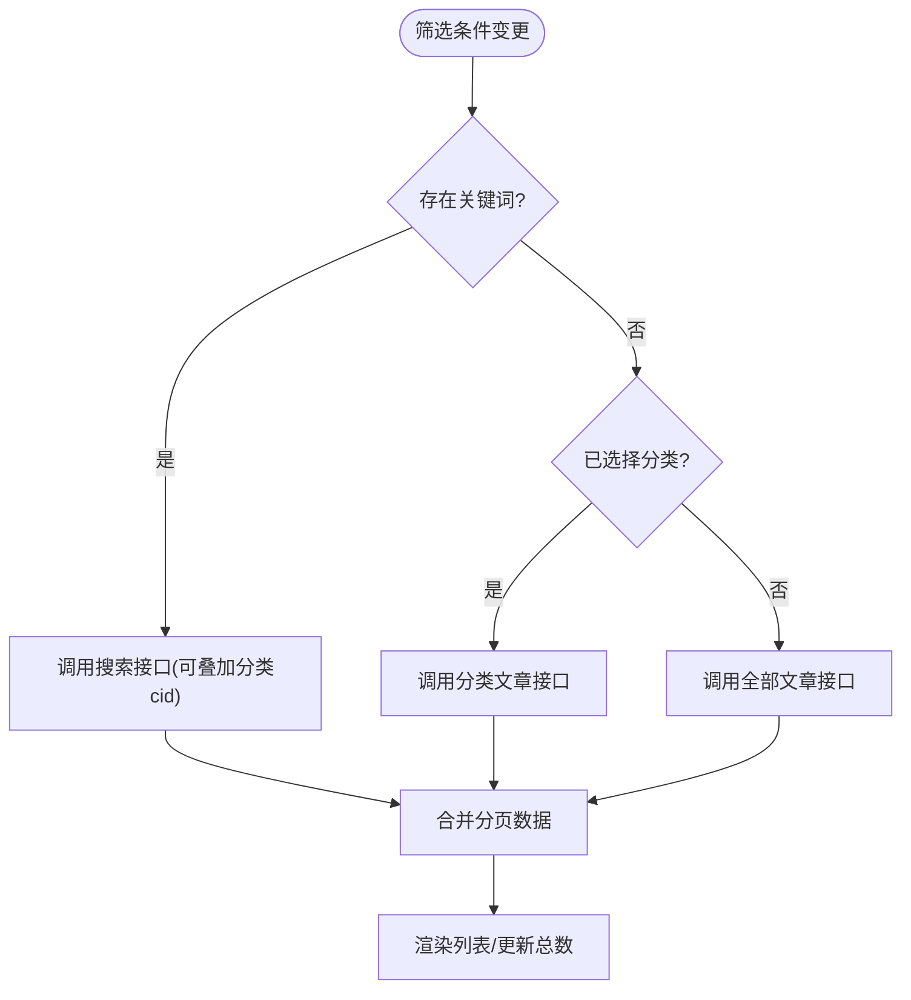
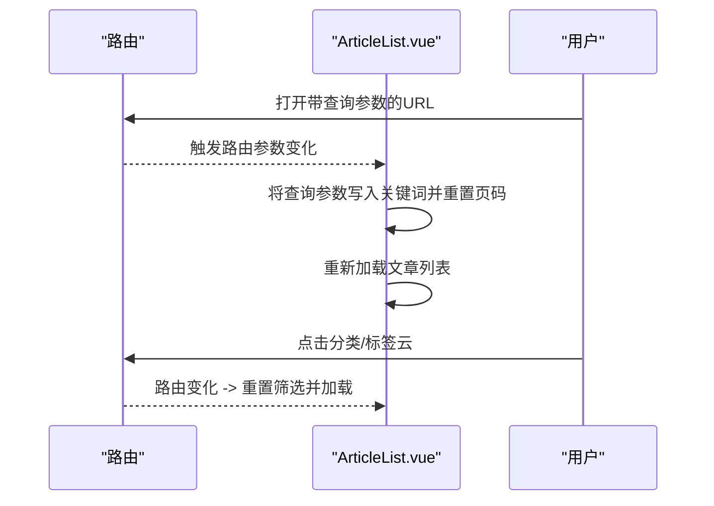
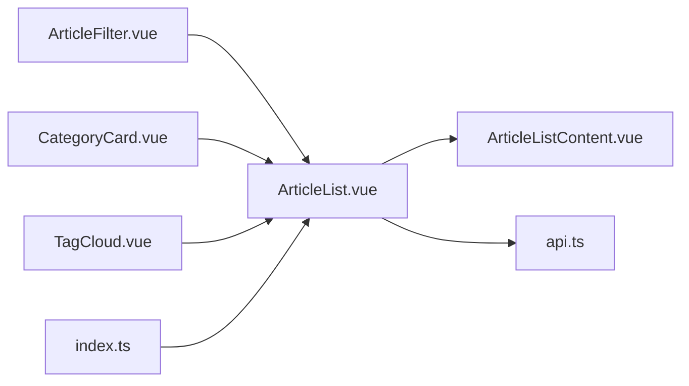

# 文章筛选与搜索

<cite>
**本文引用的文件**
- [ArticleFilter.vue](file://web/frontend/src/components/article/ArticleFilter.vue)
- [ArticleListContent.vue](file://web/frontend/src/components/article/ArticleListContent.vue)
- [ArticleList.vue](file://web/frontend/src/views/ArticleList.vue)
- [TagCloud.vue](file://web/frontend/src/components/sidebar/TagCloud.vue)
- [CategoryCard.vue](file://web/frontend/src/components/sidebar/CategoryCard.vue)
- [api.ts](file://web/frontend/src/services/api.ts)
- [index.ts](file://web/frontend/src/router/index.ts)
</cite>

## 目录
1. [简介](#简介)
2. [项目结构](#项目结构)
3. [核心组件](#核心组件)
4. [架构总览](#架构总览)
5. [详细组件分析](#详细组件分析)
6. [依赖关系分析](#依赖关系分析)
7. [性能考量](#性能考量)
8. [故障排查指南](#故障排查指南)
9. [结论](#结论)
10. [附录](#附录)

## 简介
本文件面向“文章筛选与搜索”功能，系统性梳理前端筛选栏、分类卡片、标签云、文章列表展示与滚动加载、URL 参数同步与浏览器历史管理、以及搜索关键词高亮与匹配策略。文档同时给出可操作的优化建议与移动端适配要点，帮助开发者快速理解与维护该功能模块。

## 项目结构
围绕文章筛选与搜索的关键文件组织如下：
- 视图层：文章列表视图负责聚合筛选栏、文章列表内容与侧边栏
- 筛选组件：文章筛选栏提供分类 Tab、搜索框与视图切换
- 结果展示：文章列表内容负责骨架屏、网格/列表视图、滚动加载
- 侧边栏组件：分类卡片与标签云提供导航与筛选入口
- 数据访问：统一 API 客户端封装请求、取消与错误处理
- 路由：定义文章列表、分类文章等路由，并进行参数校验与滚动行为控制

图表来源
- [ArticleList.vue:1-225](file://web/frontend/src/views/ArticleList.vue#L1-L225)
- [ArticleFilter.vue:1-272](file://web/frontend/src/components/article/ArticleFilter.vue#L1-L272)
- [ArticleListContent.vue:1-266](file://web/frontend/src/components/article/ArticleListContent.vue#L1-L266)
- [CategoryCard.vue:1-115](file://web/frontend/src/components/sidebar/CategoryCard.vue#L1-L115)
- [TagCloud.vue:1-718](file://web/frontend/src/components/sidebar/TagCloud.vue#L1-L718)
- [api.ts:1-137](file://web/frontend/src/services/api.ts#L1-L137)
- [index.ts:1-73](file://web/frontend/src/router/index.ts#L1-L73)

章节来源
- [ArticleList.vue:1-225](file://web/frontend/src/views/ArticleList.vue#L1-L225)
- [ArticleFilter.vue:1-272](file://web/frontend/src/components/article/ArticleFilter.vue#L1-L272)
- [ArticleListContent.vue:1-266](file://web/frontend/src/components/article/ArticleListContent.vue#L1-L266)
- [CategoryCard.vue:1-115](file://web/frontend/src/components/sidebar/CategoryCard.vue#L1-L115)
- [TagCloud.vue:1-718](file://web/frontend/src/components/sidebar/TagCloud.vue#L1-L718)
- [api.ts:1-137](file://web/frontend/src/services/api.ts#L1-L137)
- [index.ts:1-73](file://web/frontend/src/router/index.ts#L1-L73)

## 核心组件
- 文章筛选栏（ArticleFilter）
  - 提供分类 Tab 切换、搜索输入（含防抖）、视图切换（网格/列表），并通过事件向上抛出筛选与视图变更
- 文章列表内容（ArticleListContent）
  - 展示骨架屏、网格/列表视图、滚动触底加载更多、空状态提示
- 文章列表视图（ArticleList）
  - 聚合筛选栏与列表内容，协调分类、关键词、分页与加载状态；监听路由参数变化以重置筛选
- 标签云（TagCloud）
  - 支持列表/3D 两种视图，提供标签字体大小映射、3D 布局与动画、拖拽/悬停交互
- 分类卡片（CategoryCard）
  - 展示分类网格，点击跳转至分类文章页
- API 客户端（api.ts）
  - 统一封装 axios 实例、请求取消、拦截器与各业务 API 方法
- 路由（index.ts）
  - 定义文章列表、分类文章等路由，全局前置守卫校验参数合法性，滚动行为控制

章节来源
- [ArticleFilter.vue:61-129](file://web/frontend/src/components/article/ArticleFilter.vue#L61-L129)
- [ArticleListContent.vue:67-138](file://web/frontend/src/components/article/ArticleListContent.vue#L67-L138)
- [ArticleList.vue:35-212](file://web/frontend/src/views/ArticleList.vue#L35-L212)
- [TagCloud.vue:85-446](file://web/frontend/src/components/sidebar/TagCloud.vue#L85-L446)
- [CategoryCard.vue:23-48](file://web/frontend/src/components/sidebar/CategoryCard.vue#L23-L48)
- [api.ts:66-121](file://web/frontend/src/services/api.ts#L66-L121)
- [index.ts:4-73](file://web/frontend/src/router/index.ts#L4-L73)

## 架构总览
下图展示了从前端筛选到后端接口调用的整体流程，包括参数传递、加载状态与分页策略。

图表来源
- [ArticleFilter.vue:77-83](file://web/frontend/src/components/article/ArticleFilter.vue#L77-L83)
- [ArticleList.vue:85-149](file://web/frontend/src/views/ArticleList.vue#L85-L149)
- [ArticleListContent.vue:94-96](file://web/frontend/src/components/article/ArticleListContent.vue#L94-L96)
- [api.ts:66-103](file://web/frontend/src/services/api.ts#L66-L103)

## 详细组件分析

### 文章筛选栏（ArticleFilter）——搜索表单与输入验证
- 搜索输入与防抖
  - 输入事件触发后设置定时器，300ms 防抖后再派发搜索事件，避免频繁请求
  - 回车键直接派发当前输入值，确保即时搜索
- 分类选择
  - 点击分类 Tab 时派发分类变更事件，支持“全部文章”与具体分类
- 视图切换
  - 网格/列表按钮派发视图变更事件，影响列表渲染
- 输入验证与边界
  - 当前组件未内置显式的输入长度/格式校验，建议在父组件或业务层补充（例如最小长度、非法字符过滤）

图表来源
- [ArticleFilter.vue:95-121](file://web/frontend/src/components/article/ArticleFilter.vue#L95-L121)

章节来源
- [ArticleFilter.vue:61-129](file://web/frontend/src/components/article/ArticleFilter.vue#L61-L129)

### 分类卡片组件（CategoryCard）——分类选择与筛选逻辑
- 数据获取
  - 组件挂载时通过分类 API 获取列表，限制每页数量以减少首屏压力
- 筛选逻辑
  - 点击分类项跳转至对应分类文章页，由路由参数驱动后端筛选
  - 文章列表视图监听路由参数变化，自动重置筛选并重新加载

图表来源
- [CategoryCard.vue:9-17](file://web/frontend/src/components/sidebar/CategoryCard.vue#L9-L17)
- [ArticleList.vue:199-211](file://web/frontend/src/views/ArticleList.vue#L199-L211)
- [index.ts:24-28](file://web/frontend/src/router/index.ts#L24-L28)

章节来源
- [CategoryCard.vue:23-48](file://web/frontend/src/components/sidebar/CategoryCard.vue#L23-L48)
- [ArticleList.vue:199-211](file://web/frontend/src/views/ArticleList.vue#L199-L211)
- [index.ts:24-28](file://web/frontend/src/router/index.ts#L24-L28)

### 标签云组件（TagCloud）——标签选择与多选思路
- 单标签筛选
  - 列表/3D 视图中点击标签项会导航到文章列表页并携带关键词查询参数
- 多标签筛选的实现建议
  - 当前未实现多标签同时选择；可在路由中使用查询参数数组形式（如 keyword=tag1&keyword=tag2）或组合关键词（如 “tag1 tag2”）
  - 若采用数组参数，需在后端接口支持解析数组或组合关键词；若采用组合关键词，需在前端统一分隔符并在搜索时拆分处理
- 3D 视图与交互
  - 3D 布局基于斐波那契球分布，支持拖拽旋转与自动旋转；连线绘制采用 Canvas，根据 z 轴深度调整透明度

图表来源
- [TagCloud.vue:24-32](file://web/frontend/src/components/sidebar/TagCloud.vue#L24-L32)
- [ArticleList.vue:192-211](file://web/frontend/src/views/ArticleList.vue#L192-L211)

章节来源
- [TagCloud.vue:85-446](file://web/frontend/src/components/sidebar/TagCloud.vue#L85-L446)
- [ArticleList.vue:192-211](file://web/frontend/src/views/ArticleList.vue#L192-L211)

### 搜索结果的实时过滤与排序机制
- 实时过滤
  - 文章列表视图根据“关键词 > 分类 > 全部文章”的优先级顺序决定调用接口
  - 关键词为空时，优先走分类筛选或全部文章接口
- 排序策略
  - 当前未在前端对结果进行二次排序；排序由后端接口控制（如按时间倒序、置顶优先等）
  - 如需前端二次排序，可在拿到数据后进行本地排序，但需注意与分页的配合

图表来源
- [ArticleList.vue:96-149](file://web/frontend/src/views/ArticleList.vue#L96-L149)
- [api.ts:66-103](file://web/frontend/src/services/api.ts#L66-L103)

章节来源
- [ArticleList.vue:85-149](file://web/frontend/src/views/ArticleList.vue#L85-L149)
- [api.ts:66-103](file://web/frontend/src/services/api.ts#L66-L103)

### URL 参数同步与浏览器历史管理
- URL 同步
  - 文章列表页监听路由查询参数（keyword），若存在则自动应用为搜索关键词并重新加载
  - 分类卡片与标签云点击后会改变路由路径与查询参数，从而同步到 URL
- 浏览器历史
  - 路由全局守卫对动态参数进行校验，非法参数重定向至 404
  - 滚动行为：返回时优先恢复上次滚动位置，否则回到顶部

图表来源
- [ArticleList.vue:192-211](file://web/frontend/src/views/ArticleList.vue#L192-L211)
- [index.ts:61-70](file://web/frontend/src/router/index.ts#L61-L70)
- [index.ts:50-57](file://web/frontend/src/router/index.ts#L50-L57)

章节来源
- [ArticleList.vue:192-211](file://web/frontend/src/views/ArticleList.vue#L192-L211)
- [index.ts:61-70](file://web/frontend/src/router/index.ts#L61-L70)
- [index.ts:50-57](file://web/frontend/src/router/index.ts#L50-L57)

### 搜索关键词高亮与匹配算法
- 高亮显示
  - 当前未实现关键词高亮；可在文章标题/摘要渲染处增加高亮逻辑（如包裹关键词于标记内并应用样式）
- 匹配策略
  - 匹配算法由后端接口决定（模糊匹配、全文检索、分词等）；前端仅负责传递 keyword 参数
  - 建议后端提供“高亮片段”或“命中位置”，前端据此进行高亮渲染

章节来源
- [ArticleList.vue:96-105](file://web/frontend/src/views/ArticleList.vue#L96-L105)
- [api.ts:72-74](file://web/frontend/src/services/api.ts#L72-L74)

### 筛选条件的状态管理与持久化
- 状态管理
  - 文章列表视图内部维护关键词、分类、页码、总数、加载状态等响应式数据
- 持久化建议
  - 可结合浏览器存储（如 localStorage/sessionStorage）持久化关键词与分类选择，刷新后恢复
  - 注意：URL 已承担部分状态（keyword、分类路由），可作为首选；存储主要用于增强体验

章节来源
- [ArticleList.vue:52-62](file://web/frontend/src/views/ArticleList.vue#L52-L62)

### 移动端筛选界面的适配与交互优化
- 文章筛选栏
  - 在窄屏下布局垂直堆叠，搜索框宽度自适应，焦点时宽度扩展以提升输入体验
- 文章列表内容
  - 网格列数在窄屏下变为单列，骨架屏布局针对移动端优化
- 标签云
  - 3D 视图在移动端仍可用，但建议在小屏设备上默认关闭自动旋转或降低动画强度

章节来源
- [ArticleFilter.vue:258-271](file://web/frontend/src/components/article/ArticleFilter.vue#L258-L271)
- [ArticleListContent.vue:197-202](file://web/frontend/src/components/article/ArticleListContent.vue#L197-L202)
- [TagCloud.vue:575-584](file://web/frontend/src/components/sidebar/TagCloud.vue#L575-L584)

## 依赖关系分析
- 组件耦合
  - ArticleList.vue 作为容器组件，聚合多个子组件并与 API 客户端紧密协作
  - ArticleFilter.vue 与 ArticleListContent.vue 通过事件与 props 解耦，职责清晰
- 外部依赖
  - axios 封装统一错误处理与请求取消
  - Vue Router 负责参数校验与滚动行为

图表来源
- [ArticleFilter.vue:77-83](file://web/frontend/src/components/article/ArticleFilter.vue#L77-L83)
- [ArticleList.vue:35-45](file://web/frontend/src/views/ArticleList.vue#L35-L45)
- [ArticleListContent.vue:69-96](file://web/frontend/src/components/article/ArticleListContent.vue#L69-L96)
- [api.ts:66-121](file://web/frontend/src/services/api.ts#L66-L121)
- [CategoryCard.vue:25](file://web/frontend/src/components/sidebar/CategoryCard.vue#L25)
- [TagCloud.vue:87](file://web/frontend/src/components/sidebar/TagCloud.vue#L87)
- [index.ts:1-73](file://web/frontend/src/router/index.ts#L1-L73)

章节来源
- [ArticleFilter.vue:77-83](file://web/frontend/src/components/article/ArticleFilter.vue#L77-L83)
- [ArticleList.vue:35-45](file://web/frontend/src/views/ArticleList.vue#L35-L45)
- [ArticleListContent.vue:69-96](file://web/frontend/src/components/article/ArticleListContent.vue#L69-L96)
- [api.ts:66-121](file://web/frontend/src/services/api.ts#L66-L121)
- [CategoryCard.vue:25](file://web/frontend/src/components/sidebar/CategoryCard.vue#L25)
- [TagCloud.vue:87](file://web/frontend/src/components/sidebar/TagCloud.vue#L87)
- [index.ts:1-73](file://web/frontend/src/router/index.ts#L1-L73)

## 性能考量
- 防抖与请求节流
  - 搜索输入使用 300ms 防抖，有效降低请求频率
- 分页与滚动加载
  - 后端分页 + IntersectionObserver 触底加载，避免一次性加载大量数据
- 3D 标签云
  - 使用 requestAnimationFrame 控制动画，拖拽释放后自动恢复旋转，建议在低端设备上提供关闭选项
- 错误与超时
  - axios 拦截器统一处理超时与网络错误，提升用户体验

章节来源
- [ArticleFilter.vue:87-109](file://web/frontend/src/components/article/ArticleFilter.vue#L87-L109)
- [ArticleListContent.vue:102-121](file://web/frontend/src/components/article/ArticleListContent.vue#L102-L121)
- [TagCloud.vue:262-273](file://web/frontend/src/components/sidebar/TagCloud.vue#L262-L273)
- [api.ts:28-64](file://web/frontend/src/services/api.ts#L28-L64)

## 故障排查指南
- 搜索无结果
  - 检查后端搜索接口是否正确接收 keyword 与 cid 参数
  - 确认文章数据是否包含关键词字段
- 分类筛选无效
  - 确认路由参数 id 是否为纯数字，路由守卫会拦截非法参数
  - 检查分类 API 返回的数据结构与映射
- 3D 标签云不显示
  - 确认 Canvas 支持与容器尺寸计算
  - 检查标签数据获取是否成功，动画是否被提前停止
- 路由跳转后状态未更新
  - 确认监听路由参数变化的 watch 是否生效
  - 检查 URL 查询参数是否正确传入

章节来源
- [index.ts:61-70](file://web/frontend/src/router/index.ts#L61-L70)
- [ArticleList.vue:199-211](file://web/frontend/src/views/ArticleList.vue#L199-L211)
- [TagCloud.vue:372-412](file://web/frontend/src/components/sidebar/TagCloud.vue#L372-L412)

## 结论
该筛选与搜索体系以“关键词优先、分类次之、全部兜底”的策略实现灵活筛选；通过防抖、分页与滚动加载保障性能；路由与 URL 的联动使状态可分享、可恢复。建议后续在关键词高亮、多标签筛选、移动端交互细节与状态持久化方面进一步完善，以获得更佳的用户体验。

## 附录
- 关键流程回顾
  - 用户输入关键词 → 防抖派发搜索 → 合并筛选条件 → 调用后端接口 → 更新状态与渲染
  - 分类/标签点击 → 路由变化 → 监听参数变化 → 重置筛选并加载
- 最佳实践
  - 在父组件补充输入校验与长度限制
  - 为关键词高亮预留后端“高亮片段”接口
  - 提供多标签筛选的参数规范与后端支持
  - 在移动端提供更直观的筛选入口与交互反馈