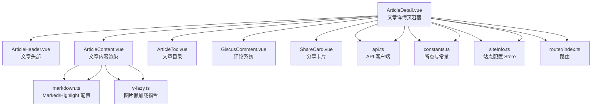
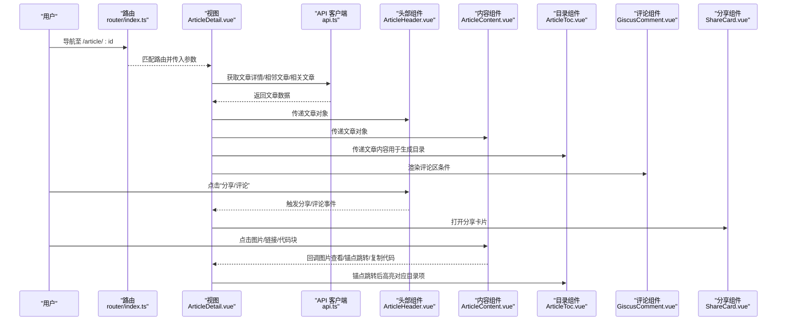
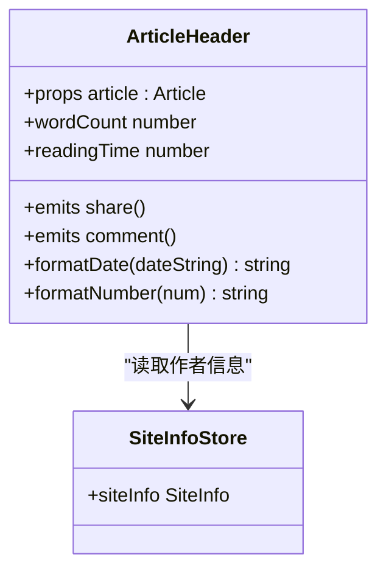
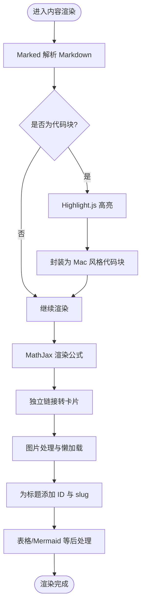
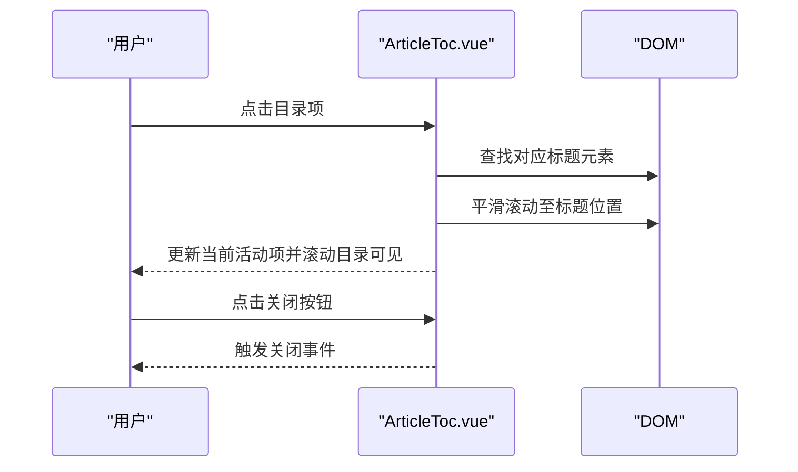
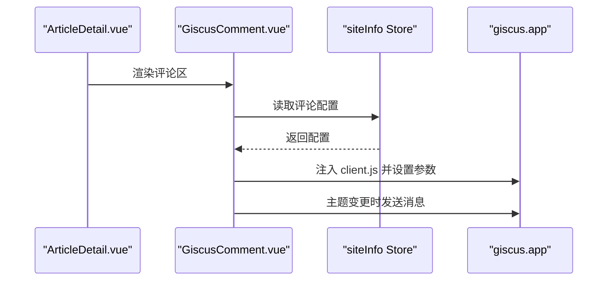
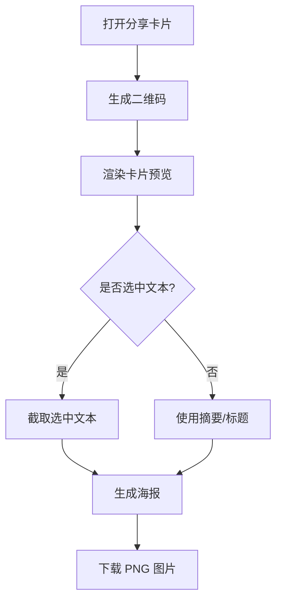
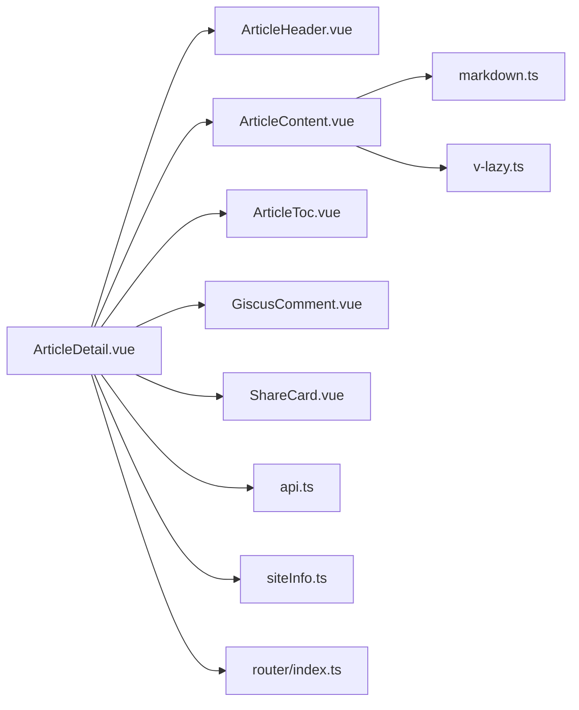

# 文章详情页

<cite>
**本文档引用的文件**
- [ArticleDetail.vue](file://web/frontend/src/views/ArticleDetail.vue)
- [ArticleHeader.vue](file://web/frontend/src/components/article/ArticleHeader.vue)
- [ArticleContent.vue](file://web/frontend/src/components/article/ArticleContent.vue)
- [ArticleToc.vue](file://web/frontend/src/components/article/ArticleToc.vue)
- [GiscusComment.vue](file://web/frontend/src/components/comment/GiscusComment.vue)
- [ShareCard.vue](file://web/frontend/src/components/ShareCard.vue)
- [markdown.ts](file://web/frontend/src/utils/markdown.ts)
- [v-lazy.ts](file://web/frontend/src/directives/v-lazy.ts)
- [api.ts](file://web/frontend/src/services/api.ts)
- [index.ts](file://web/frontend/src/types/index.ts)
- [constants.ts](file://web/frontend/src/utils/constants.ts)
- [siteInfo.ts](file://web/frontend/src/stores/siteInfo.ts)
- [main.ts](file://web/frontend/src/main.ts)
- [index.ts](file://web/frontend/src/router/index.ts)
</cite>

## 目录
1. [简介](#简介)
2. [项目结构](#项目结构)
3. [核心组件](#核心组件)
4. [架构总览](#架构总览)
5. [详细组件分析](#详细组件分析)
6. [依赖关系分析](#依赖关系分析)
7. [性能考量](#性能考量)
8. [故障排查指南](#故障排查指南)
9. [结论](#结论)
10. [附录](#附录)

## 简介
本文档围绕文章详情页功能进行系统化说明，覆盖整体布局与组件架构、文章头部元数据渲染、Markdown 内容解析与渲染机制（含代码高亮、Mermaid 图表、数学公式、图片懒加载与点击放大）、自动生成的目录与锚点导航、SEO 优化与社交分享、响应式与移动端优化策略，以及评论系统的集成与交互设计。

## 项目结构
文章详情页采用 Vue 3 + Vite 的前端工程，核心页面位于 views 层，组件位于 components 层，通过 Pinia 状态管理与路由驱动数据流。页面主要由以下模块构成：
- 页面容器：ArticleDetail.vue
- 头部组件：ArticleHeader.vue（标题、作者、发布时间、阅读量、分类标签、操作按钮）
- 内容组件：ArticleContent.vue（Markdown 解析、代码高亮、Mermaid 图表、数学公式、链接卡片、划词分享）
- 目录组件：ArticleToc.vue（自动生成、滚动高亮、锚点跳转）
- 评论组件：GiscusComment.vue（基于 Giscus 的评论系统）
- 分享组件：ShareCard.vue（选中文字生成海报、二维码）
- 工具与配置：markdown.ts（Marked 配置）、v-lazy.ts（图片懒加载指令）、api.ts（API 客户端）、constants.ts（断点与常量）、siteInfo.ts（站点配置 Store）

**图表来源**
- [ArticleDetail.vue:1-155](file://web/frontend/src/views/ArticleDetail.vue#L1-L155)
- [ArticleHeader.vue:1-50](file://web/frontend/src/components/article/ArticleHeader.vue#L1-L50)
- [ArticleContent.vue:1-38](file://web/frontend/src/components/article/ArticleContent.vue#L1-L38)
- [ArticleToc.vue:1-25](file://web/frontend/src/components/article/ArticleToc.vue#L1-L25)
- [GiscusComment.vue:1-9](file://web/frontend/src/components/comment/GiscusComment.vue#L1-L9)
- [ShareCard.vue:1-75](file://web/frontend/src/components/ShareCard.vue#L1-L75)
- [markdown.ts:1-71](file://web/frontend/src/utils/markdown.ts#L1-L71)
- [v-lazy.ts:1-63](file://web/frontend/src/directives/v-lazy.ts#L1-L63)
- [api.ts:1-137](file://web/frontend/src/services/api.ts#L1-L137)
- [constants.ts:1-48](file://web/frontend/src/utils/constants.ts#L1-L48)
- [siteInfo.ts:1-261](file://web/frontend/src/stores/siteInfo.ts#L1-L261)
- [index.ts:1-73](file://web/frontend/src/router/index.ts#L1-L73)

**章节来源**
- [ArticleDetail.vue:1-155](file://web/frontend/src/views/ArticleDetail.vue#L1-L155)
- [ArticleHeader.vue:1-50](file://web/frontend/src/components/article/ArticleHeader.vue#L1-L50)
- [ArticleContent.vue:1-38](file://web/frontend/src/components/article/ArticleContent.vue#L1-L38)
- [ArticleToc.vue:1-25](file://web/frontend/src/components/article/ArticleToc.vue#L1-L25)
- [GiscusComment.vue:1-9](file://web/frontend/src/components/comment/GiscusComment.vue#L1-L9)
- [ShareCard.vue:1-75](file://web/frontend/src/components/ShareCard.vue#L1-L75)
- [markdown.ts:1-71](file://web/frontend/src/utils/markdown.ts#L1-L71)
- [v-lazy.ts:1-63](file://web/frontend/src/directives/v-lazy.ts#L1-L63)
- [api.ts:1-137](file://web/frontend/src/services/api.ts#L1-L137)
- [constants.ts:1-48](file://web/frontend/src/utils/constants.ts#L1-L48)
- [siteInfo.ts:1-261](file://web/frontend/src/stores/siteInfo.ts#L1-L261)
- [index.ts:1-73](file://web/frontend/src/router/index.ts#L1-L73)

## 核心组件
- 文章详情页容器：负责加载文章、相邻文章、相关文章，控制目录展开/收起、图片查看器、分享卡片、评论区挂载与交互。
- 文章头部：渲染标题、作者信息、发布时间、字数统计、阅读时间、分类标签、评论/分享操作按钮。
- 文章内容：Markdown 解析、代码高亮、Mermaid 图表渲染、数学公式渲染、链接卡片、划词分享、图片点击放大。
- 文章目录：从 Markdown 内容提取 H1/H2 标题生成目录，滚动时高亮当前项，锚点平滑跳转。
- 评论系统：按站点配置启用 Giscus，动态注入脚本，支持主题切换。
- 分享卡片：生成带二维码的分享海报，支持多主题风格。

**章节来源**
- [ArticleDetail.vue:157-453](file://web/frontend/src/views/ArticleDetail.vue#L157-L453)
- [ArticleHeader.vue:52-133](file://web/frontend/src/components/article/ArticleHeader.vue#L52-L133)
- [ArticleContent.vue:40-318](file://web/frontend/src/components/article/ArticleContent.vue#L40-L318)
- [ArticleToc.vue:27-148](file://web/frontend/src/components/article/ArticleToc.vue#L27-L148)
- [GiscusComment.vue:11-94](file://web/frontend/src/components/comment/GiscusComment.vue#L11-L94)
- [ShareCard.vue:77-167](file://web/frontend/src/components/ShareCard.vue#L77-L167)

## 架构总览
文章详情页的数据流与交互流程如下：

**图表来源**
- [index.ts:18-22](file://web/frontend/src/router/index.ts#L18-L22)
- [ArticleDetail.vue:222-323](file://web/frontend/src/views/ArticleDetail.vue#L222-L323)
- [api.ts:80-102](file://web/frontend/src/services/api.ts#L80-L102)
- [ArticleHeader.vue:60-66](file://web/frontend/src/components/article/ArticleHeader.vue#L60-L66)
- [ArticleContent.vue:78-81](file://web/frontend/src/components/article/ArticleContent.vue#L78-L81)
- [ArticleToc.vue:74-94](file://web/frontend/src/components/article/ArticleToc.vue#L74-L94)
- [GiscusComment.vue:20-24](file://web/frontend/src/components/comment/GiscusComment.vue#L20-L24)
- [ShareCard.vue:131-137](file://web/frontend/src/components/ShareCard.vue#L131-L137)

## 详细组件分析

### 文章头部组件（ArticleHeader）
职责与特性：
- 标题渲染：使用文章标题。
- 作者信息：显示作者头像与名称，来源于站点配置 Store。
- 发布时间：格式化显示。
- 阅读统计：字数统计（去除 HTML 标签，分别统计中文字符与英文单词），阅读时间估算（中文约 200 字/分钟，英文约 150 词/分钟）。
- 分类标签：显示文章分类名称。
- 操作按钮：评论、分享（触发父组件回调）。

**图表来源**
- [ArticleHeader.vue:69-133](file://web/frontend/src/components/article/ArticleHeader.vue#L69-L133)
- [siteInfo.ts:110-187](file://web/frontend/src/stores/siteInfo.ts#L110-L187)

**章节来源**
- [ArticleHeader.vue:52-133](file://web/frontend/src/components/article/ArticleHeader.vue#L52-L133)
- [siteInfo.ts:110-187](file://web/frontend/src/stores/siteInfo.ts#L110-L187)

### 文章内容组件（ArticleContent）
职责与特性：
- Markdown 解析：使用 Marked 进行解析；为代码块注入 Mac 风格的高亮容器与复制按钮；Mermaid 代码块保留为原样，由前端运行时渲染。
- 数学公式：通过 MathJax 渲染内联与块级公式。
- 链接卡片：独立链接段落渲染为卡片样式，提取域名作为描述。
- 图片处理：支持点击放大、懒加载指令、图片查看器交互。
- 目录锚点：为标题添加 ID 与 slug，支持内部锚点跳转与平滑滚动。
- 划词分享：选中文本后显示分享提示，点击生成分享卡片。
- 代码复制：点击复制按钮将解码后的代码写入剪贴板，并反馈“已复制”状态。

**图表来源**
- [ArticleContent.vue:169-182](file://web/frontend/src/components/article/ArticleContent.vue#L169-L182)
- [markdown.ts:10-70](file://web/frontend/src/utils/markdown.ts#L10-L70)
- [ArticleContent.vue:194-242](file://web/frontend/src/components/article/ArticleContent.vue#L194-L242)

**章节来源**
- [ArticleContent.vue:40-318](file://web/frontend/src/components/article/ArticleContent.vue#L40-L318)
- [markdown.ts:1-71](file://web/frontend/src/utils/markdown.ts#L1-L71)
- [v-lazy.ts:8-61](file://web/frontend/src/directives/v-lazy.ts#L8-L61)

### 文章目录组件（ArticleToc）
职责与特性：
- 自动生成：从 Markdown 内容中提取 H1/H2 标题，生成目录项。
- 滚动高亮：监听滚动，匹配当前可视范围内的标题，高亮对应目录项，并自动滚动目录使其可见。
- 锚点导航：点击目录项执行平滑跳转至对应标题位置；移动端点击后自动收起目录。
- 交互关闭：提供关闭按钮，支持外部触发关闭。

**图表来源**
- [ArticleToc.vue:74-148](file://web/frontend/src/components/article/ArticleToc.vue#L74-L148)

**章节来源**
- [ArticleToc.vue:27-148](file://web/frontend/src/components/article/ArticleToc.vue#L27-L148)

### 评论系统（GiscusComment）
职责与特性：
- 条件渲染：仅当站点配置启用且类型为 giscus 时显示。
- 参数注入：从站点配置 Store 读取仓库、分类、映射等参数，动态注入到 giscus client.js。
- 主题同步：监听主题变化，向 iframe 发送主题切换消息。
- 配置校验：若仓库参数为默认值，显示配置提醒。

**图表来源**
- [GiscusComment.vue:20-94](file://web/frontend/src/components/comment/GiscusComment.vue#L20-L94)
- [siteInfo.ts:170-186](file://web/frontend/src/stores/siteInfo.ts#L170-L186)

**章节来源**
- [GiscusComment.vue:11-94](file://web/frontend/src/components/comment/GiscusComment.vue#L11-L94)
- [siteInfo.ts:170-186](file://web/frontend/src/stores/siteInfo.ts#L170-L186)

### 分享卡片（ShareCard）
职责与特性：
- 选中分享：支持从文章中选中文本生成带引用的分享海报。
- 海报生成：使用 html2canvas 将卡片 DOM 转换为图片并下载。
- 二维码生成：基于文章 URL 生成二维码，便于扫码阅读。
- 主题选择：支持多种主题风格，按主题色渲染卡片背景与文字。
- 交互关闭：点击遮罩或关闭按钮关闭弹窗。

**图表来源**
- [ShareCard.vue:113-167](file://web/frontend/src/components/ShareCard.vue#L113-L167)

**章节来源**
- [ShareCard.vue:77-167](file://web/frontend/src/components/ShareCard.vue#L77-L167)

### SEO 优化与社交媒体分享
- 页面标题与描述：站点配置中包含页面标题与模糊标题，可在路由守卫或页面生命周期中结合文章信息动态设置。
- 社交分享：提供分享卡片组件，支持生成带二维码的海报；文章头部与内容区域的分享按钮可联动该组件。
- 结构化数据：建议在页面中补充 JSON-LD 或 Open Graph 标签，包含文章标题、摘要、作者、发布时间、封面图等，提升搜索引擎与社交平台的抓取质量。
- 图片优化：使用懒加载指令与合适的尺寸，配合 CDN 与 WebP 格式进一步优化加载性能。

[本节为通用指导，不直接分析具体文件]

### 响应式与移动端优化
- 断点控制：使用 constants.ts 中的断点（桌面/宽屏）控制目录展开/收起行为与滚动锁定。
- 移动端体验：目录在小屏时自动收起，点击悬浮按钮展开；图片查看器在移动端提供手势缩放与键盘导航（方向键切换图片）。
- 样式适配：针对不同屏幕尺寸调整排版、间距与字号，确保阅读体验一致。

**章节来源**
- [constants.ts:6-12](file://web/frontend/src/utils/constants.ts#L6-L12)
- [ArticleDetail.vue:409-431](file://web/frontend/src/views/ArticleDetail.vue#L409-L431)
- [ArticleDetail.vue:581-622](file://web/frontend/src/views/ArticleDetail.vue#L581-L622)

## 依赖关系分析
- 组件耦合：ArticleDetail 作为容器，聚合多个子组件并通过事件与属性通信；子组件之间低耦合，职责清晰。
- 数据流：通过 api.ts 提供统一的 API 客户端，ArticleDetail 调用文章详情、相邻文章、相关文章接口；站点配置通过 siteInfo Store 提供。
- 渲染管线：ArticleContent 依赖 markdown.ts 中的 Marked/Highlight 配置；v-lazy.ts 提供图片懒加载能力。
- 路由与守卫：router/index.ts 负责路由匹配与参数校验，确保非法 ID 不会进入详情页。

**图表来源**
- [ArticleDetail.vue:157-170](file://web/frontend/src/views/ArticleDetail.vue#L157-L170)
- [ArticleContent.vue:40-44](file://web/frontend/src/components/article/ArticleContent.vue#L40-L44)
- [markdown.ts:1-71](file://web/frontend/src/utils/markdown.ts#L1-L71)
- [v-lazy.ts:1-63](file://web/frontend/src/directives/v-lazy.ts#L1-L63)
- [api.ts:66-103](file://web/frontend/src/services/api.ts#L66-L103)
- [siteInfo.ts:110-187](file://web/frontend/src/stores/siteInfo.ts#L110-L187)
- [index.ts:1-73](file://web/frontend/src/router/index.ts#L1-L73)

**章节来源**
- [ArticleDetail.vue:157-170](file://web/frontend/src/views/ArticleDetail.vue#L157-L170)
- [ArticleContent.vue:40-44](file://web/frontend/src/components/article/ArticleContent.vue#L40-L44)
- [markdown.ts:1-71](file://web/frontend/src/utils/markdown.ts#L1-L71)
- [v-lazy.ts:1-63](file://web/frontend/src/directives/v-lazy.ts#L1-L63)
- [api.ts:66-103](file://web/frontend/src/services/api.ts#L66-L103)
- [siteInfo.ts:110-187](file://web/frontend/src/stores/siteInfo.ts#L110-L187)
- [index.ts:1-73](file://web/frontend/src/router/index.ts#L1-L73)

## 性能考量
- 图片懒加载：通过 v-lazy 指令在进入视口时再加载图片，减少首屏压力。
- 代码高亮：仅对代码块进行高亮，避免对整页文本处理造成开销。
- Mermaid 渲染：按需渲染，主题切换时重新初始化并触发重绘。
- 表格与长内容：表格外层包裹横向滚动容器，避免破坏布局；长内容分块渲染，减少重排。
- API 超时与错误：api.ts 提供统一的请求拦截与错误处理，避免页面白屏。

[本节提供通用指导，不直接分析具体文件]

## 故障排查指南
- 文章无法加载或返回空数据：检查 ArticleDetail 的 getArticleDetail 方法与 api.ts 的 getArticle 接口；确认路由参数是否为纯数字。
- 目录不更新或锚点无效：确认 ArticleContent 是否正确为标题添加 ID 与 slug，ArticleToc 是否监听到内容变化并重新提取标题。
- 代码高亮失效：确认 main.ts 中已引入 markdown.ts，确保 Marked/Highlight 配置生效。
- 图片不显示或加载失败：检查 v-lazy 指令是否正确绑定，图片路径是否有效；查看控制台网络错误。
- 评论不显示：确认 siteInfo Store 中 comment.enable 与 comment.type 为 giscus，且仓库配置非默认值。
- 分享海报生成失败：检查 html2canvas 与二维码生成依赖是否可用，确认 DOM 已渲染完成。

**章节来源**
- [ArticleDetail.vue:222-250](file://web/frontend/src/views/ArticleDetail.vue#L222-L250)
- [ArticleToc.vue:137-148](file://web/frontend/src/components/article/ArticleToc.vue#L137-L148)
- [ArticleContent.vue:169-182](file://web/frontend/src/components/article/ArticleContent.vue#L169-L182)
- [main.ts:8-8](file://web/frontend/src/main.ts#L8-L8)
- [v-lazy.ts:29-56](file://web/frontend/src/directives/v-lazy.ts#L29-L56)
- [siteInfo.ts:170-186](file://web/frontend/src/stores/siteInfo.ts#L170-L186)
- [ShareCard.vue:139-166](file://web/frontend/src/components/ShareCard.vue#L139-L166)

## 结论
文章详情页通过清晰的组件拆分与数据流设计，实现了从文章头部元数据、Markdown 内容渲染、目录导航、评论系统到社交分享的完整闭环。借助懒加载、代码高亮、Mermaid 与数学公式渲染等技术手段，兼顾了可读性与交互体验；配合响应式断点与移动端优化策略，确保在多终端上的一致表现。

## 附录
- 类型定义：统一的 Article、Category、Tag、ApiResponse 等类型定义，保证前后端数据契约一致。
- 路由与守卫：路由参数校验与滚动行为控制，提升用户体验与安全性。

**章节来源**
- [index.ts:6-71](file://web/frontend/src/types/index.ts#L6-L71)
- [index.ts:60-70](file://web/frontend/src/router/index.ts#L60-L70)