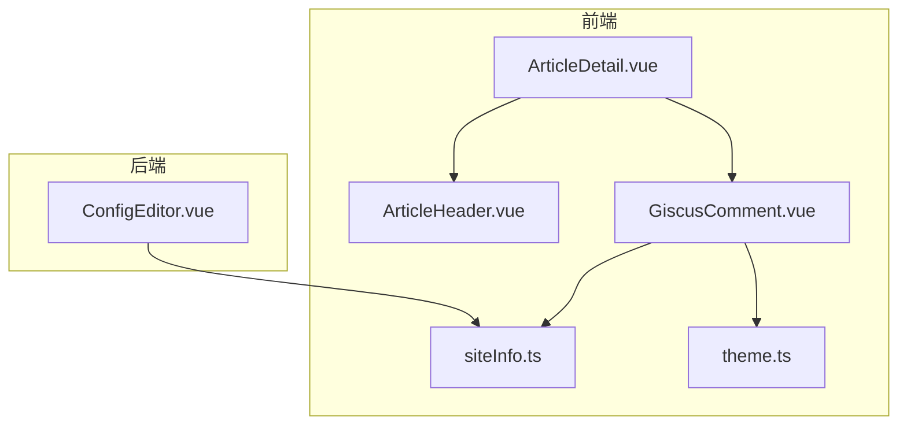
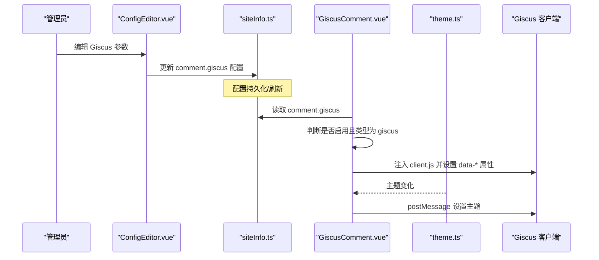
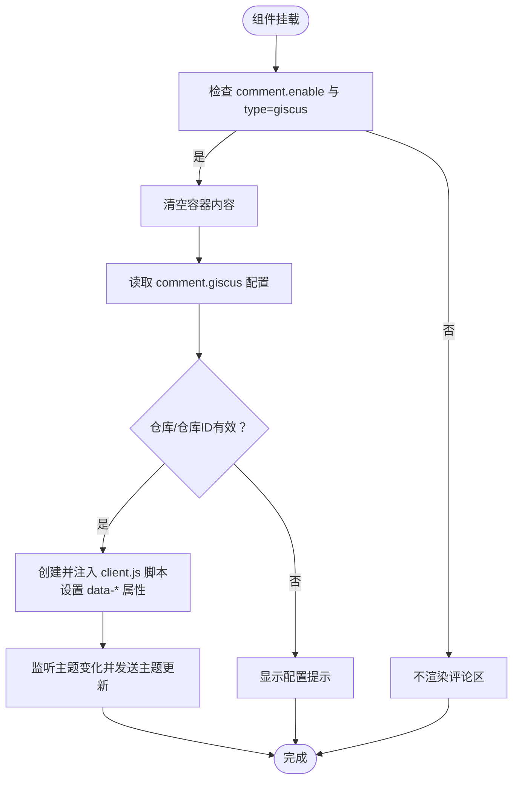
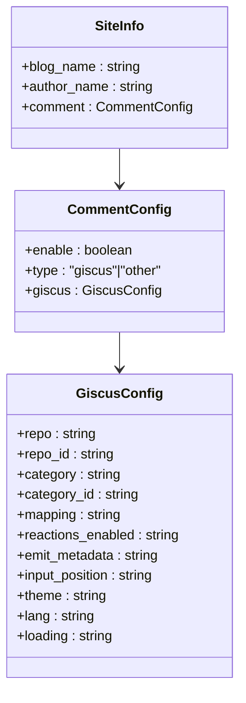
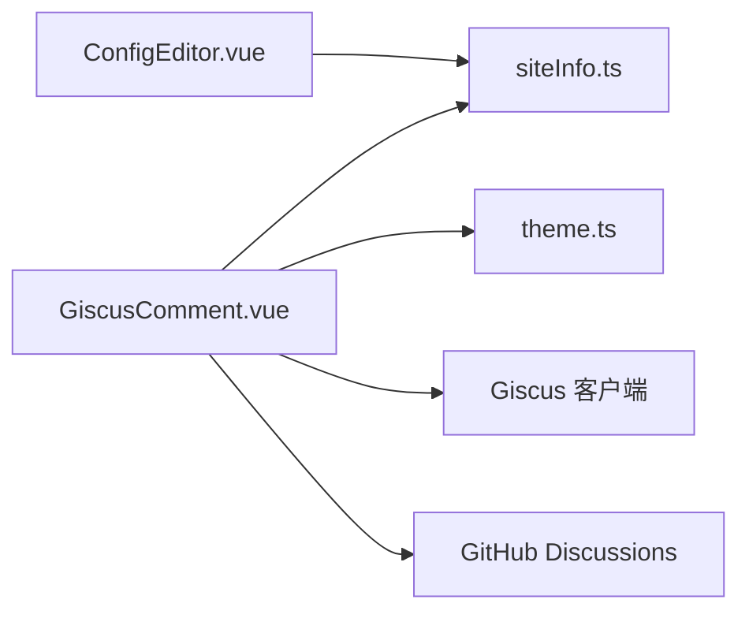
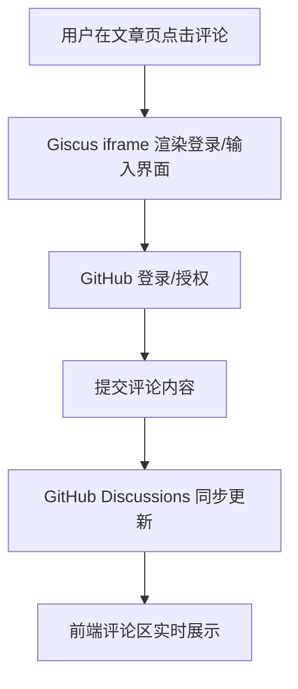

# 评论系统

<cite>
**本文引用的文件**
- [GiscusComment.vue](file://web/frontend/src/components/comment/GiscusComment.vue)
- [siteInfo.ts](file://web/frontend/src/stores/siteInfo.ts)
- [theme.ts](file://web/frontend/src/stores/theme.ts)
- [ConfigEditor.vue](file://web/backend/src/views/system/ConfigEditor.vue)
- [ArticleDetail.vue](file://web/frontend/src/views/ArticleDetail.vue)
- [ArticleHeader.vue](file://web/frontend/src/components/article/ArticleHeader.vue)
</cite>

## 目录
1. [引言](#引言)
2. [项目结构](#项目结构)
3. [核心组件](#核心组件)
4. [架构总览](#架构总览)
5. [详细组件分析](#详细组件分析)
6. [依赖关系分析](#依赖关系分析)
7. [性能考虑](#性能考虑)
8. [故障排查指南](#故障排查指南)
9. [结论](#结论)
10. [附录](#附录)

## 引言
本文件面向前台展示网站的评论系统，聚焦于 Giscus 评论组件的集成与配置，涵盖 GitHub Discussions 的连接设置、初始化参数（主题样式、语言、颜色方案等）、评论数据获取与展示机制（排序、分页加载）、评论提交流程（身份验证、内容审核）、样式定制与主题适配、性能优化（懒加载与缓存策略）、错误处理与用户体验优化，以及扩展与自定义指南。读者可据此快速理解并部署或二次开发评论功能。

## 项目结构
评论系统由前端 Vue 组件与后端配置编辑界面共同构成：
- 前端组件：GiscusComment.vue 动态注入 Giscus 客户端脚本，读取站点配置与主题状态进行渲染。
- 状态管理：siteInfo.ts 提供站点配置（含评论配置）；theme.ts 提供主题状态（明暗切换）。
- 后端配置：ConfigEditor.vue 提供可视化界面以填写 Giscus 所需的仓库、分类等参数。
- 页面集成：ArticleDetail.vue 展示文章详情，ArticleHeader.vue 提供“评论”交互入口。

**图表来源**
- [GiscusComment.vue:1-137](file://web/frontend/src/components/comment/GiscusComment.vue#L1-L137)
- [siteInfo.ts:1-261](file://web/frontend/src/stores/siteInfo.ts#L1-L261)
- [theme.ts:1-38](file://web/frontend/src/stores/theme.ts#L1-L38)
- [ConfigEditor.vue:176-210](file://web/backend/src/views/system/ConfigEditor.vue#L176-L210)
- [ArticleDetail.vue](file://web/frontend/src/views/ArticleDetail.vue)
- [ArticleHeader.vue:38-66](file://web/frontend/src/components/article/ArticleHeader.vue#L38-L66)

**章节来源**
- [GiscusComment.vue:1-137](file://web/frontend/src/components/comment/GiscusComment.vue#L1-L137)
- [siteInfo.ts:110-187](file://web/frontend/src/stores/siteInfo.ts#L110-L187)
- [theme.ts:1-38](file://web/frontend/src/stores/theme.ts#L1-L38)
- [ConfigEditor.vue:176-210](file://web/backend/src/views/system/ConfigEditor.vue#L176-L210)

## 核心组件
- GiscusComment.vue：负责条件渲染、动态注入 Giscus 客户端脚本、传递主题与语言参数、响应主题变更。
- siteInfo.ts：集中管理站点配置（含 comment.giscus 参数），支持从 API 或静态 YAML 文件加载，并提供更新接口。
- theme.ts：维护明/暗主题状态，写入 DOM 属性，便于 Giscus 主题同步。
- ConfigEditor.vue：后端可视化配置界面，用于填写 Giscus 所需的仓库、分类等关键参数。
- ArticleDetail.vue 与 ArticleHeader.vue：页面级集成点，承载评论区与“评论”按钮交互。

**章节来源**
- [GiscusComment.vue:11-94](file://web/frontend/src/components/comment/GiscusComment.vue#L11-L94)
- [siteInfo.ts:91-107](file://web/frontend/src/stores/siteInfo.ts#L91-L107)
- [theme.ts:4-38](file://web/frontend/src/stores/theme.ts#L4-L38)
- [ConfigEditor.vue:176-210](file://web/backend/src/views/system/ConfigEditor.vue#L176-L210)
- [ArticleHeader.vue:38-66](file://web/frontend/src/components/article/ArticleHeader.vue#L38-L66)

## 架构总览
Giscus 评论系统采用“前端组件 + 后端配置 + GitHub Discussions”的解耦架构：
- 后端通过 ConfigEditor.vue 写入 Giscus 关键参数（仓库、分类等）。
- 前端通过 siteInfo.ts 读取配置，GiscusComment.vue 注入客户端脚本并传参。
- theme.ts 提供主题状态，GiscusComment.vue 在主题切换时向 iframe 发送主题更新消息。
- 用户在文章详情页触发评论展示，Giscus 负责与 GitHub Discussions 通信。

**图表来源**
- [ConfigEditor.vue:176-210](file://web/backend/src/views/system/ConfigEditor.vue#L176-L210)
- [siteInfo.ts:189-259](file://web/frontend/src/stores/siteInfo.ts#L189-L259)
- [GiscusComment.vue:21-94](file://web/frontend/src/components/comment/GiscusComment.vue#L21-L94)
- [theme.ts:28-32](file://web/frontend/src/stores/theme.ts#L28-L32)

## 详细组件分析

### GiscusComment 组件
- 条件渲染：仅当站点配置开启且类型为 giscus 时显示。
- 参数注入：动态创建脚本节点，设置仓库、分类、映射、输入位置、反应开关、元数据、语言、加载策略等属性。
- 主题同步：监听主题状态变化，向 Giscus iframe 发送主题更新消息。
- 错误提示：若仓库或仓库 ID 未配置，显示提示信息而非加载脚本。
- 生命周期：在挂载时尝试加载；若初始配置尚未就绪，则等待 store 变化后加载。

**图表来源**
- [GiscusComment.vue:21-94](file://web/frontend/src/components/comment/GiscusComment.vue#L21-L94)

**章节来源**
- [GiscusComment.vue:11-94](file://web/frontend/src/components/comment/GiscusComment.vue#L11-L94)

### 站点配置与初始化参数
- 配置来源：优先从后端 API 获取 YAML 配置，失败则回退到静态 /config.yaml；解析后合并环境覆盖。
- 评论配置项：启用开关、类型（giscus/other）、giscus 子配置（仓库、仓库 ID、分类、分类 ID、映射、反应开关、元数据、输入位置、主题、语言、加载策略等）。
- 默认值：提供合理默认（如映射为 pathname、反应开启、输入位置顶部、主题 light、语言 zh-CN、加载策略 lazy）。

**图表来源**
- [siteInfo.ts:91-107](file://web/frontend/src/stores/siteInfo.ts#L91-L107)

**章节来源**
- [siteInfo.ts:189-259](file://web/frontend/src/stores/siteInfo.ts#L189-L259)
- [siteInfo.ts:170-187](file://web/frontend/src/stores/siteInfo.ts#L170-L187)

### 主题与语言设置
- 主题：theme.ts 维护当前主题（light/dark），写入 DOM 属性；GiscusComment.vue 在主题变化时通过 postMessage 同步至 iframe。
- 语言：GiscusComment.vue 将配置中的语言参数注入到脚本属性中，确保评论界面语言一致。

**章节来源**
- [theme.ts:4-38](file://web/frontend/src/stores/theme.ts#L4-L38)
- [GiscusComment.vue:52-58](file://web/frontend/src/components/comment/GiscusComment.vue#L52-L58)

### 后端配置编辑（Giscus 参数）
- 启用开关与类型选择：支持启用评论并选择 Giscus 类型。
- 关键参数：仓库（用户名/仓库）、仓库 ID、分类、分类 ID。
- 配置持久化：通过 API 更新配置并刷新前端 store。

**章节来源**
- [ConfigEditor.vue:176-210](file://web/backend/src/views/system/ConfigEditor.vue#L176-L210)

### 页面集成与交互
- ArticleDetail.vue：作为文章详情页承载评论区。
- ArticleHeader.vue：提供“评论”按钮，用于触发评论相关交互（如滚动至评论区）。

**章节来源**
- [ArticleDetail.vue](file://web/frontend/src/views/ArticleDetail.vue)
- [ArticleHeader.vue:38-66](file://web/frontend/src/components/article/ArticleHeader.vue#L38-L66)

## 依赖关系分析
- GiscusComment.vue 依赖：
  - siteInfo.ts：读取评论配置与全局站点信息。
  - theme.ts：读取当前主题并监听变化。
- ConfigEditor.vue 依赖：
  - siteInfo.ts：写入/更新评论配置。
- 运行时依赖：
  - Giscus 官方客户端脚本（client.js）。
  - GitHub Discussions 讨论区（由仓库与分类 ID 指定）。

**图表来源**
- [GiscusComment.vue:11-14](file://web/frontend/src/components/comment/GiscusComment.vue#L11-L14)
- [siteInfo.ts:1-6](file://web/frontend/src/stores/siteInfo.ts#L1-L6)
- [theme.ts:1-3](file://web/frontend/src/stores/theme.ts#L1-L3)
- [ConfigEditor.vue:176-210](file://web/backend/src/views/system/ConfigEditor.vue#L176-L210)

**章节来源**
- [GiscusComment.vue:11-14](file://web/frontend/src/components/comment/GiscusComment.vue#L11-L14)
- [siteInfo.ts:1-6](file://web/frontend/src/stores/siteInfo.ts#L1-L6)
- [theme.ts:1-3](file://web/frontend/src/stores/theme.ts#L1-L3)
- [ConfigEditor.vue:176-210](file://web/backend/src/views/system/ConfigEditor.vue#L176-L210)

## 性能考虑
- 懒加载策略：
  - GiscusComment.vue 使用“data-loading=lazy”属性，结合异步脚本加载，减少首屏资源压力。
  - 仅在满足启用条件且容器存在时才注入脚本，避免无效请求。
- 主题切换优化：
  - 通过 postMessage 精准更新 iframe 主题，无需重新注入脚本。
- 配置加载优化：
  - 先尝试 API 获取配置，失败再回退静态文件，降低网络异常影响。
- 评论区最小高度：
  - 通过样式设置最小高度，避免首次加载时布局抖动。

**章节来源**
- [GiscusComment.vue:57-61](file://web/frontend/src/components/comment/GiscusComment.vue#L57-L61)
- [GiscusComment.vue:65-73](file://web/frontend/src/components/comment/GiscusComment.vue#L65-L73)
- [siteInfo.ts:189-219](file://web/frontend/src/stores/siteInfo.ts#L189-L219)
- [GiscusComment.vue:119-121](file://web/frontend/src/components/comment/GiscusComment.vue#L119-L121)

## 故障排查指南
- 评论区不显示：
  - 检查站点配置中 comment.enable 是否开启、type 是否为 giscus。
  - 确认 comment.giscus 中 repo 与 repo_id 已正确填写，避免使用默认占位值。
- 主题不同步：
  - 确认 theme.ts 正常工作并已写入 DOM 属性；检查 GiscusComment.vue 的主题监听与 postMessage 调用。
- 语言或样式异常：
  - 确认 comment.giscus.lang 与 comment.giscus.theme 设置正确。
- 配置未生效：
  - 在后端 ConfigEditor.vue 中确认参数已保存；前端 siteInfo.ts 已刷新配置。

**章节来源**
- [GiscusComment.vue:21-39](file://web/frontend/src/components/comment/GiscusComment.vue#L21-L39)
- [GiscusComment.vue:65-73](file://web/frontend/src/components/comment/GiscusComment.vue#L65-L73)
- [ConfigEditor.vue:176-210](file://web/backend/src/views/system/ConfigEditor.vue#L176-L210)
- [siteInfo.ts:236-259](file://web/frontend/src/stores/siteInfo.ts#L236-L259)

## 结论
本评论系统以 Giscus 为核心，结合后端可视化配置与前端动态注入，实现了与 GitHub Discussions 的无缝对接。通过合理的参数注入、主题同步与懒加载策略，兼顾了易用性与性能。开发者可在现有基础上进一步扩展（如接入其他评论服务、增强审核流程、完善分页与排序策略）。

## 附录

### 初始化参数一览（来自配置）
- 仓库与分类：repo、repo_id、category、category_id
- 映射与行为：mapping、reactions_enabled、emit_metadata、input_position
- 主题与语言：theme、lang
- 加载策略：loading

**章节来源**
- [siteInfo.ts:94-106](file://web/frontend/src/stores/siteInfo.ts#L94-L106)

### 评论提交流程（概念示意）

[此图为概念示意，不对应具体代码文件]