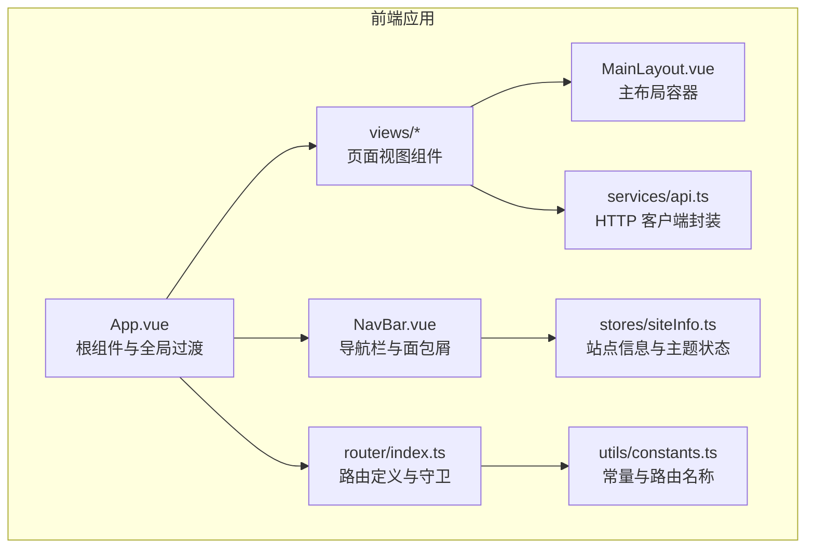
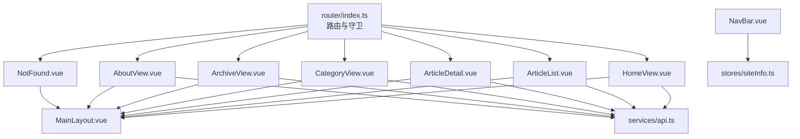
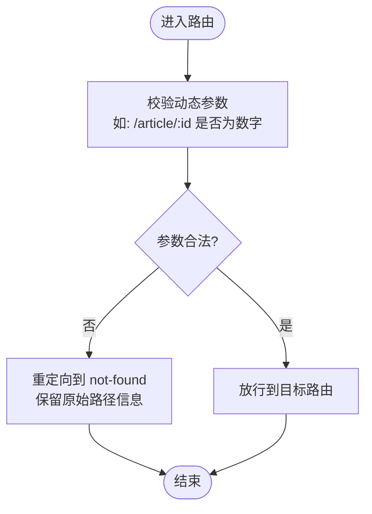
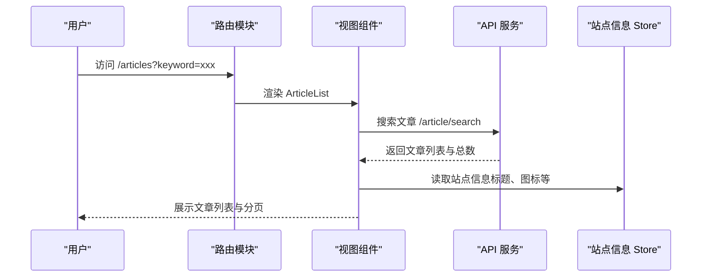
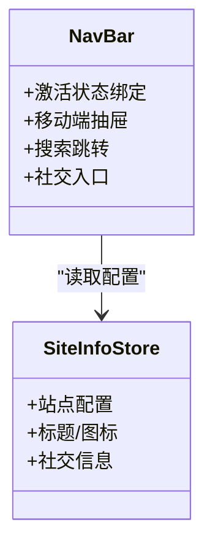
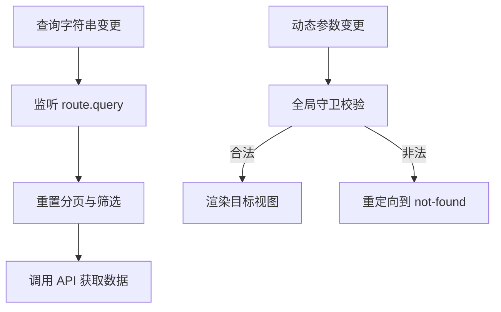
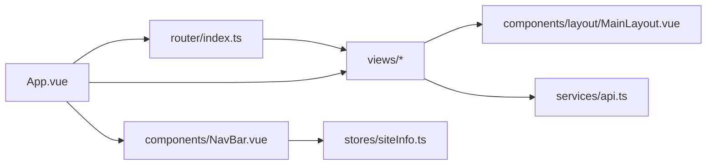

# 路由与导航

<cite>
**本文引用的文件**
- [web/frontend/src/router/index.ts](file://web/frontend/src/router/index.ts)
- [web/frontend/src/views/HomeView.vue](file://web/frontend/src/views/HomeView.vue)
- [web/frontend/src/views/ArticleDetail.vue](file://web/frontend/src/views/ArticleDetail.vue)
- [web/frontend/src/views/ArticleList.vue](file://web/frontend/src/views/ArticleList.vue)
- [web/frontend/src/views/CategoryView.vue](file://web/frontend/src/views/CategoryView.vue)
- [web/frontend/src/views/ArchiveView.vue](file://web/frontend/src/views/ArchiveView.vue)
- [web/frontend/src/views/AboutView.vue](file://web/frontend/src/views/AboutView.vue)
- [web/frontend/src/views/NotFound.vue](file://web/frontend/src/views/NotFound.vue)
- [web/frontend/src/components/NavBar.vue](file://web/frontend/src/components/NavBar.vue)
- [web/frontend/src/components/layout/MainLayout.vue](file://web/frontend/src/components/layout/MainLayout.vue)
- [web/frontend/src/services/api.ts](file://web/frontend/src/services/api.ts)
- [web/frontend/src/stores/siteInfo.ts](file://web/frontend/src/stores/siteInfo.ts)
- [web/frontend/src/utils/constants.ts](file://web/frontend/src/utils/constants.ts)
- [web/frontend/src/App.vue](file://web/frontend/src/App.vue)
- [web/frontend/src/main.ts](file://web/frontend/src/main.ts)
</cite>

## 目录
1. [简介](#简介)
2. [项目结构](#项目结构)
3. [核心组件](#核心组件)
4. [架构总览](#架构总览)
5. [详细组件分析](#详细组件分析)
6. [依赖关系分析](#依赖关系分析)
7. [性能考量](#性能考量)
8. [故障排查指南](#故障排查指南)
9. [结论](#结论)
10. [附录](#附录)

## 简介
本文件面向前台展示网站的路由与导航系统，围绕 Vue Router 的配置与路由守卫、页面路由定义（首页、文章详情、分类页面、归档页面等）、导航菜单的动态生成与激活状态管理、路由参数与查询字符串处理、程序化导航与编程式跳转、路由懒加载与代码分割、路由级错误处理与重定向、SEO 友好 URL 与 meta 管理、以及扩展与自定义指南进行系统化说明。

## 项目结构
前台路由与导航位于 web/frontend 子项目中，采用单页应用（SPA）架构，通过 Vue Router 管理页面路由，配合 Pinia 状态管理与 API 服务实现数据驱动的页面渲染与导航行为。

**图表来源**
- [web/frontend/src/App.vue:1-215](file://web/frontend/src/App.vue#L1-L215)
- [web/frontend/src/components/NavBar.vue:1-971](file://web/frontend/src/components/NavBar.vue#L1-L971)
- [web/frontend/src/components/layout/MainLayout.vue:1-130](file://web/frontend/src/components/layout/MainLayout.vue#L1-L130)
- [web/frontend/src/router/index.ts:1-73](file://web/frontend/src/router/index.ts#L1-L73)
- [web/frontend/src/services/api.ts:1-137](file://web/frontend/src/services/api.ts#L1-L137)
- [web/frontend/src/stores/siteInfo.ts:1-261](file://web/frontend/src/stores/siteInfo.ts#L1-L261)
- [web/frontend/src/utils/constants.ts:1-48](file://web/frontend/src/utils/constants.ts#L1-L48)

**章节来源**
- [web/frontend/src/main.ts:1-28](file://web/frontend/src/main.ts#L1-L28)
- [web/frontend/src/App.vue:1-215](file://web/frontend/src/App.vue#L1-L215)

## 核心组件
- 路由器实例与守卫：在路由模块中定义历史模式、路由表、滚动行为与全局前置守卫，负责参数校验与基础重定向。
- 页面视图：首页、文章列表、文章详情、分类列表、归档、关于、404 等页面组件，承载业务数据与交互。
- 导航栏：动态生成菜单项、激活状态绑定、移动端抽屉菜单、搜索跳转、主题切换与社交入口。
- 布局容器：统一的主布局，支持左右侧栏与全宽模式。
- API 服务：封装 axios 客户端、请求拦截器、响应拦截器与错误处理，统一暴露文章、分类、标签等 API。
- 站点信息 Store：集中管理站点配置、标题、图标、社交信息等，供导航与页面渲染使用。
- 常量：集中定义断点、分页、动画时长与路由名称，便于跨组件复用。

**章节来源**
- [web/frontend/src/router/index.ts:1-73](file://web/frontend/src/router/index.ts#L1-L73)
- [web/frontend/src/views/HomeView.vue:1-133](file://web/frontend/src/views/HomeView.vue#L1-L133)
- [web/frontend/src/views/ArticleList.vue:1-225](file://web/frontend/src/views/ArticleList.vue#L1-L225)
- [web/frontend/src/views/ArticleDetail.vue:1-1028](file://web/frontend/src/views/ArticleDetail.vue#L1-L1028)
- [web/frontend/src/views/CategoryView.vue:1-375](file://web/frontend/src/views/CategoryView.vue#L1-L375)
- [web/frontend/src/views/ArchiveView.vue:1-888](file://web/frontend/src/views/ArchiveView.vue#L1-L888)
- [web/frontend/src/views/AboutView.vue:1-372](file://web/frontend/src/views/AboutView.vue#L1-L372)
- [web/frontend/src/views/NotFound.vue:1-184](file://web/frontend/src/views/NotFound.vue#L1-L184)
- [web/frontend/src/components/NavBar.vue:1-971](file://web/frontend/src/components/NavBar.vue#L1-L971)
- [web/frontend/src/components/layout/MainLayout.vue:1-130](file://web/frontend/src/components/layout/MainLayout.vue#L1-L130)
- [web/frontend/src/services/api.ts:1-137](file://web/frontend/src/services/api.ts#L1-L137)
- [web/frontend/src/stores/siteInfo.ts:1-261](file://web/frontend/src/stores/siteInfo.ts#L1-L261)
- [web/frontend/src/utils/constants.ts:1-48](file://web/frontend/src/utils/constants.ts#L1-L48)

## 架构总览
前台路由与导航系统以“路由定义 + 视图组件 + 导航组件 + 数据服务 + 状态管理”为核心，形成清晰的职责分离与可扩展结构。

**图表来源**
- [web/frontend/src/router/index.ts:1-73](file://web/frontend/src/router/index.ts#L1-L73)
- [web/frontend/src/views/*.vue:1-133](file://web/frontend/src/views/HomeView.vue#L1-L133)
- [web/frontend/src/components/NavBar.vue:1-971](file://web/frontend/src/components/NavBar.vue#L1-L971)
- [web/frontend/src/components/layout/MainLayout.vue:1-130](file://web/frontend/src/components/layout/MainLayout.vue#L1-L130)
- [web/frontend/src/services/api.ts:1-137](file://web/frontend/src/services/api.ts#L1-L137)
- [web/frontend/src/stores/siteInfo.ts:1-261](file://web/frontend/src/stores/siteInfo.ts#L1-L261)

## 详细组件分析

### 路由配置与全局守卫
- 历史模式与基础路径：使用 Web History 模式，基础路径来自环境变量。
- 路由表：定义首页、文章列表、文章详情、分类列表、分类详情、归档、关于、通配 404。
- 滚动行为：优先恢复浏览器保存的滚动位置，否则滚动至顶部。
- 全局前置守卫：校验动态参数（如文章 ID）是否为合法数字，非法则重定向到 404。

**图表来源**
- [web/frontend/src/router/index.ts:50-70](file://web/frontend/src/router/index.ts#L50-L70)

**章节来源**
- [web/frontend/src/router/index.ts:1-73](file://web/frontend/src/router/index.ts#L1-L73)

### 页面路由定义与数据流
- 首页：加载置顶与最新文章，支持“加载更多”。
- 文章列表：支持关键词搜索、分类筛选、分页加载；路由参数与查询字符串联动。
- 文章详情：根据路由参数加载文章详情、相邻文章与相关推荐；支持图片查看器与目录悬浮。
- 分类页面：展示分类卡片，点击跳转到对应分类文章列表。
- 归档页面：按年月时间线展示文章，支持标签过滤与贡献热力图。
- 关于页面：渲染静态 Markdown 内容。
- 404 页面：友好提示与返回操作。

**图表来源**
- [web/frontend/src/views/ArticleList.vue:1-225](file://web/frontend/src/views/ArticleList.vue#L1-L225)
- [web/frontend/src/services/api.ts:66-103](file://web/frontend/src/services/api.ts#L66-L103)
- [web/frontend/src/stores/siteInfo.ts:189-219](file://web/frontend/src/stores/siteInfo.ts#L189-L219)

**章节来源**
- [web/frontend/src/views/HomeView.vue:1-133](file://web/frontend/src/views/HomeView.vue#L1-L133)
- [web/frontend/src/views/ArticleList.vue:1-225](file://web/frontend/src/views/ArticleList.vue#L1-L225)
- [web/frontend/src/views/ArticleDetail.vue:1-1028](file://web/frontend/src/views/ArticleDetail.vue#L1-L1028)
- [web/frontend/src/views/CategoryView.vue:1-375](file://web/frontend/src/views/CategoryView.vue#L1-L375)
- [web/frontend/src/views/ArchiveView.vue:1-888](file://web/frontend/src/views/ArchiveView.vue#L1-L888)
- [web/frontend/src/views/AboutView.vue:1-372](file://web/frontend/src/views/AboutView.vue#L1-L372)
- [web/frontend/src/views/NotFound.vue:1-184](file://web/frontend/src/views/NotFound.vue#L1-L184)

### 导航菜单与激活状态
- 导航栏组件：包含首页、文章、分类、归档、关于等菜单项，使用路由链接与激活类名绑定当前路由名称。
- 激活状态：通过绑定 $route.name 与路由名称常量实现高亮。
- 移动端：抽屉菜单与搜索框，支持关闭时恢复背景滚动。
- 社交与管理员入口：根据站点信息动态显示。

**图表来源**
- [web/frontend/src/components/NavBar.vue:1-971](file://web/frontend/src/components/NavBar.vue#L1-L971)
- [web/frontend/src/stores/siteInfo.ts:1-261](file://web/frontend/src/stores/siteInfo.ts#L1-L261)

**章节来源**
- [web/frontend/src/components/NavBar.vue:1-971](file://web/frontend/src/components/NavBar.vue#L1-L971)
- [web/frontend/src/utils/constants.ts:37-47](file://web/frontend/src/utils/constants.ts#L37-L47)

### 路由参数与查询字符串处理
- 动态参数：文章详情使用 /article/:id，分类详情使用 /category/:id。
- 查询字符串：文章列表支持 /articles?keyword=xxx，组件内监听查询变化并刷新数据。
- 参数校验：全局守卫对动态参数进行合法性校验，非法时重定向到 404。
- 程序化导航：导航栏搜索通过 router.push 传入查询参数；分类卡片点击通过 router.push 跳转到分类详情。

**图表来源**
- [web/frontend/src/views/ArticleList.vue:199-211](file://web/frontend/src/views/ArticleList.vue#L199-L211)
- [web/frontend/src/router/index.ts:60-70](file://web/frontend/src/router/index.ts#L60-L70)

**章节来源**
- [web/frontend/src/views/ArticleList.vue:1-225](file://web/frontend/src/views/ArticleList.vue#L1-L225)
- [web/frontend/src/components/NavBar.vue:259-267](file://web/frontend/src/components/NavBar.vue#L259-L267)

### 程序化导航与编程式跳转
- 搜索跳转：导航栏输入关键字后，使用命名路由跳转到文章列表并携带查询参数。
- 分类跳转：分类卡片点击后，使用编程式导航跳转到对应分类详情。
- 返回操作：404 页面提供返回上一页与返回首页的操作。

**章节来源**
- [web/frontend/src/components/NavBar.vue:259-267](file://web/frontend/src/components/NavBar.vue#L259-L267)
- [web/frontend/src/views/CategoryView.vue:134-137](file://web/frontend/src/views/CategoryView.vue#L134-L137)
- [web/frontend/src/views/NotFound.vue:44-46](file://web/frontend/src/views/NotFound.vue#L44-L46)

### 路由懒加载与代码分割
- 路由级别懒加载：文章列表、文章详情、分类视图、归档视图、关于视图均采用动态导入实现按需加载。
- 优势：降低首屏体积，提升初始加载性能；按页面维度进行代码分割。

**章节来源**
- [web/frontend/src/router/index.ts:15-43](file://web/frontend/src/router/index.ts#L15-L43)

### 路由级错误处理与重定向
- 404兜底：通配路由将未匹配路径重定向到 not-found。
- 参数非法：全局守卫检测动态参数合法性，非法时重定向到 not-found 并保留原始路径信息。
- 页面级错误：各视图内部对 API 错误进行日志记录与状态反馈。

**章节来源**
- [web/frontend/src/router/index.ts:44-48](file://web/frontend/src/router/index.ts#L44-L48)
- [web/frontend/src/router/index.ts:60-70](file://web/frontend/src/router/index.ts#L60-L70)
- [web/frontend/src/views/ArticleList.vue:126-131](file://web/frontend/src/views/ArticleList.vue#L126-L131)

### SEO 友好 URL 与 meta 管理
- URL 结构：采用语义化路径，如 /article/:id、/category/:id、/archive、/about，利于搜索引擎理解。
- meta 管理：当前前端路由未显式注入 meta 信息；可在视图组件中结合站点信息 Store 动态设置页面标题与描述，或在路由元信息中扩展 meta 字段并在导航栏守卫中统一设置 document.title。

[本节为概念性建议，不直接分析具体文件]

### 扩展与自定义指南
- 新增页面：在路由模块中添加新路由记录，采用动态导入实现懒加载；在视图目录新增对应组件。
- 自定义导航：在 NavBar 中增加菜单项，绑定路由名称常量，确保激活状态一致。
- 参数校验：在全局守卫中扩展参数校验规则，支持更复杂的 ID 格式或权限判断。
- SEO 增强：在路由元信息中添加 title、description 等字段，在 beforeEach 中统一设置 document.title 与 meta 标签。
- 错误处理：在视图组件中对 API 调用失败进行统一提示与重试机制；在路由守卫中补充权限与登录态校验。

[本节为概念性建议，不直接分析具体文件]

## 依赖关系分析
- 组件耦合：视图组件依赖 API 服务与站点信息 Store；导航栏依赖站点信息 Store 与路由。
- 路由耦合：路由模块与视图组件松耦合，通过路由名称与参数解耦。
- 数据流：视图组件通过 API 服务获取数据，Store 提供全局配置与主题状态。

**图表来源**
- [web/frontend/src/router/index.ts:1-73](file://web/frontend/src/router/index.ts#L1-L73)
- [web/frontend/src/views/*.vue:1-133](file://web/frontend/src/views/HomeView.vue#L1-L133)
- [web/frontend/src/components/layout/MainLayout.vue:1-130](file://web/frontend/src/components/layout/MainLayout.vue#L1-L130)
- [web/frontend/src/services/api.ts:1-137](file://web/frontend/src/services/api.ts#L1-L137)
- [web/frontend/src/components/NavBar.vue:1-971](file://web/frontend/src/components/NavBar.vue#L1-L971)
- [web/frontend/src/stores/siteInfo.ts:1-261](file://web/frontend/src/stores/siteInfo.ts#L1-L261)
- [web/frontend/src/App.vue:1-215](file://web/frontend/src/App.vue#L1-L215)

**章节来源**
- [web/frontend/src/main.ts:1-28](file://web/frontend/src/main.ts#L1-L28)
- [web/frontend/src/App.vue:1-215](file://web/frontend/src/App.vue#L1-L215)

## 性能考量
- 路由懒加载：按需加载页面组件，减少首屏 JavaScript 体积。
- 滚动恢复：利用浏览器保存的滚动位置，提升用户体验。
- API 超时与错误：统一的请求与响应拦截器，避免阻塞与白屏。
- 分页与无限滚动：文章列表与分类页面采用分页与滚动加载，降低一次性渲染压力。

[本节提供通用指导，不直接分析具体文件]

## 故障排查指南
- 404 页面：确认路径拼写与参数格式；检查全局守卫是否将非法参数重定向到 not-found。
- 搜索无结果：确认查询参数是否正确传递；检查后端搜索接口是否可用。
- 分类跳转异常：确认分类 ID 是否存在；检查路由参数与查询字符串监听逻辑。
- 导航高亮失效：确认路由名称与 NavBar 中的绑定一致；检查路由名称常量是否同步更新。
- 标题与图标：确认站点信息 Store 是否成功加载配置；检查 App.vue 中的标题与图标设置逻辑。

**章节来源**
- [web/frontend/src/views/NotFound.vue:1-184](file://web/frontend/src/views/NotFound.vue#L1-L184)
- [web/frontend/src/views/ArticleList.vue:199-211](file://web/frontend/src/views/ArticleList.vue#L199-L211)
- [web/frontend/src/components/NavBar.vue:259-267](file://web/frontend/src/components/NavBar.vue#L259-L267)
- [web/frontend/src/stores/siteInfo.ts:189-219](file://web/frontend/src/stores/siteInfo.ts#L189-L219)
- [web/frontend/src/App.vue:39-111](file://web/frontend/src/App.vue#L39-L111)

## 结论
该路由与导航系统通过清晰的路由定义、全局守卫与视图组件协作，实现了参数校验、懒加载、程序化导航与错误处理的完整闭环。结合站点信息 Store 与导航栏组件，提供了良好的用户体验与可扩展性。建议后续增强 meta 管理与权限守卫，进一步提升 SEO 与安全性。

## 附录
- 常量与路由名称：集中定义断点、分页、动画时长与路由名称，便于跨组件复用与维护。
- 全局错误处理：在应用入口设置全局错误处理器，防止子组件异常导致白屏。

**章节来源**
- [web/frontend/src/utils/constants.ts:1-48](file://web/frontend/src/utils/constants.ts#L1-L48)
- [web/frontend/src/main.ts:21-26](file://web/frontend/src/main.ts#L21-L26)