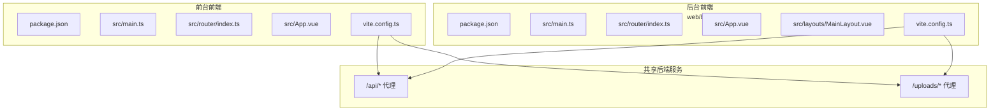
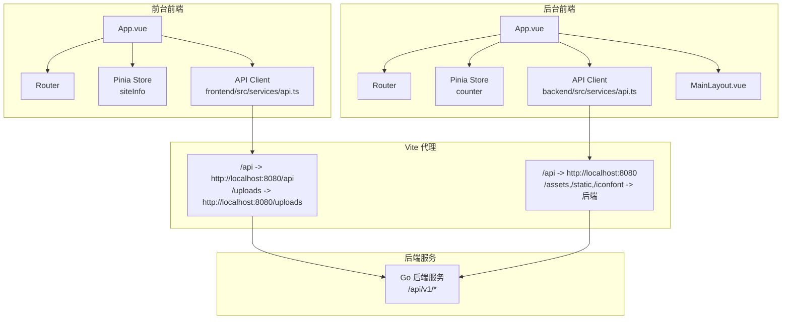
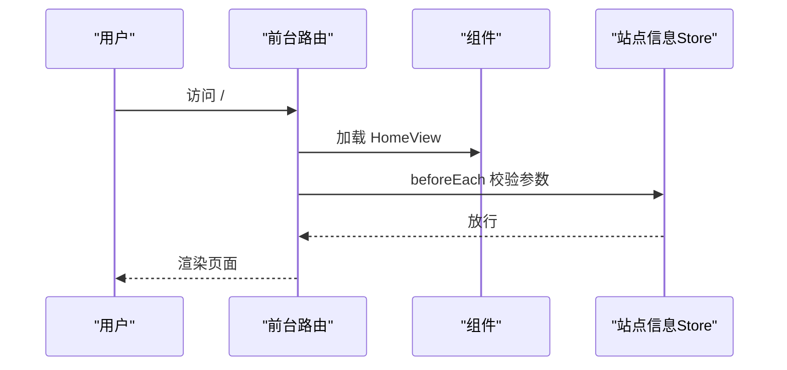
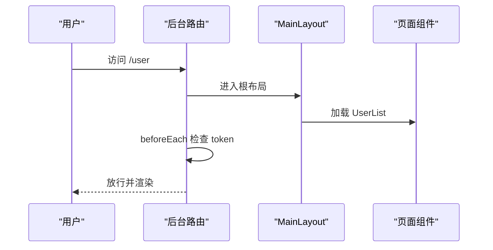
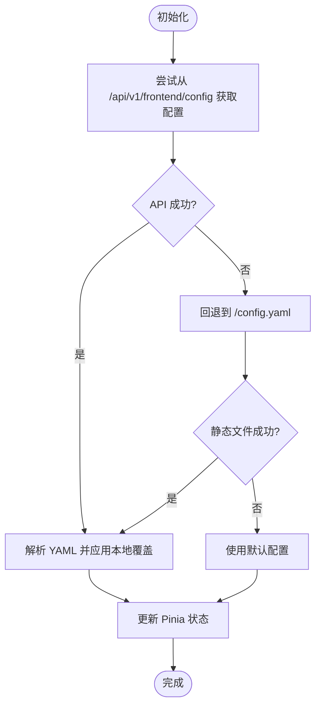
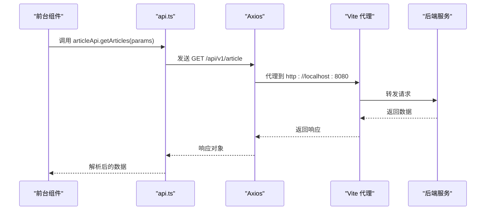
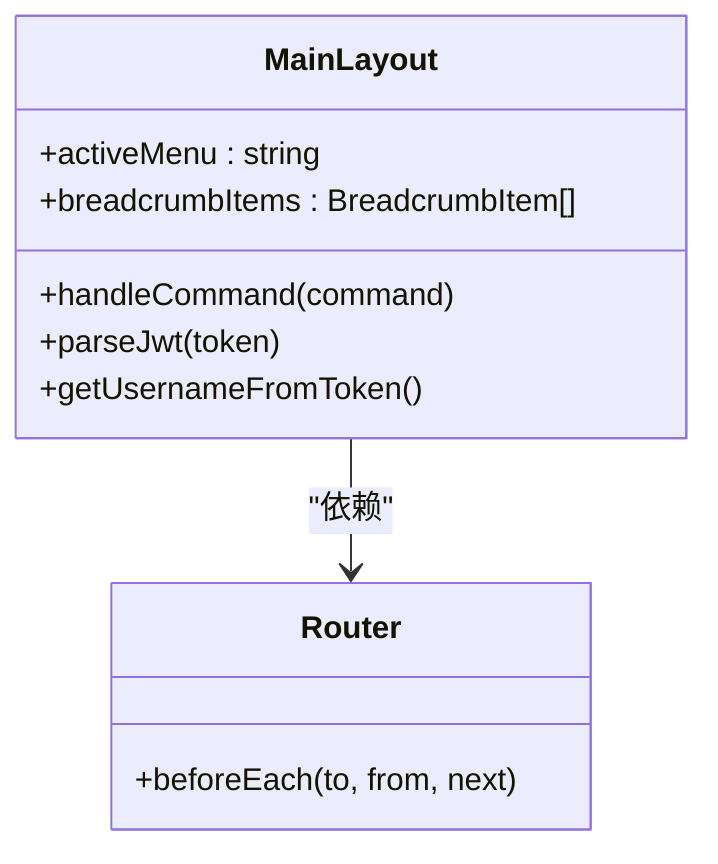
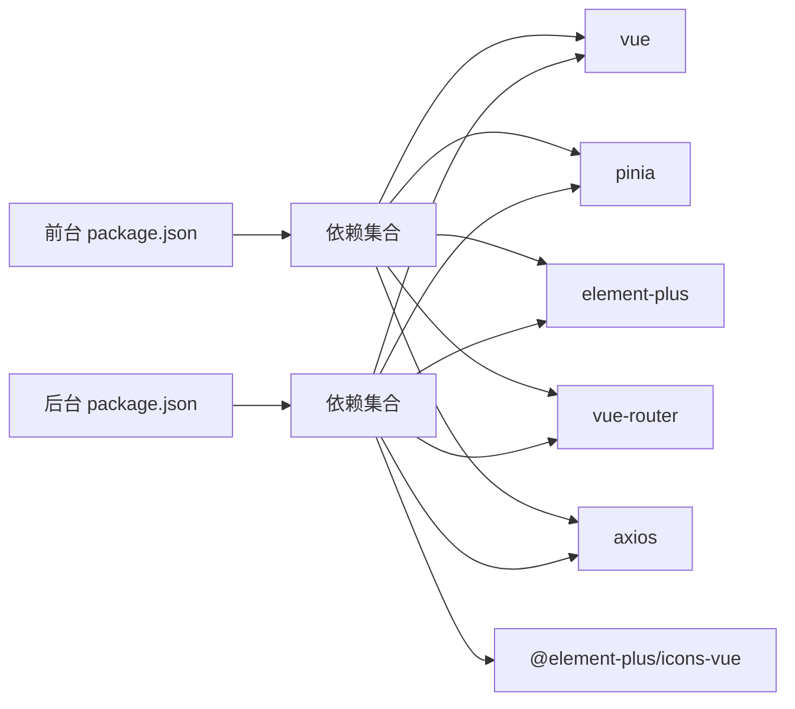

# 前端架构

<cite>
**本文引用的文件**
- [web/frontend/package.json](file://web/frontend/package.json)
- [web/backend/package.json](file://web/backend/package.json)
- [web/frontend/vite.config.ts](file://web/frontend/vite.config.ts)
- [web/backend/vite.config.ts](file://web/backend/vite.config.ts)
- [web/frontend/src/main.ts](file://web/frontend/src/main.ts)
- [web/backend/src/main.ts](file://web/backend/src/main.ts)
- [web/frontend/src/router/index.ts](file://web/frontend/src/router/index.ts)
- [web/backend/src/router/index.ts](file://web/backend/src/router/index.ts)
- [web/frontend/src/stores/siteInfo.ts](file://web/frontend/src/stores/siteInfo.ts)
- [web/backend/src/stores/counter.ts](file://web/backend/src/stores/counter.ts)
- [web/frontend/src/services/api.ts](file://web/frontend/src/services/api.ts)
- [web/backend/src/services/api.ts](file://web/backend/src/services/api.ts)
- [web/backend/src/layouts/MainLayout.vue](file://web/backend/src/layouts/MainLayout.vue)
- [web/frontend/src/App.vue](file://web/frontend/src/App.vue)
- [web/backend/src/App.vue](file://web/backend/src/App.vue)
- [web/backend/src/utils/request.ts](file://web/backend/src/utils/request.ts)
</cite>

## 目录
1. [简介](#简介)
2. [项目结构](#项目结构)
3. [核心组件](#核心组件)
4. [架构总览](#架构总览)
5. [详细组件分析](#详细组件分析)
6. [依赖关系分析](#依赖关系分析)
7. [性能考量](#性能考量)
8. [故障排查指南](#故障排查指南)
9. [结论](#结论)
10. [附录](#附录)

## 简介
本文件面向前端开发者，系统性梳理 YanBlog 的前端架构与实现细节。项目采用 Vue 3 + TypeScript 技术栈，结合 Vite 构建工具，实现“前台展示网站”与“后台管理系统”的双端架构。前台负责对外展示，后台用于内容管理与系统配置；两者通过统一的反向代理与 API 客户端进行前后端分离通信。

- 技术栈要点
  - 前端框架：Vue 3、TypeScript、Pinia、Element Plus、Vue Router
  - 构建工具：Vite
  - 通信层：Axios + 自定义拦截器 + 取消控制器
  - 开发体验：Vite DevTools、类型检查、热更新

- 双端架构
  - 前台前端：web/frontend，提供博客展示、文章浏览、评论、侧边栏等
  - 后台前端：web/backend，提供登录、仪表盘、用户/分类/标签/文章/媒体/系统配置等管理界面

- 关键特性
  - 组件化架构与可复用布局
  - 路由守卫与权限控制
  - 状态管理与主题/站点信息持久化
  - API 客户端封装与错误处理
  - 响应式设计与移动端适配

## 项目结构
项目采用“双前端工程 + 共享后端服务”的组织方式，前台与后台分别独立运行于不同端口，并通过 Vite 代理转发到后端服务。

图表来源
- [web/frontend/vite.config.ts:26-56](file://web/frontend/vite.config.ts#L26-L56)
- [web/backend/vite.config.ts:35-74](file://web/backend/vite.config.ts#L35-L74)

章节来源
- [web/frontend/package.json:1-45](file://web/frontend/package.json#L1-L45)
- [web/backend/package.json:1-62](file://web/backend/package.json#L1-L62)
- [web/frontend/vite.config.ts:1-56](file://web/frontend/vite.config.ts#L1-L56)
- [web/backend/vite.config.ts:1-74](file://web/backend/vite.config.ts#L1-L74)

## 核心组件
- 应用入口与插件注册
  - 前台入口：注册 Pinia、路由、Element Plus、懒加载指令与全局错误处理
  - 后台入口：注册 Element Plus 图标组件、路由与 Element Plus
- 路由系统
  - 前台：基础页面路由、参数校验与滚动行为
  - 后台：嵌套路由、面包屑、登录守卫与页面标题
- 状态管理
  - 前台：站点信息 Store，支持从 API 或静态配置文件加载、更新与覆盖
  - 后台：示例计数 Store（演示 Pinia）
- API 客户端
  - 前台：基于 Axios 的客户端，封装取消控制器与错误处理
  - 后台：基于 Axios 的客户端，注入 Authorization 并处理 401
- 布局与主题
  - 前台：全局 Loading、头部导航、底部页脚、过渡动画
  - 后台：侧边栏菜单、面包屑、头部下拉、主内容区

章节来源
- [web/frontend/src/main.ts:1-28](file://web/frontend/src/main.ts#L1-L28)
- [web/backend/src/main.ts:1-23](file://web/backend/src/main.ts#L1-L23)
- [web/frontend/src/router/index.ts:1-73](file://web/frontend/src/router/index.ts#L1-L73)
- [web/backend/src/router/index.ts:1-185](file://web/backend/src/router/index.ts#L1-L185)
- [web/frontend/src/stores/siteInfo.ts:1-260](file://web/frontend/src/stores/siteInfo.ts#L1-L260)
- [web/backend/src/stores/counter.ts:1-13](file://web/backend/src/stores/counter.ts#L1-L13)
- [web/frontend/src/services/api.ts:1-137](file://web/frontend/src/services/api.ts#L1-L137)
- [web/backend/src/services/api.ts:1-252](file://web/backend/src/services/api.ts#L1-L252)
- [web/backend/src/layouts/MainLayout.vue:1-245](file://web/backend/src/layouts/MainLayout.vue#L1-L245)
- [web/frontend/src/App.vue:1-215](file://web/frontend/src/App.vue#L1-L215)
- [web/backend/src/App.vue:1-11](file://web/backend/src/App.vue#L1-L11)

## 架构总览
前台与后台通过 Vite 代理访问后端 API，前台还支持从静态配置文件加载站点信息，后台通过 Token 进行鉴权。

图表来源
- [web/frontend/src/services/api.ts:3-9](file://web/frontend/src/services/api.ts#L3-L9)
- [web/backend/src/services/api.ts:5-12](file://web/backend/src/services/api.ts#L5-L12)
- [web/frontend/vite.config.ts:41-52](file://web/frontend/vite.config.ts#L41-L52)
- [web/backend/vite.config.ts:51-72](file://web/backend/vite.config.ts#L51-L72)

## 详细组件分析

### 前台应用与路由
- 应用入口
  - 注入 Pinia、路由、Element Plus
  - 注册全局懒加载指令与错误处理
- 路由
  - 基础页面：首页、文章列表、文章详情、分类、归档、关于、404
  - 参数校验：对文章 ID 进行合法性校验，非法则重定向至 404
  - 滚动行为：支持返回时恢复滚动位置

图表来源
- [web/frontend/src/router/index.ts:61-70](file://web/frontend/src/router/index.ts#L61-L70)

章节来源
- [web/frontend/src/main.ts:14-28](file://web/frontend/src/main.ts#L14-L28)
- [web/frontend/src/router/index.ts:1-73](file://web/frontend/src/router/index.ts#L1-L73)

### 后台应用与路由
- 应用入口
  - 注册 Element Plus 图标组件、路由与 Element Plus
- 路由
  - 嵌套路由：以 MainLayout 为根布局，子路由包含仪表盘、用户、分类、标签、文章、媒体、系统设置等
  - 登录守卫：未登录访问受保护路由跳转登录；已登录访问登录页跳转首页
  - 页面标题：根据 meta.title 动态设置

图表来源
- [web/backend/src/router/index.ts:164-183](file://web/backend/src/router/index.ts#L164-L183)

章节来源
- [web/backend/src/main.ts:12-23](file://web/backend/src/main.ts#L12-L23)
- [web/backend/src/router/index.ts:1-185](file://web/backend/src/router/index.ts#L1-185)

### 站点信息状态管理（前台）
- 数据模型
  - 站点名称、作者信息、默认图片、英雄区、标语、Logo、Favicon、管理员地址、页面标题、IconFont、音乐播放器、快捷方式、页脚、社交与联系、评论配置等
- 生命周期
  - 首次加载：优先从 API 获取 YAML 配置；若失败则回退到静态 /config.yaml
  - 环境覆盖：本地环境自动覆盖 admin_url 为 /admin
  - 更新：通过 PUT /frontend/config 提交 YAML 内容并刷新状态
- 错误处理
  - 网络错误与超时统一提示

图表来源
- [web/frontend/src/stores/siteInfo.ts:188-218](file://web/frontend/src/stores/siteInfo.ts#L188-L218)

章节来源
- [web/frontend/src/stores/siteInfo.ts:1-260](file://web/frontend/src/stores/siteInfo.ts#L1-L260)

### API 客户端实现
- 前台 API 客户端
  - 基础配置：baseURL 为 /api/v1，超时 15 秒
  - 取消控制器：支持请求取消，避免重复请求与内存泄漏
  - 拦截器：请求日志、响应错误统一处理（超时、网络错误）
  - 方法封装：文章、分类、标签、天气、系统状态等 API
- 后台 API 客户端
  - 基础配置：baseURL 为 /api，注入 Authorization 头
  - 拦截器：401 清理 token 并跳转登录
  - 方法封装：用户、标签、文件、分类、文章、上传、系统配置等 API

图表来源
- [web/frontend/src/services/api.ts:66-103](file://web/frontend/src/services/api.ts#L66-L103)
- [web/frontend/vite.config.ts:41-47](file://web/frontend/vite.config.ts#L41-L47)

章节来源
- [web/frontend/src/services/api.ts:1-137](file://web/frontend/src/services/api.ts#L1-L137)
- [web/backend/src/services/api.ts:1-252](file://web/backend/src/services/api.ts#L1-L252)
- [web/backend/src/utils/request.ts:1-51](file://web/backend/src/utils/request.ts#L1-L51)

### 后台布局与权限控制
- 布局组件
  - 侧边栏菜单：仪表板、用户、分类、标签、文章、媒体、系统设置
  - 头部面包屑：根据路由 meta.title 动态生成
  - 下拉菜单：退出登录并清理 token
- 权限控制
  - 登录守卫：localStorage 中存在 token 才能访问受保护路由
  - 401 处理：后端返回 401 时自动跳转登录页

图表来源
- [web/backend/src/layouts/MainLayout.vue:99-177](file://web/backend/src/layouts/MainLayout.vue#L99-L177)
- [web/backend/src/router/index.ts:164-183](file://web/backend/src/router/index.ts#L164-L183)

章节来源
- [web/backend/src/layouts/MainLayout.vue:1-245](file://web/backend/src/layouts/MainLayout.vue#L1-L245)
- [web/backend/src/router/index.ts:164-183](file://web/backend/src/router/index.ts#L164-L183)

### 前台应用骨架与主题
- 应用骨架
  - LoadingSpinner：全局加载指示器
  - Header/Footer：固定头部与页脚
  - Transition：页面切换动画
- 主题与配置
  - 动态注入 IconFont 样式或回退样式
  - 设置 Favicon 与页面标题
  - 页面 blur/focus 切换标题

章节来源
- [web/frontend/src/App.vue:1-215](file://web/frontend/src/App.vue#L1-L215)

## 依赖关系分析
- 依赖分层
  - 前台：Vue 3、Pinia、Element Plus、Vue Router、Axios、Marked、Mermaid、Highlight.js
  - 后台：Vue 3、Pinia、Element Plus、Element Plus Icons、Vue Router、Axios、ECharts、Markdown-it、KaTeX
- 构建与开发
  - Vite 插件：@vitejs/plugin-vue、@vitejs/plugin-vue-jsx、vite-plugin-vue-devtools
  - 类型检查：vue-tsc、@vitejs/plugin-vue、@tsconfig/node22
- 代理与端口
  - 前台：端口 3002，代理 /api 与 /uploads
  - 后台：端口 3001，代理 /api、/assets、/static、/iconfont，并设置 base 为 /admin/

图表来源
- [web/frontend/package.json:16-30](file://web/frontend/package.json#L16-L30)
- [web/backend/package.json:20-35](file://web/backend/package.json#L20-L35)

章节来源
- [web/frontend/package.json:1-45](file://web/frontend/package.json#L1-L45)
- [web/backend/package.json:1-62](file://web/backend/package.json#L1-L62)
- [web/frontend/vite.config.ts:26-56](file://web/frontend/vite.config.ts#L26-L56)
- [web/backend/vite.config.ts:35-74](file://web/backend/vite.config.ts#L35-L74)

## 性能考量
- 构建与打包
  - 使用 Vite 的原生 ES 模块与按需编译，减少冷启动时间
  - 合理拆分路由组件，利用动态导入实现懒加载
- 网络与缓存
  - API 客户端设置合理超时与错误提示，避免长时间阻塞
  - 后台客户端在 401 时主动清理 token，避免无效重试
- 资源加载
  - 前台通过动态注入样式与图标字体，避免首屏阻塞
  - 后台菜单使用 Element Plus 图标，减少自定义 SVG 数量
- 建议
  - 对大图与媒体资源启用懒加载与压缩
  - 对高频接口增加本地缓存策略（如文章列表）

## 故障排查指南
- 常见问题
  - 无法访问 /api：确认 Vite 代理配置与后端服务是否启动
  - 登录后仍被重定向：检查 localStorage 中 token 是否存在及有效
  - 配置不生效：确认 /config.yaml 是否正确放置，或通过后台更新前端配置
  - 页面空白：查看全局错误处理器输出，定位具体组件异常
- 排查步骤
  - 检查 Vite 代理映射与目标端口
  - 检查 Axios 拦截器日志与响应状态
  - 检查路由守卫逻辑与面包屑生成
  - 检查 Element Plus 主题与图标是否正确加载

章节来源
- [web/frontend/src/main.ts:21-26](file://web/frontend/src/main.ts#L21-L26)
- [web/backend/src/services/api.ts:28-41](file://web/backend/src/services/api.ts#L28-L41)
- [web/frontend/vite.config.ts:41-52](file://web/frontend/vite.config.ts#L41-L52)
- [web/backend/vite.config.ts:51-72](file://web/backend/vite.config.ts#L51-L72)

## 结论
YanBlog 前端以 Vue 3 + TypeScript 为基础，结合 Vite 实现快速开发与高效构建；通过双端架构清晰划分前台展示与后台管理职责，借助 Element Plus 与 Pinia 提升开发效率与用户体验。API 客户端统一拦截与错误处理，路由守卫保障安全与一致性。整体架构具备良好的扩展性与可维护性，适合持续迭代与团队协作。

## 附录
- 开发指南
  - 启动前台：在 web/frontend 目录执行开发命令
  - 启动后台：在 web/backend 目录执行开发命令
  - 修改代理：调整 vite.config.ts 中 proxy 配置
  - 新增页面：在对应 src/views 下创建组件并在路由中注册
  - 新增 API：在对应 src/services/api.ts 中补充方法封装
- 最佳实践
  - 组件命名与目录结构遵循 feature-based 组织
  - 使用 Pinia 管理跨组件状态，避免深层 props 传递
  - 对外暴露的 API 方法统一在 api.ts 中集中导出
  - 路由参数严格校验，必要时使用动态导入与 keep-alive 缓存
  - 使用 Element Plus 组件库，按需引入图标与样式
- 响应式与移动端适配
  - 使用 CSS 变量与 Flex 布局适配多端
  - 对关键交互元素（按钮、输入框、卡片）在小屏设备上优化触控尺寸
  - 对图片与媒体资源采用自适应与懒加载策略