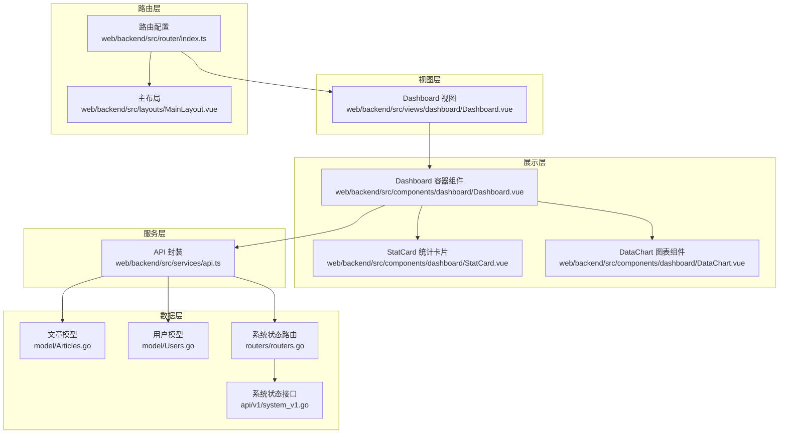
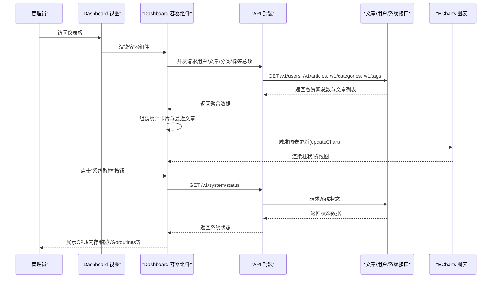
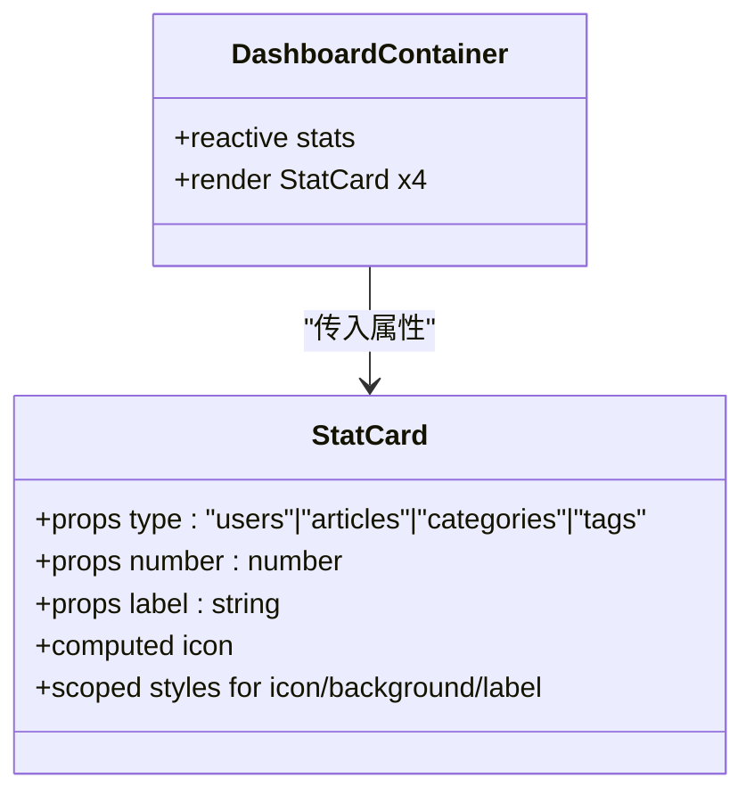
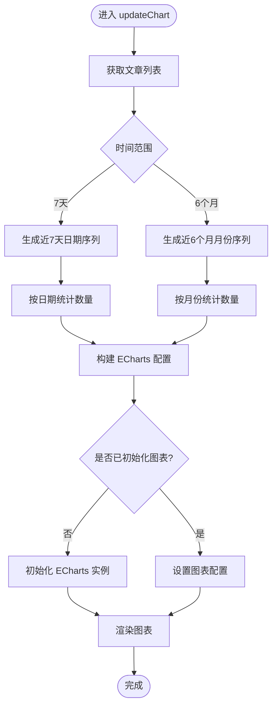
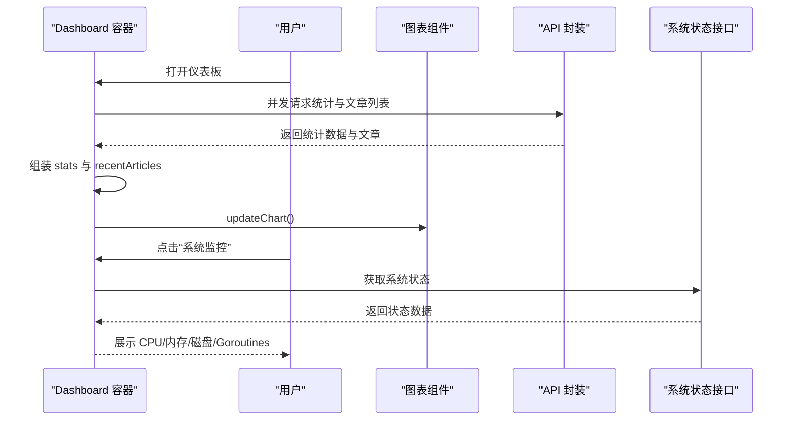
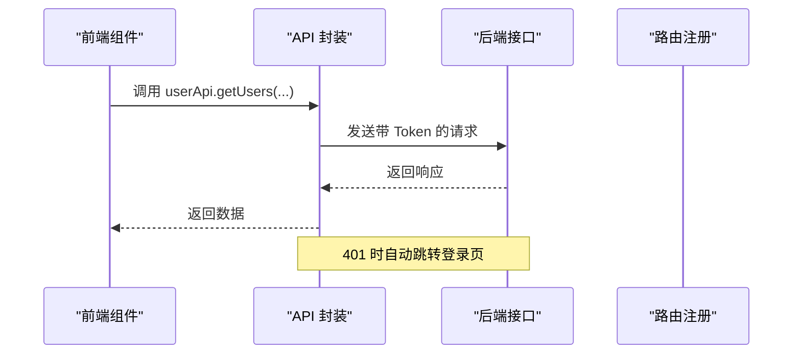
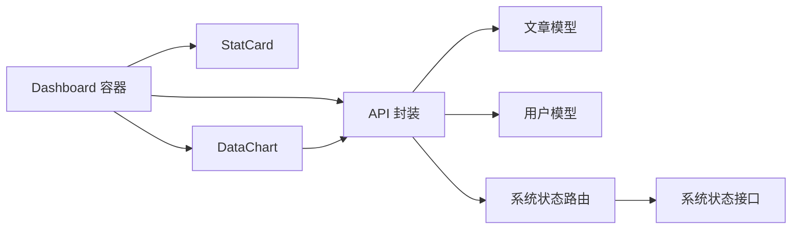

# 仪表板模块

<cite>
**本文档引用的文件**
- [Dashboard.vue](file://web/backend/src/components/dashboard/Dashboard.vue)
- [StatCard.vue](file://web/backend/src/components/dashboard/StatCard.vue)
- [DataChart.vue](file://web/backend/src/components/dashboard/DataChart.vue)
- [Dashboard.vue](file://web/backend/src/views/dashboard/Dashboard.vue)
- [api.ts](file://web/backend/src/services/api.ts)
- [index.ts](file://web/backend/src/router/index.ts)
- [MainLayout.vue](file://web/backend/src/layouts/MainLayout.vue)
- [Articles.go](file://model/Articles.go)
- [Users.go](file://model/Users.go)
- [routers.go](file://routers/routers.go)
- [system_v1.go](file://api/v1/system_v1.go)
</cite>

## 目录
1. [简介](#简介)
2. [项目结构](#项目结构)
3. [核心组件](#核心组件)
4. [架构总览](#架构总览)
5. [详细组件分析](#详细组件分析)
6. [依赖关系分析](#依赖关系分析)
7. [性能考虑](#性能考虑)
8. [故障排查指南](#故障排查指南)
9. [结论](#结论)
10. [附录](#附录)

## 简介
本文件为后台管理系统仪表板模块的详细技术文档，涵盖整体布局设计、数据展示架构、统计卡片组件、数据图表组件、实时更新与缓存策略、响应式设计与用户体验优化，以及数据获取流程、错误处理与加载状态管理。目标是帮助管理员获得直观的数据概览与业务洞察。

## 项目结构
仪表板模块位于后台前端工程中，采用组件化架构，主要由以下层次构成：
- 视图层：Dashboard 视图组件负责页面级布局与路由接入
- 展示层：统计卡片 StatCard、数据图表 DataChart、最近文章列表、系统概览等
- 服务层：统一 API 封装，提供用户、文章、分类、标签、系统状态等接口
- 路由层：定义仪表板入口与全局导航、鉴权守卫
- 数据层：后端模型与接口，提供文章归档、系统状态等数据支撑

**图表来源**
- [Dashboard.vue:1-11](file://web/backend/src/views/dashboard/Dashboard.vue#L1-L11)
- [Dashboard.vue:1-378](file://web/backend/src/components/dashboard/Dashboard.vue#L1-L378)
- [StatCard.vue:1-94](file://web/backend/src/components/dashboard/StatCard.vue#L1-L94)
- [DataChart.vue:1-214](file://web/backend/src/components/dashboard/DataChart.vue#L1-L214)
- [api.ts:1-255](file://web/backend/src/services/api.ts#L1-L255)
- [index.ts:1-190](file://web/backend/src/router/index.ts#L1-L190)
- [MainLayout.vue:1-245](file://web/backend/src/layouts/MainLayout.vue#L1-L245)
- [Articles.go:1-389](file://model/Articles.go#L1-L389)
- [Users.go:1-245](file://model/Users.go#L1-L245)
- [routers.go:80-100](file://routers/routers.go#L80-L100)
- [system_v1.go:1-200](file://api/v1/system_v1.go#L1-L200)

**章节来源**
- [Dashboard.vue:1-11](file://web/backend/src/views/dashboard/Dashboard.vue#L1-L11)
- [Dashboard.vue:1-378](file://web/backend/src/components/dashboard/Dashboard.vue#L1-L378)
- [api.ts:1-255](file://web/backend/src/services/api.ts#L1-L255)
- [index.ts:1-190](file://web/backend/src/router/index.ts#L1-L190)
- [MainLayout.vue:1-245](file://web/backend/src/layouts/MainLayout.vue#L1-L245)

## 核心组件
- 统计卡片 StatCard：展示用户数、文章数、分类数、标签数等关键指标，支持图标与颜色区分
- 数据图表 DataChart：基于 ECharts 的文章发布统计图表，支持近7天/近6个月时间范围与柱状图/折线图切换
- Dashboard 容器：聚合统计卡片、快捷操作、最近文章、系统概览与图表，统一数据获取与刷新
- API 封装：统一请求/响应拦截、鉴权头注入、错误处理与路由跳转
- 路由与布局：仪表板入口、面包屑、侧边栏导航、全局登录守卫

**章节来源**
- [StatCard.vue:1-94](file://web/backend/src/components/dashboard/StatCard.vue#L1-L94)
- [DataChart.vue:1-214](file://web/backend/src/components/dashboard/DataChart.vue#L1-L214)
- [Dashboard.vue:1-378](file://web/backend/src/components/dashboard/Dashboard.vue#L1-L378)
- [api.ts:1-255](file://web/backend/src/services/api.ts#L1-L255)
- [index.ts:1-190](file://web/backend/src/router/index.ts#L1-L190)
- [MainLayout.vue:1-245](file://web/backend/src/layouts/MainLayout.vue#L1-L245)

## 架构总览
仪表板采用“容器组件 + 展示组件”的分层设计，数据流自上而下：
- 容器组件发起多路并发请求，汇总统计数据并驱动子组件渲染
- 图表组件独立维护 ECharts 实例，按时间范围与图表类型动态更新
- 系统概览通过系统状态接口获取运行时信息，支持手动刷新
- 路由层保障登录态与页面标题，布局层提供导航与面包屑

**图表来源**
- [Dashboard.vue:178-224](file://web/backend/src/components/dashboard/Dashboard.vue#L178-L224)
- [DataChart.vue:104-170](file://web/backend/src/components/dashboard/DataChart.vue#L104-L170)
- [api.ts:46-255](file://web/backend/src/services/api.ts#L46-L255)
- [system_v1.go:1-200](file://api/v1/system_v1.go#L1-L200)

## 详细组件分析

### 统计卡片组件 StatCard
- 功能职责：以卡片形式展示单一指标，包含图标、数值与标签
- 设计要点：四类指标对应四种颜色；图标根据类型动态绑定；布局紧凑、可读性高
- 数据来源：由 Dashboard 容器组件传入 number 与 label，类型约束为 users/articles/categories/tags

**图表来源**
- [StatCard.vue:17-39](file://web/backend/src/components/dashboard/StatCard.vue#L17-L39)
- [Dashboard.vue:152-158](file://web/backend/src/components/dashboard/Dashboard.vue#L152-L158)

**章节来源**
- [StatCard.vue:1-94](file://web/backend/src/components/dashboard/StatCard.vue#L1-L94)
- [Dashboard.vue:4-16](file://web/backend/src/components/dashboard/Dashboard.vue#L4-L16)

### 数据图表组件 DataChart
- 功能职责：展示文章发布趋势，支持时间范围与图表类型切换
- 数据处理：
  - 近7天：按日统计，初始化0计数，过滤无效日期
  - 近6个月：按月统计，生成连续月份序列
  - Y轴最大值保证最小显示到5且向上取整为整数
- 图表行为：首次挂载初始化，窗口尺寸变化时自动重绘；暴露 updateChart/resizeChart 方法供父组件调用

**图表来源**
- [DataChart.vue:38-170](file://web/backend/src/components/dashboard/DataChart.vue#L38-L170)

**章节来源**
- [DataChart.vue:1-214](file://web/backend/src/components/dashboard/DataChart.vue#L1-L214)

### Dashboard 容器组件
- 数据聚合：并发请求用户、文章、分类、标签总数；同时截取最近文章列表
- 图表联动：在统计数据完成后调用图表组件的 updateChart 方法
- 系统概览：提供手动刷新按钮，调用系统状态接口并更新状态卡片
- 响应式适配：监听窗口 resize 事件，通知图表组件重排
- 错误处理：捕获异常并提示消息，控制台输出错误堆栈

**图表来源**
- [Dashboard.vue:178-224](file://web/backend/src/components/dashboard/Dashboard.vue#L178-L224)
- [DataChart.vue:191-195](file://web/backend/src/components/dashboard/DataChart.vue#L191-L195)

**章节来源**
- [Dashboard.vue:144-264](file://web/backend/src/components/dashboard/Dashboard.vue#L144-L264)

### API 服务封装与错误处理
- 请求拦截：自动注入 Authorization Bearer Token
- 响应拦截：401 自动清空本地令牌并跳转登录页
- 接口覆盖：用户、标签、文件、分类、文章、上传、系统配置等
- 系统状态：提供 /v1/system/status 接口，返回服务状态、运行时长、CPU/内存/磁盘使用率与 Goroutines 数

**图表来源**
- [api.ts:14-44](file://web/backend/src/services/api.ts#L14-L44)
- [api.ts:232-253](file://web/backend/src/services/api.ts#L232-L253)
- [routers.go:88-90](file://routers/routers.go#L88-L90)
- [system_v1.go:1-200](file://api/v1/system_v1.go#L1-L200)

**章节来源**
- [api.ts:1-255](file://web/backend/src/services/api.ts#L1-L255)
- [routers.go:80-100](file://routers/routers.go#L80-L100)
- [system_v1.go:1-200](file://api/v1/system_v1.go#L1-L200)

### 路由与布局
- 路由：仪表板作为子路由，全局前置守卫校验登录态；面包屑根据 meta.title 自动生成
- 布局：侧边栏菜单、顶部导航、内容区、下拉登出；保持统一风格与交互

**章节来源**
- [index.ts:22-161](file://web/backend/src/router/index.ts#L22-L161)
- [MainLayout.vue:1-245](file://web/backend/src/layouts/MainLayout.vue#L1-L245)

## 依赖关系分析
- 组件耦合：Dashboard 容器强依赖 StatCard 与 DataChart；DataChart 独立性强，仅依赖文章接口
- 服务依赖：所有数据均来自 API 封装，统一拦截与错误处理
- 路由依赖：仪表板路由与主布局耦合，保证导航一致性
- 数据模型：文章模型提供 Views 字段与归档统计能力，用户模型提供角色与权限过滤

**图表来源**
- [Dashboard.vue:144-150](file://web/backend/src/components/dashboard/Dashboard.vue#L144-L150)
- [StatCard.vue:1-94](file://web/backend/src/components/dashboard/StatCard.vue#L1-L94)
- [DataChart.vue:1-214](file://web/backend/src/components/dashboard/DataChart.vue#L1-L214)
- [api.ts:1-255](file://web/backend/src/services/api.ts#L1-L255)
- [Articles.go:1-389](file://model/Articles.go#L1-L389)
- [Users.go:1-245](file://model/Users.go#L1-L245)
- [routers.go:88-90](file://routers/routers.go#L88-L90)
- [system_v1.go:1-200](file://api/v1/system_v1.go#L1-L200)

**章节来源**
- [Dashboard.vue:144-150](file://web/backend/src/components/dashboard/Dashboard.vue#L144-L150)
- [api.ts:1-255](file://web/backend/src/services/api.ts#L1-L255)

## 性能考虑
- 并发请求：使用 Promise.all 并发获取用户、文章、分类、标签总数，降低首屏等待时间
- 图表初始化：仅在需要时初始化 ECharts 实例，避免重复创建
- Y轴刻度：强制整数刻度与最小上限，提升可读性与渲染效率
- 响应式：窗口变化时仅重排图表，避免全量重绘
- 数据模型：文章模型提供 Views 字段与归档统计，便于后端聚合与前端展示

**章节来源**
- [Dashboard.vue:178-209](file://web/backend/src/components/dashboard/Dashboard.vue#L178-L209)
- [DataChart.vue:126-159](file://web/backend/src/components/dashboard/DataChart.vue#L126-L159)
- [Articles.go:243-271](file://model/Articles.go#L243-L271)

## 故障排查指南
- 登录态失效：401 响应会自动清除本地令牌并跳转登录页，请确认网络代理与路由基路径配置
- 图表不显示：检查文章接口返回数据结构与 CreatedAt 字段格式；确认 ECharts 容器已渲染
- 系统状态为空：点击“刷新”按钮重新获取；确认 /v1/system/status 接口可达
- 最近文章为空：确认文章列表接口返回数据非空；检查分类名称字段兼容性

**章节来源**
- [api.ts:34-43](file://web/backend/src/services/api.ts#L34-L43)
- [Dashboard.vue:211-224](file://web/backend/src/components/dashboard/Dashboard.vue#L211-L224)
- [DataChart.vue:104-170](file://web/backend/src/components/dashboard/DataChart.vue#L104-L170)

## 结论
仪表板模块通过清晰的组件分层与统一的服务封装，实现了高效的数据聚合与可视化展示。统计卡片与图表组件相互配合，辅以系统概览与快捷操作，为管理员提供了直观、易用的数据概览与业务洞察。建议后续可引入缓存策略与定时刷新机制，进一步优化性能与用户体验。

## 附录
- 关键接口清单
  - 用户列表：GET /v1/users
  - 文章列表：GET /v1/articles
  - 分类列表：GET /v1/categories
  - 标签列表：GET /v1/tags
  - 系统状态：GET /v1/system/status

**章节来源**
- [api.ts:46-255](file://web/backend/src/services/api.ts#L46-L255)
- [system_v1.go:1-200](file://api/v1/system_v1.go#L1-L200)