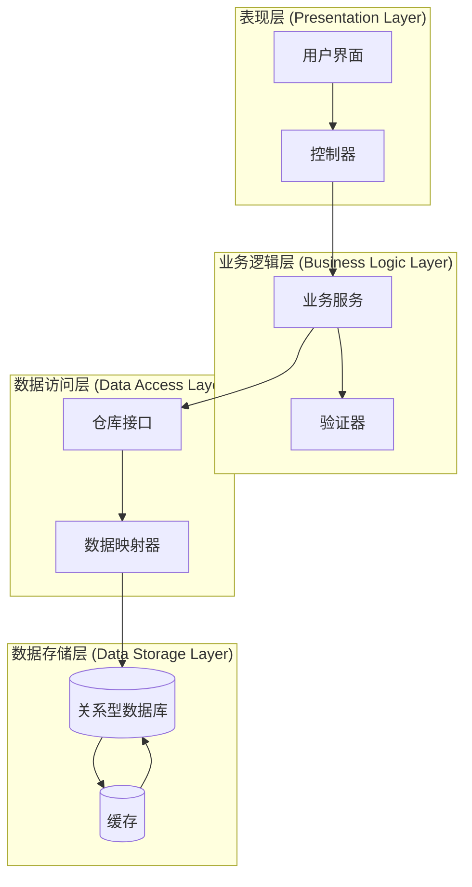
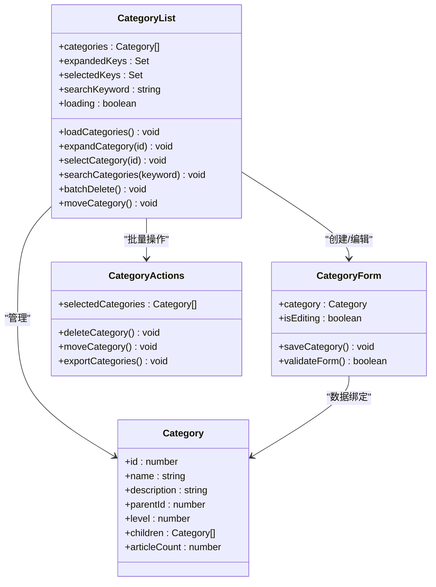
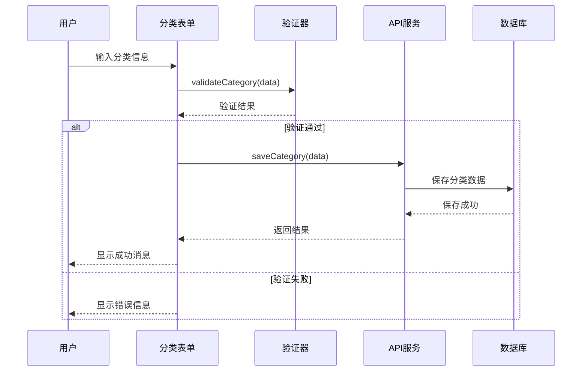
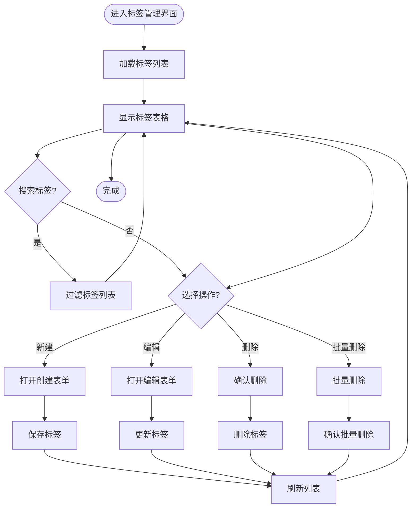
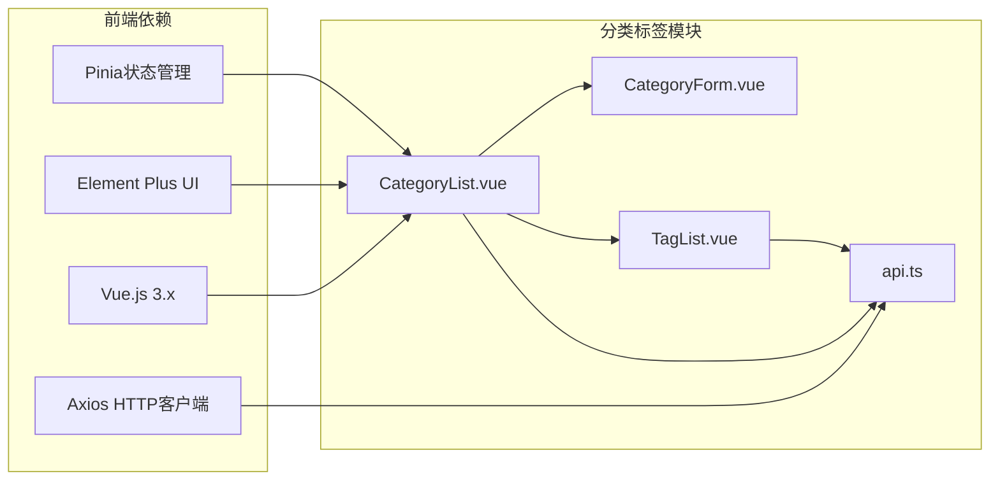
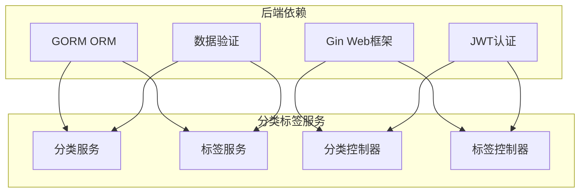

# 分类标签管理模块

<cite>
**本文档引用的文件**
- [categories_v1.go](file://api/v1/categories_v1.go)
- [tag_v1.go](file://api\v1\tag_v1.go)
- [Categories.go](file://model/Categories.go)
- [Tag.go](file://model/Tag.go)
- [CategoryList.vue](file://web/backend/src/views/category/CategoryList.vue)
- [CategoryForm.vue](file://web/backend/src/components/category/CategoryForm.vue)
- [CategoryActions.vue](file://web/backend/src/components/category/CategoryActions.vue)
- [TagList.vue](file://web/backend/src/views/tag/TagList.vue)
- [api.ts](file://web/backend/src/services/api.ts)
- [request.ts](file://web/backend/src/utils/request.ts)
</cite>

## 目录
1. [简介](#简介)
2. [项目结构](#项目结构)
3. [核心组件](#核心组件)
4. [架构概览](#架构概览)
5. [详细组件分析](#详细组件分析)
6. [依赖关系分析](#依赖关系分析)
7. [性能考虑](#性能考虑)
8. [故障排除指南](#故障排除指南)
9. [结论](#结论)

## 简介

分类标签管理模块是后台管理系统中的核心功能模块，负责管理文章的分类和标签体系。该模块提供了完整的分类和标签生命周期管理，包括创建、编辑、删除、层级管理和批量操作等功能。系统采用前后端分离架构，前端使用Vue.js框架构建用户界面，后端使用Go语言提供RESTful API服务。

该模块的主要目标是为内容管理员提供一个直观、高效的分类标签管理体系，支持复杂的文章组织需求，同时确保数据的一致性和完整性。

## 项目结构

分类标签管理模块在项目中采用清晰的分层架构：

```mermaid
graph TB
subgraph "前端层"
Views[视图组件]
Components[业务组件]
Services[服务层]
Utils[工具库]
end
subgraph "后端层"
API[API控制器]
Model[数据模型]
DB[(数据库)]
end
subgraph "数据流"
Frontend[前端应用]
Backend[后端服务]
Storage[数据存储]
end
Views --> Components
Components --> Services
Services --> API
API --> Model
Model --> DB
DB --> Storage
Frontend <- --> Backend
Backend <- --> Storage
```

**图表来源**
- [CategoryList.vue:1-200](file://web/backend/src/views/category/CategoryList.vue#L1-L200)
- [categories_v1.go:1-300](file://api/v1/categories_v1.go#L1-L300)
- [Categories.go:1-200](file://model/Categories.go#L1-L200)

**章节来源**
- [CategoryList.vue:1-200](file://web/backend/src/views/category/CategoryList.vue#L1-L200)
- [CategoryForm.vue:1-150](file://web/backend/src/components/category/CategoryForm.vue#L1-L150)
- [TagList.vue:1-200](file://web/backend/src/views/tag/TagList.vue#L1-L200)

## 核心组件

### 分类管理组件

分类管理模块包含以下核心组件：

#### 分类列表组件
- **CategoryList.vue**: 主要的分类展示界面，支持树形结构显示、搜索过滤、批量操作
- **CategoryForm.vue**: 分类表单组件，用于创建和编辑分类
- **CategoryActions.vue**: 分类操作组件，提供删除、移动等操作按钮

#### 标签管理组件
- **TagList.vue**: 标签管理界面，支持标签的增删改查操作
- **TagForm.vue**: 标签表单组件（在当前代码库中未找到，但可通过CategoryForm.vue参考实现）

### 数据模型

系统定义了两个核心数据模型：

#### 分类模型 (Categories.go)
- 支持多级嵌套分类
- 包含分类名称、描述、父级分类等字段
- 提供分类层级关系维护功能

#### 标签模型 (Tag.go)
- 独立的标签实体管理
- 支持标签与文章的多对多关系
- 提供标签统计和查询功能

**章节来源**
- [Categories.go:1-200](file://model/Categories.go#L1-L200)
- [Tag.go:1-150](file://model/Tag.go#L1-L150)

## 架构概览

分类标签管理模块采用MVC架构模式，实现了清晰的职责分离：



**图表来源**
- [categories_v1.go:1-300](file://api/v1/categories_v1.go#L1-L300)
- [tag_v1.go:1-200](file://api/v1/tag_v1.go#L1-L200)
- [Categories.go:1-200](file://model/Categories.go#L1-L200)

## 详细组件分析

### 分类管理组件分析

#### 分类列表组件 (CategoryList.vue)

分类列表组件是整个分类管理的核心界面，提供了丰富的功能特性：



**图表来源**
- [CategoryList.vue:1-200](file://web/backend/src/views/category/CategoryList.vue#L1-L200)
- [CategoryForm.vue:1-150](file://web/backend/src/components/category/CategoryForm.vue#L1-L150)
- [CategoryActions.vue:1-120](file://web/backend/src/components/category/CategoryActions.vue#L1-L120)

##### 树形结构展示
分类列表采用递归树形结构展示，支持：
- 动态展开/折叠节点
- 层级缩进显示
- 图标区分不同层级
- 搜索高亮显示匹配项

##### 批量操作功能
- 多选框选择多个分类
- 批量删除确认对话框
- 批量移动到指定分类
- 全选/反选功能

**章节来源**
- [CategoryList.vue:1-200](file://web/backend/src/views/category/CategoryList.vue#L1-L200)
- [CategoryForm.vue:1-150](file://web/backend/src/components/category/CategoryForm.vue#L1-L150)

#### 分类表单组件 (CategoryForm.vue)

分类表单组件提供了完整的分类创建和编辑功能：



**图表来源**
- [CategoryForm.vue:1-150](file://web/backend/src/components/category/CategoryForm.vue#L1-L150)
- [api.ts:1-200](file://web/backend/src/services/api.ts#L1-L200)

##### 表单验证机制
- 实时输入验证
- 重复名称检查
- 父子分类层级限制
- 必填字段验证

**章节来源**
- [CategoryForm.vue:1-150](file://web/backend/src/components/category/CategoryForm.vue#L1-L150)

### 标签管理组件分析

#### 标签列表组件 (TagList.vue)

标签管理界面提供了标签的全生命周期管理：



**图表来源**
- [TagList.vue:1-200](file://web/backend/src/views/tag/TagList.vue#L1-L200)

##### 标签统计功能
- 标签使用次数统计
- 标签活跃度分析
- 标签分布可视化

**章节来源**
- [TagList.vue:1-200](file://web/backend/src/views/tag/TagList.vue#L1-L200)

### API接口设计

#### 分类管理API

分类管理API提供了完整的RESTful接口：

| 接口 | 方法 | 描述 | 请求参数 | 响应数据 |
|------|------|------|----------|----------|
| `/api/categories` | GET | 获取分类列表 | page, limit, keyword | 分类数组 |
| `/api/categories/tree` | GET | 获取分类树形结构 | - | 树形结构数据 |
| `/api/categories` | POST | 创建分类 | 分类对象 | 新分类ID |
| `/api/categories/{id}` | PUT | 更新分类 | 分类ID, 分类对象 | 更新状态 |
| `/api/categories/{id}` | DELETE | 删除分类 | 分类ID | 删除状态 |
| `/api/categories/batch` | POST | 批量操作 | 操作类型, 分类ID数组 | 批量操作结果 |

#### 标签管理API

标签管理API接口设计类似：

| 接口 | 方法 | 描述 | 请求参数 | 响应数据 |
|------|------|------|----------|----------|
| `/api/tags` | GET | 获取标签列表 | page, limit, keyword | 标签数组 |
| `/api/tags` | POST | 创建标签 | 标签对象 | 新标签ID |
| `/api/tags/{id}` | PUT | 更新标签 | 标签ID, 标签对象 | 更新状态 |
| `/api/tags/{id}` | DELETE | 删除标签 | 标签ID | 删除状态 |
| `/api/tags/stats` | GET | 获取标签统计 | - | 统计信息 |

**章节来源**
- [categories_v1.go:1-300](file://api/v1/categories_v1.go#L1-L300)
- [tag_v1.go:1-200](file://api/v1/tag_v1.go#L1-L200)

## 依赖关系分析

### 前端依赖关系



**图表来源**
- [CategoryList.vue:1-200](file://web/backend/src/views/category/CategoryList.vue#L1-L200)
- [api.ts:1-200](file://web/backend/src/services/api.ts#L1-L200)

### 后端依赖关系



**图表来源**
- [categories_v1.go:1-300](file://api/v1/categories_v1.go#L1-L300)
- [Categories.go:1-200](file://model/Categories.go#L1-L200)

**章节来源**
- [api.ts:1-200](file://web/backend/src/services/api.ts#L1-L200)
- [request.ts:1-150](file://web/backend/src/utils/request.ts#L1-L150)

## 性能考虑

### 前端性能优化

1. **虚拟滚动**: 对于大量分类和标签数据，使用虚拟滚动技术提升渲染性能
2. **懒加载**: 分类树形结构采用懒加载方式，只加载可见节点
3. **缓存策略**: 使用浏览器缓存减少重复请求
4. **防抖处理**: 搜索功能实现防抖，避免频繁请求

### 后端性能优化

1. **数据库索引**: 在分类名称、标签名称上建立索引
2. **分页查询**: 默认分页大小控制在合理范围内
3. **批量操作**: 支持批量删除和批量更新操作
4. **缓存机制**: 使用Redis缓存热点数据

### 数据一致性保证

1. **事务处理**: 关键操作使用数据库事务确保原子性
2. **并发控制**: 使用乐观锁防止并发修改冲突
3. **数据校验**: 前后端双重数据验证
4. **审计日志**: 记录所有重要操作的日志

## 故障排除指南

### 常见问题及解决方案

#### 分类树形结构显示异常
**问题描述**: 分类树形结构无法正确显示或显示错乱
**可能原因**:
- 父子关系数据不完整
- 分类层级过深导致性能问题
- 数据库连接异常

**解决步骤**:
1. 检查分类数据的父子关系是否正确
2. 验证数据库中是否存在循环引用
3. 查看浏览器控制台是否有JavaScript错误
4. 检查网络请求是否成功返回数据

#### 批量操作失败
**问题描述**: 批量删除或批量移动操作失败
**可能原因**:
- 选中的分类数量过多
- 某些分类存在子分类无法直接删除
- 权限不足

**解决步骤**:
1. 减少每次批量操作的数量
2. 检查目标分类是否为被移动分类的子分类
3. 验证当前用户权限
4. 查看错误响应的具体原因

#### 搜索功能无结果
**问题描述**: 搜索分类或标签没有返回预期结果
**可能原因**:
- 搜索关键词拼写错误
- 数据库中不存在匹配的数据
- 搜索算法需要优化

**解决步骤**:
1. 检查搜索关键词的拼写
2. 尝试使用更模糊的搜索条件
3. 清除浏览器缓存后重试
4. 检查数据库中数据的完整性

**章节来源**
- [CategoryList.vue:1-200](file://web/backend/src/views/category/CategoryList.vue#L1-L200)
- [TagList.vue:1-200](file://web/backend/src/views/tag/TagList.vue#L1-L200)

## 结论

分类标签管理模块是一个功能完善、架构清晰的内容管理基础设施。通过前后端分离的设计，该模块提供了良好的用户体验和强大的功能特性。

### 主要优势

1. **完整的功能覆盖**: 支持分类和标签的全生命周期管理
2. **直观的用户界面**: 树形结构展示和批量操作提升管理效率
3. **灵活的搜索过滤**: 多维度的搜索和筛选功能
4. **强大的扩展性**: 模块化设计便于功能扩展和维护

### 技术特点

1. **现代化技术栈**: 前端使用Vue.js 3.x，后端使用Go语言
2. **RESTful API设计**: 标准化的接口规范
3. **数据一致性保证**: 完善的验证和错误处理机制
4. **性能优化**: 虚拟滚动、懒加载等优化技术

### 发展建议

1. **增强搜索功能**: 可以考虑添加高级搜索和智能推荐功能
2. **改进用户体验**: 添加拖拽排序、快捷键操作等功能
3. **扩展统计分析**: 提供更详细的分类标签使用统计和分析报告
4. **移动端适配**: 优化移动端的显示和操作体验

该模块为内容管理员提供了一个强大而易用的分类标签管理体系，能够有效支撑复杂的博客和内容管理需求。