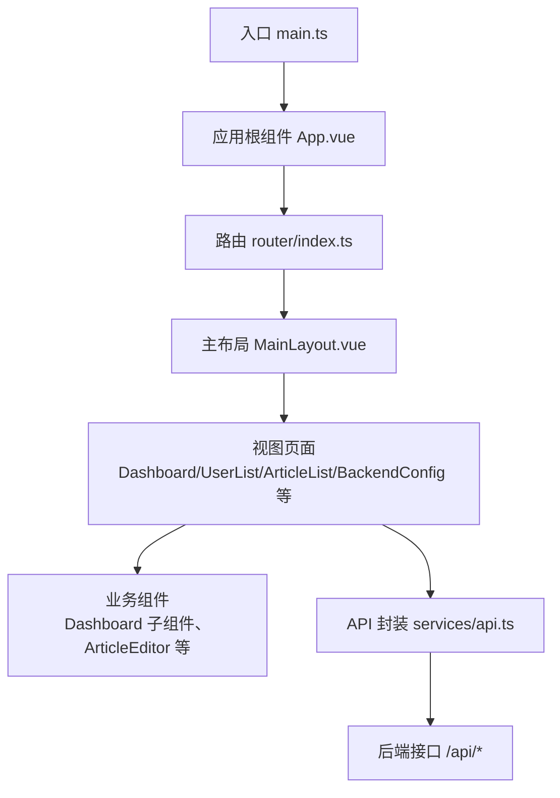
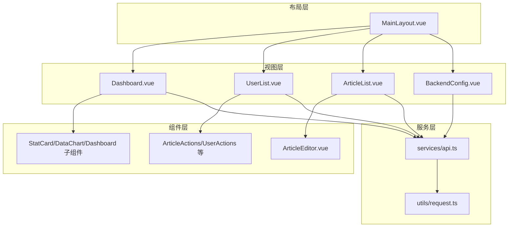
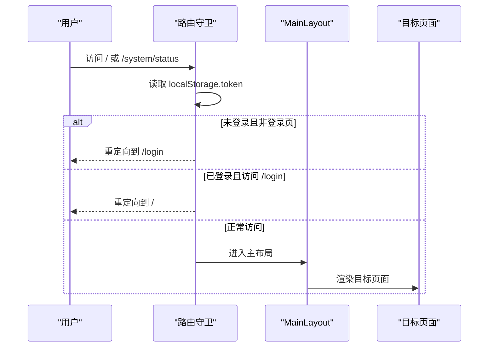
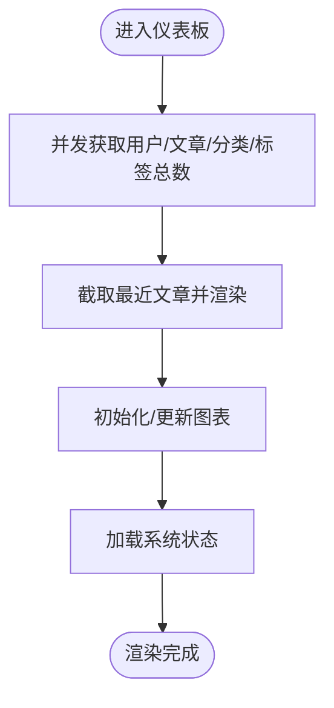
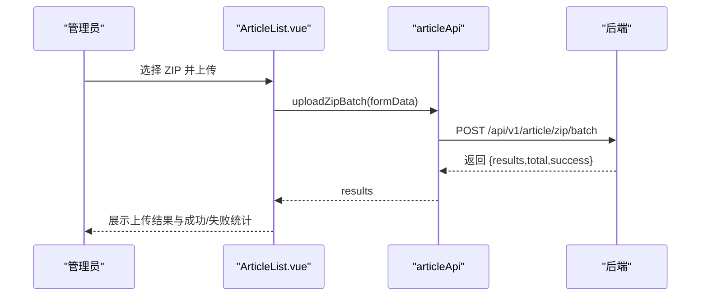
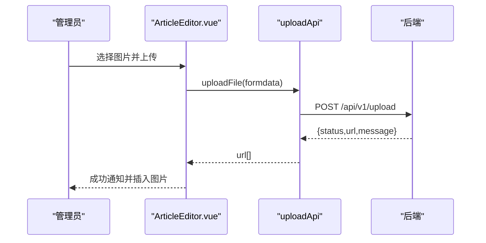
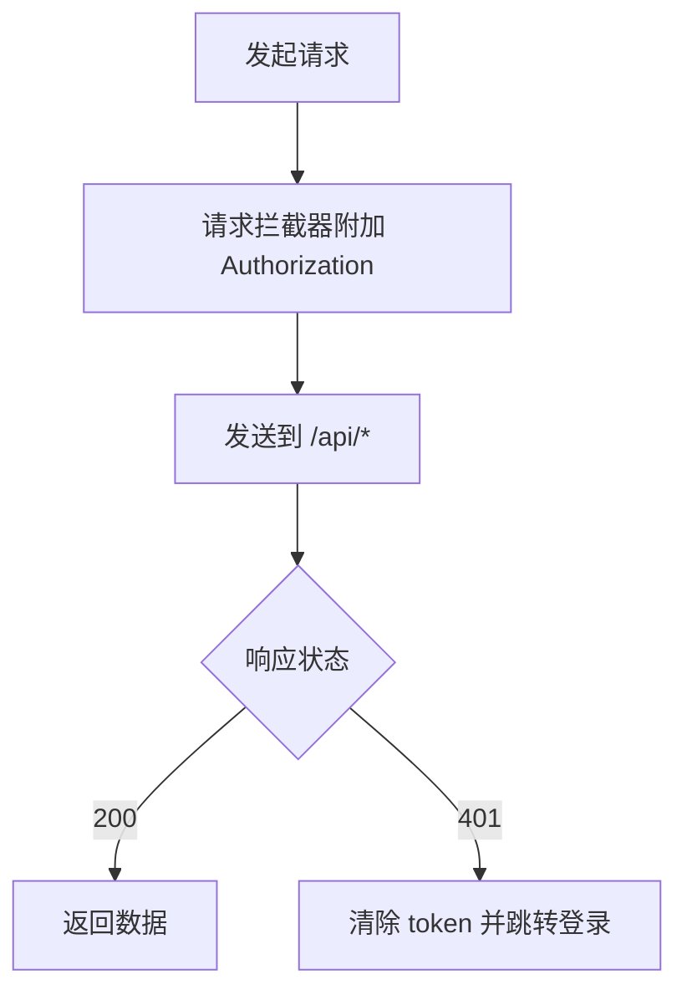
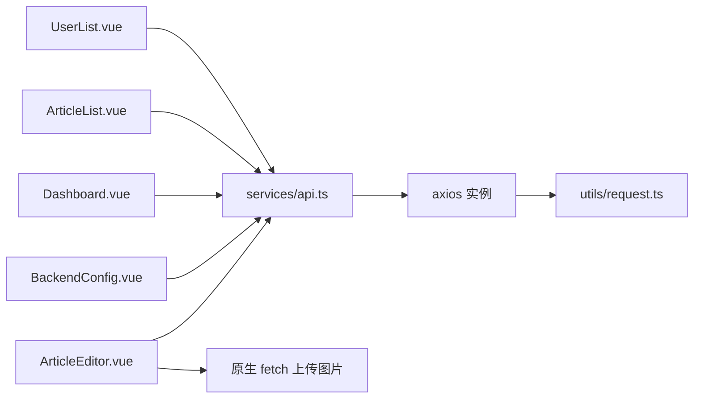

# 后台管理系统

<cite>
**本文档引用的文件**
- [web/backend/src/main.ts](file://web/backend/src/main.ts)
- [web/backend/src/App.vue](file://web/backend/src/App.vue)
- [web/backend/src/router/index.ts](file://web/backend/src/router/index.ts)
- [web/backend/src/layouts/MainLayout.vue](file://web/backend/src/layouts/MainLayout.vue)
- [web/backend/src/services/api.ts](file://web/backend/src/services/api.ts)
- [web/backend/src/views/dashboard/Dashboard.vue](file://web/backend/src/views/dashboard/Dashboard.vue)
- [web/backend/src/components/dashboard/Dashboard.vue](file://web/backend/src/components/dashboard/Dashboard.vue)
- [web/backend/src/views/article/ArticleList.vue](file://web/backend/src/views/article/ArticleList.vue)
- [web/backend/src/views/user/UserList.vue](file://web/backend/src/views/user/UserList.vue)
- [web/backend/src/views/system/BackendConfig.vue](file://web/backend/src/views/system/BackendConfig.vue)
- [web/backend/src/components/article/ArticleEditor.vue](file://web/backend/src/components/article/ArticleEditor.vue)
- [web/backend/src/utils/request.ts](file://web/backend/src/utils/request.ts)
- [web/backend/src/types/index.ts](file://web/backend/src/types/index.ts)
- [web/backend/package.json](file://web/backend/package.json)
</cite>

## 目录
1. [引言](#引言)
2. [项目结构](#项目结构)
3. [核心组件](#核心组件)
4. [架构总览](#架构总览)
5. [详细组件分析](#详细组件分析)
6. [依赖关系分析](#依赖关系分析)
7. [性能考量](#性能考量)
8. [故障排查指南](#故障排查指南)
9. [结论](#结论)
10. [附录](#附录)

## 引言
本文件面向管理员与开发者，系统性梳理 YanBlog 后台管理系统的前端架构与实现细节。系统采用 Vue 3 + TypeScript 技术栈，结合 Element Plus 组件库与 md-editor-v3 富文本编辑器，提供仪表板、文章管理、用户管理、系统配置、媒体库等核心功能模块，并通过统一的 API 封装层与路由守卫实现认证与导航控制。

## 项目结构
后台前端位于 web/backend 子目录，采用按功能域划分的组织方式：
- 入口与应用根组件：main.ts、App.vue
- 路由与布局：router/index.ts、layouts/MainLayout.vue
- 视图页面：views 下按模块划分（dashboard、article、user、system 等）
- 组件：components 下按模块划分（dashboard、article、user 等）
- 服务与类型：services/api.ts、utils/request.ts、types/index.ts
- 依赖：package.json

**图表来源**
- [web/backend/src/main.ts:1-23](file://web/backend/src/main.ts#L1-L23)
- [web/backend/src/App.vue:1-11](file://web/backend/src/App.vue#L1-L11)
- [web/backend/src/router/index.ts:1-190](file://web/backend/src/router/index.ts#L1-L190)
- [web/backend/src/layouts/MainLayout.vue:1-245](file://web/backend/src/layouts/MainLayout.vue#L1-L245)
- [web/backend/src/services/api.ts:1-255](file://web/backend/src/services/api.ts#L1-L255)

**章节来源**
- [web/backend/src/main.ts:1-23](file://web/backend/src/main.ts#L1-L23)
- [web/backend/src/App.vue:1-11](file://web/backend/src/App.vue#L1-L11)
- [web/backend/src/router/index.ts:1-190](file://web/backend/src/router/index.ts#L1-L190)
- [web/backend/src/layouts/MainLayout.vue:1-245](file://web/backend/src/layouts/MainLayout.vue#L1-L245)
- [web/backend/src/services/api.ts:1-255](file://web/backend/src/services/api.ts#L1-L255)
- [web/backend/package.json:1-62](file://web/backend/package.json#L1-L62)

## 核心组件
- 应用入口与插件注册：在入口文件中完成 Element Plus、图标、路由的安装与挂载。
- 主布局：提供侧边栏菜单、面包屑、顶部用户下拉与内容区占位。
- 路由与守卫：集中定义页面级路由与全局前置守卫，实现登录态校验与标题设置。
- API 封装：以模块化方式导出用户、文章、分类、标签、文件、上传、系统配置等接口，统一注入 Authorization 头与 401 处理。
- 类型系统：定义用户、分类、文章、分页等通用类型，提升开发体验与可维护性。

**章节来源**
- [web/backend/src/main.ts:1-23](file://web/backend/src/main.ts#L1-L23)
- [web/backend/src/layouts/MainLayout.vue:1-245](file://web/backend/src/layouts/MainLayout.vue#L1-L245)
- [web/backend/src/router/index.ts:169-188](file://web/backend/src/router/index.ts#L169-L188)
- [web/backend/src/services/api.ts:1-255](file://web/backend/src/services/api.ts#L1-L255)
- [web/backend/src/types/index.ts:1-44](file://web/backend/src/types/index.ts#L1-L44)

## 架构总览
系统采用“布局 + 视图 + 组件 + 服务”的分层架构：
- 布局层：MainLayout 提供统一导航与上下文。
- 视图层：各功能页面负责业务编排与状态管理。
- 组件层：可复用的业务组件（如统计卡片、搜索表单、操作按钮）。
- 服务层：API 封装与请求拦截器，统一处理认证与错误。

**图表来源**
- [web/backend/src/layouts/MainLayout.vue:1-245](file://web/backend/src/layouts/MainLayout.vue#L1-L245)
- [web/backend/src/views/dashboard/Dashboard.vue:1-11](file://web/backend/src/views/dashboard/Dashboard.vue#L1-L11)
- [web/backend/src/components/dashboard/Dashboard.vue:1-378](file://web/backend/src/components/dashboard/Dashboard.vue#L1-L378)
- [web/backend/src/views/user/UserList.vue:1-440](file://web/backend/src/views/user/UserList.vue#L1-L440)
- [web/backend/src/views/article/ArticleList.vue:1-655](file://web/backend/src/views/article/ArticleList.vue#L1-L655)
- [web/backend/src/views/system/BackendConfig.vue:1-267](file://web/backend/src/views/system/BackendConfig.vue#L1-L267)
- [web/backend/src/components/article/ArticleEditor.vue:1-339](file://web/backend/src/components/article/ArticleEditor.vue#L1-L339)
- [web/backend/src/services/api.ts:1-255](file://web/backend/src/services/api.ts#L1-L255)
- [web/backend/src/utils/request.ts:1-51](file://web/backend/src/utils/request.ts#L1-L51)

## 详细组件分析

### 路由与导航
- 路由结构：采用嵌套路由，根路径 '/' 重定向至仪表板；子路由覆盖用户、分类、标签、文章、媒体库、系统设置等。
- 全局守卫：设置页面标题；校验 token，未登录访问非登录页重定向至登录；已登录访问登录页重定向至首页。
- 布局菜单：MainLayout 中的侧边菜单与面包屑根据路由元信息动态生成。

**图表来源**
- [web/backend/src/router/index.ts:169-188](file://web/backend/src/router/index.ts#L169-L188)
- [web/backend/src/layouts/MainLayout.vue:161-170](file://web/backend/src/layouts/MainLayout.vue#L161-L170)

**章节来源**
- [web/backend/src/router/index.ts:22-161](file://web/backend/src/router/index.ts#L22-L161)
- [web/backend/src/router/index.ts:169-188](file://web/backend/src/router/index.ts#L169-L188)
- [web/backend/src/layouts/MainLayout.vue:142-170](file://web/backend/src/layouts/MainLayout.vue#L142-L170)

### 仪表板
- 统计卡片：聚合用户、文章、分类、标签数量。
- 快捷操作：新建文章、ZIP 发布、媒体库、查看前台、系统监控。
- 图表与最近文章：DataChart 组件负责可视化，最近文章列表支持点击跳转编辑。
- 系统概览：定时刷新 CPU、内存、磁盘、Goroutines 等指标，使用颜色标识使用率。

**图表来源**
- [web/backend/src/views/dashboard/Dashboard.vue:1-11](file://web/backend/src/views/dashboard/Dashboard.vue#L1-L11)
- [web/backend/src/components/dashboard/Dashboard.vue:178-224](file://web/backend/src/components/dashboard/Dashboard.vue#L178-L224)

**章节来源**
- [web/backend/src/views/dashboard/Dashboard.vue:1-11](file://web/backend/src/views/dashboard/Dashboard.vue#L1-L11)
- [web/backend/src/components/dashboard/Dashboard.vue:1-378](file://web/backend/src/components/dashboard/Dashboard.vue#L1-L378)

### 文章管理
- 搜索与筛选：支持标题关键词与分类筛选，URL 参数同步。
- 表格列：封面图预览、类型标签、置顶等级、时间戳、标签云。
- 操作列：编辑、删除；支持多选批量删除。
- 分页：支持切换每页条数与当前页。
- ZIP 批量发布：拖拽上传多个 .zip，解析 YAML Front Matter，批量入库并反馈结果。
- Markdown 帮助：提供 ZIP 发布规范与常用 Markdown 语法说明。

**图表来源**
- [web/backend/src/views/article/ArticleList.vue:550-580](file://web/backend/src/views/article/ArticleList.vue#L550-L580)
- [web/backend/src/services/api.ts:191-196](file://web/backend/src/services/api.ts#L191-L196)

**章节来源**
- [web/backend/src/views/article/ArticleList.vue:1-655](file://web/backend/src/views/article/ArticleList.vue#L1-L655)
- [web/backend/src/services/api.ts:149-219](file://web/backend/src/services/api.ts#L149-L219)

### 用户管理
- 搜索与筛选：用户名模糊匹配与角色过滤。
- 表格列：角色标签化显示。
- 操作列：编辑、删除；对超级管理员进行保护。
- 表单弹窗：新增/编辑用户，提交时区分新增与更新路径。
- 分页：同文章管理一致的分页策略。

**章节来源**
- [web/backend/src/views/user/UserList.vue:1-440](file://web/backend/src/views/user/UserList.vue#L1-L440)

### 系统配置（后端配置）
- 配置分组：服务器、数据库、天气、其他设置。
- 表单控件：下拉、输入、数字输入、密码输入（隐藏回显）。
- 保存逻辑：仅在用户输入新密码时携带密码字段，避免覆盖；提示需重启服务生效。

**章节来源**
- [web/backend/src/views/system/BackendConfig.vue:1-267](file://web/backend/src/views/system/BackendConfig.vue#L1-L267)

### 富文本编辑器与媒体管理
- 富文本编辑器：md-editor-v3，支持预览/编辑切换、全屏、工具栏自定义、字数统计、自动保存、手动保存草稿。
- 图片上传：拖拽或选择图片后调用 /api/v1/upload，回调返回 URL 并自动插入编辑器。
- 快速插入：提供标题、粗体、代码、引用、列表、表格、链接、图片等快捷片段。

**图表来源**
- [web/backend/src/components/article/ArticleEditor.vue:171-210](file://web/backend/src/components/article/ArticleEditor.vue#L171-L210)
- [web/backend/src/services/api.ts:222-230](file://web/backend/src/services/api.ts#L222-L230)

**章节来源**
- [web/backend/src/components/article/ArticleEditor.vue:1-339](file://web/backend/src/components/article/ArticleEditor.vue#L1-L339)
- [web/backend/src/services/api.ts:221-230](file://web/backend/src/services/api.ts#L221-L230)

### 权限控制与认证
- 登录态：通过 localStorage 中的 token 判断；路由守卫拦截未登录访问。
- 请求头：API 封装在请求拦截器中自动附加 Authorization: Bearer token。
- 401 处理：响应拦截器检测 401，清除本地 token 并跳转登录页。

**图表来源**
- [web/backend/src/services/api.ts:14-44](file://web/backend/src/services/api.ts#L14-L44)
- [web/backend/src/router/index.ts:169-188](file://web/backend/src/router/index.ts#L169-L188)

**章节来源**
- [web/backend/src/services/api.ts:1-255](file://web/backend/src/services/api.ts#L1-L255)
- [web/backend/src/router/index.ts:169-188](file://web/backend/src/router/index.ts#L169-L188)

### 数据表格、表单验证与批量操作
- 数据表格：Element Plus el-table，支持排序、筛选、分页、空态与加载态。
- 表单验证：页面内通过 ElMessageBox 确认与提示，后端统一返回状态码与消息。
- 批量操作：文章管理支持多选批量删除；媒体库支持批量删除与批量上传（API 已封装）。

**章节来源**
- [web/backend/src/views/article/ArticleList.vue:497-521](file://web/backend/src/views/article/ArticleList.vue#L497-L521)
- [web/backend/src/services/api.ts:111-119](file://web/backend/src/services/api.ts#L111-L119)

### 响应式设计与用户体验
- 布局：MainLayout 固定侧边栏与头部，内容区使用 Element Plus 容器组件，适配不同屏幕尺寸。
- 编辑器：ArticleEditor 在移动端调整间距与字号，保证可用性。
- 交互：统一的消息提示（ElMessage）、通知（ElNotification）、确认对话框（ElMessageBox）提升一致性。

**章节来源**
- [web/backend/src/layouts/MainLayout.vue:179-245](file://web/backend/src/layouts/MainLayout.vue#L179-L245)
- [web/backend/src/components/article/ArticleEditor.vue:324-339](file://web/backend/src/components/article/ArticleEditor.vue#L324-L339)

## 依赖关系分析
- 组件与服务：视图组件通过 services/api.ts 调用后端接口；部分组件（如富文本编辑器）直接使用 fetch 上传图片。
- 类型系统：types/index.ts 定义用户、分类、文章、分页等类型，被多个视图与组件引用。
- 第三方库：Element Plus、md-editor-v3、axios、echarts 等。

**图表来源**
- [web/backend/src/views/user/UserList.vue:1-440](file://web/backend/src/views/user/UserList.vue#L1-L440)
- [web/backend/src/views/article/ArticleList.vue:1-655](file://web/backend/src/views/article/ArticleList.vue#L1-L655)
- [web/backend/src/views/dashboard/Dashboard.vue:1-11](file://web/backend/src/views/dashboard/Dashboard.vue#L1-L11)
- [web/backend/src/views/system/BackendConfig.vue:1-267](file://web/backend/src/views/system/BackendConfig.vue#L1-L267)
- [web/backend/src/components/article/ArticleEditor.vue:1-339](file://web/backend/src/components/article/ArticleEditor.vue#L1-L339)
- [web/backend/src/services/api.ts:1-255](file://web/backend/src/services/api.ts#L1-L255)
- [web/backend/src/utils/request.ts:1-51](file://web/backend/src/utils/request.ts#L1-L51)

**章节来源**
- [web/backend/src/services/api.ts:1-255](file://web/backend/src/services/api.ts#L1-L255)
- [web/backend/src/utils/request.ts:1-51](file://web/backend/src/utils/request.ts#L1-L51)
- [web/backend/src/types/index.ts:1-44](file://web/backend/src/types/index.ts#L1-L44)
- [web/backend/package.json:20-35](file://web/backend/package.json#L20-L35)

## 性能考量
- 并发请求：仪表板统计使用 Promise.all 并发获取多项数据，减少等待时间。
- 前端分页：用户与文章列表在前端进行筛选与分页，降低后端压力；建议在数据量大时迁移至后端分页。
- 图表与窗口事件：仪表板图表在窗口 resize 时进行重绘，避免布局抖动。
- 自动保存：富文本编辑器 3 秒防抖自动保存，兼顾性能与体验。

**章节来源**
- [web/backend/src/components/dashboard/Dashboard.vue:178-209](file://web/backend/src/components/dashboard/Dashboard.vue#L178-L209)
- [web/backend/src/components/article/ArticleEditor.vue:122-147](file://web/backend/src/components/article/ArticleEditor.vue#L122-L147)

## 故障排查指南
- 登录失效：出现 401 时会自动清除 token 并跳转登录页。检查后端 JWT 签发与前端拦截器是否正确附加 Authorization。
- 接口异常：统一在响应拦截器中处理非 200 状态，查看控制台错误与后端返回 message。
- 图片上传失败：确认 /api/v1/upload 可用，检查文件类型与大小限制，以及跨域与鉴权配置。
- ZIP 发布失败：核对 .zip 内部结构与 YAML Front Matter 字段，查看 results 列表中的具体错误。

**章节来源**
- [web/backend/src/services/api.ts:28-44](file://web/backend/src/services/api.ts#L28-L44)
- [web/backend/src/components/article/ArticleEditor.vue:171-210](file://web/backend/src/components/article/ArticleEditor.vue#L171-L210)
- [web/backend/src/views/article/ArticleList.vue:532-580](file://web/backend/src/views/article/ArticleList.vue#L532-L580)

## 结论
YanBlog 后台管理系统以清晰的分层架构与模块化设计实现了完整的管理能力。通过统一的路由守卫与 API 封装，保障了认证与数据交互的一致性；借助 Element Plus 与 md-editor-v3 等生态组件，提升了开发效率与用户体验。建议后续在大数据场景下引入后端分页与缓存策略，并完善权限细化与审计日志。

## 附录
- 开发与构建：使用 Vite 与 TypeScript，脚本涵盖 dev/build/preview/test/lint/format 等。
- 依赖要点：Element Plus、axios、md-editor-v3、echarts、vue、vue-router、pinia 等。

**章节来源**
- [web/backend/package.json:9-18](file://web/backend/package.json#L9-L18)