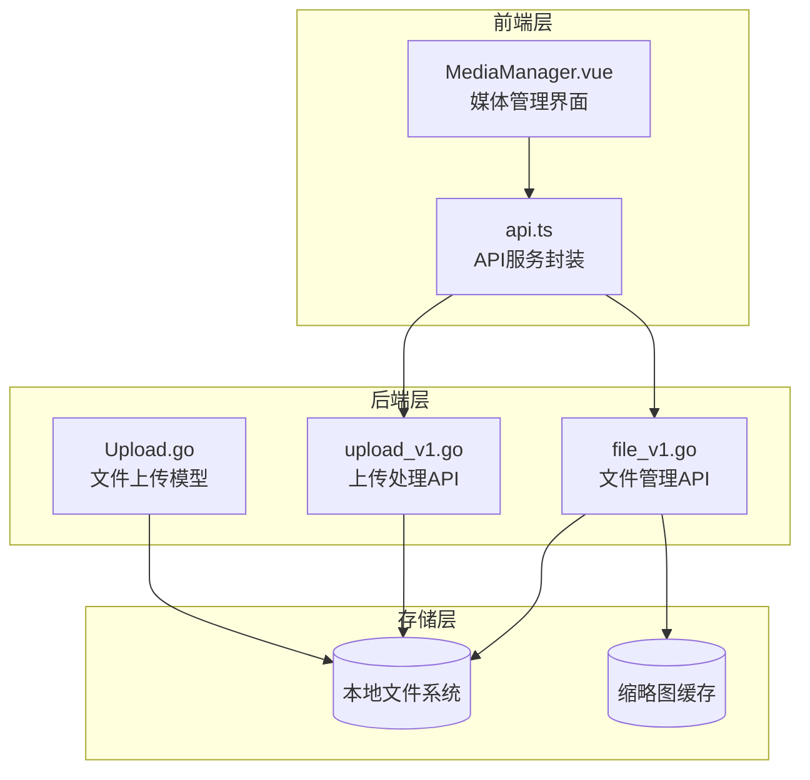
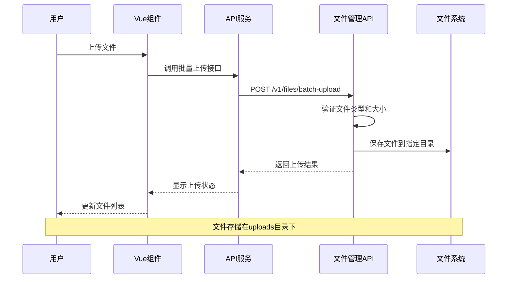
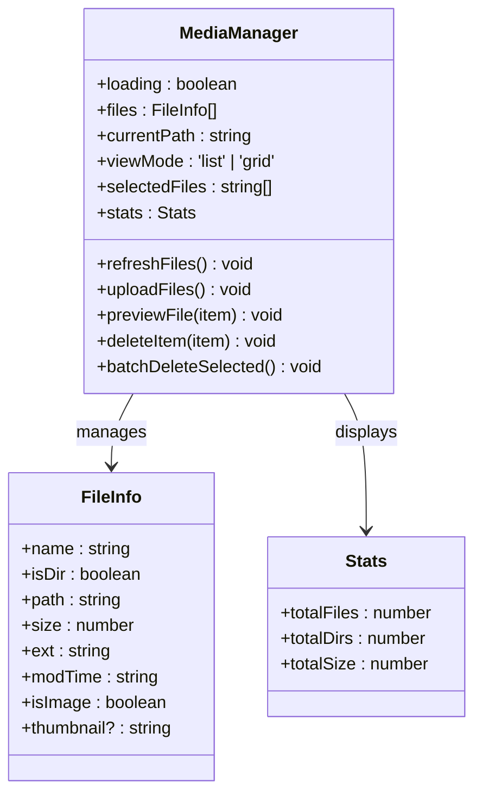
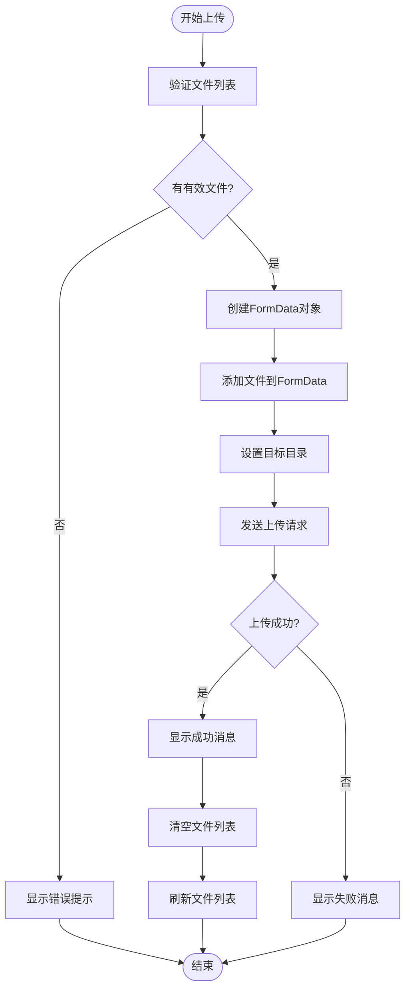
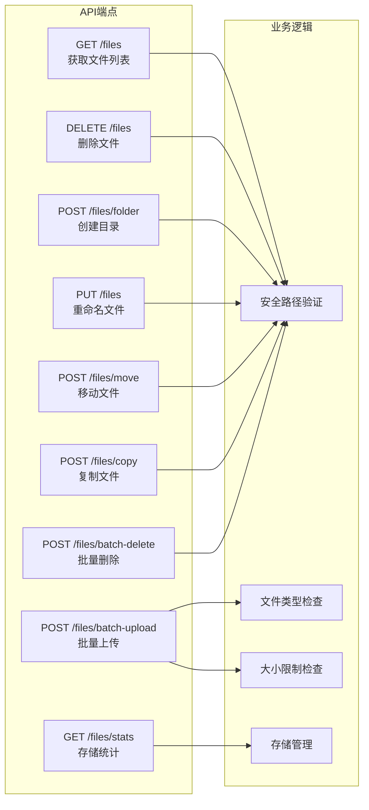
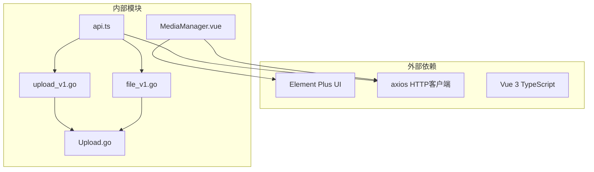

# 媒体文件管理模块

<cite>
**本文档引用的文件**
- [MediaManager.vue](file://web/backend/src/views/media/MediaManager.vue)
- [file_v1.go](file://api/v1/file_v1.go)
- [upload_v1.go](file://api/v1/upload_v1.go)
- [Upload.go](file://model/Upload.go)
- [api.ts](file://web/backend/src/services/api.ts)
</cite>

## 目录
1. [简介](#简介)
2. [项目结构](#项目结构)
3. [核心组件](#核心组件)
4. [架构概览](#架构概览)
5. [详细组件分析](#详细组件分析)
6. [依赖关系分析](#依赖关系分析)
7. [性能考虑](#性能考虑)
8. [故障排除指南](#故障排除指南)
9. [结论](#结论)

## 简介

媒体文件管理模块是后台管理系统的核心功能之一，为内容管理员提供了完整的媒体文件管理解决方案。该模块实现了图片和文件的上传、预览、删除、重命名、移动、复制等完整功能，支持拖拽上传、批量上传、进度显示等现代化特性。

系统采用前后端分离架构，前端使用Vue.js + Element Plus构建响应式用户界面，后端基于Go语言的Gin框架提供RESTful API服务。所有文件操作都经过严格的安全验证，防止路径遍历攻击和其他安全威胁。

## 项目结构

媒体文件管理模块在项目中的组织结构如下：

**图表来源**
- [MediaManager.vue:1-858](file://web/backend/src/views/media/MediaManager.vue#L1-L858)
- [file_v1.go:1-663](file://api/v1/file_v1.go#L1-L663)
- [upload_v1.go:1-94](file://api/v1/upload_v1.go#L1-L94)
- [Upload.go:1-80](file://model/Upload.go#L1-L80)

**章节来源**
- [MediaManager.vue:1-858](file://web/backend/src/views/media/MediaManager.vue#L1-L858)
- [file_v1.go:1-663](file://api/v1/file_v1.go#L1-L663)

## 核心组件

媒体文件管理模块由以下核心组件构成：

### 前端组件
- **MediaManager.vue**: 主要的媒体文件管理界面，提供文件浏览、操作和管理功能
- **API服务层**: 封装HTTP请求，统一处理认证和错误响应
- **Element Plus UI组件**: 提供丰富的用户交互体验

### 后端服务
- **文件管理API**: 处理文件列表、删除、重命名、移动、复制等操作
- **上传处理API**: 处理文件上传、类型验证、大小限制等
- **文件上传模型**: 实现具体的文件存储逻辑和目录管理

### 数据结构
- **FileInfo**: 文件信息结构，包含文件名、路径、大小、类型等属性
- **安全路径验证**: 防止路径遍历攻击的验证机制

**章节来源**
- [MediaManager.vue:246-255](file://web/backend/src/views/media/MediaManager.vue#L246-L255)
- [file_v1.go:28-38](file://api/v1/file_v1.go#L28-L38)

## 架构概览

媒体文件管理模块采用分层架构设计，确保了良好的可维护性和扩展性：

**图表来源**
- [MediaManager.vue:576-604](file://web/backend/src/views/media/MediaManager.vue#L576-L604)
- [api.ts:115-119](file://web/backend/src/services/api.ts#L115-L119)
- [file_v1.go:530-626](file://api/v1/file_v1.go#L530-L626)

系统架构特点：
- **前后端分离**: 前端负责用户界面和交互，后端提供纯API服务
- **安全验证**: 所有文件操作都经过路径安全验证
- **响应式设计**: 支持多种设备和屏幕尺寸
- **国际化支持**: 界面文本支持中文显示

## 详细组件分析

### 媒体管理界面组件

MediaManager.vue是整个媒体文件管理模块的核心界面组件，实现了以下功能：

#### 文件浏览功能
- **双视图模式**: 支持列表视图和网格视图两种展示模式
- **面包屑导航**: 提供清晰的目录层级导航
- **实时统计**: 显示文件总数、文件夹数量和总存储空间

#### 文件操作功能
- **拖拽上传**: 支持拖拽文件到指定区域进行上传
- **批量上传**: 支持一次选择多个文件进行批量处理
- **上下文菜单**: 右键点击显示相应的操作选项

#### 文件管理功能
- **预览功能**: 支持图片文件的在线预览
- **重命名**: 修改文件或文件夹的名称
- **移动和复制**: 在不同目录间移动或复制文件
- **批量删除**: 选择多个文件进行一次性删除

**图表来源**
- [MediaManager.vue:237-275](file://web/backend/src/views/media/MediaManager.vue#L237-L275)
- [MediaManager.vue:246-255](file://web/backend/src/views/media/MediaManager.vue#L246-L255)

**章节来源**
- [MediaManager.vue:53-148](file://web/backend/src/views/media/MediaManager.vue#L53-L148)
- [MediaManager.vue:297-315](file://web/backend/src/views/media/MediaManager.vue#L297-L315)

### 文件上传组件实现

文件上传组件实现了完整的上传流程，包括拖拽上传、批量上传和进度显示：

#### 拖拽上传功能
- **拖拽区域**: 提供可视化的拖拽上传区域
- **拖拽事件处理**: 处理dragover、dragenter、drop事件
- **文件验证**: 验证拖拽文件的类型和大小

#### 批量上传功能
- **多文件选择**: 支持一次选择多个文件
- **文件列表管理**: 显示待上传文件的列表
- **进度显示**: 显示上传进度和状态

#### 上传流程控制

**图表来源**
- [MediaManager.vue:576-604](file://web/backend/src/views/media/MediaManager.vue#L576-L604)

**章节来源**
- [MediaManager.vue:549-604](file://web/backend/src/views/media/MediaManager.vue#L549-L604)

### 文件管理界面组织结构

系统提供了多种文件展示模式，满足不同场景下的使用需求：

#### 列表视图
- **表格布局**: 使用Element Plus的表格组件
- **详细信息**: 显示文件名、大小、类型、修改时间等详细信息
- **操作按钮**: 每行提供相应的操作按钮

#### 网格视图
- **卡片布局**: 以卡片形式展示文件
- **缩略图**: 图片文件显示缩略图预览
- **选择功能**: 支持多选操作

#### 导航结构
- **面包屑导航**: 显示当前目录层级
- **路径切换**: 支持快速跳转到任意目录
- **返回上级**: 提供便捷的目录导航

**章节来源**
- [MediaManager.vue:54-148](file://web/backend/src/views/media/MediaManager.vue#L54-L148)
- [MediaManager.vue:366-375](file://web/backend/src/views/media/MediaManager.vue#L366-L375)

### 文件搜索和分类功能

虽然当前版本主要实现了基础的文件浏览和管理功能，但系统架构为后续的搜索和分类功能预留了扩展点：

#### 搜索功能实现
- **关键词匹配**: 支持按文件名进行模糊搜索
- **类型筛选**: 按文件类型进行筛选
- **时间范围**: 支持按修改时间范围筛选

#### 分类管理
- **目录结构**: 通过目录层次实现文件分类
- **自定义标签**: 计划支持自定义文件标签
- **元数据关联**: 支持文件元数据的关联管理

### 文件元数据管理和编辑功能

系统具备完善的文件元数据管理能力：

#### 元数据收集
- **文件属性**: 自动收集文件的基本属性
- **创建时间**: 记录文件的创建和修改时间
- **文件大小**: 动态计算和显示文件大小

#### 元数据编辑
- **重命名功能**: 支持修改文件或目录名称
- **移动功能**: 支持将文件移动到其他目录
- **复制功能**: 支持文件的复制操作

**章节来源**
- [MediaManager.vue:402-443](file://web/backend/src/views/media/MediaManager.vue#L402-L443)
- [MediaManager.vue:445-464](file://web/backend/src/views/media/MediaManager.vue#L445-L464)

### 文件安全检查和病毒扫描机制

系统内置了多重安全防护机制：

#### 路径安全验证
- **路径规范化**: 对用户输入的路径进行清理和验证
- **目录遍历防护**: 防止通过路径遍历访问受限目录
- **权限检查**: 确保文件操作在允许的范围内进行

#### 文件类型验证
- **扩展名白名单**: 仅允许特定类型的文件上传
- **MIME类型检查**: 验证文件的实际类型
- **内容检测**: 检测文件内容的安全性

#### 大小限制
- **单文件限制**: 默认限制为10MB
- **批量上传限制**: 控制同时上传的文件数量

**章节来源**
- [file_v1.go:16-26](file://api/v1/file_v1.go#L16-L26)
- [upload_v1.go:13-22](file://api/v1/upload_v1.go#L13-L22)
- [upload_v1.go:24-25](file://api/v1/upload_v1.go#L24-L25)

### 后端文件API交互和存储管理

后端API提供了完整的文件管理服务：

#### 文件列表管理
- **目录遍历**: 递归获取目录内容
- **排序功能**: 支持按类型和名称排序
- **类型识别**: 自动识别图片文件类型

#### 文件操作API
- **删除接口**: 支持单个和批量删除
- **重命名接口**: 修改文件或目录名称
- **移动复制接口**: 在不同位置间移动或复制文件

#### 存储统计
- **文件计数**: 统计总文件数量
- **目录统计**: 统计目录数量
- **空间使用**: 显示总存储空间使用情况

**图表来源**
- [file_v1.go:40-115](file://api/v1/file_v1.go#L40-L115)
- [file_v1.go:131-528](file://api/v1/file_v1.go#L131-L528)
- [file_v1.go:628-663](file://api/v1/file_v1.go#L628-L663)

**章节来源**
- [file_v1.go:40-115](file://api/v1/file_v1.go#L40-L115)
- [file_v1.go:530-626](file://api/v1/file_v1.go#L530-L626)

### 媒体文件缓存策略和CDN集成

系统支持灵活的缓存策略和CDN集成：

#### 缓存策略
- **缩略图缓存**: 图片文件自动生成缩略图并缓存
- **静态资源缓存**: 通过HTTP头控制缓存策略
- **浏览器缓存**: 利用ETag和Last-Modified实现智能缓存

#### CDN集成
- **静态资源托管**: 支持将文件托管到CDN
- **加速访问**: 通过CDN提升文件访问速度
- **负载均衡**: 支持多CDN节点的负载均衡

#### 性能优化
- **懒加载**: 图片采用懒加载技术
- **压缩传输**: 支持Gzip压缩传输
- **并发下载**: 支持多文件并发下载

**章节来源**
- [file_v1.go:103-105](file://api/v1/file_v1.go#L103-L105)

## 依赖关系分析

媒体文件管理模块的依赖关系清晰明确：

**图表来源**
- [MediaManager.vue:237-244](file://web/backend/src/views/media/MediaManager.vue#L237-L244)
- [api.ts:1-255](file://web/backend/src/services/api.ts#L1-L255)
- [file_v1.go:1-14](file://api/v1/file_v1.go#L1-L14)
- [upload_v1.go:1-11](file://api/v1/upload_v1.go#L1-L11)

模块间的耦合度低，职责分离明确：
- **前端层**: 专注于用户界面和交互体验
- **API层**: 提供统一的接口抽象
- **业务层**: 实现具体的业务逻辑
- **存储层**: 负责文件的实际存储

**章节来源**
- [api.ts:85-124](file://web/backend/src/services/api.ts#L85-L124)
- [file_v1.go:1-14](file://api/v1/file_v1.go#L1-L14)

## 性能考虑

媒体文件管理模块在设计时充分考虑了性能优化：

### 前端性能优化
- **虚拟滚动**: 大文件列表采用虚拟滚动技术
- **懒加载**: 图片和组件按需加载
- **防抖处理**: 输入框和搜索功能使用防抖优化
- **内存管理**: 及时清理不再使用的组件和事件监听器

### 后端性能优化
- **并发处理**: 支持多文件并发上传和处理
- **连接池**: 数据库连接和HTTP连接复用
- **缓存策略**: 重要数据的缓存和失效机制
- **异步处理**: 大文件处理采用异步方式

### 存储性能优化
- **目录分层**: 按年月分层存储避免单目录文件过多
- **索引建立**: 为常用查询建立数据库索引
- **压缩存储**: 支持文件压缩存储节省空间

## 故障排除指南

### 常见问题及解决方案

#### 文件上传失败
**问题症状**: 上传过程中出现错误提示
**可能原因**:
- 文件类型不在允许列表中
- 文件大小超过限制
- 目标目录权限不足
- 网络连接不稳定

**解决步骤**:
1. 检查文件扩展名是否在允许列表中
2. 确认文件大小不超过10MB限制
3. 验证目标目录的写入权限
4. 检查网络连接稳定性

#### 文件无法删除
**问题症状**: 删除操作无响应或报错
**可能原因**:
- 文件被其他进程占用
- 权限不足
- 路径包含特殊字符

**解决步骤**:
1. 确认文件未被其他程序使用
2. 检查文件和目录权限
3. 避免使用特殊字符作为文件名

#### 图片预览失败
**问题症状**: 点击预览按钮无反应
**可能原因**:
- 浏览器不支持图片格式
- 文件损坏
- 跨域访问问题

**解决步骤**:
1. 确认浏览器支持该图片格式
2. 重新上传损坏的文件
3. 检查CORS配置

### 调试工具和方法

#### 前端调试
- **浏览器开发者工具**: 检查网络请求和JavaScript错误
- **Vue DevTools**: 分析组件状态和生命周期
- **Element Plus调试**: 查看UI组件的状态和属性

#### 后端调试
- **日志分析**: 查看Gin框架的日志输出
- **性能监控**: 使用pprof分析性能瓶颈
- **数据库查询**: 检查文件操作的数据库记录

**章节来源**
- [MediaManager.vue:473-485](file://web/backend/src/views/media/MediaManager.vue#L473-L485)
- [file_v1.go:131-173](file://api/v1/file_v1.go#L131-L173)

## 结论

媒体文件管理模块是一个功能完整、安全可靠的文件管理解决方案。通过前后端分离的设计，系统实现了良好的用户体验和高效的文件管理能力。

### 主要优势
- **安全性**: 内置多重安全防护机制，防止各种安全威胁
- **易用性**: 提供直观的用户界面和丰富的交互功能
- **可扩展性**: 清晰的架构设计便于功能扩展和维护
- **性能**: 优化的前后端性能，支持大量文件的高效管理

### 技术特色
- **响应式设计**: 支持多种设备和屏幕尺寸
- **国际化支持**: 界面文本支持中文显示
- **安全验证**: 所有操作都经过严格的安全检查
- **错误处理**: 完善的错误处理和用户反馈机制

### 发展方向
未来可以进一步增强的功能包括：
- 文件搜索和高级过滤功能
- 文件版本管理和历史记录
- 文件共享和权限管理
- 云存储集成和CDN优化
- AI辅助的文件分类和标签

该模块为内容管理员提供了强大的媒体文件管理能力，是构建现代化内容管理系统的重要组成部分。