# 文章管理模块

<cite>
**本文档引用的文件**
- [ArticleList.vue](file://web/backend/src/views/article/ArticleList.vue)
- [ArticleEditor.vue](file://web/backend/src/views/article/ArticleEditor.vue)
- [ArticleSearchForm.vue](file://web/backend/src/components/article/ArticleSearchForm.vue)
- [ArticleActions.vue](file://web/backend/src/components/article/ArticleActions.vue)
- [ArticlePublishForm.vue](file://web/backend/src/components/article/ArticlePublishForm.vue)
- [ArticleEditor.vue](file://web/backend/src/components/article/ArticleEditor.vue)
- [api.ts](file://web/backend/src/services/api.ts)
- [articles_v1.go](file://api/v1/articles_v1.go)
- [Articles.go](file://model/Articles.go)
- [Categories.go](file://model/Categories.go)
- [Tag.go](file://model/Tag.go)
- [index.ts](file://web/backend/src/router/index.ts)
- [response.go](file://utils/response.go)
</cite>

## 目录
1. [简介](#简介)
2. [项目结构](#项目结构)
3. [核心组件](#核心组件)
4. [架构概览](#架构概览)
5. [详细组件分析](#详细组件分析)
6. [依赖关系分析](#依赖关系分析)
7. [性能考虑](#性能考虑)
8. [故障排除指南](#故障排除指南)
9. [结论](#结论)
10. [附录](#附录)

## 简介

文章管理模块是博客后台管理系统的核心功能模块，负责文章的全生命周期管理。该模块提供了完整的文章管理解决方案，包括文章列表展示、搜索筛选、编辑发布、批量操作等功能。系统支持两种文章类型：Markdown文本文章和PDF文档文章，具备强大的富文本编辑能力、Markdown语法支持、实时预览功能。

## 项目结构

文章管理模块采用前后端分离的架构设计，主要分为以下层次：

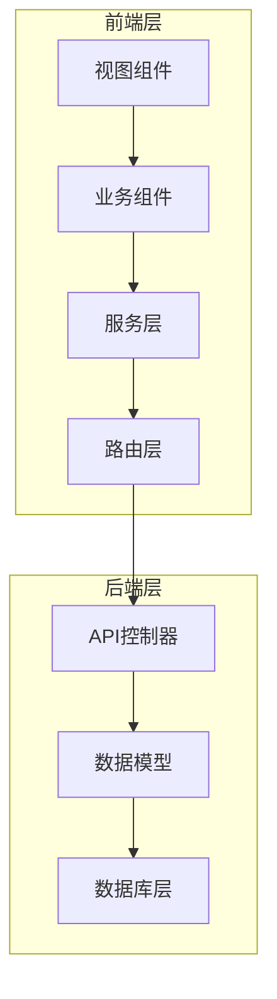

**图表来源**
- [ArticleList.vue:1-655](file://web/backend/src/views/article/ArticleList.vue#L1-L655)
- [ArticleEditor.vue:1-698](file://web/backend/src/views/article/ArticleEditor.vue#L1-L698)
- [api.ts:1-255](file://web/backend/src/services/api.ts#L1-L255)

**章节来源**
- [ArticleList.vue:1-655](file://web/backend/src/views/article/ArticleList.vue#L1-L655)
- [ArticleEditor.vue:1-698](file://web/backend/src/views/article/ArticleEditor.vue#L1-L698)
- [api.ts:1-255](file://web/backend/src/services/api.ts#L1-L255)

## 核心组件

### 文章列表组件 (ArticleList)

文章列表组件是文章管理模块的主要入口，提供完整的文章管理界面：

- **数据展示**：支持文章封面、标题、简介、分类、标签、置顶状态、创建时间等字段的展示
- **搜索筛选**：支持按标题和分类进行搜索筛选
- **分页功能**：支持多种分页大小和页码切换
- **批量操作**：支持批量删除功能
- **ZIP发布**：支持批量ZIP文件发布文章

### 文章编辑器组件 (ArticleEditor)

文章编辑器组件提供强大的内容创作环境：

- **双模式编辑**：支持普通文本编辑和Markdown编辑模式
- **实时预览**：支持编辑模式和预览模式切换
- **全屏编辑**：支持全屏编辑模式
- **自动保存**：支持3秒无操作自动保存草稿
- **图片上传**：支持Markdown图片在线上传和预览

### 发布表单组件 (ArticlePublishForm)

发布表单组件负责文章的元数据管理：

- **分类选择**：支持下拉选择文章分类
- **标签管理**：支持多选标签，支持动态创建
- **置顶设置**：支持置顶等级设置（0-6级）
- **封面上传**：支持封面图片上传和URL输入
- **发布时间**：支持自定义发布时间设置

**章节来源**
- [ArticleList.vue:1-655](file://web/backend/src/views/article/ArticleList.vue#L1-L655)
- [ArticleEditor.vue:1-698](file://web/backend/src/views/article/ArticleEditor.vue#L1-L698)
- [ArticlePublishForm.vue:1-337](file://web/backend/src/components/article/ArticlePublishForm.vue#L1-L337)

## 架构概览

文章管理模块采用MVC架构模式，前后端分离设计：

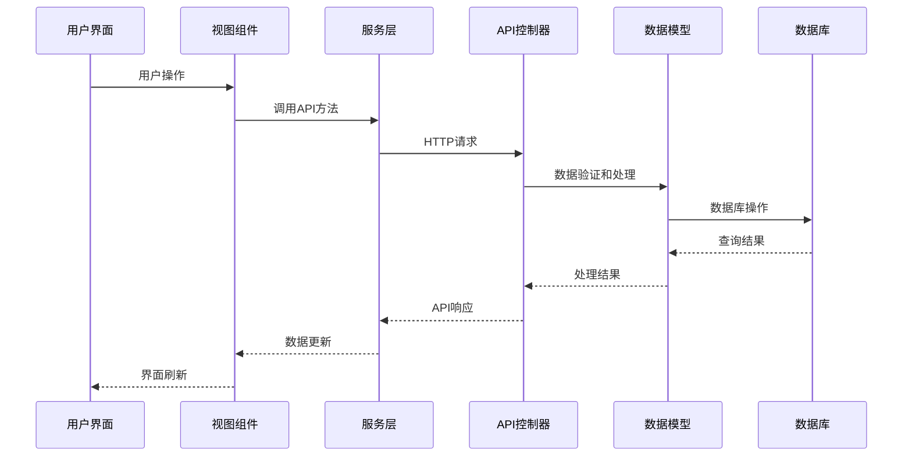

**图表来源**
- [api.ts:150-219](file://web/backend/src/services/api.ts#L150-L219)
- [articles_v1.go:1-273](file://api/v1/articles_v1.go#L1-L273)
- [Articles.go:1-389](file://model/Articles.go#L1-L389)

## 详细组件分析

### 文章列表页面分析

文章列表页面实现了完整的文章管理功能：

#### 数据展示逻辑

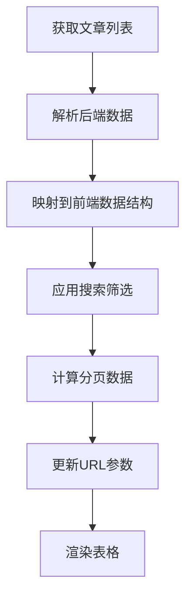

**图表来源**
- [ArticleList.vue:364-398](file://web/backend/src/views/article/ArticleList.vue#L364-L398)
- [ArticleList.vue:240-269](file://web/backend/src/views/article/ArticleList.vue#L240-L269)

#### 搜索和筛选功能

文章列表支持多维度的搜索和筛选：

- **标题搜索**：支持模糊匹配文章标题
- **分类筛选**：支持按分类ID精确筛选
- **URL同步**：搜索参数自动同步到URL
- **分页状态**：支持分页参数的持久化

#### 批量操作功能

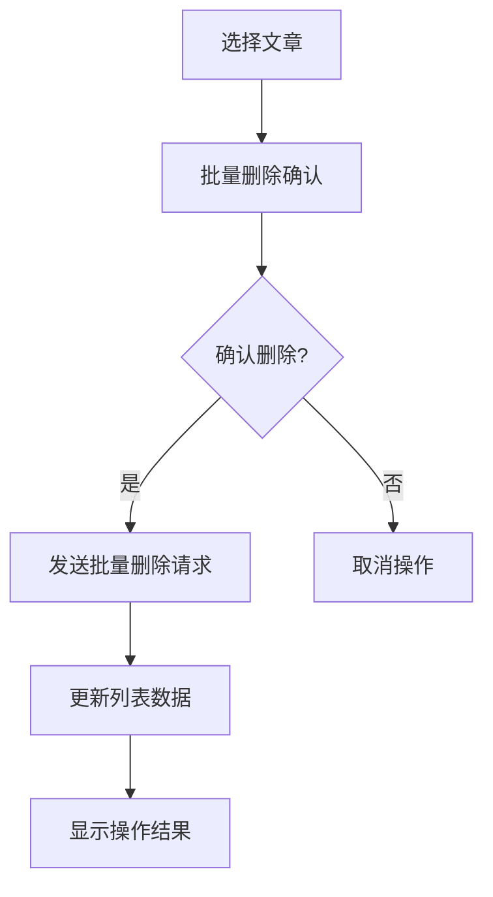

**图表来源**
- [ArticleList.vue:497-521](file://web/backend/src/views/article/ArticleList.vue#L497-L521)

**章节来源**
- [ArticleList.vue:18-182](file://web/backend/src/views/article/ArticleList.vue#L18-L182)
- [ArticleList.vue:234-430](file://web/backend/src/views/article/ArticleList.vue#L234-L430)

### 文章编辑器分析

文章编辑器组件提供了丰富的编辑功能：

#### 编辑模式切换

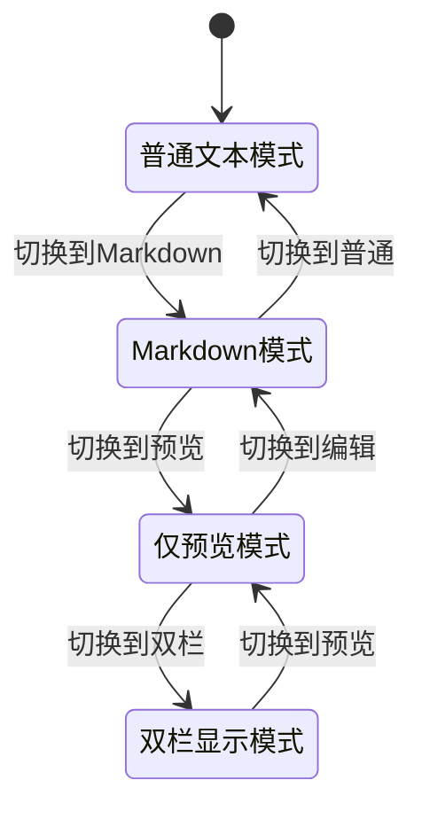

**图表来源**
- [ArticleEditor.vue:374-383](file://web/backend/src/views/article/ArticleEditor.vue#L374-L383)

#### 自动保存机制

文章编辑器实现了智能的自动保存功能：

- **草稿存储**：使用localStorage存储文章草稿
- **定时保存**：3秒无操作自动保存
- **草稿恢复**：支持从localStorage恢复草稿
- **草稿清理**：成功发布后自动清理草稿

#### Markdown编辑功能

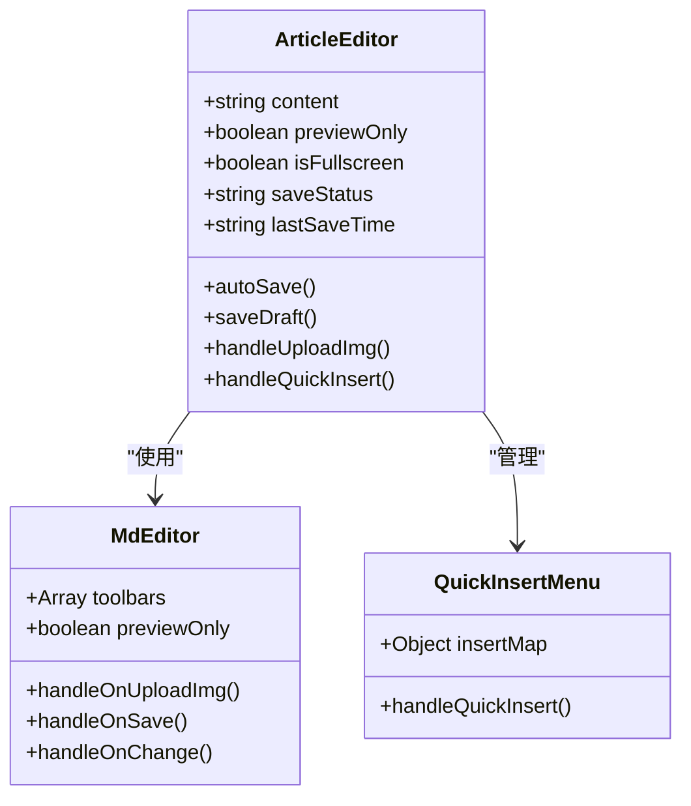

**图表来源**
- [ArticleEditor.vue:57-247](file://web/backend/src/components/article/ArticleEditor.vue#L57-L247)

**章节来源**
- [ArticleEditor.vue:1-339](file://web/backend/src/components/article/ArticleEditor.vue#L1-L339)
- [ArticleEditor.vue:1-698](file://web/backend/src/views/article/ArticleEditor.vue#L1-L698)

### 发布表单分析

发布表单组件负责文章的元数据管理：

#### 表单验证机制

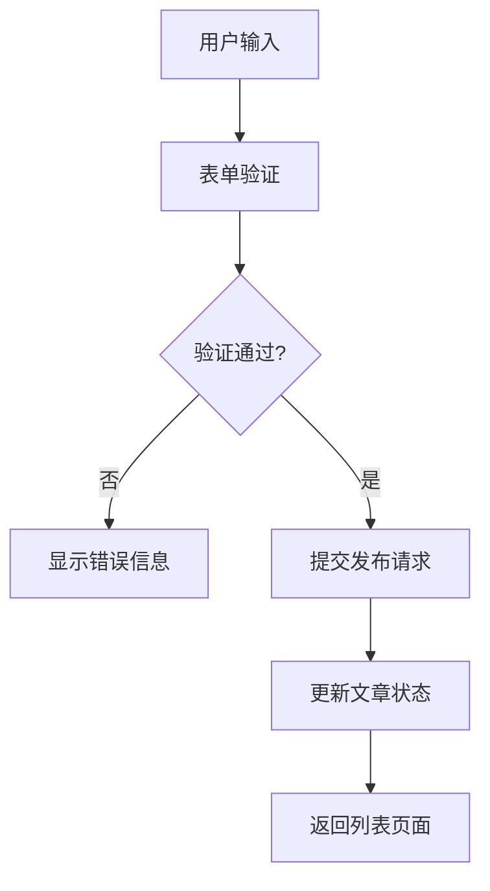

**图表来源**
- [ArticlePublishForm.vue:291-300](file://web/backend/src/components/article/ArticlePublishForm.vue#L291-L300)

#### 标签选择器组件

发布表单集成了强大的标签选择器：

- **多选支持**：支持同时选择多个标签
- **动态创建**：支持用户自定义新标签
- **智能过滤**：支持标签名称的模糊搜索
- **标签计数**：显示每个标签下的文章数量

**章节来源**
- [ArticlePublishForm.vue:1-337](file://web/backend/src/components/article/ArticlePublishForm.vue#L1-L337)

### API服务层分析

API服务层提供了统一的接口调用方式：

#### 文章相关API

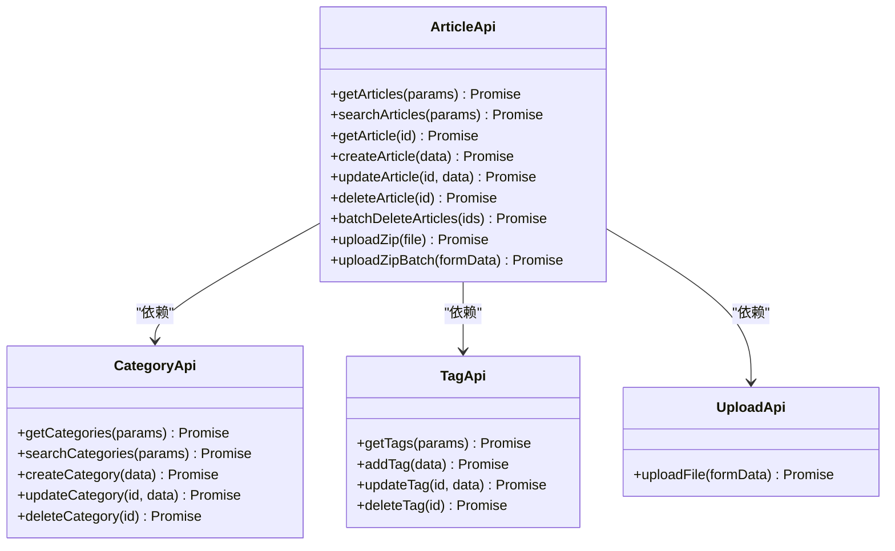

**图表来源**
- [api.ts:149-230](file://web/backend/src/services/api.ts#L149-L230)

**章节来源**
- [api.ts:1-255](file://web/backend/src/services/api.ts#L1-L255)

## 依赖关系分析

文章管理模块的依赖关系清晰明确：

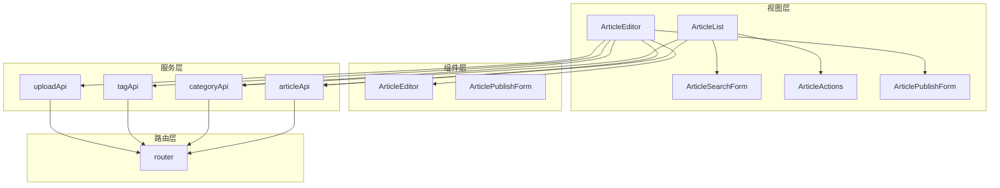

**图表来源**
- [ArticleList.vue:196-198](file://web/backend/src/views/article/ArticleList.vue#L196-L198)
- [ArticleEditor.vue:230-232](file://web/backend/src/views/article/ArticleEditor.vue#L230-L232)
- [index.ts:13-14](file://web/backend/src/router/index.ts#L13-L14)

**章节来源**
- [ArticleList.vue:186-203](file://web/backend/src/views/article/ArticleList.vue#L186-L203)
- [ArticleEditor.vue:229-232](file://web/backend/src/views/article/ArticleEditor.vue#L229-L232)
- [index.ts:1-190](file://web/backend/src/router/index.ts#L1-L190)

## 性能考虑

文章管理模块在设计时充分考虑了性能优化：

### 前端性能优化

- **虚拟滚动**：对于大量文章数据，可考虑实现虚拟滚动提升渲染性能
- **懒加载**：图片资源采用懒加载策略
- **缓存机制**：分类和标签数据采用内存缓存
- **防抖处理**：搜索功能实现防抖，避免频繁请求

### 后端性能优化

- **分页查询**：数据库查询默认使用分页，避免一次性加载大量数据
- **索引优化**：对常用查询字段建立数据库索引
- **预加载关联**：使用GORM预加载关联数据，减少N+1查询问题
- **查询分离**：先查询总数再查询数据，提升查询效率

### 数据库设计优化

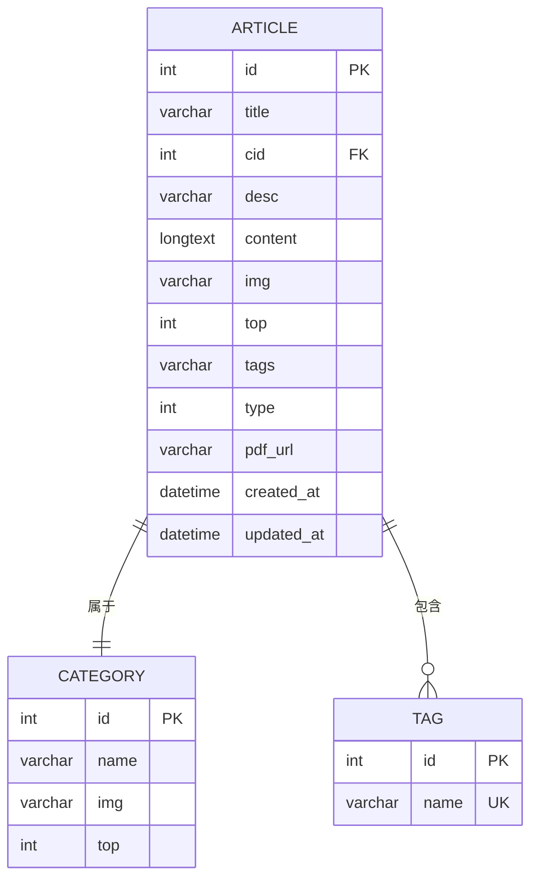

**图表来源**
- [Articles.go:11-25](file://model/Articles.go#L11-L25)
- [Categories.go:10-17](file://model/Categories.go#L10-L17)
- [Tag.go:9-13](file://model/Tag.go#L9-L13)

## 故障排除指南

### 常见问题及解决方案

#### 登录认证问题

**问题现象**：用户登录后页面跳转到登录页
**解决方法**：
1. 检查浏览器localStorage中的token是否正确
2. 确认JWT令牌的有效期
3. 检查后端JWT中间件配置

#### 图片上传失败

**问题现象**：Markdown图片上传失败
**解决方法**：
1. 检查文件大小限制（10MB）
2. 确认文件格式（JPG/PNG）
3. 验证上传接口权限
4. 检查服务器存储空间

#### 文章发布异常

**问题现象**：文章发布后无法正常显示
**解决方法**：
1. 检查文章内容是否符合要求
2. 确认分类和标签的正确性
3. 验证封面图片的可用性
4. 检查数据库连接状态

#### ZIP批量发布问题

**问题现象**：ZIP文件上传后发布失败
**解决方法**：
1. 确认ZIP文件结构正确
2. 检查MD文件的YAML Front Matter格式
3. 验证图片路径的正确性
4. 确认文件大小限制（50MB）

**章节来源**
- [api.ts:34-43](file://web/backend/src/services/api.ts#L34-L43)
- [ArticleEditor.vue:390-418](file://web/backend/src/views/article/ArticleEditor.vue#L390-L418)

## 结论

文章管理模块是一个功能完善、架构清晰的后台管理系统模块。它提供了完整的文章管理解决方案，包括文章的创建、编辑、发布、搜索、筛选、批量操作等功能。模块采用现代化的技术栈，具有良好的用户体验和开发体验。

系统的主要优势包括：
- **功能完整性**：覆盖文章管理的所有核心功能
- **用户体验优秀**：提供直观易用的操作界面
- **技术架构先进**：采用Vue.js + Go + Gin的技术组合
- **扩展性强**：模块化设计便于功能扩展和维护

建议后续可以考虑的功能增强：
- 增加文章版本管理功能
- 实现文章草稿箱功能
- 添加文章统计分析功能
- 优化移动端适配

## 附录

### API接口规范

#### 文章管理API

| 接口 | 方法 | 描述 | 参数 |
|------|------|------|------|
| `/api/v1/article` | GET | 获取文章列表 | pagesize, pagenum, excludeTop |
| `/api/v1/article/search` | GET | 搜索文章 | keyword, cid, pagesize, pagenum |
| `/api/v1/article/info/{id}` | GET | 获取文章详情 | id |
| `/api/v1/article/add` | POST | 创建文章 | 文章数据 |
| `/api/v1/article/{id}` | PUT | 更新文章 | id, 文章数据 |
| `/api/v1/article/{id}` | DELETE | 删除文章 | id |
| `/api/v1/article/batch-delete` | POST | 批量删除文章 | ids[] |

#### 分类管理API

| 接口 | 方法 | 描述 | 参数 |
|------|------|------|------|
| `/api/v1/category` | GET | 获取分类列表 | pagesize, pagenum |
| `/api/v1/category/search` | GET | 搜索分类 | keyword, pagesize, pagenum |
| `/api/v1/category/add` | POST | 创建分类 | name, img, top |
| `/api/v1/category/{id}` | PUT | 更新分类 | id, 分类数据 |
| `/api/v1/category/{id}` | DELETE | 删除分类 | id, force |

#### 标签管理API

| 接口 | 方法 | 描述 | 参数 |
|------|------|------|------|
| `/api/v1/tags` | GET | 获取标签列表 | pagesize, pagenum |
| `/api/v1/tags/add` | POST | 创建标签 | name |
| `/api/v1/tags/{id}` | PUT | 更新标签 | id, name |
| `/api/v1/tags/{id}` | DELETE | 删除标签 | id |

### 数据模型说明

#### 文章模型

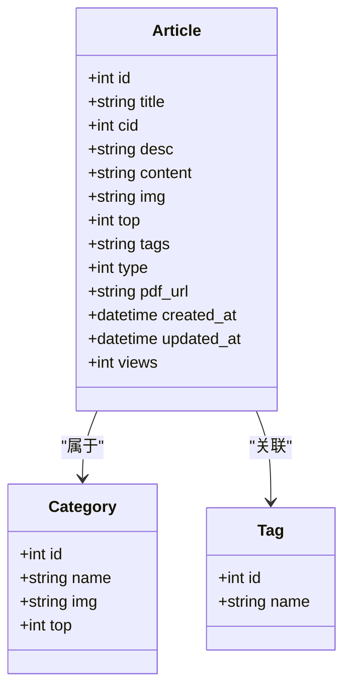

**图表来源**
- [Articles.go:11-25](file://model/Articles.go#L11-L25)

### 开发指南

#### 环境搭建

1. **前端环境**：Node.js >= 16.x
2. **后端环境**：Go >= 1.19
3. **数据库**：MySQL/SQLite
4. **依赖安装**：
   - 前端：npm install
   - 后端：go mod tidy

#### 开发流程

1. **启动后端服务**：go run main.go
2. **启动前端开发服务器**：npm run dev
3. **访问系统**：http://localhost:3000/admin

#### 代码规范

- **前端**：遵循ESLint标准
- **后端**：遵循Go官方编码规范
- **数据库**：遵循SQL标准