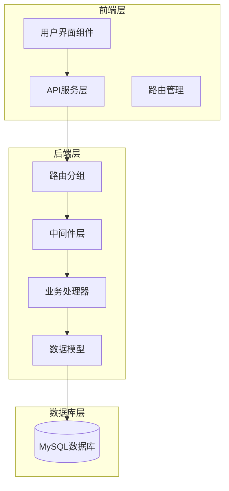
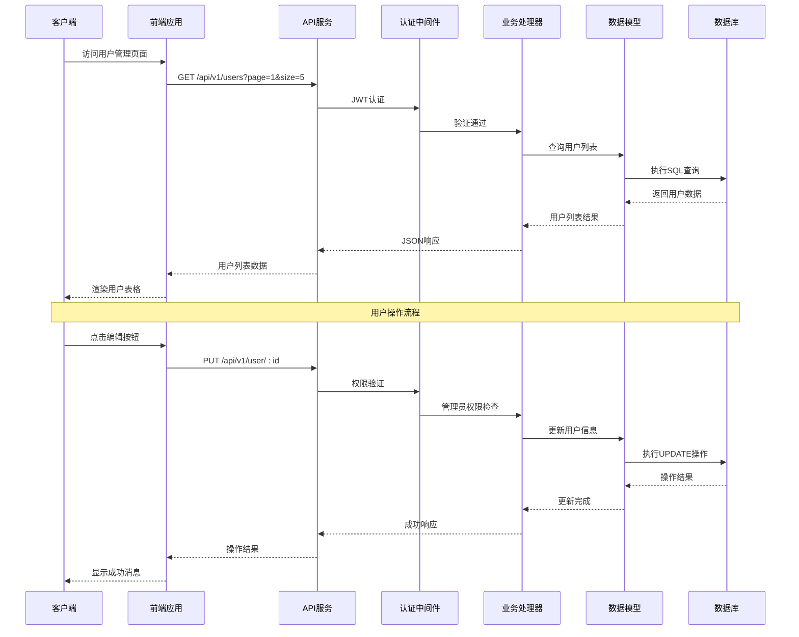
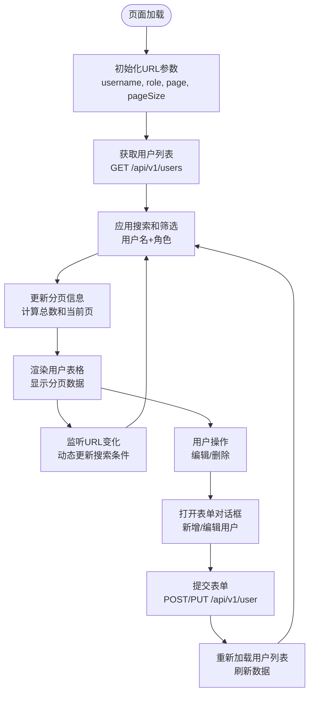
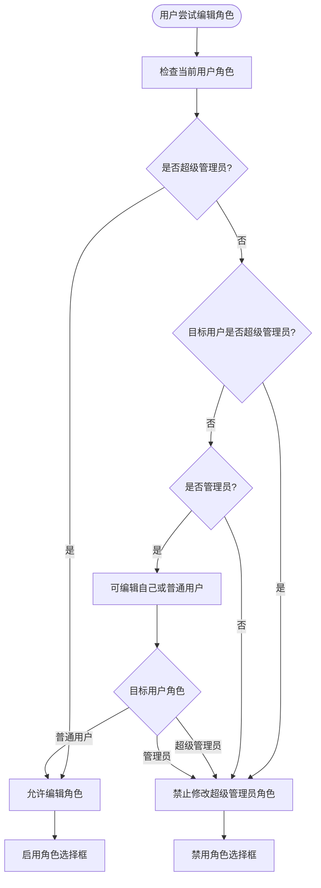
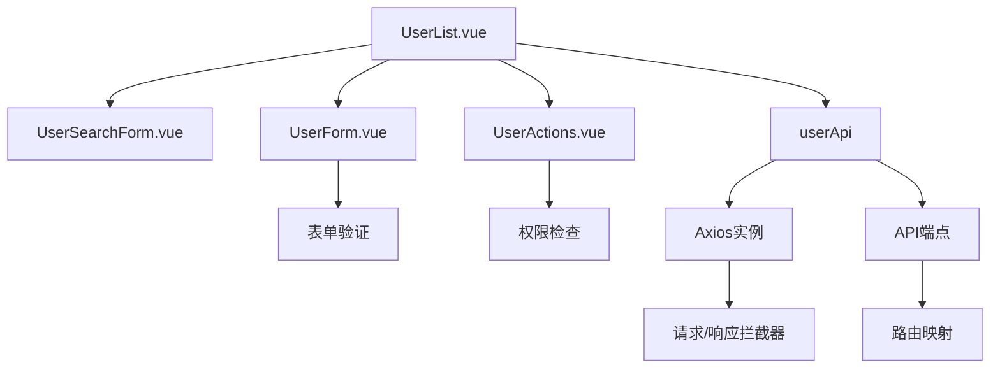
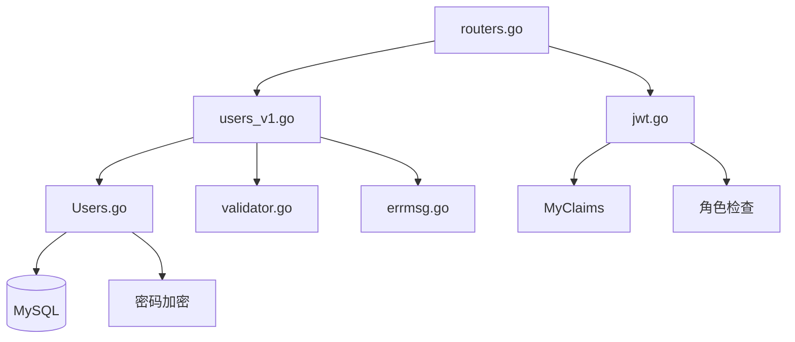

# 用户管理模块

<cite>
**本文档引用的文件**
- [UserList.vue](file://web/backend/src/views/user/UserList.vue)
- [UserForm.vue](file://web/backend/src/components/user/UserForm.vue)
- [UserSearchForm.vue](file://web/backend/src/components/user/UserSearchForm.vue)
- [UserActions.vue](file://web/backend/src/components/user/UserActions.vue)
- [api.ts](file://web/backend/src/services/api.ts)
- [users_v1.go](file://api\v1/users_v1.go)
- [Users.go](file://model/Users.go)
- [routers.go](file://routers/routers.go)
- [jwt.go](file://middlewares/jwt.go)
- [validator.go](file://utils/validator/validator.go)
- [errmsg.go](file://utils/errmsg/errmsg.go)
- [index.ts](file://web/backend/src/router/index.ts)
</cite>

## 目录
1. [简介](#简介)
2. [项目结构](#项目结构)
3. [核心组件](#核心组件)
4. [架构概览](#架构概览)
5. [详细组件分析](#详细组件分析)
6. [依赖关系分析](#依赖关系分析)
7. [性能考虑](#性能考虑)
8. [故障排除指南](#故障排除指南)
9. [结论](#结论)
10. [附录](#附录)

## 简介
用户管理模块是博客后台管理系统的核心功能之一，负责用户信息的展示、管理、权限控制和安全保护。该模块提供了完整的用户生命周期管理能力，包括用户列表展示、搜索筛选、表单编辑、权限分配、批量操作等功能。

## 项目结构
用户管理模块采用前后端分离的架构设计，前端使用Vue.js + Element Plus构建用户界面，后端使用Go语言 + Gin框架提供RESTful API服务。

**图表来源**
- [UserList.vue:1-440](file://web/backend/src/views/user/UserList.vue#L1-L440)
- [api.ts:1-255](file://web/backend/src/services/api.ts#L1-L255)
- [routers.go:1-122](file://routers/routers.go#L1-L122)

**章节来源**
- [UserList.vue:1-440](file://web/backend/src/views/user/UserList.vue#L1-L440)
- [api.ts:1-255](file://web/backend/src/services/api.ts#L1-L255)
- [routers.go:1-122](file://routers/routers.go#L1-L122)

## 核心组件
用户管理模块包含以下核心组件：

### 前端组件
- **UserList.vue**: 用户列表页面，负责展示用户信息、搜索筛选、分页管理
- **UserForm.vue**: 用户表单组件，支持用户创建和编辑功能
- **UserSearchForm.vue**: 搜索表单组件，提供用户名和角色筛选功能
- **UserActions.vue**: 用户操作组件，处理编辑和删除操作

### 后端组件
- **users_v1.go**: 用户API处理器，实现用户CRUD操作
- **Users.go**: 用户数据模型，定义用户结构和数据库操作
- **routers.go**: 路由配置，定义用户相关API接口

**章节来源**
- [UserList.vue:95-100](file://web/backend/src/views/user/UserList.vue#L95-L100)
- [UserForm.vue:47-57](file://web/backend/src/components/user/UserForm.vue#L47-L57)
- [users_v1.go:15-75](file://api\v1/users_v1.go#L15-L75)
- [Users.go:11-17](file://model/Users.go#L11-L17)

## 架构概览
用户管理模块采用分层架构设计，实现了清晰的关注点分离：

**图表来源**
- [api.ts:52-71](file://web/backend/src/services/api.ts#L52-L71)
- [users_v1.go:77-93](file://api\v1/users_v1.go#L77-L93)
- [jwt.go:98-157](file://middlewares/jwt.go#L98-L157)

**章节来源**
- [api.ts:46-71](file://web/backend/src/services/api.ts#L46-L71)
- [users_v1.go:77-283](file://api\v1/users_v1.go#L77-L283)
- [jwt.go:71-96](file://middlewares/jwt.go#L71-L96)

## 详细组件分析

### 用户列表页面 (UserList.vue)
用户列表页面是用户管理模块的核心界面，提供了完整的用户信息展示和管理功能。

#### 主要功能特性
- **实时搜索**: 支持按用户名和角色进行实时搜索
- **前端分页**: 内置分页功能，支持5/10/20/100条记录切换
- **URL参数同步**: 搜索条件和分页参数自动同步到URL
- **权限控制**: 根据用户角色显示相应的操作按钮

#### 数据流设计

**图表来源**
- [UserList.vue:105-141](file://web/backend/src/views/user/UserList.vue#L105-L141)
- [UserList.vue:245-273](file://web/backend/src/views/user/UserList.vue#L245-L273)

#### 搜索和筛选机制
用户列表页面实现了双重搜索机制：
1. **前端本地搜索**: 在已加载的用户数据上进行快速搜索
2. **URL参数同步**: 将搜索条件持久化到URL参数中

**章节来源**
- [UserList.vue:105-141](file://web/backend/src/views/user/UserList.vue#L105-L141)
- [UserList.vue:189-200](file://web/backend/src/views/user/UserList.vue#L189-L200)
- [UserList.vue:280-292](file://web/backend/src/views/user/UserList.vue#L280-L292)

### 用户表单组件 (UserForm.vue)
用户表单组件提供了用户创建和编辑的统一界面，实现了智能的角色权限控制。

#### 表单验证规则
- **用户名验证**: 必填，长度4-12字符
- **密码验证**: 新增时必填，长度6-20字符；编辑时可选填
- **角色选择**: 下拉选择框，根据当前用户权限动态启用/禁用

#### 角色权限控制逻辑

**图表来源**
- [UserForm.vue:74-83](file://web/backend/src/components/user/UserForm.vue#L74-L83)
- [UserForm.vue:103-115](file://web/backend/src/components/user/UserForm.vue#L103-L115)

**章节来源**
- [UserForm.vue:74-83](file://web/backend/src/components/user/UserForm.vue#L74-L83)
- [UserForm.vue:103-115](file://web/backend/src/components/user/UserForm.vue#L103-L115)

### 用户搜索表单 (UserSearchForm.vue)
搜索表单组件提供了简洁高效的用户搜索界面，支持多条件组合搜索。

#### 搜索功能实现
- **用户名搜索**: 支持模糊匹配，不区分大小写
- **角色筛选**: 下拉选择框，支持管理员和普通用户筛选
- **实时反馈**: 搜索结果即时更新，用户体验友好

**章节来源**
- [UserSearchForm.vue:58-69](file://web/backend/src/components/user/UserSearchForm.vue#L58-L69)

### 用户操作组件 (UserActions.vue)
用户操作组件实现了基于角色的权限控制，确保用户只能执行其权限范围内的操作。

#### 权限控制矩阵
| 当前用户角色 | 可编辑用户 | 可删除用户 | 限制说明 |
|-------------|-----------|-----------|----------|
| 超级管理员(1) | 所有人 | 除自己外的所有人 | 最高权限 |
| 管理员(2) | 自己 + 普通用户(3) | 普通用户(3) | 不能修改超级管理员 |
| 普通用户(3) | 仅自己 | 无 | 最低权限 |

**章节来源**
- [UserActions.vue:42-88](file://web/backend/src/components/user/UserActions.vue#L42-L88)

## 依赖关系分析

### 前端依赖关系

**图表来源**
- [UserList.vue:86-88](file://web/backend/src/views/user/UserList.vue#L86-L88)
- [api.ts:47-71](file://web/backend/src/services/api.ts#L47-L71)

### 后端依赖关系

**图表来源**
- [routers.go:38-53](file://routers/routers.go#L38-L53)
- [users_v1.go:15-283](file://api\v1/users_v1.go#L15-L283)
- [jwt.go:22-25](file://middlewares/jwt.go#L22-L25)

**章节来源**
- [routers.go:38-92](file://routers/routers.go#L38-L92)
- [users_v1.go:15-283](file://api\v1/users_v1.go#L15-L283)

## 性能考虑

### 前端性能优化
1. **虚拟滚动**: 对于大量用户数据，可考虑实现虚拟滚动以提升渲染性能
2. **懒加载**: 用户列表数据采用按需加载策略
3. **缓存机制**: 利用浏览器缓存减少重复请求
4. **防抖处理**: 搜索输入采用防抖机制，避免频繁请求

### 后端性能优化
1. **数据库索引**: 为username字段建立唯一索引，提升查询性能
2. **分页查询**: 实现合理的分页策略，避免全表扫描
3. **连接池**: 使用数据库连接池管理数据库连接
4. **缓存策略**: 对热点数据实施缓存机制

## 故障排除指南

### 常见问题及解决方案

#### 用户权限相关问题
- **问题**: 管理员无法编辑用户
- **原因**: 角色权限检查失败
- **解决**: 确认管理员具有足够的权限级别

#### 数据同步问题
- **问题**: 用户列表不更新
- **原因**: URL参数未正确同步
- **解决**: 检查updateUrlParams函数的实现

#### API调用失败
- **问题**: 用户操作API调用失败
- **原因**: JWT令牌过期或无效
- **解决**: 检查JWT中间件的认证逻辑

**章节来源**
- [UserList.vue:322-349](file://web/backend/src/views/user/UserList.vue#L322-L349)
- [jwt.go:100-157](file://middlewares/jwt.go#L100-L157)

## 结论
用户管理模块通过精心设计的架构和完善的权限控制机制，为博客后台管理系统提供了强大而安全的用户管理能力。模块采用了前后端分离的设计模式，实现了良好的可维护性和扩展性。

主要优势包括：
1. **完整的权限体系**: 基于角色的细粒度权限控制
2. **友好的用户体验**: 实时搜索、分页导航、表单验证
3. **安全可靠**: JWT认证、密码加密、输入验证
4. **易于扩展**: 模块化设计，便于功能扩展

## 附录

### API接口规范

#### 用户管理API
| 方法 | 端点 | 权限要求 | 功能描述 |
|------|------|----------|----------|
| GET | `/api/v1/users` | 已认证 | 获取用户列表 |
| GET | `/api/v1/users/search` | 已认证 | 搜索用户 |
| POST | `/api/v1/user/add` | 管理员 | 创建用户 |
| PUT | `/api/v1/user/:id` | 管理员 | 更新用户 |
| DELETE | `/api/v1/user/:id` | 管理员 | 删除用户 |

#### 权限等级定义
- **超级管理员 (1)**: 拥有最高权限，可管理所有用户
- **管理员 (2)**: 可管理普通用户，不可修改超级管理员
- **普通用户 (3)**: 仅可管理自己的账户信息

### 安全措施
1. **密码加密**: 使用bcrypt算法对用户密码进行加密存储
2. **JWT认证**: 实施基于JWT的无状态认证机制
3. **输入验证**: 前后端双重验证，防止恶意输入
4. **权限控制**: 基于角色的访问控制，最小权限原则