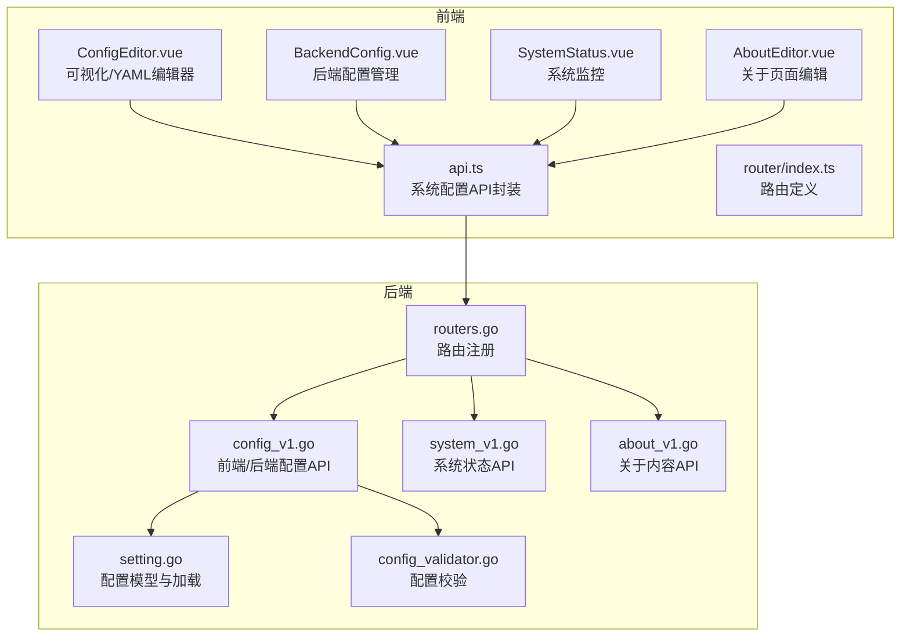
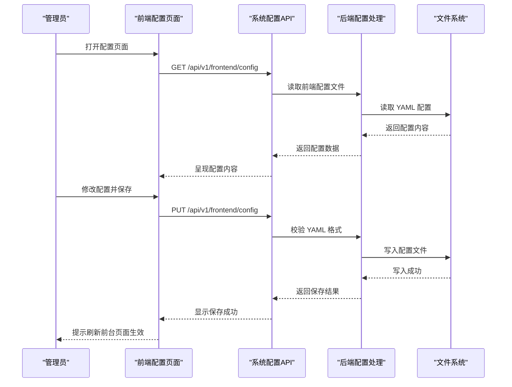
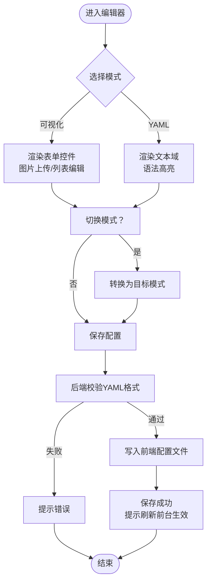
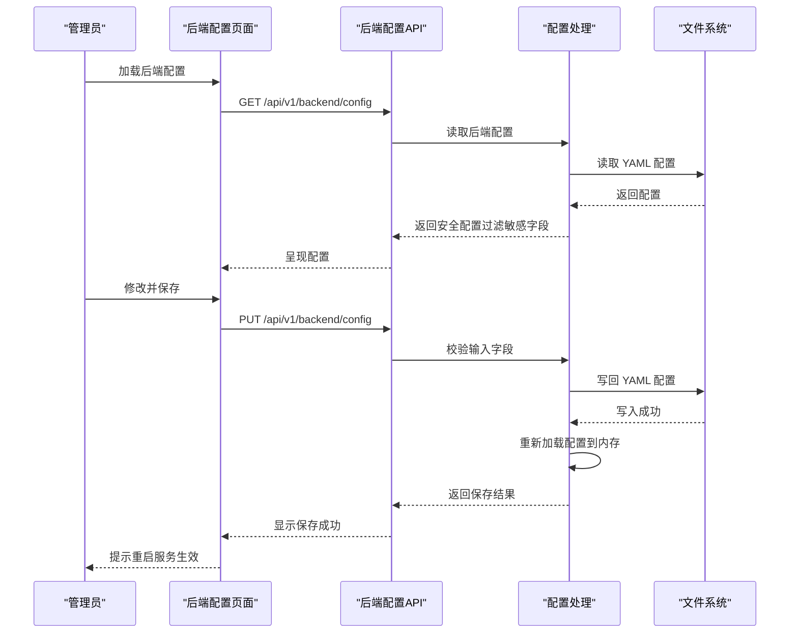
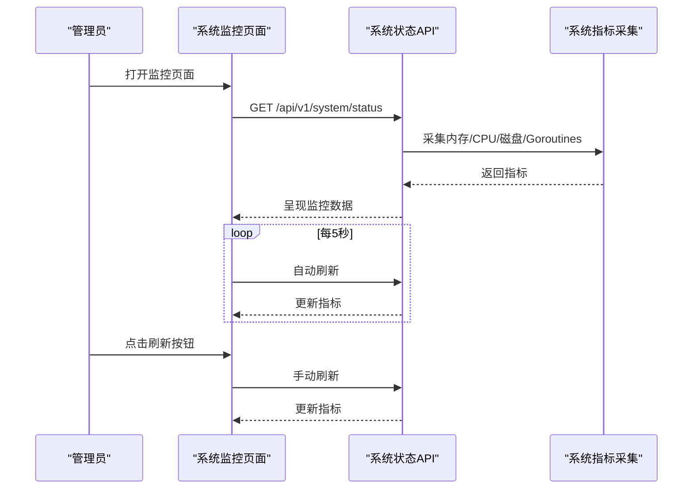
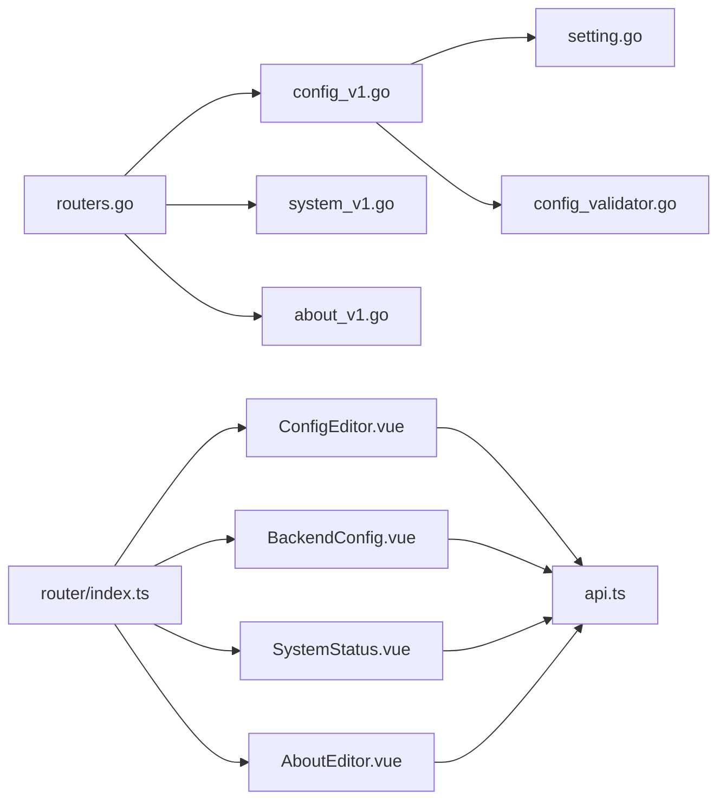

# 系统配置模块

<cite>
**本文引用的文件**
- [api\v1\config_v1.go](file://api\v1\config_v1.go)
- [api\v1\system_v1.go](file://api\v1\system_v1.go)
- [api\v1\about_v1.go](file://api\v1\about_v1.go)
- [routers\routers.go](file://routers\routers.go)
- [utils\setting.go](file://utils\setting.go)
- [utils\config_validator.go](file://utils\config_validator.go)
- [web\backend\src\views\system\ConfigEditor.vue](file://web\backend\src\views\system\ConfigEditor.vue)
- [web\backend\src\views\system\BackendConfig.vue](file://web\backend\src\views\system\BackendConfig.vue)
- [web\backend\src\views\system\SystemStatus.vue](file://web\backend\src\views\system\SystemStatus.vue)
- [web\backend\src\views\system\AboutEditor.vue](file://web\backend\src\views\system\AboutEditor.vue)
- [web\backend\src\services\api.ts](file://web\backend\src\services\api.ts)
- [web\backend\src\router\index.ts](file://web\backend\src\router\index.ts)
- [config\config_template.yaml](file://config\config_template.yaml)
</cite>

## 目录
1. [简介](#简介)
2. [项目结构](#项目结构)
3. [核心组件](#核心组件)
4. [架构总览](#架构总览)
5. [详细组件分析](#详细组件分析)
6. [依赖关系分析](#依赖关系分析)
7. [性能考量](#性能考量)
8. [故障排查指南](#故障排查指南)
9. [结论](#结论)
10. [附录](#附录)

## 简介
本文件面向系统管理员与运维人员，全面阐述后台管理系统中的“系统配置模块”。内容涵盖：
- 系统配置页面的整体设计与配置项管理
- 配置编辑器的实现（可视化表单与YAML源码模式、输入控件与验证机制）
- 系统状态监控页面（服务器状态、资源使用率等）
- 关于页面编辑功能（内容编辑与图片上传）
- 配置热重载机制与配置变更生效流程
- 配置备份与恢复策略
- 权限控制与安全措施
- 与后端配置 API 的交互及配置数据持久化机制

## 项目结构
系统配置模块由前后端协同实现：
- 后端提供配置读取、更新、热重载与系统状态监控接口
- 前端提供可视化配置编辑器、后端配置管理、系统监控与关于页面编辑界面
- 配置文件采用 YAML 格式，分别存放于后端与前端路径

图表来源
- [web\backend\src\views\system\ConfigEditor.vue:1-809](file://web\backend\src\views\system\ConfigEditor.vue#L1-L809)
- [web\backend\src\views\system\BackendConfig.vue:1-267](file://web\backend\src\views\system\BackendConfig.vue#L1-L267)
- [web\backend\src\views\system\SystemStatus.vue:1-216](file://web\backend\src\views\system\SystemStatus.vue#L1-L216)
- [web\backend\src\views\system\AboutEditor.vue:1-95](file://web\backend\src\views\system\AboutEditor.vue#L1-L95)
- [web\backend\src\services\api.ts:232-253](file://web\backend\src\services\api.ts#L232-L253)
- [routers\routers.go:13-122](file://routers\routers.go#L13-L122)
- [api\v1\config_v1.go:16-273](file://api\v1\config_v1.go#L16-L273)
- [api\v1\system_v1.go:29-93](file://api\v1\system_v1.go#L29-L93)
- [api\v1\about_v1.go:14-61](file://api\v1\about_v1.go#L14-L61)
- [utils\setting.go:14-171](file://utils\setting.go#L14-L171)
- [utils\config_validator.go:11-54](file://utils\config_validator.go#L11-L54)

章节来源
- [routers\routers.go:13-122](file://routers\routers.go#L13-L122)
- [web\backend\src\router\index.ts:22-155](file://web\backend\src\router\index.ts#L22-L155)

## 核心组件
- 前端配置编辑器（ConfigEditor.vue）
  - 提供可视化表单与 YAML 源码两种模式，支持图片上传、列表增删、分组配置等
  - 通过系统配置 API 与后端交互，保存配置并提示生效方式
- 后端配置管理（BackendConfig.vue）
  - 展示与编辑服务器、数据库、天气与前端配置路径等后端配置
  - 保存后端配置需重启服务以使变更生效
- 系统监控（SystemStatus.vue）
  - 实时展示服务状态、运行时长、CPU/内存/磁盘使用率与 Goroutines 数
  - 支持手动刷新与自动刷新（每 5 秒）
- 关于页面编辑（AboutEditor.vue）
  - Markdown 编辑器，支持图片上传与保存
  - 通过独立 API 管理静态 about.md 内容

章节来源
- [web\backend\src\views\system\ConfigEditor.vue:1-809](file://web\backend\src\views\system\ConfigEditor.vue#L1-L809)
- [web\backend\src\views\system\BackendConfig.vue:1-267](file://web\backend\src\views\system\BackendConfig.vue#L1-L267)
- [web\backend\src\views\system\SystemStatus.vue:1-216](file://web\backend\src\views\system\SystemStatus.vue#L1-L216)
- [web\backend\src\views\system\AboutEditor.vue:1-95](file://web\backend\src\views\system\AboutEditor.vue#L1-L95)

## 架构总览
系统配置模块遵循“前端表单/编辑器 + 后端 API + 配置文件”的三层架构：
- 前端负责用户交互与数据组织
- 后端负责配置校验、持久化与热重载
- 配置文件作为数据持久化介质，支持 YAML 格式与环境变量替换

图表来源
- [web\backend\src\views\system\ConfigEditor.vue:527-608](file://web\backend\src\views\system\ConfigEditor.vue#L527-L608)
- [web\backend\src\services\api.ts:232-240](file://web\backend\src\services\api.ts#L232-L240)
- [api\v1\config_v1.go:16-77](file://api\v1\config_v1.go#L16-L77)
- [utils\setting.go:159-171](file://utils\setting.go#L159-L171)

## 详细组件分析

### 前端配置编辑器（ConfigEditor.vue）
- 模式切换
  - 可视化模式：按配置类别（基本信息、作者信息、首页设置、快捷链接、页脚设置、社交链接、联系方式、音乐播放器、默认图片、开发设置等）组织表单控件
  - YAML 源码模式：直接编辑 YAML 文本，支持语法高亮与格式化
- 图片上传与快速选择
  - 通过上传组件支持图片上传，限制大小并支持预览
  - 提供常用默认资源快速选择
- 数据绑定与保存
  - 可视化模式通过 js-yaml 将对象转换为 YAML 文本
  - 保存时调用系统配置 API，后端进行 YAML 格式校验与文件写入
- 生效提示
  - 保存成功后提示“刷新前台页面生效”，体现前端配置即时生效特性

图表来源
- [web\backend\src\views\system\ConfigEditor.vue:512-608](file://web\backend\src\views\system\ConfigEditor.vue#L512-L608)
- [api\v1\config_v1.go:40-77](file://api\v1\config_v1.go#L40-L77)

章节来源
- [web\backend\src\views\system\ConfigEditor.vue:1-809](file://web\backend\src\views\system\ConfigEditor.vue#L1-L809)
- [web\backend\src\services\api.ts:232-240](file://web\backend\src\services\api.ts#L232-L240)

### 后端配置管理（BackendConfig.vue）
- 配置项
  - 服务器配置：运行模式、监听端口、站点 URL
  - 数据库配置：类型、主机、端口、用户名、密码、数据库名（密码不回显）
  - 天气设置：默认城市
  - 其他设置：前端配置路径
- 保存流程
  - 仅当用户输入新密码时才发送密码字段，避免覆盖
  - 保存后提示“请重启服务使其生效”，体现后端配置需重启生效的特性
- 安全性
  - 后端配置接口要求管理员权限
  - 后端配置返回时过滤敏感字段（如数据库密码、JWT 密钥）

图表来源
- [web\backend\src\views\system\BackendConfig.vue:155-204](file://web\backend\src\views\system\BackendConfig.vue#L155-L204)
- [api\v1\config_v1.go:79-218](file://api\v1\config_v1.go#L79-L218)
- [utils\setting.go:132-148](file://utils\setting.go#L132-L148)

章节来源
- [web\backend\src\views\system\BackendConfig.vue:1-267](file://web\backend\src\views\system\BackendConfig.vue#L1-L267)
- [api\v1\config_v1.go:79-218](file://api\v1\config_v1.go#L79-L218)
- [utils\setting.go:132-148](file://utils\setting.go#L132-L148)

### 系统状态监控（SystemStatus.vue）
- 监控指标
  - 服务状态（在线/离线）、运行时长、Goroutines 数
  - CPU 使用率、内存使用率、磁盘使用率
- 自动刷新
  - 默认开启自动刷新，周期 5 秒
  - 支持手动刷新按钮
- 错误处理
  - 请求失败时弹出错误提示并记录日志

图表来源
- [web\backend\src\views\system\SystemStatus.vue:114-150](file://web\backend\src\views\system\SystemStatus.vue#L114-L150)
- [api\v1\system_v1.go:29-93](file://api\v1\system_v1.go#L29-L93)

章节来源
- [web\backend\src\views\system\SystemStatus.vue:1-216](file://web\backend\src\views\system\SystemStatus.vue#L1-L216)
- [api\v1\system_v1.go:29-93](file://api\v1\system_v1.go#L29-L93)

### 关于页面编辑（AboutEditor.vue）
- 功能
  - Markdown 编辑器，支持图片上传与保存
  - 通过独立 API 管理静态 about.md 内容
- 上传流程
  - 选择图片后批量上传，回调返回图片 URL 并插入编辑器
- 安全
  - 上传接口受鉴权保护，仅管理员可用

章节来源
- [web\backend\src\views\system\AboutEditor.vue:1-95](file://web\backend\src\views\system\AboutEditor.vue#L1-L95)
- [api\v1\about_v1.go:14-61](file://api\v1\about_v1.go#L14-L61)

## 依赖关系分析
- 路由与权限
  - 后端路由对管理员权限进行分组保护，配置与系统状态接口均需管理员权限
  - 前端路由定义了系统配置相关页面的访问路径与菜单归属
- 配置模型与加载
  - 后端配置模型定义了 server、database、weather、FrontEndConfigPath 等字段
  - 配置文件支持环境变量替换，提供多路径回退加载
- 配置校验
  - 启动时对数据库用户名、密码、端口等进行校验，输出警告或错误
  - JWT 密钥长度不足时给出警告，必要时生成临时密钥

图表来源
- [routers\routers.go:13-122](file://routers\routers.go#L13-L122)
- [api\v1\config_v1.go:16-273](file://api\v1\config_v1.go#L16-L273)
- [api\v1\system_v1.go:29-93](file://api\v1\system_v1.go#L29-L93)
- [api\v1\about_v1.go:14-61](file://api\v1\about_v1.go#L14-L61)
- [utils\setting.go:14-171](file://utils\setting.go#L14-L171)
- [utils\config_validator.go:11-54](file://utils\config_validator.go#L11-L54)
- [web\backend\src\router\index.ts:22-155](file://web\backend\src\router\index.ts#L22-L155)
- [web\backend\src\views\system\ConfigEditor.vue:1-809](file://web\backend\src\views\system\ConfigEditor.vue#L1-L809)
- [web\backend\src\views\system\BackendConfig.vue:1-267](file://web\backend\src\views\system\BackendConfig.vue#L1-L267)
- [web\backend\src\views\system\SystemStatus.vue:1-216](file://web\backend\src\views\system\SystemStatus.vue#L1-L216)
- [web\backend\src\views\system\AboutEditor.vue:1-95](file://web\backend\src\views\system\AboutEditor.vue#L1-L95)
- [web\backend\src\services\api.ts:232-253](file://web\backend\src\services\api.ts#L232-L253)

章节来源
- [routers\routers.go:13-122](file://routers\routers.go#L13-L122)
- [utils\setting.go:14-171](file://utils\setting.go#L14-L171)
- [utils\config_validator.go:11-54](file://utils\config_validator.go#L11-L54)
- [web\backend\src\router\index.ts:22-155](file://web\backend\src\router\index.ts#L22-L155)

## 性能考量
- 前端配置编辑器
  - YAML 源码模式适合高级用户，避免大体量配置的表单渲染开销
  - 图片上传前进行大小限制，减少网络与存储压力
- 后端配置更新
  - 后端配置写回 YAML 并重新加载内存，重启后生效，避免频繁重启带来的停机风险
- 系统监控
  - 自动刷新间隔 5 秒，避免过度采集造成资源消耗
  - 进度条颜色根据阈值动态变化，便于直观判断资源压力

## 故障排查指南
- 前端配置保存失败
  - 检查 YAML 语法是否正确（切换到 YAML 源码模式进行校验）
  - 确认网络请求是否被拦截或跨域问题
  - 查看浏览器控制台与后端日志
- 后端配置保存失败
  - 确认输入字段是否在允许范围内（仅允许 server、database、weather、FrontEndConfigPath 等）
  - 检查数据库密码是否为空或默认值（建议修改为强密码）
  - 确认配置文件写入权限与路径
- 系统监控异常
  - 检查系统指标采集库是否可用（内存/CPU/磁盘）
  - 确认健康检查接口 /api/v1/health 是否返回正常
- 关于页面内容无法保存
  - 确认静态文件路径存在且可写
  - 检查上传权限与鉴权头是否正确传递

章节来源
- [api\v1\config_v1.go:40-77](file://api\v1\config_v1.go#L40-L77)
- [api\v1\config_v1.go:109-218](file://api\v1\config_v1.go#L109-L218)
- [api\v1\system_v1.go:86-93](file://api\v1\system_v1.go#L86-L93)
- [api\v1\about_v1.go:33-61](file://api\v1\about_v1.go#L33-L61)

## 结论
系统配置模块通过前后端协作实现了灵活、安全、可观测的配置管理能力：
- 前端提供可视化与源码双模式编辑体验，满足不同用户需求
- 后端严格校验与权限控制，保障配置安全与稳定性
- 系统监控提供实时资源状态，辅助运维决策
- 配置热重载与重启生效相结合，兼顾即时性与可靠性

## 附录

### 配置热重载机制与生效流程
- 前端配置
  - 保存后立即写入前端配置文件，刷新前台页面即可生效
- 后端配置
  - 保存后写回 YAML 并重新加载到内存，部分配置（如 JWT 密钥）即时生效
  - 部分配置（如服务器端口、运行模式）需重启服务方可生效

章节来源
- [api\v1\config_v1.go:210-217](file://api\v1\config_v1.go#L210-L217)
- [utils\setting.go:132-148](file://utils\setting.go#L132-L148)

### 配置备份与恢复
- 建议定期备份以下文件：
  - 后端配置：config/backend/config.yaml 或 config/config.yaml
  - 前端配置：config/frontend/config.yaml 或 web/frontend/public/config.yaml
- 恢复步骤
  - 停止服务
  - 备份当前配置文件
  - 替换为备份文件
  - 重启服务并验证

章节来源
- [config\config_template.yaml:1-29](file://config\config_template.yaml#L1-L29)
- [utils\setting.go:159-171](file://utils\setting.go#L159-L171)

### 权限控制与安全措施
- 接口权限
  - 配置与系统状态接口均需管理员权限
  - 登录鉴权通过 JWT 实现，响应拦截器处理过期令牌
- 敏感信息保护
  - 后端配置返回时过滤敏感字段（如数据库密码、JWT 密钥）
  - 前端密码输入框不回显，仅在用户输入时发送
- 安全建议
  - 修改默认数据库密码与 JWT 密钥
  - 限制配置文件读写权限
  - 使用 HTTPS 传输，避免明文泄露

章节来源
- [routers\routers.go:42-46](file://routers\routers.go#L42-L46)
- [api\v1\config_v1.go:82-100](file://api\v1\config_v1.go#L82-L100)
- [web\backend\src\views\system\BackendConfig.vue:181-189](file://web\backend\src\views\system\BackendConfig.vue#L181-L189)
- [web\backend\src\services\api.ts:14-44](file://web\backend\src\services\api.ts#L14-L44)

### 与后端配置 API 的交互与配置数据持久化
- 前端配置
  - GET /api/v1/frontend/config：读取前端配置文件内容
  - PUT /api/v1/frontend/config：更新前端配置文件（YAML 格式校验）
- 后端配置
  - GET /api/v1/backend/config：读取后端配置（过滤敏感字段）
  - PUT /api/v1/backend/config：更新后端配置（字段白名单校验）
  - POST /api/v1/config/reload：重新加载配置到内存
  - GET /api/v1/config/all：同时获取前后端配置
- 数据持久化
  - YAML 文件写入与读取，支持环境变量替换
  - 配置路径优先级：环境变量 > 默认路径 > 模板路径

章节来源
- [web\backend\src\services\api.ts:232-253](file://web\backend\src\services\api.ts#L232-L253)
- [api\v1\config_v1.go:16-273](file://api\v1\config_v1.go#L16-L273)
- [utils\setting.go:66-148](file://utils\setting.go#L66-L148)