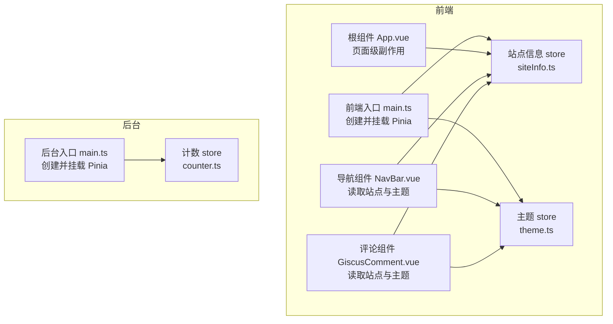
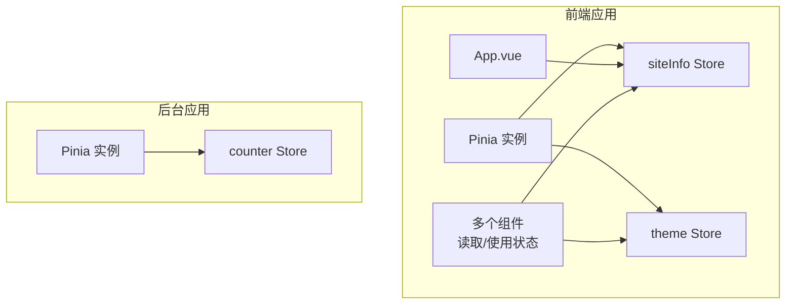
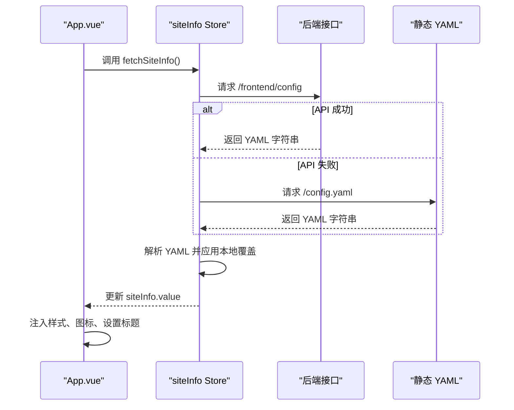
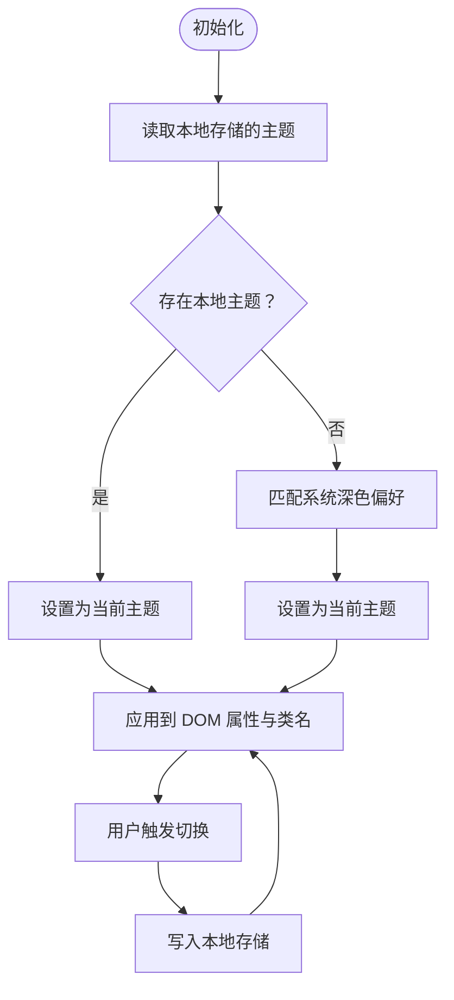
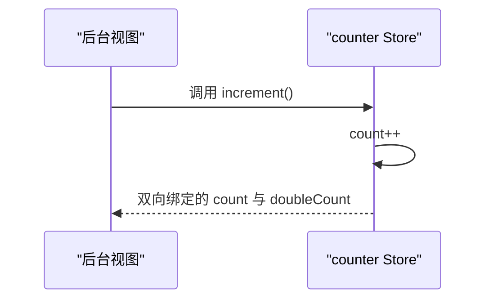
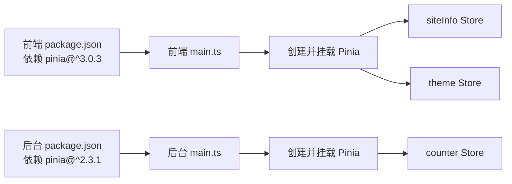

# 状态管理

<cite>
**本文引用的文件**
- [web/frontend/src/stores/siteInfo.ts](file://web/frontend/src/stores/siteInfo.ts)
- [web/frontend/src/stores/theme.ts](file://web/frontend/src/stores/theme.ts)
- [web/backend/src/stores/counter.ts](file://web/backend/src/stores/counter.ts)
- [web/frontend/src/main.ts](file://web/frontend/src/main.ts)
- [web/backend/src/main.ts](file://web/backend/src/main.ts)
- [web/frontend/package.json](file://web/frontend/package.json)
- [web/backend/package.json](file://web/backend/package.json)
- [web/frontend/src/App.vue](file://web/frontend/src/App.vue)
- [web/frontend/src/components/NavBar.vue](file://web/frontend/src/components/NavBar.vue)
- [web/frontend/src/components/comment/GiscusComment.vue](file://web/frontend/src/components/comment/GiscusComment.vue)
</cite>

## 目录
1. [简介](#简介)
2. [项目结构](#项目结构)
3. [核心组件](#核心组件)
4. [架构总览](#架构总览)
5. [详细组件分析](#详细组件分析)
6. [依赖分析](#依赖分析)
7. [性能考虑](#性能考虑)
8. [故障排查指南](#故障排查指南)
9. [结论](#结论)
10. [附录](#附录)

## 简介
本文件面向 YanBlog 的前端与后台管理系统，系统性梳理基于 Pinia 的状态管理实践，重点覆盖以下方面：
- Pinia 在前端与后台工程中的集成方式与初始化流程
- 站点信息状态（siteInfo）的加载、更新与持久化策略
- 主题状态（theme）的切换机制与本地持久化
- 后台管理计数状态（counter）的使用场景与更新流程
- 全局状态与组件局部状态的选择原则
- 响应式更新、异步操作处理与状态持久化方案
- 调试与开发工具使用方法
- 最佳实践与性能优化建议
- 完整的状态设计与使用指南

## 项目结构
YanBlog 将状态管理按“功能域+环境”拆分：
- 前端（web/frontend）：包含站点信息与主题两个核心状态模块，并在入口处完成 Pinia 初始化
- 后台（web/backend）：包含一个示例计数状态模块（counter），同样在入口完成 Pinia 初始化

图表来源
- [web/frontend/src/main.ts:1-28](file://web/frontend/src/main.ts#L1-L28)
- [web/frontend/src/stores/siteInfo.ts:1-261](file://web/frontend/src/stores/siteInfo.ts#L1-L261)
- [web/frontend/src/stores/theme.ts:1-39](file://web/frontend/src/stores/theme.ts#L1-L39)
- [web/frontend/src/App.vue:25-112](file://web/frontend/src/App.vue#L25-L112)
- [web/frontend/src/components/NavBar.vue:205-278](file://web/frontend/src/components/NavBar.vue#L205-L278)
- [web/frontend/src/components/comment/GiscusComment.vue:10-94](file://web/frontend/src/components/comment/GiscusComment.vue#L10-L94)
- [web/backend/src/main.ts:1-23](file://web/backend/src/main.ts#L1-L23)
- [web/backend/src/stores/counter.ts:1-13](file://web/backend/src/stores/counter.ts#L1-L13)

章节来源
- [web/frontend/src/main.ts:1-28](file://web/frontend/src/main.ts#L1-L28)
- [web/backend/src/main.ts:1-23](file://web/backend/src/main.ts#L1-L23)

## 核心组件
本节聚焦三个关键状态模块及其职责边界与交互关系。

- 站点信息（siteInfo）
  - 职责：承载博客站点的配置数据（如站点名称、作者信息、页眉页脚、快捷方式、社交链接、评论配置等），支持从后端接口或静态 YAML 文件加载，并可写回后端以持久化
  - 关键能力：异步加载、环境覆盖、更新与刷新、类型安全的数据模型
  - 使用场景：根组件进行页面标题、图标、样式注入；各业务组件读取配置渲染 UI

- 主题（theme）
  - 职责：维护当前主题（light/dark），初始化时优先读取本地存储，其次跟随系统偏好，变更后自动持久化到本地存储并应用到 DOM 属性与类名
  - 关键能力：主题切换、本地持久化、DOM 应用、响应式变更监听
  - 使用场景：导航栏、评论区等组件根据主题动态调整外观

- 后台计数（counter）
  - 职责：演示型计数状态，包含计数值与计算属性（doubleCount），以及自增动作
  - 关键能力：基础响应式状态、计算属性、动作函数
  - 使用场景：后台管理界面中的示例展示与交互

章节来源
- [web/frontend/src/stores/siteInfo.ts:7-187](file://web/frontend/src/stores/siteInfo.ts#L7-L187)
- [web/frontend/src/stores/theme.ts:4-38](file://web/frontend/src/stores/theme.ts#L4-L38)
- [web/backend/src/stores/counter.ts:4-12](file://web/backend/src/stores/counter.ts#L4-L12)

## 架构总览
下图展示了前端与后台工程中 Pinia 的初始化、状态模块与组件之间的交互关系。

图表来源
- [web/frontend/src/main.ts](file://web/frontend/src/main.ts#L16)
- [web/frontend/src/stores/siteInfo.ts:110-261](file://web/frontend/src/stores/siteInfo.ts#L110-L261)
- [web/frontend/src/stores/theme.ts:5-38](file://web/frontend/src/stores/theme.ts#L5-L38)
- [web/backend/src/main.ts:12-22](file://web/backend/src/main.ts#L12-L22)
- [web/backend/src/stores/counter.ts:4-12](file://web/backend/src/stores/counter.ts#L4-L12)

## 详细组件分析

### 站点信息状态（siteInfo）
- 数据模型与默认值
  - 定义了完整的站点配置接口，包含博客名称、作者信息、默认图片、英雄区、标语、Logo、Favicon、管理员地址、页面标题、图标字体、音乐播放器、快捷方式、页脚、社交与联系、评论配置等字段
  - 提供全面的默认值，确保在未加载配置时也能保证 UI 正常渲染
- 加载与回退策略
  - 优先通过 API 获取 YAML 配置；若失败则回退到静态资源路径下的 YAML 文件
  - 成功解析后应用本地环境覆盖逻辑（例如在本地开发环境下修正管理端地址）
- 更新与持久化
  - 支持将修改后的配置对象序列化为 YAML 并提交至后端接口，成功后更新本地状态
- 在根组件中的使用
  - 在挂载阶段调用加载方法，随后根据配置动态注入样式表、图标与页面标题
  - 监听窗口 blur/focus 事件，按配置切换页面标题

图表来源
- [web/frontend/src/App.vue:54-105](file://web/frontend/src/App.vue#L54-L105)
- [web/frontend/src/stores/siteInfo.ts:189-234](file://web/frontend/src/stores/siteInfo.ts#L189-L234)

章节来源
- [web/frontend/src/stores/siteInfo.ts:7-187](file://web/frontend/src/stores/siteInfo.ts#L7-L187)
- [web/frontend/src/stores/siteInfo.ts:189-253](file://web/frontend/src/stores/siteInfo.ts#L189-L253)
- [web/frontend/src/App.vue:54-105](file://web/frontend/src/App.vue#L54-L105)

### 主题状态（theme）
- 初始化与默认值
  - 优先从本地存储读取主题；若不存在则根据系统偏好决定默认主题（浅色）
- 切换与持久化
  - 切换主题后通过 watch 监听变化，自动写入本地存储并应用到 documentElement 的属性与类名
- 组件联动
  - 导航栏与评论组件均读取主题状态，实现 UI 动态适配

图表来源
- [web/frontend/src/stores/theme.ts:5-38](file://web/frontend/src/stores/theme.ts#L5-L38)

章节来源
- [web/frontend/src/stores/theme.ts:4-38](file://web/frontend/src/stores/theme.ts#L4-L38)
- [web/frontend/src/components/NavBar.vue:207-214](file://web/frontend/src/components/NavBar.vue#L207-L214)
- [web/frontend/src/components/comment/GiscusComment.vue:12-17](file://web/frontend/src/components/comment/GiscusComment.vue#L12-L17)

### 后台管理状态（counter）
- 状态定义
  - 包含计数变量、计算属性（doubleCount）与自增动作
- 使用场景
  - 作为后台管理界面中的演示示例，展示 Pinia 的基本用法（响应式状态、计算属性、动作）

图表来源
- [web/backend/src/stores/counter.ts:4-12](file://web/backend/src/stores/counter.ts#L4-L12)

章节来源
- [web/backend/src/stores/counter.ts:4-12](file://web/backend/src/stores/counter.ts#L4-L12)

### 全局状态与组件状态的选择原则
- 何时使用全局状态
  - 需要在多组件共享且跨路由复用的数据（如站点配置、主题）
  - 需要持久化的用户偏好或系统配置（如主题）
  - 需要统一的异步数据源（如从后端拉取配置）
- 何时使用组件局部状态
  - 仅在单个组件内使用的临时 UI 状态（如弹窗开关、表单输入框的临时值）
  - 与生命周期强耦合的内部状态（如滚动位置、动画状态）
- 在 YanBlog 中的应用
  - 站点配置与主题属于全局状态，由根组件在挂载时加载并贯穿全站
  - 导航栏的可见性、滚动进度等属于组件局部状态

## 依赖分析
- Pinia 版本
  - 前端工程依赖 pinia@^3.0.3
  - 后台工程依赖 pinia@^2.3.1
- 初始化方式
  - 前端在入口文件中创建并挂载 Pinia 实例
  - 后台在入口文件中创建并挂载 Pinia 实例
- 组件使用
  - 多个组件通过组合式 API 引入并使用对应 store
  - 导航栏与评论组件同时使用站点与主题 store，体现跨模块协作

图表来源
- [web/frontend/package.json](file://web/frontend/package.json#L26)
- [web/backend/package.json](file://web/backend/package.json#L32)
- [web/frontend/src/main.ts](file://web/frontend/src/main.ts#L16)
- [web/backend/src/main.ts:12-22](file://web/backend/src/main.ts#L12-L22)

章节来源
- [web/frontend/package.json:16-44](file://web/frontend/package.json#L16-L44)
- [web/backend/package.json:20-62](file://web/backend/package.json#L20-L62)
- [web/frontend/src/main.ts:1-28](file://web/frontend/src/main.ts#L1-L28)
- [web/backend/src/main.ts:1-23](file://web/backend/src/main.ts#L1-L23)

## 性能考虑
- 状态粒度与订阅范围
  - 将大型配置对象拆分为更细粒度的状态（如将站点配置拆分为“通用配置”“主题配置”“评论配置”），减少不必要的响应式开销
- 异步加载与缓存
  - 对站点配置采用一次性加载并在内存中缓存，避免重复请求；必要时提供手动刷新入口
- 本地持久化策略
  - 主题状态使用本地存储持久化，避免每次刷新重新计算系统偏好
- DOM 操作最小化
  - 主题切换只更新 documentElement 的属性与类名，避免频繁重排
- 组件订阅优化
  - 使用 storeToRefs 仅解构需要响应式的部分，降低组件订阅范围

## 故障排查指南
- 站点配置无法加载
  - 检查后端接口 /frontend/config 是否可用；若不可用，确认静态 YAML 是否存在于指定路径
  - 若返回数据格式不符合预期，检查 YAML 解析与类型断言逻辑
- 主题切换无效
  - 确认本地存储是否被正确写入；检查 DOM 属性与类名是否已更新
  - 若使用第三方组件库，确认其对深色模式的支持与样式覆盖
- 评论组件未生效
  - 确认评论配置已启用且参数完整（仓库名、分类等）
  - 若主题切换后评论区未同步，检查向 iframe 发送主题配置的消息通道是否正常

章节来源
- [web/frontend/src/stores/siteInfo.ts:189-234](file://web/frontend/src/stores/siteInfo.ts#L189-L234)
- [web/frontend/src/stores/theme.ts:28-32](file://web/frontend/src/stores/theme.ts#L28-L32)
- [web/frontend/src/components/comment/GiscusComment.vue:20-94](file://web/frontend/src/components/comment/GiscusComment.vue#L20-L94)

## 结论
YanBlog 的状态管理以 Pinia 为核心，结合 Vue 3 的组合式 API，在前端与后台分别实现了：
- 全局配置与主题的统一管理与持久化
- 示例型计数状态的演示
- 组件与状态的清晰边界与高效协作

通过合理的状态划分、异步加载与本地持久化策略，系统在保证用户体验的同时具备良好的扩展性与可维护性。

## 附录

### 状态调试与开发工具
- 浏览器插件
  - 使用 Vue DevTools 进行组件树与状态快照查看
  - 使用 Pinia Devtools 插件观察 actions 与状态变更历史
- 日志与错误处理
  - 在入口处设置全局错误处理器，便于定位组件异常
  - 在关键状态变更处添加日志输出，便于追踪问题

章节来源
- [web/frontend/src/main.ts:21-26](file://web/frontend/src/main.ts#L21-L26)

### 最佳实践清单
- 状态设计
  - 明确状态粒度，避免过度共享
  - 为复杂配置提供默认值与类型约束
- 异步处理
  - 对外部资源采用超时与回退策略
  - 对写操作提供成功/失败反馈
- 持久化
  - 仅对必要的用户偏好进行本地持久化
  - 注意版本升级时的兼容性迁移
- 性能
  - 控制响应式订阅范围，避免全局风暴
  - 合理使用计算属性与派生状态
- 可维护性
  - 为状态模块编写清晰的注释与使用示例
  - 对关键流程绘制时序图与流程图，辅助团队理解