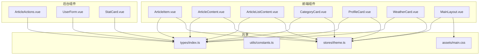
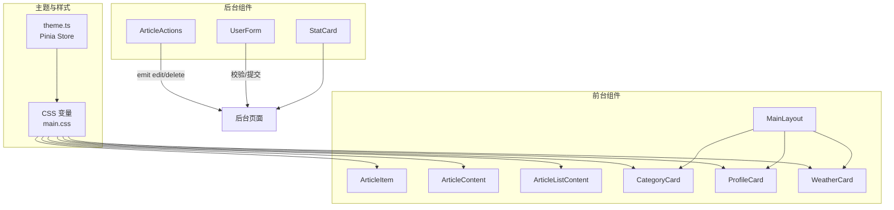
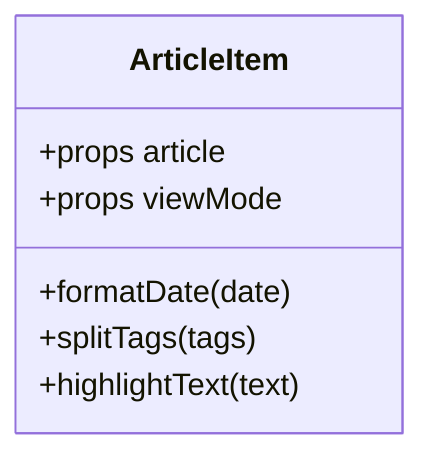
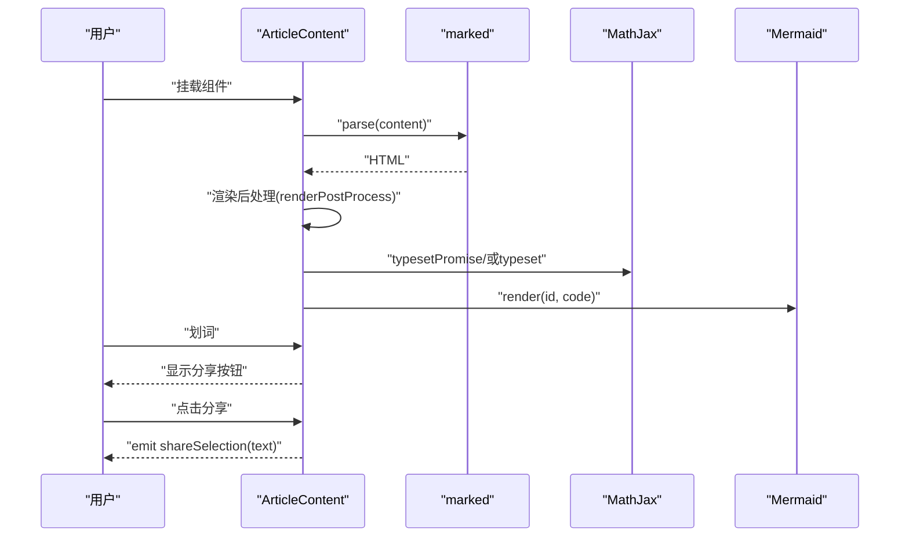
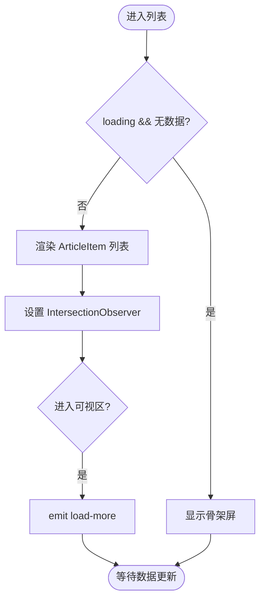
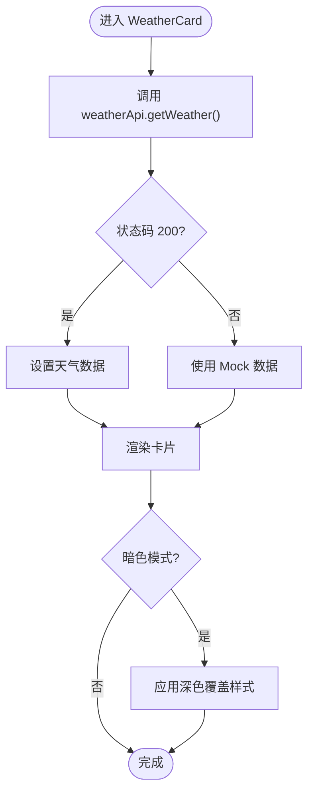
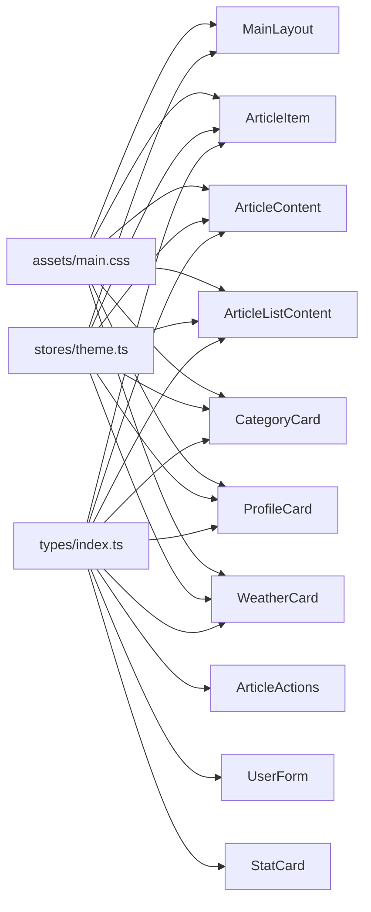

# 组件系统

<cite>
**本文档引用的文件**
- [web/frontend/src/components/article/ArticleItem.vue](file://web/frontend/src/components/article/ArticleItem.vue)
- [web/frontend/src/components/article/ArticleContent.vue](file://web/frontend/src/components/article/ArticleContent.vue)
- [web/frontend/src/components/article/ArticleListContent.vue](file://web/frontend/src/components/article/ArticleListContent.vue)
- [web/frontend/src/components/sidebar/CategoryCard.vue](file://web/frontend/src/components/sidebar/CategoryCard.vue)
- [web/frontend/src/components/sidebar/ProfileCard.vue](file://web/frontend/src/components/sidebar/ProfileCard.vue)
- [web/frontend/src/components/sidebar/WeatherCard.vue](file://web/frontend/src/components/sidebar/WeatherCard.vue)
- [web/backend/src/components/article/ArticleActions.vue](file://web/backend/src/components/article/ArticleActions.vue)
- [web/backend/src/components/dashboard/StatCard.vue](file://web/backend/src/components/dashboard/StatCard.vue)
- [web/backend/src/components/user/UserForm.vue](file://web/backend/src/components/user/UserForm.vue)
- [web/frontend/src/components/layout/MainLayout.vue](file://web/frontend/src/components/layout/MainLayout.vue)
- [web/frontend/src/stores/theme.ts](file://web/frontend/src/stores/theme.ts)
- [web/frontend/src/assets/main.css](file://web/frontend/src/assets/main.css)
- [web/frontend/src/types/index.ts](file://web/frontend/src/types/index.ts)
- [web/frontend/src/utils/constants.ts](file://web/frontend/src/utils/constants.ts)
</cite>

## 目录
1. [引言](#引言)
2. [项目结构](#项目结构)
3. [核心组件](#核心组件)
4. [架构总览](#架构总览)
5. [详细组件分析](#详细组件分析)
6. [依赖关系分析](#依赖关系分析)
7. [性能考量](#性能考量)
8. [故障排查指南](#故障排查指南)
9. [结论](#结论)
10. [附录](#附录)

## 引言
本文件面向 YanBlog 的前端与后台组件体系，系统化梳理可复用组件的设计原则、开发规范与最佳实践；重点覆盖文章相关组件（ArticleItem、ArticleContent、ArticleListContent）、侧边栏组件（CategoryCard、ProfileCard、WeatherCard）、后台管理组件（ArticleActions、UserForm、StatCard）的实现与使用方式；阐明组件间通信机制与数据传递方案；给出 Props 定义、事件处理、插槽使用、样式定制与主题适配策略，并提供单元测试与质量保障建议，帮助开发者高效复用、扩展与维护组件。

## 项目结构
YanBlog 采用前后端分离的前端工程化组织，组件按功能域划分：
- 前端组件位于 web/frontend/src/components 下，按模块拆分（article、sidebar、layout 等）
- 后台组件位于 web/backend/src/components 下，按业务域拆分（article、user、dashboard 等）
- 公共类型与常量集中于 types 与 utils
- 主题与全局样式通过 Pinia store 与 CSS 变量驱动

**图表来源**
- [web/frontend/src/components/article/ArticleItem.vue:1-322](file://web/frontend/src/components/article/ArticleItem.vue#L1-L322)
- [web/frontend/src/components/article/ArticleContent.vue:1-1026](file://web/frontend/src/components/article/ArticleContent.vue#L1-L1026)
- [web/frontend/src/components/article/ArticleListContent.vue:1-266](file://web/frontend/src/components/article/ArticleListContent.vue#L1-L266)
- [web/frontend/src/components/sidebar/CategoryCard.vue:1-115](file://web/frontend/src/components/sidebar/CategoryCard.vue#L1-L115)
- [web/frontend/src/components/sidebar/ProfileCard.vue:1-333](file://web/frontend/src/components/sidebar/ProfileCard.vue#L1-L333)
- [web/frontend/src/components/sidebar/WeatherCard.vue:1-245](file://web/frontend/src/components/sidebar/WeatherCard.vue#L1-L245)
- [web/frontend/src/components/layout/MainLayout.vue:1-130](file://web/frontend/src/components/layout/MainLayout.vue#L1-L130)
- [web/backend/src/components/article/ArticleActions.vue:1-42](file://web/backend/src/components/article/ArticleActions.vue#L1-L42)
- [web/backend/src/components/user/UserForm.vue:1-160](file://web/backend/src/components/user/UserForm.vue#L1-L160)
- [web/backend/src/components/dashboard/StatCard.vue:1-94](file://web/backend/src/components/dashboard/StatCard.vue#L1-L94)
- [web/frontend/src/types/index.ts:1-71](file://web/frontend/src/types/index.ts#L1-L71)
- [web/frontend/src/utils/constants.ts:1-48](file://web/frontend/src/utils/constants.ts#L1-L48)
- [web/frontend/src/stores/theme.ts:1-39](file://web/frontend/src/stores/theme.ts#L1-L39)
- [web/frontend/src/assets/main.css:1-331](file://web/frontend/src/assets/main.css#L1-L331)

**章节来源**
- [web/frontend/src/components/layout/MainLayout.vue:1-130](file://web/frontend/src/components/layout/MainLayout.vue#L1-L130)
- [web/frontend/src/assets/main.css:1-331](file://web/frontend/src/assets/main.css#L1-L331)
- [web/frontend/src/stores/theme.ts:1-39](file://web/frontend/src/stores/theme.ts#L1-L39)

## 核心组件
- 文章卡片组件 ArticleItem：展示文章封面、标题、摘要、分类标签、浏览数与更新时间，支持网格/列表双视图与搜索高亮
- 文章内容组件 ArticleContent：Markdown/PDF 渲染、划词分享、Mermaid/数学公式渲染、图片点击回调、锚点平滑滚动
- 文章列表组件 ArticleListContent：骨架屏、滚动加载、空态、列表/网格切换
- 侧边栏组件：CategoryCard（分类导航）、ProfileCard（作者信息/统计/名言轮播）、WeatherCard（天气信息/降级）
- 后台组件：ArticleActions（编辑/删除）、UserForm（用户新增/编辑/校验）、StatCard（仪表盘统计卡片）

**章节来源**
- [web/frontend/src/components/article/ArticleItem.vue:1-322](file://web/frontend/src/components/article/ArticleItem.vue#L1-L322)
- [web/frontend/src/components/article/ArticleContent.vue:1-1026](file://web/frontend/src/components/article/ArticleContent.vue#L1-L1026)
- [web/frontend/src/components/article/ArticleListContent.vue:1-266](file://web/frontend/src/components/article/ArticleListContent.vue#L1-L266)
- [web/frontend/src/components/sidebar/CategoryCard.vue:1-115](file://web/frontend/src/components/sidebar/CategoryCard.vue#L1-L115)
- [web/frontend/src/components/sidebar/ProfileCard.vue:1-333](file://web/frontend/src/components/sidebar/ProfileCard.vue#L1-L333)
- [web/frontend/src/components/sidebar/WeatherCard.vue:1-245](file://web/frontend/src/components/sidebar/WeatherCard.vue#L1-L245)
- [web/backend/src/components/article/ArticleActions.vue:1-42](file://web/backend/src/components/article/ArticleActions.vue#L1-L42)
- [web/backend/src/components/user/UserForm.vue:1-160](file://web/backend/src/components/user/UserForm.vue#L1-L160)
- [web/backend/src/components/dashboard/StatCard.vue:1-94](file://web/backend/src/components/dashboard/StatCard.vue#L1-L94)

## 架构总览
组件间通过 Props/Events/Slots 实现松耦合通信；主题通过 Pinia store 管理，CSS 变量驱动；全局样式与代码块风格统一；后台组件基于 Element Plus 构建，前台组件强调可访问性与可定制性。

**图表来源**
- [web/frontend/src/stores/theme.ts:1-39](file://web/frontend/src/stores/theme.ts#L1-L39)
- [web/frontend/src/assets/main.css:1-331](file://web/frontend/src/assets/main.css#L1-L331)
- [web/frontend/src/components/article/ArticleItem.vue:1-322](file://web/frontend/src/components/article/ArticleItem.vue#L1-L322)
- [web/frontend/src/components/article/ArticleContent.vue:1-1026](file://web/frontend/src/components/article/ArticleContent.vue#L1-L1026)
- [web/frontend/src/components/article/ArticleListContent.vue:1-266](file://web/frontend/src/components/article/ArticleListContent.vue#L1-L266)
- [web/frontend/src/components/sidebar/CategoryCard.vue:1-115](file://web/frontend/src/components/sidebar/CategoryCard.vue#L1-L115)
- [web/frontend/src/components/sidebar/ProfileCard.vue:1-333](file://web/frontend/src/components/sidebar/ProfileCard.vue#L1-L333)
- [web/frontend/src/components/sidebar/WeatherCard.vue:1-245](file://web/frontend/src/components/sidebar/WeatherCard.vue#L1-L245)
- [web/frontend/src/components/layout/MainLayout.vue:1-130](file://web/frontend/src/components/layout/MainLayout.vue#L1-L130)
- [web/backend/src/components/article/ArticleActions.vue:1-42](file://web/backend/src/components/article/ArticleActions.vue#L1-L42)
- [web/backend/src/components/user/UserForm.vue:1-160](file://web/backend/src/components/user/UserForm.vue#L1-L160)
- [web/backend/src/components/dashboard/StatCard.vue:1-94](file://web/backend/src/components/dashboard/StatCard.vue#L1-L94)

## 详细组件分析

### 文章相关组件

#### ArticleItem 组件
- 设计要点
  - 支持 grid/list 两种视图，列表模式下封面横向排列
  - 标题与描述支持搜索关键词高亮
  - 标签最多显示 3 个，自动分割与裁剪
  - 日期格式化与浏览数展示
  - 封面图懒加载与悬停缩放
- Props
  - article: 包含 id、title、desc、img、tags、views、createdAt/updatedAt、categoryId/categoryName 等
  - viewMode: 'grid' | 'list'
- 事件
  - 无
- 插槽
  - 无
- 样式与主题
  - 使用 CSS 变量与 hover 效果，支持暗色模式
- 性能
  - 图片懒加载、文本高亮正则转义避免异常
- 可复用性
  - 低耦合，可直接传入任意文章对象渲染

**图表来源**
- [web/frontend/src/components/article/ArticleItem.vue:65-118](file://web/frontend/src/components/article/ArticleItem.vue#L65-L118)

**章节来源**
- [web/frontend/src/components/article/ArticleItem.vue:1-322](file://web/frontend/src/components/article/ArticleItem.vue#L1-L322)
- [web/frontend/src/types/index.ts:6-22](file://web/frontend/src/types/index.ts#L6-L22)

#### ArticleContent 组件
- 设计要点
  - Markdown 渲染（marked），PDF 模式直显
  - 划词分享：选择≥5 字触发提示按钮，点击发送 shareSelection 事件
  - 链接卡片化：独立链接渲染为卡片
  - Mermaid 图表：主题随暗色模式切换，失败兜底
  - 数学公式：MathJax 扫描渲染
  - 图片点击：返回当前图片索引与全量图片数组
  - 锚点定位：点击内部锚点平滑滚动到标题
- Props
  - article: 包含 desc、content、type、pdf_url、createdAt/updatedAt 等
- 事件
  - imageClick(currentSrc, currentAlt, images[], alts[])
  - shareSelection(text)
- 插槽
  - 无
- 样式与主题
  - 代码块 Mac 风格、表格自适应、Mermaid 深色兼容
- 性能
  - IntersectionObserver/滚动监听触发渲染后处理
- 可复用性
  - 专注内容渲染与交互，适合文章详情页与“关于”页复用

**图表来源**
- [web/frontend/src/components/article/ArticleContent.vue:169-318](file://web/frontend/src/components/article/ArticleContent.vue#L169-L318)

**章节来源**
- [web/frontend/src/components/article/ArticleContent.vue:1-1026](file://web/frontend/src/components/article/ArticleContent.vue#L1-L1026)

#### ArticleListContent 组件
- 设计要点
  - 骨架屏：加载中且无数据时显示
  - 列表渲染：循环注入 ArticleItem
  - 滚动加载：IntersectionObserver 触发 load-more 事件
  - 空态：无数据时显示提示
- Props
  - articles: Article[]
  - loading: boolean
  - total: number
  - viewMode: 'grid' | 'list'
- 事件
  - load-more
- 插槽
  - 无
- 样式与主题
  - grid/list 切换、骨架屏样式、加载动画
- 性能
  - 懒渲染与观察器复用，减少重排
- 可复用性
  - 通用文章列表容器，便于接入分页与筛选

**图表来源**
- [web/frontend/src/components/article/ArticleListContent.vue:102-137](file://web/frontend/src/components/article/ArticleListContent.vue#L102-L137)

**章节来源**
- [web/frontend/src/components/article/ArticleListContent.vue:1-266](file://web/frontend/src/components/article/ArticleListContent.vue#L1-L266)

### 侧边栏组件

#### CategoryCard 组件
- 设计要点
  - 展示前 6 个分类，网格两列
  - 跳转至分类详情页
- 数据来源
  - categoryApi.getCategories({ pagesize: 6, pagenum: 1 })
- 样式与主题
  - 悬停高亮、计数气泡渐变
- 可复用性
  - 仅依赖分类接口，适合多处复用

**章节来源**
- [web/frontend/src/components/sidebar/CategoryCard.vue:1-115](file://web/frontend/src/components/sidebar/CategoryCard.vue#L1-L115)

#### ProfileCard 组件
- 设计要点
  - 头像悬浮气泡、在线状态点
  - 名言轮播（默认与站点配置）
  - 文章数/分类数统计
  - 社交链接（支持彩色 hover）
- 数据来源
  - articleApi.getArticles({ pagesize: 1, pagenum: 1 })
  - categoryApi.getCategories({ pagesize: 1, pagenum: 1 })
- 生命周期
  - onMounted 启动轮播与统计请求；onUnmounted 清理定时器
- 样式与主题
  - 渐变头部、头像阴影、气泡箭头、过渡动画
- 可复用性
  - 作者信息聚合组件，适合首页/侧边栏复用

**章节来源**
- [web/frontend/src/components/sidebar/ProfileCard.vue:1-333](file://web/frontend/src/components/sidebar/ProfileCard.vue#L1-L333)

#### WeatherCard 组件
- 设计要点
  - 实时天气获取，失败降级为 Mock 数据
  - 暗色模式全局样式覆盖
- 数据来源
  - weatherApi.getWeather()，失败回退
- 样式与主题
  - 渐变背景、阴影、旋转动画
- 可复用性
  - 通用卡片组件，可嵌入任意布局

**图表来源**
- [web/frontend/src/components/sidebar/WeatherCard.vue:63-96](file://web/frontend/src/components/sidebar/WeatherCard.vue#L63-L96)

**章节来源**
- [web/frontend/src/components/sidebar/WeatherCard.vue:1-245](file://web/frontend/src/components/sidebar/WeatherCard.vue#L1-L245)

### 后台管理组件

#### ArticleActions 组件
- 设计要点
  - 编辑/删除两个按钮
  - 通过事件向父组件传递操作对象
- Props
  - article: 任意对象
- 事件
  - edit(article)
  - delete(article)
- 插槽
  - 无
- 可复用性
  - 通用操作列，适用于表格/列表项

**章节来源**
- [web/backend/src/components/article/ArticleActions.vue:1-42](file://web/backend/src/components/article/ArticleActions.vue#L1-L42)

#### UserForm 组件
- 设计要点
  - 基于 Element Plus 的表单对话框
  - 动态角色选择权限控制（仅超级管理员可改角色）
  - 表单校验：用户名长度、密码长度、角色必填
  - 支持新增/编辑场景，编辑时密码为空表示不修改
- Props
  - modelValue: boolean（对话框开关）
  - title: string
  - isAdd: boolean
  - user: {id, username, password, role}
- 事件
  - update:modelValue(value)
  - submit(user)
- 插槽
  - 无
- 可复用性
  - 通用用户表单，可复用于用户列表页

**章节来源**
- [web/backend/src/components/user/UserForm.vue:1-160](file://web/backend/src/components/user/UserForm.vue#L1-L160)

#### StatCard 组件
- 设计要点
  - 四种类型（用户/文章/分类/标签）图标映射
  - 数字与标签展示
- Props
  - type: 'users' | 'articles' | 'categories' | 'tags'
  - number: number
  - label: string
- 事件
  - 无
- 插槽
  - 无
- 样式与主题
  - 圆形图标背景色区分类型
- 可复用性
  - 仪表盘统计卡片，适合多处复用

**章节来源**
- [web/backend/src/components/dashboard/StatCard.vue:1-94](file://web/backend/src/components/dashboard/StatCard.vue#L1-L94)

## 依赖关系分析
- 组件内聚与耦合
  - 前台组件以 Props/Events 与外部交互，耦合度低
  - 后台组件依赖 Element Plus UI 组件库
- 外部依赖
  - 前台：marked、mermaid、MathJax、Element Plus
  - 后台：Element Plus
- 主题与样式
  - Pinia 主题 store 控制 data-theme 属性，CSS 变量与全局样式统一
- 类型与常量
  - types/index.ts 统一类型，utils/constants.ts 统一常量

**图表来源**
- [web/frontend/src/types/index.ts:1-71](file://web/frontend/src/types/index.ts#L1-L71)
- [web/frontend/src/stores/theme.ts:1-39](file://web/frontend/src/stores/theme.ts#L1-L39)
- [web/frontend/src/assets/main.css:1-331](file://web/frontend/src/assets/main.css#L1-L331)
- [web/frontend/src/components/layout/MainLayout.vue:1-130](file://web/frontend/src/components/layout/MainLayout.vue#L1-L130)
- [web/frontend/src/components/article/ArticleItem.vue:1-322](file://web/frontend/src/components/article/ArticleItem.vue#L1-L322)
- [web/frontend/src/components/article/ArticleContent.vue:1-1026](file://web/frontend/src/components/article/ArticleContent.vue#L1-L1026)
- [web/frontend/src/components/article/ArticleListContent.vue:1-266](file://web/frontend/src/components/article/ArticleListContent.vue#L1-L266)
- [web/frontend/src/components/sidebar/CategoryCard.vue:1-115](file://web/frontend/src/components/sidebar/CategoryCard.vue#L1-L115)
- [web/frontend/src/components/sidebar/ProfileCard.vue:1-333](file://web/frontend/src/components/sidebar/ProfileCard.vue#L1-L333)
- [web/frontend/src/components/sidebar/WeatherCard.vue:1-245](file://web/frontend/src/components/sidebar/WeatherCard.vue#L1-L245)
- [web/backend/src/components/article/ArticleActions.vue:1-42](file://web/backend/src/components/article/ArticleActions.vue#L1-L42)
- [web/backend/src/components/user/UserForm.vue:1-160](file://web/backend/src/components/user/UserForm.vue#L1-L160)
- [web/backend/src/components/dashboard/StatCard.vue:1-94](file://web/backend/src/components/dashboard/StatCard.vue#L1-L94)

**章节来源**
- [web/frontend/src/types/index.ts:1-71](file://web/frontend/src/types/index.ts#L1-L71)
- [web/frontend/src/utils/constants.ts:1-48](file://web/frontend/src/utils/constants.ts#L1-L48)
- [web/frontend/src/stores/theme.ts:1-39](file://web/frontend/src/stores/theme.ts#L1-L39)
- [web/frontend/src/assets/main.css:1-331](file://web/frontend/src/assets/main.css#L1-L331)

## 性能考量
- 渲染优化
  - 文章内容渲染后处理仅在挂载与更新阶段执行，避免重复计算
  - Mermaid 图表按需渲染并缓存渲染标记，主题切换时重绘
- 交互优化
  - 列表滚动加载使用 IntersectionObserver，降低滚动监听成本
  - 图片懒加载与骨架屏提升首屏体验
- 资源优化
  - 全局样式与变量统一，减少重复样式与主题切换抖动
  - 代码块样式与滚动条样式集中管理，移动端自适应

[本节为通用指导，无需具体文件引用]

## 故障排查指南
- 文章内容渲染异常
  - 检查 Markdown 解析与渲染后处理流程，确认 MathJax 与 Mermaid 加载状态
  - 若 Mermaid 渲染失败，组件会输出错误并降级为提示文本
- 列表加载无响应
  - 确认 IntersectionObserver 是否正确绑定与解绑
  - 检查 total 与 articles.length 的关系，避免提前结束
- 天气卡片显示问题
  - 确认 weatherApi 返回状态码是否为 200，失败时使用 Mock 数据
  - 暗色模式样式通过全局样式覆盖，检查 data-theme 属性
- 用户表单权限
  - 超级管理员不可修改自身角色；非超级管理员不可修改角色
  - 新增时密码为必填，编辑时可留空表示不修改

**章节来源**
- [web/frontend/src/components/article/ArticleContent.vue:214-242](file://web/frontend/src/components/article/ArticleContent.vue#L214-L242)
- [web/frontend/src/components/article/ArticleListContent.vue:106-137](file://web/frontend/src/components/article/ArticleListContent.vue#L106-L137)
- [web/frontend/src/components/sidebar/WeatherCard.vue:63-96](file://web/frontend/src/components/sidebar/WeatherCard.vue#L63-L96)
- [web/backend/src/components/user/UserForm.vue:74-83](file://web/backend/src/components/user/UserForm.vue#L74-L83)

## 结论
YanBlog 组件系统遵循“低耦合、高内聚、可复用”的设计原则，通过统一类型、常量与主题管理，结合 Props/Events/Slots 的清晰边界，实现了前台文章与侧边栏组件、后台管理组件的稳定协作。组件具备良好的可定制性与可维护性，适合在多页面场景中快速复用与扩展。

[本节为总结，无需具体文件引用]

## 附录

### 组件开发与复用最佳实践
- Props 设计
  - 明确必填/可选字段，使用 withDefaults 设置合理默认值
  - 使用 TypeScript 接口约束，避免运行期类型错误
- 事件与插槽
  - 事件命名语义化，携带必要上下文数据
  - 插槽尽量保持最小可用结构，通过类名与 CSS 变量实现样式定制
- 样式与主题
  - 优先使用 CSS 变量，配合 data-theme 切换
  - 全局样式集中管理，组件样式 scoped 并保留深度选择器以支持主题覆盖
- 性能与可访问性
  - 图片懒加载、骨架屏、滚动加载优化首屏与长列表体验
  - 为交互元素提供键盘可达性与屏幕阅读器友好标签
- 测试与质量
  - 单元测试：对 Props 校验、事件发射、主题切换进行断言
  - 端到端测试：覆盖关键交互流程（划词分享、滚动加载、天气降级）
  - 代码规范：统一 ESLint/Prettier，组件注释与变更日志规范化

[本节为通用指导，无需具体文件引用]