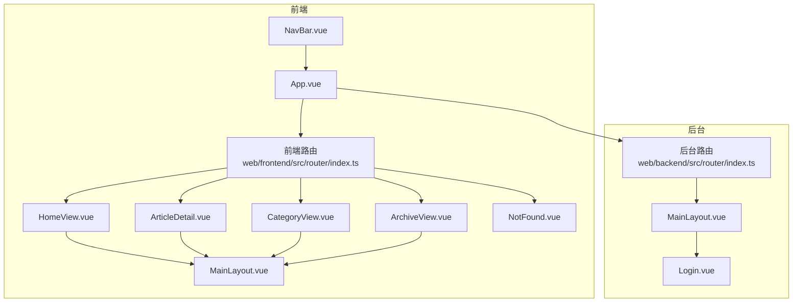
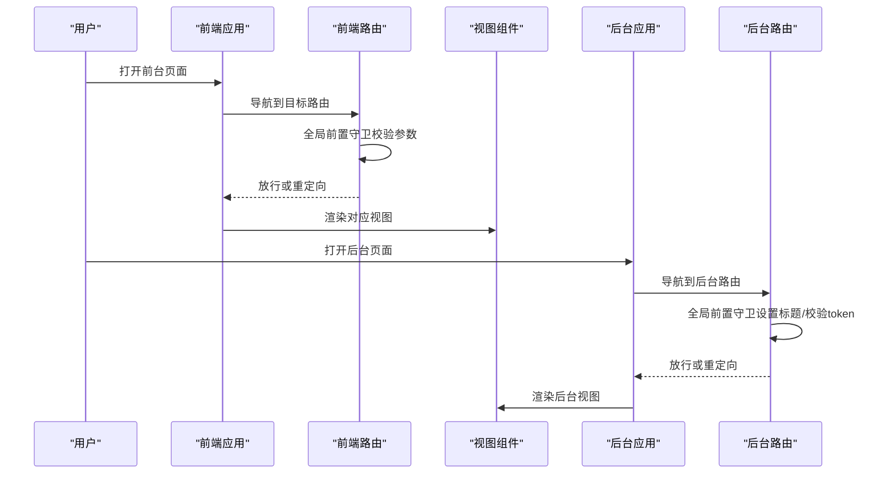
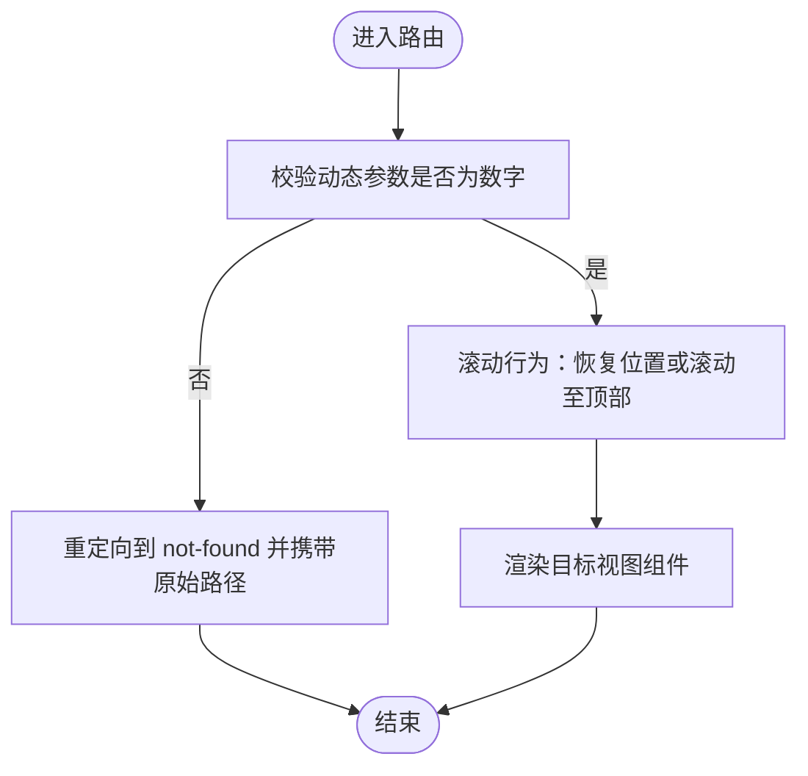
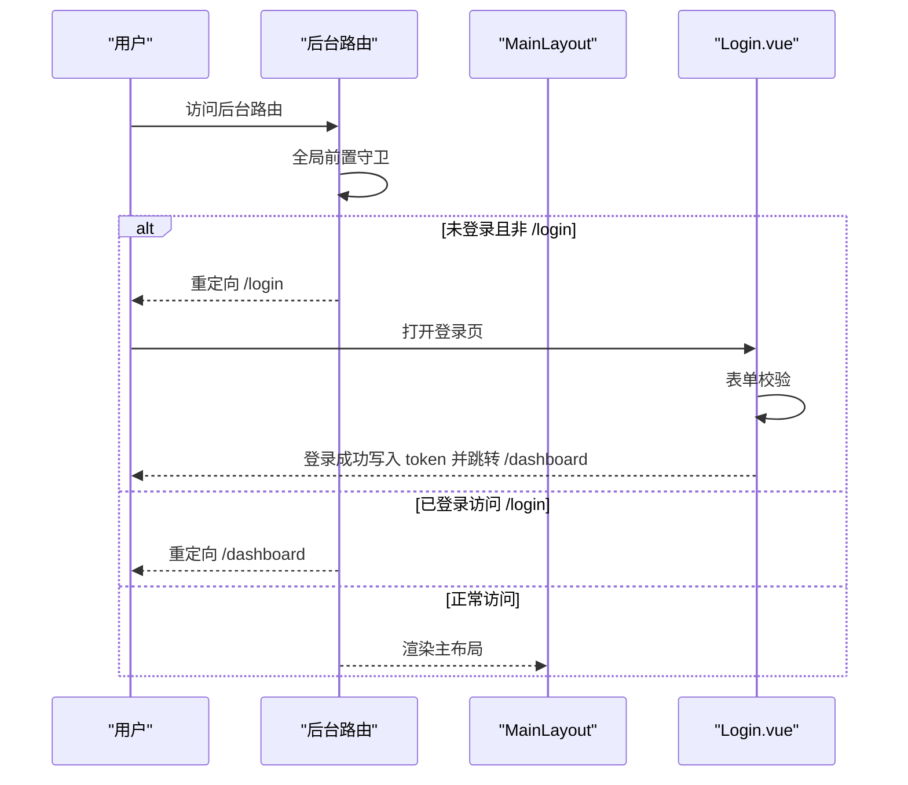
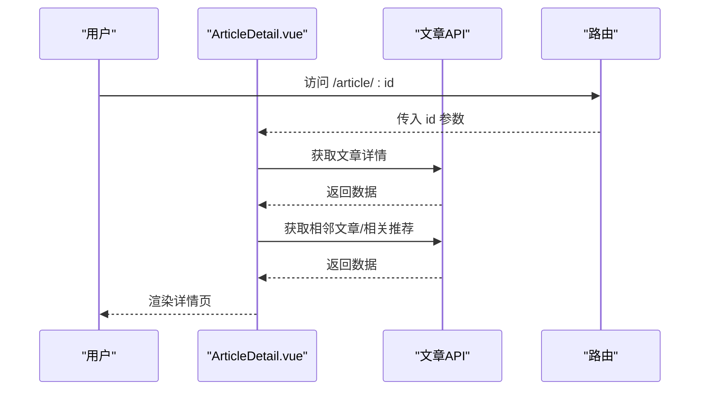
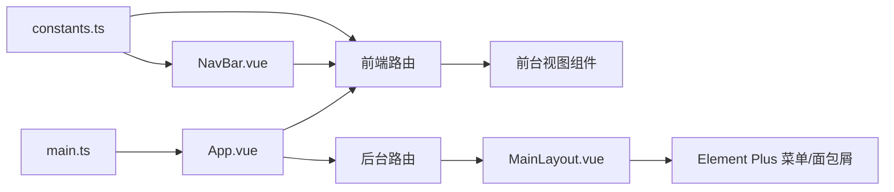

# 路由与导航

<cite>
**本文引用的文件**
- [web/frontend/src/router/index.ts](file://web/frontend/src/router/index.ts)
- [web/backend/src/router/index.ts](file://web/backend/src/router/index.ts)
- [web/frontend/src/views/HomeView.vue](file://web/frontend/src/views/HomeView.vue)
- [web/frontend/src/views/ArticleDetail.vue](file://web/frontend/src/views/ArticleDetail.vue)
- [web/frontend/src/views/CategoryView.vue](file://web/frontend/src/views/CategoryView.vue)
- [web/frontend/src/views/ArchiveView.vue](file://web/frontend/src/views/ArchiveView.vue)
- [web/frontend/src/views/NotFound.vue](file://web/frontend/src/views/NotFound.vue)
- [web/frontend/src/components/layout/MainLayout.vue](file://web/frontend/src/components/layout/MainLayout.vue)
- [web/frontend/src/App.vue](file://web/frontend/src/App.vue)
- [web/frontend/src/main.ts](file://web/frontend/src/main.ts)
- [web/frontend/src/components/NavBar.vue](file://web/frontend/src/components/NavBar.vue)
- [web/frontend/src/components/Sidebar.vue](file://web/frontend/src/components/Sidebar.vue)
- [web/frontend/src/utils/constants.ts](file://web/frontend/src/utils/constants.ts)
- [web/backend/src/layouts/MainLayout.vue](file://web/backend/src/layouts/MainLayout.vue)
- [web/backend/src/views/Login.vue](file://web/backend/src/views/Login.vue)
</cite>

## 目录
1. [简介](#简介)
2. [项目结构](#项目结构)
3. [核心组件](#核心组件)
4. [架构总览](#架构总览)
5. [详细组件分析](#详细组件分析)
6. [依赖关系分析](#依赖关系分析)
7. [性能考量](#性能考量)
8. [故障排查指南](#故障排查指南)
9. [结论](#结论)
10. [附录](#附录)

## 简介
本文件面向 YanBlog 前后端路由与导航体系，系统化梳理 Vue Router 的配置、路由守卫、权限控制、嵌套路由、导航菜单动态生成与高亮、参数与查询字符串处理、懒加载优化、面包屑与页面标题管理、过渡动画与页面切换效果、404 错误处理与错误边界，以及开发者的优化建议与最佳实践。

## 项目结构
- 前端路由位于 web/frontend/src/router/index.ts，采用 history 模式，集中定义前台页面路由与全局前置守卫。
- 后台路由位于 web/backend/src/router/index.ts，采用 history 模式，定义后台管理页面与全局前置守卫；通过 MainLayout 嵌套子路由实现菜单与面包屑联动。
- 导航组件位于 web/frontend/src/components/NavBar.vue，负责前台主导航与移动端抽屉菜单；后台侧边栏与面包屑由 web/backend/src/layouts/MainLayout.vue 提供。
- 页面视图组件位于 web/frontend/src/views 与 web/backend/src/views，承载具体业务功能。
- 页面切换与过渡动画由 web/frontend/src/App.vue 中的 Transition 控制。

**图表来源**
- [web/frontend/src/router/index.ts:1-73](file://web/frontend/src/router/index.ts#L1-L73)
- [web/backend/src/router/index.ts:1-190](file://web/backend/src/router/index.ts#L1-L190)
- [web/frontend/src/views/HomeView.vue:1-133](file://web/frontend/src/views/HomeView.vue#L1-L133)
- [web/frontend/src/views/ArticleDetail.vue:1-800](file://web/frontend/src/views/ArticleDetail.vue#L1-L800)
- [web/frontend/src/views/CategoryView.vue:1-375](file://web/frontend/src/views/CategoryView.vue#L1-L375)
- [web/frontend/src/views/ArchiveView.vue:1-800](file://web/frontend/src/views/ArchiveView.vue#L1-L800)
- [web/frontend/src/views/NotFound.vue:1-184](file://web/frontend/src/views/NotFound.vue#L1-L184)
- [web/frontend/src/components/layout/MainLayout.vue:1-130](file://web/frontend/src/components/layout/MainLayout.vue#L1-L130)
- [web/frontend/src/App.vue:1-215](file://web/frontend/src/App.vue#L1-L215)
- [web/backend/src/layouts/MainLayout.vue:1-245](file://web/backend/src/layouts/MainLayout.vue#L1-L245)
- [web/backend/src/views/Login.vue:1-170](file://web/backend/src/views/Login.vue#L1-L170)

**章节来源**
- [web/frontend/src/router/index.ts:1-73](file://web/frontend/src/router/index.ts#L1-L73)
- [web/backend/src/router/index.ts:1-190](file://web/backend/src/router/index.ts#L1-L190)
- [web/frontend/src/App.vue:1-215](file://web/frontend/src/App.vue#L1-L215)

## 核心组件
- 前端路由与守卫
  - 历史模式路由，定义首页、文章列表、文章详情、分类列表、分类页、归档、关于、404 等路由。
  - 全局前置守卫进行参数校验（动态参数必须为数字），非法则重定向至 404。
  - 滚动行为：优先恢复历史滚动位置，否则滚动至顶部。
- 后台路由与守卫
  - 历史模式路由，定义登录、仪表板、用户管理、分类管理、标签管理、文章管理、媒体库、系统设置（含子路由）等。
  - 全局前置守卫：设置页面标题；校验 token，未登录跳转登录，已登录访问登录页则跳转首页。
  - 嵌套路由：以 MainLayout 为容器，children 定义子路由，支持面包屑与菜单高亮联动。
- 导航与布局
  - 前台：NavBar 提供主导航、移动端抽屉菜单、主题切换、搜索、阅读进度等；MainLayout 提供三栏布局插槽。
  - 后台：MainLayout 提供侧边栏菜单、面包屑、顶部栏与下拉登出；系统设置子路由通过 activeMenu 实现菜单高亮。
- 视图组件
  - HomeView：首页聚合内容，含置顶与最新文章加载、分页加载。
  - ArticleDetail：文章详情页，含目录悬浮、图片查看器、上下文导航、相关推荐、评论区。
  - CategoryView：分类列表页，含分类卡片、置顶排序、滚动加载。
  - ArchiveView：归档页，含标签过滤、贡献热力图、年月时间轴、年份快速导航。
  - NotFound：404 页面，含返回首页与返回上一页操作。
- 过渡与动画
  - App.vue 使用 Transition 控制页面切换淡入淡出与位移动画。
  - 各页面内使用局部动画（如 HomeView 的入场动画、NotFound 的浮动猫动画）。

**章节来源**
- [web/frontend/src/router/index.ts:1-73](file://web/frontend/src/router/index.ts#L1-L73)
- [web/backend/src/router/index.ts:1-190](file://web/backend/src/router/index.ts#L1-L190)
- [web/frontend/src/components/NavBar.vue:1-800](file://web/frontend/src/components/NavBar.vue#L1-L800)
- [web/frontend/src/components/layout/MainLayout.vue:1-130](file://web/frontend/src/components/layout/MainLayout.vue#L1-L130)
- [web/frontend/src/views/HomeView.vue:1-133](file://web/frontend/src/views/HomeView.vue#L1-L133)
- [web/frontend/src/views/ArticleDetail.vue:1-800](file://web/frontend/src/views/ArticleDetail.vue#L1-L800)
- [web/frontend/src/views/CategoryView.vue:1-375](file://web/frontend/src/views/CategoryView.vue#L1-L375)
- [web/frontend/src/views/ArchiveView.vue:1-800](file://web/frontend/src/views/ArchiveView.vue#L1-L800)
- [web/frontend/src/views/NotFound.vue:1-184](file://web/frontend/src/views/NotFound.vue#L1-L184)
- [web/frontend/src/App.vue:1-215](file://web/frontend/src/App.vue#L1-L215)

## 架构总览
前后端路由分别独立构建，前端负责访客侧内容浏览与交互，后台负责管理侧权限与内容管理。前端路由通过全局守卫保证参数合法性与基础体验；后台路由通过全局守卫统一鉴权与标题管理，并通过嵌套路由与菜单元信息实现面包屑与高亮联动。

**图表来源**
- [web/frontend/src/router/index.ts:60-70](file://web/frontend/src/router/index.ts#L60-L70)
- [web/backend/src/router/index.ts:169-188](file://web/backend/src/router/index.ts#L169-L188)
- [web/frontend/src/App.vue:10-17](file://web/frontend/src/App.vue#L10-L17)

## 详细组件分析

### 前端路由与导航
- 路由规则
  - 首页：根路径，组件为 HomeView。
  - 文章列表：/articles，组件懒加载。
  - 文章详情：/article/:id，props 透传，组件懒加载。
  - 分类列表：/category/:id，props 透传，组件懒加载。
  - 分类页：/categories，组件懒加载。
  - 归档：/archive，组件懒加载。
  - 关于：/about，组件懒加载。
  - 404兜底：/:pathMatch(.*)*，组件懒加载。
- 参数校验与重定向
  - 全局前置守卫对动态参数 id 校验，非数字重定向至 not-found 并携带原始路径。
- 滚动行为
  - 优先恢复历史滚动位置，否则滚动至顶部。
- 导航高亮
  - 前台 NavBar 通过 $route.name 与路由 name 对比实现高亮。
  - 常量 ROUTES 集中管理路由名称，便于跨组件引用。
- 查询字符串处理
  - 搜索框通过 router.push({ name: 'articles', query }) 实现查询参数传递。
- 路由懒加载
  - 所有页面组件均采用动态导入实现懒加载，减少首屏体积。
- 过渡动画
  - App.vue 使用 Transition 控制页面切换的进入/离开动画。

**图表来源**
- [web/frontend/src/router/index.ts:60-70](file://web/frontend/src/router/index.ts#L60-L70)
- [web/frontend/src/router/index.ts:50-57](file://web/frontend/src/router/index.ts#L50-L57)

**章节来源**
- [web/frontend/src/router/index.ts:1-73](file://web/frontend/src/router/index.ts#L1-L73)
- [web/frontend/src/utils/constants.ts:37-47](file://web/frontend/src/utils/constants.ts#L37-L47)
- [web/frontend/src/components/NavBar.vue:23-55](file://web/frontend/src/components/NavBar.vue#L23-L55)
- [web/frontend/src/App.vue:10-17](file://web/frontend/src/App.vue#L10-L17)

### 后台路由与权限控制
- 路由规则
  - 登录：/login，设置 meta.title，组件懒加载。
  - 首页重定向：/ -> /dashboard。
  - 嵌套路由：以 MainLayout 为容器，children 包含仪表板、用户管理、分类管理、标签管理、文章管理、媒体库、系统设置（含 status/config/backend/about 子路由）。
- 权限控制
  - 全局前置守卫：读取 localStorage.token，未登录且非 /login 则重定向 /login；已登录访问 /login 则重定向 /dashboard。
  - 页面标题：若 meta.title 存在则设置 document.title。
- 面包屑与菜单高亮
  - 面包屑：computed 通过 route.matched 过滤 meta.title 生成。
  - 菜单高亮：computed 通过 meta.activeMenu 或当前 path 决定默认激活项。
- 登录流程
  - Login.vue 表单校验后调用 API 获取 token，成功后写入 localStorage 并跳转 /dashboard。

**图表来源**
- [web/backend/src/router/index.ts:169-188](file://web/backend/src/router/index.ts#L169-L188)
- [web/backend/src/layouts/MainLayout.vue:143-159](file://web/backend/src/layouts/MainLayout.vue#L143-L159)
- [web/backend/src/views/Login.vue:87-127](file://web/backend/src/views/Login.vue#L87-L127)

**章节来源**
- [web/backend/src/router/index.ts:1-190](file://web/backend/src/router/index.ts#L1-L190)
- [web/backend/src/layouts/MainLayout.vue:1-245](file://web/backend/src/layouts/MainLayout.vue#L1-L245)
- [web/backend/src/views/Login.vue:1-170](file://web/backend/src/views/Login.vue#L1-L170)

### 导航菜单与高亮机制
- 前台导航
  - NavBar 通过 $route.name 与 ROUTES 常量对比，实现主导航与移动端菜单的高亮。
  - 搜索框支持回车提交，将查询参数附加到 articles 路由。
- 后台导航
  - MainLayout.el-menu 通过 router=true 自动绑定菜单项与路由。
  - 面包屑通过 route.matched 过滤 meta.title 生成，支持 activeMenu 覆盖。
- 响应式与交互
  - NavBar 在滚动时切换标题与导航样式，移动端抽屉菜单支持背景滚动禁用与遮罩层。
  - Sidebar 组件聚合多个侧边栏卡片，支持统一刷新。

**章节来源**
- [web/frontend/src/components/NavBar.vue:1-800](file://web/frontend/src/components/NavBar.vue#L1-L800)
- [web/frontend/src/utils/constants.ts:37-47](file://web/frontend/src/utils/constants.ts#L37-L47)
- [web/backend/src/layouts/MainLayout.vue:1-245](file://web/backend/src/layouts/MainLayout.vue#L1-L245)
- [web/frontend/src/components/Sidebar.vue:1-80](file://web/frontend/src/components/Sidebar.vue#L1-L80)

### 页面与数据流
- 首页
  - HomeView 聚合置顶与最新文章，支持“加载更多”分页。
- 文章详情
  - ArticleDetail 通过路由参数获取文章 ID，懒加载详情、相邻文章与相关推荐；支持图片查看器与目录悬浮。
- 分类与归档
  - CategoryView 展示分类卡片并支持滚动加载；ArchiveView 展示标签过滤、贡献热力图与年月时间轴。
- 404 页面
  - NotFound 提供返回首页与返回上一页操作，增强错误体验。

**图表来源**
- [web/frontend/src/router/index.ts:18-22](file://web/frontend/src/router/index.ts#L18-L22)
- [web/frontend/src/views/ArticleDetail.vue:222-250](file://web/frontend/src/views/ArticleDetail.vue#L222-L250)

**章节来源**
- [web/frontend/src/views/HomeView.vue:1-133](file://web/frontend/src/views/HomeView.vue#L1-L133)
- [web/frontend/src/views/ArticleDetail.vue:1-800](file://web/frontend/src/views/ArticleDetail.vue#L1-L800)
- [web/frontend/src/views/CategoryView.vue:1-375](file://web/frontend/src/views/CategoryView.vue#L1-L375)
- [web/frontend/src/views/ArchiveView.vue:1-800](file://web/frontend/src/views/ArchiveView.vue#L1-L800)
- [web/frontend/src/views/NotFound.vue:1-184](file://web/frontend/src/views/NotFound.vue#L1-L184)

### 面包屑与页面标题管理
- 前台
  - 通过路由 meta.title 设置页面标题；全局守卫在 beforeEach 中设置 document.title。
- 后台
  - 通过 route.matched 过滤 meta.title 生成面包屑；菜单高亮通过 activeMenu 或当前 path 决定。
- 统一策略
  - 建议在路由 meta 中统一维护 title，避免硬编码；后台通过 computed 动态生成面包屑，提升一致性。

**章节来源**
- [web/frontend/src/router/index.ts:60-70](file://web/frontend/src/router/index.ts#L60-L70)
- [web/backend/src/router/index.ts:169-174](file://web/backend/src/router/index.ts#L169-L174)
- [web/backend/src/layouts/MainLayout.vue:143-159](file://web/backend/src/layouts/MainLayout.vue#L143-L159)

### 路由过渡动画与页面切换
- 页面切换
  - App.vue 使用 Transition 控制 router-view 的进入/离开动画，配合 fade 类型实现平滑过渡。
- 页面内动画
  - 各页面内使用局部动画（如 HomeView 的 fadeIn、NotFound 的浮动猫动画）提升交互体验。
- 建议
  - 可结合 keep-alive 缓存常用页面，减少重复请求与渲染成本。

**章节来源**
- [web/frontend/src/App.vue:10-17](file://web/frontend/src/App.vue#L10-L17)
- [web/frontend/src/App.vue:197-210](file://web/frontend/src/App.vue#L197-L210)
- [web/frontend/src/views/HomeView.vue:119-128](file://web/frontend/src/views/HomeView.vue#L119-L128)
- [web/frontend/src/views/NotFound.vue:160-164](file://web/frontend/src/views/NotFound.vue#L160-L164)

### 404 页面与错误边界
- 404 路由
  - 前台与后台均提供兜底路由，前台指向 NotFound，后台指向 /login。
- 参数校验
  - 前台全局守卫对非法动态参数进行拦截并重定向至 404。
- 全局错误处理
  - 前端应用配置全局 errorHandler，捕获子组件异常，避免白屏。

**章节来源**
- [web/frontend/src/router/index.ts:44-48](file://web/frontend/src/router/index.ts#L44-L48)
- [web/backend/src/router/index.ts:156-160](file://web/backend/src/router/index.ts#L156-L160)
- [web/frontend/src/router/index.ts:60-70](file://web/frontend/src/router/index.ts#L60-L70)
- [web/frontend/src/main.ts:21-26](file://web/frontend/src/main.ts#L21-L26)

## 依赖关系分析
- 前端路由依赖
  - App.vue 注入 router 与 Pinia，全局错误处理。
  - 各视图组件依赖 API 服务与工具函数（如数据映射、常量）。
- 后台路由依赖
  - MainLayout 依赖 Element Plus 菜单与面包屑，依赖路由实例计算面包屑与高亮。
  - Login.vue 依赖表单校验与 API 登录接口。
- 组件耦合
  - NavBar 与路由强关联，依赖 $route 与路由 name。
  - MainLayout 作为容器组件，承载菜单、面包屑与内容区域。

**图表来源**
- [web/frontend/src/main.ts:1-28](file://web/frontend/src/main.ts#L1-L28)
- [web/frontend/src/App.vue:1-215](file://web/frontend/src/App.vue#L1-L215)
- [web/frontend/src/router/index.ts:1-73](file://web/frontend/src/router/index.ts#L1-L73)
- [web/backend/src/router/index.ts:1-190](file://web/backend/src/router/index.ts#L1-L190)
- [web/frontend/src/components/NavBar.vue:1-800](file://web/frontend/src/components/NavBar.vue#L1-L800)
- [web/frontend/src/utils/constants.ts:1-48](file://web/frontend/src/utils/constants.ts#L1-L48)
- [web/backend/src/layouts/MainLayout.vue:1-245](file://web/backend/src/layouts/MainLayout.vue#L1-L245)

**章节来源**
- [web/frontend/src/main.ts:1-28](file://web/frontend/src/main.ts#L1-L28)
- [web/frontend/src/App.vue:1-215](file://web/frontend/src/App.vue#L1-L215)
- [web/frontend/src/components/NavBar.vue:1-800](file://web/frontend/src/components/NavBar.vue#L1-L800)
- [web/frontend/src/utils/constants.ts:1-48](file://web/frontend/src/utils/constants.ts#L1-L48)

## 性能考量
- 路由懒加载
  - 所有页面组件采用动态导入，减少首屏 JS 体积，提升初始加载速度。
- keep-alive
  - 后台 MainLayout 使用 keep-alive 包裹 router-view，缓存页面状态，降低重复渲染与请求成本。
- 分页与无限滚动
  - 首页与归档页采用分页与滚动加载，避免一次性加载大量数据。
- 过渡与动画
  - 合理使用 Transition 与局部动画，避免过度动画影响性能。
- 建议
  - 对高频访问页面（如首页、文章列表）可考虑预取部分数据或使用缓存策略。
  - 对图片资源启用懒加载指令（如 v-lazy），减少首屏带宽占用。

**章节来源**
- [web/frontend/src/router/index.ts:15-27](file://web/frontend/src/router/index.ts#L15-L27)
- [web/backend/src/layouts/MainLayout.vue:89-93](file://web/backend/src/layouts/MainLayout.vue#L89-L93)
- [web/frontend/src/views/HomeView.vue:79-100](file://web/frontend/src/views/HomeView.vue#L79-L100)
- [web/frontend/src/views/ArchiveView.vue:325-340](file://web/frontend/src/views/ArchiveView.vue#L325-L340)

## 故障排查指南
- 404 与参数错误
  - 若访问 /article/:id 报错，检查 id 是否为纯数字；非法参数会被全局守卫拦截并重定向至 404。
- 登录与权限
  - 未登录访问后台路由会被重定向至 /login；已登录访问 /login 会被重定向至 /dashboard。
  - 登录成功后需确保 token 写入 localStorage，否则后续路由守卫会持续重定向。
- 面包屑与菜单高亮
  - 若面包屑不显示，检查路由 meta.title 是否正确设置；若菜单未高亮，检查 meta.activeMenu 或当前 path。
- 页面切换动画
  - 若过渡动画异常，检查 App.vue 中 Transition 的 name 与类名是否一致。
- 全局错误
  - 若出现白屏，检查全局 errorHandler 是否捕获到异常并记录日志。

**章节来源**
- [web/frontend/src/router/index.ts:60-70](file://web/frontend/src/router/index.ts#L60-L70)
- [web/backend/src/router/index.ts:169-188](file://web/backend/src/router/index.ts#L169-L188)
- [web/backend/src/layouts/MainLayout.vue:143-159](file://web/backend/src/layouts/MainLayout.vue#L143-L159)
- [web/frontend/src/main.ts:21-26](file://web/frontend/src/main.ts#L21-L26)

## 结论
YanBlog 的路由与导航体系在前后端分离场景下实现了清晰的职责划分：前台路由强调用户体验与性能优化（懒加载、过渡动画、参数校验），后台路由强调安全与可维护性（权限守卫、嵌套路由、面包屑与菜单联动）。通过统一的路由命名、元信息与全局守卫，系统在易用性与稳定性之间取得了良好平衡。建议在后续迭代中进一步完善缓存策略与错误边界，持续优化首屏性能与交互体验。

## 附录
- 开发者建议
  - 统一管理路由名称与元信息，避免硬编码。
  - 对关键页面使用 keep-alive 缓存，减少重复请求。
  - 对图片与静态资源启用懒加载与压缩，优化首屏加载。
  - 在路由守卫中增加更细粒度的日志与埋点，便于问题定位。
  - 对 404 与错误页面进行 A/B 测试，收集用户反馈并持续改进。