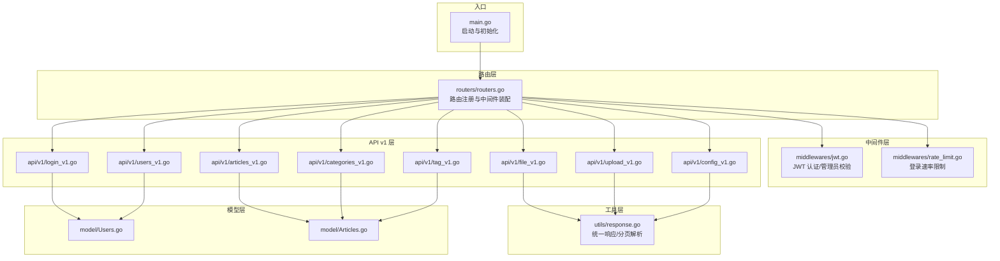
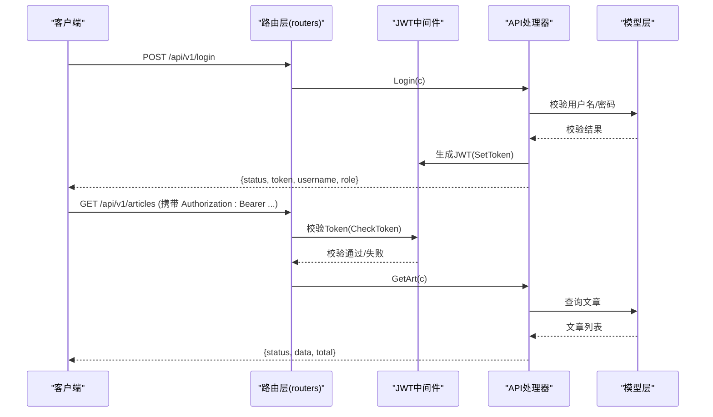
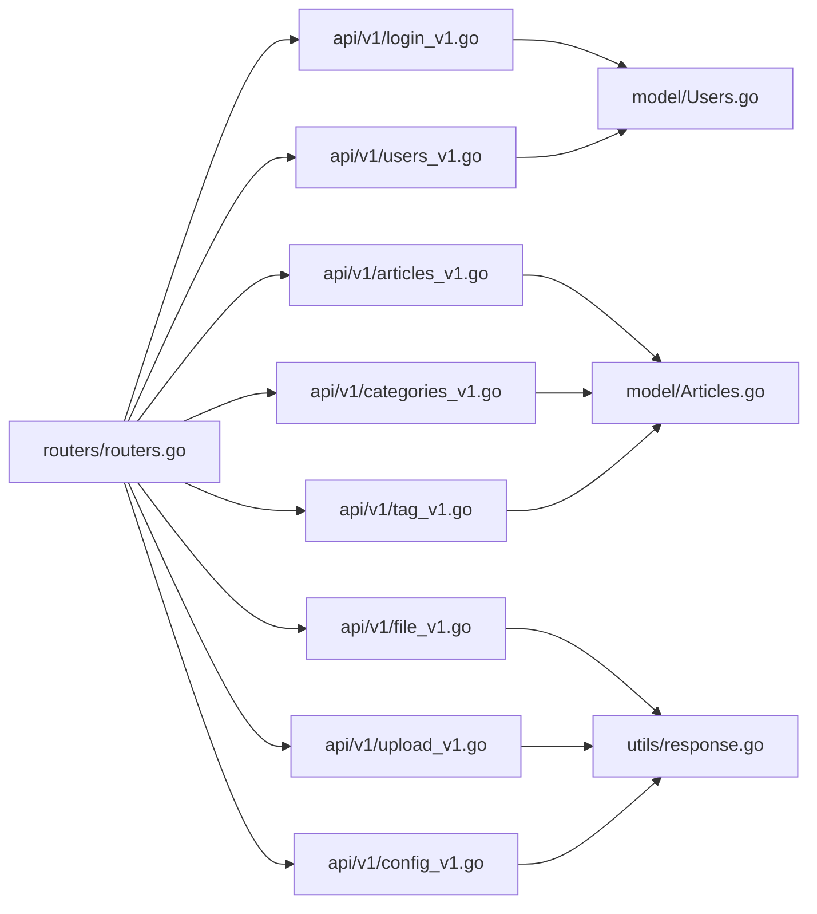
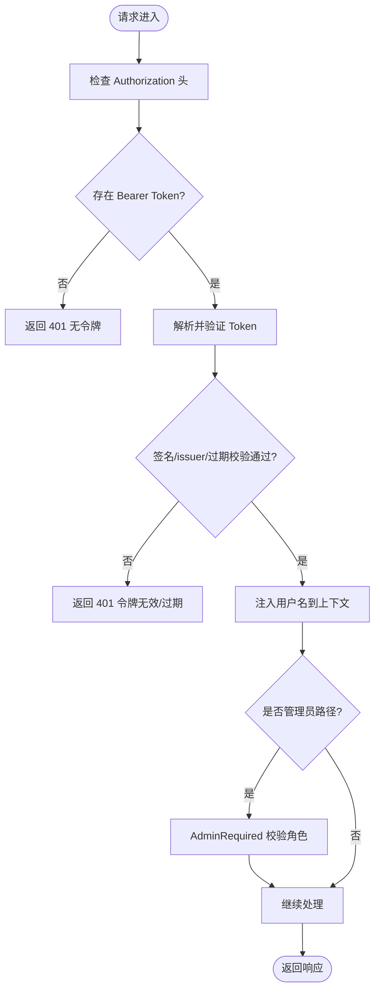
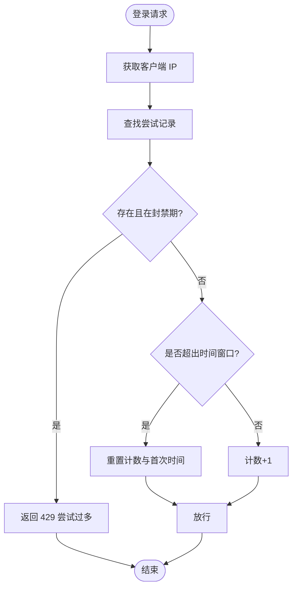

# 后端 API 接口

<cite>
**本文引用的文件**
- [main.go](file://main.go)
- [routers.go](file://routers/routers.go)
- [jwt.go](file://middlewares/jwt.go)
- [rate_limit.go](file://middlewares/rate_limit.go)
- [response.go](file://utils/response.go)
- [login_v1.go](file://api/v1/login_v1.go)
- [users_v1.go](file://api/v1/users_v1.go)
- [articles_v1.go](file://api/v1/articles_v1.go)
- [categories_v1.go](file://api/v1/categories_v1.go)
- [tag_v1.go](file://api/v1/tag_v1.go)
- [upload_v1.go](file://api/v1/upload_v1.go)
- [file_v1.go](file://api/v1/file_v1.go)
- [config_v1.go](file://api/v1/config_v1.go)
- [Users.go](file://model/Users.go)
- [Articles.go](file://model/Articles.go)
</cite>

## 目录
1. [简介](#简介)
2. [项目结构](#项目结构)
3. [核心组件](#核心组件)
4. [架构总览](#架构总览)
5. [详细组件分析](#详细组件分析)
6. [依赖分析](#依赖分析)
7. [性能考量](#性能考量)
8. [故障排查指南](#故障排查指南)
9. [结论](#结论)
10. [附录](#附录)

## 简介
本文件为 YanBlog 后端 API 的完整接口文档，覆盖用户管理、文章管理、分类标签、文件上传与管理、系统配置与状态、健康检查等核心能力。文档详细说明 RESTful 端点、HTTP 方法、URL 模式、请求参数、响应格式、状态码、JWT 认证与权限控制流程，并提供最佳实践建议（版本管理、速率限制、安全考虑）。

## 项目结构
后端采用 Gin 框架组织路由，按功能模块划分 v1 API 层，中间件层负责日志、CORS、JWT 认证与登录速率限制，工具层提供统一响应封装与分页解析，模型层封装数据库访问与业务规则。

图表来源
- [main.go:12-31](file://main.go#L12-L31)
- [routers.go:13-122](file://routers/routers.go#L13-L122)
- [jwt.go:100-157](file://middlewares/jwt.go#L100-L157)
- [rate_limit.go:50-98](file://middlewares/rate_limit.go#L50-L98)
- [response.go:17-100](file://utils/response.go#L17-L100)
- [login_v1.go:13-59](file://api/v1/login_v1.go#L13-L59)
- [users_v1.go:15-283](file://api/v1/users_v1.go#L15-L283)
- [articles_v1.go:18-273](file://api/v1/articles_v1.go#L18-L273)
- [categories_v1.go:15-166](file://api/v1/categories_v1.go#L15-L166)
- [tag_v1.go:12-74](file://api/v1/tag_v1.go#L12-L74)
- [file_v1.go:40-663](file://api/v1/file_v1.go#L40-L663)
- [upload_v1.go:27-94](file://api/v1/upload_v1.go#L27-L94)
- [config_v1.go:16-273](file://api/v1/config_v1.go#L16-L273)
- [Users.go:11-245](file://model/Users.go#L11-L245)
- [Articles.go:11-389](file://model/Articles.go#L11-L389)

章节来源
- [main.go:12-31](file://main.go#L12-L31)
- [routers.go:13-122](file://routers/routers.go#L13-L122)

## 核心组件
- 路由与中间件
  - 路由注册：统一前缀 api/v1，按“公共”“认证”“管理员”三组划分。
  - 中间件：日志、恢复、Gzip 压缩、CORS、JWT 认证、管理员权限、登录速率限制。
- 统一响应与分页
  - Success/Error/SuccessWithTotal/BadRequest/NotFound 等封装，固定 status/data/message 结构。
  - ParsePageParams 解析 pagesize/pagenum，限制最大页大小，支持“查全部”模式。
- JWT 与权限
  - SetToken/CheckToken 生成与校验；AdminRequired 限制管理员；JwtToken 注入用户名上下文。
  - 登录速率限制 LoginRateLimit 防暴力破解。
- 数据模型
  - 用户：角色码 1 超级管理员、2 管理员、3 普通用户；密码加密存储。
  - 文章：Markdown/PDF 类型、置顶等级、标签关联、归档统计、相邻文章、热门排行、随机文章。

章节来源
- [routers.go:13-122](file://routers/routers.go#L13-L122)
- [jwt.go:15-157](file://middlewares/jwt.go#L15-L157)
- [rate_limit.go:17-98](file://middlewares/rate_limit.go#L17-L98)
- [response.go:17-100](file://utils/response.go#L17-L100)
- [Users.go:11-245](file://model/Users.go#L11-L245)
- [Articles.go:11-389](file://model/Articles.go#L11-L389)

## 架构总览
以下序列图展示登录与受保护资源访问的关键流程。

图表来源
- [routers.go:13-122](file://routers/routers.go#L13-L122)
- [jwt.go:27-157](file://middlewares/jwt.go#L27-L157)
- [login_v1.go:13-59](file://api/v1/login_v1.go#L13-L59)
- [articles_v1.go:92-98](file://api/v1/articles_v1.go#L92-L98)
- [Users.go:214-245](file://model/Users.go#L214-L245)
- [Articles.go:151-178](file://model/Articles.go#L151-L178)

## 详细组件分析

### 认证与权限
- JWT 令牌
  - 生成：SetToken(username) 使用 HS256 签名，默认 10 小时过期。
  - 校验：CheckToken(token) 解析并验证签名、issuer、过期时间。
  - 注入：JwtToken 中间件从 Authorization 头提取 Bearer token，校验后将 username 写入上下文。
- 管理员权限
  - AdminRequired：根据用户角色码限制为 1 或 2，否则拒绝。
- 登录速率限制
  - LoginRateLimit：每 IP 15 分钟最多 5 次尝试，超过封禁 30 分钟。

章节来源
- [jwt.go:15-157](file://middlewares/jwt.go#L15-L157)
- [rate_limit.go:17-98](file://middlewares/rate_limit.go#L17-L98)

### 用户管理
- 端点
  - POST /api/v1/user/add（管理员）
  - PUT /api/v1/user/:id（管理员）
  - DELETE /api/v1/user/:id（管理员）
  - GET /api/v1/users（认证）
  - GET /api/v1/users/search（认证）
- 请求参数
  - 新增/编辑：JSON 包含 username、role 等；新增时密码参与校验与加密。
  - 查询：支持 pagesize/pagenum；搜索支持 keyword、role。
- 权限规则
  - 超级管理员可创建管理员与普通用户，不可创建超级管理员；不可降权自身角色。
  - 管理员仅可创建普通用户，不可修改超级管理员与其它管理员角色。
  - 普通用户仅可修改自身资料与角色不变。
- 响应
  - 统一结构：status、data、message；分页接口返回 total。

章节来源
- [routers.go:48-54](file://routers/routers.go#L48-L54)
- [users_v1.go:15-283](file://api/v1/users_v1.go#L15-L283)
- [Users.go:11-245](file://model/Users.go#L11-L245)
- [response.go:17-100](file://utils/response.go#L17-L100)

### 文章管理
- 端点
  - POST /api/v1/article/add（管理员）
  - POST /api/v1/article/zip（管理员）
  - POST /api/v1/article/zip/batch（管理员）
  - PUT /api/v1/article/:id（管理员）
  - DELETE /api/v1/article/:id（管理员）
  - POST /api/v1/article/batch-delete（管理员）
  - GET /api/v1/article
  - GET /api/v1/article/search
  - GET /api/v1/article/top
  - GET /api/v1/article/hot
  - GET /api/v1/article/random
  - GET /api/v1/article/related/:id
  - GET /api/v1/article/adjacent/:id
  - GET /api/v1/article/archive
  - GET /api/v1/article/list/:id
  - GET /api/v1/article/info/:id
- 请求参数
  - 新增：JSON 包含 title、cid、desc、content、img、top、tags、type、pdf_url、createdAt。
  - 搜索：keyword、cid；分页 pagesize/pagenum。
  - 置顶/热门：num（默认值限制）。
  - 批量删除：JSON 包含 ids 数组。
- 响应
  - 列表/详情：统一结构；分页返回 total；邻接文章返回 previous/next。
  - 编辑时若标题变更，自动重命名上传目录并替换内容中的旧链接。

章节来源
- [routers.go:58-66](file://routers/routers.go#L58-L66)
- [routers.go:102-111](file://routers/routers.go#L102-L111)
- [articles_v1.go:18-273](file://api/v1/articles_v1.go#L18-L273)
- [Articles.go:11-389](file://model/Articles.go#L11-L389)
- [response.go:17-100](file://utils/response.go#L17-L100)

### 分类管理
- 端点
  - POST /api/v1/category/add（管理员）
  - PUT /api/v1/category/:id（管理员）
  - DELETE /api/v1/category/:id（管理员，支持 force 强制删除关联文章）
  - GET /api/v1/category
  - GET /api/v1/category/search
  - GET /api/v1/category/info/:id
- 请求参数
  - 新增/编辑：JSON 包含 name、img、top 等；top 默认 0。
  - 删除：query 参数 force 控制是否删除关联文章。
- 响应
  - 统一结构；删除时如存在封面图会尝试删除本地文件。

章节来源
- [routers.go:54-57](file://routers/routers.go#L54-L57)
- [categories_v1.go:15-166](file://api/v1/categories_v1.go#L15-L166)
- [Articles.go:11-389](file://model/Articles.go#L11-L389)

### 标签管理
- 端点
  - POST /api/v1/tags/add（管理员）
  - PUT /api/v1/tags/:id（管理员）
  - DELETE /api/v1/tags/:id（管理员）
  - GET /api/v1/tags（公开）
- 请求参数
  - 新增/编辑：JSON 包含 name。
  - 搜索：支持 keyword、role（同用户搜索）。
- 响应
  - 统一结构；分页返回 total。

章节来源
- [routers.go:66-69](file://routers/routers.go#L66-L69)
- [tag_v1.go:12-74](file://api/v1/tag_v1.go#L12-L74)
- [Articles.go:11-389](file://model/Articles.go#L11-L389)

### 文件上传与管理
- 上传
  - POST /api/v1/upload（管理员）
  - 支持类型：图片、PDF、Office、音视频、文本、压缩包、JSON、CSV、XML 等。
  - 单文件最大 10MB；校验扩展名白名单；文章类型上传时校验标题冲突。
- 文件管理
  - GET /api/v1/files（认证）：列出 uploads 下文件/目录，识别图片并生成缩略图 URL。
  - DELETE /api/v1/files（管理员）：删除文件或目录（路径安全校验）。
  - POST /api/v1/files/folder（管理员）：创建目录。
  - PUT /api/v1/files（管理员）：重命名。
  - POST /api/v1/files/move（管理员）：移动。
  - POST /api/v1/files/copy（管理员）：复制。
  - POST /api/v1/files/batch-delete（管理员）：批量删除。
  - POST /api/v1/files/batch-upload（管理员）：批量上传。
  - GET /api/v1/files/stats（认证）：统计文件/目录/大小。
- 安全
  - 所有路径操作均进行安全路径校验，防止路径穿越；目录不存在或非法路径返回错误。

章节来源
- [routers.go:70-81](file://routers/routers.go#L70-L81)
- [upload_v1.go:13-94](file://api/v1/upload_v1.go#L13-L94)
- [file_v1.go:16-663](file://api/v1/file_v1.go#L16-L663)
- [response.go:17-100](file://utils/response.go#L17-L100)

### 系统配置与状态
- 前端配置
  - GET /api/v1/frontend/config（公开）：读取前端配置文件内容（禁用缓存）。
  - PUT /api/v1/frontend/config（管理员）：更新前端配置（YAML 校验）。
- 后端配置
  - GET /api/v1/backend/config（管理员）：返回安全配置（隐藏敏感字段）。
  - PUT /api/v1/backend/config（管理员）：更新后端配置（字段白名单校验），并重载配置与刷新 JWT 密钥。
  - POST /api/v1/config/reload（管理员）：重新加载配置并刷新 JWT 密钥。
  - GET /api/v1/config/all（管理员）：同时返回后端与前端配置。
- 系统状态
  - GET /api/v1/system/status（管理员）：系统状态信息。
- 健康检查
  - GET /api/v1/health（公开）：服务健康状态。

章节来源
- [routers.go:82-89](file://routers/routers.go#L82-L89)
- [routers.go:115-117](file://routers/routers.go#L115-L117)
- [config_v1.go:16-273](file://api/v1/config_v1.go#L16-L273)

### 公共接口
- 文章与分类
  - GET /api/v1/article、GET /api/v1/article/search、GET /api/v1/article/top、GET /api/v1/article/hot、GET /api/v1/article/random、GET /api/v1/article/related/:id、GET /api/v1/article/adjacent/:id、GET /api/v1/article/archive、GET /api/v1/article/list/:id、GET /api/v1/article/info/:id
  - GET /api/v1/category、GET /api/v1/category/search、GET /api/v1/category/info/:id
  - GET /api/v1/tags
- 其他
  - GET /api/v1/about（公开）
  - GET /api/v1/weather（公开）
  - GET /api/v1/sitemap.xml（公开）

章节来源
- [routers.go:94-118](file://routers/routers.go#L94-L118)

## 依赖分析
- 路由到处理器
  - 路由层按组装配中间件后映射到具体处理器，处理器再调用模型层执行业务。
- 处理器到模型
  - 用户/文章/分类/标签等处理器依赖对应模型实现业务逻辑与数据库访问。
- 统一响应
  - 所有处理器通过统一响应工具输出标准结构，便于前端一致处理。

图表来源
- [routers.go:13-122](file://routers/routers.go#L13-L122)
- [login_v1.go:13-59](file://api/v1/login_v1.go#L13-L59)
- [users_v1.go:15-283](file://api/v1/users_v1.go#L15-L283)
- [articles_v1.go:18-273](file://api/v1/articles_v1.go#L18-L273)
- [categories_v1.go:15-166](file://api/v1/categories_v1.go#L15-L166)
- [tag_v1.go:12-74](file://api/v1/tag_v1.go#L12-L74)
- [file_v1.go:40-663](file://api/v1/file_v1.go#L40-L663)
- [upload_v1.go:27-94](file://api/v1/upload_v1.go#L27-L94)
- [config_v1.go:16-273](file://api/v1/config_v1.go#L16-L273)
- [Users.go:11-245](file://model/Users.go#L11-L245)
- [Articles.go:11-389](file://model/Articles.go#L11-L389)
- [response.go:17-100](file://utils/response.go#L17-L100)

## 性能考量
- 分页与上限
  - 统一分页解析与最大页大小限制，防止恶意请求导致高负载。
- 数据库查询优化
  - 列表查询先查总数再分页，避免一次性加载大量数据。
  - 文章查询预加载 Category，热门/随机/归档使用索引友好排序。
- 压缩与缓存
  - 启用 Gzip 压缩；前端配置接口禁用缓存，确保配置变更即时生效。
- IO 与并发
  - 批量上传/删除使用循环与错误聚合，必要时可引入队列异步处理大任务。

章节来源
- [response.go:66-100](file://utils/response.go#L66-L100)
- [articles_v1.go:92-98](file://api/v1/articles_v1.go#L92-L98)
- [Articles.go:65-106](file://model/Articles.go#L65-L106)

## 故障排查指南
- 认证失败
  - 未携带 Authorization 或格式错误：返回 401，message 描述具体原因。
  - Token 过期或无效：返回 401，提示 token 错误。
  - 无管理员权限：返回 403，提示无权执行。
- 登录频繁
  - 登录尝试超过阈值被封禁：返回 429，提示稍后再试。
- 参数错误
  - JSON 解析失败或 ID 非法：统一返回 400，message 描述。
- 资源不存在
  - 文章/分类/标签/用户不存在：返回 404，message 描述。
- 文件操作
  - 非法路径、目录不存在、权限不足：返回 403/400/500，message 描述。

章节来源
- [jwt.go:100-157](file://middlewares/jwt.go#L100-L157)
- [rate_limit.go:50-98](file://middlewares/rate_limit.go#L50-L98)
- [response.go:38-64](file://utils/response.go#L38-L64)
- [file_v1.go:16-663](file://api/v1/file_v1.go#L16-L663)

## 结论
本接口文档覆盖了 YanBlog 后端的主要 RESTful 能力，明确了认证授权、权限分级、统一响应、分页策略与安全实践。建议在生产环境配合反向代理、数据库连接池、缓存与监控体系进一步完善性能与稳定性。

## 附录

### 统一响应结构
- 成功：status=200，data 为业务数据，message 为文案。
- 错误：status 为业务码，data=null，message 为文案。
- 分页：额外返回 total。

章节来源
- [response.go:17-100](file://utils/response.go#L17-L100)

### JWT 与权限流程

图表来源
- [jwt.go:100-157](file://middlewares/jwt.go#L100-L157)

### 登录速率限制流程

图表来源
- [rate_limit.go:50-98](file://middlewares/rate_limit.go#L50-L98)