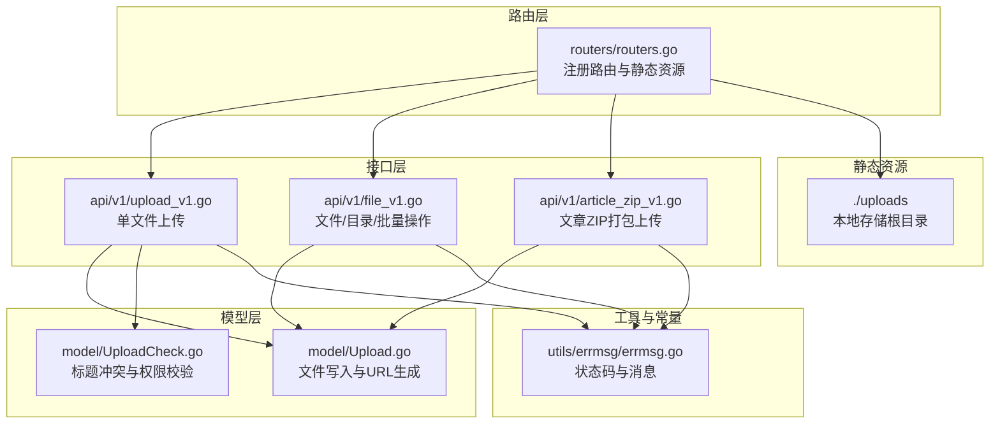
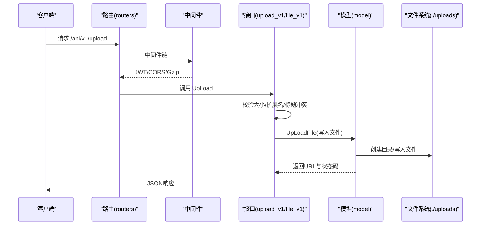
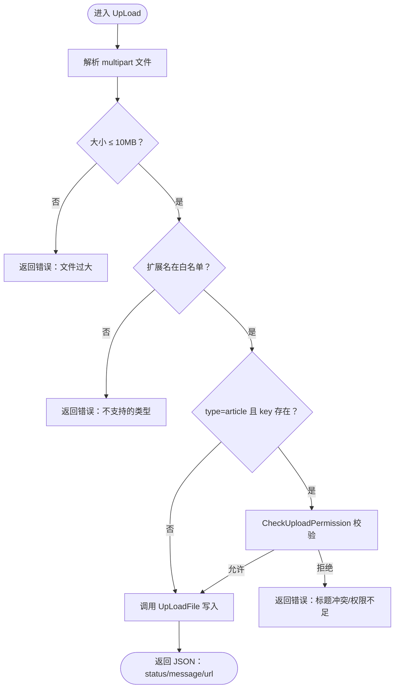
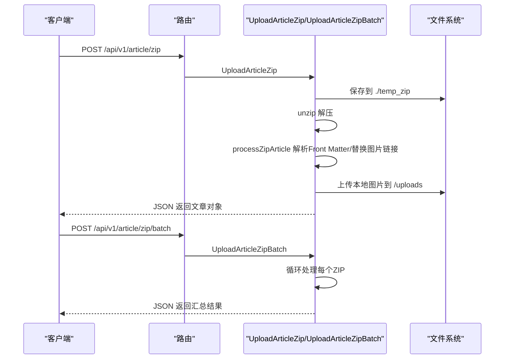
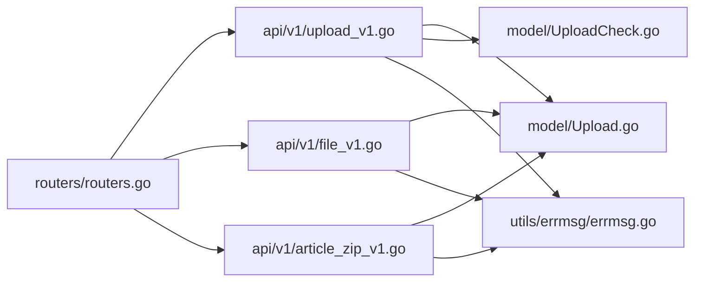

# 文件上传与媒体管理 API

<cite>
**本文引用的文件**
- [upload_v1.go](file://api/v1/upload_v1.go)
- [file_v1.go](file://api/v1/file_v1.go)
- [routers.go](file://routers/routers.go)
- [Upload.go](file://model/Upload.go)
- [UploadCheck.go](file://model/UploadCheck.go)
- [errmsg.go](file://utils/errmsg/errmsg.go)
- [article_zip_v1.go](file://api/v1/article_zip_v1.go)
- [MediaManager.vue](file://web/backend/src/views/media/MediaManager.vue)
</cite>

## 目录
1. [简介](#简介)
2. [项目结构](#项目结构)
3. [核心组件](#核心组件)
4. [架构总览](#架构总览)
5. [详细组件分析](#详细组件分析)
6. [依赖分析](#依赖分析)
7. [性能考虑](#性能考虑)
8. [故障排查指南](#故障排查指南)
9. [结论](#结论)
10. [附录](#附录)

## 简介
本文件上传与媒体管理 API 文档聚焦以下能力：
- 图片上传：格式支持、尺寸限制、压缩处理与存储策略
- PDF 上传：文档处理与预览支持
- 批量文件上传与文件夹管理、媒体库浏览
- 访问权限控制、CDN 集成与静态资源优化
- 文章压缩包下载接口的打包逻辑与格式规范
- 完整上传流程示例（含前端集成与错误处理）

## 项目结构
后端采用 Gin 路由分组与中间件机制，静态资源通过 /uploads 映射到本地目录；上传与文件管理接口位于 api/v1 下，业务逻辑集中在 model 层。

**图表来源**
- [routers.go:13-122](file://routers/routers.go#L13-L122)
- [upload_v1.go:27-94](file://api/v1/upload_v1.go#L27-L94)
- [file_v1.go:40-663](file://api/v1/file_v1.go#L40-L663)
- [article_zip_v1.go:30-394](file://api/v1/article_zip_v1.go#L30-L394)
- [Upload.go:13-80](file://model/Upload.go#L13-L80)
- [UploadCheck.go:14-43](file://model/UploadCheck.go#L14-L43)
- [errmsg.go:1-57](file://utils/errmsg/errmsg.go#L1-L57)

**章节来源**
- [routers.go:13-122](file://routers/routers.go#L13-L122)

## 核心组件
- 单文件上传接口：支持类型白名单、大小限制、标题冲突与权限校验，返回统一状态码与访问 URL
- 文件管理接口：列出、删除、创建目录、重命名、移动、复制、批量删除、批量上传、存储统计
- 文章 ZIP 上传：解压、解析 Front Matter、替换正文与封面中的本地图片链接、创建文章
- 存储策略：按类型分目录，图片按年/月组织，PDF 放入独立目录，统一通过 /uploads 提供静态访问

**章节来源**
- [upload_v1.go:13-26](file://api/v1/upload_v1.go#L13-L26)
- [upload_v1.go:27-94](file://api/v1/upload_v1.go#L27-L94)
- [file_v1.go:40-663](file://api/v1/file_v1.go#L40-L663)
- [Upload.go:13-80](file://model/Upload.go#L13-L80)
- [article_zip_v1.go:187-294](file://api/v1/article_zip_v1.go#L187-L294)

## 架构总览
上传与媒体管理的请求流经中间件（日志、恢复、Gzip、CORS、JWT、管理员校验），路由分组区分公开与鉴权/管理员接口，静态资源通过 /uploads 暴露。

**图表来源**
- [routers.go:13-122](file://routers/routers.go#L13-L122)
- [upload_v1.go:27-94](file://api/v1/upload_v1.go#L27-L94)
- [Upload.go:13-80](file://model/Upload.go#L13-L80)

## 详细组件分析

### 单文件上传接口
- 接口路径：/api/v1/upload（管理员组）
- 请求方式：POST
- 表单字段：
  - file：必填，multipart 文件
  - type：可选，枚举值包括 article、category、common、avatar、cover、pdf、system、markdown
  - key：可选，当 type=article 时用于标题冲突检测
  - id：可选，当前编辑文章 ID，用于权限校验
- 校验规则：
  - 文件大小不超过 10MB
  - 扩展名必须在白名单内
  - 当 type=article 且 key 存在时，需通过标题冲突与权限校验
- 返回：
  - status：统一状态码
  - message：状态描述
  - url：文件访问 URL（/uploads...）

**图表来源**
- [upload_v1.go:27-94](file://api/v1/upload_v1.go#L27-L94)
- [Upload.go:13-80](file://model/Upload.go#L13-L80)
- [UploadCheck.go:14-43](file://model/UploadCheck.go#L14-L43)

**章节来源**
- [upload_v1.go:13-26](file://api/v1/upload_v1.go#L13-L26)
- [upload_v1.go:27-94](file://api/v1/upload_v1.go#L27-L94)
- [UploadCheck.go:14-43](file://model/UploadCheck.go#L14-L43)
- [Upload.go:13-80](file://model/Upload.go#L13-L80)
- [errmsg.go:1-57](file://utils/errmsg/errmsg.go#L1-L57)

### 文件管理接口
- 获取媒体库列表：GET /api/v1/files?path=相对路径
  - path 可选，默认 uploads；内部进行路径安全校验，防止越权访问
  - 返回文件/目录列表，包含名称、是否目录、大小、扩展名、修改时间、是否图片、缩略图 URL（图片时）
- 删除文件/目录：DELETE /api/v1/files?path=相对路径
- 创建目录：POST /api/v1/files/folder
  - 请求体：{ path, name }
- 重命名：PUT /api/v1/files
  - 请求体：{ path, newName }
- 移动：POST /api/v1/files/move
  - 请求体：{ sourcePath, targetPath }
- 复制：POST /api/v1/files/copy
  - 请求体：{ sourcePath, targetPath }
- 批量删除：POST /api/v1/files/batch-delete
  - 请求体：{ paths[] }
- 批量上传：POST /api/v1/files/batch-upload
  - 表单字段：files[]（多文件）、dir（目标相对路径）
- 存储统计：GET /api/v1/files/stats

```mermaid
sequenceDiagram
participant C as "客户端"
participant R as "路由"
participant API as "GetFileList/BatchUploadFiles"
participant FS as "文件系统"
C->>R : GET /api/v1/files?path=...
R->>API : GetFileList
API->>API : safeUploadPath 校验
API->>FS : ReadDir
FS-->>API : 文件列表
API-->>C : JSON 包含文件信息
C->>R : POST /api/v1/files/batch-upload
R->>API : BatchUploadFiles
API->>API : 校验扩展名/创建目标目录
API->>FS : SaveUploadedFile
FS-->>API : 写入结果
API-->>C : JSON 包含每个文件的结果
```

**图表来源**
- [file_v1.go:40-663](file://api/v1/file_v1.go#L40-L663)
- [routers.go:70-81](file://routers/routers.go#L70-L81)

**章节来源**
- [file_v1.go:40-663](file://api/v1/file_v1.go#L40-L663)
- [routers.go:70-81](file://routers/routers.go#L70-L81)

### 文章压缩包上传（ZIP）
- 单个上传：POST /api/v1/article/zip
  - 表单字段：file（ZIP）
  - 流程：保存到临时目录 → 解压 → 遍历查找 .md → 解析 Front Matter → 替换正文与封面中的本地图片链接 → 创建文章
- 批量上传：POST /api/v1/article/zip/batch
  - 表单字段：files[]（多个 ZIP）
  - 返回每份文件的处理结果与成功计数

**图表来源**
- [article_zip_v1.go:30-185](file://api/v1/article_zip_v1.go#L30-L185)
- [article_zip_v1.go:187-294](file://api/v1/article_zip_v1.go#L187-L294)
- [article_zip_v1.go:296-341](file://api/v1/article_zip_v1.go#L296-L341)
- [article_zip_v1.go:343-393](file://api/v1/article_zip_v1.go#L343-L393)

**章节来源**
- [article_zip_v1.go:30-185](file://api/v1/article_zip_v1.go#L30-L185)
- [article_zip_v1.go:187-294](file://api/v1/article_zip_v1.go#L187-L294)
- [article_zip_v1.go:296-341](file://api/v1/article_zip_v1.go#L296-L341)
- [article_zip_v1.go:343-393](file://api/v1/article_zip_v1.go#L343-L393)

### 存储策略与静态资源
- 存储目录：./uploads
- 目录结构：
  - /uploads/avatar、/uploads/category、/uploads/system
  - /uploads/article/content/yyyyMM（按年月分桶，避免单目录文件过多）
  - /uploads/article/cover、/uploads/article/pdf
  - /uploads/common
- 静态资源映射：/uploads -> ./uploads
- CDN 集成建议：将 /uploads 映射至 CDN 域名，结合缓存策略与压缩（如 Gzip/Br）提升加载速度

**章节来源**
- [Upload.go:17-48](file://model/Upload.go#L17-L48)
- [routers.go:29-36](file://routers/routers.go#L29-L36)

## 依赖分析
- 路由与中间件：统一初始化，启用日志、恢复、Gzip、CORS、JWT、管理员校验
- 接口与模型：上传接口依赖模型层的文件写入与权限校验；文件管理接口直接操作文件系统
- 错误码：统一通过 errmsg 包返回

**图表来源**
- [routers.go:13-122](file://routers/routers.go#L13-L122)
- [upload_v1.go:27-94](file://api/v1/upload_v1.go#L27-L94)
- [file_v1.go:40-663](file://api/v1/file_v1.go#L40-L663)
- [article_zip_v1.go:30-394](file://api/v1/article_zip_v1.go#L30-L394)
- [Upload.go:13-80](file://model/Upload.go#L13-L80)
- [UploadCheck.go:14-43](file://model/UploadCheck.go#L14-L43)
- [errmsg.go:1-57](file://utils/errmsg/errmsg.go#L1-L57)

**章节来源**
- [routers.go:13-122](file://routers/routers.go#L13-L122)
- [errmsg.go:1-57](file://utils/errmsg/errmsg.go#L1-L57)

## 性能考虑
- 批量上传内存上限：路由设置 MaxMultipartMemory 为 200MB，适合较大批量场景
- Gzip 压缩：开启 gzip.Gzip，降低传输体积
- 目录分桶：文章内容图片按年/月分桶，减少单目录文件数量，提升遍历与统计效率
- 前端批量上传：前端一次提交多个文件，减少往返次数

**章节来源**
- [routers.go:18](file://routers/routers.go#L18)
- [routers.go:23](file://routers/routers.go#L23)
- [Upload.go:33](file://model/Upload.go#L33)
- [MediaManager.vue:576-604](file://web/backend/src/views/media/MediaManager.vue#L576-L604)

## 故障排查指南
- 常见错误码
  - SUCCESS：200
  - ERROR：500
  - 文章标题已存在：2002
- 上传失败排查
  - 文件过大：检查单文件大小限制（10MB）
  - 类型不支持：确认扩展名在白名单内
  - 路径非法：文件管理接口对 path 进行安全校验，确保在 uploads 下
  - 权限不足：管理员组接口需有效 JWT 令牌
- 前端集成建议
  - 使用 FormData 传递文件与 dir 参数
  - 对批量上传结果进行聚合提示（成功/失败计数）
  - 在媒体库界面展示缩略图（图片类型自动标注）

**章节来源**
- [errmsg.go:1-57](file://utils/errmsg/errmsg.go#L1-L57)
- [upload_v1.go:27-94](file://api/v1/upload_v1.go#L27-L94)
- [file_v1.go:40-663](file://api/v1/file_v1.go#L40-L663)
- [MediaManager.vue:576-604](file://web/backend/src/views/media/MediaManager.vue#L576-L604)

## 结论
本模块提供了完善的文件上传与媒体管理能力：支持多类型文件、严格的类型与大小校验、安全的路径校验、灵活的目录结构与静态资源映射、以及便捷的批量操作与文章 ZIP 打包发布。配合 CDN 与 Gzip 压缩，可在保证安全性的同时获得良好的性能体验。

## 附录

### API 定义概览
- 单文件上传
  - 路径：/api/v1/upload
  - 方法：POST
  - 表单字段：file（必填）、type/key/id（可选）
  - 返回：status/message/url
- 文件管理
  - GET /api/v1/files?path=...：列出媒体库
  - DELETE /api/v1/files?path=...：删除文件/目录
  - POST /api/v1/files/folder：创建目录
  - PUT /api/v1/files：重命名
  - POST /api/v1/files/move：移动
  - POST /api/v1/files/copy：复制
  - POST /api/v1/files/batch-delete：批量删除
  - POST /api/v1/files/batch-upload：批量上传
  - GET /api/v1/files/stats：存储统计
- 文章 ZIP 上传
  - POST /api/v1/article/zip：单个 ZIP
  - POST /api/v1/article/zip/batch：批量 ZIP

**章节来源**
- [routers.go:70-81](file://routers/routers.go#L70-L81)
- [upload_v1.go:27-94](file://api/v1/upload_v1.go#L27-L94)
- [file_v1.go:40-663](file://api/v1/file_v1.go#L40-L663)
- [article_zip_v1.go:30-185](file://api/v1/article_zip_v1.go#L30-L185)

### 上传流程示例（前端集成）
- 单文件上传
  - 组装 FormData，包含 file、type、key、id
  - 发送至 /api/v1/upload
  - 解析返回的 url，用于文章内容或封面引用
- 批量上传
  - 选择多个文件，组装 FormData，追加 dir
  - 发送至 /api/v1/files/batch-upload
  - 展示成功/失败明细与总数统计
- 媒体库浏览
  - GET /api/v1/files?path=... 获取列表
  - 支持创建/删除/移动/复制/重命名等操作

**章节来源**
- [MediaManager.vue:576-604](file://web/backend/src/views/media/MediaManager.vue#L576-L604)
- [file_v1.go:531-626](file://api/v1/file_v1.go#L531-L626)
- [upload_v1.go:27-94](file://api/v1/upload_v1.go#L27-L94)