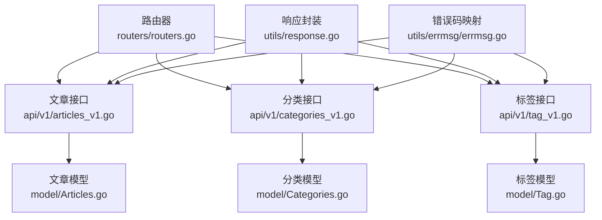
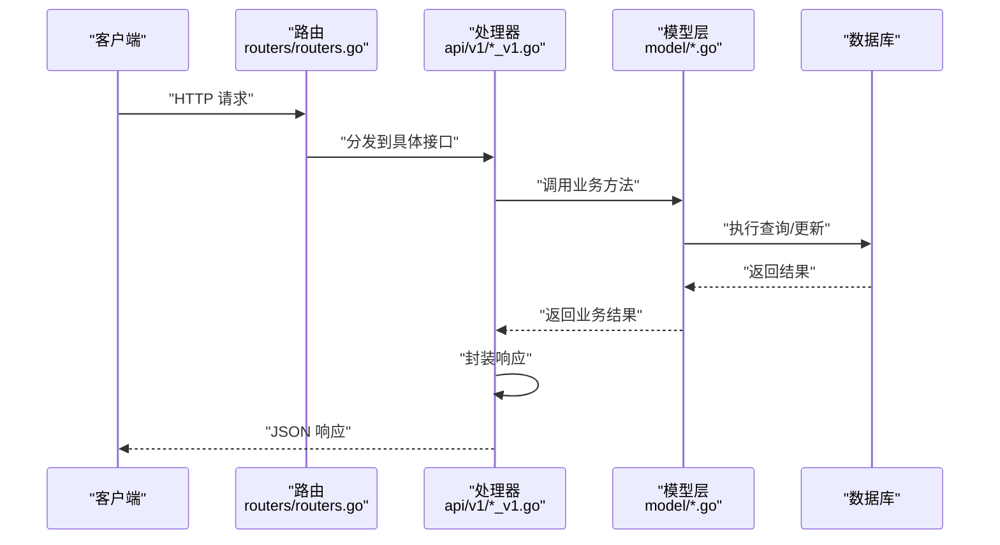
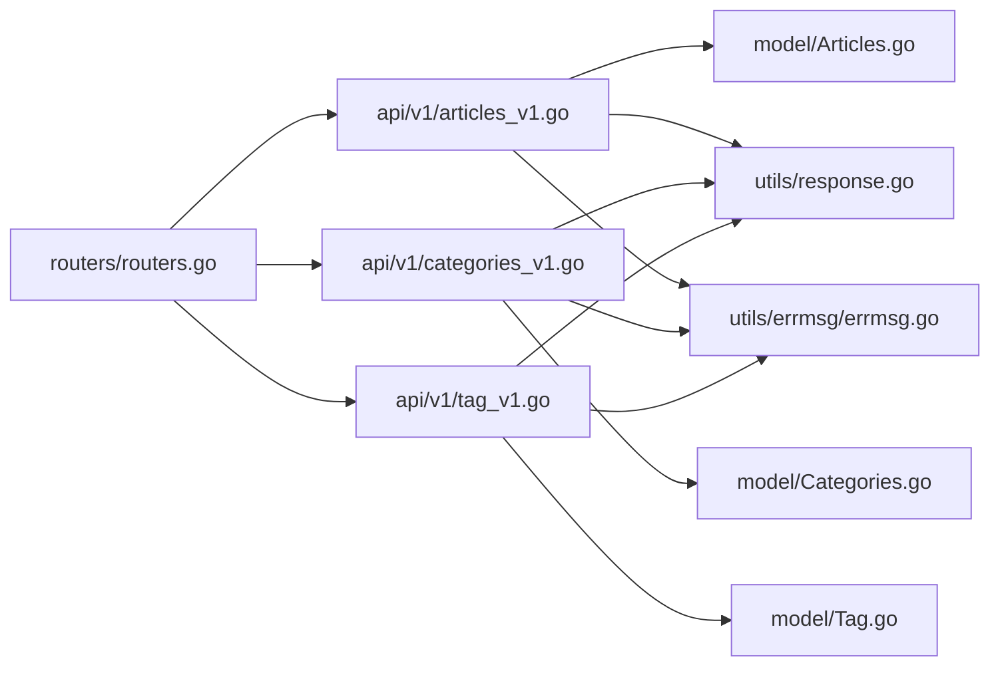

# 文章管理 API

<cite>
**本文引用的文件**
- [api\v1\articles_v1.go](file://api/v1/articles_v1.go)
- [model\Articles.go](file://model/Articles.go)
- [api\v1\categories_v1.go](file://api/v1/categories_v1.go)
- [model\Categories.go](file://model/Categories.go)
- [api\v1\tag_v1.go](file://api/v1/tag_v1.go)
- [model\Tag.go](file://model/Tag.go)
- [routers\routers.go](file://routers/routers.go)
- [utils\response.go](file://utils/response.go)
- [utils\errmsg\errmsg.go](file://utils/errmsg/errmsg.go)
- [web\frontend\src\components\sidebar\TagCloud.vue](file://web/frontend/src/components/sidebar/TagCloud.vue)
</cite>

## 目录
1. [简介](#简介)
2. [项目结构](#项目结构)
3. [核心组件](#核心组件)
4. [架构总览](#架构总览)
5. [详细组件分析](#详细组件分析)
6. [依赖分析](#依赖分析)
7. [性能考虑](#性能考虑)
8. [故障排查指南](#故障排查指南)
9. [结论](#结论)
10. [附录](#附录)

## 简介
本文件为 YanBlog 文章管理模块的 API 文档，覆盖文章 CRUD、分类管理、标签系统、文章搜索与分页、置顶与热门、相关文章与归档等功能。文档同时给出请求/响应示例与常见边界条件处理建议，帮助开发者快速集成与排错。

## 项目结构
- 后端采用 Gin 路由 + GORM 数据层，按模块拆分 API 层与 Model 层。
- 路由在统一入口注册，区分公开接口与鉴权/管理员接口。
- 工具层提供统一响应封装与分页参数解析。

图表来源
- [routers\routers.go:13-122](file://routers/routers.go#L13-L122)
- [api\v1\articles_v1.go:1-273](file://api/v1/articles_v1.go#L1-L273)
- [api\v1\categories_v1.go:1-166](file://api/v1/categories_v1.go#L1-L166)
- [api\v1\tag_v1.go:1-74](file://api/v1/tag_v1.go#L1-L74)
- [model\Articles.go:1-389](file://model/Articles.go#L1-L389)
- [model\Categories.go:1-203](file://model/Categories.go#L1-L203)
- [model\Tag.go:1-102](file://model/Tag.go#L1-L102)
- [utils\response.go:17-100](file://utils/response.go#L17-L100)
- [utils\errmsg\errmsg.go:1-57](file://utils/errmsg/errmsg.go#L1-L57)

章节来源
- [routers\routers.go:13-122](file://routers/routers.go#L13-L122)

## 核心组件
- 文章模块：提供文章增删改查、置顶、热门、随机、相邻文章、相关文章、归档、批量删除等能力。
- 分类模块：提供分类增删改查、搜索、强制删除（连带文章）等能力。
- 标签模块：提供标签增删改查、标签云展示与筛选。
- 路由与中间件：统一鉴权、跨域、Gzip 压缩、静态资源服务。
- 工具层：统一分页参数解析、响应封装、错误码映射。

章节来源
- [api\v1\articles_v1.go:18-273](file://api/v1/articles_v1.go#L18-L273)
- [api\v1\categories_v1.go:15-166](file://api/v1/categories_v1.go#L15-L166)
- [api\v1\tag_v1.go:12-74](file://api/v1/tag_v1.go#L12-L74)
- [routers\routers.go:38-118](file://routers/routers.go#L38-L118)
- [utils\response.go:17-100](file://utils/response.go#L17-L100)
- [utils\errmsg\errmsg.go:3-57](file://utils/errmsg/errmsg.go#L3-L57)

## 架构总览
- 请求经由 Gin 路由进入对应 Handler。
- Handler 调用 Model 层执行业务与数据访问。
- 统一通过响应封装返回 JSON 结构，包含状态码、数据与消息。
- 错误码集中管理，便于前后端一致处理。

图表来源
- [routers\routers.go:38-118](file://routers/routers.go#L38-L118)
- [api\v1\articles_v1.go:18-273](file://api/v1/articles_v1.go#L18-L273)
- [model\Articles.go:51-106](file://model/Articles.go#L51-L106)

## 详细组件分析

### 文章管理 API

- 路由与权限
  - 鉴权接口组：需要 JWT 认证。
  - 管理员接口组：需要 JWT + 管理员权限。
  - 公开接口组：无需认证。

- 文章 CRUD 与高级特性
  - 新增文章
    - 方法与路径：POST /api/v1/article/add
    - 请求体字段：title, cid, desc, content, img, top, tags, type, pdf_url, createdAt
    - 行为：校验标题唯一性，创建文章并解析标签，返回统一响应。
    - 响应：状态码、数据、消息。
    - 示例：见“请求/响应示例”。
  - 编辑文章
    - 方法与路径：PUT /api/v1/article/:id
    - 行为：校验标题唯一性（排除自身），若标题变更则重命名上传目录并替换内容中的旧路径为新路径，更新文章与标签关联。
    - 响应：状态码、消息。
  - 删除文章
    - 方法与路径：DELETE /api/v1/article/:id
    - 行为：删除文章记录前先删除上传目录，再删除记录。
    - 响应：状态码、消息。
  - 批量删除
    - 方法与路径：POST /api/v1/article/batch-delete
    - 请求体字段：ids（数组）
    - 行为：逐条删除并清理对应上传目录，返回成功/失败统计。
    - 响应：状态码、{deleted, failed, total}、消息。

- 文章查询与筛选
  - 列表查询
    - 方法与路径：GET /api/v1/article
    - 查询参数：pagesize, pagenum, excludeTop=true/false
    - 行为：按置顶优先、发布时间倒序分页查询；excludeTop=true 时排除置顶。
    - 响应：状态码、数据、total、消息。
  - 分类文章
    - 方法与路径：GET /api/v1/article/list/:id
    - 行为：按分类 ID 查询文章，支持分页与总数。
  - 文章详情
    - 方法与路径：GET /api/v1/article/info/:id
    - 行为：查询文章详情并原子性增加阅读量。
  - 搜索文章
    - 方法与路径：GET /api/v1/article/search
    - 查询参数：keyword, cid, pagesize, pagenum
    - 行为：对标题、描述、标签进行模糊匹配，支持分类筛选，按置顶优先与发布时间倒序。
  - 置顶文章
    - 方法与路径：GET /api/v1/article/top
    - 查询参数：num（默认 6，最大受 MaxPageSize 限制）
    - 行为：查询 top > 0 的文章，按置顶等级升序。
  - 热门文章
    - 方法与路径：GET /api/v1/article/hot
    - 查询参数：num（默认 5，最大受 MaxPageSize 限制）
    - 行为：按阅读量降序取前 N。
  - 随机文章
    - 方法与路径：GET /api/v1/article/random
    - 行为：按数据库随机函数取一条。
  - 相邻文章
    - 方法与路径：GET /api/v1/article/adjacent/:id
    - 行为：返回上一篇（发布时间更早的最新一篇）与下一篇（发布时间更新的最早一篇）。
  - 相关文章
    - 方法与路径：GET /api/v1/article/related/:id
    - 行为：基于标签相似度返回最近发布的若干文章。
  - 归档
    - 方法与路径：GET /api/v1/article/archive
    - 行为：按年月统计文章数量，兼容 SQLite 与 MySQL。

- 请求/响应示例（节选）
  - 新增文章
    - 请求体示例：包含 title, cid, desc, content, img, top, tags, type, pdf_url, createdAt
    - 成功响应：status=200, data=新建文章对象, message="OK"
    - 失败响应：status=文章相关错误码, message=错误提示
  - 编辑文章
    - 请求体示例：同新增，支持部分字段更新
    - 成功响应：status=200, message="OK"
    - 失败响应：status=ERROR_ART_TITLE_USED 或其他错误码
  - 删除文章
    - 成功响应：status=200, message="OK"
    - 失败响应：status=ERROR_ART_NOT_EXIST 或其他错误码
  - 批量删除
    - 成功响应：status=200, data={deleted, failed, total}, message="成功删除 X 篇，失败 Y 篇"
  - 文章列表
    - 成功响应：status=200, data=文章数组, total=总数, message="OK"
  - 搜索文章
    - 成功响应：status=200, data=匹配文章数组, total=总数, message="OK"
  - 置顶/热门/随机/相邻/相关/归档
    - 成功响应：status=200, data=对应数据, message="OK"

章节来源
- [api\v1\articles_v1.go:18-273](file://api/v1/articles_v1.go#L18-L273)
- [model\Articles.go:51-389](file://model/Articles.go#L51-L389)
- [utils\response.go:17-100](file://utils/response.go#L17-L100)
- [utils\errmsg\errmsg.go:17-28](file://utils/errmsg/errmsg.go#L17-L28)

### 分类管理 API

- 分类 CRUD 与搜索
  - 新增分类
    - 方法与路径：POST /api/v1/category/add
    - 请求体字段：name, img, top（top 小于 0 将被修正为 0）
    - 响应：状态码、数据、消息。
  - 查询分类列表
    - 方法与路径：GET /api/v1/category
    - 查询参数：pagesize, pagenum
    - 行为：按置顶等级升序分页，返回每个分类的文章数量。
  - 搜索分类
    - 方法与路径：GET /api/v1/category/search
    - 查询参数：keyword, pagesize, pagenum
    - 行为：按名称模糊匹配，返回总数。
  - 查询分类详情
    - 方法与路径：GET /api/v1/category/info/:id
    - 行为：返回分类信息及文章数量。
  - 编辑分类
    - 方法与路径：PUT /api/v1/category/:id
    - 请求体字段：name, img, top（top 小于 0 将被修正为 0）
    - 响应：状态码、消息。
  - 删除分类
    - 方法与路径：DELETE /api/v1/category/:id
    - 查询参数：force=true/false
    - 行为：若 force=true，先删除该分类下所有文章（含上传目录），再删除分类；否则若分类下仍有文章则拒绝删除。
    - 响应：状态码、消息。

- 分类层级结构
  - 当前实现为一维分类列表，未体现多级父子关系。如需层级，请在模型中扩展 parent_id 与递归查询逻辑。

- 请求/响应示例（节选）
  - 新增/编辑/删除分类
    - 成功响应：status=200, message="OK"
    - 失败响应：status=ERROR_CATENAME_USED 或 ERROR_CATE_HAS_ARTICLES 等
  - 查询分类列表/详情/搜索
    - 成功响应：status=200, data=分类对象或数组, total（当支持分页时）, message="OK"

章节来源
- [api\v1\categories_v1.go:15-166](file://api/v1/categories_v1.go#L15-L166)
- [model\Categories.go:19-203](file://model/Categories.go#L19-L203)
- [utils\response.go:17-100](file://utils/response.go#L17-L100)
- [utils\errmsg\errmsg.go:20-27](file://utils/errmsg/errmsg.go#L20-L27)

### 标签系统 API

- 标签 CRUD
  - 新增标签
    - 方法与路径：POST /api/v1/tags/add
    - 请求体字段：name
    - 响应：状态码、数据、消息。
  - 查询标签列表
    - 方法与路径：GET /api/v1/tags
    - 查询参数：pagesize, pagenum
    - 行为：返回标签列表与每个标签的文章数量（通过中间表统计）。
  - 编辑标签
    - 方法与路径：PUT /api/v1/tags/:id
    - 请求体字段：name（需唯一）
    - 响应：状态码、消息。
  - 删除标签
    - 方法与路径：DELETE /api/v1/tags/:id
    - 行为：删除标签并清理中间表关联。
    - 响应：状态码、消息。

- 标签云展示与筛选
  - 标签云：后端提供标签列表（含计数），前端组件负责渲染与交互。
  - 标签筛选：前端可基于标签名发起文章搜索或在文章详情页点击标签跳转至相关文章。

- 请求/响应示例（节选）
  - 新增/编辑/删除标签
    - 成功响应：status=200, message="OK"
    - 失败响应：status=ERROR_TAG_EXIST 或 ERROR_TAG_NOT_EXIST 等
  - 查询标签列表
    - 成功响应：status=200, data=标签数组（含 count 字段）, total, message="OK"

章节来源
- [api\v1\tag_v1.go:12-74](file://api/v1/tag_v1.go#L12-L74)
- [model\Tag.go:15-102](file://model/Tag.go#L15-L102)
- [utils\response.go:17-100](file://utils/response.go#L17-L100)
- [utils\errmsg\errmsg.go:25-28](file://utils/errmsg/errmsg.go#L25-L28)
- [web\frontend\src\components\sidebar\TagCloud.vue](file://web/frontend/src/components/sidebar/TagCloud.vue)

### 路由与中间件

- 路由分组
  - 公开接口组：无需认证，如文章列表、详情、搜索、标签列表、归档、健康检查等。
  - 鉴权接口组：需要 JWT 认证，如用户管理、文件管理、前端配置等。
  - 管理员接口组：需要 JWT + 管理员权限，如文章/分类/标签的增删改、批量删除、上传等。

- 中间件
  - 日志、恢复、Gzip 压缩、跨域、JWT、管理员校验、登录频率限制等。

- 静态资源
  - /uploads、/assets、/static、/iconfont、/favicon.ico、/config.yaml 等。

章节来源
- [routers\routers.go:13-122](file://routers/routers.go#L13-L122)

## 依赖分析

图表来源
- [routers\routers.go:38-118](file://routers/routers.go#L38-L118)
- [api\v1\articles_v1.go:18-273](file://api/v1/articles_v1.go#L18-L273)
- [api\v1\categories_v1.go:15-166](file://api/v1/categories_v1.go#L15-L166)
- [api\v1\tag_v1.go:12-74](file://api/v1/tag_v1.go#L12-L74)
- [model\Articles.go:51-389](file://model/Articles.go#L51-L389)
- [model\Categories.go:43-203](file://model/Categories.go#L43-L203)
- [model\Tag.go:35-102](file://model/Tag.go#L35-L102)
- [utils\response.go:17-100](file://utils/response.go#L17-L100)
- [utils\errmsg\errmsg.go:30-57](file://utils/errmsg/errmsg.go#L30-L57)

## 性能考虑
- 分页与总数分离：列表查询先查总数再分页查询，避免重复扫描。
- 排序策略：默认按置顶优先与发布时间倒序，减少前端二次排序成本。
- 随机与热门：随机使用数据库原生函数，热门按 views 降序索引查询。
- 阅读量：使用原子更新避免更新时间戳，降低并发写入开销。
- 压缩与缓存：启用 Gzip 压缩，静态资源独立部署可进一步提升性能。

## 故障排查指南
- 常见错误码
  - 文章：ERROR_ART_NOT_EXIST、ERROR_ART_TITLE_USED
  - 分类：ERROR_CATENAME_USED、ERROR_CATE_NOT_EXIST、ERROR_CATE_HAS_ARTICLES
  - 标签：ERROR_TAG_EXIST、ERROR_TAG_NOT_EXIST
- 参数校验
  - ID 参数解析失败会返回参数错误响应。
  - 分页参数小于等于 0 视为“查询全部”，并限制单页最大数量。
- 路由权限
  - 未认证或非管理员访问管理员接口将被拒绝。
- 上传与文件清理
  - 编辑文章时若标题变更，会尝试重命名上传目录并替换内容中的旧路径。
  - 删除文章/分类时会清理对应上传目录，注意路径拼接与权限问题。

章节来源
- [utils\errmsg\errmsg.go:3-57](file://utils/errmsg/errmsg.go#L3-L57)
- [utils\response.go:66-100](file://utils/response.go#L66-L100)
- [api\v1\articles_v1.go:180-240](file://api/v1/articles_v1.go#L180-L240)
- [api\v1\categories_v1.go:112-166](file://api/v1/categories_v1.go#L112-L166)

## 结论
本文档梳理了 YanBlog 文章管理模块的完整 API 能力，覆盖 CRUD、分类与标签管理、搜索与分页、置顶与热门、相关与相邻文章、归档等核心功能。结合统一响应与错误码体系，可快速完成前后端对接与集成测试。

## 附录

### API 定义速览

- 文章
  - POST /api/v1/article/add
  - PUT /api/v1/article/:id
  - DELETE /api/v1/article/:id
  - POST /api/v1/article/batch-delete
  - GET /api/v1/article
  - GET /api/v1/article/search
  - GET /api/v1/article/top
  - GET /api/v1/article/hot
  - GET /api/v1/article/random
  - GET /api/v1/article/adjacent/:id
  - GET /api/v1/article/related/:id
  - GET /api/v1/article/archive
  - GET /api/v1/article/list/:id
  - GET /api/v1/article/info/:id

- 分类
  - POST /api/v1/category/add
  - PUT /api/v1/category/:id
  - DELETE /api/v1/category/:id
  - GET /api/v1/category
  - GET /api/v1/category/search
  - GET /api/v1/category/info/:id

- 标签
  - POST /api/v1/tags/add
  - PUT /api/v1/tags/:id
  - DELETE /api/v1/tags/:id
  - GET /api/v1/tags

章节来源
- [routers\routers.go:38-118](file://routers/routers.go#L38-L118)