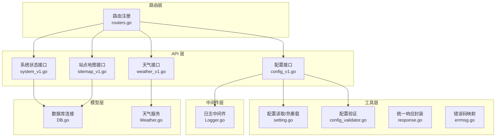
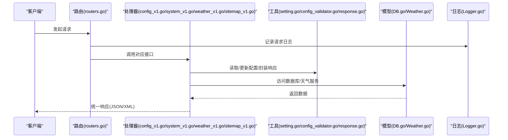
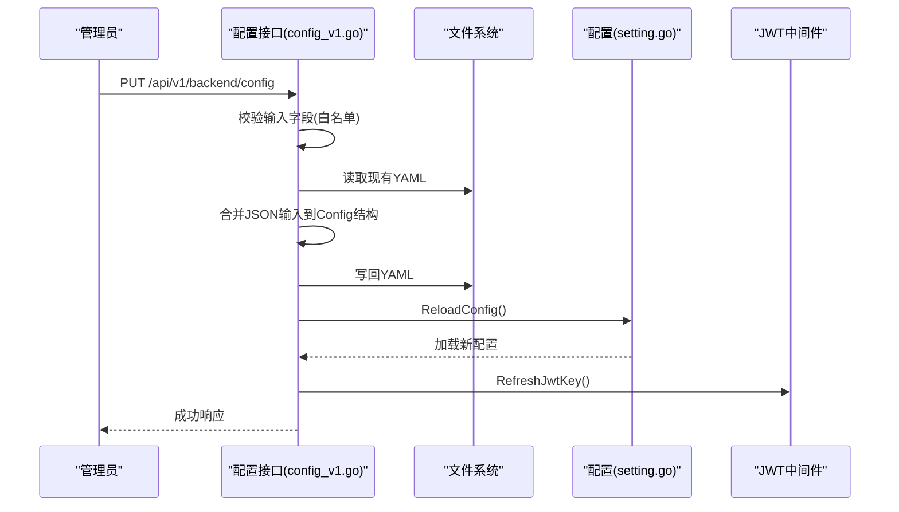
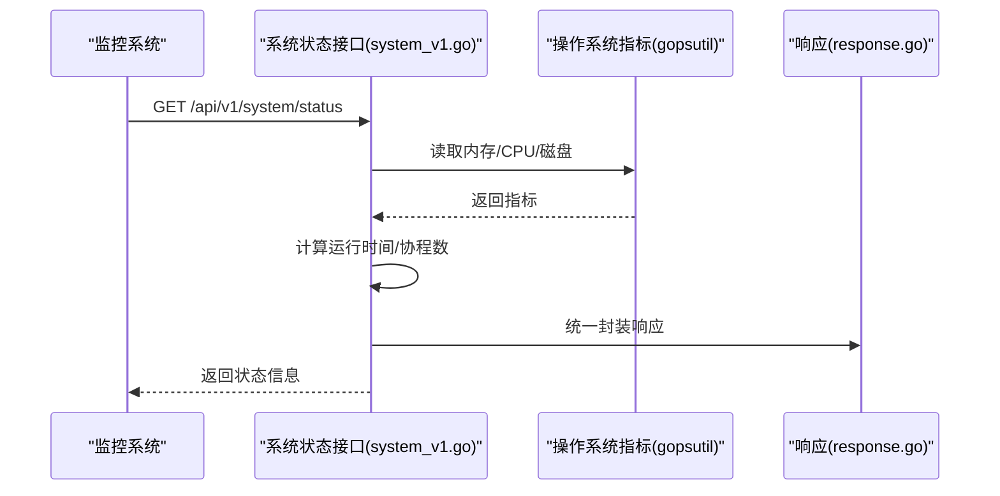
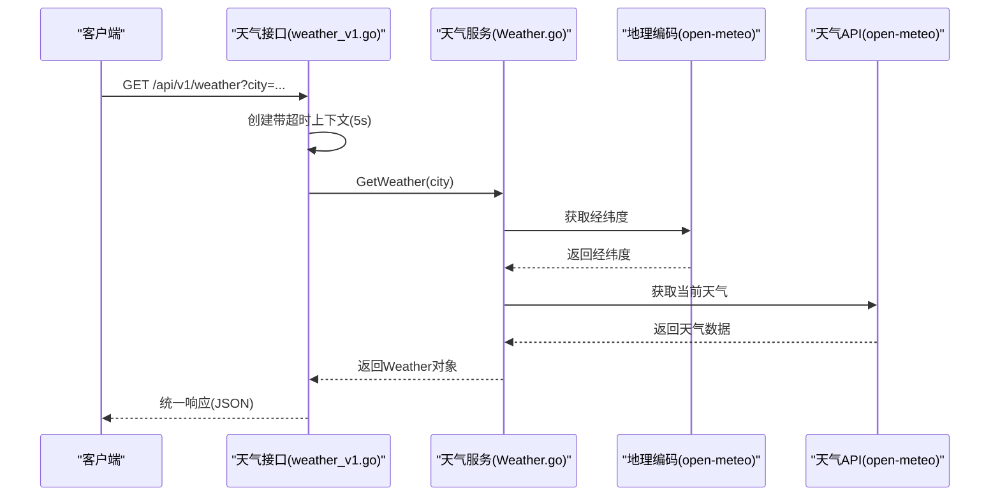
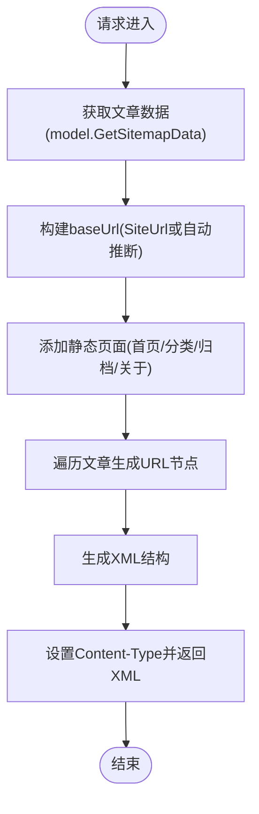
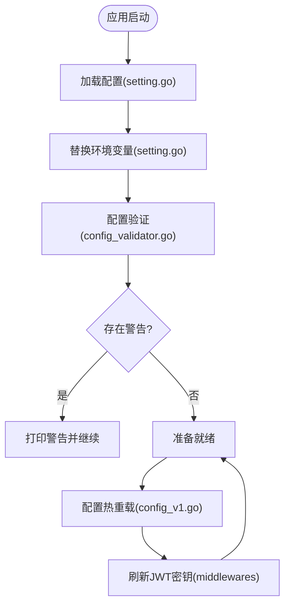
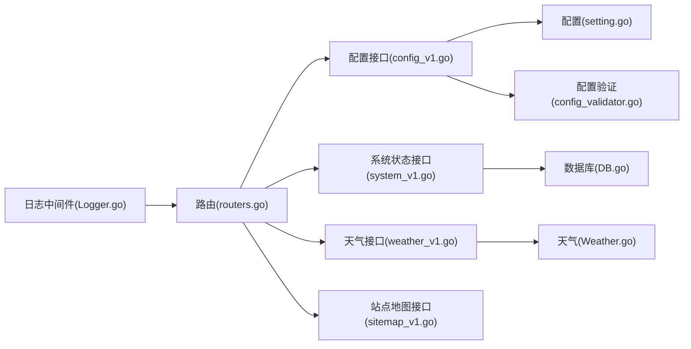

# 系统配置与状态 API

<cite>
**本文引用的文件**
- [config_v1.go](file://api/v1/config_v1.go)
- [system_v1.go](file://api/v1/system_v1.go)
- [weather_v1.go](file://api/v1/weather_v1.go)
- [sitemap_v1.go](file://api/v1/sitemap_v1.go)
- [setting.go](file://utils/setting.go)
- [config_validator.go](file://utils/config_validator.go)
- [Logger.go](file://middlewares/Logger.go)
- [routers.go](file://routers/routers.go)
- [DB.go](file://model/DB.go)
- [Weather.go](file://model/Weather.go)
- [config_template.yaml](file://config/config_template.yaml)
- [response.go](file://utils/response.go)
- [errmsg.go](file://utils/errmsg/errmsg.go)
</cite>

## 目录
1. [简介](#简介)
2. [项目结构](#项目结构)
3. [核心组件](#核心组件)
4. [架构总览](#架构总览)
5. [详细组件分析](#详细组件分析)
6. [依赖分析](#依赖分析)
7. [性能考虑](#性能考虑)
8. [故障排除指南](#故障排除指南)
9. [结论](#结论)
10. [附录](#附录)

## 简介
本文件为 YanBlog 系统的“配置与状态”模块提供全面的 API 文档，涵盖：
- 动态配置管理接口：前端配置与后端配置的增删改查、热重载机制、配置验证
- 系统状态监控接口：数据库连接状态、缓存状态、服务健康检查
- 天气信息接口：数据获取流程与超时控制
- 页面配置接口与站点地图生成逻辑
- 系统性能指标、日志接口与调试信息获取
- 最佳实践与故障排除指南

## 项目结构
配置与状态相关的代码主要分布在以下模块：
- API 层：配置管理、系统状态、天气、站点地图接口
- 工具层：配置读取、热重载、配置验证、统一响应封装
- 中间件层：日志记录与轮转
- 路由层：接口注册与访问控制
- 模型层：数据库连接与天气服务

图表来源
- [config_v1.go:1-273](file://api/v1/config_v1.go#L1-L273)
- [system_v1.go:1-112](file://api/v1/system_v1.go#L1-L112)
- [weather_v1.go:1-63](file://api/v1/weather_v1.go#L1-L63)
- [sitemap_v1.go:1-78](file://api/v1/sitemap_v1.go#L1-L78)
- [setting.go:1-171](file://utils/setting.go#L1-L171)
- [config_validator.go:1-101](file://utils/config_validator.go#L1-L101)
- [Logger.go:1-103](file://middlewares/Logger.go#L1-L103)
- [routers.go:1-122](file://routers/routers.go#L1-L122)
- [DB.go:1-312](file://model/DB.go#L1-L312)
- [Weather.go:1-258](file://model/Weather.go#L1-L258)

章节来源
- [routers.go:13-122](file://routers/routers.go#L13-L122)

## 核心组件
- 配置管理接口：提供前端配置读取与更新、后端配置读取与更新、配置热重载、全量配置获取
- 系统状态接口：提供系统运行时指标（CPU、内存、磁盘、协程数、启动时间）、健康检查
- 天气接口：提供天气信息获取，内置超时控制与错误处理
- 站点地图接口：根据文章与静态页面生成 sitemap.xml
- 配置验证与热重载：启动时验证关键配置，运行时支持热重载并刷新 JWT 密钥
- 日志与调试：统一日志中间件，支持轮转与分级输出

章节来源
- [config_v1.go:16-273](file://api/v1/config_v1.go#L16-L273)
- [system_v1.go:15-112](file://api/v1/system_v1.go#L15-L112)
- [weather_v1.go:13-63](file://api/v1/weather_v1.go#L13-L63)
- [sitemap_v1.go:15-78](file://api/v1/sitemap_v1.go#L15-L78)
- [config_validator.go:11-54](file://utils/config_validator.go#L11-L54)
- [setting.go:132-148](file://utils/setting.go#L132-L148)
- [Logger.go:15-103](file://middlewares/Logger.go#L15-L103)

## 架构总览
配置与状态模块围绕“配置中心 + 接口层 + 中间件 + 模型层”的架构设计：
- 配置中心：集中管理后端配置（YAML），支持热重载与环境变量替换
- 接口层：提供 RESTful API，对敏感字段进行过滤，统一响应格式
- 中间件层：日志记录与轮转，确保可观测性
- 模型层：数据库连接与天气服务，支撑系统状态与天气功能

图表来源
- [routers.go:13-122](file://routers/routers.go#L13-L122)
- [config_v1.go:16-273](file://api/v1/config_v1.go#L16-L273)
- [system_v1.go:29-84](file://api/v1/system_v1.go#L29-L84)
- [weather_v1.go:13-63](file://api/v1/weather_v1.go#L13-L63)
- [sitemap_v1.go:30-77](file://api/v1/sitemap_v1.go#L30-L77)
- [setting.go:77-148](file://utils/setting.go#L77-L148)
- [config_validator.go:11-54](file://utils/config_validator.go#L11-L54)
- [Logger.go:18-101](file://middlewares/Logger.go#L18-L101)

## 详细组件分析

### 配置管理接口
- 前端配置读取
  - 接口：GET /api/v1/frontend/config
  - 行为：读取前端配置文件内容，禁用缓存以确保实时生效
  - 安全：返回纯文本内容，避免泄露敏感信息
- 前端配置更新
  - 接口：PUT /api/v1/frontend/config
  - 行为：接收 YAML 内容，进行格式校验后写入文件
  - 安全：严格校验输入格式，失败返回错误
- 后端配置读取
  - 接口：GET /api/v1/backend/config
  - 行为：返回安全配置（过滤敏感字段），包含服务器、数据库、天气、前端配置路径
- 后端配置更新
  - 接口：PUT /api/v1/backend/config
  - 行为：仅允许更新白名单字段，合并 JSON 输入到配置结构，写回 YAML 并热重载
  - 安全：禁止修改数据库密码字段，JWT 密钥通过中间件刷新
- 配置热重载
  - 接口：POST /api/v1/config/reload
  - 行为：重新加载配置文件，刷新 JWT 密钥
- 全量配置获取
  - 接口：GET /api/v1/config/all
  - 行为：同时返回后端安全配置与前端 YAML 内容

图表来源
- [config_v1.go:109-218](file://api/v1/config_v1.go#L109-L218)
- [setting.go:132-148](file://utils/setting.go#L132-L148)

章节来源
- [config_v1.go:16-77](file://api/v1/config_v1.go#L16-L77)
- [config_v1.go:79-107](file://api/v1/config_v1.go#L79-L107)
- [config_v1.go:109-218](file://api/v1/config_v1.go#L109-L218)
- [config_v1.go:220-237](file://api/v1/config_v1.go#L220-L237)
- [config_v1.go:239-272](file://api/v1/config_v1.go#L239-L272)

### 系统状态监控接口
- 系统状态
  - 接口：GET /api/v1/system/status
  - 行为：采集内存、CPU、磁盘使用率，计算运行时间，返回协程数与启动时间戳
  - 异常：采集失败返回 500
- 健康检查
  - 接口：GET /api/v1/health
  - 行为：返回服务运行状态与时间，用于监控与负载均衡

图表来源
- [system_v1.go:29-84](file://api/v1/system_v1.go#L29-L84)
- [system_v1.go:86-93](file://api/v1/system_v1.go#L86-L93)
- [response.go:17-54](file://utils/response.go#L17-L54)

章节来源
- [system_v1.go:15-112](file://api/v1/system_v1.go#L15-L112)
- [response.go:17-54](file://utils/response.go#L17-L54)

### 天气信息接口
- 接口：GET /api/v1/weather?city={城市}
- 行为：支持查询参数 city，默认使用配置中的默认城市；内部通过地理编码获取经纬度，再调用 Open-Meteo 获取当前天气
- 超时控制：请求超时 5 秒，避免阻塞
- 错误处理：失败返回统一错误响应

图表来源
- [weather_v1.go:13-63](file://api/v1/weather_v1.go#L13-L63)
- [Weather.go:68-136](file://model/Weather.go#L68-L136)

章节来源
- [weather_v1.go:13-63](file://api/v1/weather_v1.go#L13-L63)
- [Weather.go:68-136](file://model/Weather.go#L68-L136)

### 站点地图生成逻辑
- 接口：GET /api/v1/sitemap.xml
- 行为：获取文章列表，拼接静态页面与文章链接，生成 XML sitemap
- 基础 URL：优先使用配置中的 SiteUrl，否则自动推断请求 Host
- 内容类型：设置为 application/xml

图表来源
- [sitemap_v1.go:30-77](file://api/v1/sitemap_v1.go#L30-L77)

章节来源
- [sitemap_v1.go:15-78](file://api/v1/sitemap_v1.go#L15-L78)

### 配置验证与热重载机制
- 配置验证
  - 启动时验证数据库用户名/名称、JWT 密钥长度与默认值、服务器端口等
  - 对潜在风险给出警告（如默认密码、短密钥），不阻断启动
- 热重载
  - 支持从多个路径读取配置文件，重新加载后刷新 JWT 密钥
  - 提供环境变量替换能力，便于容器化部署

图表来源
- [setting.go:47-98](file://utils/setting.go#L47-L98)
- [config_validator.go:11-54](file://utils/config_validator.go#L11-L54)
- [config_v1.go:220-237](file://api/v1/config_v1.go#L220-L237)

章节来源
- [config_validator.go:11-54](file://utils/config_validator.go#L11-L54)
- [setting.go:77-148](file://utils/setting.go#L77-L148)
- [config_v1.go:220-237](file://api/v1/config_v1.go#L220-L237)

### 日志与调试信息
- 日志中间件
  - 记录请求耗时、状态码、客户端 IP、方法、路径、数据大小、User-Agent
  - 支持日志轮转与按级别输出，异常状态码记录错误日志
- 调试信息
  - 启动时打印运行模式、端口、数据库连接信息、天气服务状态
  - 配置验证阶段输出警告提示

章节来源
- [Logger.go:15-103](file://middlewares/Logger.go#L15-L103)
- [config_validator.go:56-84](file://utils/config_validator.go#L56-L84)

## 依赖分析
- 路由注册
  - 配置接口：/api/v1/frontend/config、/api/v1/backend/config、/api/v1/config/reload、/api/v1/config/all
  - 系统状态接口：/api/v1/system/status
  - 天气接口：/api/v1/weather
  - 健康检查：/api/v1/health
  - 站点地图：/api/v1/sitemap.xml
- 组件耦合
  - 配置接口依赖工具层配置读取与热重载
  - 系统状态接口依赖 gopsutil 获取系统指标
  - 天气接口依赖 Weather 模块与外部 Open-Meteo API
  - 日志中间件贯穿所有接口，提供统一观测

图表来源
- [routers.go:13-122](file://routers/routers.go#L13-L122)
- [config_v1.go:16-273](file://api/v1/config_v1.go#L16-L273)
- [system_v1.go:29-84](file://api/v1/system_v1.go#L29-L84)
- [weather_v1.go:13-63](file://api/v1/weather_v1.go#L13-L63)
- [sitemap_v1.go:30-77](file://api/v1/sitemap_v1.go#L30-L77)
- [setting.go:77-148](file://utils/setting.go#L77-L148)
- [config_validator.go:11-54](file://utils/config_validator.go#L11-L54)
- [Logger.go:18-101](file://middlewares/Logger.go#L18-L101)

章节来源
- [routers.go:13-122](file://routers/routers.go#L13-L122)

## 性能考虑
- 配置热重载
  - 采用互斥锁保护配置读写，避免并发冲突
  - 仅在必要时刷新 JWT 密钥，减少中间件开销
- 天气接口
  - 请求超时控制，避免长时间等待影响响应
  - 使用 goroutine + channel 模式，提升并发能力
- 系统状态
  - 采集指标时尽量使用轻量级调用，避免频繁 IO
- 日志
  - 使用轮转与分级输出，降低磁盘压力

[本节为通用性能指导，不直接分析具体文件]

## 故障排除指南
- 配置相关
  - 后端配置更新失败：检查输入字段是否在白名单内，确认 YAML 格式正确
  - 配置热重载无效：确认配置文件路径存在，检查环境变量 YANBLOG_CONFIG_PATH
  - JWT 密钥问题：若为空或过短，系统会生成临时密钥，建议尽快设置永久密钥
- 数据库连接
  - MySQL 连接失败：检查主机、端口、用户名、密码、数据库名是否正确
  - SQLite 文件权限：确保数据库文件所在目录可写
- 天气接口
  - 超时或失败：检查网络连通性，确认 Open-Meteo API 可达
- 系统状态
  - 指标获取失败：检查 gopsutil 依赖是否安装，权限是否足够
- 日志
  - 日志轮转失败：检查 log 目录权限与磁盘空间

章节来源
- [config_validator.go:11-54](file://utils/config_validator.go#L11-L54)
- [DB.go:81-122](file://model/DB.go#L81-L122)
- [weather_v1.go:18-62](file://api/v1/weather_v1.go#L18-L62)
- [Logger.go:36-55](file://middlewares/Logger.go#L36-L55)

## 结论
YanBlog 的配置与状态模块提供了完善的动态配置管理、系统监控与天气服务接口，结合热重载与配置验证机制，确保了系统的可维护性与稳定性。通过统一的日志中间件与清晰的接口设计，开发者可以快速定位问题并进行优化。

[本节为总结性内容，不直接分析具体文件]

## 附录

### API 定义概览
- 配置管理
  - GET /api/v1/frontend/config：读取前端配置
  - PUT /api/v1/frontend/config：更新前端配置（YAML）
  - GET /api/v1/backend/config：读取后端安全配置
  - PUT /api/v1/backend/config：更新后端配置（白名单字段）
  - POST /api/v1/config/reload：重新加载配置并刷新 JWT 密钥
  - GET /api/v1/config/all：获取全量配置（后端安全配置 + 前端 YAML）
- 系统状态
  - GET /api/v1/system/status：系统状态信息（CPU/内存/磁盘/协程/启动时间）
  - GET /api/v1/health：健康检查
- 天气
  - GET /api/v1/weather?city={城市}：获取天气信息（支持超时控制）
- 站点地图
  - GET /api/v1/sitemap.xml：生成并返回 sitemap.xml

章节来源
- [routers.go:82-118](file://routers/routers.go#L82-L118)

### 配置文件示例
- 后端配置模板：config/config_template.yaml
  - 包含 server、database、JwtKey、weather、FrontEndConfigPath 等字段
  - 建议复制为 config/backend/config.yaml 后修改

章节来源
- [config_template.yaml:1-29](file://config/config_template.yaml#L1-L29)