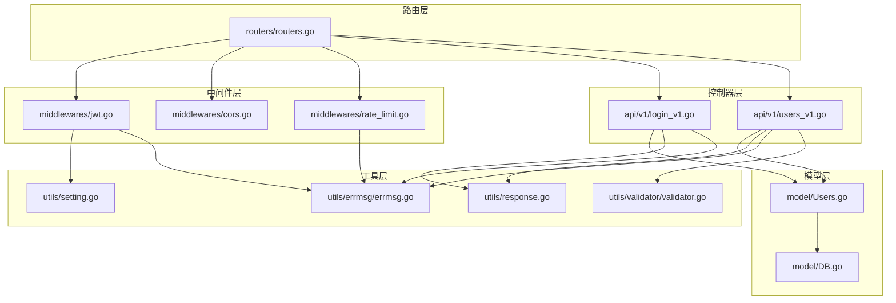
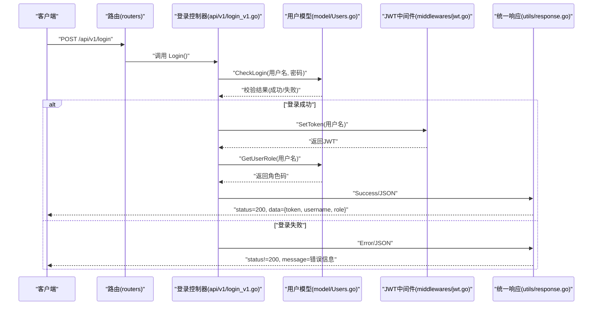
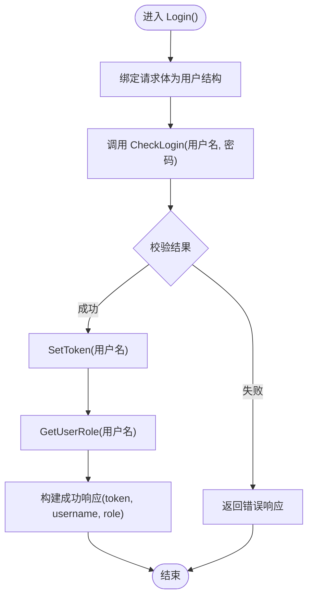
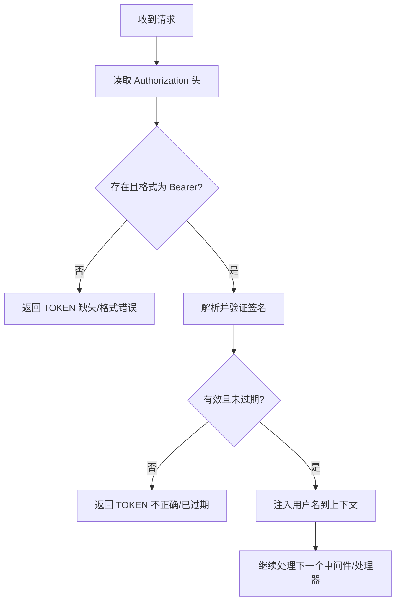
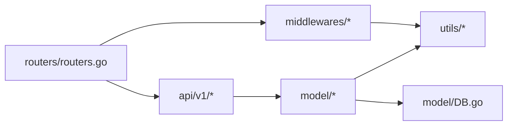

# 认证与用户管理 API

<cite>
**本文引用的文件**
- [api\v1\login_v1.go](file://api\v1\login_v1.go)
- [api\v1\users_v1.go](file://api\v1\users_v1.go)
- [middlewares\jwt.go](file://middlewares\jwt.go)
- [middlewares\rate_limit.go](file://middlewares\rate_limit.go)
- [middlewares\cors.go](file://middlewares\cors.go)
- [model\Users.go](file://model\Users.go)
- [model\DB.go](file://model\DB.go)
- [utils\response.go](file://utils\response.go)
- [utils\errmsg\errmsg.go](file://utils\errmsg\errmsg.go)
- [utils\validator\validator.go](file://utils\validator\validator.go)
- [utils\setting.go](file://utils\setting.go)
- [routers\routers.go](file://routers\routers.go)
</cite>

## 目录
1. [简介](#简介)
2. [项目结构](#项目结构)
3. [核心组件](#核心组件)
4. [架构总览](#架构总览)
5. [详细组件分析](#详细组件分析)
6. [依赖关系分析](#依赖关系分析)
7. [性能考量](#性能考量)
8. [故障排查指南](#故障排查指南)
9. [结论](#结论)
10. [附录](#附录)

## 简介
本文件面向开发者，系统化梳理 YanBlog 的认证与用户管理 API，重点覆盖：
- 用户登录接口的 JWT 令牌生成流程与过期处理
- 用户注册、信息更新与权限验证机制
- 角色控制与权限检查流程
- 用户管理 CRUD 接口与安全策略
- 请求与响应格式、错误码与常见问题排查

## 项目结构
围绕认证与用户管理的关键模块如下：
- 路由层：集中定义 API 路由与中间件挂载
- 中间件层：JWT 认证、CORS、登录频率限制
- 控制器层：登录、用户管理（增删改查、搜索）
- 模型层：用户模型、角色与权限、密码加密
- 工具层：统一响应、错误码、配置与校验

图表来源
- [routers\routers.go:13-122](file://routers\routers.go#L13-L122)
- [middlewares\jwt.go:1-157](file://middlewares\jwt.go#L1-L157)
- [middlewares\cors.go:1-40](file://middlewares\cors.go#L1-L40)
- [middlewares\rate_limit.go:1-98](file://middlewares\rate_limit.go#L1-L98)
- [api\v1\login_v1.go:13-59](file://api\v1\login_v1.go#L13-L59)
- [api\v1\users_v1.go:15-283](file://api\v1\users_v1.go#L15-L283)
- [model\Users.go:11-245](file://model\Users.go#L11-L245)
- [model\DB.go:26-79](file://model\DB.go#L26-L79)
- [utils\response.go:17-100](file://utils\response.go#L17-L100)
- [utils\errmsg\errmsg.go:3-57](file://utils\errmsg\errmsg.go#L3-L57)
- [utils\validator\validator.go:13-38](file://utils\validator\validator.go#L13-L38)
- [utils\setting.go:14-45](file://utils\setting.go#L14-L45)

章节来源
- [routers\routers.go:13-122](file://routers\routers.go#L13-L122)

## 核心组件
- 登录接口：接收用户名与密码，校验后签发 JWT
- 用户管理接口：新增、查询、搜索、编辑、删除用户
- JWT 中间件：鉴权、权限检查、过期处理
- 登录频率限制：防暴力破解
- 统一响应与错误码：标准化输出
- 密码加密：bcrypt
- 角色与权限：基于角色码的分级控制

章节来源
- [api\v1\login_v1.go:13-59](file://api\v1\login_v1.go#L13-L59)
- [api\v1\users_v1.go:15-283](file://api\v1\users_v1.go#L15-L283)
- [middlewares\jwt.go:27-157](file://middlewares\jwt.go#L27-L157)
- [middlewares\rate_limit.go:50-98](file://middlewares\rate_limit.go#L50-L98)
- [utils\response.go:17-100](file://utils\response.go#L17-L100)
- [model\Users.go:11-245](file://model\Users.go#L11-L245)

## 架构总览
认证与用户管理的整体交互流程如下：

图表来源
- [routers\routers.go:116](file://routers\routers.go#L116)
- [api\v1\login_v1.go:15-58](file://api\v1\login_v1.go#L15-L58)
- [model\Users.go:214-237](file://model\Users.go#L214-L237)
- [middlewares\jwt.go:30-49](file://middlewares\jwt.go#L30-L49)
- [utils\response.go:19-45](file://utils\response.go#L19-L45)

## 详细组件分析

### 登录接口（JWT 令牌生成与过期处理）
- 请求路径与方法
  - 方法：POST
  - 路径：/api/v1/login
  - 中间件：登录频率限制中间件
- 请求参数
  - JSON 结构包含用户名与密码
- 处理流程
  - 绑定请求体为用户结构
  - 调用模型层校验用户名与密码
  - 校验通过后生成 JWT
  - 获取用户角色码
  - 返回统一响应（包含 token、用户名、角色）
- JWT 令牌结构
  - 自定义声明：用户名
  - 标准声明：签发者、过期时间
  - 过期时间：当前时间 + 10 小时
- 过期处理
  - 中间件在每次请求时检查过期时间，过期返回特定错误码

图表来源
- [api\v1\login_v1.go:15-58](file://api\v1\login_v1.go#L15-L58)
- [model\Users.go:214-237](file://model\Users.go#L214-L237)
- [middlewares\jwt.go:30-49](file://middlewares\jwt.go#L30-L49)

章节来源
- [api\v1\login_v1.go:13-59](file://api\v1\login_v1.go#L13-L59)
- [middlewares\rate_limit.go:50-98](file://middlewares\rate_limit.go#L50-L98)
- [middlewares\jwt.go:27-69](file://middlewares\jwt.go#L27-L69)
- [model\Users.go:214-237](file://model\Users.go#L214-L237)

### 用户注册接口
- 请求路径与方法
  - 方法：POST
  - 路径：/api/v1/user/add
  - 中间件：JWT 认证 + 管理员权限
- 请求参数
  - JSON 结构包含用户名、密码、角色码
- 权限控制
  - 超级管理员可创建管理员与普通用户，不可创建超级管理员
  - 管理员只能创建普通用户
  - 普通用户无权创建
- 校验与创建
  - 使用结构体校验器进行字段校验
  - 检查用户名是否已存在
  - 创建用户（密码在保存钩子中加密）

章节来源
- [api\v1\users_v1.go:15-75](file://api\v1\users_v1.go#L15-L75)
- [utils\validator\validator.go:13-38](file://utils\validator\validator.go#L13-L38)
- [model\Users.go:36-47](file://model\Users.go#L36-L47)
- [model\Users.go:110-119](file://model\Users.go#L110-L119)

### 用户信息更新接口
- 请求路径与方法
  - 方法：PUT
  - 路径：/api/v1/user/:id
  - 中间件：JWT 认证 + 管理员权限
- 权限规则
  - 超级管理员：可修改任何人信息，但不可降权自身为非超级管理员
  - 管理员：可修改自己与普通用户，不可修改超级管理员与其他管理员；不可修改角色
  - 普通用户：仅可修改自己，不可修改角色
- 密码更新
  - 若提供新密码，将在更新时加密存储
- 用户名冲突处理
  - 若用户名被占用，仅允许修改自己的用户名

章节来源
- [api\v1\users_v1.go:120-228](file://api\v1\users_v1.go#L120-L228)
- [model\Users.go:149-175](file://model\Users.go#L149-L175)
- [model\Users.go:200-212](file://model\Users.go#L200-L212)

### 用户查询与搜索接口
- 列表查询
  - 方法：GET
  - 路径：/api/v1/users
  - 支持分页参数 pagesize、pagenum
  - 权限：仅 JWT 认证
  - 权限过滤：按当前用户角色过滤可见范围
- 搜索接口
  - 方法：GET
  - 路径：/api/v1/users/search
  - 查询参数：keyword（用户名关键字）、role（角色码）
  - 权限：仅 JWT 认证
  - 权限过滤：按当前用户角色过滤可见范围

章节来源
- [api\v1\users_v1.go:77-118](file://api\v1\users_v1.go#L77-L118)
- [model\Users.go:19-34](file://model\Users.go#L19-L34)
- [utils\response.go:66-87](file://utils\response.go#L66-L87)

### 用户删除接口
- 请求路径与方法
  - 方法：DELETE
  - 路径：/api/v1/user/:id
  - 中间件：JWT 认证 + 管理员权限
- 权限规则
  - 超级管理员：不可删除自己；可删除其他任何人
  - 管理员：仅可删除普通用户
  - 普通用户：不可删除任何人

章节来源
- [api\v1\users_v1.go:230-282](file://api\v1\users_v1.go#L230-L282)

### JWT 中间件与权限控制
- 认证中间件
  - 从 Authorization 请求头提取 Bearer Token
  - 校验格式与签名，检查过期时间
  - 通过后将用户名注入上下文，供后续处理器使用
- 管理员权限中间件
  - 仅允许角色码小于等于 2 的用户（超级管理员、管理员）
- 密钥管理
  - JWT 密钥来自配置文件
  - 配置重载后可刷新密钥

图表来源
- [middlewares\jwt.go:98-157](file://middlewares\jwt.go#L98-L157)
- [middlewares\jwt.go:51-69](file://middlewares\jwt.go#L51-L69)
- [utils\setting.go:14-45](file://utils\setting.go#L14-L45)

章节来源
- [middlewares\jwt.go:27-157](file://middlewares\jwt.go#L27-L157)
- [routers\routers.go:42-45](file://routers\routers.go#L42-L45)

### 登录频率限制中间件
- 作用：防暴力破解
- 策略：同一 IP 在 15 分钟内最多尝试 5 次，超过则封禁 30 分钟
- 清理：定期清理过期封禁记录

章节来源
- [middlewares\rate_limit.go:17-98](file://middlewares\rate_limit.go#L17-L98)

### 统一响应与错误码
- 统一响应封装：成功/错误/分页等常用结构
- 错误码：集中定义，便于前后端一致处理
- 分页参数解析：支持 pagesize/pagenum，含边界与上限控制

章节来源
- [utils\response.go:17-100](file://utils\response.go#L17-L100)
- [utils\errmsg\errmsg.go:3-57](file://utils\errmsg\errmsg.go#L3-L57)

### 密码加密与安全验证
- 密码加密：bcrypt，成本因子为 10
- 保存钩子：在保存用户前自动加密密码
- 登录校验：比较哈希值，同时检查用户角色是否允许登录

章节来源
- [model\Users.go:200-212](file://model\Users.go#L200-L212)
- [model\Users.go:189-198](file://model\Users.go#L189-L198)
- [model\Users.go:214-237](file://model\Users.go#L214-L237)

## 依赖关系分析
- 路由层依赖中间件层与控制器层
- 控制器层依赖模型层与工具层
- 中间件层依赖配置与错误码
- 模型层依赖数据库初始化与 bcrypt

图表来源
- [routers\routers.go:13-122](file://routers\routers.go#L13-L122)
- [middlewares\jwt.go:1-157](file://middlewares\jwt.go#L1-157)
- [api\v1\login_v1.go:1-59](file://api\v1\login_v1.go#L1-59)
- [api\v1\users_v1.go:1-283](file://api\v1\users_v1.go#L1-283)
- [model\Users.go:1-245](file://model\Users.go#L1-245)
- [model\DB.go:26-79](file://model\DB.go#L26-L79)
- [utils\setting.go:14-45](file://utils\setting.go#L14-L45)

章节来源
- [routers\routers.go:13-122](file://routers\routers.go#L13-L122)
- [middlewares\jwt.go:1-157](file://middlewares\jwt.go#L1-157)
- [api\v1\login_v1.go:1-59](file://api\v1\login_v1.go#L1-59)
- [api\v1\users_v1.go:1-283](file://api\v1\users_v1.go#L1-283)
- [model\Users.go:1-245](file://model\Users.go#L1-245)
- [model\DB.go:26-79](file://model\DB.go#L26-L79)
- [utils\setting.go:14-45](file://utils\setting.go#L14-L45)

## 性能考量
- 登录接口
  - 登录频率限制减少无效请求
  - JWT 过期时间适中，兼顾安全性与用户体验
- 用户查询
  - 分页参数上限控制，防止大页请求
  - 先计数再查询，避免不必要的数据传输
- 数据库
  - AutoMigrate 初始化表结构
  - 首次运行自动创建演示文章与默认超级管理员

章节来源
- [middlewares\rate_limit.go:26-31](file://middlewares\rate_limit.go#L26-L31)
- [utils\response.go:66-87](file://utils\response.go#L66-L87)
- [model\DB.go:46-79](file://model\DB.go#L46-L79)

## 故障排查指南
- 登录失败
  - 用户名不存在、密码错误、用户角色不允许登录
  - 对应错误码：用户不存在、密码错误、无权限
- TOKEN 相关
  - 缺失、格式错误、签名不正确、已过期
  - 对应错误码：TOKEN 不存在、TOKEN 格式错误、TOKEN 不正确、TOKEN 已过期
- 权限不足
  - 无权创建/修改/删除用户
  - 对应错误码：无权执行此操作
- 用户名冲突
  - 新增或编辑时用户名已被占用
  - 对应错误码：用户名已存在
- 分页参数异常
  - pagesize/pagenum 非法或过大
  - 对应错误码：参数错误

章节来源
- [utils\errmsg\errmsg.go:3-57](file://utils\errmsg\errmsg.go#L3-L57)
- [middlewares\jwt.go:108-151](file://middlewares\jwt.go#L108-L151)
- [api\v1\users_v1.go:28-53](file://api\v1\users_v1.go#L28-L53)
- [api\v1\users_v1.go:147-205](file://api\v1\users_v1.go#L147-L205)
- [api\v1\users_v1.go:246-272](file://api\v1\users_v1.go#L246-L272)
- [model\Users.go:36-47](file://model\Users.go#L36-L47)

## 结论
YanBlog 的认证与用户管理模块通过 JWT 实现无状态会话，结合登录频率限制与严格的权限控制，提供了安全可靠的用户生命周期管理能力。统一响应与错误码体系简化了前后端对接，bcrypt 加密保障了密码安全。开发者可据此快速集成登录与用户管理功能，并依据角色码扩展更细粒度的权限策略。

## 附录

### API 定义与示例

- 登录
  - 方法：POST /api/v1/login
  - 请求体：用户名、密码
  - 成功响应：token、username、role
  - 失败响应：错误码与消息
- 用户管理
  - 新增用户：POST /api/v1/user/add
  - 查询列表：GET /api/v1/users
  - 搜索用户：GET /api/v1/users/search
  - 更新用户：PUT /api/v1/user/:id
  - 删除用户：DELETE /api/v1/user/:id

章节来源
- [routers\routers.go:49-53](file://routers\routers.go#L49-L53)
- [routers\routers.go:116](file://routers\routers.go#L116)

### JWT 令牌结构说明
- 自定义声明
  - username：用户名
- 标准声明
  - issuer：签发者（固定为系统标识）
  - expires_at：过期时间（当前时间 + 10 小时）
- 过期处理
  - 中间件在每次请求时检查过期时间，过期返回特定错误码

章节来源
- [middlewares\jwt.go:22-49](file://middlewares\jwt.go#L22-L49)
- [middlewares\jwt.go:143-151](file://middlewares\jwt.go#L143-L151)

### 角色与权限对照
- 角色码
  - 1：超级管理员
  - 2：管理员
  - 3：普通用户
- 权限对照
  - 超级管理员：可创建管理员与普通用户，可删除除自身外的任何人
  - 管理员：仅可创建普通用户，可修改自己与普通用户，不可修改角色
  - 普通用户：仅可修改自己，不可修改角色

章节来源
- [model\Users.go:11-17](file://model\Users.go#L11-L17)
- [api\v1\users_v1.go:28-53](file://api\v1\users_v1.go#L28-L53)
- [api\v1\users_v1.go:146-205](file://api\v1\users_v1.go#L146-L205)
- [api\v1\users_v1.go:246-272](file://api\v1\users_v1.go#L246-L272)