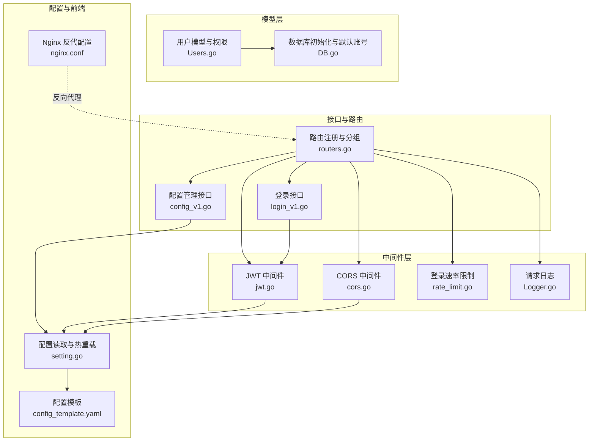
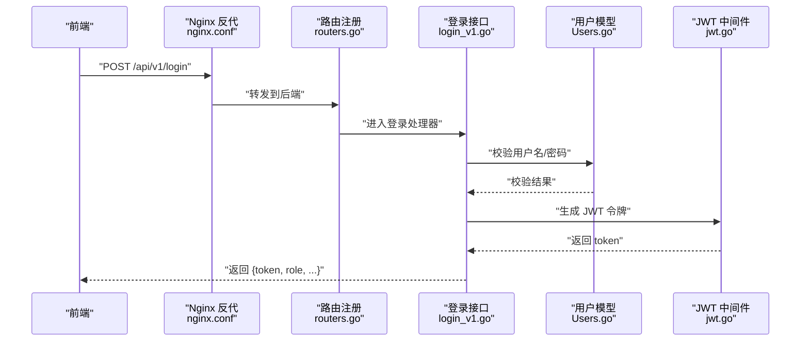
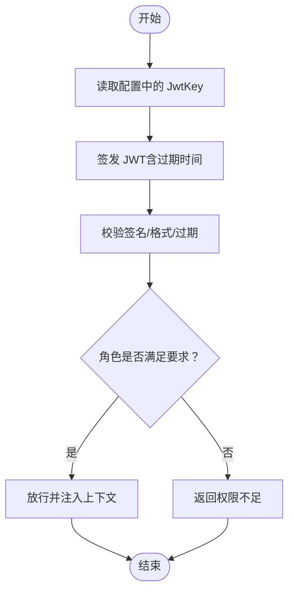
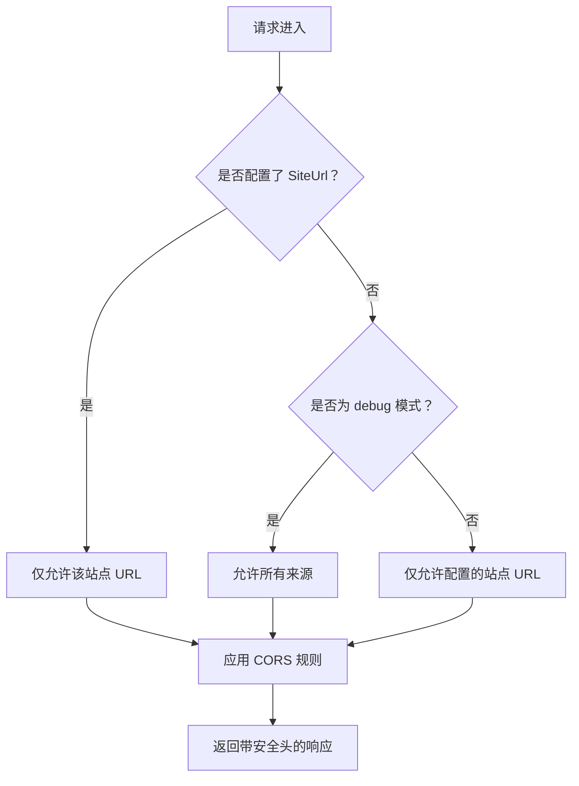
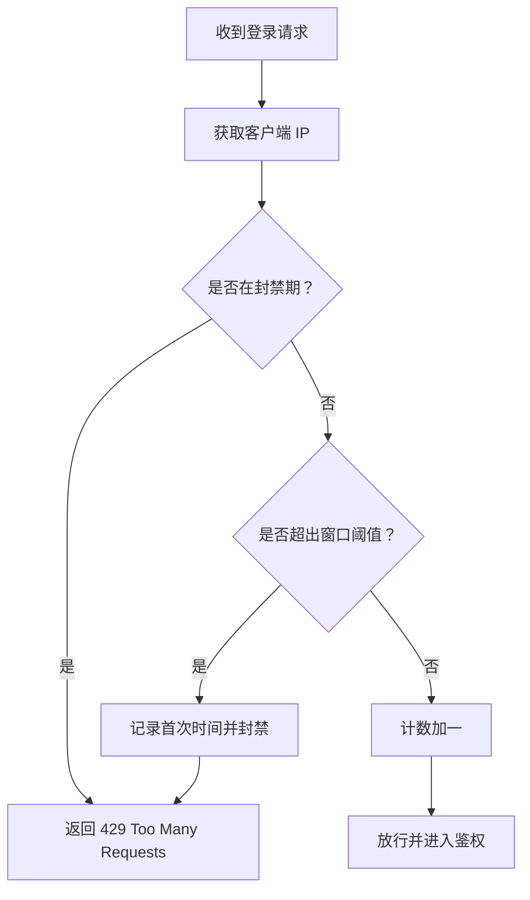
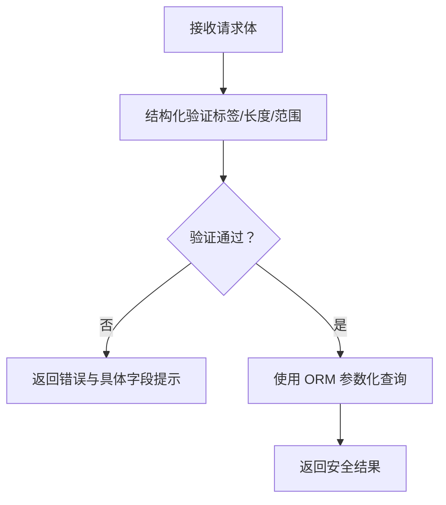
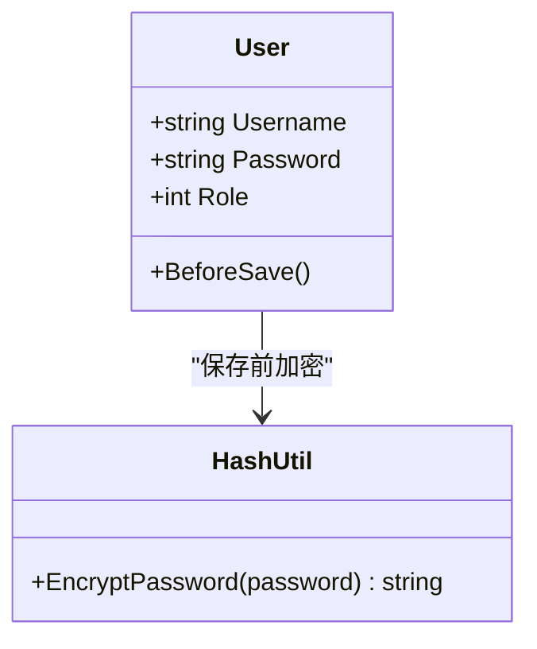
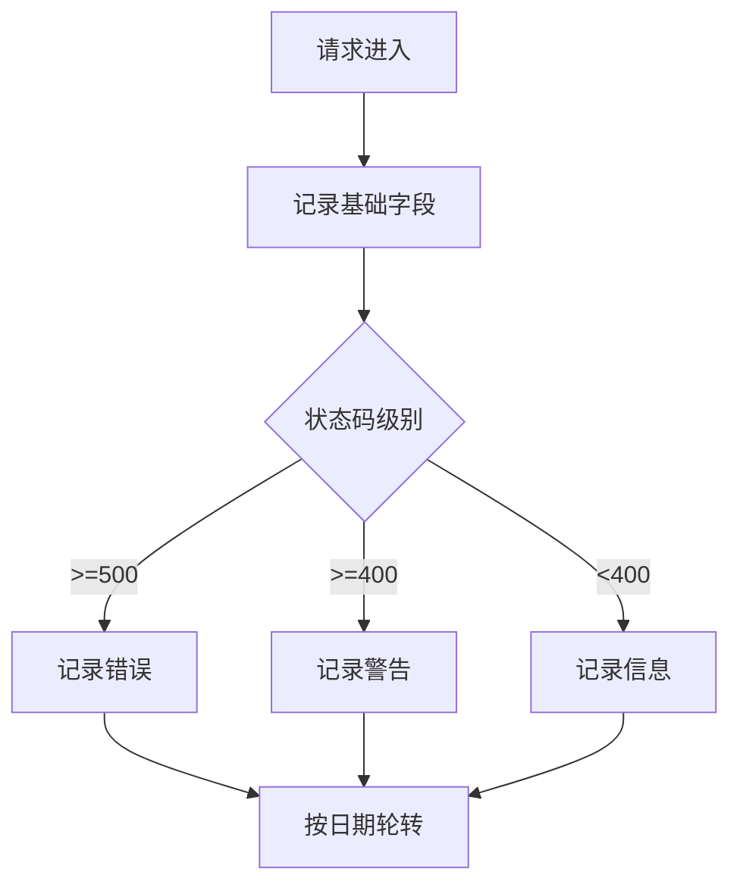
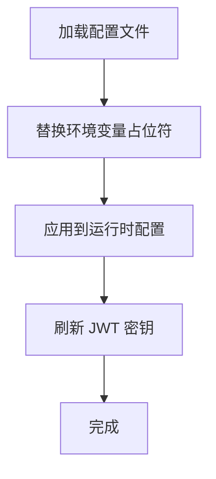
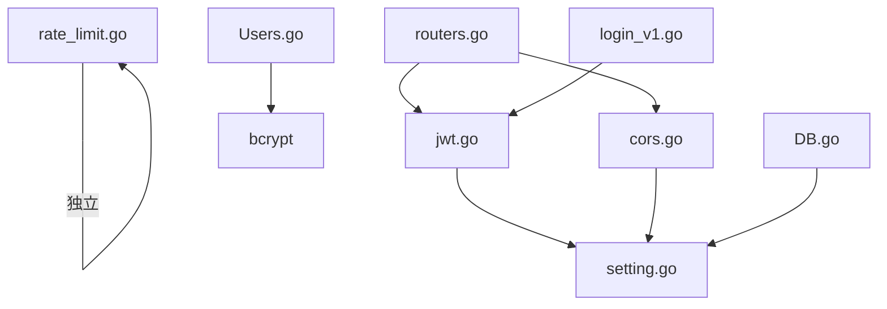

# 安全考虑

<cite>
**本文引用的文件**
- [jwt.go](file://middlewares/jwt.go)
- [cors.go](file://middlewares/cors.go)
- [rate_limit.go](file://middlewares/rate_limit.go)
- [Logger.go](file://middlewares/Logger.go)
- [validator.go](file://utils/validator/validator.go)
- [Users.go](file://model/Users.go)
- [DB.go](file://model/DB.go)
- [login_v1.go](file://api/v1/login_v1.go)
- [routers.go](file://routers/routers.go)
- [setting.go](file://utils/setting.go)
- [config_template.yaml](file://config/config_template.yaml)
- [config_v1.go](file://api/v1/config_v1.go)
- [nginx.conf](file://web/backend/nginx.conf)
</cite>

## 目录
1. [简介](#简介)
2. [项目结构](#项目结构)
3. [核心组件](#核心组件)
4. [架构总览](#架构总览)
5. [详细组件分析](#详细组件分析)
6. [依赖分析](#依赖分析)
7. [性能考虑](#性能考虑)
8. [故障排查指南](#故障排查指南)
9. [结论](#结论)
10. [附录](#附录)

## 简介
本文件面向安全工程师与开发者，提供 YanBlog 安全部署与实施指南。重点覆盖以下方面：
- JWT 认证的安全配置：密钥管理、令牌过期策略、安全传输与刷新流程
- 输入验证与过滤：防 SQL 注入、XSS 等威胁的通用策略
- CORS 跨域策略与防护
- CSRF 防护与会话管理建议
- 密码加密存储与敏感数据保护
- 安全审计与日志监控最佳实践
- 权限控制与访问管理策略
- 结合代码实现的安全加固建议

## 项目结构
YanBlog 的安全相关能力主要分布在如下层次：
- 中间件层：JWT 认证、CORS、速率限制、日志
- 模型层：用户与权限模型、密码加密、数据库初始化
- 接口层：登录接口、路由分组与权限绑定
- 配置层：JWT 密钥、站点 URL、数据库凭据等
- 前端 Nginx：反向代理与上传大小限制

**图表来源**
- [routers.go:13-122](file://routers/routers.go#L13-L122)
- [jwt.go:15-157](file://middlewares/jwt.go#L15-L157)
- [cors.go:14-39](file://middlewares/cors.go#L14-L39)
- [rate_limit.go:50-98](file://middlewares/rate_limit.go#L50-L98)
- [Logger.go:15-103](file://middlewares/Logger.go#L15-L103)
- [login_v1.go:13-59](file://api/v1/login_v1.go#L13-L59)
- [Users.go:11-245](file://model/Users.go#L11-L245)
- [DB.go:26-79](file://model/DB.go#L26-L79)
- [setting.go:14-171](file://utils/setting.go#L14-L171)
- [config_template.yaml:1-29](file://config/config_template.yaml#L1-L29)
- [nginx.conf:1-30](file://web/backend/nginx.conf#L1-L30)

**章节来源**
- [routers.go:13-122](file://routers/routers.go#L13-L122)
- [jwt.go:15-157](file://middlewares/jwt.go#L15-L157)
- [cors.go:14-39](file://middlewares/cors.go#L14-L39)
- [rate_limit.go:50-98](file://middlewares/rate_limit.go#L50-L98)
- [Logger.go:15-103](file://middlewares/Logger.go#L15-L103)
- [login_v1.go:13-59](file://api/v1/login_v1.go#L13-L59)
- [Users.go:11-245](file://model/Users.go#L11-L245)
- [DB.go:26-79](file://model/DB.go#L26-L79)
- [setting.go:14-171](file://utils/setting.go#L14-L171)
- [config_template.yaml:1-29](file://config/config_template.yaml#L1-L29)
- [nginx.conf:1-30](file://web/backend/nginx.conf#L1-L30)

## 核心组件
- JWT 认证与权限中间件：负责令牌签发、校验、过期判断与管理员权限拦截
- CORS 中间件：基于配置的跨域白名单与安全头设置
- 登录速率限制：防暴力破解的登录尝试限制
- 请求日志：统一记录请求元信息，便于审计
- 用户模型与密码加密：bcrypt 加密、角色权限模型
- 配置系统：JWT 密钥、站点 URL、数据库凭据的集中管理与热重载
- 路由与接口：按权限分组的 REST 接口与登录入口

**章节来源**
- [jwt.go:15-157](file://middlewares/jwt.go#L15-L157)
- [cors.go:14-39](file://middlewares/cors.go#L14-L39)
- [rate_limit.go:50-98](file://middlewares/rate_limit.go#L50-L98)
- [Logger.go:15-103](file://middlewares/Logger.go#L15-L103)
- [Users.go:11-245](file://model/Users.go#L11-L245)
- [setting.go:14-171](file://utils/setting.go#L14-L171)
- [routers.go:13-122](file://routers/routers.go#L13-L122)

## 架构总览
下图展示登录与鉴权的关键交互流程。

**图表来源**
- [login_v1.go:13-59](file://api/v1/login_v1.go#L13-L59)
- [Users.go:214-237](file://model/Users.go#L214-L237)
- [jwt.go:27-49](file://middlewares/jwt.go#L27-L49)
- [routers.go:116](file://routers/routers.go#L116)
- [nginx.conf:12-24](file://web/backend/nginx.conf#L12-L24)

## 详细组件分析

### JWT 认证与密钥管理
- 密钥来源与热重载
  - JWT 密钥来自配置文件，运行时通过中间件读取
  - 配置重载后需刷新 JWT 密钥，确保新密钥生效
- 令牌签发与校验
  - 使用对称签名算法，签发时设置过期时间与签发者
  - 校验时验证签名、格式与过期时间
- 权限控制
  - 管理员中间件基于用户角色拒绝越权操作
- 安全建议
  - 强制使用 HTTPS 传输，避免明文泄露
  - 定期轮换密钥，并在重载后调用刷新逻辑
  - 严格限制令牌有效期，结合刷新令牌策略（如需）

**图表来源**
- [jwt.go:15-157](file://middlewares/jwt.go#L15-L157)
- [setting.go:132-148](file://utils/setting.go#L132-L148)

**章节来源**
- [jwt.go:15-157](file://middlewares/jwt.go#L15-L157)
- [setting.go:132-148](file://utils/setting.go#L132-L148)
- [config_template.yaml:20-22](file://config/config_template.yaml#L20-L22)

### CORS 跨域策略
- 白名单策略
  - 生产环境仅允许配置的站点 URL
  - 开发模式下可放宽至允许所有来源
- 安全头与暴露头
  - 允许的方法与头部有限集合
  - 凭证开关关闭，降低 CSRF 风险
- 建议
  - 明确配置站点 URL，避免宽泛放行
  - 如需携带凭证，谨慎开启并配合同源策略

**图表来源**
- [cors.go:16-39](file://middlewares/cors.go#L16-L39)
- [setting.go:14-42](file://utils/setting.go#L14-L42)

**章节来源**
- [cors.go:16-39](file://middlewares/cors.go#L16-L39)
- [setting.go:14-42](file://utils/setting.go#L14-L42)

### 登录速率限制与 CSRF 防护
- 登录速率限制
  - 基于 IP 的滑动窗口计数，超过阈值封禁一段时间
  - 定期清理过期记录，避免内存膨胀
- CSRF 防护建议
  - 由于采用 JWT（通常放在 Authorization 头），天然规避传统 Cookie-CSRF 风险
  - 若引入 Cookie 会话，建议启用 SameSite、Secure、HttpOnly 等属性，并配合双重提交或同步令牌

**图表来源**
- [rate_limit.go:50-98](file://middlewares/rate_limit.go#L50-L98)

**章节来源**
- [rate_limit.go:50-98](file://middlewares/rate_limit.go#L50-L98)

### 输入验证与过滤（防 SQL 注入、XSS）
- 验证器
  - 使用结构化验证器对请求体进行字段级校验
  - 支持标签名翻译，便于国际化错误提示
- 防护策略
  - 对外部输入进行严格的白名单与长度/范围约束
  - 使用 ORM 的参数化查询（GORM 默认支持），避免拼接 SQL
  - 对富文本/评论等用户输入进行 HTML 净化（建议引入专门的净化库）
  - 输出编码：在前端渲染时对不可信数据进行 HTML/JS 编码

**图表来源**
- [validator.go:13-38](file://utils/validator/validator.go#L13-L38)
- [Users.go:11-17](file://model/Users.go#L11-L17)

**章节来源**
- [validator.go:13-38](file://utils/validator/validator.go#L13-L38)
- [Users.go:11-17](file://model/Users.go#L11-L17)

### 密码加密存储与敏感数据保护
- 密码加密
  - 使用 bcrypt 对密码进行哈希存储，负载值合理
  - GORM 钩子在保存前自动加密，更新场景也需显式加密
- 敏感数据
  - 配置文件中的数据库密码与 JWT 密钥需妥善保管
  - 避免在日志中输出敏感字段
- 默认账号与安全提醒
  - 首次运行创建默认超级管理员账号并打印明文提示，需立即修改密码

**图表来源**
- [Users.go:189-212](file://model/Users.go#L189-L212)
- [DB.go:50-71](file://model/DB.go#L50-L71)

**章节来源**
- [Users.go:189-212](file://model/Users.go#L189-L212)
- [DB.go:50-71](file://model/DB.go#L50-L71)

### 权限控制与访问管理
- 路由分组与中间件
  - 认证组：所有受保护接口均需 JWT
  - 管理员组：在认证基础上再校验角色
- 角色模型
  - 超级管理员、管理员、普通用户
  - 不同角色可见与操作范围不同
- 建议
  - 为每个接口明确所属分组与角色要求
  - 对高危操作（删除、批量操作）单独上收权限

**图表来源**
- [routers.go:38-92](file://routers/routers.go#L38-L92)
- [Users.go:19-34](file://model/Users.go#L19-L34)

**章节来源**
- [routers.go:38-92](file://routers/routers.go#L38-L92)
- [Users.go:19-34](file://model/Users.go#L19-L34)

### 安全审计与日志监控
- 日志记录
  - 记录请求耗时、状态码、客户端 IP、User-Agent、路径等
  - 自动按天轮转，保留一定周期
- 建议
  - 将日志输出到集中式日志系统
  - 对 4xx/5xx 与异常请求进行告警
  - 定期审查登录与高危操作日志

**图表来源**
- [Logger.go:15-103](file://middlewares/Logger.go#L15-L103)

**章节来源**
- [Logger.go:15-103](file://middlewares/Logger.go#L15-L103)

### 配置与部署安全
- 配置项
  - AppMode、HttpPort、SiteUrl、JwtKey、数据库凭据
  - 前端配置路径
- 热重载与密钥刷新
  - 重载配置后需刷新 JWT 密钥
- 建议
  - 使用环境变量注入敏感配置
  - 生产环境务必设置 SiteUrl 与 JwtKey
  - 限制配置文件权限，避免未授权读取

**图表来源**
- [setting.go:77-98](file://utils/setting.go#L77-L98)
- [setting.go:132-148](file://utils/setting.go#L132-L148)
- [config_template.yaml:6-29](file://config/config_template.yaml#L6-L29)

**章节来源**
- [setting.go:77-98](file://utils/setting.go#L77-L98)
- [setting.go:132-148](file://utils/setting.go#L132-L148)
- [config_template.yaml:6-29](file://config/config_template.yaml#L6-L29)

### 反向代理与传输安全
- Nginx 反代
  - 限定上传大小，代理 API 与静态资源
- 建议
  - 启用 HTTPS 与 HSTS
  - 配置安全响应头（如 X-Content-Type-Options、X-Frame-Options）
  - 限制来源与缓存策略

**章节来源**
- [nginx.conf:1-30](file://web/backend/nginx.conf#L1-L30)

## 依赖分析
- 中间件依赖
  - JWT 依赖配置系统提供的密钥
  - CORS 依赖配置系统提供的站点 URL 与运行模式
  - 登录速率限制独立于外部系统
- 路由依赖
  - 所有受保护接口依赖 JWT 中间件
  - 管理员接口依赖角色校验中间件
- 数据层依赖
  - 用户模型依赖 bcrypt 进行密码加密
  - 数据库初始化依赖配置系统提供的连接参数

**图表来源**
- [jwt.go:15](file://middlewares/jwt.go#L15)
- [cors.go:18-22](file://middlewares/cors.go#L18-L22)
- [routers.go:38-45](file://routers/routers.go#L38-L45)
- [login_v1.go:38](file://api/v1/login_v1.go#L38)
- [Users.go:203-212](file://model/Users.go#L203-L212)
- [DB.go:26-46](file://model/DB.go#L26-L46)

**章节来源**
- [jwt.go:15](file://middlewares/jwt.go#L15)
- [cors.go:18-22](file://middlewares/cors.go#L18-L22)
- [routers.go:38-45](file://routers/routers.go#L38-L45)
- [login_v1.go:38](file://api/v1/login_v1.go#L38)
- [Users.go:203-212](file://model/Users.go#L203-L212)
- [DB.go:26-46](file://model/DB.go#L26-L46)

## 性能考虑
- 登录速率限制采用内存计数，适合单实例；分布式需改用共享存储（如 Redis）
- 日志轮转与文件 I/O 可能成为瓶颈，建议使用异步写入或集中式日志
- Gzip 压缩提升传输效率，注意对静态资源与 JSON 的压缩收益

## 故障排查指南
- 登录失败
  - 检查用户名是否存在与密码是否正确
  - 确认用户角色具备登录权限
- 令牌无效
  - 核对 Authorization 头格式与签名密钥
  - 检查过期时间与签发者
- 跨域失败
  - 确认 SiteUrl 配置与当前域名一致
  - 检查 AllowCredentials 是否需要开启
- 高危操作被拒
  - 确认当前用户角色是否满足管理员要求
- 日志异常
  - 检查日志目录权限与磁盘空间
  - 关注轮转配置是否生效

**章节来源**
- [login_v1.go:26-35](file://api/v1/login_v1.go#L26-L35)
- [jwt.go:100-157](file://middlewares/jwt.go#L100-L157)
- [cors.go:16-39](file://middlewares/cors.go#L16-L39)
- [Users.go:239-244](file://model/Users.go#L239-L244)
- [Logger.go:18-103](file://middlewares/Logger.go#L18-L103)

## 结论
YanBlog 的安全实现围绕“强密钥、短令牌、最小权限、严格验证、可观测”展开。建议在生产环境中：
- 强制 HTTPS 与安全响应头
- 严格管理 JWT 密钥与配置
- 引入更完善的 XSS 净化与 SQL 注入防护
- 部署集中式日志与告警
- 对管理员操作增加二次确认与审计

## 附录
- 配置文件示例与说明：参见配置模板
- 前端 Nginx 反代配置：参见后端 Nginx 配置

**章节来源**
- [config_template.yaml:1-29](file://config/config_template.yaml#L1-L29)
- [nginx.conf:1-30](file://web/backend/nginx.conf#L1-L30)