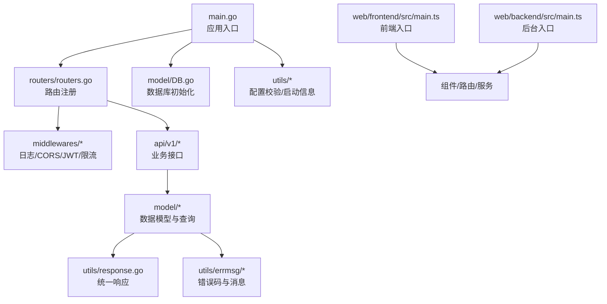
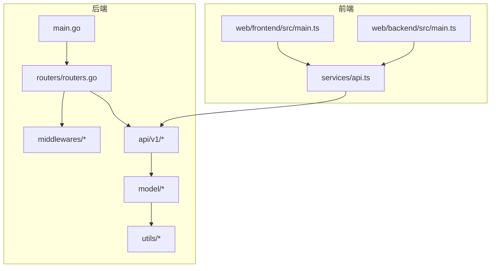
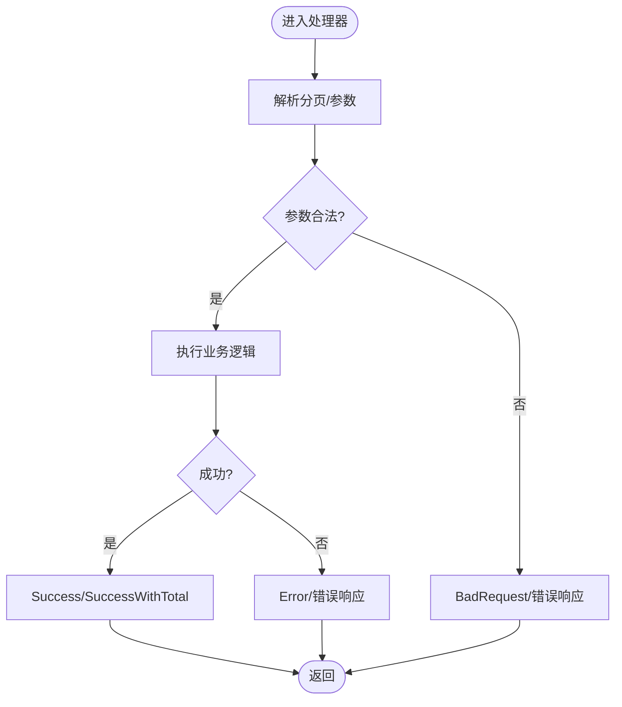
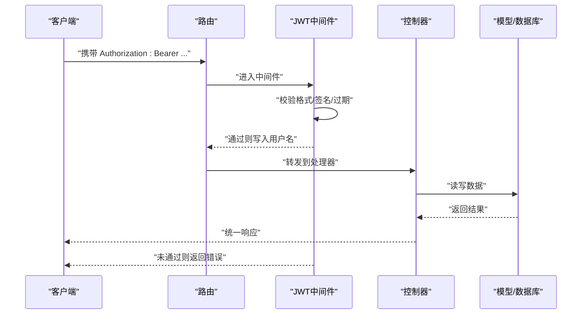
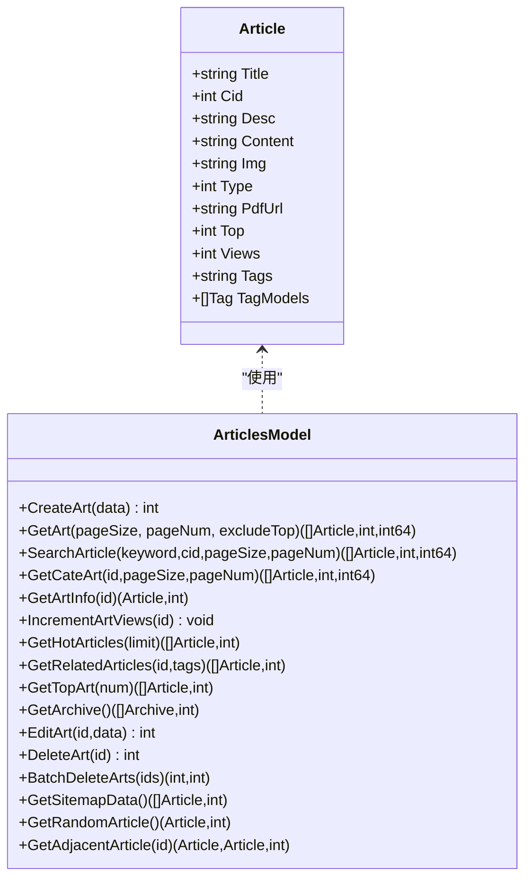
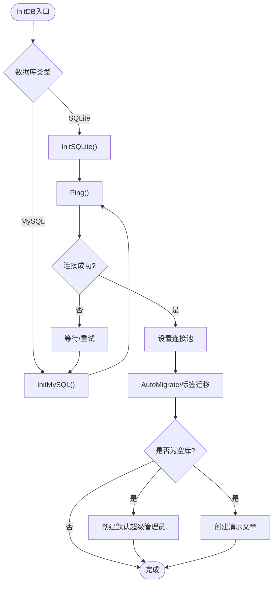
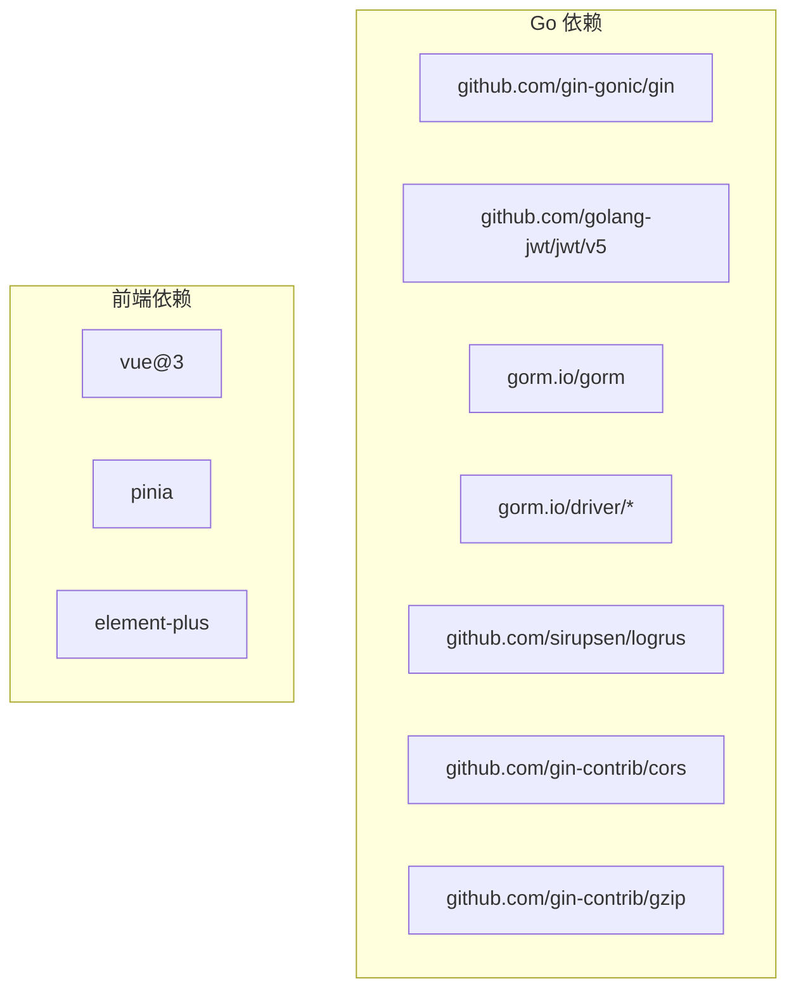

# 开发指南

<cite>
**本文引用的文件**
- [main.go](file://main.go)
- [routers.go](file://routers/routers.go)
- [DB.go](file://model/DB.go)
- [response.go](file://utils/response.go)
- [jwt.go](file://middlewares/jwt.go)
- [errmsg.go](file://utils/errmsg/errmsg.go)
- [articles_v1.go](file://api/v1/articles_v1.go)
- [Articles.go](file://model/Articles.go)
- [main.ts（后端）](file://web/backend/src/main.ts)
- [main.ts（前端）](file://web/frontend/src/main.ts)
- [config_template.yaml](file://config/config_template.yaml)
- [go.mod](file://go.mod)
</cite>

## 目录
1. [简介](#简介)
2. [项目结构](#项目结构)
3. [核心组件](#核心组件)
4. [架构总览](#架构总览)
5. [详细组件分析](#详细组件分析)
6. [依赖分析](#依赖分析)
7. [性能考虑](#性能考虑)
8. [故障排查指南](#故障排查指南)
9. [结论](#结论)
10. [附录](#附录)

## 简介
本开发指南面向 YanBlog 的贡献者与扩展开发者，系统阐述后端 Go 语言与前端 Vue 生态的代码结构、开发规范、API 扩展流程、错误处理与统一响应设计、测试策略、代码审查与质量保障、调试技巧与工具推荐、版本管理与分支策略，帮助你在不深入源码细节的前提下快速上手并高质量交付。

## 项目结构
- 后端入口与路由
  - 入口程序负责配置校验、JWT 密钥刷新、打印启动信息、初始化数据库与路由注册。
  - 路由层按“公开/认证/管理员”三组划分，统一挂载静态资源与 gzip 压缩。
- 数据模型与持久化
  - 支持 SQLite 与 MySQL，自动迁移与首次示例数据注入；提供文章、分类、标签、用户等模型与常用查询。
- API 层（v1）
  - 提供文章、分类、标签、用户、文件、配置、系统状态等接口，遵循统一响应与参数解析。
- 中间件
  - 日志、CORS、JWT 认证与管理员鉴权、登录频率限制。
- 工具库
  - 统一响应封装、错误码与消息映射、分页参数解析、配置校验与启动信息打印。
- 前端（Vue 3 + TypeScript）
  - 后台管理端与前台展示端分别构建，共享组件体系与工具库，采用 Pinia 状态管理与 Element Plus UI。

图表来源
- [main.go:12-31](file://main.go#L12-L31)
- [routers.go:13-122](file://routers/routers.go#L13-L122)
- [DB.go:26-79](file://model/DB.go#L26-L79)
- [response.go:17-100](file://utils/response.go#L17-L100)
- [jwt.go:98-157](file://middlewares/jwt.go#L98-L157)
- [Articles.go:51-389](file://model/Articles.go#L51-L389)

章节来源
- [main.go:12-31](file://main.go#L12-L31)
- [routers.go:13-122](file://routers/routers.go#L13-L122)
- [DB.go:26-79](file://model/DB.go#L26-L79)
- [response.go:17-100](file://utils/response.go#L17-L100)
- [jwt.go:98-157](file://middlewares/jwt.go#L98-L157)
- [Articles.go:51-389](file://model/Articles.go#L51-L389)

## 核心组件
- 应用入口与生命周期
  - 配置校验失败直接退出；JWT 密钥在配置重载后刷新；初始化数据库与路由。
- 路由与中间件
  - Gin 路由器设置运行模式、内存限制、gzip 压缩、静态资源与跨域；按组划分公开、认证、管理员权限。
- 统一响应与错误码
  - 统一 JSON 结构，前后端一致；错误码集中管理并提供本地化消息映射。
- JWT 认证与权限控制
  - Bearer Token 格式校验、签名验证、过期检查；管理员中间件按角色拒绝越权。
- 数据访问与模型
  - GORM 操作封装，含分页、聚合、随机、归档、相邻文章、相关文章等常用查询。
- 前端应用
  - 后台管理端与前台展示端分别初始化，注册图标、UI 组件、路由与全局错误处理。

章节来源
- [main.go:12-31](file://main.go#L12-L31)
- [routers.go:13-122](file://routers/routers.go#L13-L122)
- [response.go:17-100](file://utils/response.go#L17-L100)
- [errmsg.go:1-57](file://utils/errmsg/errmsg.go#L1-L57)
- [jwt.go:98-157](file://middlewares/jwt.go#L98-L157)
- [Articles.go:51-389](file://model/Articles.go#L51-L389)
- [main.ts（前端）:1-28](file://web/frontend/src/main.ts#L1-L28)
- [main.ts（后端）:1-23](file://web/backend/src/main.ts#L1-L23)

## 架构总览
后端采用“入口 -> 路由 -> 中间件 -> 控制器 -> 模型 -> 数据库”的清晰分层；前端通过统一的服务层与后端 API 对接，组件化复用，状态管理集中化。

图表来源
- [main.go:12-31](file://main.go#L12-L31)
- [routers.go:13-122](file://routers/routers.go#L13-L122)
- [Articles.go:51-389](file://model/Articles.go#L51-L389)

## 详细组件分析

### 统一响应与错误处理
- 设计理念
  - 响应体包含 status、data、message；错误响应使用 200 + 自定义 status 字段，便于前端统一处理。
  - 分页参数解析支持“查询全部”模式与上限保护，避免恶意请求。
- 关键实现
  - 统一响应封装与分页解析位于工具库；错误码集中于错误消息模块。
- 使用建议
  - 新增接口优先调用统一封装，避免重复 JSON 结构；错误码新增需同步维护映射表。

图表来源
- [response.go:66-100](file://utils/response.go#L66-L100)
- [errmsg.go:30-57](file://utils/errmsg/errmsg.go#L30-L57)

章节来源
- [response.go:17-100](file://utils/response.go#L17-L100)
- [errmsg.go:1-57](file://utils/errmsg/errmsg.go#L1-L57)

### JWT 认证与管理员权限
- 认证流程
  - 请求头携带 Bearer Token；中间件校验格式、签名、过期；通过后将用户名写入上下文。
- 管理员鉴权
  - 依据用户角色拒绝越权操作；统一错误响应。
- 安全要点
  - JWT 密钥来自配置，支持重载后刷新；生产环境务必设置强密钥。

图表来源
- [jwt.go:98-157](file://middlewares/jwt.go#L98-L157)
- [routers.go:39-96](file://routers/routers.go#L39-L96)

章节来源
- [jwt.go:98-157](file://middlewares/jwt.go#L98-L157)
- [routers.go:39-96](file://routers/routers.go#L39-L96)

### 文章模块（典型控制器与模型）
- 控制器职责
  - 接收请求参数、绑定输入、调用模型、返回统一响应；部分接口包含路径参数解析与批量操作。
- 模型职责
  - 封装 CRUD、搜索、聚合、随机、归档、相邻/相关文章等查询；标签解析与多对多关联维护。
- 性能与边界
  - 分页查询先查总数再分页，避免 N+1；随机与日期聚合根据数据库类型适配方言。

图表来源
- [Articles.go:11-25](file://model/Articles.go#L11-L25)
- [Articles.go:51-389](file://model/Articles.go#L51-L389)

章节来源
- [articles_v1.go:18-273](file://api/v1/articles_v1.go#L18-L273)
- [Articles.go:51-389](file://model/Articles.go#L51-L389)

### 数据库初始化与迁移
- 初始化流程
  - 根据配置选择 SQLite 或 MySQL；连接失败自动重试；设置连接池；自动迁移模型与标签迁移；首次运行创建默认超级管理员与演示文章。
- 安全提示
  - 默认管理员密码仅用于开发环境，生产必须修改。

图表来源
- [DB.go:26-79](file://model/DB.go#L26-L79)
- [DB.go:81-159](file://model/DB.go#L81-L159)
- [DB.go:161-239](file://model/DB.go#L161-L239)

章节来源
- [DB.go:26-79](file://model/DB.go#L26-L79)
- [DB.go:81-159](file://model/DB.go#L81-L159)
- [DB.go:161-239](file://model/DB.go#L161-L239)

### 前端应用初始化与全局错误处理
- 初始化差异
  - 前台与后台入口分别注册 UI 组件、路由与指令；前台启用 Pinia 与懒加载指令，并设置全局错误处理回调。
- 建议
  - 组件内错误尽量局部捕获，避免影响全局；必要时上报至监控系统。

章节来源
- [main.ts（前端）:1-28](file://web/frontend/src/main.ts#L1-L28)
- [main.ts（后端）:1-23](file://web/backend/src/main.ts#L1-L23)

## 依赖分析
- 后端依赖
  - Web 框架：Gin；JWT：golang-jwt；ORM：GORM；数据库驱动：sqlite/mysql；日志与压缩：logrus、gzip；跨域：cors；工具：yaml、validator。
- 前端依赖
  - Vue 3、Pinia、Element Plus、路由与构建工具（Vite/TS）。

图表来源
- [go.mod:5-19](file://go.mod#L5-L19)
- [go.mod:21-72](file://go.mod#L21-L72)

章节来源
- [go.mod:5-19](file://go.mod#L5-L19)
- [go.mod:21-72](file://go.mod#L21-L72)

## 性能考虑
- 路由与中间件
  - 启用 gzip 压缩；合理设置内存限制；静态资源缓存友好。
- 数据访问
  - 分页查询先 Count 再 Limit；避免不必要的 Preload；聚合查询按数据库方言优化。
- 文章浏览量
  - 使用 UpdateColumn 原子递增，避免更新时间戳。
- 建议
  - 对高频接口增加缓存层；对大对象传输启用压缩；数据库连接池参数结合并发调优。

章节来源
- [routers.go:17-24](file://routers/routers.go#L17-L24)
- [Articles.go:145-149](file://model/Articles.go#L145-L149)
- [Articles.go:89-100](file://model/Articles.go#L89-L100)

## 故障排查指南
- 启动阶段
  - 配置校验失败：检查配置文件路径与必填项；确认密钥与数据库连接信息。
  - 数据库连接失败：查看重试日志与数据库服务状态。
- 认证问题
  - 401/Token 错误：确认 Authorization 头格式、签名密钥与过期时间。
- 接口异常
  - 统一响应中的 status 字段定位错误类型；结合错误码映射快速定位。
- 前端白屏
  - 查看全局错误处理输出，定位具体组件与错误信息。

章节来源
- [main.go:14-18](file://main.go#L14-L18)
- [DB.go:81-122](file://model/DB.go#L81-L122)
- [jwt.go:100-157](file://middlewares/jwt.go#L100-L157)
- [response.go:17-100](file://utils/response.go#L17-L100)
- [main.ts（前端）:21-26](file://web/frontend/src/main.ts#L21-L26)

## 结论
YanBlog 采用清晰的分层架构与统一的响应设计，结合 JWT 权限控制与 GORM 数据访问封装，既满足快速迭代又兼顾可维护性。遵循本文的开发规范与最佳实践，可在保证质量的同时高效扩展新功能。

## 附录

### 开发规范与最佳实践
- Go 后端
  - 遵循 Go 官方编码风格；接口参数与响应结构保持一致；错误码集中管理；日志分级明确。
- Vue 前端
  - 组件职责单一；状态集中管理；全局错误处理；样式与主题可配置。
- 配置
  - 使用模板复制为实际配置文件；生产环境务必设置强 JWT 密钥与安全的数据库凭据。

章节来源
- [config_template.yaml:1-29](file://config/config_template.yaml#L1-L29)

### 如何添加新的 API 接口
- 步骤
  - 在路由层注册新接口（按公开/认证/管理员分组）。
  - 在控制器层实现业务逻辑，使用统一响应与参数解析。
  - 在模型层补充数据访问方法（如需）。
  - 增加错误码与消息映射（如需）。
  - 编写单元/集成测试覆盖关键路径。
- 示例参考
  - 文章模块的新增、查询、编辑、删除接口实现与模型查询封装。

章节来源
- [routers.go:47-118](file://routers/routers.go#L47-L118)
- [articles_v1.go:18-273](file://api/v1/articles_v1.go#L18-L273)
- [Articles.go:51-389](file://model/Articles.go#L51-L389)
- [response.go:17-100](file://utils/response.go#L17-L100)
- [errmsg.go:1-57](file://utils/errmsg/errmsg.go#L1-L57)

### 测试策略
- 单元测试
  - 针对控制器与模型方法进行隔离测试，模拟请求参数与数据库行为。
- 集成测试
  - 启动完整服务，验证路由、中间件、认证与数据库交互。
- 端到端测试
  - 使用浏览器自动化工具覆盖关键用户流程（登录、文章管理、配置更新等）。
- 建议
  - 为高频接口与核心业务建立回归用例；持续集成中加入测试步骤。

[本节为通用指导，不直接分析具体文件，故无章节来源]

### 代码审查与质量保证
- 审查清单
  - 接口设计一致性、错误码与消息、参数校验、权限控制、日志与安全、性能与边界条件。
- 工具与流程
  - 使用 linter 与格式化工具；提交前运行测试；分支合并前至少一次同行评审。

[本节为通用指导，不直接分析具体文件，故无章节来源]

### 调试技巧与开发工具推荐
- 后端
  - Gin 调试模式、日志钩子、数据库连接池观察、压测工具。
- 前端
  - Vue DevTools、网络面板、全局错误处理日志、懒加载与骨架屏辅助调试。
- 建议
  - 使用断点与条件断点定位复杂问题；对热点路径做性能剖析。

[本节为通用指导，不直接分析具体文件，故无章节来源]

### 版本管理与分支策略
- 建议
  - 主干稳定发布，特性与修复使用分支；语义化版本号；变更日志与发布说明规范化。
- 配置
  - 使用模板配置文件作为基线，避免硬编码敏感信息。

[本节为通用指导，不直接分析具体文件，故无章节来源]