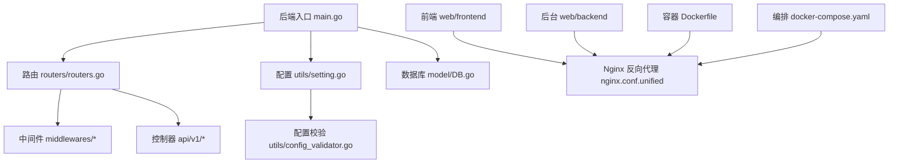
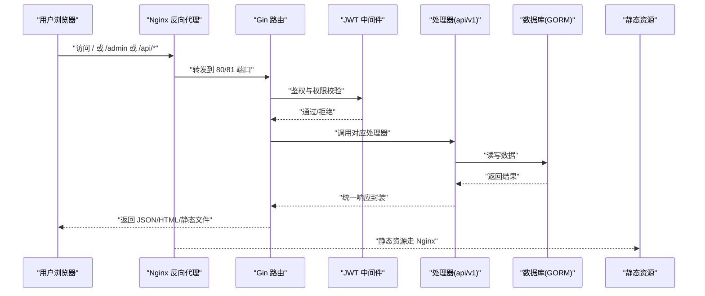
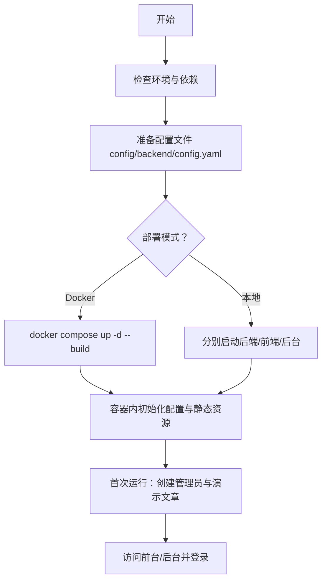
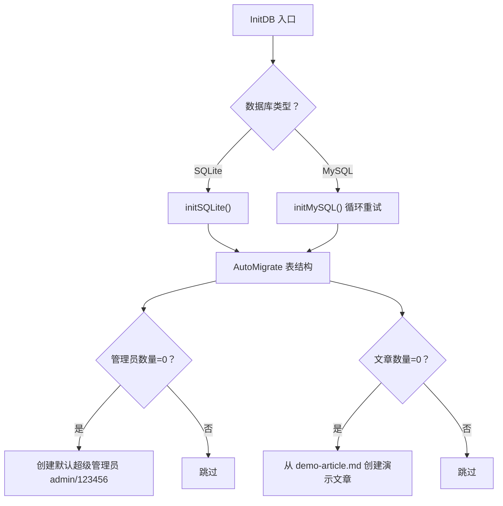
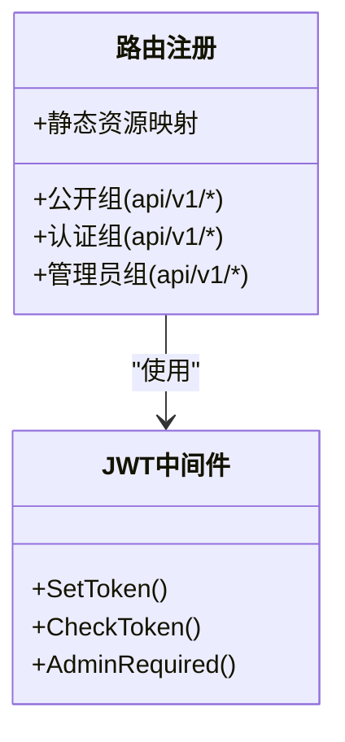
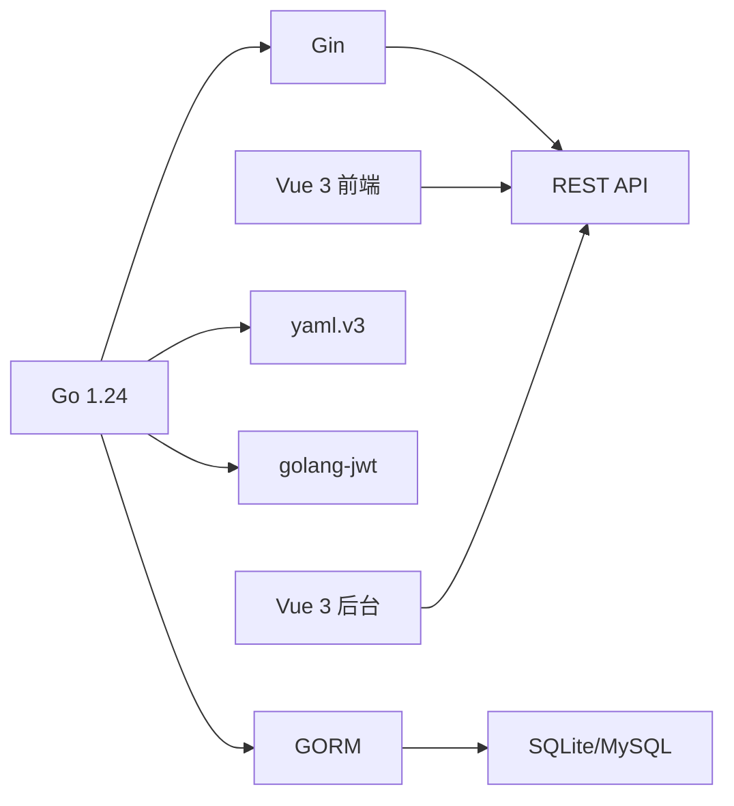

# 快速开始

<cite>
**本文引用的文件**
- [README.md](file://README.md)
- [main.go](file://main.go)
- [go.mod](file://go.mod)
- [config/config_template.yaml](file://config/config_template.yaml)
- [utils/setting.go](file://utils/setting.go)
- [utils/config_validator.go](file://utils/config_validator.go)
- [model/DB.go](file://model/DB.go)
- [routers/routers.go](file://routers/routers.go)
- [middlewares/jwt.go](file://middlewares/jwt.go)
- [Dockerfile](file://Dockerfile)
- [docker-compose.yaml](file://docker-compose.yaml)
- [nginx.conf.unified](file://nginx.conf.unified)
- [web/backend/package.json](file://web/backend/package.json)
- [web/frontend/package.json](file://web/frontend/package.json)
- [web/frontend/public/config.yaml](file://web/frontend/public/config.yaml)
- [web/frontend/src/services/api.ts](file://web/frontend/src/services/api.ts)
</cite>

## 目录
1. [简介](#简介)
2. [项目结构](#项目结构)
3. [核心组件](#核心组件)
4. [架构总览](#架构总览)
5. [详细组件分析](#详细组件分析)
6. [依赖关系分析](#依赖关系分析)
7. [性能注意事项](#性能注意事项)
8. [故障排除指南](#故障排除指南)
9. [结论](#结论)
10. [附录](#附录)

## 简介
本指南面向首次接触 YanBlog 的用户，帮助你在最短时间内完成环境准备、安装配置、启动运行与基础使用。YanBlog 是一个基于 Go + Vue 3 的前后端分离博客系统，支持暗黑模式、Markdown 编辑、Docker 一键部署，并提供后台可视化配置与文件管理能力。

## 项目结构
仓库采用“后端 Go + 前端 Vue 3 + Nginx 统一入口”的组织方式，核心目录与职责如下：
- 后端入口与核心逻辑：main.go、routers、middlewares、model、utils、api/v1
- 配置模板：config/config_template.yaml
- 前端与后台 UI：web/frontend、web/backend
- 容器化与编排：Dockerfile、docker-compose.yaml、nginx.conf.unified
- 依赖与版本：go.mod

图表来源
- [main.go:12-31](file://main.go#L12-L31)
- [routers/routers.go:13-122](file://routers/routers.go#L13-L122)
- [utils/setting.go:47-98](file://utils/setting.go#L47-L98)
- [utils/config_validator.go:13-54](file://utils/config_validator.go#L13-L54)
- [model/DB.go:26-79](file://model/DB.go#L26-L79)
- [nginx.conf.unified:1-43](file://nginx.conf.unified#L1-L43)
- [Dockerfile:1-89](file://Dockerfile#L1-L89)
- [docker-compose.yaml:1-16](file://docker-compose.yaml#L1-L16)

章节来源
- [README.md:58-74](file://README.md#L58-L74)
- [main.go:12-31](file://main.go#L12-L31)
- [routers/routers.go:13-122](file://routers/routers.go#L13-L122)
- [utils/setting.go:47-98](file://utils/setting.go#L47-L98)
- [model/DB.go:26-79](file://model/DB.go#L26-L79)
- [Dockerfile:1-89](file://Dockerfile#L1-L89)
- [docker-compose.yaml:1-16](file://docker-compose.yaml#L1-L16)
- [nginx.conf.unified:1-43](file://nginx.conf.unified#L1-L43)

## 核心组件
- 后端启动与生命周期
  - 配置校验：启动前对数据库、JWT、端口等进行校验，必要时生成临时 JWT 密钥并打印启动信息。
  - 数据库初始化：根据配置选择 SQLite 或 MySQL，自动迁移表结构，首次运行创建默认管理员与演示文章。
  - 路由注册：按权限与公开需求注册 API 路由，提供静态资源服务与 gzip 压缩。
- 配置系统
  - 支持多路径回退加载配置，优先级：config/backend/config.yaml → config/config.yaml → config/config_template.yaml。
  - 支持环境变量替换占位符，便于容器化部署。
- 中间件体系
  - 日志、CORS、Gzip、JWT 认证与管理员权限控制。
- 前后端与容器化
  - 前端与后台分别构建并由 Nginx 提供统一入口，Docker Compose 将前端、后台、后端与静态资源整合为单一服务。

章节来源
- [main.go:12-31](file://main.go#L12-L31)
- [utils/config_validator.go:13-54](file://utils/config_validator.go#L13-L54)
- [utils/setting.go:47-98](file://utils/setting.go#L47-L98)
- [model/DB.go:26-79](file://model/DB.go#L26-L79)
- [routers/routers.go:13-122](file://routers/routers.go#L13-L122)
- [middlewares/jwt.go:15-157](file://middlewares/jwt.go#L15-L157)
- [Dockerfile:1-89](file://Dockerfile#L1-L89)
- [docker-compose.yaml:1-16](file://docker-compose.yaml#L1-L16)
- [nginx.conf.unified:1-43](file://nginx.conf.unified#L1-L43)

## 架构总览
下图展示了从浏览器访问到后端响应的完整链路，涵盖 Nginx 反代、API 路由、JWT 认证、数据库访问与静态资源服务。

图表来源
- [nginx.conf.unified:8-42](file://nginx.conf.unified#L8-L42)
- [routers/routers.go:13-122](file://routers/routers.go#L13-L122)
- [middlewares/jwt.go:100-157](file://middlewares/jwt.go#L100-L157)
- [model/DB.go:26-79](file://model/DB.go#L26-L79)
- [utils/response.go:17-100](file://utils/response.go#L17-L100)

## 详细组件分析

### 启动流程与控制流
从克隆代码到成功运行的关键步骤如下：
1) 环境准备
- Go 版本：1.24+
- Node.js 版本：20.x 或 22.x（详见前端与后台 package.json engines）
- 数据库：SQLite（开发默认）或 MySQL（生产）
2) 配置准备
- 复制模板为 config/backend/config.yaml，并设置 JwtKey（建议使用足够长度的随机密钥）
- 如需 MySQL，填写 DbHost、DbPort、DbUser、DbPassWord、DbName
3) 启动方式
- Docker（推荐）：复制配置后执行 docker compose up -d --build
- 本地开发：分别启动后端、前台、后台开发服务
4) 首次运行
- 自动创建默认管理员与演示文章
- 前端配置可在线编辑或直接修改 web/frontend/public/config.yaml

图表来源
- [README.md:7-34](file://README.md#L7-L34)
- [config/config_template.yaml:6-29](file://config/config_template.yaml#L6-L29)
- [utils/config_validator.go:13-54](file://utils/config_validator.go#L13-L54)
- [model/DB.go:50-71](file://model/DB.go#L50-L71)
- [Dockerfile:72-89](file://Dockerfile#L72-L89)

章节来源
- [README.md:7-34](file://README.md#L7-L34)
- [go.mod:3](file://go.mod#L3)
- [web/frontend/package.json:6-8](file://web/frontend/package.json#L6-L8)
- [web/backend/package.json:6-8](file://web/backend/package.json#L6-L8)
- [config/config_template.yaml:6-29](file://config/config_template.yaml#L6-L29)
- [utils/config_validator.go:13-54](file://utils/config_validator.go#L13-L54)
- [model/DB.go:50-71](file://model/DB.go#L50-L71)
- [Dockerfile:72-89](file://Dockerfile#L72-L89)

### 配置文件详解
- 后端配置（config/backend/config.yaml）
  - server.AppMode：运行模式（debug/release）
  - server.HttpPort：后端监听端口
  - server.SiteUrl：站点 URL（用于生成链接）
  - database.Db：数据库类型（SQLite/MySQL）
  - database.DbHost/DbPort/DbUser/DbPassWord/DbName：数据库连接参数
  - JwtKey：JWT 密钥（必须设置，建议足够长度的随机串）
  - weather.DefaultCity：默认城市（天气服务）
  - FrontEndConfigPath：前端配置文件路径
- 前端配置（web/frontend/public/config.yaml）
  - blog_name、author_name、favicon、logo、页脚信息、社交链接、快捷方式、评论开关等
- 配置加载与覆盖机制
  - 加载顺序与回退策略见配置系统实现
  - 支持环境变量替换占位符

章节来源
- [config/config_template.yaml:6-29](file://config/config_template.yaml#L6-L29)
- [utils/setting.go:47-98](file://utils/setting.go#L47-L98)
- [utils/setting.go:100-117](file://utils/setting.go#L100-L117)
- [web/frontend/public/config.yaml:1-123](file://web/frontend/public/config.yaml#L1-L123)

### 数据库初始化与迁移
- SQLite：默认使用文件型数据库，自动创建目录与表
- MySQL：支持重试连接，自动迁移表结构，首次运行创建默认管理员与演示文章
- 标签迁移：从历史文章提取并迁移标签

图表来源
- [model/DB.go:26-79](file://model/DB.go#L26-L79)
- [model/DB.go:81-122](file://model/DB.go#L81-L122)
- [model/DB.go:124-159](file://model/DB.go#L124-L159)
- [model/DB.go:161-209](file://model/DB.go#L161-L209)
- [model/DB.go:211-239](file://model/DB.go#L211-L239)

章节来源
- [model/DB.go:26-79](file://model/DB.go#L26-L79)
- [model/DB.go:81-122](file://model/DB.go#L81-L122)
- [model/DB.go:124-159](file://model/DB.go#L124-L159)
- [model/DB.go:161-209](file://model/DB.go#L161-L209)
- [model/DB.go:211-239](file://model/DB.go#L211-L239)

### 路由与权限控制
- 路由分组
  - 公开接口：文章、分类、标签、天气、健康检查、登录等
  - 需认证接口：文件管理、配置管理、系统状态等
  - 管理员接口：用户、分类、文章、标签、上传、文件批量操作等
- 中间件
  - 日志、恢复、Gzip、CORS
  - JWT 认证与管理员权限校验
- 静态资源
  - /uploads、/static、/iconfont、/favicon.ico、/config.yaml

图表来源
- [routers/routers.go:13-122](file://routers/routers.go#L13-L122)
- [middlewares/jwt.go:15-157](file://middlewares/jwt.go#L15-L157)

章节来源
- [routers/routers.go:13-122](file://routers/routers.go#L13-L122)
- [middlewares/jwt.go:15-157](file://middlewares/jwt.go#L15-L157)

### 前端与后台开发体验
- 前端（博客前台）：Vite + Vue 3 + TypeScript，开发端口由 Vite 管理
- 后台（管理后台）：Element Plus + Vue 3，开发端口独立
- API 基础路径：/api/v1，统一拦截与错误处理

章节来源
- [web/frontend/package.json:9-14](file://web/frontend/package.json#L9-L14)
- [web/backend/package.json:9-18](file://web/backend/package.json#L9-L18)
- [web/frontend/src/services/api.ts:3-9](file://web/frontend/src/services/api.ts#L3-L9)

### 容器化与部署
- 多阶段构建：Go 后端、前端、后台 UI 分别构建，最终合并至 Nginx 镜像
- 统一入口：Nginx 监听 80/81，反向代理 /api 至后端，提供前台与后台静态资源
- 持久化卷：uploads、data、config
- 首次启动：若缺少配置则从模板初始化，前端配置从演示文件复制

章节来源
- [Dockerfile:1-89](file://Dockerfile#L1-L89)
- [docker-compose.yaml:1-16](file://docker-compose.yaml#L1-L16)
- [nginx.conf.unified:1-43](file://nginx.conf.unified#L1-L43)
- [Dockerfile:72-89](file://Dockerfile#L72-L89)

## 依赖关系分析
- 后端依赖
  - Web 框架：Gin + Gzip/CORS
  - ORM：GORM + sqlite/mysql 驱动
  - JWT：golang-jwt
  - 日志：logrus + file-rotatelogs
  - YAML：gopkg.in/yaml.v3
- 前端与后台依赖
  - Vue 3、TypeScript、Vite、Element Plus、Axios、Pinia 等
- 版本约束
  - Go 1.24
  - Node.js 20.x 或 22.x

图表来源
- [go.mod:3](file://go.mod#L3)
- [go.mod:5-18](file://go.mod#L5-L18)
- [web/frontend/package.json:16-30](file://web/frontend/package.json#L16-L30)
- [web/backend/package.json:20-35](file://web/backend/package.json#L20-L35)

章节来源
- [go.mod:3](file://go.mod#L3)
- [go.mod:5-18](file://go.mod#L5-L18)
- [web/frontend/package.json:6-8](file://web/frontend/package.json#L6-L8)
- [web/backend/package.json:6-8](file://web/backend/package.json#L6-L8)

## 性能注意事项
- 启用 gzip 压缩以减少传输体积
- 合理设置数据库连接池参数（空闲/活跃连接数、生命周期）
- 前端静态资源由 Nginx 提供，减少后端压力
- 批量上传支持最大 200MB，注意内存与磁盘 IO

章节来源
- [routers/routers.go:23](file://routers/routers.go#L23)
- [model/DB.go:41-44](file://model/DB.go#L41-L44)
- [nginx.conf.unified:4](file://nginx.conf.unified#L4)

## 故障排除指南
- 启动时报配置错误
  - 检查 config/backend/config.yaml 是否存在，JwtKey 是否设置，数据库参数是否正确
  - 若为空或默认密码，系统会打印警告并尝试继续运行
- 数据库连接失败
  - 若使用 MySQL，确认主机、端口、凭据与数据库名正确；容器模式下确保服务连通
  - 后端对 MySQL 连接有重试机制，等待服务就绪
- JWT 相关问题
  - 未设置 JwtKey 时系统会生成临时密钥，建议尽快设置永久密钥
  - 登录后 Token 过期或格式错误会导致认证失败
- 前端无法访问或空白
  - 确认 Nginx 反代 /api 指向后端地址，静态资源路径正确
  - 检查 /config.yaml 是否可被访问（后台配置管理会写入该文件）
- 权限不足
  - 管理员接口需要管理员权限，确认登录用户角色

章节来源
- [utils/config_validator.go:13-54](file://utils/config_validator.go#L13-L54)
- [model/DB.go:81-122](file://model/DB.go#L81-L122)
- [middlewares/jwt.go:15-157](file://middlewares/jwt.go#L15-L157)
- [nginx.conf.unified:14-21](file://nginx.conf.unified#L14-L21)
- [routers/routers.go:36](file://routers/routers.go#L36)

## 结论
按照本指南完成环境准备、配置设置与启动流程，你可以在本地或容器环境中快速运行 YanBlog，并通过后台完成博客的可视化配置与日常维护。遇到问题时，可依据故障排除章节逐项排查。

## 附录

### 环境要求速查
- Go：1.24
- Node.js：20.x 或 22.x
- 数据库：SQLite（开发）或 MySQL（生产）
- 容器：Docker 与 docker-compose

章节来源
- [go.mod:3](file://go.mod#L3)
- [web/frontend/package.json:6-8](file://web/frontend/package.json#L6-L8)
- [web/backend/package.json:6-8](file://web/backend/package.json#L6-L8)
- [README.md:40-46](file://README.md#L40-L46)

### 配置项速查
- 后端配置关键项：server.AppMode、server.HttpPort、server.SiteUrl、database.Db、database.Db*、JwtKey、weather.DefaultCity、FrontEndConfigPath
- 前端配置关键项：blog_name、author_name、favicon、logo、socials、footer、comment 等

章节来源
- [config/config_template.yaml:6-29](file://config/config_template.yaml#L6-L29)
- [web/frontend/public/config.yaml:1-123](file://web/frontend/public/config.yaml#L1-L123)

### 启动命令速查
- Docker：复制配置后执行 docker compose up -d --build
- 本地开发：后端 go run main.go；前台 cd web/frontend && npm install && npm run dev；后台 cd web/backend && npm install && npm run dev

章节来源
- [README.md:7-34](file://README.md#L7-L34)