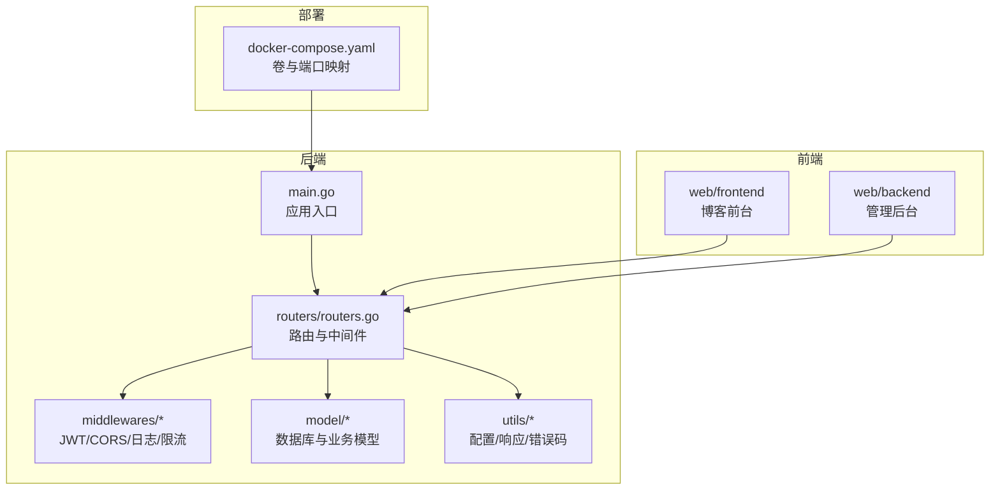
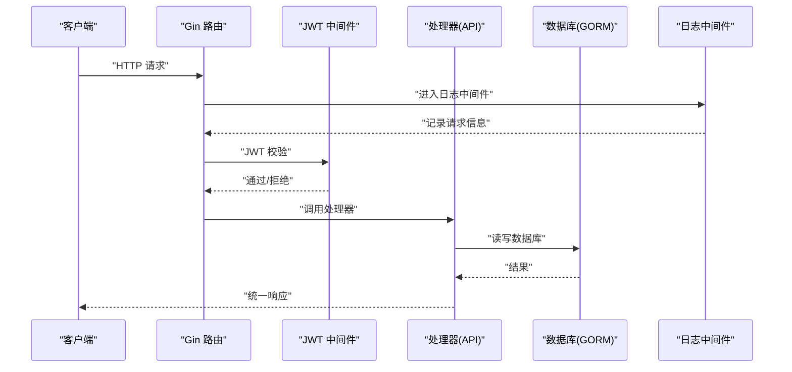
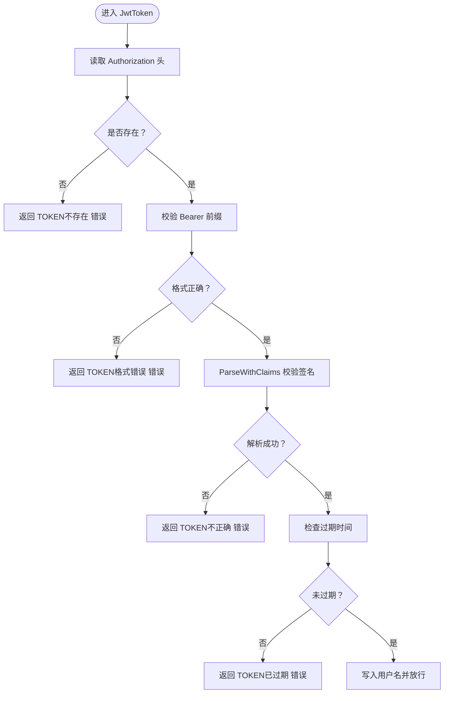
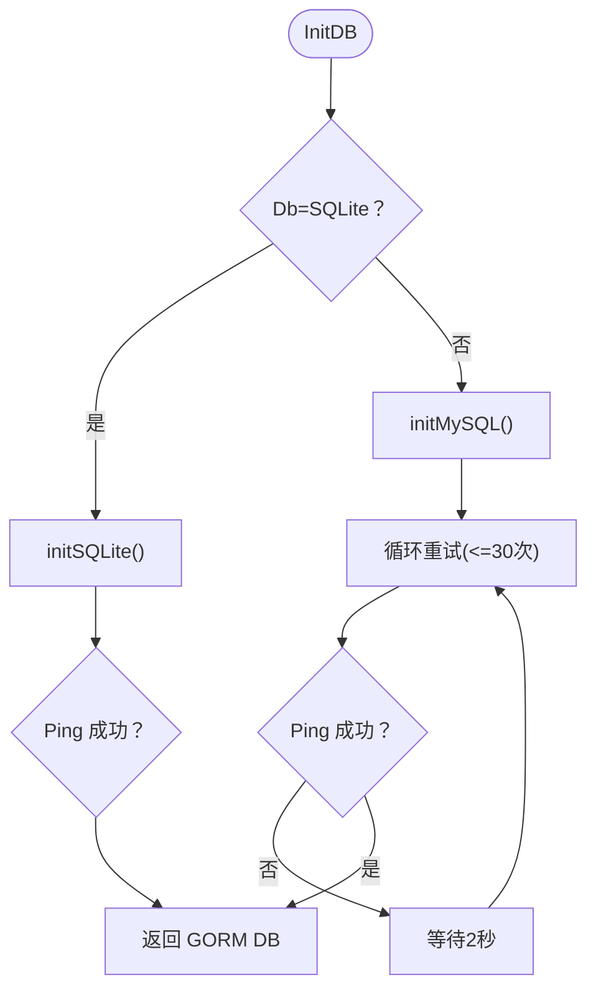
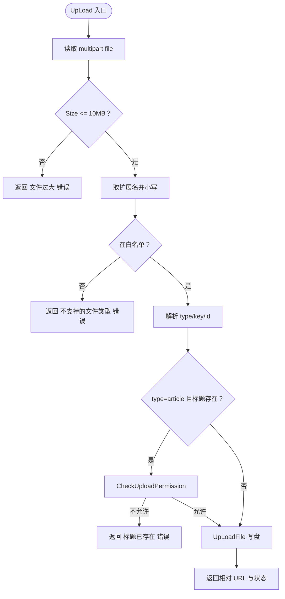
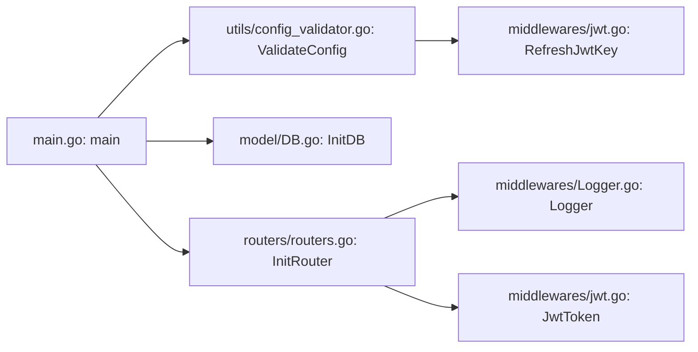

# 故障排除与常见问题

<cite>
**本文引用的文件**
- [main.go](file://main.go)
- [config_template.yaml](file://config/config_template.yaml)
- [config_validator.go](file://utils/config_validator.go)
- [PrintStartupInfo:56-84](file://utils/config_validator.go#L56-L84)
- [generateTempKey:86-91](file://utils/config_validator.go#L86-L91)
- [DB.go](file://model/DB.go)
- [initMySQL:81-122](file://model/DB.go#L81-L122)
- [initSQLite:124-159](file://model/DB.go#L124-L159)
- [migrateTags:161-209](file://model/DB.go#L161-L209)
- [createDemoArticle:211-239](file://model/DB.go#L211-L239)
- [loadDemoArticle:241-308](file://model/DB.go#L241-L308)
- [getFallbackContent:310-312](file://model/DB.go#L310-L312)
- [Logger.go](file://middlewares/Logger.go)
- [jwt.go](file://middlewares/jwt.go)
- [RefreshJwtKey:17-20](file://middlewares/jwt.go#L17-L20)
- [SetToken:27-49](file://middlewares/jwt.go#L27-L49)
- [CheckToken:51-69](file://middlewares/jwt.go#L51-L69)
- [JwtToken:98-157](file://middlewares/jwt.go#L98-L157)
- [routers.go](file://routers/routers.go)
- [login_v1.go](file://api/v1/login_v1.go)
- [upload_v1.go](file://api/v1/upload_v1.go)
- [Upload.go](file://model/Upload.go)
- [Users.go](file://model/Users.go)
- [response.go](file://utils/response.go)
- [docker-compose.yaml](file://docker-compose.yaml)
- [README.md](file://README.md)
</cite>

## 目录
1. [简介](#简介)
2. [项目结构](#项目结构)
3. [核心组件](#核心组件)
4. [架构总览](#架构总览)
5. [详细组件分析](#详细组件分析)
6. [依赖分析](#依赖分析)
7. [性能考虑](#性能考虑)
8. [故障排除指南](#故障排除指南)
9. [结论](#结论)
10. [附录](#附录)

## 简介
本文件面向开发者与运维人员，提供 YanBlog 的系统化故障排除与常见问题解答。内容涵盖配置错误、数据库连接问题、JWT 认证失败、文件上传异常、系统日志分析与错误追踪、性能诊断与优化建议，以及不同环境下的排查流程与调试工具使用指南。目标是帮助你在最短时间内定位并修复问题。

## 项目结构
YanBlog 采用后端 Go + Gin + GORM、前端 Vue 3 的前后端分离架构。后端负责 API、认证、文件上传与数据库迁移；前端与后台分别提供博客前台与管理后台界面；Docker Compose 提供一键部署与持久化卷挂载。

图表来源
- [main.go:12-31](file://main.go#L12-L31)
- [routers.go:13-122](file://routers/routers.go#L13-L122)
- [docker-compose.yaml:1-16](file://docker-compose.yaml#L1-L16)

章节来源
- [main.go:12-31](file://main.go#L12-L31)
- [routers.go:13-122](file://routers/routers.go#L13-L122)
- [README.md:58-74](file://README.md#L58-L74)

## 核心组件
- 应用入口与启动流程：加载配置、刷新 JWT 密钥、打印启动信息、初始化数据库、注册路由。
- 配置校验与启动信息：验证数据库、JWT、端口等关键配置，并在必要时生成临时 JWT 密钥。
- 数据库初始化：支持 SQLite 与 MySQL，自动迁移表结构，首次运行创建默认管理员与演示文章。
- 中间件体系：日志、CORS、JWT 认证、Gzip 压缩、恢复处理。
- 路由与权限：区分公开接口与认证/管理员接口，统一静态资源服务。
- 文件上传：白名单校验、大小限制、目录分片策略、返回相对 URL。
- 统一响应与错误码：规范 API 响应结构，便于前端与调试。

章节来源
- [main.go:12-31](file://main.go#L12-L31)
- [config_validator.go:11-54](file://utils/config_validator.go#L11-L54)
- [DB.go:26-79](file://model/DB.go#L26-L79)
- [Logger.go:15-103](file://middlewares/Logger.go#L15-L103)
- [jwt.go:17-157](file://middlewares/jwt.go#L17-L157)
- [routers.go:13-122](file://routers/routers.go#L13-L122)
- [upload_v1.go:27-93](file://api/v1/upload_v1.go#L27-L93)
- [response.go:17-100](file://utils/response.go#L17-L100)

## 架构总览
后端通过 Gin 注册路由与中间件，JWT 中间件拦截受保护接口；数据库根据配置选择 SQLite 或 MySQL；文件上传落地到 uploads 目录并返回相对 URL；日志中间件记录请求耗时、状态码、客户端信息等。

图表来源
- [routers.go:13-122](file://routers/routers.go#L13-L122)
- [Logger.go:62-101](file://middlewares/Logger.go#L62-L101)
- [jwt.go:98-157](file://middlewares/jwt.go#L98-L157)
- [login_v1.go:13-59](file://api/v1/login_v1.go#L13-L59)

## 详细组件分析

### JWT 认证中间件
- 刷新密钥：启动后根据配置刷新内存中的密钥，支持配置热更新。
- 令牌生成：使用 HS256 签名，有效期 10 小时。
- 令牌校验：解析并验证签名、过期时间；失败返回对应错误码。
- 权限控制：管理员中间件限制角色范围。

图表来源
- [jwt.go:98-157](file://middlewares/jwt.go#L98-L157)
- [errmsg.go:30-57](file://utils/errmsg/errmsg.go#L30-L57)

章节来源
- [jwt.go:17-20](file://middlewares/jwt.go#L17-L20)
- [jwt.go:27-49](file://middlewares/jwt.go#L27-L49)
- [jwt.go:51-69](file://middlewares/jwt.go#L51-L69)
- [jwt.go:98-157](file://middlewares/jwt.go#L98-L157)

### 数据库初始化与迁移
- 自动选择 SQLite 或 MySQL，失败重试最多 30 次，间隔 2 秒。
- 连接池参数：空闲/活跃连接数、连接生命周期。
- 首次运行创建默认管理员与演示文章；迁移标签表，从文章提取标签并建立关联。
- SQLite 自动创建目录与文件；MySQL Ping 成功后才认为连接可用。

图表来源
- [DB.go:26-79](file://model/DB.go#L26-L79)
- [DB.go:81-122](file://model/DB.go#L81-L122)
- [DB.go:124-159](file://model/DB.go#L124-L159)

章节来源
- [DB.go:26-79](file://model/DB.go#L26-L79)
- [DB.go:81-122](file://model/DB.go#L81-L122)
- [DB.go:124-159](file://model/DB.go#L124-L159)
- [DB.go:161-209](file://model/DB.go#L161-L209)
- [DB.go:211-239](file://model/DB.go#L211-L239)

### 文件上传与存储
- 白名单扩展名与大小限制（10MB）。
- 类型分支：头像、分类封面、文章内容图、封面、PDF、系统图、通用。
- 目录策略：文章内容图按“年/月”分桶，避免单目录文件过多。
- 返回相对 URL，前端通过静态路由访问。

图表来源
- [upload_v1.go:27-93](file://api/v1/upload_v1.go#L27-L93)
- [Upload.go:13-79](file://model/Upload.go#L13-L79)

章节来源
- [upload_v1.go:13-22](file://api/v1/upload_v1.go#L13-L22)
- [upload_v1.go:24-25](file://api/v1/upload_v1.go#L24-L25)
- [upload_v1.go:27-93](file://api/v1/upload_v1.go#L27-L93)
- [Upload.go:13-79](file://model/Upload.go#L13-L79)

### 登录与权限
- 登录接口接收 JSON，校验用户名/密码，成功后生成 JWT。
- 用户模型包含角色字段，仅超级管理员与管理员可访问受保护接口。
- 统一响应封装，便于前端处理。

章节来源
- [login_v1.go:13-59](file://api/v1/login_v1.go#L13-L59)
- [Users.go:11-17](file://model/Users.go#L11-L17)
- [Users.go:214-244](file://model/Users.go#L214-L244)
- [response.go:17-100](file://utils/response.go#L17-L100)

## 依赖分析
- 启动顺序：配置校验 → 刷新 JWT 密钥 → 打印启动信息 → 初始化数据库 → 注册路由。
- 中间件链：日志 → 恢复 → Gzip → CORS → JWT → 处理器。
- 配置来源：优先使用用户配置文件，缺失项使用模板默认值；JWT 空值会生成临时密钥。

图表来源
- [main.go:12-31](file://main.go#L12-L31)
- [config_validator.go:11-54](file://utils/config_validator.go#L11-L54)
- [jwt.go:17-20](file://middlewares/jwt.go#L17-L20)
- [DB.go:26-79](file://model/DB.go#L26-L79)
- [routers.go:13-122](file://routers/routers.go#L13-L122)

章节来源
- [main.go:12-31](file://main.go#L12-L31)
- [routers.go:13-122](file://routers/routers.go#L13-L122)

## 性能考虑
- 数据库连接池：最大空闲/活跃连接与生命周期已在初始化中设置，建议结合实际并发调整。
- Gzip 压缩：默认开启，减少传输体积，注意对静态资源命中率的影响。
- 日志轮转：按天轮转并保留 7 天，避免磁盘暴涨。
- 文件上传：单次最大 10MB，批量上传内存上限 200MB；建议前端分片上传大文件。
- 分页上限：单页最大记录数限制为 100，防止恶意请求。

章节来源
- [DB.go:41-44](file://model/DB.go#L41-L44)
- [routers.go:17-24](file://routers/routers.go#L17-L24)
- [Logger.go:36-60](file://middlewares/Logger.go#L36-L60)
- [upload_v1.go:24-25](file://api/v1/upload_v1.go#L24-L25)
- [response.go:12-15](file://utils/response.go#L12-L15)

## 故障排除指南

### 一、配置错误
- 症状
  - 启动即退出并提示配置错误。
  - 控制台打印“JWT 密钥未设置，已自动生成临时密钥”的警告。
- 诊断步骤
  - 检查后端配置文件是否复制并修改：config/backend/config.yaml。
  - 确认 database.DbUser、database.DbName、server.HttpPort 等关键项非空。
  - 若 JwtKey 为空或长度不足，系统会生成临时密钥，建议设置 64 位随机密钥。
- 修复方案
  - 参考模板配置，补齐必填项并设置安全的 JwtKey。
  - 重启应用以使配置生效（JWT 密钥刷新在启动阶段完成）。

章节来源
- [config_template.yaml:6-29](file://config/config_template.yaml#L6-L29)
- [config_validator.go:11-54](file://utils/config_validator.go#L11-L54)
- [config_validator.go:28-36](file://utils/config_validator.go#L28-L36)
- [generateTempKey:86-91](file://utils/config_validator.go#L86-L91)
- [main.go:14-21](file://main.go#L14-L21)
- [RefreshJwtKey:17-20](file://middlewares/jwt.go#L17-L20)

### 二、数据库连接问题
- 症状
  - MySQL 连接失败，反复打印“等待数据库启动...”。
  - SQLite 连接失败，提示无法 Ping 或找不到数据库文件。
- 诊断步骤
  - 检查数据库类型与连接参数（主机、端口、用户名、密码、库名）。
  - 对 MySQL：确认容器/服务已启动并可通过网络访问；尝试手动 ping。
  - 对 SQLite：确认 DbName 指向的目录存在且可写。
- 修复方案
  - 修改配置文件中的数据库参数，确保连通性。
  - 使用 Docker Compose 时，确认卷挂载正确（./data 持久化）。

章节来源
- [DB.go:81-122](file://model/DB.go#L81-L122)
- [DB.go:124-159](file://model/DB.go#L124-L159)
- [docker-compose.yaml:10-12](file://docker-compose.yaml#L10-L12)

### 三、JWT 认证失败
- 症状
  - 登录成功但后续接口返回“TOKEN不存在/格式错误/不正确/已过期”。
  - 管理员接口返回“无权执行此操作，需要管理员权限”。
- 诊断步骤
  - 确认 Authorization 头格式为 “Bearer <token>”。
  - 检查 JwtKey 是否与生成 token 时一致（重启后临时密钥会变化）。
  - 核对用户角色：仅超级管理员与管理员可访问管理员接口。
- 修复方案
  - 使用正确的登录接口获取 token，并在后续请求头中携带。
  - 如使用临时 JwtKey，尽快在配置中设置永久密钥并重启。

章节来源
- [jwt.go:98-157](file://middlewares/jwt.go#L98-L157)
- [errmsg.go:30-57](file://utils/errmsg/errmsg.go#L30-L57)
- [login_v1.go:13-59](file://api/v1/login_v1.go#L13-L59)
- [Users.go:214-244](file://model/Users.go#L214-L244)

### 四、文件上传异常
- 症状
  - 返回“文件过大”、“不支持的文件类型”、“文章标题已存在”。
  - 上传后无法通过静态路由访问。
- 诊断步骤
  - 检查文件大小与扩展名是否在白名单内。
  - 检查 type/key/id 参数是否正确传递。
  - 确认 uploads 目录存在且可写。
- 修复方案
  - 调整文件大小或使用支持的扩展名。
  - 更换文章标题或确认当前编辑文章的 ID。
  - 检查 Docker 卷挂载与权限（./uploads）。

章节来源
- [upload_v1.go:24-25](file://api/v1/upload_v1.go#L24-L25)
- [upload_v1.go:49-58](file://api/v1/upload_v1.go#L49-L58)
- [upload_v1.go:65-84](file://api/v1/upload_v1.go#L65-L84)
- [Upload.go:13-79](file://model/Upload.go#L13-L79)
- [docker-compose.yaml:8-12](file://docker-compose.yaml#L8-L12)

### 五、系统日志分析与错误追踪
- 日志内容
  - 包含主机名、状态码、耗时、客户端 IP、方法、路径、数据大小、User-Agent、错误集合。
  - 5xx 级别记录为错误，4xx 级别记录为警告。
- 分析要点
  - 结合状态码与耗时定位慢请求与异常。
  - 查看错误集合与日志文件名（按日期轮转）。
- 建议
  - 生产环境建议将日志目录持久化，配合集中化日志收集。

章节来源
- [Logger.go:15-103](file://middlewares/Logger.go#L15-L103)

### 六、性能问题诊断与优化
- 常见瓶颈
  - 数据库连接池不足、慢查询、频繁全表扫描。
  - 静态资源未缓存、未启用压缩。
  - 大文件上传导致内存压力。
- 优化建议
  - 调整数据库连接池参数，监控慢查询。
  - 启用浏览器缓存与 CDN，合理设置静态资源缓存头。
  - 大文件分片上传，限制单次上传大小。
  - 控制分页大小，避免一次性拉取过多数据。

章节来源
- [DB.go:41-44](file://model/DB.go#L41-L44)
- [routers.go:17-24](file://routers/routers.go#L17-L24)
- [upload_v1.go:24-25](file://api/v1/upload_v1.go#L24-L25)
- [response.go:12-15](file://utils/response.go#L12-L15)

### 七、不同环境下的问题排查流程
- 开发环境（本地）
  - 后端：go run main.go，默认端口 :8080。
  - 前端：web/frontend 与 web/backend 分别 npm run dev。
  - 配置：使用 config/backend/config.yaml，数据库默认 SQLite。
- Docker 环境
  - 使用 docker compose up -d --build 启动。
  - 端口映射：3002:80（前台/后台统一入口）。
  - 卷挂载：./uploads、./data、./config 持久化。
- 生产环境
  - 建议使用 MySQL，配置 JwtKey 与安全的数据库凭据。
  - 持久化卷与日志轮转，监控健康检查接口。

章节来源
- [README.md:23-34](file://README.md#L23-L34)
- [README.md:7-16](file://README.md#L7-L16)
- [docker-compose.yaml:1-16](file://docker-compose.yaml#L1-16)

### 八、调试工具与命令行工具
- 常用命令
  - 启动后端：go run main.go
  - 启动前端：cd web/frontend && npm install && npm run dev
  - 启动后台：cd web/backend && npm run dev
  - Docker 启动：docker compose up -d --build
- 调试技巧
  - 使用 curl 或 Postman 调试登录与受保护接口，检查 Authorization 头。
  - 查看日志目录 log 下的按日志文件，定位错误与慢请求。
  - 在 Docker 环境下，进入容器检查 uploads 与 data 目录权限。

章节来源
- [README.md:23-34](file://README.md#L23-L34)
- [Logger.go:18-24](file://middlewares/Logger.go#L18-L24)

## 结论
通过以上系统化的故障排除流程与优化建议，你可以快速定位并解决 YanBlog 在开发与部署过程中的常见问题。建议在生产环境中完善配置、启用安全密钥、做好日志与监控，并遵循分层优化策略以获得稳定高效的运行体验。

## 附录
- 关键启动信息打印位置：启动时会打印运行模式、端口、数据库类型与地址、天气服务状态等。
- 首次运行行为：若用户表为空则创建默认超级管理员；若文章表为空则创建演示文章。

章节来源
- [PrintStartupInfo:56-84](file://utils/config_validator.go#L56-L84)
- [DB.go:49-79](file://model/DB.go#L49-L79)
- [createDemoArticle:211-239](file://model/DB.go#L211-L239)
- [loadDemoArticle:241-308](file://model/DB.go#L241-L308)
- [getFallbackContent:310-312](file://model/DB.go#L310-L312)