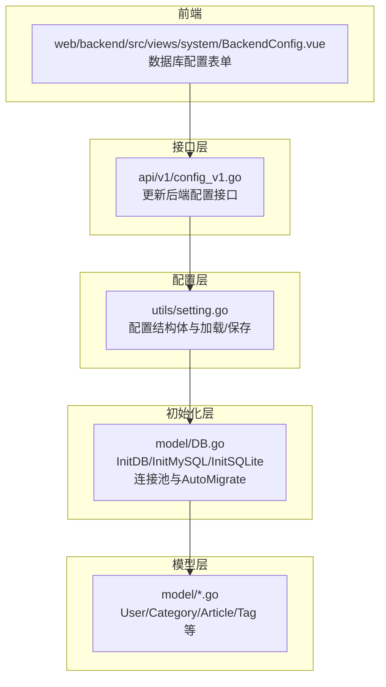
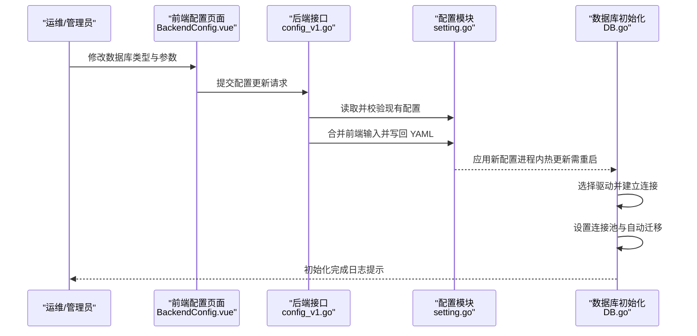
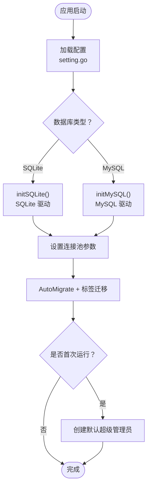
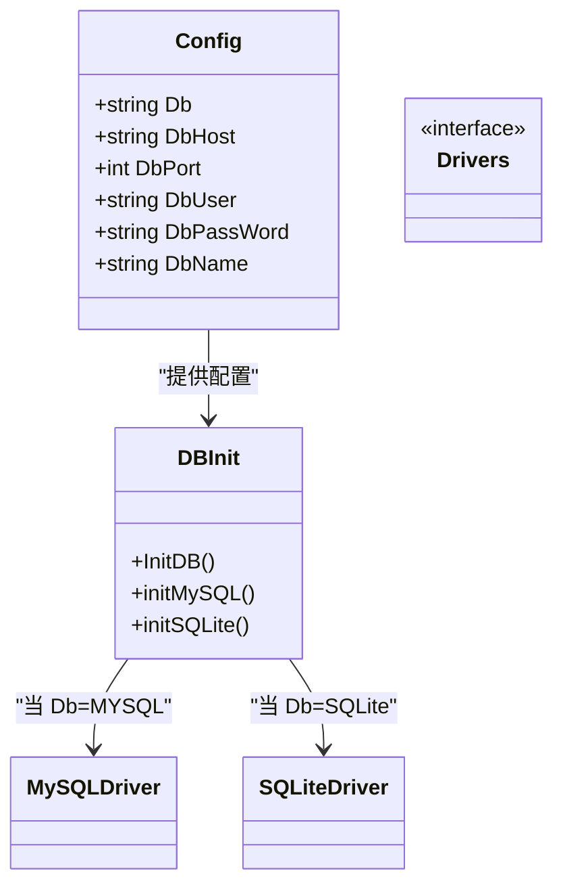
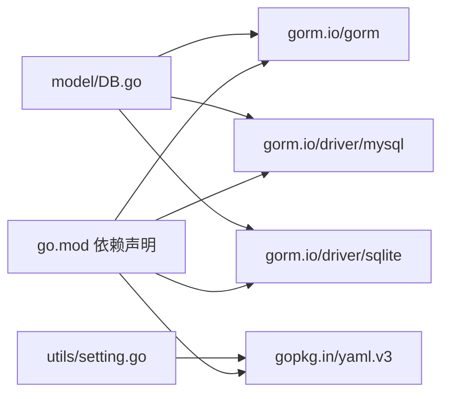

# 数据库设计

<cite>
**本文引用的文件**
- [model/DB.go](file://model/DB.go)
- [utils/setting.go](file://utils/setting.go)
- [web/backend/src/views/system/BackendConfig.vue](file://web/backend/src/views/system/BackendConfig.vue)
- [api/v1/config_v1.go](file://api/v1/config_v1.go)
- [model/Articles.go](file://model/Articles.go)
- [go.mod](file://go.mod)
- [.gitignore](file://.gitignore)
- [.dockerignore](file://.dockerignore)
</cite>

## 目录
1. [简介](#简介)
2. [项目结构](#项目结构)
3. [核心组件](#核心组件)
4. [架构总览](#架构总览)
5. [详细组件分析](#详细组件分析)
6. [依赖关系分析](#依赖关系分析)
7. [性能考量](#性能考量)
8. [故障排查指南](#故障排查指南)
9. [结论](#结论)
10. [附录](#附录)

## 简介
本文件面向数据库管理员与后端开发者，系统化梳理 YanBlog 的数据库设计与实现要点，包括：
- 数据库连接配置与初始化流程
- MySQL 与 SQLite 的支持机制与切换方法
- 连接池配置、事务处理与并发控制策略
- 数据迁移与版本管理方案
- 性能优化与索引设计原则
- 备份与恢复策略
- 监控与维护最佳实践
- 数据一致性保证与错误处理机制

## 项目结构
YanBlog 的数据库相关代码主要分布在以下模块：
- 配置层：负责读取与保存 YAML 配置，支持环境变量替换
- 初始化层：根据配置动态选择并初始化数据库驱动（MySQL 或 SQLite）
- 模型层：定义实体与迁移逻辑，提供基础查询与业务方法
- 前端配置界面：允许在线切换数据库类型与参数，并安全地更新配置

图表来源
- [utils/setting.go:14-98](file://utils/setting.go#L14-L98)
- [model/DB.go:26-60](file://model/DB.go#L26-L60)
- [web/backend/src/views/system/BackendConfig.vue:52-82](file://web/backend/src/views/system/BackendConfig.vue#L52-L82)
- [api/v1/config_v1.go:147-190](file://api/v1/config_v1.go#L147-L190)

章节来源
- [utils/setting.go:14-98](file://utils/setting.go#L14-L98)
- [model/DB.go:26-60](file://model/DB.go#L26-L60)
- [web/backend/src/views/system/BackendConfig.vue:52-82](file://web/backend/src/views/system/BackendConfig.vue#L52-L82)
- [api/v1/config_v1.go:147-190](file://api/v1/config_v1.go#L147-L190)

## 核心组件
- 配置结构与加载
  - 定义 server、database、weather、jwt 等配置项
  - 支持从多个路径加载配置，兼容旧路径与模板文件
  - 支持环境变量占位符替换
- 数据库初始化
  - 根据配置选择 MySQL 或 SQLite 驱动
  - 设置连接池参数（最大空闲、最大打开、生命周期）
  - 自动迁移模型并执行标签迁移
  - 首次运行创建默认超级管理员
- 模型与查询
  - 定义实体与关联关系
  - 提供分页、随机、相邻文章等查询方法
  - 针对不同数据库类型使用差异化的 SQL 函数

章节来源
- [utils/setting.go:14-98](file://utils/setting.go#L14-L98)
- [model/DB.go:26-60](file://model/DB.go#L26-L60)
- [model/Articles.go:346-388](file://model/Articles.go#L346-L388)

## 架构总览
下图展示从“前端配置”到“数据库初始化”的端到端流程。

图表来源
- [web/backend/src/views/system/BackendConfig.vue:178-204](file://web/backend/src/views/system/BackendConfig.vue#L178-L204)
- [api/v1/config_v1.go:147-190](file://api/v1/config_v1.go#L147-L190)
- [utils/setting.go:77-98](file://utils/setting.go#L77-L98)
- [model/DB.go:26-60](file://model/DB.go#L26-L60)

## 详细组件分析

### 组件一：数据库连接配置与初始化
- 配置来源与优先级
  - 优先读取 config/backend/config.yaml
  - 若不存在则回退至 config/config.yaml
  - 再回退至 config/config_template.yaml
- 环境变量替换
  - 支持 ${VARNAME} 与 ${VARNAME:defaultValue} 语法
- 初始化流程
  - 依据 database.Db 判断驱动类型
  - 设置连接池参数
  - 执行 AutoMigrate 与标签迁移
  - 首次运行创建默认超级管理员

图表来源
- [utils/setting.go:47-98](file://utils/setting.go#L47-L98)
- [model/DB.go:26-60](file://model/DB.go#L26-L60)
- [model/DB.go:124-159](file://model/DB.go#L124-L159)
- [model/DB.go:99-122](file://model/DB.go#L99-L122)

章节来源
- [utils/setting.go:47-98](file://utils/setting.go#L47-L98)
- [model/DB.go:26-60](file://model/DB.go#L26-L60)
- [model/DB.go:124-159](file://model/DB.go#L124-L159)
- [model/DB.go:99-122](file://model/DB.go#L99-L122)

### 组件二：MySQL 与 SQLite 支持机制与切换
- 切换方式
  - 前端配置页面提供数据库类型选择（SQLite/MySQL）
  - 更新后端配置接口仅允许更新非敏感字段，密码不在该接口更新
- 驱动与连接
  - MySQL：使用 gorm.io/driver/mysql
  - SQLite：使用 gorm.io/driver/sqlite
- 连接参数
  - MySQL：主机、端口、用户名、密码、数据库名
  - SQLite：数据库文件路径（支持相对/绝对路径）

图表来源
- [web/backend/src/views/system/BackendConfig.vue:52-82](file://web/backend/src/views/system/BackendConfig.vue#L52-L82)
- [api/v1/config_v1.go:147-161](file://api/v1/config_v1.go#L147-L161)
- [model/DB.go:26-35](file://model/DB.go#L26-L35)

章节来源
- [web/backend/src/views/system/BackendConfig.vue:52-82](file://web/backend/src/views/system/BackendConfig.vue#L52-L82)
- [api/v1/config_v1.go:147-161](file://api/v1/config_v1.go#L147-L161)
- [model/DB.go:26-35](file://model/DB.go#L26-L35)

### 组件三：连接池配置、事务处理与并发控制
- 连接池
  - 最大空闲连接：10
  - 最大打开连接：100
  - 连接最大生命周期：10 秒
- 事务与并发
  - SQLite 默认跳过默认事务以提升写入吞吐
  - MySQL 采用 GORM 默认事务行为
  - 建议在高并发场景下结合业务需求使用显式事务块
- 并发控制
  - 通过连接池上限与 Ping 重试机制保障稳定性
  - 建议在热点接口增加幂等性与锁策略（如行级锁或分布式锁）

章节来源
- [model/DB.go:41-47](file://model/DB.go#L41-L47)
- [model/DB.go:135-142](file://model/DB.go#L135-L142)

### 组件四：数据迁移与版本管理
- 自动迁移
  - 初始化时对 User、Category、Article、Tag 进行 AutoMigrate
- 标签迁移
  - 若标签表为空，从文章表提取并拆分标签，重建标签与文章关联
- 版本管理建议
  - 引入数据库迁移工具（如 goose、sql-migrate）进行结构变更版本化
  - 在迁移脚本中保留回滚策略与数据一致性校验
  - 对生产环境迁移先在测试环境演练

章节来源
- [model/DB.go:46](file://model/DB.go#L46)
- [model/DB.go:161-209](file://model/DB.go#L161-L209)

### 组件五：性能优化与索引设计原则
- 查询优化
  - 分页查询分离 Count 与 Find，减少一次查询的负载
  - 使用 Preload 预加载关联，避免 N+1 查询
- 随机查询
  - MySQL 使用 RAND()，SQLite 使用 RANDOM()，注意函数差异
- 索引设计原则
  - 为高频过滤字段（如 created_at、username、cid）建立索引
  - 为关联字段（如文章分类外键）建立索引
  - 避免冗余索引，定期评估查询计划
- 缓存与降载
  - 对热点内容引入缓存层（Redis/Memcached）
  - 控制单页最大条数，防止恶意请求放大数据库压力

章节来源
- [model/Articles.go:89-106](file://model/Articles.go#L89-L106)
- [model/Articles.go:346-388](file://model/Articles.go#L346-L388)

### 组件六：备份与恢复策略
- 备份
  - SQLite：直接复制数据库文件即可
  - MySQL：使用逻辑备份（mysqldump）或物理备份（Percona XtraBackup）
- 恢复
  - SQLite：停止服务后替换数据库文件，重启验证
  - MySQL：在目标实例执行导入，核对完整性与权限
- 最佳实践
  - 定期全量+增量备份
  - 在只读副本上执行备份，降低对主库影响
  - 备份文件加密存储并异地容灾

章节来源
- [.gitignore:48-50](file://.gitignore#L48-L50)
- [.dockerignore:27-28](file://.dockerignore#L27-L28)

### 组件七：监控与维护
- 连接健康
  - 启动时执行 Ping，失败重试并记录日志
- 日志与告警
  - 结合日志轮转与集中化日志收集
  - 关注慢查询、连接池耗尽、死锁等指标
- 维护任务
  - 定期分析表统计信息与碎片整理
  - 清理历史日志与临时文件

章节来源
- [model/DB.go:103-119](file://model/DB.go#L103-L119)
- [.dockerignore:31-32](file://.dockerignore#L31-L32)

### 组件八：数据一致性与错误处理
- 一致性
  - 使用事务包裹跨表写操作
  - 对并发写入场景采用唯一约束与冲突处理
- 错误处理
  - 配置加载失败时打印明确错误并终止启动
  - 查询异常按业务语义返回状态码
- 安全
  - 密码字段不在配置更新接口中暴露或覆盖
  - 建议对敏感配置启用只读挂载与最小权限访问

章节来源
- [utils/setting.go:50-62](file://utils/setting.go#L50-L62)
- [api/v1/config_v1.go:147-161](file://api/v1/config_v1.go#L147-L161)

## 依赖关系分析
- 外部依赖
  - GORM v1 及驱动：gorm.io/gorm、gorm.io/driver/mysql、gorm.io/driver/sqlite
  - YAML 解析：gopkg.in/yaml.v3
- 内部耦合
  - model/DB.go 依赖 utils/setting.go 提供配置
  - 前端配置页面通过接口更新后端配置

图表来源
- [go.mod:5-19](file://go.mod#L5-L19)
- [model/DB.go:12-16](file://model/DB.go#L12-L16)
- [utils/setting.go:11](file://utils/setting.go#L11)

章节来源
- [go.mod:5-19](file://go.mod#L5-L19)
- [model/DB.go:12-16](file://model/DB.go#L12-L16)
- [utils/setting.go:11](file://utils/setting.go#L11)

## 性能考量
- 连接池调优
  - 根据 QPS 与并发度调整最大打开连接数
  - 合理设置连接生命周期，避免长时间占用导致资源泄漏
- 查询优化
  - 使用 EXPLAIN 分析慢查询
  - 为热点查询建立复合索引
- IO 与存储
  - SQLite 适合小规模写入；MySQL 更适合高并发与复杂事务
  - 使用 SSD 与合适的文件系统（ext4/xfs）提升 IO 性能

## 故障排查指南
- 启动失败
  - 检查配置文件是否存在与权限是否正确
  - 查看数据库 Ping 失败原因（网络、凭据、实例未就绪）
- 连接池耗尽
  - 检查是否存在长事务未提交
  - 适当提高最大连接数并缩短连接生命周期
- 随机查询异常
  - 确认数据库类型与随机函数映射（MySQL/RANDOM vs SQLite/RAND）
- 配置更新无效
  - 确认服务是否重启以加载新配置
  - 检查密码字段是否通过其他入口更新

章节来源
- [utils/setting.go:47-64](file://utils/setting.go#L47-L64)
- [model/DB.go:103-119](file://model/DB.go#L103-L119)
- [model/Articles.go:350-355](file://model/Articles.go#L350-L355)
- [api/v1/config_v1.go:182-190](file://api/v1/config_v1.go#L182-L190)

## 结论
YanBlog 的数据库设计以 GORM 为核心，通过统一配置与初始化流程实现了 MySQL 与 SQLite 的无缝切换。配合合理的连接池参数、自动迁移与标签迁移机制，满足了开发与运维的快速迭代需求。建议在生产环境中进一步完善迁移版本化、备份恢复体系与监控告警，持续优化查询与索引策略，确保系统的稳定性与高性能。

## 附录
- 配置文件位置与忽略规则
  - 后端配置：config/backend/config.yaml（优先）、config/config.yaml（回退）、config/config_template.yaml（模板）
  - 前端配置：config/frontend/config.yaml
  - Docker 忽略：.dockerignore 中排除 *.db、*.sqlite、logs 等
- 前端配置界面
  - 支持数据库类型选择、主机、端口、用户名、密码（仅在输入时提交）、数据库名等
  - 保存后提示需重启服务生效

章节来源
- [utils/setting.go:47-64](file://utils/setting.go#L47-L64)
- [.dockerignore:27-32](file://.dockerignore#L27-L32)
- [web/backend/src/views/system/BackendConfig.vue:52-82](file://web/backend/src/views/system/BackendConfig.vue#L52-L82)