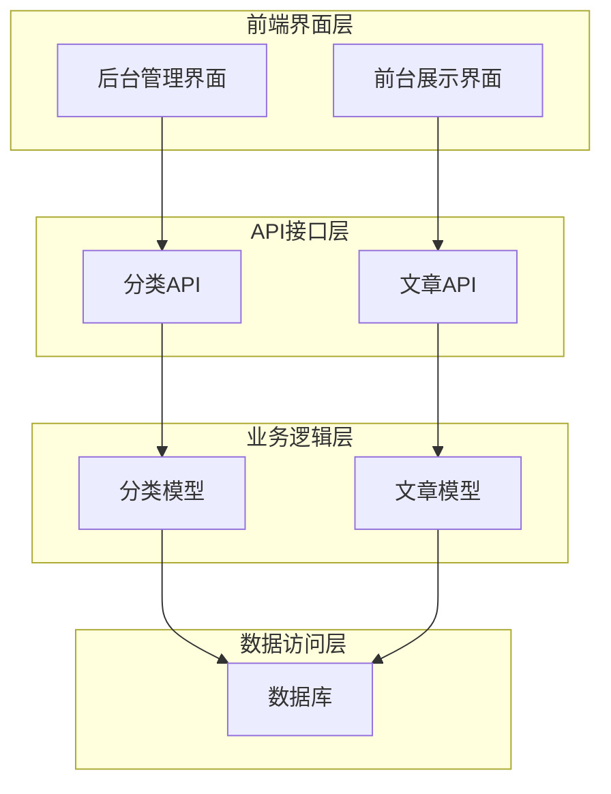
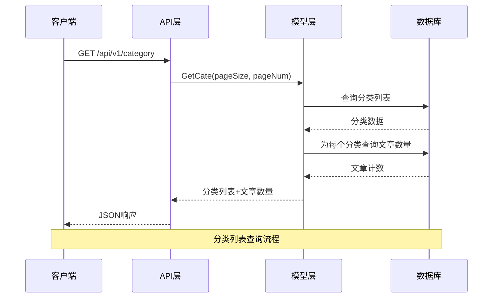
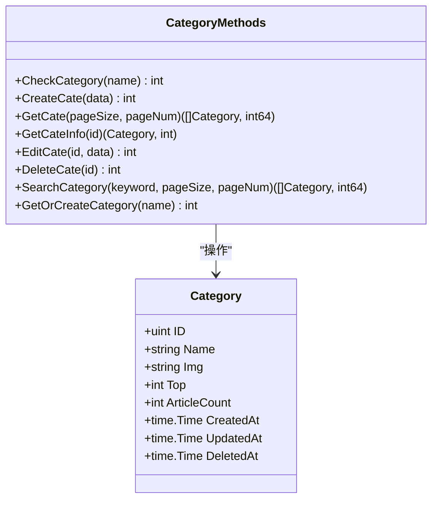
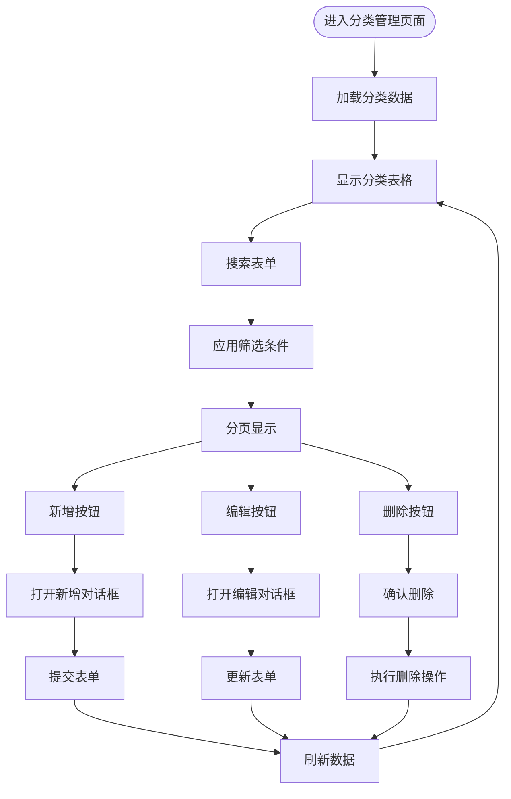
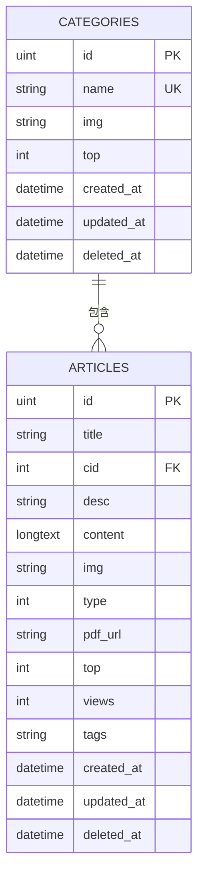

# 分类数据模型

<cite>
**本文档引用的文件**
- [Categories.go](file://model/Categories.go)
- [categories_v1.go](file://api/v1/categories_v1.go)
- [Articles.go](file://model/Articles.go)
- [CategoryForm.vue](file://web/backend/src/components/category/CategoryForm.vue)
- [CategoryList.vue](file://web/backend/src/views/category/CategoryList.vue)
- [CategoryView.vue](file://web/frontend/src/views/CategoryView.vue)
- [CategoryCard.vue](file://web/frontend/src/components/sidebar/CategoryCard.vue)
- [routers.go](file://routers/routers.go)
</cite>

## 目录
1. [简介](#简介)
2. [项目结构](#项目结构)
3. [核心组件](#核心组件)
4. [架构概览](#架构概览)
5. [详细组件分析](#详细组件分析)
6. [依赖关系分析](#依赖关系分析)
7. [性能考虑](#性能考虑)
8. [故障排除指南](#故障排除指南)
9. [结论](#结论)

## 简介

本文件详细描述了博客系统中的分类数据模型，包括分类表结构、字段定义、层级关系设计、与文章的一对多关联关系，以及完整的 CRUD 操作实现。分类系统支持置顶排序、封面图片管理、文章数量统计等功能，为文章展示和导航提供了基础支撑。

## 项目结构

分类系统涉及前后端多个层次的组件协作：



**图表来源**
- [Categories.go:1-203](file://model/Categories.go#L1-L203)
- [categories_v1.go:1-166](file://api/v1/categories_v1.go#L1-L166)
- [Articles.go:1-389](file://model/Articles.go#L1-L389)

**章节来源**
- [Categories.go:1-203](file://model/Categories.go#L1-L203)
- [categories_v1.go:1-166](file://api/v1/categories_v1.go#L1-L166)
- [Articles.go:1-389](file://model/Articles.go#L1-L389)

## 核心组件

### 数据模型定义

分类数据模型采用 GORM ORM 框架进行数据库映射，包含以下核心字段：

| 字段名 | 类型 | 约束 | 描述 |
|--------|------|------|------|
| ID | uint | 主键 | 分类唯一标识符 |
| Name | string | varchar(20), not null | 分类名称，唯一约束 |
| Img | string | varchar(255) | 分类封面图片URL |
| Top | int | int, not null, default:0 | 置顶排序值，数值越小优先级越高 |
| CreatedAt | time.Time | 自动维护 | 创建时间 |
| UpdatedAt | time.Time | 自动维护 | 更新时间 |
| DeletedAt | time.Time | 软删除 | 删除时间 |

### 关联关系设计

分类与文章之间建立了一对多的关联关系：
- 一个分类可以包含多篇文章
- 每篇文章只能属于一个分类
- 通过文章表中的 `cid` 字段关联到分类表的 `id` 字段

**章节来源**
- [Categories.go:10-17](file://model/Categories.go#L10-L17)
- [Articles.go:11-25](file://model/Articles.go#L11-L25)

## 架构概览

分类系统的整体架构采用分层设计，确保职责清晰和代码可维护性：



**图表来源**
- [categories_v1.go:55-67](file://api/v1/categories_v1.go#L55-L67)
- [Categories.go:95-128](file://model/Categories.go#L95-L128)

**章节来源**
- [routers.go:94-118](file://routers/routers.go#L94-L118)
- [categories_v1.go:1-166](file://api/v1/categories_v1.go#L1-L166)

## 详细组件分析

### 分类模型实现

分类模型提供了完整的 CRUD 操作和业务逻辑处理：

#### 核心方法分析



**图表来源**
- [Categories.go:10-203](file://model/Categories.go#L10-L203)

#### CRUD 操作详解

##### 创建分类 (Create)
- 验证分类名称唯一性
- 设置置顶排序值的有效性
- 自动维护时间戳
- 返回标准化的状态码

##### 查询分类 (Read)
- 支持分页查询和全文搜索
- 自动计算每个分类的文章数量
- 按置顶等级排序返回结果

##### 更新分类 (Update)
- 支持名称、封面图片、置顶排序的修改
- 验证更新后的名称唯一性
- 保持数据一致性

##### 删除分类 (Delete)
- 检查分类下是否有文章关联
- 支持强制删除模式（删除关联文章）
- 清理分类封面图片文件

**章节来源**
- [Categories.go:43-180](file://model/Categories.go#L43-L180)

### API 接口实现

分类 API 提供了 RESTful 接口，支持完整的 CRUD 操作：

#### 接口定义

| 方法 | 路径 | 功能 | 权限要求 |
|------|------|------|----------|
| GET | /api/v1/category | 获取分类列表 | 公开 |
| GET | /api/v1/category/search | 搜索分类 | 公开 |
| GET | /api/v1/category/info/:id | 获取分类详情 | 公开 |
| POST | /api/v1/category/add | 创建分类 | 管理员 |
| PUT | /api/v1/category/:id | 更新分类 | 管理员 |
| DELETE | /api/v1/category/:id | 删除分类 | 管理员 |

#### 请求响应格式

**创建分类请求示例：**
```json
{
  "name": "技术分享",
  "img": "/uploads/category/tech.jpg",
  "top": 1
}
```

**分类列表响应示例：**
```json
{
  "status": 200,
  "data": [
    {
      "id": 1,
      "name": "技术分享",
      "img": "/uploads/category/tech.jpg",
      "top": 1,
      "article_count": 15
    }
  ],
  "total": 10,
  "message": "success"
}
```

**章节来源**
- [categories_v1.go:15-166](file://api/v1/categories_v1.go#L15-L166)
- [routers.go:54-118](file://routers/routers.go#L54-L118)

### 前端界面实现

#### 后台管理界面

后台管理界面提供了完整的分类管理功能：



**图表来源**
- [CategoryList.vue:168-380](file://web/backend/src/views/category/CategoryList.vue#L168-L380)

#### 前台展示界面

前台界面展示了分类的可视化展示：

**章节来源**
- [CategoryList.vue:1-491](file://web/backend/src/views/category/CategoryList.vue#L1-L491)
- [CategoryForm.vue:1-230](file://web/backend/src/components/category/CategoryForm.vue#L1-L230)
- [CategoryView.vue:1-375](file://web/frontend/src/views/CategoryView.vue#L1-L375)
- [CategoryCard.vue:1-115](file://web/frontend/src/components/sidebar/CategoryCard.vue#L1-L115)

### 统计功能实现

分类系统集成了多种统计功能：

#### 文章数量统计

```mermaid
flowchart LR
Category[分类] --> CountQuery[查询文章数量]
CountQuery --> ArticleCount[文章计数]
ArticleCount --> Display[显示在界面]
subgraph "统计查询"
SQL[SELECT COUNT(*) FROM articles WHERE cid = ?]
end
CountQuery --> SQL
```

**图表来源**
- [Categories.go:120-125](file://model/Categories.go#L120-L125)
- [Articles.go:108-131](file://model/Articles.go#L108-L131)

#### 置顶排序机制

分类支持置顶排序功能，置顶等级通过 `top` 字段控制：
- 数值越小，置顶优先级越高
- 0 表示不置顶
- 支持自定义置顶等级

**章节来源**
- [Categories.go:120-128](file://model/Categories.go#L120-L128)

## 依赖关系分析

### 数据库关系图



**图表来源**
- [Categories.go:10-17](file://model/Categories.go#L10-L17)
- [Articles.go:11-25](file://model/Articles.go#L11-L25)

### 业务规则约束

分类系统遵循以下业务规则：

1. **唯一性约束**
   - 分类名称必须唯一
   - 分类 ID 自动生成且唯一

2. **有效性约束**
   - 置顶排序值必须为非负整数
   - 分类名称长度限制在 2-20 个字符

3. **完整性约束**
   - 删除分类前必须检查是否有文章关联
   - 强制删除模式会同时删除关联文章

4. **一致性约束**
   - 文章数量统计实时更新
   - 时间戳自动维护

**章节来源**
- [Categories.go:19-41](file://model/Categories.go#L19-L41)
- [Categories.go:165-180](file://model/Categories.go#L165-L180)

## 性能考虑

### 查询优化策略

1. **分页查询优化**
   - 使用 `Count` 和 `Find` 分离查询总数和数据
   - 避免一次性加载大量数据

2. **索引建议**
   - 为 `name` 字段建立唯一索引
   - 为 `top` 字段建立索引以优化排序

3. **缓存策略**
   - 分类列表数据可考虑短期缓存
   - 文章数量统计可定期更新

### 内存使用优化

- 分类列表查询时只加载必要字段
- 图片 URL 存储而非图片内容
- 后台管理界面使用前端分页减少内存占用

## 故障排除指南

### 常见问题及解决方案

#### 分类名称冲突
**问题**：创建或更新分类时报名称已存在错误
**解决方案**：
- 检查现有分类名称
- 修改为唯一的分类名称
- 使用搜索功能查找相似名称

#### 删除分类失败
**问题**：删除分类时报分类下仍有文章
**解决方案**：
- 删除该分类下的所有文章
- 使用强制删除模式
- 检查文章与分类的关联关系

#### 图片上传问题
**问题**：分类封面图片无法显示
**解决方案**：
- 检查图片 URL 路径
- 确认文件权限设置
- 验证图片格式和大小限制

**章节来源**
- [categories_v1.go:111-166](file://api/v1/categories_v1.go#L111-L166)
- [CategoryForm.vue:142-151](file://web/backend/src/components/category/CategoryForm.vue#L142-L151)

## 结论

分类数据模型为博客系统提供了完整的内容组织框架。通过合理的数据库设计、完善的 API 接口、友好的用户界面，实现了高效的分类管理功能。系统支持置顶排序、封面图片、文章数量统计等特性，满足了现代博客系统的需求。

未来可以考虑的功能扩展包括：
- 分类层级关系支持（父子分类）
- 分类权重和优先级管理
- 分类统计报表功能
- 分类导入导出功能