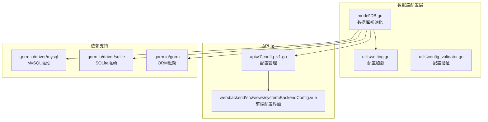
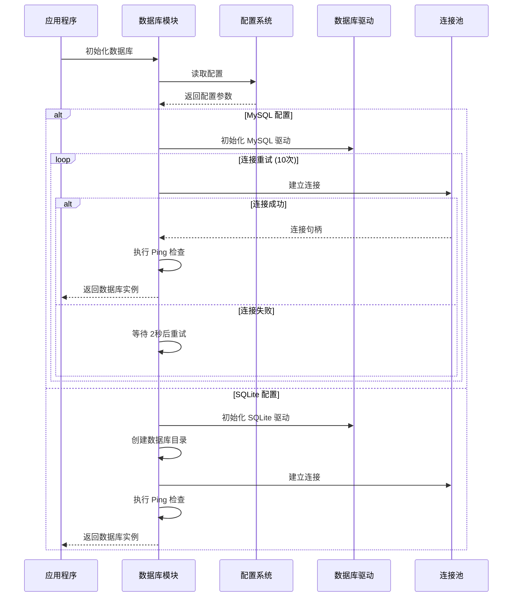
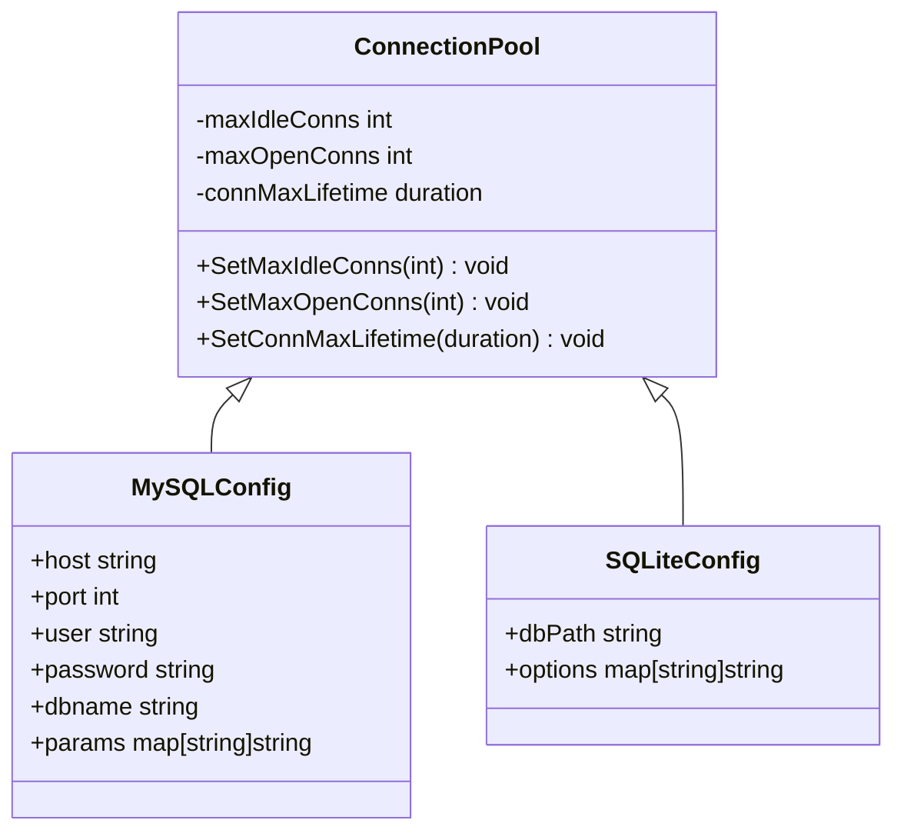
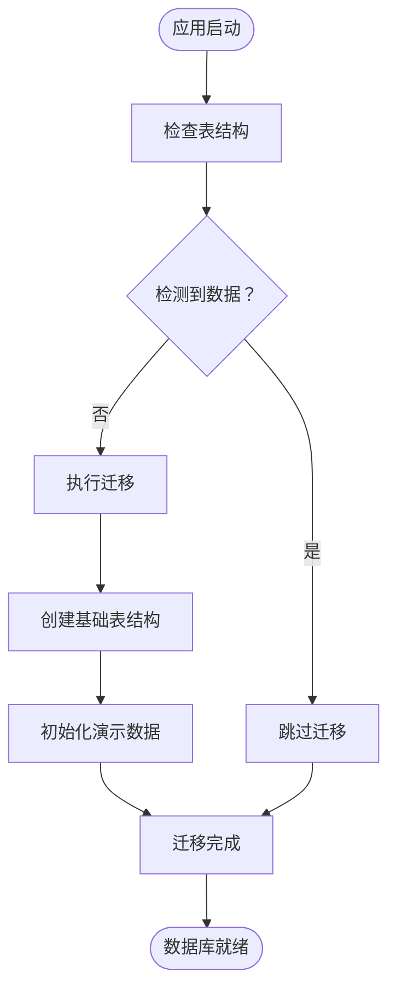
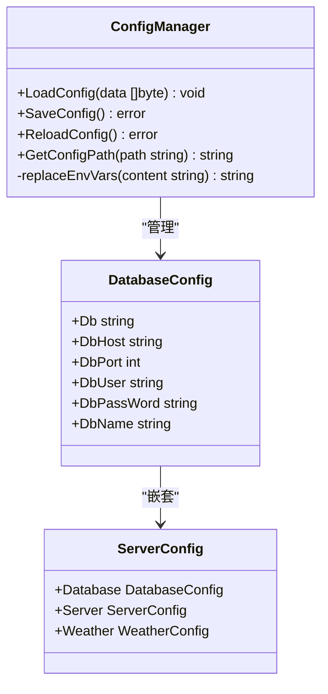
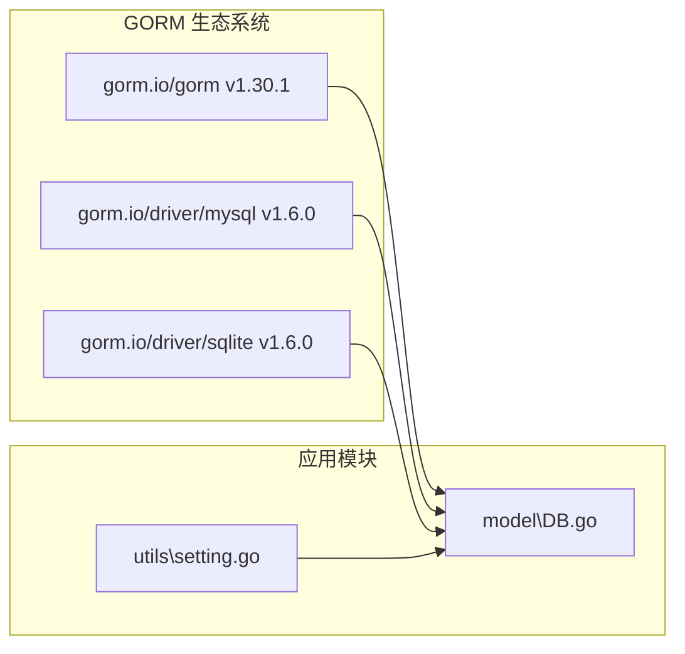
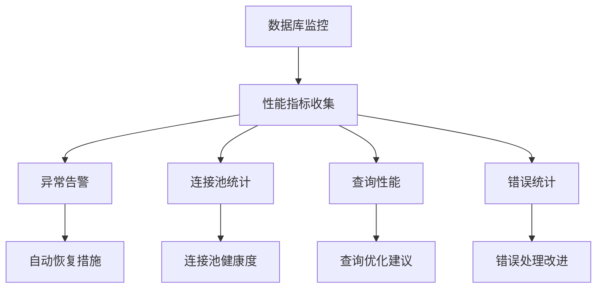
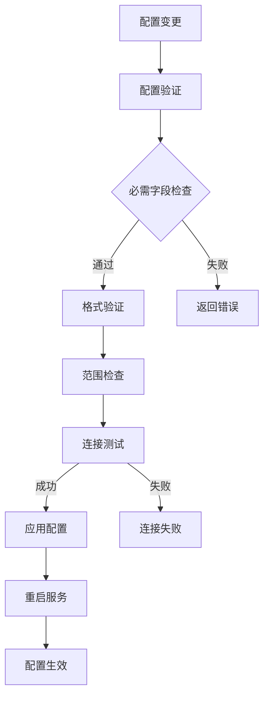

# 数据库连接配置

<cite>
**本文档引用的文件**
- [model\DB.go](file://model\DB.go)
- [utils\setting.go](file://utils\setting.go)
- [utils\config_validator.go](file://utils\config_validator.go)
- [api\v1\config_v1.go](file://api\v1\config_v1.go)
- [web\backend\src\views\system\BackendConfig.vue](file://web\backend\src\views\system\BackendConfig.vue)
- [go.sum](file://go.sum)
</cite>

## 目录
1. [简介](#简介)
2. [项目结构](#项目结构)
3. [核心组件](#核心组件)
4. [架构概览](#架构概览)
5. [详细组件分析](#详细组件分析)
6. [依赖分析](#依赖分析)
7. [性能考虑](#性能考虑)
8. [故障排除指南](#故障排除指南)
9. [结论](#结论)

## 简介

YanBlog 提供了对 MySQL 和 SQLite 两种数据库的完整支持。该系统通过 GORM ORM 框架实现了数据库抽象层，支持动态切换数据库类型，并提供了完善的连接管理、自动迁移和错误处理机制。

## 项目结构

数据库相关的核心文件分布如下：

**图表来源**
- [model\DB.go:1-214](file://model\DB.go#L1-L214)
- [utils\setting.go:46-133](file://utils\setting.go#L46-L133)
- [go.sum:157-162](file://go.sum#L157-L162)

**章节来源**
- [model\DB.go:1-214](file://model\DB.go#L1-L214)
- [utils\setting.go:46-133](file://utils\setting.go#L46-L133)

## 核心组件

### 数据库初始化组件

系统提供了两个主要的数据库初始化函数：

1. **MySQL 初始化** (`initMySQL`)
   - 支持连接重试机制（最多 10 次，间隔 2 秒）
   - 动态构建 DSN 连接字符串
   - 包含完整的错误处理和日志输出

2. **SQLite 初始化** (`initSQLite`)
   - 自动创建数据库文件目录
   - 支持相对路径和绝对路径
   - 静默日志模式配置

### GORM 配置选项

系统采用以下 GORM 配置策略：

- **命名策略**: 单数表名（`SingularTable: true`）
- **外键约束**: 迁移时禁用外键约束（`DisableForeignKeyConstraintWhenMigrating: true`）
- **事务处理**: 跳过默认事务（`SkipDefaultTransaction: true`）
- **日志级别**: SQLite 使用静默模式，MySQL 使用默认日志模式

**章节来源**
- [model\DB.go:93-159](file://model\DB.go#L93-L159)

## 架构概览

**图表来源**
- [model\DB.go:93-159](file://model\DB.go#L93-L159)
- [utils\setting.go:77-98](file://utils\setting.go#L77-L98)

## 详细组件分析

### 数据库连接池配置

系统在连接建立后配置了标准的连接池参数：

**图表来源**
- [model\DB.go:41-43](file://model\DB.go#L41-L43)

连接池参数配置：
- 最大空闲连接数: 10
- 最大打开连接数: 100  
- 连接最大生命周期: 10 秒

### 自动迁移机制

系统实现了智能的数据库迁移功能：

**图表来源**
- [model\DB.go:161-209](file://model\DB.go#L161-L209)

### 配置管理系统

**图表来源**
- [utils\setting.go:77-133](file://utils\setting.go#L77-L133)

**章节来源**
- [model\DB.go:41-43](file://model\DB.go#L41-L43)
- [utils\setting.go:77-133](file://utils\setting.go#L77-L133)

## 依赖分析

### 外部依赖关系

系统使用以下 GORM 驱动和版本：

**图表来源**
- [go.sum:157-162](file://go.sum#L157-L162)
- [model\DB.go:9-12](file://model\DB.go#L9-L12)

### 数据库驱动特性对比

| 特性 | MySQL 驱动 | SQLite 驱动 |
|------|------------|-------------|
| 连接方式 | DSN 字符串 | 文件路径 |
| 连接池 | 支持 | 支持 |
| 外键约束 | 强制执行 | 迁移时禁用 |
| 日志模式 | 默认日志 | 静默模式 |
| 事务处理 | 默认事务 | 跳过默认事务 |

**章节来源**
- [go.sum:157-162](file://go.sum#L157-L162)
- [model\DB.go:93-159](file://model\DB.go#L93-L159)

## 性能考虑

### 连接池优化建议

1. **动态调整连接数**
   - 根据并发请求量调整 `SetMaxOpenConns`
   - 监控连接池使用率，避免过度连接

2. **连接生命周期管理**
   - 合理设置 `SetConnMaxLifetime`
   - 定期清理长时间未使用的连接

3. **查询优化策略**
   - 使用预编译语句减少解析开销
   - 实施适当的索引策略
   - 避免 N+1 查询问题

### 监控和诊断

## 故障排除指南

### 常见连接问题

1. **MySQL 连接失败**
   - 检查网络连通性和防火墙设置
   - 验证数据库用户权限和密码
   - 确认数据库服务状态

2. **SQLite 文件访问错误**
   - 检查数据库文件路径权限
   - 确认磁盘空间充足
   - 验证文件锁定状态

### 配置验证流程

**图表来源**
- [utils\config_validator.go:18-24](file://utils\config_validator.go#L18-L24)
- [api\v1\config_v1.go:149-161](file://api\v1\config_v1.go#L149-L161)

**章节来源**
- [utils\config_validator.go:18-24](file://utils\config_validator.go#L18-L24)
- [api\v1\config_v1.go:149-161](file://api\v1\config_v1.go#L149-L161)

## 结论

YanBlog 的数据库连接配置系统提供了企业级的数据库抽象能力，支持多种部署场景。通过合理的连接池配置、智能的迁移机制和完善的错误处理，系统能够在不同环境下稳定运行。

关键优势包括：
- 灵活的数据库类型选择
- 健壮的连接重试机制  
- 完善的配置管理
- 友好的运维体验

建议在生产环境中根据实际负载情况调整连接池参数，并建立相应的监控告警机制。