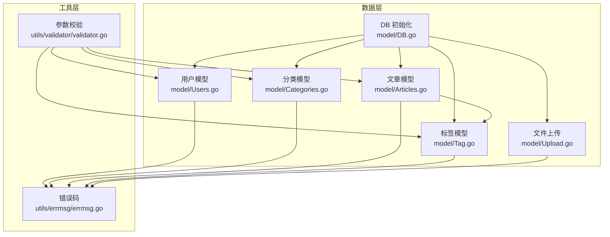
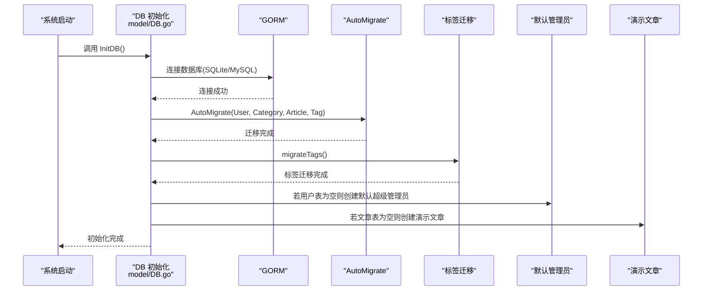
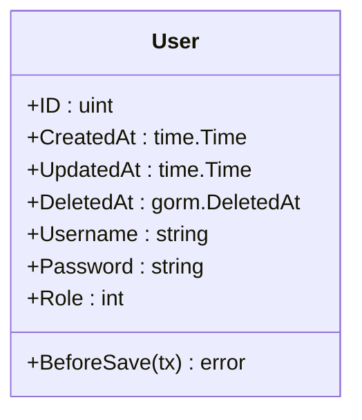
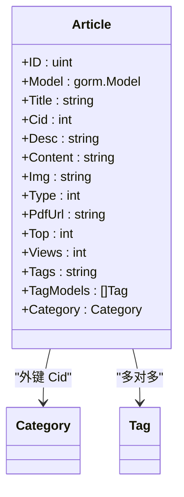
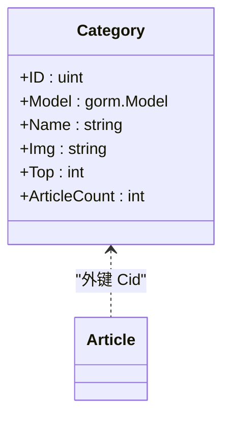
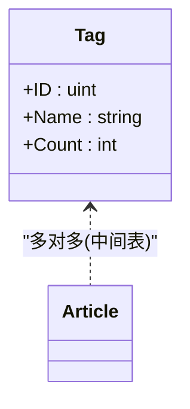
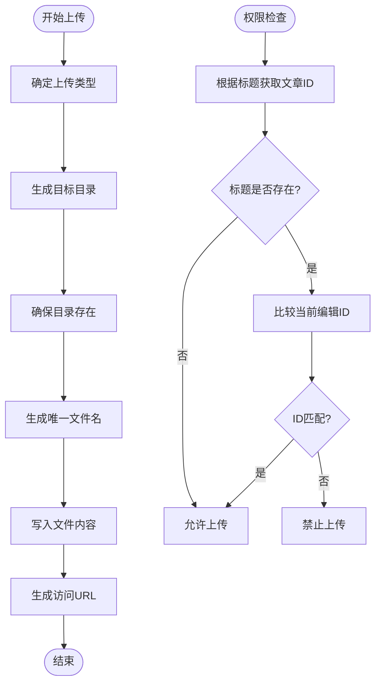
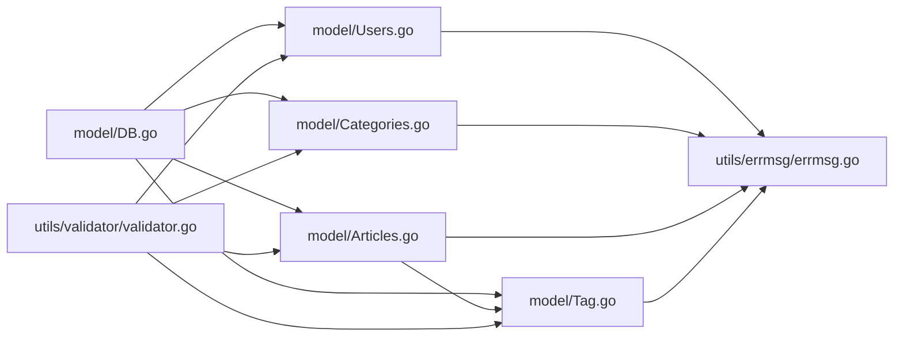
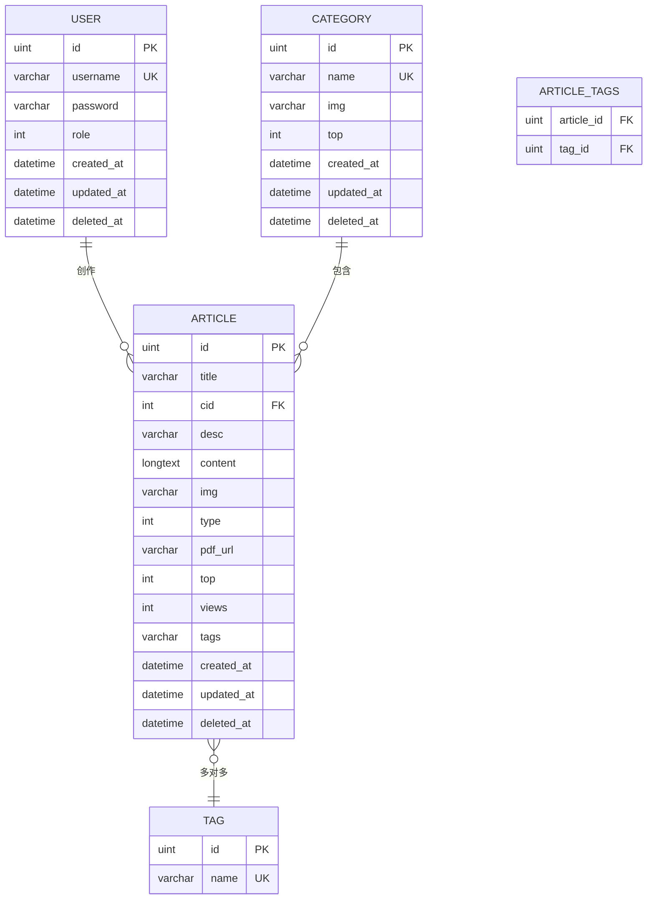
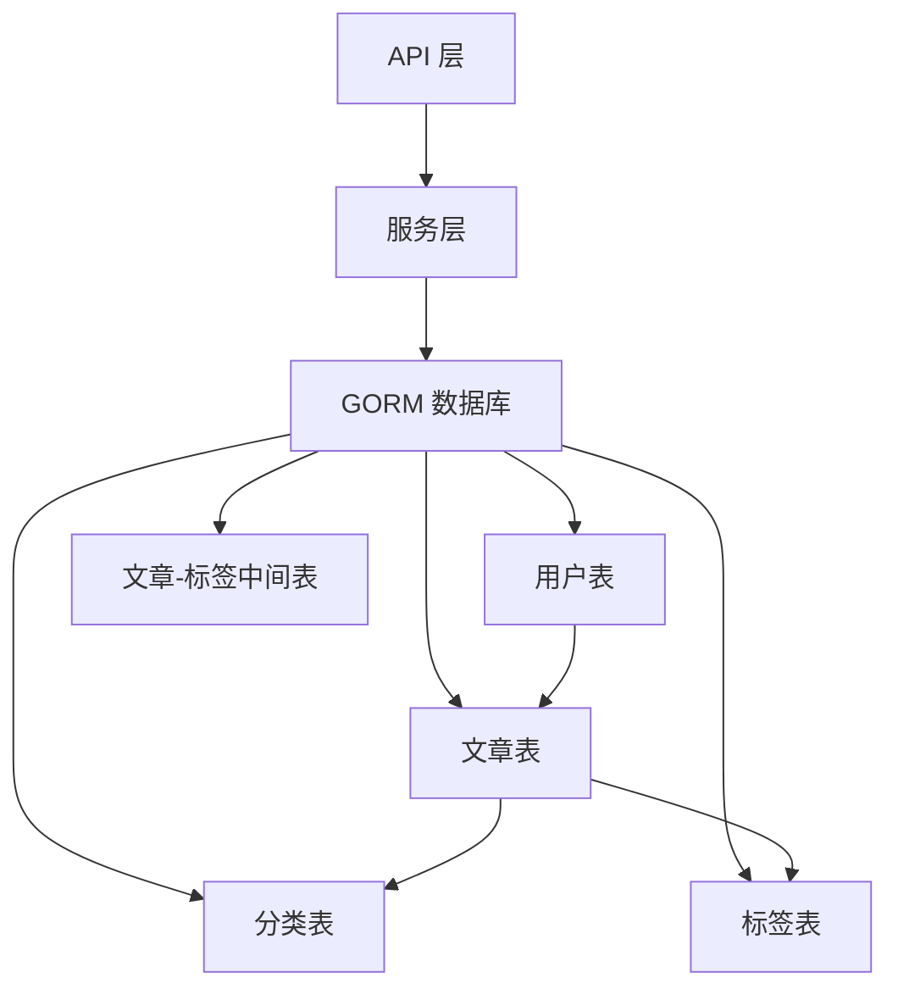

# 数据模型设计

<cite>
**本文引用的文件**
- [model/DB.go](file://model/DB.go)
- [model/Users.go](file://model/Users.go)
- [model/Articles.go](file://model/Articles.go)
- [model/Categories.go](file://model/Categories.go)
- [model/Tag.go](file://model/Tag.go)
- [model/Upload.go](file://model/Upload.go)
- [model/UploadCheck.go](file://model/UploadCheck.go)
- [model/ArticleCheck.go](file://model/ArticleCheck.go)
- [utils/errmsg/errmsg.go](file://utils/errmsg/errmsg.go)
- [utils/validator/validator.go](file://utils/validator/validator.go)
</cite>

## 目录
1. [简介](#简介)
2. [项目结构](#项目结构)
3. [核心组件](#核心组件)
4. [架构概览](#架构概览)
5. [详细组件分析](#详细组件分析)
6. [依赖分析](#依赖分析)
7. [性能考虑](#性能考虑)
8. [故障排查指南](#故障排查指南)
9. [结论](#结论)
10. [附录](#附录)

## 简介
本文件为 YanBlog 的数据模型设计文档，聚焦于数据库实体关系模型与数据访问模式。内容覆盖用户、文章、分类、标签、文件上传等核心数据结构，明确主键、外键关系与约束；给出字段定义、数据类型、长度限制与验证规则；阐述数据访问模式与查询优化策略；提供数据库初始化脚本与迁移方案；解释业务规则与数据完整性约束；并给出 ER 图与数据流图，以及数据生命周期管理与备份策略建议。

## 项目结构
YanBlog 的数据层采用 GORM 对 MySQL/SQLite 进行抽象，核心模型位于 model 目录，数据库初始化与迁移逻辑集中在 DB 初始化函数中，配套的错误码与参数校验分别位于 utils 子目录。

图表来源
- [model/DB.go:46](file://model/DB.go#L46)
- [model/Users.go:12](file://model/Users.go#L12)
- [model/Categories.go:10](file://model/Categories.go#L10)
- [model/Articles.go:11](file://model/Articles.go#L11)
- [model/Tag.go:9](file://model/Tag.go#L9)
- [model/Upload.go:13](file://model/Upload.go#L13)
- [utils/errmsg/errmsg.go:3](file://utils/errmsg/errmsg.go#L3)
- [utils/validator/validator.go:13](file://utils/validator/validator.go#L13)

章节来源
- [model/DB.go:26-79](file://model/DB.go#L26-L79)
- [model/DB.go:46](file://model/DB.go#L46)

## 核心组件
- 数据库初始化与迁移
  - 自动迁移用户、分类、文章、标签模型，并执行标签迁移逻辑。
  - 首次运行时创建默认超级管理员与演示文章。
- 用户模型
  - 字段含用户名、密码、角色码；支持登录校验、角色过滤、密码加密钩子。
- 文章模型
  - 字段含标题、分类外键、摘要、内容、封面、类型、PDF链接、置顶等级、浏览量、标签字符串及多对多标签集合。
- 分类模型
  - 字段含名称、封面、置顶等级；提供文章计数统计。
- 标签模型
  - 字段含唯一名称与非持久化计数；通过中间表 article_tags 关联文章。
- 文件上传
  - 支持多种上传类型，按类型生成目标目录与文件名，返回可访问 URL。

章节来源
- [model/DB.go:46](file://model/DB.go#L46)
- [model/DB.go:50-71](file://model/DB.go#L50-L71)
- [model/DB.go:161-209](file://model/DB.go#L161-L209)
- [model/DB.go:211-239](file://model/DB.go#L211-L239)
- [model/Users.go:12-17](file://model/Users.go#L12-L17)
- [model/Articles.go:11-25](file://model/Articles.go#L11-L25)
- [model/Categories.go:10-17](file://model/Categories.go#L10-L17)
- [model/Tag.go:9-13](file://model/Tag.go#L9-L13)
- [model/Upload.go:13-79](file://model/Upload.go#L13-L79)

## 架构概览
YanBlog 的数据模型围绕“用户—文章—分类—标签”展开，采用 GORM 的自动迁移与关联映射实现。初始化流程确保基础数据就绪，标签迁移负责从历史文章字符串标签向规范化标签体系过渡。

图表来源
- [model/DB.go:26-79](file://model/DB.go#L26-L79)
- [model/DB.go:161-209](file://model/DB.go#L161-L209)
- [model/DB.go:211-239](file://model/DB.go#L211-L239)

## 详细组件分析

### 用户模型（User）
- 字段定义与约束
  - 主键：继承 gorm.Model（包含 ID、CreatedAt、UpdatedAt、DeletedAt）。
  - 用户名：varchar(20)，非空，长度范围校验。
  - 密码：varchar(100)，非空，不参与 JSON 序列化。
  - 角色码：int，默认2，枚举含义：1超级管理员、2管理员、3普通用户。
- 关系与行为
  - 登录校验：根据用户名查找用户，使用 bcrypt 校验密码，并检查角色权限。
  - 密码加密：BeforeSave 钩子自动加密；编辑用户时若提供新密码则手动加密。
  - 权限过滤：applyRoleFilter 根据当前用户角色返回可见范围。
- 数据访问模式
  - 支持按关键词与角色筛选、分页查询、创建、编辑、删除。
- 性能与安全
  - 使用 bcrypt 加密存储密码，成本因子固定。
  - 查询分离 Count 与 Find，提升分页查询性能。

图表来源
- [model/Users.go:12-17](file://model/Users.go#L12-L17)
- [model/Users.go:189-198](file://model/Users.go#L189-L198)

章节来源
- [model/Users.go:12-17](file://model/Users.go#L12-L17)
- [model/Users.go:19-34](file://model/Users.go#L19-L34)
- [model/Users.go:110-175](file://model/Users.go#L110-L175)
- [model/Users.go:214-237](file://model/Users.go#L214-L237)
- [model/Users.go:189-198](file://model/Users.go#L189-L198)
- [utils/validator/validator.go:13-37](file://utils/validator/validator.go#L13-L37)

### 文章模型（Article）
- 字段定义与约束
  - 主键：gorm.Model。
  - 标题：varchar(100)，非空。
  - 分类外键：int，非空。
  - 摘要：varchar(200)。
  - 内容：longtext。
  - 封面：varchar(100)。
  - 类型：int，默认1（Markdown）、2（PDF）。
  - PDF链接：varchar(200)。
  - 置顶：int，默认0（不置顶），数值越小等级越高。
  - 浏览量：int，默认0。
  - 标签字符串：varchar(200)。
  - 标签集合：多对多，中间表 article_tags。
- 关系与行为
  - 多对多标签：通过 TagModels 字段维护，支持批量替换。
  - 分类关联：Category 字段映射 Cid 外键。
  - 标签解析：parseTags 将逗号分隔字符串转为 Tag 集合。
  - 访问量递增：IncrementArtViews 使用 UpdateColumn 原子递增，避免更新时间戳。
  - 相关文章：基于标签字符串的 OR 查询。
  - 归档统计：按月分组统计文章数量。
  - 随机文章：根据数据库类型选择 RAND()/RANDOM()。
  - 相邻文章：基于 created_at 排序获取前后文。
- 数据访问模式
  - 支持关键词（标题/摘要/标签）与分类筛选、置顶优先、分页查询。
  - 提供热门文章、置顶文章、文章详情、批量删除等操作。
- 性能与优化
  - Preload 预加载分类信息，避免 N+1 查询。
  - 分离 Count 与 Find，提升分页查询效率。
  - 使用表达式更新 views，避免触发更新时间戳。

图表来源
- [model/Articles.go:11-25](file://model/Articles.go#L11-L25)
- [model/Articles.go:27-49](file://model/Articles.go#L27-L49)
- [model/Articles.go:145-149](file://model/Articles.go#L145-L149)
- [model/Articles.go:190-227](file://model/Articles.go#L190-L227)
- [model/Articles.go:248-271](file://model/Articles.go#L248-L271)
- [model/Articles.go:346-362](file://model/Articles.go#L346-L362)
- [model/Articles.go:364-388](file://model/Articles.go#L364-L388)

章节来源
- [model/Articles.go:11-25](file://model/Articles.go#L11-L25)
- [model/Articles.go:51-63](file://model/Articles.go#L51-L63)
- [model/Articles.go:65-106](file://model/Articles.go#L65-L106)
- [model/Articles.go:108-131](file://model/Articles.go#L108-L131)
- [model/Articles.go:133-143](file://model/Articles.go#L133-L143)
- [model/Articles.go:145-178](file://model/Articles.go#L145-L178)
- [model/Articles.go:180-188](file://model/Articles.go#L180-L188)
- [model/Articles.go:190-227](file://model/Articles.go#L190-L227)
- [model/Articles.go:229-241](file://model/Articles.go#L229-L241)
- [model/Articles.go:248-271](file://model/Articles.go#L248-L271)
- [model/Articles.go:273-333](file://model/Articles.go#L273-L333)
- [model/Articles.go:335-344](file://model/Articles.go#L335-L344)
- [model/Articles.go:346-362](file://model/Articles.go#L346-L362)
- [model/Articles.go:364-388](file://model/Articles.go#L364-L388)

### 分类模型（Category）
- 字段定义与约束
  - 主键：gorm.Model。
  - 名称：varchar(20)，非空。
  - 封面：varchar(255)。
  - 置顶：int，默认0，数值越小等级越高。
  - 文章计数：非持久化字段，用于展示。
- 关系与行为
  - 一对多：Category 与 Article（通过 Article.Cid 外键）。
  - 提供分类列表、详情、搜索、创建、编辑、删除等操作。
  - 删除前检查是否仍有文章关联。
- 数据访问模式
  - 支持关键词模糊搜索、置顶排序、分页查询。
  - 获取详情时同时统计该分类下文章数量。

图表来源
- [model/Categories.go:10-17](file://model/Categories.go#L10-L17)
- [model/Categories.go:165-180](file://model/Categories.go#L165-L180)

章节来源
- [model/Categories.go:10-17](file://model/Categories.go#L10-L17)
- [model/Categories.go:19-41](file://model/Categories.go#L19-L41)
- [model/Categories.go:43-59](file://model/Categories.go#L43-L59)
- [model/Categories.go:61-93](file://model/Categories.go#L61-L93)
- [model/Categories.go:95-128](file://model/Categories.go#L95-L128)
- [model/Categories.go:130-146](file://model/Categories.go#L130-L146)
- [model/Categories.go:148-180](file://model/Categories.go#L148-L180)
- [model/Categories.go:182-202](file://model/Categories.go#L182-L202)

### 标签模型（Tag）
- 字段定义与约束
  - 主键：uint，自增。
  - 名称：varchar(100)，非空且唯一。
  - 计数：非持久化字段，用于展示。
- 关系与行为
  - 多对多：通过中间表 article_tags 关联 Article。
  - 提供标签列表（带计数）、创建、编辑、删除等操作。
  - 删除标签时清理中间表关联。
- 数据访问模式
  - 列表查询时为每个标签统计关联文章数量（通过中间表计数）。

图表来源
- [model/Tag.go:9-13](file://model/Tag.go#L9-L13)
- [model/Tag.go:90-101](file://model/Tag.go#L90-L101)

章节来源
- [model/Tag.go:9-13](file://model/Tag.go#L9-L13)
- [model/Tag.go:15-33](file://model/Tag.go#L15-L33)
- [model/Tag.go:35-42](file://model/Tag.go#L35-L42)
- [model/Tag.go:44-75](file://model/Tag.go#L44-L75)
- [model/Tag.go:77-88](file://model/Tag.go#L77-L88)
- [model/Tag.go:90-101](file://model/Tag.go#L90-L101)

### 文件上传模型（Upload）
- 功能概述
  - 根据上传类型选择存储目录（头像、分类封面、文章内容图片、文章封面、PDF、系统资源等）。
  - 生成唯一文件名，写入磁盘，返回可访问 URL。
  - 提供上传权限检查（基于标题与文章 ID 的一致性校验）。
- 数据访问模式
  - 上传接口调用 UpLoadFile，返回 URL 与状态码。
  - CheckUploadPermission 用于控制同标题文章的上传权限。

图表来源
- [model/Upload.go:13-79](file://model/Upload.go#L13-L79)
- [model/UploadCheck.go:7-42](file://model/UploadCheck.go#L7-L42)

章节来源
- [model/Upload.go:13-79](file://model/Upload.go#L13-L79)
- [model/UploadCheck.go:7-42](file://model/UploadCheck.go#L7-L42)

### 数据访问模式与查询优化
- 分页与计数分离
  - 在查询列表时先执行 Count，再执行 Limit/Offset，避免重复扫描。
- 预加载与关联
  - 使用 Preload 预加载 Category，减少 N+1 查询。
- 原子更新
  - 使用 UpdateColumn 与表达式更新 views，避免更新时间戳。
- 条件构建
  - 模糊搜索统一使用 LOWER() 与 LIKE，关键词拼接 %。
- 数据库适配
  - 归档与随机查询根据数据库类型选择 DATE_FORMAT/strftime 与 RAND()/RANDOM()。

章节来源
- [model/Articles.go:68-106](file://model/Articles.go#L68-L106)
- [model/Articles.go:115-131](file://model/Articles.go#L115-L131)
- [model/Articles.go:138-143](file://model/Articles.go#L138-L143)
- [model/Articles.go:145-149](file://model/Articles.go#L145-L149)
- [model/Articles.go:248-271](file://model/Articles.go#L248-L271)
- [model/Articles.go:346-362](file://model/Articles.go#L346-L362)
- [model/Categories.go:64-93](file://model/Categories.go#L64-L93)
- [model/Categories.go:98-128](file://model/Categories.go#L98-L128)
- [model/Tag.go:44-75](file://model/Tag.go#L44-L75)

### 业务规则与数据完整性
- 用户
  - 用户名唯一；角色码枚举；登录需为管理员或以上。
- 文章
  - 标题唯一；Cid 必须指向存在的分类；置顶等级与浏览量语义明确；标签字符串与多对多标签同步。
- 分类
  - 名称唯一；删除前必须清空关联文章。
- 标签
  - 名称唯一；删除时清理中间表。
- 文件上传
  - 同标题文章上传权限受 CheckUploadPermission 控制；上传目录按类型与时间组织，避免单目录过大。

章节来源
- [model/ArticleCheck.go:7-29](file://model/ArticleCheck.go#L7-L29)
- [model/Categories.go:165-180](file://model/Categories.go#L165-L180)
- [model/Tag.go:90-101](file://model/Tag.go#L90-L101)
- [model/UploadCheck.go:14-42](file://model/UploadCheck.go#L14-L42)

## 依赖分析
- 组件耦合
  - DB 初始化集中管理迁移与默认数据创建，被各模型函数依赖。
  - 文章与标签通过 Association 维护多对多关系，标签迁移依赖文章数据。
  - 用户、分类、文章、标签均依赖错误码模块。
- 外部依赖
  - GORM（MySQL/SQLite 驱动）、bcrypt（密码加密）、yaml（演示文章解析）。

图表来源
- [model/DB.go:46](file://model/DB.go#L46)
- [model/Articles.go:24](file://model/Articles.go#L24)
- [utils/errmsg/errmsg.go:3](file://utils/errmsg/errmsg.go#L3)
- [utils/validator/validator.go:13](file://utils/validator/validator.go#L13)

章节来源
- [model/DB.go:46](file://model/DB.go#L46)
- [model/Articles.go:24](file://model/Articles.go#L24)
- [utils/errmsg/errmsg.go:3](file://utils/errmsg/errmsg.go#L3)
- [utils/validator/validator.go:13](file://utils/validator/validator.go#L13)

## 性能考虑
- 查询优化
  - 分页查询分离 Count 与 Find，降低数据库压力。
  - 使用 Preload 预加载关联数据，避免 N+1。
  - 原子更新 views，减少并发冲突与时间戳更新开销。
- 索引建议（基于现有查询模式）
  - 用户名：唯一索引（唯一性约束已满足）。
  - 文章标题：唯一索引（唯一性约束已满足）。
  - 文章分类外键：索引（频繁按 cid 查询）。
  - 文章标签字符串：索引（模糊搜索 tags 字段）。
  - 分类名称：唯一索引（唯一性约束已满足）。
  - 标签名称：唯一索引（唯一性约束已满足）。
- 存储与 IO
  - 上传目录按年/月组织，避免单目录文件过多导致 IO 压力。
- 连接池与超时
  - 初始化设置最大空闲/活跃连接与连接生命周期，提升并发稳定性。

章节来源
- [model/Articles.go:68-106](file://model/Articles.go#L68-L106)
- [model/Articles.go:145-149](file://model/Articles.go#L145-L149)
- [model/DB.go:41-44](file://model/DB.go#L41-L44)

## 故障排查指南
- 数据库连接失败
  - 检查数据库类型、主机、端口、账号、密码配置；查看初始化日志输出。
- 迁移失败或约束冲突
  - 确认 AutoMigrate 是否启用；检查 Unique/Default 约束是否与现有数据冲突。
- 默认管理员未创建
  - 确认用户表为空；检查初始化日志中的安全提示与明文密码输出。
- 标签迁移异常
  - 检查 migrateTags 输出；确认文章表存在且 Tags 字段包含逗号分隔标签。
- 上传失败
  - 检查上传类型与目录权限；确认目标目录存在；查看返回的状态码。
- 权限校验失败
  - 检查 CheckUploadPermission 的标题与当前编辑 ID 匹配逻辑。

章节来源
- [model/DB.go:81-122](file://model/DB.go#L81-L122)
- [model/DB.go:161-209](file://model/DB.go#L161-L209)
- [model/DB.go:50-71](file://model/DB.go#L50-L71)
- [model/Upload.go:13-79](file://model/Upload.go#L13-L79)
- [model/UploadCheck.go:14-42](file://model/UploadCheck.go#L14-L42)

## 结论
YanBlog 的数据模型以 GORM 为核心，围绕用户、文章、分类、标签构建清晰的实体关系，配合初始化迁移与默认数据创建，确保系统快速可用。通过分页计数分离、预加载、原子更新等策略优化查询性能；通过唯一约束与权限校验保障数据完整性。建议在生产环境中补充索引、完善备份策略，并持续监控数据库连接与 IO 表现。

## 附录

### 数据库初始化脚本与迁移方案
- 初始化流程
  - 连接数据库（MySQL/SQLite）。
  - 执行 AutoMigrate(User, Category, Article, Tag)。
  - 执行 migrateTags()，从历史文章字符串标签迁移至规范化标签体系。
  - 若用户表为空，创建默认超级管理员账号并打印安全提示。
  - 若文章表为空，从演示文章文件创建演示文章。
- 迁移注意事项
  - SQLite/MySQL 的 SQL 函数差异已在归档与随机查询中适配。
  - 标签迁移会忽略空标签与重复名称，确保数据一致性。

章节来源
- [model/DB.go:26-79](file://model/DB.go#L26-L79)
- [model/DB.go:161-209](file://model/DB.go#L161-L209)
- [model/DB.go:211-239](file://model/DB.go#L211-L239)

### ER 图

图表来源
- [model/Users.go:12-17](file://model/Users.go#L12-L17)
- [model/Categories.go:10-17](file://model/Categories.go#L10-L17)
- [model/Tag.go:9-13](file://model/Tag.go#L9-L13)
- [model/Articles.go:11-25](file://model/Articles.go#L11-L25)

### 数据流图

图表来源
- [model/DB.go:46](file://model/DB.go#L46)
- [model/Articles.go:11-25](file://model/Articles.go#L11-L25)

### 数据生命周期管理与备份策略
- 生命周期
  - 用户：注册、登录、角色变更、删除（软删除由 gorm.Model 支持）。
  - 文章：创建、编辑、置顶、浏览量统计、删除（清理中间表关联）。
  - 分类：创建、编辑、删除（前置检查是否有文章关联）。
  - 标签：创建、编辑、删除（清理中间表关联）。
  - 文件：上传、访问、目录按年/月组织，定期清理无效文件。
- 备份策略建议
  - MySQL：使用逻辑备份（mysqldump）或物理备份（Percona XtraBackup）。
  - SQLite：复制数据库文件进行备份。
  - 定期备份：每日增量 + 每周全量；保留最近 4-8 份备份。
  - 上传文件：独立备份 uploads 目录，结合版本控制与 CDN 缓存策略。

章节来源
- [model/Articles.go:309-333](file://model/Articles.go#L309-L333)
- [model/Categories.go:165-180](file://model/Categories.go#L165-L180)
- [model/Tag.go:90-101](file://model/Tag.go#L90-L101)
- [model/Upload.go:13-79](file://model/Upload.go#L13-L79)