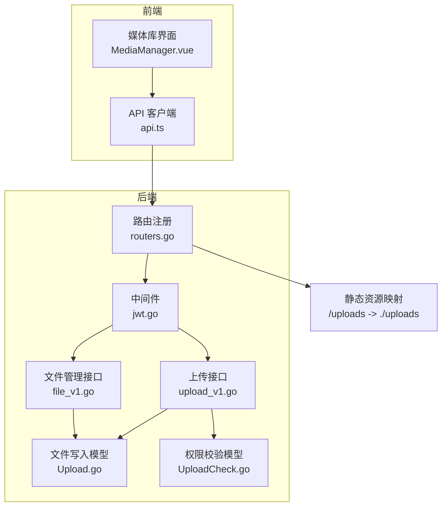
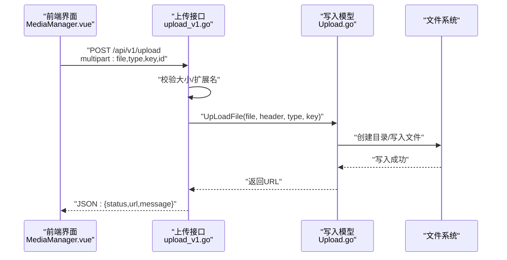
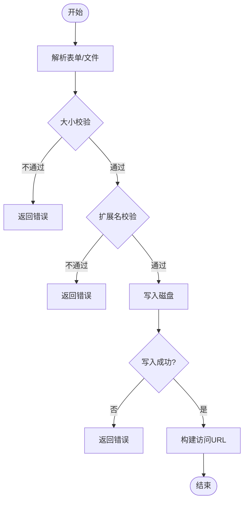
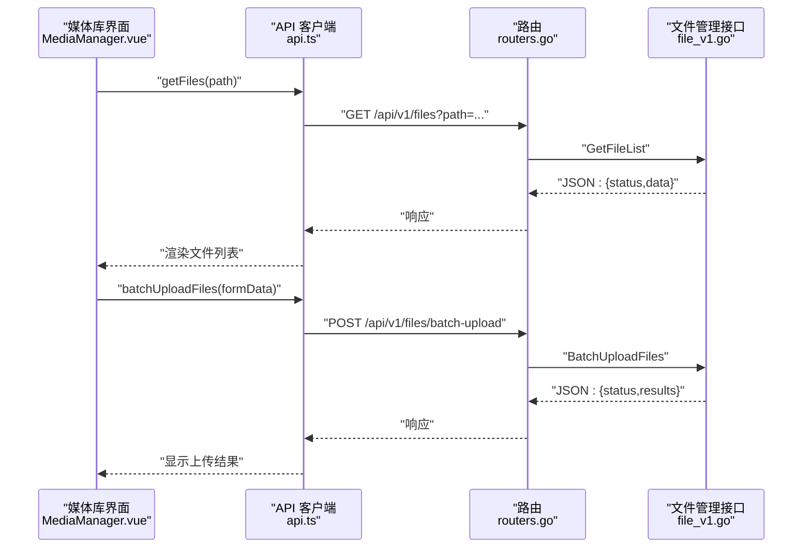
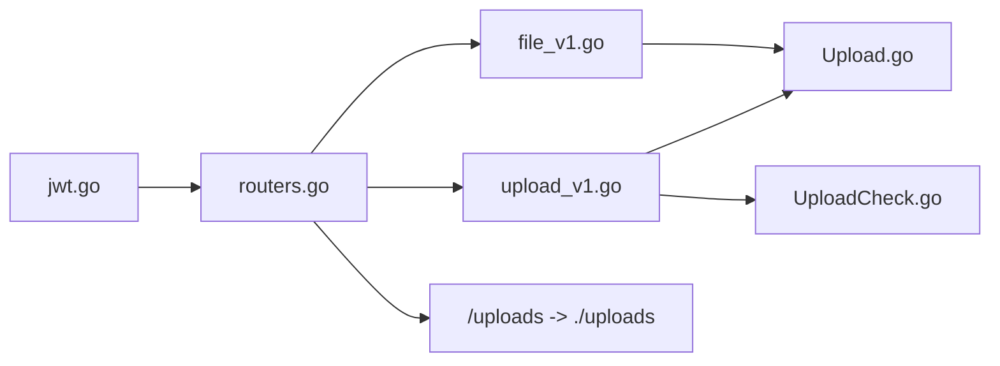

# 文件上传数据模型

<cite>
**本文引用的文件**
- [model/Upload.go](file://model/Upload.go)
- [model/UploadCheck.go](file://model/UploadCheck.go)
- [api/v1/upload_v1.go](file://api/v1/upload_v1.go)
- [api/v1/file_v1.go](file://api/v1/file_v1.go)
- [routers/routers.go](file://routers/routers.go)
- [middlewares/jwt.go](file://middlewares/jwt.go)
- [web/backend/src/views/media/MediaManager.vue](file://web/backend/src/views/media/MediaManager.vue)
- [web/backend/src/services/api.ts](file://web/backend/src/services/api.ts)
- [utils/errmsg/errmsg.go](file://utils/errmsg/errmsg.go)
</cite>

## 目录
1. [简介](#简介)
2. [项目结构](#项目结构)
3. [核心组件](#核心组件)
4. [架构总览](#架构总览)
5. [详细组件分析](#详细组件分析)
6. [依赖分析](#依赖分析)
7. [性能考虑](#性能考虑)
8. [故障排查指南](#故障排查指南)
9. [结论](#结论)
10. [附录](#附录)

## 简介
本文件围绕“文件上传数据模型”进行系统化说明，覆盖以下方面：
- 文件上传记录表结构设计建议（字段定义、索引与约束）
- 文件类型验证、大小限制与安全检查机制
- 存储策略与路径管理（目录分层、命名规则、访问URL）
- 文件上传、下载与删除的后端实现要点
- 访问权限控制与安全防护（JWT、路径校验、白名单）
- 与前端文件管理系统的集成方式（API、UI交互）

## 项目结构
后端采用 Go + Gin 框架，文件上传能力由以下模块协同实现：
- 路由注册：统一挂载静态资源与 API 路由，开启 gzip 压缩与 CORS 支持
- 中间件：JWT 认证与管理员权限校验
- API 层：单文件上传、批量上传、文件管理（增删改查）、存储统计
- 模型层：文件写入、权限校验辅助
- 前端：媒体库管理界面，支持拖拽上传、批量上传、预览、移动/复制/重命名/删除等

**图表来源**
- [routers/routers.go:13-122](file://routers/routers.go#L13-L122)
- [middlewares/jwt.go:1-157](file://middlewares/jwt.go#L1-L157)
- [api/v1/upload_v1.go:1-94](file://api/v1/upload_v1.go#L1-L94)
- [api/v1/file_v1.go:1-663](file://api/v1/file_v1.go#L1-L663)
- [model/Upload.go:1-80](file://model/Upload.go#L1-L80)
- [model/UploadCheck.go:1-43](file://model/UploadCheck.go#L1-L43)

**章节来源**
- [routers/routers.go:13-122](file://routers/routers.go#L13-L122)
- [web/backend/src/views/media/MediaManager.vue:1-858](file://web/backend/src/views/media/MediaManager.vue#L1-L858)

## 核心组件
- 文件上传模型（写入与路径生成）
  - 功能：根据上传类型选择目标目录，生成唯一文件名，写入磁盘，返回访问 URL
  - 关键点：按年/月分桶存放文章内容图片；默认通用目录 fallback；相对路径转 URL
- 权限校验模型（标题冲突与编辑权限）
  - 功能：基于文章标题判断是否允许上传（避免重复标题）
- 上传接口（单文件）
  - 功能：接收 multipart 表单，校验大小与扩展名，调用模型写入，返回结果
- 文件管理接口（批量上传、列表、删除、移动/复制/重命名、统计）
  - 功能：安全路径校验（防路径穿越）、批量上传、目录树浏览、存储统计
- 路由与静态资源
  - 功能：挂载 /uploads 静态目录，暴露文件给浏览器直接访问
- 中间件（JWT 与管理员权限）
  - 功能：认证、鉴权、管理员专用接口保护

**章节来源**
- [model/Upload.go:13-80](file://model/Upload.go#L13-L80)
- [model/UploadCheck.go:14-42](file://model/UploadCheck.go#L14-L42)
- [api/v1/upload_v1.go:27-94](file://api/v1/upload_v1.go#L27-L94)
- [api/v1/file_v1.go:40-663](file://api/v1/file_v1.go#L40-L663)
- [routers/routers.go:26-36](file://routers/routers.go#L26-L36)
- [middlewares/jwt.go:71-96](file://middlewares/jwt.go#L71-L96)

## 架构总览
后端通过 Gin 路由注册静态资源与 API，中间件负责认证与权限控制。上传流程分为两类：
- 单文件上传：前端通过表单提交，后端进行白名单与大小校验，写入磁盘并返回 URL
- 批量上传：前端构造 FormData，后端解析并逐个校验与保存

**图表来源**
- [api/v1/upload_v1.go:27-94](file://api/v1/upload_v1.go#L27-L94)
- [model/Upload.go:16-79](file://model/Upload.go#L16-L79)

## 详细组件分析

### 文件上传记录表结构设计（建议）
为便于数据库持久化与检索，建议引入“文件上传记录表”。字段建议如下：

- 字段定义
  - id: 主键（自增）
  - 名称: varchar（原文件名）
  - 存储名: varchar（服务器端唯一文件名）
  - 大小: bigint（字节）
  - 类型: varchar（扩展名，如 .jpg）
  - 路径: varchar（相对 uploads 的路径，如 article/content/202501/...）
  - 访问URL: varchar（对外访问 URL）
  - 所属类型: enum 或 varchar（avatar/category/article/cover/pdf/system/common）
  - 关联标识: varchar（如文章标题、分类名等，用于业务关联）
  - 创建时间: datetime
  - 更新时间: datetime
  - 状态: tinyint（启用/禁用/删除标记）

- 索引与约束
  - 建议对“所属类型 + 关联标识”建立复合索引，加速按业务维度查询
  - 对“创建时间”建立索引，便于排序与归档
  - “存储名”建议唯一，避免同名覆盖导致的数据丢失
  - “路径”与“访问URL”保持一致性，便于迁移与备份

- 数据流说明
  - 写入磁盘后，同时写入记录表，确保元数据与物理文件一致
  - 删除文件时，先删除物理文件，再删除记录，或标记状态

（本节为概念性设计，不直接分析具体文件）

### 文件类型验证、大小限制与安全检查
- 类型验证
  - 白名单：仅允许特定扩展名（如图片、文档、音视频、压缩包等）
  - 上传接口与批量上传接口均进行扩展名校验
- 大小限制
  - 单文件最大 10MB；批量上传内存上限 200MB（路由级别设置）
- 安全检查
  - 路径穿越防护：所有文件操作均通过安全路径校验函数，确保目标路径位于 uploads 根目录内
  - 文件名清洗：生成唯一文件名，避免用户输入污染
  - 静态资源直接访问：通过 /uploads 映射，无需二次鉴权（结合前端权限与 Nginx/网关策略可进一步加固）

**章节来源**
- [api/v1/upload_v1.go:13-26](file://api/v1/upload_v1.go#L13-L26)
- [api/v1/upload_v1.go:39-58](file://api/v1/upload_v1.go#L39-L58)
- [api/v1/file_v1.go:16-26](file://api/v1/file_v1.go#L16-L26)
- [routers/routers.go:18](file://routers/routers.go#L18)

### 存储策略与路径管理
- 目录分层
  - 通用：./uploads/common
  - 头像：./uploads/avatar
  - 分类封面：./uploads/category
  - 文章内容图片：./uploads/article/content/{年}{月}（按年月分桶，避免单目录文件过多）
  - 文章封面：./uploads/article/cover
  - PDF：./uploads/article/pdf
  - 系统配置图片：./uploads/system
- 文件命名
  - 使用纳秒级时间戳 + 原扩展名，保证唯一性
- 访问 URL
  - 返回相对根路径的 URL，并转换为正斜杠形式
- 静态资源映射
  - /uploads -> ./uploads，浏览器可直接访问

**章节来源**
- [model/Upload.go:17-58](file://model/Upload.go#L17-L58)
- [routers/routers.go:30](file://routers/routers.go#L30)

### 上传、下载与删除操作实现
- 单文件上传
  - 接收 multipart 表单，校验大小与扩展名，调用模型写入，返回 JSON 结果
- 批量上传
  - 前端构造 FormData，后端解析 files 数组，逐个校验并保存，返回汇总结果
- 下载
  - 通过 /uploads 直接访问（静态资源），或后端接口返回文件流（需鉴权）
- 删除
  - 支持单个与批量删除，均进行安全路径校验，防止误删或越权删除

**图表来源**
- [api/v1/upload_v1.go:27-94](file://api/v1/upload_v1.go#L27-L94)
- [api/v1/file_v1.go:531-626](file://api/v1/file_v1.go#L531-L626)

**章节来源**
- [api/v1/upload_v1.go:27-94](file://api/v1/upload_v1.go#L27-L94)
- [api/v1/file_v1.go:40-173](file://api/v1/file_v1.go#L40-L173)
- [api/v1/file_v1.go:478-528](file://api/v1/file_v1.go#L478-L528)

### 访问权限控制与安全防护
- 认证与授权
  - JWT 中间件：校验 Authorization 头、Token 格式与有效期
  - 管理员中间件：限制部分接口仅管理员可用
- 路径安全
  - 所有文件操作均通过安全路径校验，防止 ../ 路径穿越
- 速率限制
  - 登录接口使用速率限制中间件，降低暴力破解风险
- 前端权限
  - 媒体库界面仅展示当前登录用户可访问的文件与操作

**章节来源**
- [middlewares/jwt.go:71-96](file://middlewares/jwt.go#L71-L96)
- [middlewares/jwt.go:98-157](file://middlewares/jwt.go#L98-L157)
- [api/v1/file_v1.go:16-26](file://api/v1/file_v1.go#L16-L26)
- [routers/routers.go:17-25](file://routers/routers.go#L17-L25)

### 与前端文件管理系统的集成
- 前端 API
  - 通过 api.ts 封装 axios 客户端，统一前缀 /api/v1
  - 提供文件管理相关方法：获取列表、删除、创建目录、重命名、移动、复制、批量删除、批量上传、存储统计
- 媒体库界面
  - 支持网格/列表视图、面包屑导航、拖拽上传、批量上传、预览、上下文菜单、批量删除
  - 访问 URL：/uploads/{相对路径}，直接预览图片
- 交互流程
  - 列表：GET /api/v1/files?path=...，返回文件信息数组
  - 删除：DELETE /api/v1/files?path=...
  - 批量上传：POST /api/v1/files/batch-upload，FormData 包含 files 与 dir

**图表来源**
- [web/backend/src/services/api.ts:85-124](file://web/backend/src/services/api.ts#L85-L124)
- [routers/routers.go:70-81](file://routers/routers.go#L70-L81)
- [api/v1/file_v1.go:40-115](file://api/v1/file_v1.go#L40-L115)
- [api/v1/file_v1.go:531-626](file://api/v1/file_v1.go#L531-L626)

**章节来源**
- [web/backend/src/views/media/MediaManager.vue:297-330](file://web/backend/src/views/media/MediaManager.vue#L297-L330)
- [web/backend/src/views/media/MediaManager.vue:576-604](file://web/backend/src/views/media/MediaManager.vue#L576-L604)
- [web/backend/src/services/api.ts:85-124](file://web/backend/src/services/api.ts#L85-L124)

## 依赖分析
- 组件耦合
  - 上传接口依赖模型层写入与权限校验
  - 文件管理接口依赖安全路径校验与文件系统操作
  - 路由层统一挂载静态资源与 API，中间件贯穿认证与权限
- 外部依赖
  - Gin 框架、JWT 库、操作系统文件系统
- 循环依赖
  - 未发现循环导入；各模块职责清晰

**图表来源**
- [api/v1/upload_v1.go:1-94](file://api/v1/upload_v1.go#L1-L94)
- [api/v1/file_v1.go:1-663](file://api/v1/file_v1.go#L1-L663)
- [model/Upload.go:1-80](file://model/Upload.go#L1-L80)
- [model/UploadCheck.go:1-43](file://model/UploadCheck.go#L1-L43)
- [routers/routers.go:13-122](file://routers/routers.go#L13-L122)
- [middlewares/jwt.go:1-157](file://middlewares/jwt.go#L1-L157)

**章节来源**
- [routers/routers.go:13-122](file://routers/routers.go#L13-L122)
- [middlewares/jwt.go:1-157](file://middlewares/jwt.go#L1-L157)

## 性能考虑
- 目录分桶：文章内容图片按年/月分桶，降低单目录文件数量，提升遍历与 IO 性能
- 批量上传内存上限：路由设置 MaxMultipartMemory 为 200MB，平衡内存占用与吞吐
- 静态资源直出：/uploads 通过静态文件服务直接返回，减少应用层开销
- 压缩传输：开启 gzip 压缩，降低网络传输体积
- 建议
  - 对大文件可考虑分块上传与断点续传
  - 对频繁访问的图片可引入 CDN 缓存

**章节来源**
- [model/Upload.go:34-35](file://model/Upload.go#L34-L35)
- [routers/routers.go:18](file://routers/routers.go#L18)
- [routers/routers.go:24](file://routers/routers.go#L24)

## 故障排查指南
- 上传失败
  - 检查文件大小是否超过 10MB
  - 检查扩展名是否在白名单内
  - 查看后端日志与响应 JSON 的 message 字段
- 路径错误或拒绝访问
  - 确认请求路径位于 uploads 根目录内
  - 检查安全路径校验逻辑是否被触发
- 权限不足
  - 确认已携带有效的 Bearer Token
  - 管理员接口需满足管理员角色要求
- 前端无法预览
  - 确认 /uploads 静态映射正常
  - 检查返回的 URL 是否正确

**章节来源**
- [api/v1/upload_v1.go:39-58](file://api/v1/upload_v1.go#L39-L58)
- [api/v1/file_v1.go:16-26](file://api/v1/file_v1.go#L16-L26)
- [middlewares/jwt.go:100-157](file://middlewares/jwt.go#L100-L157)
- [routers/routers.go:30](file://routers/routers.go#L30)

## 结论
本项目实现了完整的文件上传与管理能力：通过白名单与大小限制保障安全性，通过安全路径校验与 JWT 中间件保障访问控制，通过静态资源映射与目录分桶优化性能与可维护性。前端媒体库提供了直观的文件管理体验，配合后端 API 实现了从上传到删除的闭环。

## 附录
- 错误码参考
  - 成功/失败：SUCCESS / ERROR
  - 文章标题已存在：ERROR_ART_TITLE_USED
- 常用接口
  - 单文件上传：POST /api/v1/upload
  - 批量上传：POST /api/v1/files/batch-upload
  - 获取文件列表：GET /api/v1/files?path=...
  - 删除文件：DELETE /api/v1/files?path=...
  - 创建目录：POST /api/v1/files/folder
  - 重命名：PUT /api/v1/files
  - 移动/复制：POST /api/v1/files/move | /api/v1/files/copy
  - 批量删除：POST /api/v1/files/batch-delete
  - 存储统计：GET /api/v1/files/stats

**章节来源**
- [utils/errmsg/errmsg.go:1-57](file://utils/errmsg/errmsg.go#L1-L57)
- [routers/routers.go:70-81](file://routers/routers.go#L70-L81)