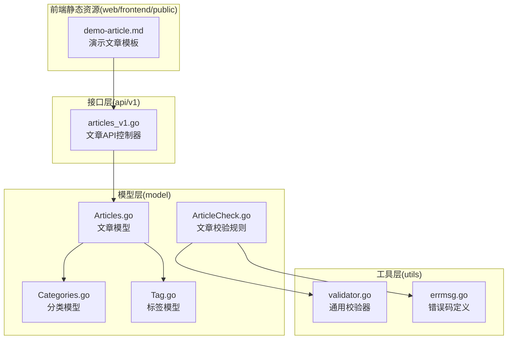
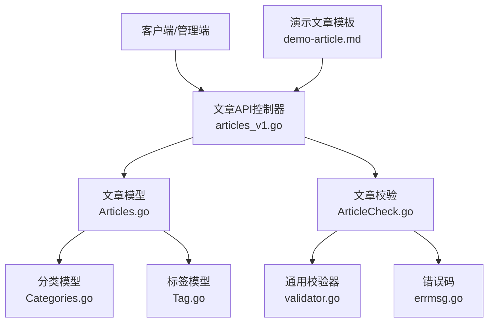
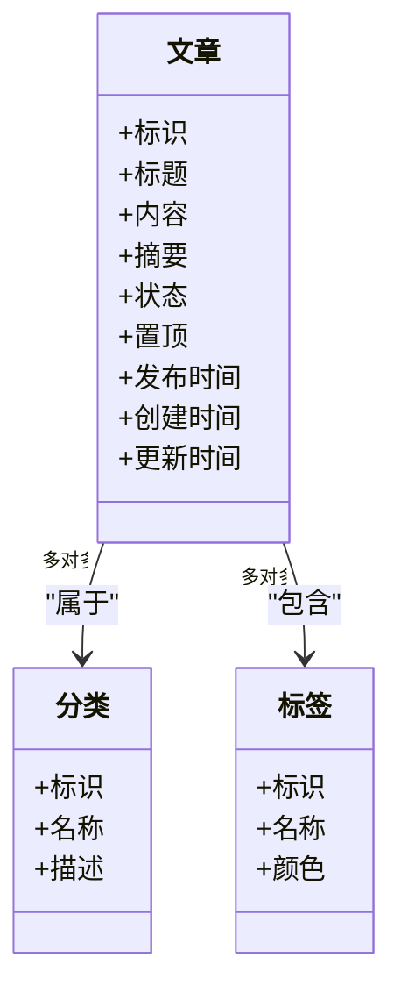
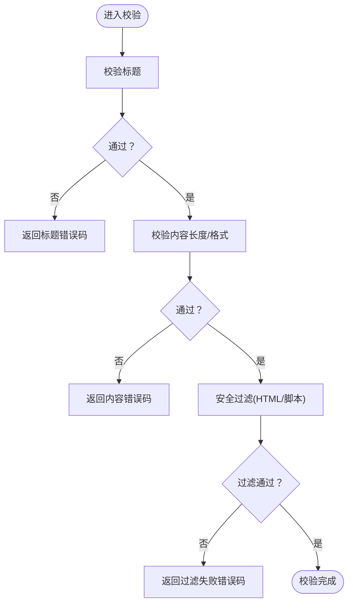
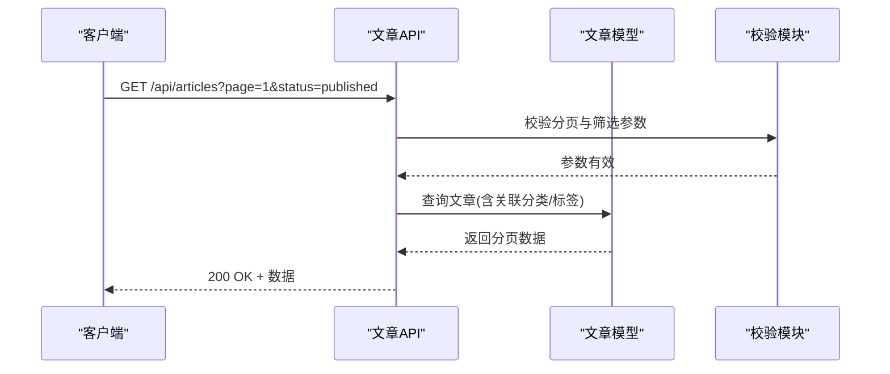
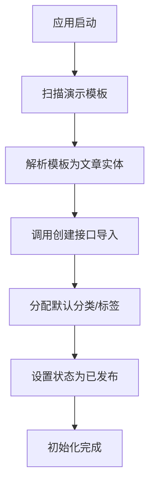
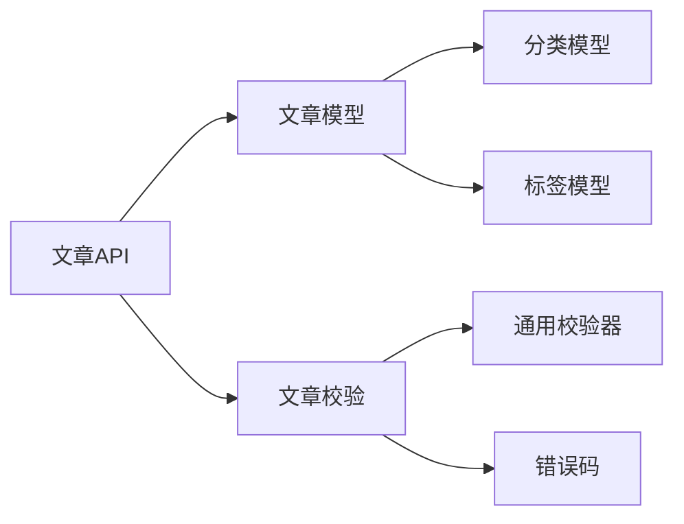

# 文章数据模型

<cite>
**本文档引用的文件**
- [Articles.go](file://model/Articles.go)
- [Categories.go](file://model/Categories.go)
- [Tag.go](file://model/Tag.go)
- [ArticleCheck.go](file://model/ArticleCheck.go)
- [articles_v1.go](file://api/v1/articles_v1.go)
- [errmsg.go](file://utils/errmsg/errmsg.go)
- [validator.go](file://utils/validator/validator.go)
- [demo-article.md](file://web/frontend/public/static/demo-article.md)
</cite>

## 目录
1. [简介](#简介)
2. [项目结构](#项目结构)
3. [核心组件](#核心组件)
4. [架构总览](#架构总览)
5. [详细组件分析](#详细组件分析)
6. [依赖分析](#依赖分析)
7. [性能考虑](#性能考虑)
8. [故障排除指南](#故障排除指南)
9. [结论](#结论)

## 简介
本文件聚焦于“文章数据模型”的设计与实现，覆盖以下方面：
- 文章表结构与字段定义（标题、内容、摘要、状态、置顶、发布时间等）
- 文章与分类、标签的多对多关联关系
- 文章状态管理、置顶功能与发布流程
- 搜索、排序与分页查询的实现思路
- 内容验证规则与安全过滤机制
- 演示文章的自动生成与初始化流程

## 项目结构
与文章数据模型直接相关的后端文件主要位于 model 层与 api 层；前端静态资源中包含演示文章模板。

**图表来源**
- [Articles.go](file://model/Articles.go)
- [Categories.go](file://model/Categories.go)
- [Tag.go](file://model/Tag.go)
- [ArticleCheck.go](file://model/ArticleCheck.go)
- [articles_v1.go](file://api/v1/articles_v1.go)
- [validator.go](file://utils/validator/validator.go)
- [errmsg.go](file://utils/errmsg/errmsg.go)
- [demo-article.md](file://web/frontend/public/static/demo-article.md)

**章节来源**
- [Articles.go](file://model/Articles.go)
- [Categories.go](file://model/Categories.go)
- [Tag.go](file://model/Tag.go)
- [ArticleCheck.go](file://model/ArticleCheck.go)
- [articles_v1.go](file://api/v1/articles_v1.go)
- [validator.go](file://utils/validator/validator.go)
- [errmsg.go](file://utils/errmsg/errmsg.go)
- [demo-article.md](file://web/frontend/public/static/demo-article.md)

## 核心组件
- 文章模型：定义文章实体、字段、状态枚举、时间戳以及与分类、标签的关联关系。
- 分类模型：定义分类实体及与文章的多对多关系。
- 标签模型：定义标签实体及与文章的多对多关系。
- 文章校验：封装文章字段的输入校验、安全过滤与错误码映射。
- 文章API：提供文章的增删改查、搜索、排序、分页等接口逻辑入口。

**章节来源**
- [Articles.go](file://model/Articles.go)
- [Categories.go](file://model/Categories.go)
- [Tag.go](file://model/Tag.go)
- [ArticleCheck.go](file://model/ArticleCheck.go)
- [articles_v1.go](file://api/v1/articles_v1.go)

## 架构总览
下图展示文章数据模型在系统中的位置与交互：

**图表来源**
- [articles_v1.go](file://api/v1/articles_v1.go)
- [Articles.go](file://model/Articles.go)
- [Categories.go](file://model/Categories.go)
- [Tag.go](file://model/Tag.go)
- [ArticleCheck.go](file://model/ArticleCheck.go)
- [validator.go](file://utils/validator/validator.go)
- [errmsg.go](file://utils/errmsg/errmsg.go)
- [demo-article.md](file://web/frontend/public/static/demo-article.md)

## 详细组件分析

### 文章模型（Articles.go）
- 实体与字段
  - 标题：用于文章显示与SEO优化，通常要求非空且长度限制。
  - 内容：Markdown或富文本内容，需进行安全过滤与长度控制。
  - 摘要：可选，用于列表页预览，建议自动截取或手动填写。
  - 状态：草稿、已发布、隐藏等状态枚举，影响前台可见性与索引策略。
  - 置顶：布尔值或置顶权重，决定列表排序优先级。
  - 发布时间：精确到秒的时间戳，支持定时发布。
  - 创建/更新时间：自动维护，便于排序与审计。
- 关联关系
  - 多对多：文章 ↔ 分类、文章 ↔ 标签，通过中间表或外键集合实现。
- 索引与约束
  - 建议对状态、置顶、发布时间建立复合索引以优化查询。
  - 对标题、摘要建立全文索引（如支持）提升搜索体验。

**图表来源**
- [Articles.go](file://model/Articles.go)
- [Categories.go](file://model/Categories.go)
- [Tag.go](file://model/Tag.go)

**章节来源**
- [Articles.go](file://model/Articles.go)

### 分类模型（Categories.go）
- 职责：维护分类元数据，承载与文章的多对多关系。
- 字段：名称、描述、排序权重、创建时间等。
- 约束：名称唯一，避免重复分类。

**章节来源**
- [Categories.go](file://model/Categories.go)

### 标签模型（Tag.go）
- 职责：维护标签元数据，承载与文章的多对多关系。
- 字段：名称、颜色（用于前端展示）、使用计数等。
- 约束：名称唯一，便于检索与聚合。

**章节来源**
- [Tag.go](file://model/Tag.go)

### 文章校验与安全（ArticleCheck.go）
- 输入校验
  - 标题长度、必填性检查。
  - 内容长度与格式校验（Markdown/HTML）。
  - 摘要长度与字符集限制。
  - 状态枚举合法性。
  - 置顶字段布尔化。
- 安全过滤
  - 过滤危险标签与脚本，保留安全的渲染子集。
  - 对图片、链接进行白名单校验。
- 错误码映射
  - 将校验失败映射到统一错误码，便于前端提示。

**图表来源**
- [ArticleCheck.go](file://model/ArticleCheck.go)
- [validator.go](file://utils/validator/validator.go)
- [errmsg.go](file://utils/errmsg/errmsg.go)

**章节来源**
- [ArticleCheck.go](file://model/ArticleCheck.go)
- [validator.go](file://utils/validator/validator.go)
- [errmsg.go](file://utils/errmsg/errmsg.go)

### 文章API（articles_v1.go）
- 功能范围
  - 列表：支持按状态、分类、标签筛选，按发布时间/置顶排序，分页。
  - 搜索：基于标题/摘要/内容的模糊匹配或全文检索。
  - 单条：读取、更新、删除。
  - 发布：状态切换至“已发布”，记录发布时间。
- 控制流
  - 接收请求参数（筛选、排序、分页）。
  - 组装查询条件与SQL片段。
  - 执行查询并返回分页结果。
  - 对写操作调用校验模块与事务处理。

**图表来源**
- [articles_v1.go](file://api/v1/articles_v1.go)
- [Articles.go](file://model/Articles.go)
- [ArticleCheck.go](file://model/ArticleCheck.go)

**章节来源**
- [articles_v1.go](file://api/v1/articles_v1.go)

### 演示文章的自动生成与初始化
- 模板来源：前端静态资源中提供演示文章模板文件。
- 初始化流程（概念性说明）
  - 应用启动时扫描模板文件。
  - 解析模板为文章实体（标题、内容、摘要等）。
  - 调用文章创建接口，批量导入数据库。
  - 可选：为演示文章分配默认分类与标签，设置状态为“已发布”。

**图表来源**
- [demo-article.md](file://web/frontend/public/static/demo-article.md)
- [articles_v1.go](file://api/v1/articles_v1.go)
- [Articles.go](file://model/Articles.go)

**章节来源**
- [demo-article.md](file://web/frontend/public/static/demo-article.md)
- [articles_v1.go](file://api/v1/articles_v1.go)

## 依赖分析
- 模型层内聚高：文章模型聚合了与分类、标签的关联关系，降低跨层耦合。
- API层职责清晰：仅负责参数组装与调用模型层，不参与业务细节。
- 校验层独立：校验与安全逻辑集中在一个模块，便于复用与测试。
- 前端静态资源解耦：演示模板独立存放，不影响后端逻辑。

**图表来源**
- [articles_v1.go](file://api/v1/articles_v1.go)
- [Articles.go](file://model/Articles.go)
- [Categories.go](file://model/Categories.go)
- [Tag.go](file://model/Tag.go)
- [ArticleCheck.go](file://model/ArticleCheck.go)
- [validator.go](file://utils/validator/validator.go)
- [errmsg.go](file://utils/errmsg/errmsg.go)

**章节来源**
- [articles_v1.go](file://api/v1/articles_v1.go)
- [Articles.go](file://model/Articles.go)
- [Categories.go](file://model/Categories.go)
- [Tag.go](file://model/Tag.go)
- [ArticleCheck.go](file://model/ArticleCheck.go)
- [validator.go](file://utils/validator/validator.go)
- [errmsg.go](file://utils/errmsg/errmsg.go)

## 性能考虑
- 索引策略
  - 在状态、置顶、发布时间上建立复合索引，加速列表查询与排序。
  - 对标题、摘要建立全文索引（若数据库支持），提升搜索性能。
- 分页与排序
  - 使用游标分页或基于索引的LIMIT/OFFSET，避免深度分页导致的性能问题。
- 缓存
  - 对热门文章与分类聚合结果进行缓存，降低数据库压力。
- 安全与过滤
  - 在入库前完成安全过滤，减少前端渲染负担与XSS风险。

## 故障排除指南
- 常见错误与定位
  - 标题为空或超长：检查校验模块的标题规则与错误码映射。
  - 内容包含非法标签：确认安全过滤是否启用与白名单配置。
  - 分类/标签不存在：检查多对多关联是否正确保存。
- 日志与追踪
  - 在API层记录请求参数与响应状态，便于定位问题。
  - 在校验模块输出具体失败原因，辅助前端提示。

**章节来源**
- [ArticleCheck.go](file://model/ArticleCheck.go)
- [validator.go](file://utils/validator/validator.go)
- [errmsg.go](file://utils/errmsg/errmsg.go)
- [articles_v1.go](file://api/v1/articles_v1.go)

## 结论
文章数据模型围绕“实体-关联-校验-接口”四层设计，具备清晰的职责划分与扩展空间。通过合理的索引、分页与缓存策略，可在保证安全性的同时满足高性能的查询与展示需求。演示文章的初始化流程进一步降低了用户上手成本，提升了系统可用性。