# 标签数据模型

<cite>
**本文档引用的文件**
- [Tag.go](file://model/Tag.go)
- [Articles.go](file://model/Articles.go)
- [DB.go](file://model/DB.go)
- [tag_v1.go](file://api/v1/tag_v1.go)
- [TagCloud.vue](file://web/frontend/src/components/sidebar/TagCloud.vue)
- [ArchiveView.vue](file://web/frontend/src/views/ArchiveView.vue)
</cite>

## 目录
1. [简介](#简介)
2. [项目结构](#项目结构)
3. [核心组件](#核心组件)
4. [架构概览](#架构概览)
5. [详细组件分析](#详细组件分析)
6. [依赖关系分析](#依赖关系分析)
7. [性能考虑](#性能考虑)
8. [故障排除指南](#故障排除指南)
9. [结论](#结论)

## 简介

本文件详细描述了 YanBlog 博客系统的标签数据模型，包括标签表结构、字段定义、标签与文章的多对多关联关系、标签云生成机制、热门标签统计、CRUD 操作实现以及标签迁移功能。该系统采用 Go 语言和 Vue.js 技术栈，实现了完整的标签管理功能。

## 项目结构

标签相关的代码分布在以下模块中：

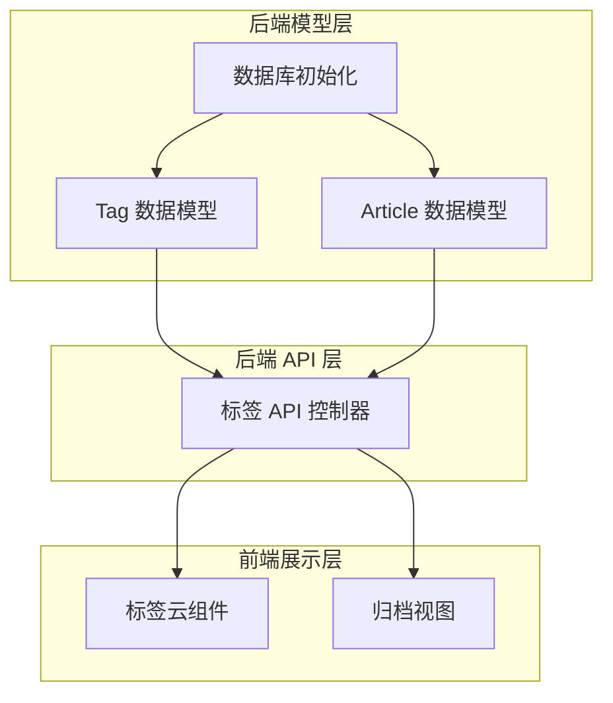

**图表来源**
- [Tag.go:1-102](file://model/Tag.go#L1-L102)
- [Articles.go:1-389](file://model/Articles.go#L1-L389)
- [DB.go:161-214](file://model/DB.go#L161-L214)

**章节来源**
- [Tag.go:1-102](file://model/Tag.go#L1-L102)
- [Articles.go:1-389](file://model/Articles.go#L1-L389)
- [DB.go:161-214](file://model/DB.go#L161-L214)

## 核心组件

### 标签数据模型

标签系统的核心数据结构定义如下：

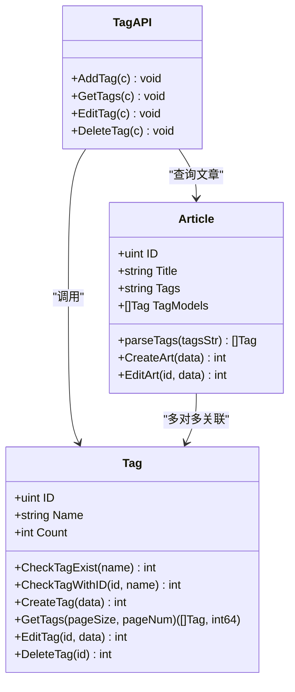

**图表来源**
- [Tag.go:9-13](file://model/Tag.go#L9-L13)
- [Articles.go:11-25](file://model/Articles.go#L11-L25)
- [tag_v1.go:12-73](file://api/v1/tag_v1.go#L12-L73)

### 数据表结构

标签系统涉及以下数据库表结构：

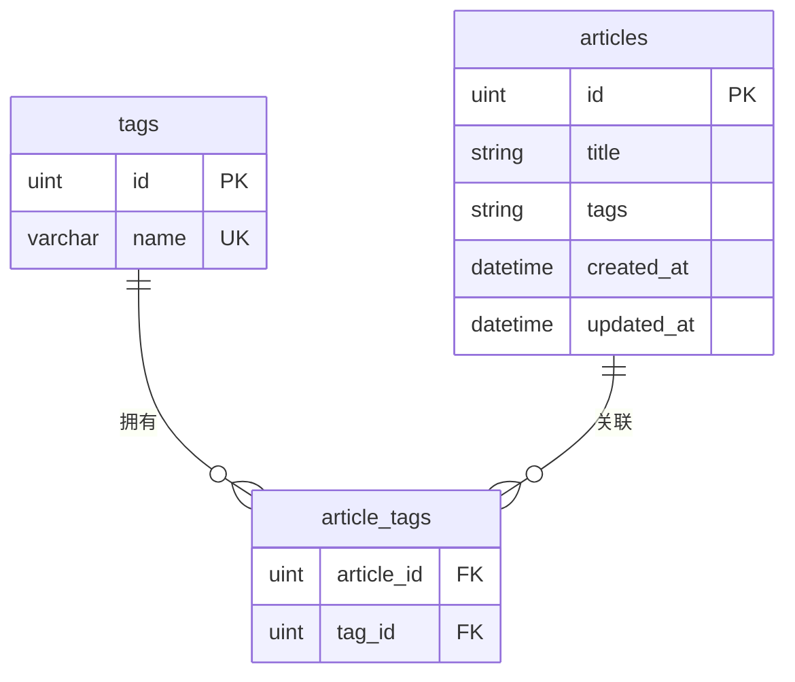

**图表来源**
- [Tag.go:10-12](file://model/Tag.go#L10-L12)
- [Articles.go:23-24](file://model/Articles.go#L23-L24)

**章节来源**
- [Tag.go:9-13](file://model/Tag.go#L9-L13)
- [Articles.go:11-25](file://model/Articles.go#L11-L25)

## 架构概览

标签系统采用分层架构设计，实现了清晰的职责分离：

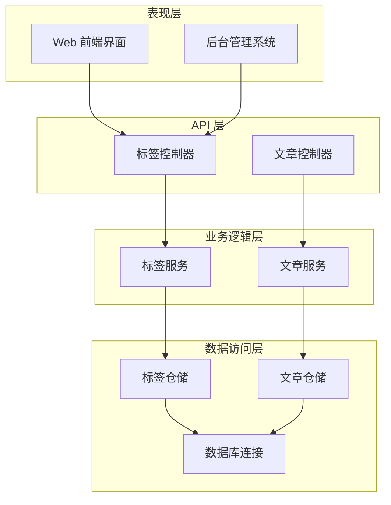

**图表来源**
- [tag_v1.go:12-73](file://api/v1/tag_v1.go#L12-L73)
- [Tag.go:35-101](file://model/Tag.go#L35-L101)
- [Articles.go:51-321](file://model/Articles.go#L51-L321)

## 详细组件分析

### 标签数据模型实现

#### 标签实体定义

标签实体包含以下关键属性：

| 字段名 | 类型 | 约束 | 描述 |
|--------|------|------|------|
| ID | uint | 主键, 自增 | 标签唯一标识符 |
| Name | string | 非空, 唯一 | 标签名称，最大长度100字符 |
| Count | int | - | 文章数量统计（内存字段，不存储到数据库） |

#### 标签验证机制

系统实现了完善的标签验证逻辑：

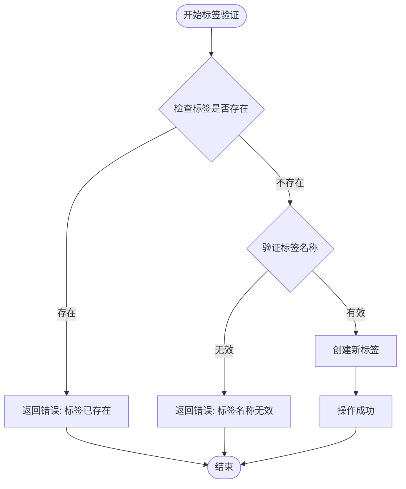

**图表来源**
- [Tag.go:15-23](file://model/Tag.go#L15-L23)
- [Tag.go:35-42](file://model/Tag.go#L35-L42)

**章节来源**
- [Tag.go:9-13](file://model/Tag.go#L9-L13)
- [Tag.go:15-23](file://model/Tag.go#L15-L23)
- [Tag.go:35-42](file://model/Tag.go#L35-L42)

### 标签与文章的多对多关联

#### 关联关系设计

文章与标签通过中间表实现多对多关联：

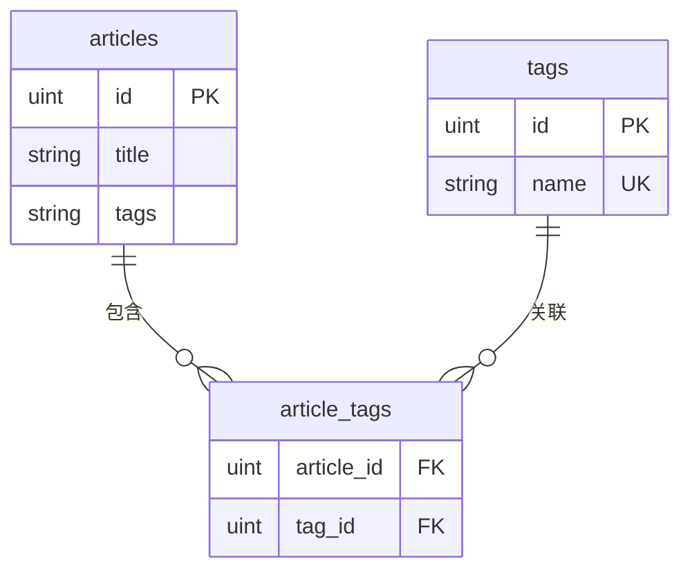

**图表来源**
- [Articles.go:24](file://model/Articles.go#L24)
- [Tag.go:10-12](file://model/Tag.go#L10-L12)

#### 标签解析算法

系统提供了智能的标签解析功能：

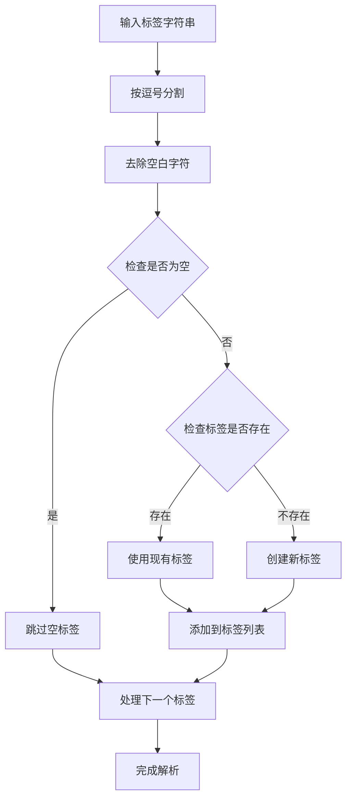

**图表来源**
- [Articles.go:27-49](file://model/Articles.go#L27-L49)

**章节来源**
- [Articles.go:24](file://model/Articles.go#L24)
- [Articles.go:27-49](file://model/Articles.go#L27-L49)

### 标签 CRUD 操作

#### 创建标签操作

标签创建流程包含完整的验证和去重逻辑：

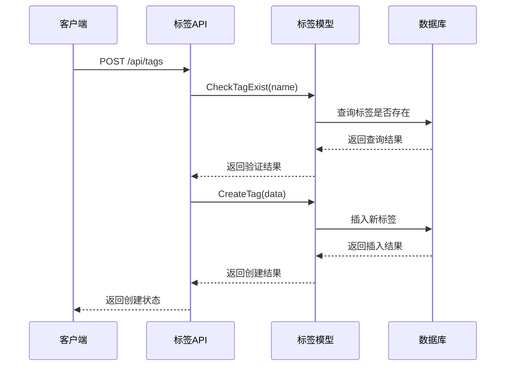

**图表来源**
- [tag_v1.go:12-25](file://api/v1/tag_v1.go#L12-L25)
- [Tag.go:15-23](file://model/Tag.go#L15-L23)
- [Tag.go:35-42](file://model/Tag.go#L35-L42)

#### 更新标签操作

标签更新支持名称唯一性验证：

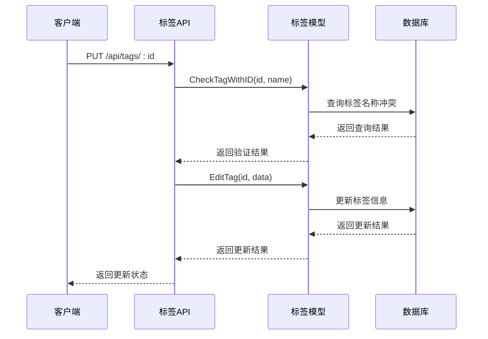

**图表来源**
- [tag_v1.go:41-60](file://api/v1/tag_v1.go#L41-L60)
- [Tag.go:25-33](file://model/Tag.go#L25-L33)
- [Tag.go:77-88](file://model/Tag.go#L77-L88)

#### 删除标签操作

标签删除包含级联清理机制：

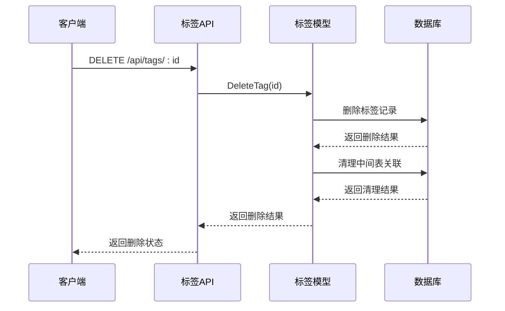

**图表来源**
- [tag_v1.go:62-73](file://api/v1/tag_v1.go#L62-L73)
- [Tag.go:90-101](file://model/Tag.go#L90-L101)

**章节来源**
- [tag_v1.go:12-73](file://api/v1/tag_v1.go#L12-L73)
- [Tag.go:35-101](file://model/Tag.go#L35-L101)

### 标签云生成机制

#### 前端标签云组件

标签云组件提供了两种显示模式：

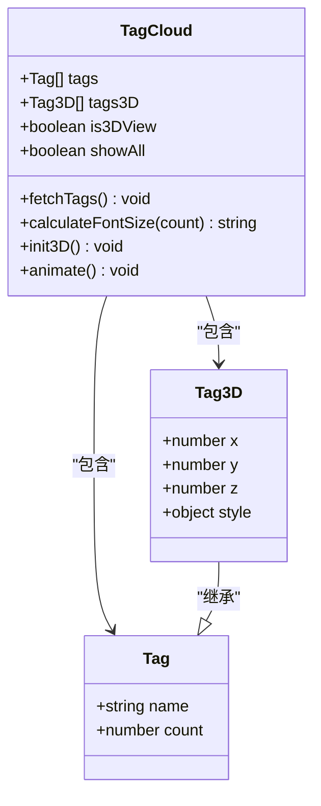

**图表来源**
- [TagCloud.vue:85-100](file://web/frontend/src/components/sidebar/TagCloud.vue#L85-L100)

#### 标签云渲染流程

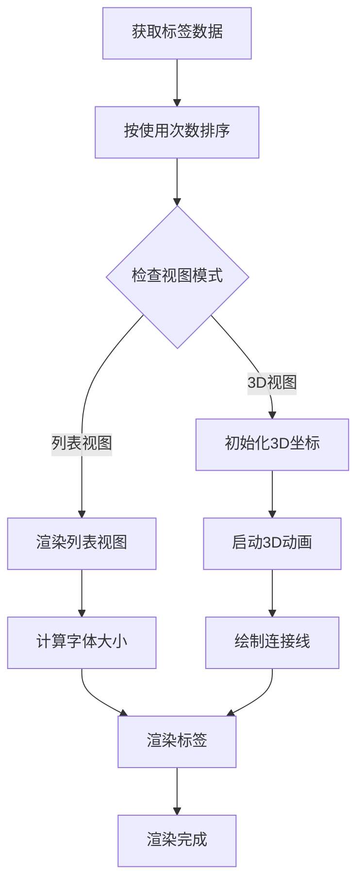

**图表来源**
- [TagCloud.vue:371-412](file://web/frontend/src/components/sidebar/TagCloud.vue#L371-L412)
- [TagCloud.vue:163-177](file://web/frontend/src/components/sidebar/TagCloud.vue#L163-L177)

**章节来源**
- [TagCloud.vue:1-718](file://web/frontend/src/components/sidebar/TagCloud.vue#L1-L718)

### 热门标签统计机制

#### 后端统计实现

热门标签统计通过以下步骤实现：

1. **标签列表获取**：查询所有标签及其文章数量
2. **文章计数统计**：对每个标签执行关联文章计数
3. **数据排序**：按使用次数降序排列
4. **前端展示**：提供给标签云组件使用

#### 前端热门标签应用

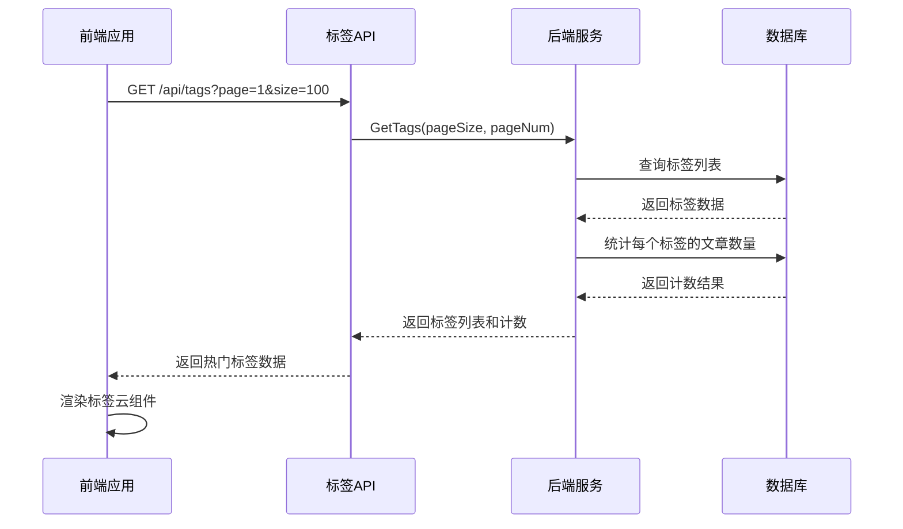

**图表来源**
- [tag_v1.go:27-39](file://api/v1/tag_v1.go#L27-L39)
- [Tag.go:44-75](file://model/Tag.go#L44-L75)

**章节来源**
- [Tag.go:44-75](file://model/Tag.go#L44-L75)
- [tag_v1.go:27-39](file://api/v1/tag_v1.go#L27-L39)

### 标签迁移功能

#### 从旧版本迁移

系统提供了完整的标签迁移功能，支持从旧版本的文章标签字段转换：

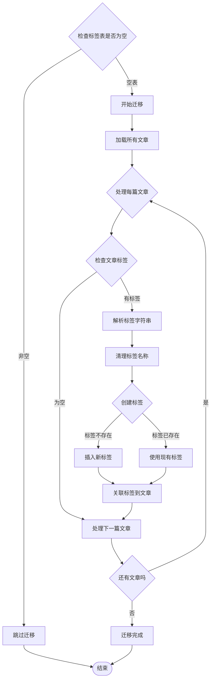

**图表来源**
- [DB.go:161-209](file://model/DB.go#L161-L209)

#### 迁移特性

迁移功能具有以下特性：

- **智能去重**：自动识别重复标签并合并
- **字符兼容**：支持中文逗号和英文逗号
- **错误处理**：对迁移过程中的错误进行记录和跳过
- **性能优化**：批量处理文章，避免逐条处理的性能问题

**章节来源**
- [DB.go:161-209](file://model/DB.go#L161-L209)

### 标签在文章筛选中的应用

#### 文章筛选机制

标签在文章筛选中发挥重要作用：

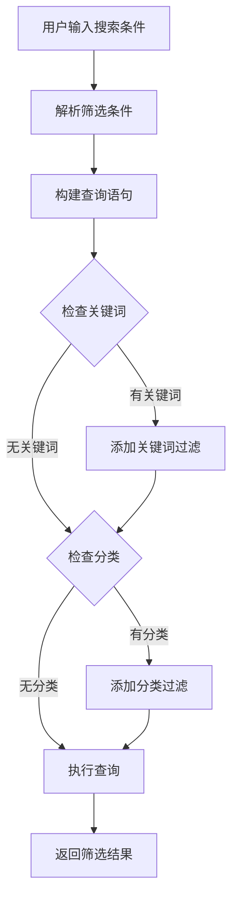

**图表来源**
- [Articles.go:65-106](file://model/Articles.go#L65-L106)

#### 标签相关文章推荐

系统支持基于标签的相关文章推荐功能：

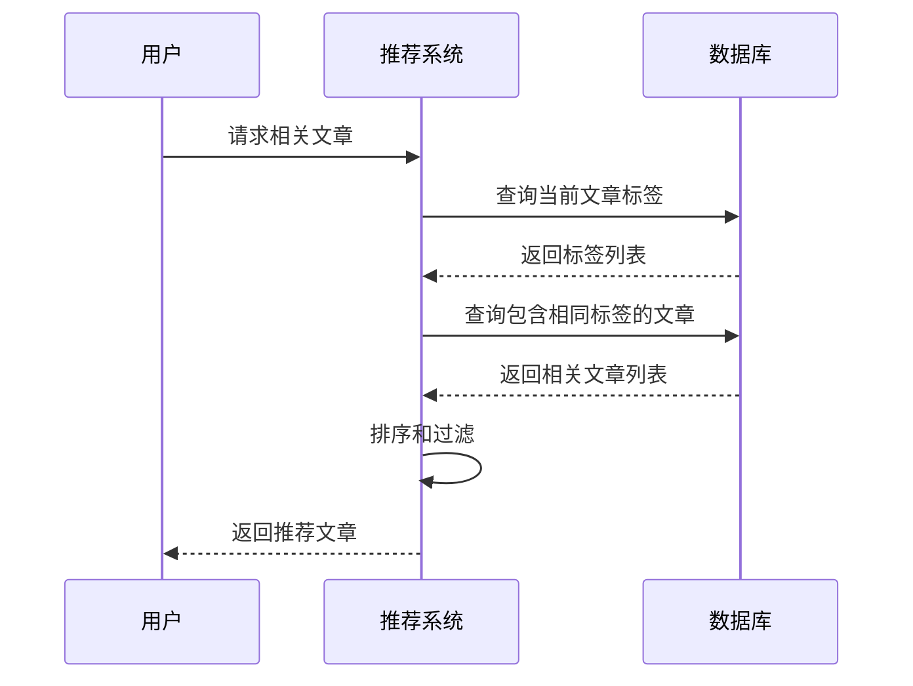

**图表来源**
- [Articles.go:190-227](file://model/Articles.go#L190-L227)

**章节来源**
- [Articles.go:65-106](file://model/Articles.go#L65-L106)
- [Articles.go:190-227](file://model/Articles.go#L190-L227)

## 依赖关系分析

### 模块间依赖关系

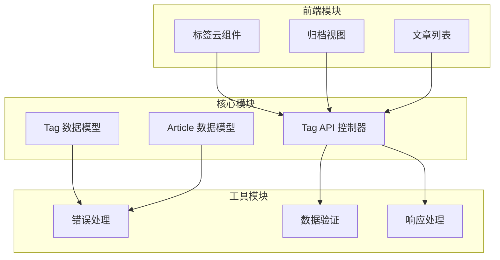

**图表来源**
- [Tag.go:1-102](file://model/Tag.go#L1-L102)
- [Articles.go:1-389](file://model/Articles.go#L1-L389)
- [tag_v1.go:1-74](file://api/v1/tag_v1.go#L1-L74)

### 外部依赖

标签系统主要依赖以下外部组件：

- **GORM ORM**：数据库操作和模型映射
- **Gin Web 框架**：HTTP API 服务
- **Vue.js**：前端用户界面
- **SQLite/MySQL**：数据存储

**章节来源**
- [Tag.go:3-7](file://model/Tag.go#L3-L7)
- [Articles.go:3-9](file://model/Articles.go#L3-L9)

## 性能考虑

### 查询优化策略

1. **懒加载关联**：使用 `Preload` 进行关联数据的延迟加载
2. **分页查询**：对大量数据采用分页处理
3. **索引优化**：为常用查询字段建立索引
4. **缓存机制**：热门标签数据可考虑缓存

### 内存使用优化

- **流式处理**：大文件上传采用流式处理
- **批量操作**：批量删除和更新操作
- **资源释放**：及时释放数据库连接和文件句柄

## 故障排除指南

### 常见问题及解决方案

#### 标签重复问题

**问题**：标签名称重复导致创建失败
**解决方案**：
- 使用 `CheckTagExist` 函数进行预检查
- 在 API 层进行二次验证
- 提供友好的错误提示信息

#### 标签迁移失败

**问题**：从旧版本迁移标签数据失败
**解决方案**：
- 检查数据库连接状态
- 查看迁移日志输出
- 手动修复损坏的数据记录

#### 标签云显示异常

**问题**：标签云组件无法正常显示
**解决方案**：
- 检查 API 接口响应状态
- 验证标签数据格式
- 检查前端组件依赖

**章节来源**
- [Tag.go:15-23](file://model/Tag.go#L15-L23)
- [DB.go:161-209](file://model/DB.go#L161-L209)
- [TagCloud.vue:371-412](file://web/frontend/src/components/sidebar/TagCloud.vue#L371-L412)

## 结论

YanBlog 的标签数据模型设计合理，实现了完整的标签管理功能。系统通过清晰的分层架构、完善的验证机制、智能的标签解析算法和灵活的展示组件，为用户提供了一个功能丰富、性能优良的标签管理解决方案。

主要特点包括：
- **数据完整性**：通过唯一约束和验证机制确保数据一致性
- **扩展性强**：支持标签迁移和未来功能扩展
- **用户体验好**：提供直观的标签云展示和交互体验
- **性能优化**：采用多种优化策略提升系统性能

该标签系统为博客平台的内容组织和检索提供了坚实的基础，能够满足各种规模的博客网站需求。