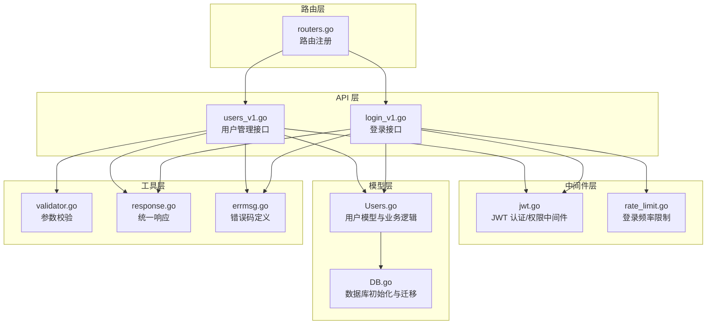
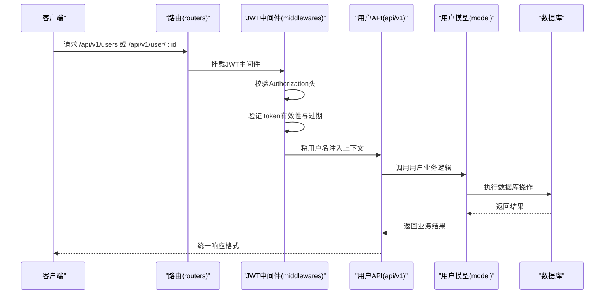
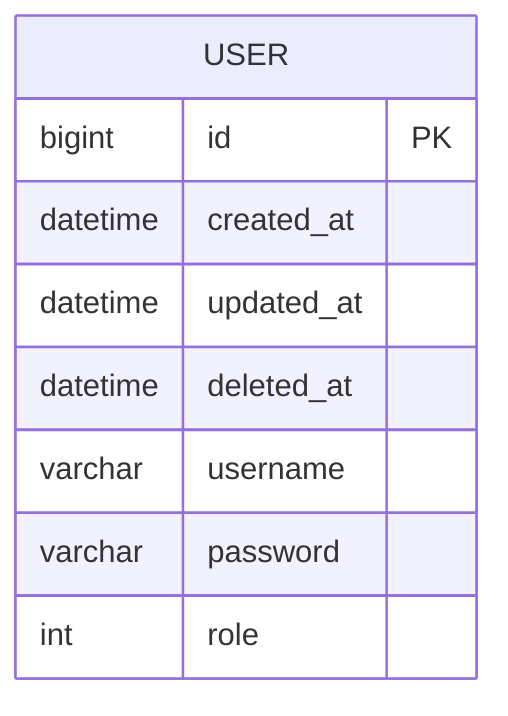
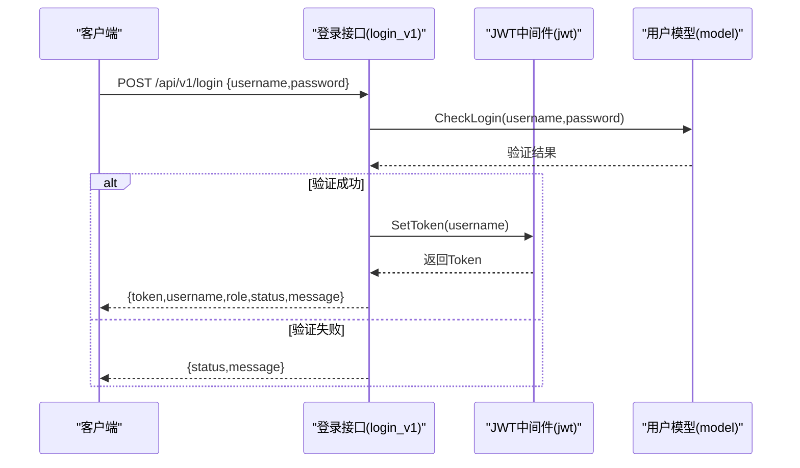
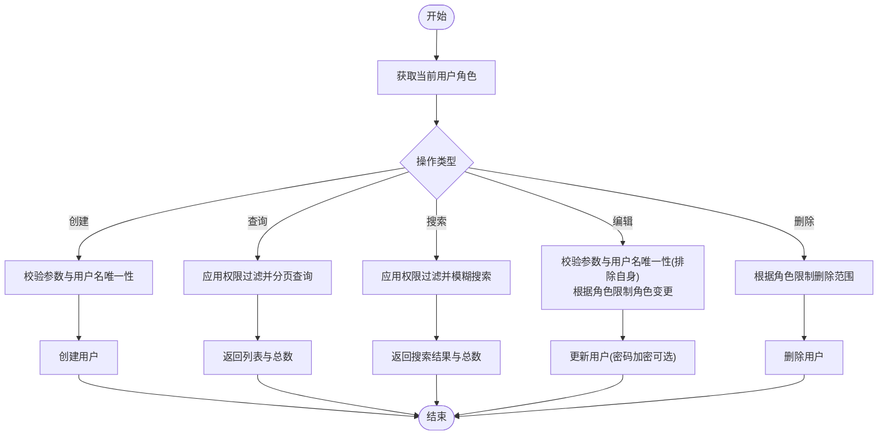
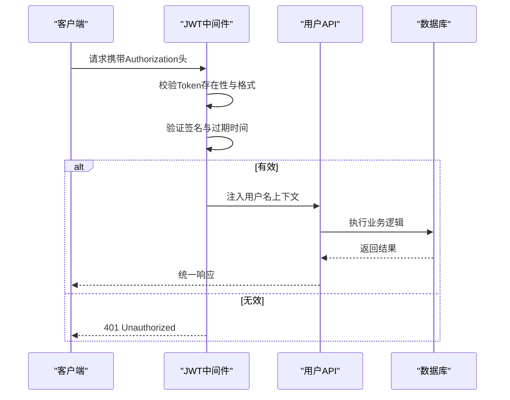
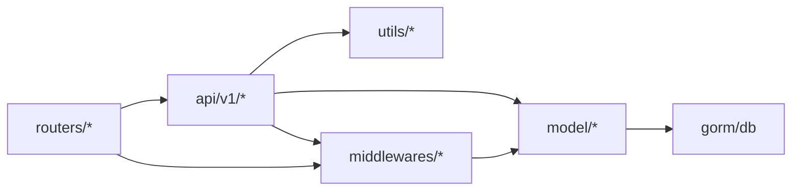

# 用户数据模型

<cite>
**本文引用的文件**
- [Users.go](file://model/Users.go)
- [users_v1.go](file://api\v1\users_v1.go)
- [login_v1.go](file://api\v1\login_v1.go)
- [jwt.go](file://middlewares\jwt.go)
- [routers.go](file://routers\routers.go)
- [DB.go](file://model\DB.go)
- [validator.go](file://utils\validator\validator.go)
- [errmsg.go](file://utils\errmsg\errmsg.go)
- [response.go](file://utils\response.go)
- [rate_limit.go](file://middlewares\rate_limit.go)
</cite>

## 目录
1. [简介](#简介)
2. [项目结构](#项目结构)
3. [核心组件](#核心组件)
4. [架构概览](#架构概览)
5. [详细组件分析](#详细组件分析)
6. [依赖关系分析](#依赖关系分析)
7. [性能考量](#性能考量)
8. [故障排除指南](#故障排除指南)
9. [结论](#结论)

## 简介
本文件详细描述了用户数据模型的设计与实现，包括用户表结构、角色权限体系、认证机制、密码存储策略、CRUD 操作规则、状态管理以及与 JWT 认证系统的集成方式。该系统采用 GORM 作为 ORM 框架，Gin 作为 Web 框架，并通过 bcrypt 实现密码安全存储。

## 项目结构
用户相关功能分布在以下层次：
- 数据模型层：定义用户实体及数据库操作
- API 层：提供用户管理的 REST 接口
- 中间件层：JWT 认证与权限控制、登录频率限制
- 工具层：统一响应格式、参数校验、错误码定义

**图表来源**
- [users_v1.go:1-283](file://api\v1\users_v1.go#L1-L283)
- [login_v1.go:1-59](file://api\v1\login_v1.go#L1-L59)
- [jwt.go:1-157](file://middlewares\jwt.go#L1-L157)
- [rate_limit.go:1-98](file://middlewares\rate_limit.go#L1-L98)
- [Users.go:1-245](file://model\Users.go#L1-L245)
- [DB.go:1-312](file://model\DB.go#L1-L312)
- [validator.go:1-38](file://utils\validator\validator.go#L1-L38)
- [response.go:1-100](file://utils\response.go#L1-L100)
- [errmsg.go:1-57](file://utils\errmsg\errmsg.go#L1-L57)
- [routers.go:1-122](file://routers\routers.go#L1-L122)

**章节来源**
- [routers.go:13-122](file://routers\routers.go#L13-L122)
- [Users.go:11-17](file://model\Users.go#L11-L17)
- [DB.go:26-79](file://model\DB.go#L26-L79)

## 核心组件
- 用户模型：包含用户名、密码、角色等字段，使用 GORM 标签定义数据库映射与校验规则
- 用户业务逻辑：提供用户创建、查询、搜索、编辑、删除等操作，内置权限过滤与校验
- JWT 认证：提供 Token 生成、验证、过期检查与权限中间件
- 登录接口：验证用户名与密码，成功后返回 Token
- 路由与中间件：按需挂载 JWT 认证与管理员权限中间件

**章节来源**
- [Users.go:11-17](file://model\Users.go#L11-L17)
- [Users.go:110-187](file://model\Users.go#L110-L187)
- [jwt.go:22-49](file://middlewares\jwt.go#L22-L49)
- [login_v1.go:13-58](file://api\v1\login_v1.go#L13-L58)
- [routers.go:38-96](file://routers\routers.go#L38-L96)

## 架构概览
用户模块遵循分层架构，请求流如下：
- 客户端发起请求至路由层
- 路由根据权限需求挂载 JWT 认证与管理员权限中间件
- 中间件完成 Token 校验并将用户名注入上下文
- API 层调用模型层执行业务逻辑
- 模型层通过 GORM 访问数据库，必要时触发 GORM 钩子进行密码加密
- 统一响应格式返回给客户端

**图表来源**
- [routers.go:38-96](file://routers\routers.go#L38-L96)
- [jwt.go:98-157](file://middlewares\jwt.go#L98-L157)
- [users_v1.go:77-118](file://api\v1\users_v1.go#L77-L118)
- [Users.go:121-147](file://model\Users.go#L121-L147)

## 详细组件分析

### 用户表结构与字段定义
- 表名：由 GORM 的 gorm.Model 自动创建，包含标准字段（ID、CreatedAt、UpdatedAt、DeletedAt）
- 字段定义：
  - Username：varchar(20)，非空，参与 JSON 序列化，校验规则要求长度在 4-12 之间
  - Password：varchar(100)，非空，不参与 JSON 序列化，用于存储加密后的密码
  - Role：int，默认值 2，代表角色码（1:超级管理员, 2:管理员, 3:普通用户）

**图表来源**
- [Users.go:12-17](file://model\Users.go#L12-L17)

**章节来源**
- [Users.go:12-17](file://model\Users.go#L12-L17)

### 角色权限体系
- 角色码定义：
  - 1：超级管理员（拥有最高权限）
  - 2：管理员（部分管理权限）
  - 3：普通用户（仅有限权限）
- 权限过滤：
  - 超级管理员可见所有用户
  - 管理员只能看到管理员及以上角色用户
  - 普通用户只能看到自身
- 路由权限：
  - 用户增删改：仅超级管理员和管理员可用
  - 用户查询与搜索：需认证（JWT）即可访问

**章节来源**
- [Users.go:19-34](file://model\Users.go#L19-L34)
- [routers.go:38-96](file://routers\routers.go#L38-L96)

### 用户认证机制与密码存储
- 登录流程：
  - 客户端提交用户名与密码
  - 服务端验证用户是否存在、密码是否正确
  - 若验证通过，生成 JWT Token（有效期 10 小时）
- 密码存储策略：
  - 使用 bcrypt 对密码进行哈希加密
  - GORM 钩子在保存用户前自动加密密码
  - 更新用户时若提供新密码，同样进行加密
- Token 结构：
  - 包含用户名与过期时间等标准声明
  - 使用 HS256 签名算法
  - 前端以 Bearer 方式携带 Token

**图表来源**
- [login_v1.go:13-58](file://api\v1\login_v1.go#L13-L58)
- [jwt.go:27-49](file://middlewares\jwt.go#L27-L49)
- [Users.go:214-237](file://model\Users.go#L214-L237)

**章节来源**
- [login_v1.go:13-58](file://api\v1\login_v1.go#L13-L58)
- [jwt.go:22-49](file://middlewares\jwt.go#L22-L49)
- [Users.go:189-212](file://model\Users.go#L189-L212)

### 用户 CRUD 操作与业务规则
- 创建用户：
  - 校验用户名唯一性
  - 校验输入参数（基于标签规则）
  - 创建用户记录
- 查询用户列表：
  - 支持分页与总数统计
  - 根据当前用户角色应用权限过滤
- 搜索用户：
  - 支持按用户名模糊搜索与角色筛选
  - 同样应用权限过滤
- 编辑用户：
  - 校验用户名唯一性（排除自身）
  - 根据当前用户角色限制可编辑范围与角色变更
  - 密码为空时不更新密码，否则进行加密更新
- 删除用户：
  - 超级管理员不可删除自身
  - 管理员仅能删除普通用户
  - 普通用户无删除权限

**图表来源**
- [users_v1.go:15-75](file://api\v1\users_v1.go#L15-L75)
- [users_v1.go:77-118](file://api\v1\users_v1.go#L77-L118)
- [users_v1.go:120-228](file://api\v1\users_v1.go#L120-L228)
- [users_v1.go:230-282](file://api\v1\users_v1.go#L230-L282)
- [Users.go:36-47](file://model\Users.go#L36-L47)
- [Users.go:110-119](file://model\Users.go#L110-L119)
- [Users.go:121-147](file://model\Users.go#L121-L147)
- [Users.go:149-187](file://model\Users.go#L149-L187)

**章节来源**
- [users_v1.go:15-75](file://api\v1\users_v1.go#L15-L75)
- [users_v1.go:77-118](file://api\v1\users_v1.go#L77-L118)
- [users_v1.go:120-228](file://api\v1\users_v1.go#L120-L228)
- [users_v1.go:230-282](file://api\v1\users_v1.go#L230-L282)
- [Users.go:36-47](file://model\Users.go#L36-L47)
- [Users.go:110-119](file://model\Users.go#L110-L119)
- [Users.go:121-147](file://model\Users.go#L121-L147)
- [Users.go:149-187](file://model\Users.go#L149-L187)

### 会话处理与 JWT 集成
- 会话生命周期：
  - 登录成功后颁发 Token，有效期 10 小时
  - 客户端在后续请求中通过 Authorization: Bearer <token> 携带
  - 中间件负责校验 Token 存在性、格式、有效性与过期时间
- 权限控制：
  - AdminRequired 中间件确保只有角色 ≤ 2 的用户可访问管理员路由
  - API 层在业务逻辑中再次校验用户角色与操作范围
- 安全增强：
  - 登录接口启用频率限制，防暴力破解
  - 密码使用 bcrypt 哈希存储，不落盘明文

**图表来源**
- [jwt.go:98-157](file://middlewares\jwt.go#L98-L157)
- [routers.go:38-96](file://routers\routers.go#L38-L96)
- [rate_limit.go:50-98](file://middlewares\rate_limit.go#L50-L98)

**章节来源**
- [jwt.go:98-157](file://middlewares\jwt.go#L98-L157)
- [routers.go:38-96](file://routers\routers.go#L38-L96)
- [rate_limit.go:50-98](file://middlewares\rate_limit.go#L50-L98)

### 数据库初始化与默认用户
- 数据库初始化：
  - 支持 SQLite 与 MySQL，自动迁移用户、分类、文章、标签等表
  - 首次运行时创建默认超级管理员账户（用户名 admin，密码 123456）
  - 提示安全警告，建议立即修改默认密码
- 演示文章：
  - 首次运行时从静态文件创建演示文章

**章节来源**
- [DB.go:26-79](file://model\DB.go#L26-L79)

## 依赖关系分析
- 模块耦合：
  - API 层依赖模型层与工具层
  - 中间件依赖模型层进行角色查询
  - 路由层统一挂载中间件并注册接口
- 外部依赖：
  - GORM：数据库 ORM 与自动迁移
  - Gin：Web 框架与路由
  - bcrypt：密码哈希
  - JWT：Token 签名与验证

**图表来源**
- [routers.go:3-12](file://routers\routers.go#L3-L12)
- [users_v1.go:3-13](file://api\v1\users_v1.go#L3-L13)
- [jwt.go:3-13](file://middlewares\jwt.go#L3-L13)
- [DB.go:3-17](file://model\DB.go#L3-L17)

**章节来源**
- [routers.go:3-12](file://routers\routers.go#L3-L12)
- [users_v1.go:3-13](file://api\v1\users_v1.go#L3-L13)
- [jwt.go:3-13](file://middlewares\jwt.go#L3-L13)
- [DB.go:3-17](file://model\DB.go#L3-L17)

## 性能考量
- 分页查询优化：
  - 先查询总数再分页查询，避免一次性加载大量数据
  - 单页最大记录数限制，防止恶意请求
- 权限过滤：
  - 通过 applyRoleFilter 在数据库层面限制可见范围
- 密码加密：
  - bcrypt 哈希成本为 10，平衡安全性与性能
- 数据库连接池：
  - 设置空闲与活跃连接数、连接生命周期，提高并发能力

**章节来源**
- [Users.go:70-108](file://model\Users.go#L70-L108)
- [Users.go:121-147](file://model\Users.go#L121-L147)
- [DB.go:41-44](file://model\DB.go#L41-L44)
- [response.go:66-87](file://utils\response.go#L66-L87)

## 故障排除指南
- 登录失败：
  - 用户名不存在或密码错误：检查用户名与密码是否正确
  - Token 相关错误：确认 Authorization 头格式为 Bearer token，且未过期
- 权限不足：
  - 无权创建/编辑/删除用户：确认当前用户角色是否满足要求
  - 无法访问管理员接口：确认已登录且角色 ≤ 2
- 参数校验失败：
  - 检查用户名长度（4-12）、角色码范围等
- 数据库连接问题：
  - 确认数据库配置正确，MySQL 需等待容器启动完成
- 安全提示：
  - 首次运行出现默认超级管理员提示：立即修改默认密码

**章节来源**
- [errmsg.go:3-28](file://utils\errmsg\errmsg.go#L3-L28)
- [jwt.go:100-157](file://middlewares\jwt.go#L100-L157)
- [users_v1.go:28-53](file://api\v1\users_v1.go#L28-L53)
- [DB.go:51-71](file://model\DB.go#L51-L71)

## 结论
用户数据模型通过清晰的表结构、严格的权限控制、安全的密码存储与完善的 CRUD 流程，构建了一个健壮的用户管理体系。JWT 认证与中间件配合实现了细粒度的访问控制，结合登录频率限制与参数校验，进一步提升了系统的安全性与稳定性。建议在生产环境中：
- 强制修改默认超级管理员密码
- 使用 HTTPS 传输 Token
- 定期审查权限分配与操作日志
- 根据业务增长调整分页与缓存策略