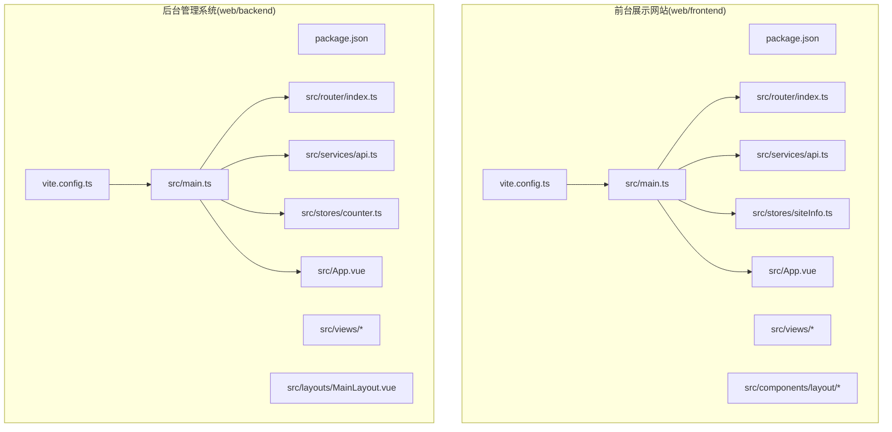
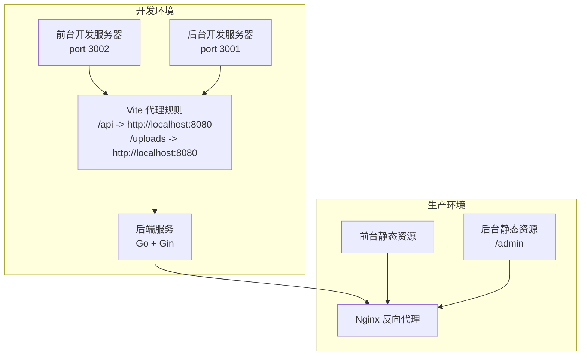
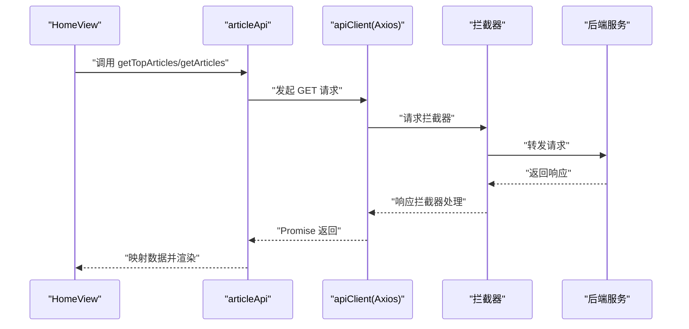
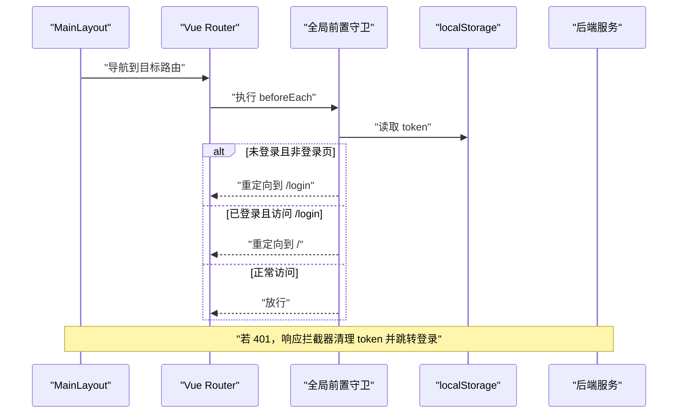
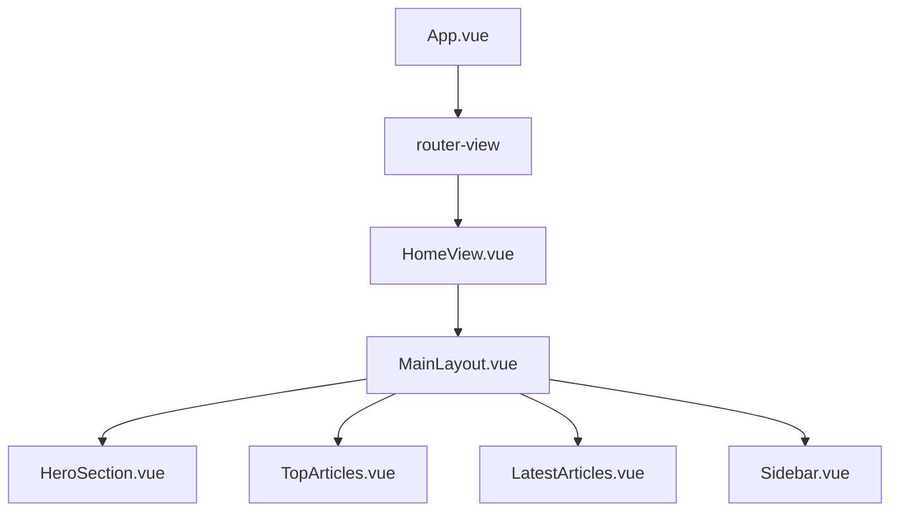
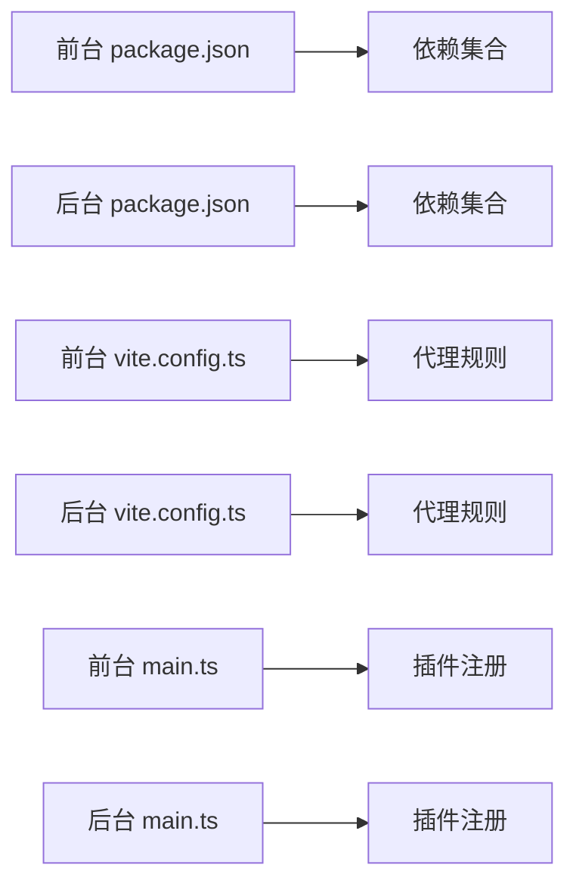

# 前端架构

<cite>
**本文引用的文件**
- [web/frontend/package.json](file://web/frontend/package.json)
- [web/backend/package.json](file://web/backend/package.json)
- [web/frontend/vite.config.ts](file://web/frontend/vite.config.ts)
- [web/backend/vite.config.ts](file://web/backend/vite.config.ts)
- [web/frontend/src/main.ts](file://web/frontend/src/main.ts)
- [web/backend/src/main.ts](file://web/backend/src/main.ts)
- [web/frontend/src/router/index.ts](file://web/frontend/src/router/index.ts)
- [web/backend/src/router/index.ts](file://web/backend/src/router/index.ts)
- [web/frontend/src/services/api.ts](file://web/frontend/src/services/api.ts)
- [web/backend/src/services/api.ts](file://web/backend/src/services/api.ts)
- [web/frontend/src/stores/siteInfo.ts](file://web/frontend/src/stores/siteInfo.ts)
- [web/backend/src/stores/counter.ts](file://web/backend/src/stores/counter.ts)
- [web/frontend/src/App.vue](file://web/frontend/src/App.vue)
- [web/backend/src/App.vue](file://web/backend/src/App.vue)
- [web/backend/src/layouts/MainLayout.vue](file://web/backend/src/layouts/MainLayout.vue)
- [web/frontend/src/views/HomeView.vue](file://web/frontend/src/views/HomeView.vue)
- [web/backend/src/views/dashboard/Dashboard.vue](file://web/backend/src/views/dashboard/Dashboard.vue)
</cite>

## 目录
1. [简介](#简介)
2. [项目结构](#项目结构)
3. [核心组件](#核心组件)
4. [架构总览](#架构总览)
5. [详细组件分析](#详细组件分析)
6. [依赖关系分析](#依赖关系分析)
7. [性能考量](#性能考量)
8. [故障排查指南](#故障排查指南)
9. [结论](#结论)
10. [附录](#附录)

## 简介
本文件为 YanBlog 的前端架构文档，聚焦于基于 Vue 3 + TypeScript 的双前端架构设计与实现。系统包含两个独立前端应用：
- 前台展示网站（web/frontend）：面向访客的博客站点，提供文章浏览、归档、分类、关于页等功能。
- 后台管理系统（web/backend）：面向管理员的管理界面，提供用户、分类、标签、文章、媒体库、系统配置等管理能力。

两大前端均采用 Composition API、组件化架构、Pinia 状态管理、Element Plus UI 库，并通过 Vite 进行开发与构建。前后端通过统一的 API 代理进行数据交互，采用 Axios 封装与拦截器实现统一的请求/响应处理与错误处理。

## 项目结构
双前端采用“按应用分层”的组织方式，每个应用拥有独立的依赖、构建配置、路由、状态与服务层，便于独立开发与部署。

图表来源
- [web/frontend/vite.config.ts:1-56](file://web/frontend/vite.config.ts#L1-L56)
- [web/backend/vite.config.ts:1-74](file://web/backend/vite.config.ts#L1-L74)
- [web/frontend/src/main.ts:1-28](file://web/frontend/src/main.ts#L1-L28)
- [web/backend/src/main.ts:1-23](file://web/backend/src/main.ts#L1-L23)

章节来源
- [web/frontend/package.json:1-45](file://web/frontend/package.json#L1-L45)
- [web/backend/package.json:1-62](file://web/backend/package.json#L1-L62)
- [web/frontend/vite.config.ts:1-56](file://web/frontend/vite.config.ts#L1-L56)
- [web/backend/vite.config.ts:1-74](file://web/backend/vite.config.ts#L1-L74)

## 核心组件
- 应用入口与插件注册
  - 前台与后台均在入口文件中完成应用创建、插件安装（Pinia、Router、Element Plus）、全局指令与错误处理注册。
- 路由系统
  - 前台：基于 History 模式，定义首页、文章列表、详情、分类、归档、关于页与兜底路由；包含参数校验与滚动行为优化。
  - 后台：采用嵌套路由与侧边栏布局，定义登录、仪表板、用户、分类、标签、文章、媒体库、系统设置等模块；包含全局前置守卫进行权限控制与标题设置。
- 状态管理
  - 前台：Pinia Store 管理站点配置（siteInfo），支持从 API 或静态文件加载、更新与刷新。
  - 后台：示例 Store（counter）演示基础状态管理。
- API 客户端
  - 前台：Axios 实例封装，统一基地址、超时、拦截器与取消控制；按业务域拆分模块化 API。
  - 后台：Axios 实例封装，统一添加 Authorization 头、401 自动登出逻辑；按业务域拆分模块化 API。
- UI 组件库
  - Element Plus 集成，前台引入暗色主题变量；后台注册图标组件并使用 Element Plus 布局组件实现侧边栏与面包屑导航。

章节来源
- [web/frontend/src/main.ts:1-28](file://web/frontend/src/main.ts#L1-L28)
- [web/backend/src/main.ts:1-23](file://web/backend/src/main.ts#L1-L23)
- [web/frontend/src/router/index.ts:1-73](file://web/frontend/src/router/index.ts#L1-L73)
- [web/backend/src/router/index.ts:1-190](file://web/backend/src/router/index.ts#L1-L190)
- [web/frontend/src/stores/siteInfo.ts:1-261](file://web/frontend/src/stores/siteInfo.ts#L1-L261)
- [web/backend/src/stores/counter.ts:1-13](file://web/backend/src/stores/counter.ts#L1-L13)
- [web/frontend/src/services/api.ts:1-137](file://web/frontend/src/services/api.ts#L1-L137)
- [web/backend/src/services/api.ts:1-255](file://web/backend/src/services/api.ts#L1-L255)

## 架构总览
双前端通过 Vite 开发服务器与 Nginx 进行联调，开发阶段通过本地代理将 /api 与 /uploads 等请求转发至后端服务。生产环境分别构建并部署到各自静态资源目录，后台通过 /admin 前缀访问。

图表来源
- [web/frontend/vite.config.ts:41-52](file://web/frontend/vite.config.ts#L41-L52)
- [web/backend/vite.config.ts:51-72](file://web/backend/vite.config.ts#L51-L72)

章节来源
- [web/frontend/vite.config.ts:1-56](file://web/frontend/vite.config.ts#L1-L56)
- [web/backend/vite.config.ts:1-74](file://web/backend/vite.config.ts#L1-L74)

## 详细组件分析

### 前台展示网站（web/frontend）
- 应用入口与全局配置
  - 注册 Pinia、Router、Element Plus，注册全局懒加载指令；设置全局错误处理器防止子组件异常导致白屏。
- 路由与导航
  - 定义首页、文章列表、详情、分类、归档、关于页与兜底路由；前置守卫对动态参数进行校验；滚动行为返回顶部或恢复历史位置。
- 视图与布局
  - HomeView 作为主页视图，组合 HeroSection、TopArticles、LatestArticles 与 Sidebar；通过 API 获取置顶与最新文章数据。
- 状态与配置
  - siteInfo Store 支持从 API 或静态文件加载配置，支持本地环境覆盖与配置更新；应用启动时动态注入图标字体与 Favicon，切换窗口焦点时动态修改页面标题。
- API 客户端
  - Axios 实例封装，统一基地址、超时与拦截器；提供文章、分类、标签、天气、系统状态等 API 模块；支持请求取消控制器。

图表来源
- [web/frontend/src/views/HomeView.vue:48-105](file://web/frontend/src/views/HomeView.vue#L48-L105)
- [web/frontend/src/services/api.ts:67-103](file://web/frontend/src/services/api.ts#L67-L103)
- [web/frontend/src/services/api.ts:28-64](file://web/frontend/src/services/api.ts#L28-L64)

章节来源
- [web/frontend/src/main.ts:1-28](file://web/frontend/src/main.ts#L1-L28)
- [web/frontend/src/router/index.ts:1-73](file://web/frontend/src/router/index.ts#L1-L73)
- [web/frontend/src/views/HomeView.vue:1-133](file://web/frontend/src/views/HomeView.vue#L1-L133)
- [web/frontend/src/stores/siteInfo.ts:189-259](file://web/frontend/src/stores/siteInfo.ts#L189-L259)
- [web/frontend/src/services/api.ts:1-137](file://web/frontend/src/services/api.ts#L1-L137)

### 后台管理系统（web/backend）
- 应用入口与 UI 集成
  - 注册 Element Plus 图标组件，使用 Element Plus 布局容器实现侧边栏与头部导航；注册 Router。
- 路由与权限
  - 嵌套路由与侧边栏菜单；全局前置守卫检查登录状态与页面标题；未登录跳转登录页，已登录访问登录页跳转首页。
- 布局与导航
  - MainLayout 提供侧边栏菜单、面包屑导航与用户下拉菜单；根据路由 meta 动态计算激活菜单与面包屑项。
- 视图与组件
  - Dashboard 视图作为示例，内部复用组件化 Dashboard 容器。
- API 客户端
  - Axios 实例封装，自动携带 Bearer Token；401 时清理本地存储并跳转登录页；按业务域拆分用户、分类、标签、文章、文件、系统配置等 API。

图表来源
- [web/backend/src/layouts/MainLayout.vue:162-170](file://web/backend/src/layouts/MainLayout.vue#L162-L170)
- [web/backend/src/router/index.ts:169-188](file://web/backend/src/router/index.ts#L169-L188)
- [web/backend/src/services/api.ts:34-43](file://web/backend/src/services/api.ts#L34-L43)

章节来源
- [web/backend/src/main.ts:1-23](file://web/backend/src/main.ts#L1-L23)
- [web/backend/src/router/index.ts:1-190](file://web/backend/src/router/index.ts#L1-L190)
- [web/backend/src/layouts/MainLayout.vue:1-245](file://web/backend/src/layouts/MainLayout.vue#L1-L245)
- [web/backend/src/views/dashboard/Dashboard.vue:1-11](file://web/backend/src/views/dashboard/Dashboard.vue#L1-L11)
- [web/backend/src/services/api.ts:1-255](file://web/backend/src/services/api.ts#L1-L255)

### 组件树结构（前台）
以下为前台应用的核心组件树示意，体现页面、布局与业务组件的层次关系。

图表来源
- [web/frontend/src/App.vue:1-24](file://web/frontend/src/App.vue#L1-L24)
- [web/frontend/src/views/HomeView.vue:1-24](file://web/frontend/src/views/HomeView.vue#L1-L24)
- [web/frontend/src/components/layout/MainLayout.vue](file://web/frontend/src/components/layout/MainLayout.vue)

章节来源
- [web/frontend/src/App.vue:1-215](file://web/frontend/src/App.vue#L1-L215)
- [web/frontend/src/views/HomeView.vue:1-133](file://web/frontend/src/views/HomeView.vue#L1-L133)

## 依赖关系分析
- 依赖分层
  - 前台与后台各自维护独立的依赖集合，前台侧重展示与 Markdown 渲染、评论、主题等；后台侧重管理与可视化。
- 构建与运行
  - 前台：开发端口 3002，代理 /api 与 /uploads；后台：开发端口 3001，代理 /api、/uploads、/assets、/static、/iconfont；生产环境通过 Nginx 提供静态资源与反向代理。
- 插件与工具链
  - 均使用 @vitejs/plugin-vue、@vitejs/plugin-vue-jsx、vite-plugin-vue-devtools；TypeScript 类型检查与测试工具链按需配置。

图表来源
- [web/frontend/package.json:16-30](file://web/frontend/package.json#L16-L30)
- [web/backend/package.json:20-35](file://web/backend/package.json#L20-L35)
- [web/frontend/vite.config.ts:41-52](file://web/frontend/vite.config.ts#L41-L52)
- [web/backend/vite.config.ts:51-72](file://web/backend/vite.config.ts#L51-L72)
- [web/frontend/src/main.ts:14-19](file://web/frontend/src/main.ts#L14-L19)
- [web/backend/src/main.ts:4-21](file://web/backend/src/main.ts#L4-L21)

章节来源
- [web/frontend/package.json:1-45](file://web/frontend/package.json#L1-L45)
- [web/backend/package.json:1-62](file://web/backend/package.json#L1-L62)
- [web/frontend/vite.config.ts:1-56](file://web/frontend/vite.config.ts#L1-L56)
- [web/backend/vite.config.ts:1-74](file://web/backend/vite.config.ts#L1-L74)
- [web/frontend/src/main.ts:1-28](file://web/frontend/src/main.ts#L1-L28)
- [web/backend/src/main.ts:1-23](file://web/backend/src/main.ts#L1-L23)

## 性能考量
- 路由懒加载与过渡动画
  - 前台路由对部分视图采用动态导入实现懒加载；App.vue 使用 Transition 实现页面切换动画，提升用户体验。
- 请求取消与超时控制
  - 前台 API 客户端提供 AbortController 封装，支持在组件卸载或重复请求时主动取消，避免资源浪费与竞态问题。
- 缓存与配置加载策略
  - 前台 siteInfo 支持优先从 API 加载配置，降级到静态文件；本地开发环境可覆盖后台访问地址，减少跨域与调试成本。
- UI 组件按需加载
  - Element Plus 已引入完整样式，建议在生产构建中结合打包工具进行按需引入以减小体积（当前仓库未启用按需引入配置）。

章节来源
- [web/frontend/src/router/index.ts:12-28](file://web/frontend/src/router/index.ts#L12-L28)
- [web/frontend/src/App.vue:12-17](file://web/frontend/src/App.vue#L12-L17)
- [web/frontend/src/services/api.ts:11-26](file://web/frontend/src/services/api.ts#L11-L26)
- [web/frontend/src/stores/siteInfo.ts:189-234](file://web/frontend/src/stores/siteInfo.ts#L189-L234)

## 故障排查指南
- 跨域与代理问题
  - 若开发时出现 /api 请求失败，检查 Vite 代理配置与后端服务是否启动；确认 allowed_hosts 与 admin_url 配置正确。
- 登录与鉴权
  - 后台 401 错误会触发自动登出与跳转；检查 localStorage 中 token 是否存在与有效；确认响应拦截器逻辑是否被正确执行。
- 网络错误与超时
  - 前台 API 客户端对超时与网络错误进行统一提示；若出现“网络连接错误”，请检查后端服务状态与代理规则。
- 页面空白或异常
  - 前台全局错误处理器可避免子组件异常导致白屏；查看控制台错误堆栈定位具体组件与信息。

章节来源
- [web/frontend/vite.config.ts:37-52](file://web/frontend/vite.config.ts#L37-L52)
- [web/backend/vite.config.ts:47-72](file://web/backend/vite.config.ts#L47-L72)
- [web/backend/src/services/api.ts:34-43](file://web/backend/src/services/api.ts#L34-L43)
- [web/frontend/src/services/api.ts:48-64](file://web/frontend/src/services/api.ts#L48-L64)
- [web/frontend/src/main.ts:21-26](file://web/frontend/src/main.ts#L21-L26)

## 结论
YanBlog 的双前端架构清晰地划分了前台展示与后台管理的职责边界，借助 Vue 3 Composition API、Pinia、Element Plus 与 Axios，实现了高内聚、低耦合的组件化体系。通过 Vite 的代理与 Nginx 的部署策略，满足了开发与生产的高效协同。后续可在生产构建中引入 Element Plus 按需加载、图片懒加载与缓存策略，进一步优化性能与体验。

## 附录
- 构建与部署建议
  - 前台与后台分别执行构建脚本生成静态产物；通过 Nginx 配置将前台静态资源与后台 /admin 路由指向对应目录；确保 /api 代理指向后端服务。
- 最佳实践
  - 组件间通信优先使用 Props/Events 与 Pinia Store；API 封装集中管理，拦截器统一处理；路由守卫与权限控制集中在全局前置守卫中；错误处理与日志记录规范化。