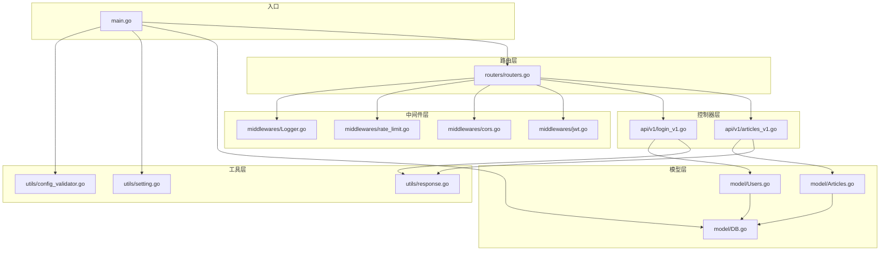
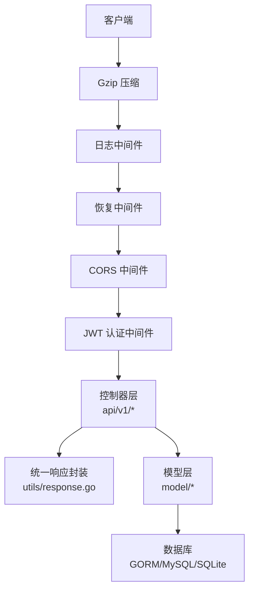
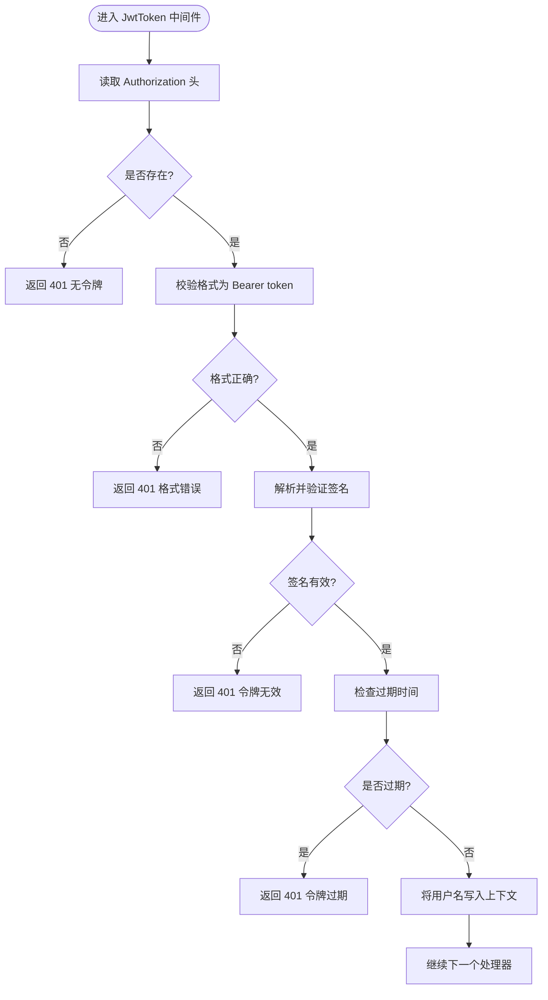
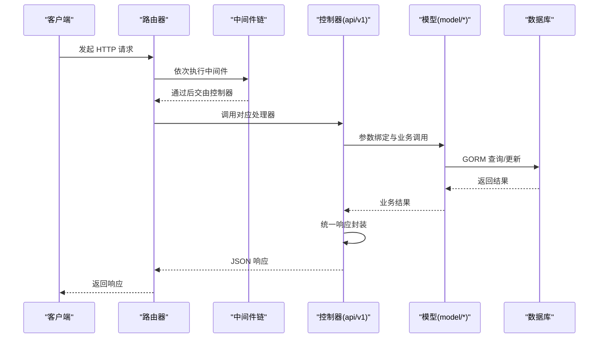
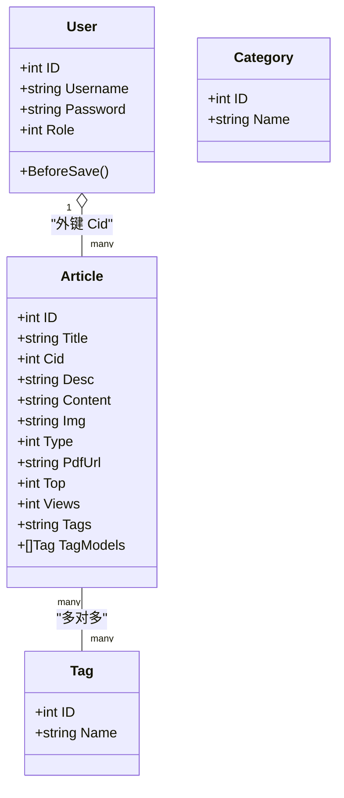
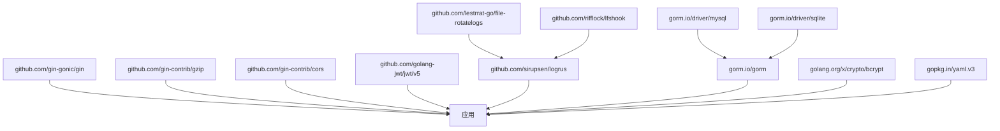

# 后端架构

<cite>
**本文引用的文件**
- [main.go](file://main.go)
- [routers.go](file://routers/routers.go)
- [DB.go](file://model/DB.go)
- [jwt.go](file://middlewares/jwt.go)
- [cors.go](file://middlewares/cors.go)
- [Logger.go](file://middlewares/Logger.go)
- [rate_limit.go](file://middlewares/rate_limit.go)
- [login_v1.go](file://api/v1/login_v1.go)
- [articles_v1.go](file://api/v1/articles_v1.go)
- [Users.go](file://model/Users.go)
- [Articles.go](file://model/Articles.go)
- [response.go](file://utils/response.go)
- [setting.go](file://utils/setting.go)
- [config_validator.go](file://utils/config_validator.go)
- [go.mod](file://go.mod)
</cite>

## 目录
1. [简介](#简介)
2. [项目结构](#项目结构)
3. [核心组件](#核心组件)
4. [架构总览](#架构总览)
5. [组件详解](#组件详解)
6. [依赖关系分析](#依赖关系分析)
7. [性能考量](#性能考量)
8. [故障排查指南](#故障排查指南)
9. [结论](#结论)
10. [附录](#附录)

## 简介
本文件为 YanBlog 后端架构文档，围绕基于 Gin 框架的三层架构展开：路由层、中间件层、控制器层。重点阐述中间件模式如何实现横切关注点（JWT 认证、CORS 跨域、日志记录、限流控制），控制器层如何组织业务逻辑与数据访问，以及数据库连接管理与 GORM ORM 的使用模式。文档同时提供架构图与请求处理流程图，并给出中间件执行顺序与请求生命周期的详细说明，帮助后端开发者快速理解与扩展系统。

## 项目结构
后端采用按层次与功能分层的组织方式：
- 入口程序：main.go 负责配置校验、JWT 密钥刷新、数据库初始化与路由初始化。
- 路由层：routers/routers.go 定义全局中间件链与路由分组，按权限与功能划分接口。
- 控制器层：api/v1 下按资源划分接口实现，负责参数绑定、调用模型层与统一响应。
- 中间件层：middlewares 下实现认证、跨域、日志、限流等横切能力。
- 模型层：model 下定义实体与数据访问方法，封装 GORM 操作与业务规则。
- 工具层：utils 下提供配置加载、响应封装、分页解析、错误码等通用能力。
- 依赖声明：go.mod 明确外部库版本与约束。

图表来源
- [main.go:12-31](file://main.go#L12-L31)
- [routers.go:13-122](file://routers/routers.go#L13-L122)
- [DB.go:26-79](file://model/DB.go#L26-L79)
- [jwt.go:100-157](file://middlewares/jwt.go#L100-L157)
- [cors.go:14-40](file://middlewares/cors.go#L14-L40)
- [Logger.go:15-103](file://middlewares/Logger.go#L15-L103)
- [rate_limit.go:50-98](file://middlewares/rate_limit.go#L50-L98)
- [login_v1.go:13-59](file://api/v1/login_v1.go#L13-L59)
- [articles_v1.go:18-273](file://api/v1/articles_v1.go#L18-L273)
- [Users.go:11-245](file://model/Users.go#L11-L245)
- [Articles.go:11-389](file://model/Articles.go#L11-L389)
- [response.go:17-100](file://utils/response.go#L17-L100)
- [setting.go:14-171](file://utils/setting.go#L14-L171)
- [config_validator.go:11-101](file://utils/config_validator.go#L11-L101)

章节来源
- [main.go:12-31](file://main.go#L12-L31)
- [routers.go:13-122](file://routers/routers.go#L13-L122)
- [go.mod:1-72](file://go.mod#L1-L72)

## 核心组件
- 路由器初始化：设置运行模式、注册全局中间件链、静态资源服务、路由分组与具体接口绑定。
- 中间件体系：日志、恢复、Gzip 压缩、CORS、JWT 认证与管理员鉴权、登录限流。
- 控制器层：按资源拆分（用户、文章、文件、配置等），统一参数解析与响应封装。
- 模型层：GORM 实体与数据访问方法，含迁移、权限过滤、关联更新、分页与聚合查询。
- 工具层：配置加载与校验、响应封装、分页解析、错误码与启动信息打印。

章节来源
- [routers.go:13-122](file://routers/routers.go#L13-L122)
- [jwt.go:100-157](file://middlewares/jwt.go#L100-L157)
- [cors.go:14-40](file://middlewares/cors.go#L14-L40)
- [Logger.go:15-103](file://middlewares/Logger.go#L15-L103)
- [rate_limit.go:50-98](file://middlewares/rate_limit.go#L50-L98)
- [login_v1.go:13-59](file://api/v1/login_v1.go#L13-L59)
- [articles_v1.go:18-273](file://api/v1/articles_v1.go#L18-L273)
- [Users.go:11-245](file://model/Users.go#L11-L245)
- [Articles.go:11-389](file://model/Articles.go#L11-L389)
- [response.go:17-100](file://utils/response.go#L17-L100)
- [setting.go:14-171](file://utils/setting.go#L14-L171)
- [config_validator.go:11-101](file://utils/config_validator.go#L11-L101)

## 架构总览
下图展示从客户端到控制器、再到模型层与数据库的整体交互路径，以及中间件在请求生命周期中的位置与作用。

图表来源
- [routers.go:17-24](file://routers/routers.go#L17-L24)
- [Logger.go:15-103](file://middlewares/Logger.go#L15-L103)
- [cors.go:14-40](file://middlewares/cors.go#L14-L40)
- [jwt.go:100-157](file://middlewares/jwt.go#L100-L157)
- [response.go:17-100](file://utils/response.go#L17-L100)
- [DB.go:26-79](file://model/DB.go#L26-L79)

## 组件详解

### 路由层（Routers）
- 全局中间件链：日志、恢复、Gzip、CORS。
- 静态资源：上传目录、前端静态资源、图标字体、Favicon、前端配置。
- 路由分组：
  - 公共组：无需认证的公开接口（登录、文章查询、天气、健康检查、站点地图等）。
  - 认证组：需 JWT 认证的用户相关接口。
  - 管理员组：在认证基础上进一步要求管理员权限。
- 登录接口：使用登录限流中间件保护暴力破解风险。

章节来源
- [routers.go:13-122](file://routers/routers.go#L13-L122)

### 中间件层（Middlewares）

#### JWT 认证中间件
- 作用：从 Authorization 请求头解析 Bearer Token，校验签名与过期时间，将用户名注入上下文。
- 管理员鉴权：基于用户角色判断是否具备管理员权限。
- 密钥刷新：配置重载后刷新内存中的 JWT 密钥，保证一致性。

图表来源
- [jwt.go:100-157](file://middlewares/jwt.go#L100-L157)

章节来源
- [jwt.go:100-157](file://middlewares/jwt.go#L100-L157)

#### CORS 跨域中间件
- 根据配置决定 AllowAllOrigins 或显式 AllowOrigins。
- 支持常用方法与头部，暴露必要响应头，设置缓存时长。

章节来源
- [cors.go:14-40](file://middlewares/cors.go#L14-L40)

#### 日志中间件
- 支持日志轮转与按级别落盘，记录请求耗时、状态码、客户端 IP、User-Agent、数据大小等。
- 错误收集与分级输出。

章节来源
- [Logger.go:15-103](file://middlewares/Logger.go#L15-L103)

#### 登录限流中间件
- 基于内存的滑动窗口计数器，支持封禁期与重置逻辑。
- 防止暴力破解，提升登录安全性。

章节来源
- [rate_limit.go:50-98](file://middlewares/rate_limit.go#L50-L98)

### 控制器层（API v1）
- 统一参数绑定与错误处理，调用模型层完成业务操作。
- 使用统一响应封装，保证前后端一致的响应结构。

图表来源
- [routers.go:13-122](file://routers/routers.go#L13-L122)
- [login_v1.go:13-59](file://api/v1/login_v1.go#L13-L59)
- [articles_v1.go:18-273](file://api/v1/articles_v1.go#L18-L273)
- [response.go:17-100](file://utils/response.go#L17-L100)
- [DB.go:26-79](file://model/DB.go#L26-L79)

章节来源
- [login_v1.go:13-59](file://api/v1/login_v1.go#L13-L59)
- [articles_v1.go:18-273](file://api/v1/articles_v1.go#L18-L273)
- [response.go:17-100](file://utils/response.go#L17-L100)

### 模型层（Model）
- 数据库初始化：支持 MySQL 与 SQLite，自动迁移与连接池配置。
- 用户模型：包含角色过滤、密码加密（bcrypt）、登录校验。
- 文章模型：标签解析与关联更新、热门/置顶/归档/相邻文章等查询。
- 通用能力：分页查询、聚合统计、随机查询、站点地图数据准备。

图表来源
- [Users.go:11-245](file://model/Users.go#L11-L245)
- [Articles.go:11-389](file://model/Articles.go#L11-L389)

章节来源
- [DB.go:26-79](file://model/DB.go#L26-L79)
- [Users.go:11-245](file://model/Users.go#L11-L245)
- [Articles.go:11-389](file://model/Articles.go#L11-L389)

### 工具层（Utils）
- 配置加载与校验：支持环境变量替换、默认模板回退、启动信息打印、JWT 密钥生成与刷新。
- 统一响应：Success/SuccessWithTotal/Error/ErrorWithMessage/BadRequest/NotFound 等。
- 分页解析：解析 pagesize/pagenum，限制最大页大小，支持“查询全部”模式。

章节来源
- [setting.go:14-171](file://utils/setting.go#L14-L171)
- [config_validator.go:11-101](file://utils/config_validator.go#L11-L101)
- [response.go:17-100](file://utils/response.go#L17-L100)

## 依赖关系分析
- Gin 生态：Gzip、CORS、Recovery。
- JWT：golang-jwt/jwt/v5。
- 日志：logrus + file-rotatelogs + lfshook。
- 数据库：GORM + mysql/sqlite 驱动。
- 加密：bcrypt。
- YAML：gopkg.in/yaml.v3。

图表来源
- [go.mod:5-19](file://go.mod#L5-L19)

章节来源
- [go.mod:1-72](file://go.mod#L1-L72)

## 性能考量
- 数据库连接池：最大空闲连接、最大打开连接、连接最大存活时间，降低连接抖动。
- 自动迁移与事务：跳过默认事务、关闭外键约束迁移，加速初始化。
- 查询优化：分页先 Count 再 Find，Preload 关联加载，避免 N+1。
- 压缩传输：Gzip 压缩减少带宽占用。
- 日志分级：区分错误/警告/信息，避免过多 I/O。
- 限流策略：登录接口限流，防止暴力破解。

章节来源
- [DB.go:41-47](file://model/DB.go#L41-L47)
- [DB.go:94-101](file://model/DB.go#L94-L101)
- [routers.go:17-24](file://routers/routers.go#L17-L24)
- [Logger.go:15-103](file://middlewares/Logger.go#L15-L103)
- [rate_limit.go:50-98](file://middlewares/rate_limit.go#L50-L98)

## 故障排查指南
- 配置问题：使用配置校验工具定位数据库、JWT、端口等关键项；若未设置 JWT 密钥会生成临时密钥并提示。
- 数据库连接：MySQL 初始化包含重试机制与 Ping 校验；SQLite 自动创建目录与文件。
- 登录失败：检查用户名/密码、角色权限、JWT 令牌有效性与过期时间。
- 跨域问题：确认 CORS 配置与运行模式，开发模式允许所有来源。
- 日志异常：检查日志轮转初始化失败回退至标准输出的情况。

章节来源
- [config_validator.go:11-101](file://utils/config_validator.go#L11-L101)
- [DB.go:81-122](file://model/DB.go#L81-L122)
- [DB.go:124-159](file://model/DB.go#L124-L159)
- [jwt.go:100-157](file://middlewares/jwt.go#L100-L157)
- [cors.go:14-40](file://middlewares/cors.go#L14-L40)
- [Logger.go:15-103](file://middlewares/Logger.go#L15-L103)

## 结论
YanBlog 后端以 Gin 为核心，通过清晰的三层架构与完善的中间件体系，实现了认证、跨域、日志、限流等横切能力；控制器层专注于业务编排与统一响应，模型层封装数据访问与业务规则，工具层提供配置与通用能力。整体设计兼顾易用性与可扩展性，适合在生产环境中部署与演进。

## 附录

### 请求生命周期与中间件执行顺序
- 全局中间件顺序：日志 -> 恢复 -> Gzip -> CORS -> JWT（认证组/管理员组）。
- 控制器处理完成后统一响应封装。
- 静态资源优先匹配，随后进入路由分组匹配。

章节来源
- [routers.go:17-24](file://routers/routers.go#L17-L24)
- [routers.go:94-122](file://routers/routers.go#L94-L122)