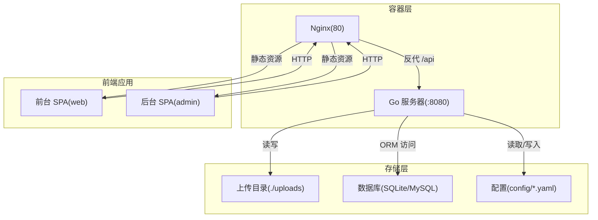
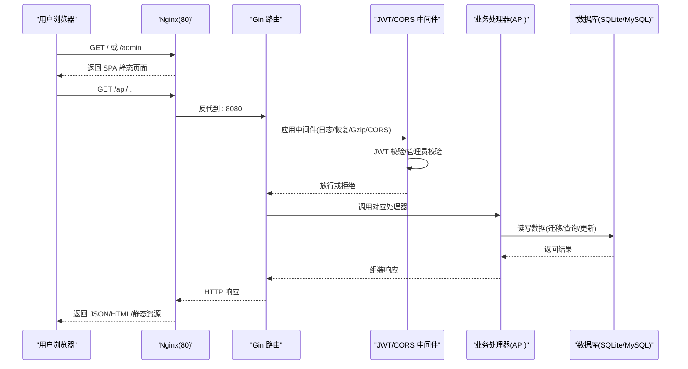
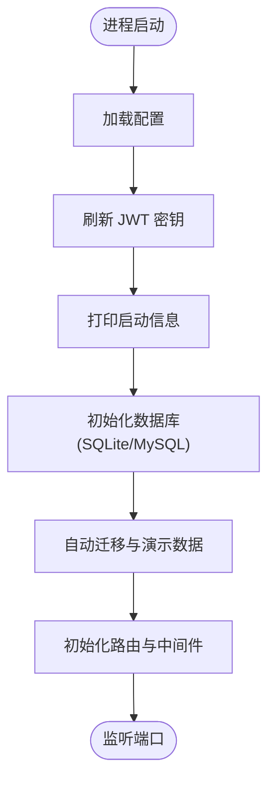
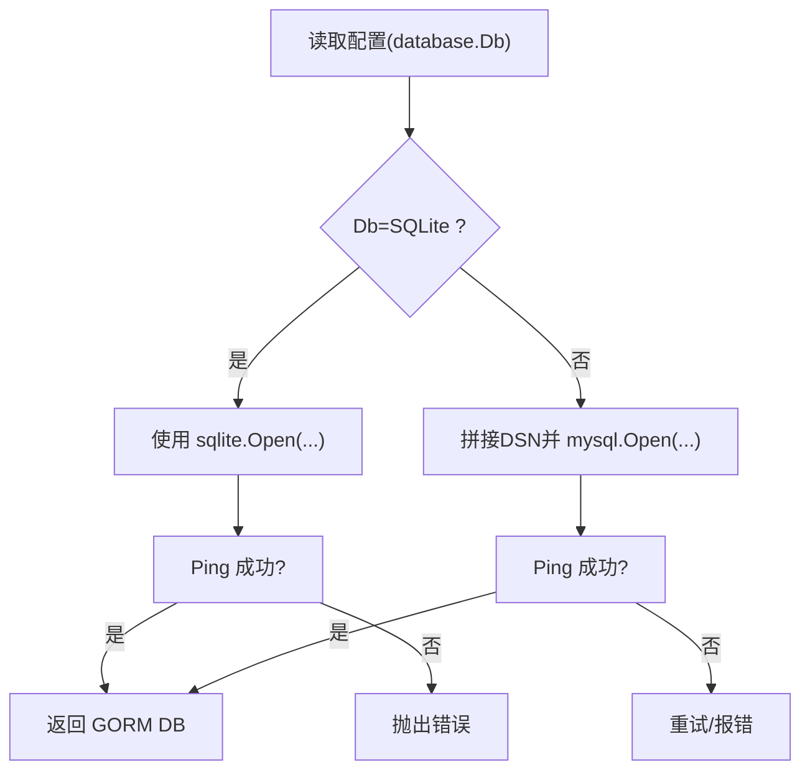
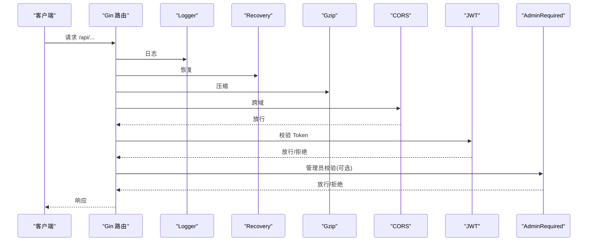
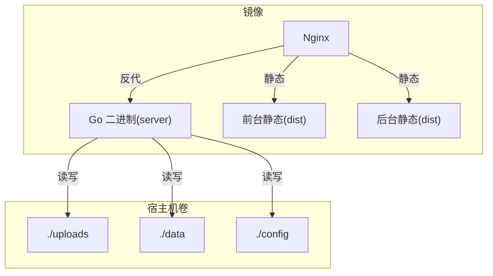

# 技术栈选型

<cite>
**本文引用的文件**
- [main.go](file://main.go)
- [go.mod](file://go.mod)
- [README.md](file://README.md)
- [routers.go](file://routers/routers.go)
- [DB.go](file://model/DB.go)
- [jwt.go](file://middlewares/jwt.go)
- [cors.go](file://middlewares/cors.go)
- [docker-compose.yaml](file://docker-compose.yaml)
- [Dockerfile](file://Dockerfile)
- [nginx.conf.unified](file://nginx.conf.unified)
- [config_template.yaml](file://config/config_template.yaml)
- [frontend/package.json](file://web/frontend/package.json)
- [backend/package.json](file://web/backend/package.json)
- [frontend/vite.config.ts](file://web/frontend/vite.config.ts)
- [backend/vite.config.ts](file://web/backend/vite.config.ts)
</cite>

## 目录
1. [引言](#引言)
2. [项目结构](#项目结构)
3. [核心组件](#核心组件)
4. [架构总览](#架构总览)
5. [详细组件分析](#详细组件分析)
6. [依赖分析](#依赖分析)
7. [性能考虑](#性能考虑)
8. [故障排查指南](#故障排查指南)
9. [结论](#结论)
10. [附录](#附录)

## 引言
本文件面向技术决策者与架构师，系统阐述 YanBlog 的技术栈选型与实施依据，涵盖后端（Go + Gin）、前端（Vue 3 + TypeScript）、数据库（MySQL/SQLite）、中间件（JWT/CORS/Gzip/限流）、容器化（Docker + Nginx）等关键环节，并提供版本兼容性与升级路径建议。

## 项目结构
YanBlog 采用前后端分离架构：Go + Gin 提供后端 API 与静态资源服务；Nginx 作为统一入口反向代理与静态资源分发；Vue 3 + TypeScript 构建前台与后台两个独立 SPA 应用；GORM 实现 ORM 与多数据库驱动；Docker Compose 将三者编排为统一镜像并持久化数据与配置。

图表来源
- [Dockerfile:26-89](file://Dockerfile#L26-L89)
- [nginx.conf.unified:1-43](file://nginx.conf.unified#L1-L43)
- [routers.go:13-122](file://routers/routers.go#L13-L122)
- [docker-compose.yaml:1-16](file://docker-compose.yaml#L1-L16)

章节来源
- [README.md:58-74](file://README.md#L58-L74)
- [Dockerfile:1-89](file://Dockerfile#L1-L89)
- [docker-compose.yaml:1-16](file://docker-compose.yaml#L1-L16)

## 核心组件
- 后端框架：Go + Gin + GORM
  - Gin 提供高性能 HTTP 路由与中间件生态；GORM 提供跨数据库 ORM 支持与迁移能力。
- 前端框架：Vue 3 + TypeScript + Vite
  - 前台与后台分别构建为独立 SPA，共享公共组件与工具链。
- 数据库：SQLite（开发）/ MySQL（生产）
  - 通过配置动态切换，支持自动迁移与初始化演示数据。
- 中间件：JWT 认证、CORS、Gzip 压缩、登录限流
  - 统一在路由层注册，保障安全与性能。
- 容器化：Docker 多阶段构建 + Nginx 统一入口
  - 前后端产物与静态资源由 Nginx 提供，Go 服务负责 API 与静态文件映射。

章节来源
- [README.md:36-46](file://README.md#L36-L46)
- [go.mod:5-19](file://go.mod#L5-L19)
- [frontend/package.json:16-30](file://web/frontend/package.json#L16-L30)
- [backend/package.json:20-35](file://web/backend/package.json#L20-L35)

## 架构总览
下图展示从浏览器到后端服务的典型请求路径，包括鉴权、反向代理、静态资源与 API 调用。

图表来源
- [nginx.conf.unified:14-21](file://nginx.conf.unified#L14-L21)
- [routers.go:13-122](file://routers/routers.go#L13-L122)
- [jwt.go:98-157](file://middlewares/jwt.go#L98-L157)
- [cors.go:14-40](file://middlewares/cors.go#L14-L40)
- [DB.go:26-79](file://model/DB.go#L26-L79)

## 详细组件分析

### 后端技术栈：Go + Gin + GORM
- 优势
  - 高并发与低延迟：Gin 为高性能 Web 框架；GORM 提供简洁 ORM。
  - 多数据库支持：通过驱动切换实现 SQLite/MySQL 平滑迁移。
  - 配置即插即用：启动时加载配置、刷新 JWT 密钥、打印启动信息。
- 适用场景
  - 需要稳定、可维护的 API 层与静态资源服务；对部署一致性与可观测性有要求。
- 关键实现要点
  - 路由初始化与中间件注册：统一设置运行模式、内存限制、静态资源、Gzip 压缩与 CORS。
  - 数据库初始化：按配置选择驱动，设置连接池参数，执行自动迁移与演示数据初始化。
  - 配置校验与热更新：启动前校验配置，JWT 密钥可在配置重载后刷新。

图表来源
- [main.go:12-31](file://main.go#L12-L31)
- [routers.go:13-122](file://routers/routers.go#L13-L122)
- [DB.go:26-79](file://model/DB.go#L26-L79)

章节来源
- [main.go:12-31](file://main.go#L12-L31)
- [routers.go:13-122](file://routers/routers.go#L13-L122)
- [DB.go:26-79](file://model/DB.go#L26-L79)

### 前端技术栈：Vue 3 + TypeScript + Vite
- 选型考量
  - 类型安全：TypeScript 提升大型前端项目的可维护性。
  - 开发体验：Vite 提供快速冷启动与热更新；Element Plus 提供丰富的管理端组件库。
  - 双 SPA 架构：前台与后台独立构建，便于权限隔离与差异化功能扩展。
- 关键实现要点
  - 前端与后台各自维护独立的 package.json 与 vite.config.ts，分别配置代理、别名与开发服务器。
  - 前端在开发时从 public/config.yaml 读取 allowed_hosts，增强跨域与开发调试灵活性。

章节来源
- [frontend/package.json:16-44](file://web/frontend/package.json#L16-L44)
- [backend/package.json:20-62](file://web/backend/package.json#L20-L62)
- [frontend/vite.config.ts:10-56](file://web/frontend/vite.config.ts#L10-L56)
- [backend/vite.config.ts:10-74](file://web/backend/vite.config.ts#L10-L74)

### 数据库选型：MySQL 与 SQLite
- 选型原因
  - SQLite：开发与轻量部署首选，零配置、文件即库，适合单机与演示场景。
  - MySQL：生产推荐，具备更强的并发与运维能力，配合容器编排更易扩展。
- 配置与初始化
  - 通过配置文件中的 database.Db 字段动态选择驱动；初始化时设置连接池与自动迁移。
  - 首次运行自动创建演示文章与默认管理员账号（开发环境提示修改密码）。

图表来源
- [DB.go:29-159](file://model/DB.go#L29-L159)
- [config_template.yaml:11-18](file://config/config_template.yaml#L11-L18)

章节来源
- [DB.go:26-79](file://model/DB.go#L26-L79)
- [config_template.yaml:11-18](file://config/config_template.yaml#L11-L18)

### 中间件技术栈：JWT、CORS、Gzip、限流
- JWT 认证
  - 生成与校验 Token，设置过期时间；在路由层拦截并注入用户上下文。
  - 管理员权限中间件基于用户角色进行二次校验。
- CORS
  - 根据运行模式与配置决定 AllowAllOrigins；生产环境严格限定 SiteUrl。
- Gzip 压缩
  - 在路由层启用 gzip 中间件，降低传输体积。
- 登录限流
  - 登录接口使用限流中间件，防止暴力破解。

图表来源
- [routers.go:17-25](file://routers/routers.go#L17-L25)
- [jwt.go:98-157](file://middlewares/jwt.go#L98-L157)
- [cors.go:14-40](file://middlewares/cors.go#L14-L40)

章节来源
- [jwt.go:15-157](file://middlewares/jwt.go#L15-L157)
- [cors.go:14-40](file://middlewares/cors.go#L14-L40)
- [routers.go:13-122](file://routers/routers.go#L13-L122)

### 容器化部署：Docker + Nginx
- 多阶段构建
  - Go 后端、前端（前台）、前端（后台）分别构建，最终合并至 Nginx 镜像。
- 统一入口
  - Nginx 监听 80 端口，/admin 指向前台管理 SPA，/api 反代至 Go 服务，静态资源直出。
- 持久化与挂载
  - uploads、data、config 挂载到宿主机，实现文件、数据库与配置的持久化与热更新。
- 启动流程
  - 首次运行自动从模板初始化配置；先启动 Nginx，再启动 Go 服务。

图表来源
- [Dockerfile:1-89](file://Dockerfile#L1-L89)
- [docker-compose.yaml:1-16](file://docker-compose.yaml#L1-L16)
- [nginx.conf.unified:1-43](file://nginx.conf.unified#L1-L43)

章节来源
- [Dockerfile:1-89](file://Dockerfile#L1-L89)
- [docker-compose.yaml:1-16](file://docker-compose.yaml#L1-L16)
- [nginx.conf.unified:1-43](file://nginx.conf.unified#L1-L43)

## 依赖分析
- 后端依赖
  - Gin 生态：Gzip、CORS；JWT：golang-jwt；日志：logrus、lfshook；数据库：GORM + mysql/sqlite 驱动。
- 前端依赖
  - Vue 3 + Router + Pinia；Element Plus；Markdown 渲染（marked/KaTeX/Mermaid/highlight.js）；Axios；Vite/TypeScript 生态。
- 版本与兼容性
  - Go: 1.24；Node: ^20.19.0 或 >=22.12.0；Vue 3.5.x；Gin 1.11.x；GORM 1.30.x；MySQL 驱动 1.8.1；SQLite 驱动 1.14.22。

章节来源
- [go.mod:3-19](file://go.mod#L3-L19)
- [frontend/package.json:6-8](file://web/frontend/package.json#L6-L8)
- [backend/package.json:6-8](file://web/backend/package.json#L6-L8)

## 性能考虑
- 网络与传输
  - 启用 Gzip 压缩减少响应体积；Nginx 作为静态资源与反向代理入口，提升缓存与并发能力。
- 数据库
  - 设置连接池最大空闲/活跃连接数与生命周期，避免连接抖动；SQLite 适合小规模并发，MySQL 更适合高并发。
- 应用层
  - Gin 路由中间件顺序影响性能与安全性，建议将高频短路逻辑（如限流）置于靠前位置。
- 前端
  - Vite 开发服务器开启代理与 allowed_hosts，减少跨域与网络错误带来的调试成本。

## 故障排查指南
- 启动失败（配置错误）
  - 现象：启动时报错并退出。
  - 排查：检查 config/backend/config.yaml 是否存在且包含必需字段（JwtKey、数据库配置）。
- 数据库连接失败
  - 现象：初始化数据库时提示连接错误。
  - 排查：确认数据库类型、主机、端口、凭据与数据库名；MySQL 需等待容器启动完成后再重试。
- JWT 校验失败
  - 现象：接口返回未授权。
  - 排查：确认 Authorization 头格式为 Bearer Token；核对 JwtKey 是否一致；检查 Token 是否过期。
- CORS 跨域问题
  - 现象：浏览器控制台出现跨域错误。
  - 排查：确认 Server.AppMode 与 SiteUrl 配置；开发模式允许所有来源，生产需明确允许域名。
- 上传/静态资源访问异常
  - 现象：/uploads 或静态资源 404。
  - 排查：确认 Nginx 静态映射与 Go 侧 Static 路由；检查卷挂载路径与权限。

章节来源
- [main.go:14-18](file://main.go#L14-L18)
- [DB.go:81-122](file://model/DB.go#L81-L122)
- [jwt.go:100-157](file://middlewares/jwt.go#L100-L157)
- [cors.go:17-38](file://middlewares/cors.go#L17-L38)
- [nginx.conf.unified:29-33](file://nginx.conf.unified#L29-L33)

## 结论
YanBlog 的技术栈围绕“高性能后端 + 清晰前后端分离 + 可移植容器化”展开：Go + Gin 提供稳定 API 与静态服务能力；Vue 3 + TypeScript 确保前端工程化与可维护性；GORM 与多数据库驱动满足开发与生产的差异化需求；Nginx 作为统一入口简化部署与运维。该选型适合中小型团队快速交付与迭代，同时具备良好的扩展性与可观测性。

## 附录

### 技术栈对比与替代方案
- 后端框架
  - 对比：与 Echo、Fiber、Beego 等相比，Gin 在生态与社区成熟度上更具优势；对微服务场景可考虑 Chi 或自研轻量路由。
  - 替代：若追求更高性能与更低 GC 压力，可评估 Go 原生 net/http + 自定义中间件组合。
- 前端框架
  - 对比：React/Vue 3 在生态与学习曲线方面各有侧重；TypeScript 与 Vite 组合在大型项目中收益明显。
  - 替代：SvelteKit、Nuxt 3 等可降低 SPA 的首屏与 SEO 成本，但需评估迁移成本。
- 数据库
  - 对比：PostgreSQL 在复杂查询与扩展性上更优；SQLite 在嵌入式与单机场景无可替代。
  - 替代：TiDB/ClickHouse 适用于特定场景（分布式/OLAP），但会增加运维复杂度。
- 中间件
  - 对比：Negroni 生态较弱；Gin 中间件生态完善；CORS 也可用其他库替换。
  - 替代：Opa/Istio 等可提供细粒度策略与可观测性，但会引入额外复杂度。
- 容器化
  - 对比：Kubernetes 提供弹性与多副本管理；Docker Compose 更适合单机与演示。
  - 替代：Podman/Docker Desktop 互换；Nginx 可替换为 Caddy/Traefik，但需调整配置。

### 版本兼容性与升级路径
- Go 与模块
  - 当前 Go 版本为 1.24；升级时优先保证 go.mod 与第三方依赖兼容，关注 Gin/GORM 的破坏性变更。
- Node 与前端
  - Node 版本范围：^20.19.0 或 >=22.12.0；升级 Node 时同步升级 Vite、Vue 与相关插件。
- 数据库驱动
  - MySQL 驱动 1.8.1 与 SQLite 驱动 1.14.22；升级时注意 SQL 语法差异与驱动 API 变更。
- 前后端依赖
  - 建议采用语义化版本与锁定文件；升级前先在测试环境验证兼容性。

章节来源
- [go.mod:3-19](file://go.mod#L3-L19)
- [frontend/package.json:6-8](file://web/frontend/package.json#L6-L8)
- [backend/package.json:6-8](file://web/backend/package.json#L6-L8)