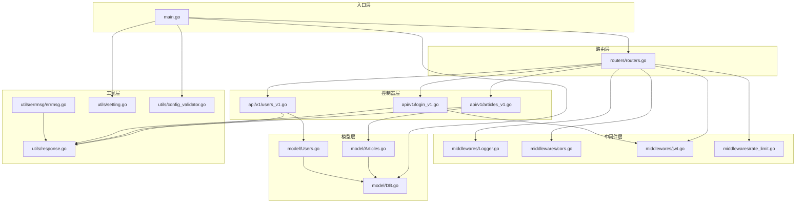
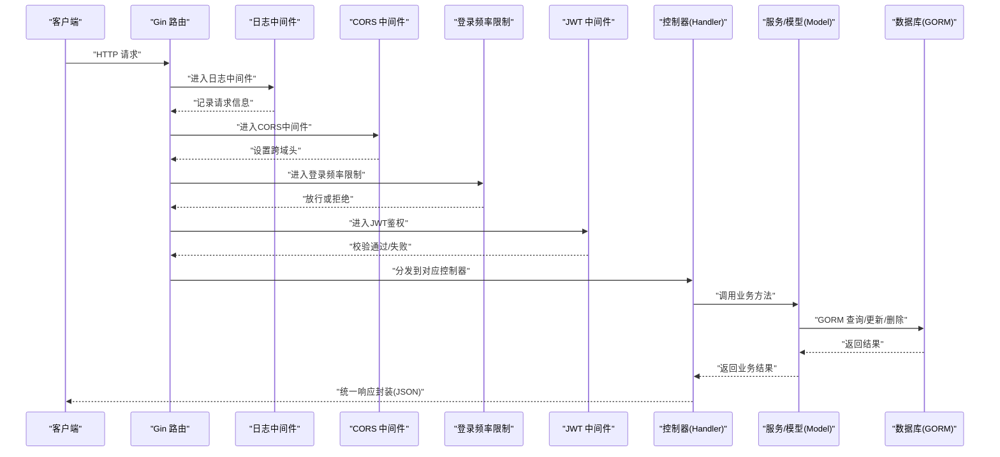
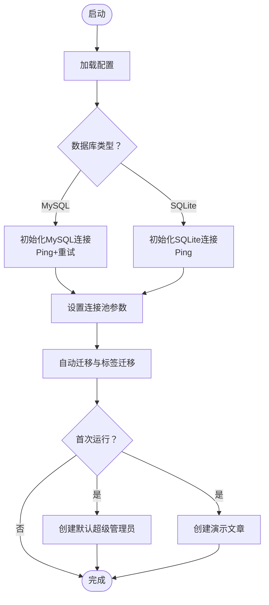
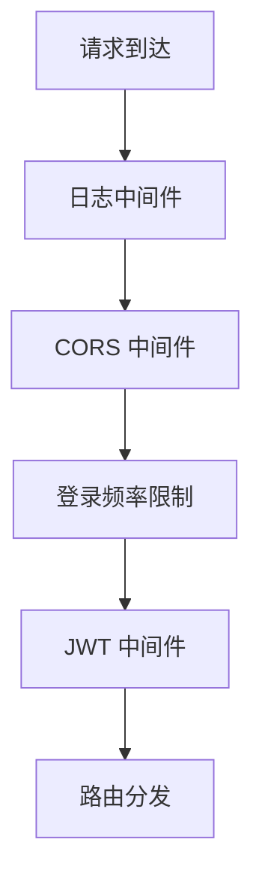
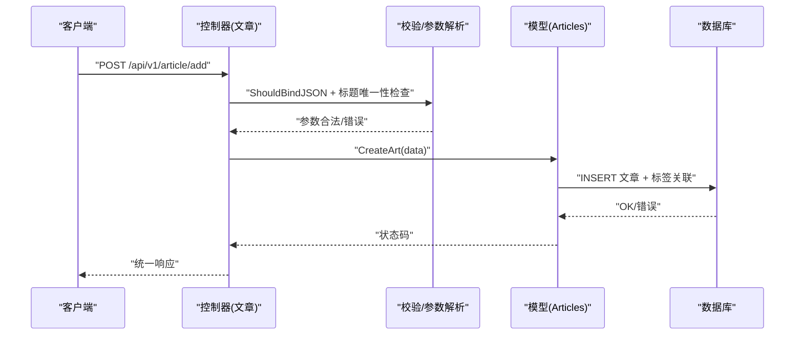
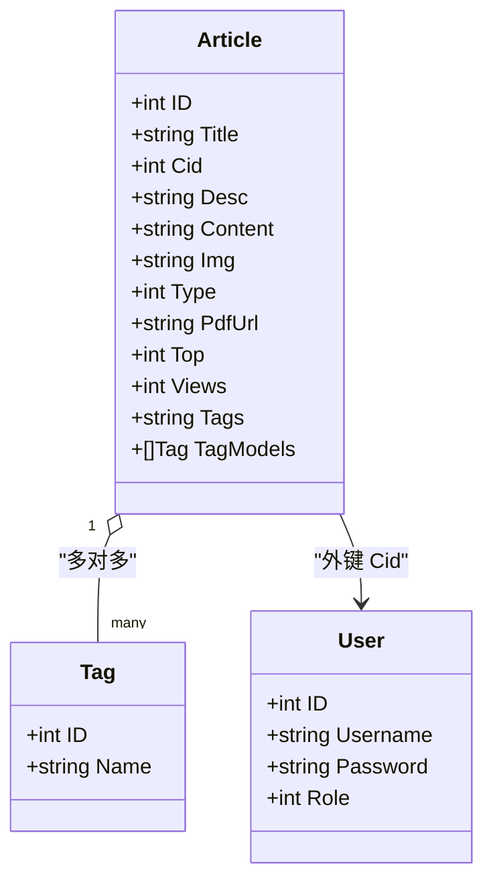
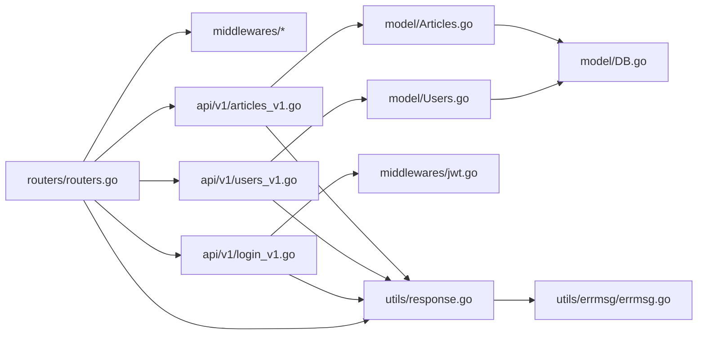
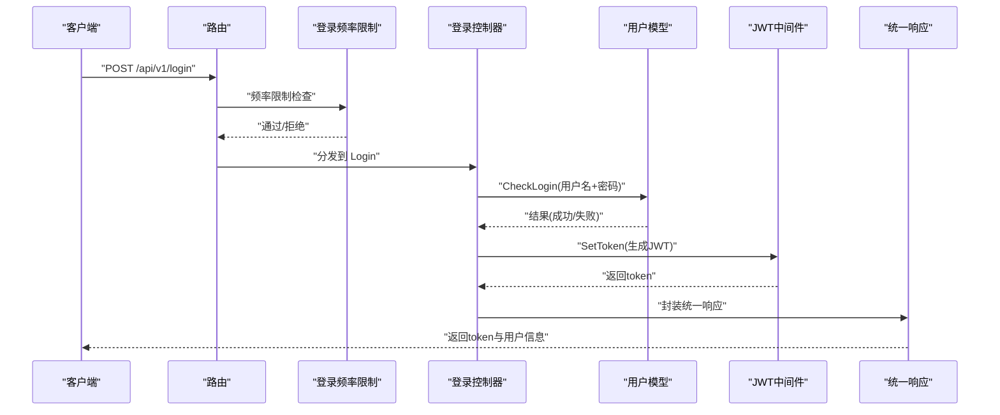

# 数据流设计

<cite>
**本文引用的文件**
- [main.go](file://main.go)
- [routers.go](file://routers/routers.go)
- [DB.go](file://model/DB.go)
- [Logger.go](file://middlewares/Logger.go)
- [cors.go](file://middlewares/cors.go)
- [jwt.go](file://middlewares/jwt.go)
- [articles_v1.go](file://api/v1/articles_v1.go)
- [users_v1.go](file://api/v1/users_v1.go)
- [Articles.go](file://model/Articles.go)
- [Users.go](file://model/Users.go)
- [response.go](file://utils/response.go)
- [errmsg.go](file://utils/errmsg/errmsg.go)
- [rate_limit.go](file://middlewares/rate_limit.go)
- [login_v1.go](file://api/v1/login_v1.go)
- [setting.go](file://utils/setting.go)
- [config_validator.go](file://utils/config_validator.go)
</cite>

## 目录
1. [简介](#简介)
2. [项目结构](#项目结构)
3. [核心组件](#核心组件)
4. [架构总览](#架构总览)
5. [详细组件分析](#详细组件分析)
6. [依赖分析](#依赖分析)
7. [性能考量](#性能考量)
8. [故障排查指南](#故障排查指南)
9. [结论](#结论)
10. [附录](#附录)

## 简介
本文件为 YanBlog 的数据流设计文档，聚焦“从用户请求到数据库操作”的完整数据流转路径，系统性阐述 API 层如何接收请求、中间件如何处理请求、控制器如何调用业务逻辑、模型层如何进行数据持久化。同时覆盖数据库连接池管理、事务处理与查询优化策略、缓存与数据同步策略、错误处理与异常恢复机制，并提供数据流图与时序图，帮助全栈开发者建立对系统数据处理的完整视图与性能优化建议。

## 项目结构
YanBlog 采用典型的 Go-Gin 分层架构：
- 入口层：main.go 负责配置校验、JWT 密钥刷新、数据库初始化与路由初始化
- 路由层：routers/routers.go 定义路由、中间件链与静态资源服务
- 中间件层：日志、CORS、JWT、速率限制等
- 控制器层：api/v1 下按功能模块划分（如文章、用户、登录等）
- 模型层：model 下定义实体与数据访问方法（含 GORM 操作与迁移）
- 工具层：utils 提供统一响应、错误码、配置加载与校验等

图表来源
- [main.go:12-31](file://main.go#L12-L31)
- [routers.go:13-122](file://routers/routers.go#L13-L122)
- [DB.go:26-79](file://model/DB.go#L26-L79)
- [Logger.go:18-102](file://middlewares/Logger.go#L18-L102)
- [cors.go:16-39](file://middlewares/cors.go#L16-L39)
- [jwt.go:100-157](file://middlewares/jwt.go#L100-L157)
- [rate_limit.go:50-97](file://middlewares/rate_limit.go#L50-L97)
- [articles_v1.go:18-273](file://api/v1/articles_v1.go#L18-L273)
- [users_v1.go:15-283](file://api/v1/users_v1.go#L15-L283)
- [login_v1.go:13-59](file://api/v1/login_v1.go#L13-L59)
- [Articles.go:51-389](file://model/Articles.go#L51-L389)
- [Users.go:36-245](file://model/Users.go#L36-L245)
- [response.go:19-100](file://utils/response.go#L19-L100)
- [errmsg.go:30-57](file://utils/errmsg/errmsg.go#L30-L57)
- [setting.go:44-171](file://utils/setting.go#L44-L171)
- [config_validator.go:11-54](file://utils/config_validator.go#L11-L54)

章节来源
- [main.go:12-31](file://main.go#L12-L31)
- [routers.go:13-122](file://routers/routers.go#L13-L122)

## 核心组件
- 配置与启动
  - 配置校验与启动信息打印：负责校验数据库、JWT、端口等关键配置，必要时生成临时密钥并提示安全风险
  - 数据库初始化：根据配置选择 MySQL 或 SQLite，设置连接池参数，执行自动迁移与演示数据初始化
  - 路由初始化：设置 Gin 模式、中间件链、静态资源、分组路由与端口监听
- 中间件
  - 日志：记录请求耗时、状态码、客户端 IP、User-Agent、数据大小等，支持日志轮转
  - CORS：按环境与配置动态允许来源
  - JWT：解析 Authorization 头，校验签名、过期时间，注入用户上下文
  - 登录频率限制：基于内存的滑动窗口与封禁策略
- 控制器
  - 文章：新增、查询、搜索、置顶/热门/随机/相邻/相关文章、编辑、删除、批量删除
  - 用户：新增、查询、搜索、编辑、删除（含复杂权限控制）
  - 登录：参数绑定、登录校验、JWT 签发
- 模型
  - 文章：标签解析与关联、分页/聚合查询、归档、随机、相邻文章、站点地图数据
  - 用户：用户名唯一性检查、角色过滤、分页查询、编辑（含密码加密）、删除
- 工具
  - 统一响应：Success/SuccessWithTotal/Error/ErrorWithMessage/BadRequest/NotFound
  - 错误码：集中定义业务错误码与消息映射
  - 配置：YAML 加载、环境变量替换、保存与重载、前端配置路径解析

章节来源
- [config_validator.go:11-54](file://utils/config_validator.go#L11-L54)
- [DB.go:26-79](file://model/DB.go#L26-L79)
- [routers.go:13-122](file://routers/routers.go#L13-L122)
- [Logger.go:18-102](file://middlewares/Logger.go#L18-L102)
- [cors.go:16-39](file://middlewares/cors.go#L16-L39)
- [jwt.go:100-157](file://middlewares/jwt.go#L100-L157)
- [rate_limit.go:50-97](file://middlewares/rate_limit.go#L50-L97)
- [articles_v1.go:18-273](file://api/v1/articles_v1.go#L18-L273)
- [users_v1.go:15-283](file://api/v1/users_v1.go#L15-L283)
- [login_v1.go:13-59](file://api/v1/login_v1.go#L13-L59)
- [Articles.go:51-389](file://model/Articles.go#L51-L389)
- [Users.go:36-245](file://model/Users.go#L36-L245)
- [response.go:19-100](file://utils/response.go#L19-L100)
- [errmsg.go:30-57](file://utils/errmsg/errmsg.go#L30-L57)
- [setting.go:44-171](file://utils/setting.go#L44-L171)

## 架构总览
下图展示了从用户请求到数据库的完整数据流，涵盖中间件处理、控制器调用与模型持久化：

图表来源
- [routers.go:13-122](file://routers/routers.go#L13-L122)
- [Logger.go:62-101](file://middlewares/Logger.go#L62-L101)
- [cors.go:29-38](file://middlewares/cors.go#L29-L38)
- [rate_limit.go:50-97](file://middlewares/rate_limit.go#L50-L97)
- [jwt.go:100-157](file://middlewares/jwt.go#L100-L157)
- [articles_v1.go:18-273](file://api/v1/articles_v1.go#L18-L273)
- [users_v1.go:15-283](file://api/v1/users_v1.go#L15-L283)
- [login_v1.go:13-59](file://api/v1/login_v1.go#L13-L59)
- [Articles.go:51-389](file://model/Articles.go#L51-L389)
- [Users.go:36-245](file://model/Users.go#L36-L245)
- [response.go:19-100](file://utils/response.go#L19-L100)

## 详细组件分析

### 数据库连接与初始化
- 初始化流程
  - 依据配置选择数据库类型（MySQL/SQLite），设置 GORM 配置（命名策略、跳过默认事务等）
  - 设置连接池：最大空闲连接、最大打开连接、连接生命周期
  - 自动迁移：用户、分类、文章、标签等表；补充标签迁移逻辑
  - 首次运行：创建默认超级管理员与演示文章
- 连接池与超时
  - 通过 SQL 层设置连接池参数，保障并发与资源回收
- 事务特性
  - 默认关闭 GORM 默认事务，业务层显式控制事务边界（如批量删除）

图表来源
- [DB.go:26-79](file://model/DB.go#L26-L79)
- [DB.go:81-122](file://model/DB.go#L81-L122)
- [DB.go:124-159](file://model/DB.go#L124-L159)
- [DB.go:161-209](file://model/DB.go#L161-L209)
- [DB.go:211-239](file://model/DB.go#L211-L239)

章节来源
- [DB.go:26-79](file://model/DB.go#L26-L79)
- [DB.go:81-122](file://model/DB.go#L81-L122)
- [DB.go:124-159](file://model/DB.go#L124-L159)
- [DB.go:161-209](file://model/DB.go#L161-L209)
- [DB.go:211-239](file://model/DB.go#L211-L239)

### 中间件处理链
- 日志中间件
  - 记录请求耗时、状态码、客户端 IP、User-Agent、数据大小、错误集合
  - 支持日志轮转与按级别落盘
- CORS 中间件
  - 生产环境按配置站点 URL 白名单放行；开发模式允许所有来源
- JWT 中间件
  - 解析 Authorization 头，校验签名与过期时间，注入用户名上下文
- 登录频率限制
  - 内存计数器+滑动窗口+封禁策略，定期清理过期记录

图表来源
- [Logger.go:18-102](file://middlewares/Logger.go#L18-L102)
- [cors.go:16-39](file://middlewares/cors.go#L16-L39)
- [rate_limit.go:50-97](file://middlewares/rate_limit.go#L50-L97)
- [jwt.go:100-157](file://middlewares/jwt.go#L100-L157)

章节来源
- [Logger.go:18-102](file://middlewares/Logger.go#L18-L102)
- [cors.go:16-39](file://middlewares/cors.go#L16-L39)
- [rate_limit.go:50-97](file://middlewares/rate_limit.go#L50-L97)
- [jwt.go:100-157](file://middlewares/jwt.go#L100-L157)

### 控制器与业务逻辑
- 文章模块
  - 新增：参数绑定 → 标题唯一性检查 → 创建文章（含标签解析）
  - 查询：分页/总数分离、Preload 关联、排序与筛选
  - 热门/置顶/随机/相邻/相关：针对不同场景的查询优化
  - 编辑：标题变更时同步文件路径与内容中的占位符
  - 删除/批量删除：先清理关联标签与本地资源，再删除记录
- 用户模块
  - 新增：权限校验（超级管理员可创建管理员/普通用户；管理员仅能创建普通用户）
  - 查询/搜索：结合角色过滤与分页
  - 编辑：复杂权限规则（禁止提升/降权超级管理员；普通用户不可改角色）
  - 删除：禁止超级管理员删除自己；管理员仅能删普通用户
- 登录模块
  - 参数绑定 → 登录校验（用户名存在、密码正确、角色满足）→ 生成 JWT

图表来源
- [articles_v1.go:18-58](file://api/v1/articles_v1.go#L18-L58)
- [Articles.go:51-63](file://model/Articles.go#L51-L63)
- [response.go:19-54](file://utils/response.go#L19-L54)

章节来源
- [articles_v1.go:18-273](file://api/v1/articles_v1.go#L18-L273)
- [users_v1.go:15-283](file://api/v1/users_v1.go#L15-L283)
- [login_v1.go:13-59](file://api/v1/login_v1.go#L13-L59)
- [Articles.go:51-389](file://model/Articles.go#L51-L389)
- [Users.go:36-245](file://model/Users.go#L36-L245)
- [response.go:19-100](file://utils/response.go#L19-L100)

### 模型层与数据持久化
- 文章模型
  - 多对多标签：通过 Association 替换关联
  - 阅读量：UpdateColumn 原子递增，避免更新时间戳
  - 归档：按数据库类型选择日期格式化函数
  - 相关文章：基于标签的 OR 条件查询
- 用户模型
  - 角色过滤：applyRoleFilter 统一处理权限范围
  - 密码加密：BeforeSave 钩子与编辑时手动加密
  - 登录校验：bcrypt 对比哈希
- 事务与批量操作
  - 批量删除：循环逐条删除并统计成功/失败数

图表来源
- [Articles.go:11-25](file://model/Articles.go#L11-L25)
- [Users.go:11-17](file://model/Users.go#L11-L17)

章节来源
- [Articles.go:51-389](file://model/Articles.go#L51-L389)
- [Users.go:36-245](file://model/Users.go#L36-L245)

### 统一响应与错误码
- 统一响应
  - Success/SuccessWithTotal/Error/ErrorWithMessage/BadRequest/NotFound
  - 分页参数解析与边界控制（最大每页数量）
- 错误码
  - 集中式定义与消息映射，便于前后端一致性

章节来源
- [response.go:19-100](file://utils/response.go#L19-L100)
- [errmsg.go:30-57](file://utils/errmsg/errmsg.go#L30-L57)

### 配置与启动
- 配置加载
  - 支持环境变量替换、多路径回退、保存与重载
- 启动流程
  - 配置校验 → JWT 密钥刷新 → 打印启动信息 → 初始化数据库 → 初始化路由

章节来源
- [setting.go:44-171](file://utils/setting.go#L44-L171)
- [config_validator.go:11-54](file://utils/config_validator.go#L11-L54)
- [main.go:12-31](file://main.go#L12-L31)

## 依赖分析
- 组件耦合
  - 控制器依赖模型层与工具层；模型层依赖配置与错误码；路由依赖中间件与控制器
- 外部依赖
  - Gin、GORM、JWT、Logrus、CORS、bcrypt 等
- 循环依赖
  - 未发现直接循环依赖；通过工具层与模型层解耦

图表来源
- [routers.go:13-122](file://routers/routers.go#L13-L122)
- [articles_v1.go:18-273](file://api/v1/articles_v1.go#L18-L273)
- [users_v1.go:15-283](file://api/v1/users_v1.go#L15-L283)
- [login_v1.go:13-59](file://api/v1/login_v1.go#L13-L59)
- [Articles.go:51-389](file://model/Articles.go#L51-L389)
- [Users.go:36-245](file://model/Users.go#L36-L245)
- [DB.go:26-79](file://model/DB.go#L26-L79)
- [response.go:19-100](file://utils/response.go#L19-L100)
- [errmsg.go:30-57](file://utils/errmsg/errmsg.go#L30-L57)
- [jwt.go:100-157](file://middlewares/jwt.go#L100-L157)

章节来源
- [routers.go:13-122](file://routers/routers.go#L13-L122)
- [articles_v1.go:18-273](file://api/v1/articles_v1.go#L18-L273)
- [users_v1.go:15-283](file://api/v1/users_v1.go#L15-L283)
- [login_v1.go:13-59](file://api/v1/login_v1.go#L13-L59)
- [Articles.go:51-389](file://model/Articles.go#L51-L389)
- [Users.go:36-245](file://model/Users.go#L36-L245)
- [DB.go:26-79](file://model/DB.go#L26-L79)
- [response.go:19-100](file://utils/response.go#L19-L100)
- [errmsg.go:30-57](file://utils/errmsg/errmsg.go#L30-L57)
- [jwt.go:100-157](file://middlewares/jwt.go#L100-L157)

## 性能考量
- 查询优化
  - 分页与总数分离：先 Count 再 Limit/Offset，避免重复扫描
  - Preload 关联：按需加载，减少 N+1 查询
  - 随机与日期聚合：按数据库类型选择最优函数（RAND()/RANDOM()、DATE_FORMAT()/strftime）
- 连接池
  - 合理设置最大空闲/打开连接与生命周期，避免连接争用与泄漏
- 缓存与同步
  - 系统未实现显式缓存层；可通过外部缓存（如 Redis）在热点接口（如热门文章、站点地图）引入缓存与失效策略
- 压缩与传输
  - 启用 gzip 压缩，降低带宽占用
- 安全与稳定性
  - 登录频率限制与 JWT 过期控制，降低暴力破解与令牌滥用风险

## 故障排查指南
- 启动阶段
  - 配置校验失败：检查数据库凭据、端口、JWT 密钥长度与默认值提示
  - 数据库连接失败：确认主机可达、端口开放、凭据正确；MySQL 支持重试
- 运行阶段
  - 登录被限流：检查客户端 IP 与封禁窗口；调整策略或白名单
  - JWT 校验失败：确认 Authorization 头格式、签名密钥与过期时间
  - 文章/用户操作失败：核对权限、参数合法性与唯一性约束
- 日志定位
  - 使用日志中间件输出的请求耗时、状态码与错误集合快速定位问题

章节来源
- [config_validator.go:11-54](file://utils/config_validator.go#L11-L54)
- [DB.go:81-122](file://model/DB.go#L81-L122)
- [rate_limit.go:50-97](file://middlewares/rate_limit.go#L50-L97)
- [jwt.go:100-157](file://middlewares/jwt.go#L100-L157)
- [Logger.go:62-101](file://middlewares/Logger.go#L62-L101)

## 结论
YanBlog 的数据流设计遵循清晰的分层与职责分离：路由层统一接入，中间件层负责横切关注点，控制器层编排业务，模型层专注数据持久化。通过合理的连接池配置、查询优化与统一响应体系，系统在易维护性与性能之间取得平衡。建议在高并发场景引入外部缓存与异步任务队列，进一步提升吞吐与用户体验。

## 附录
- 典型业务场景时序图（登录）

图表来源
- [login_v1.go:13-59](file://api/v1/login_v1.go#L13-L59)
- [Users.go:214-237](file://model/Users.go#L214-L237)
- [jwt.go:27-49](file://middlewares/jwt.go#L27-L49)
- [rate_limit.go:50-97](file://middlewares/rate_limit.go#L50-L97)
- [response.go:19-54](file://utils/response.go#L19-L54)