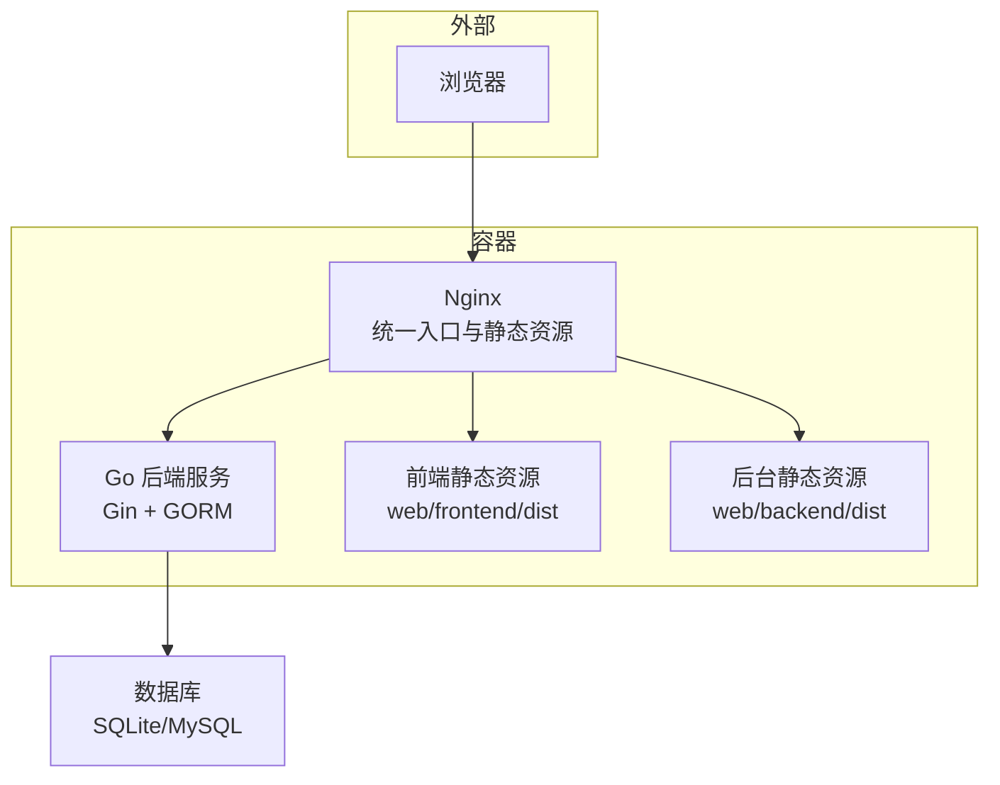
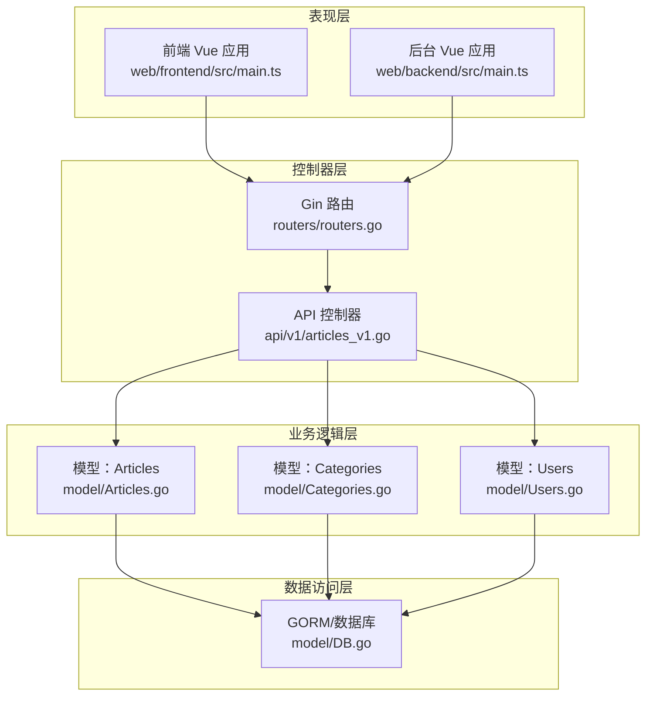
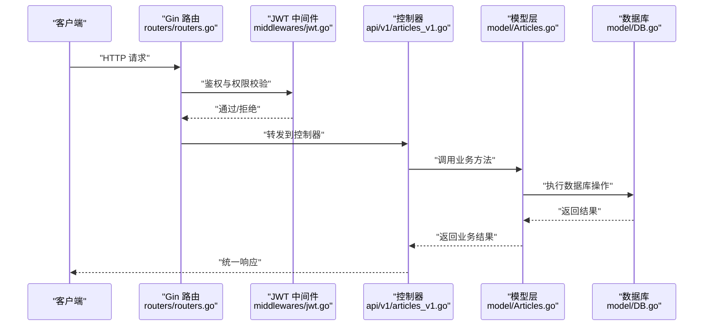
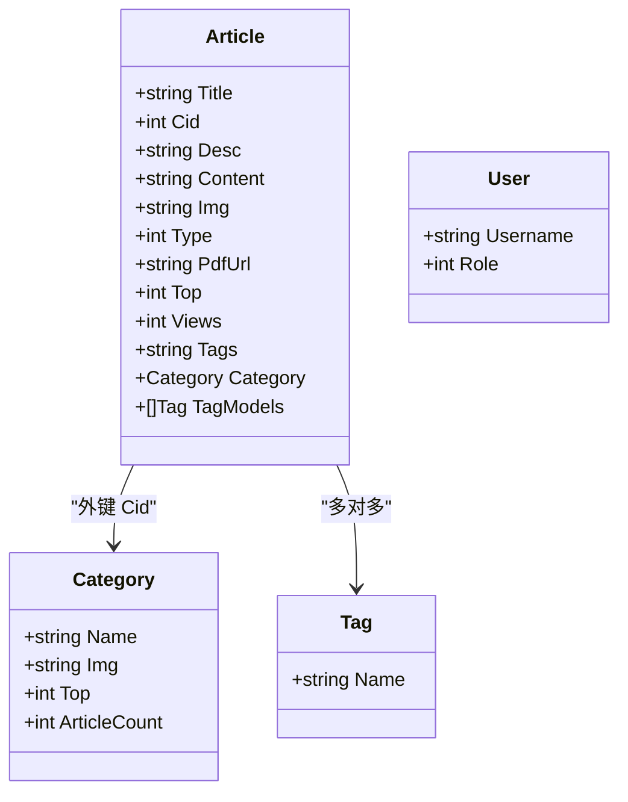
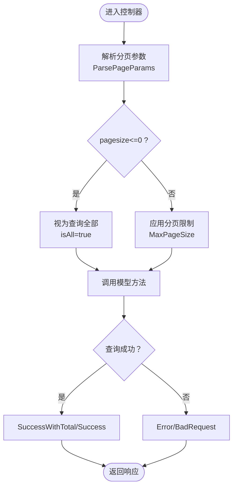
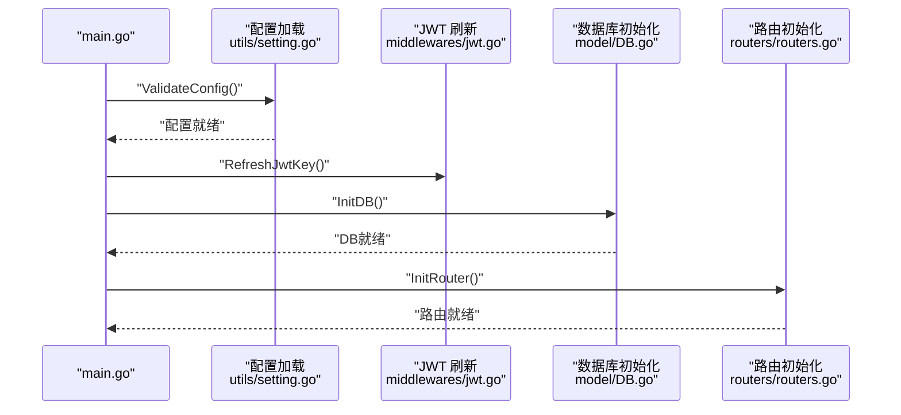
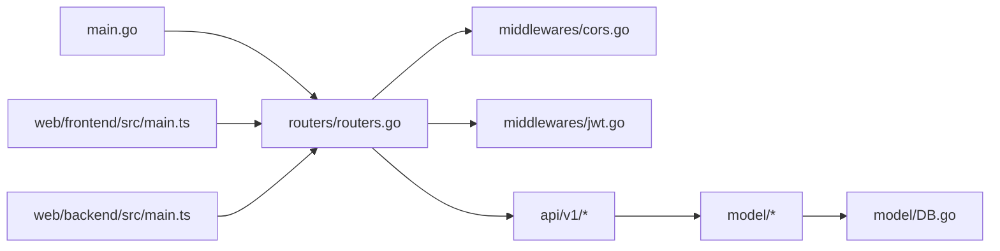

# 整体架构设计

<cite>
**本文引用的文件**
- [main.go](file://main.go)
- [routers.go](file://routers/routers.go)
- [DB.go](file://model/DB.go)
- [cors.go](file://middlewares/cors.go)
- [jwt.go](file://middlewares/jwt.go)
- [setting.go](file://utils/setting.go)
- [response.go](file://utils/response.go)
- [articles_v1.go](file://api/v1/articles_v1.go)
- [Articles.go](file://model/Articles.go)
- [Categories.go](file://model/Categories.go)
- [Users.go](file://model/Users.go)
- [Dockerfile](file://Dockerfile)
- [docker-compose.yaml](file://docker-compose.yaml)
- [frontend main.ts](file://web/frontend/src/main.ts)
- [backend main.ts](file://web/backend/src/main.ts)
- [README.md](file://README.md)
</cite>

## 目录
1. [引言](#引言)
2. [项目结构](#项目结构)
3. [核心组件](#核心组件)
4. [架构总览](#架构总览)
5. [详细组件分析](#详细组件分析)
6. [依赖关系分析](#依赖关系分析)
7. [性能考虑](#性能考虑)
8. [故障排查指南](#故障排查指南)
9. [结论](#结论)
10. [附录](#附录)

## 引言
本架构设计文档面向 YanBlog 的整体技术架构，重点阐述前后端分离的设计理念、MVC 架构模式在项目中的落地方式（表现层、业务逻辑层、数据访问层）、Gin 框架作为后端 Web 框架的选择理由与优势，并系统梳理主要组件及其依赖关系。文档还提供了从客户端请求到数据库响应的完整数据流图、关键流程的时序图与类图，帮助读者快速理解系统设计与实现。

## 项目结构
YanBlog 采用典型的前后端分离架构：
- 后端：Go + Gin + GORM，提供 RESTful API，负责认证授权、业务编排与数据持久化。
- 前端：Vue 3 + TypeScript，分别构建“前台”和“后台管理”两个独立应用，通过统一的后端 API 进行数据交互。
- 部署：Docker 多阶段构建，Nginx 统一反向代理与静态资源服务，容器内同时运行 Nginx、后端服务与静态资源。

图表来源
- [Dockerfile:26-89](file://Dockerfile#L26-L89)
- [docker-compose.yaml:1-16](file://docker-compose.yaml#L1-L16)

章节来源
- [README.md:36-74](file://README.md#L36-L74)
- [Dockerfile:1-89](file://Dockerfile#L1-L89)
- [docker-compose.yaml:1-16](file://docker-compose.yaml#L1-L16)

## 核心组件
- 入口与启动
  - main.go：负责配置校验、JWT 密钥刷新、打印启动信息、数据库初始化与路由初始化。
- 路由与中间件
  - routers/routers.go：初始化 Gin 路由，注册中间件（日志、恢复、Gzip、CORS），分组路由（公开、认证、管理员），静态资源服务与端口监听。
  - middlewares/cors.go：基于配置动态控制跨域来源，开发/生产差异化策略。
  - middlewares/jwt.go：JWT 令牌签发、校验与权限拦截（管理员/超级管理员）。
- 配置与工具
  - utils/setting.go：统一配置加载、环境变量替换、并发安全读写、前端配置路径解析。
  - utils/response.go：统一响应封装、分页参数解析与边界控制。
- 数据访问层
  - model/DB.go：数据库初始化（SQLite/MySQL）、连接池配置、自动迁移、演示数据与标签迁移。
  - model/*.go：Article/Category/User 等领域模型与查询逻辑。
- API 控制器
  - api/v1/*：各模块控制器，调用 model 层完成业务处理，使用 utils/response 统一封装响应。
- 前端应用
  - web/frontend：博客前台，Vue 3 应用。
  - web/backend：管理后台，Vue 3 应用。

章节来源
- [main.go:12-31](file://main.go#L12-L31)
- [routers.go:13-122](file://routers/routers.go#L13-L122)
- [cors.go:14-40](file://middlewares/cors.go#L14-L40)
- [jwt.go:15-157](file://middlewares/jwt.go#L15-L157)
- [setting.go:14-171](file://utils/setting.go#L14-L171)
- [response.go:17-100](file://utils/response.go#L17-L100)
- [DB.go:26-79](file://model/DB.go#L26-L79)

## 架构总览
YanBlog 采用经典的三层架构与 MVC 模式：
- 表现层（View）：前端 Vue 应用负责渲染页面与用户交互。
- 控制器层（Controller）：Gin 路由处理器（api/v1/*）接收请求、参数校验、调用业务逻辑、返回统一响应。
- 业务逻辑层（Service）：在控制器中直接调用 model 层提供的领域方法，实现业务规则与数据处理。
- 数据访问层（DAO/Model）：GORM 封装数据库操作，提供模型与查询方法。

图表来源
- [routers.go:13-122](file://routers/routers.go#L13-L122)
- [articles_v1.go:18-58](file://api/v1/articles_v1.go#L18-L58)
- [Articles.go:51-63](file://model/Articles.go#L51-L63)
- [Categories.go:43-59](file://model/Categories.go#L43-L59)
- [Users.go:110-119](file://model/Users.go#L110-L119)
- [DB.go:26-79](file://model/DB.go#L26-L79)

## 详细组件分析

### Gin 路由与中间件体系
- 路由初始化：设置运行模式、实例化 Gin、配置内存与静态资源、注册中间件与分组路由。
- 中间件链：
  - 日志与恢复：统一记录请求与异常。
  - Gzip：开启压缩提升传输效率。
  - CORS：按配置允许来源，开发模式放宽限制。
  - JWT：鉴权与管理员权限校验。
- 分组路由：
  - 公开接口：无需认证，如登录、文章列表、分类、天气、健康检查等。
  - 认证接口：需携带有效 JWT。
  - 管理员接口：在 JWT 基础上进一步校验角色。

图表来源
- [routers.go:13-122](file://routers/routers.go#L13-L122)
- [jwt.go:100-157](file://middlewares/jwt.go#L100-L157)
- [articles_v1.go:18-58](file://api/v1/articles_v1.go#L18-L58)
- [Articles.go:51-63](file://model/Articles.go#L51-L63)
- [DB.go:26-79](file://model/DB.go#L26-L79)

章节来源
- [routers.go:13-122](file://routers/routers.go#L13-L122)
- [cors.go:14-40](file://middlewares/cors.go#L14-L40)
- [jwt.go:15-157](file://middlewares/jwt.go#L15-L157)

### 数据模型与查询逻辑
- 文章模型（Article）：包含标题、分类、描述、内容、图片、类型（Markdown/PDF）、置顶等级、阅读量、标签等字段；支持多对多标签关联。
- 分类模型（Category）：包含名称、封面图、置顶等级与文章计数。
- 用户模型（User）：用户名、加密密码、角色码（1 超级管理员、2 管理员、3 普通用户）。

图表来源
- [Articles.go:11-25](file://model/Articles.go#L11-L25)
- [Categories.go:10-17](file://model/Categories.go#L10-L17)
- [Users.go:11-17](file://model/Users.go#L11-L17)

章节来源
- [Articles.go:11-25](file://model/Articles.go#L11-L25)
- [Categories.go:10-17](file://model/Categories.go#L10-L17)
- [Users.go:11-17](file://model/Users.go#L11-L17)

### 统一响应与分页
- 统一响应封装：Success/SuccessWithTotal/Error/BadRequest/NotFound 等，统一返回结构与状态码。
- 分页参数解析：支持 pagesize/pagenum，含边界校验与最大页大小限制，避免恶意请求。

图表来源
- [response.go:66-87](file://utils/response.go#L66-L87)
- [articles_v1.go:92-98](file://api/v1/articles_v1.go#L92-L98)

章节来源
- [response.go:17-100](file://utils/response.go#L17-L100)
- [articles_v1.go:92-98](file://api/v1/articles_v1.go#L92-L98)

### 配置与启动流程
- 配置加载：优先读取 config/backend/config.yaml，回退到 config/config.yaml 或模板，支持环境变量替换。
- 启动顺序：配置校验 -> JWT 密钥刷新 -> 数据库初始化 -> 路由初始化 -> 监听端口。

图表来源
- [main.go:12-31](file://main.go#L12-L31)
- [setting.go:47-98](file://utils/setting.go#L47-L98)
- [jwt.go:17-20](file://middlewares/jwt.go#L17-L20)
- [DB.go:26-79](file://model/DB.go#L26-L79)
- [routers.go:13-122](file://routers/routers.go#L13-L122)

章节来源
- [main.go:12-31](file://main.go#L12-L31)
- [setting.go:47-98](file://utils/setting.go#L47-L98)

## 依赖关系分析
- 组件耦合
  - 路由层依赖中间件与控制器；控制器依赖模型层；模型层依赖数据库层。
  - 前端应用与后端解耦，通过 HTTP API 通信。
- 外部依赖
  - Gin、GORM、JWT、CORS、Gzip 等第三方库。
  - 数据库驱动（MySQL/SQLite）。
- 部署依赖
  - Docker 多阶段构建，Nginx 提供统一入口与静态资源服务。

图表来源
- [main.go:3-10](file://main.go#L3-L10)
- [routers.go:3-11](file://routers/routers.go#L3-L11)
- [cors.go:4-12](file://middlewares/cors.go#L4-L12)
- [jwt.go:3-12](file://middlewares/jwt.go#L3-L12)
- [articles_v1.go:3-16](file://api/v1/articles_v1.go#L3-L16)
- [DB.go:3-17](file://model/DB.go#L3-L17)

章节来源
- [main.go:3-10](file://main.go#L3-L10)
- [routers.go:3-11](file://routers/routers.go#L3-L11)

## 性能考虑
- 传输优化
  - 启用 Gzip 压缩，减少网络传输体积。
  - 静态资源由 Nginx 提供，减轻后端压力。
- 数据库优化
  - 连接池配置：最大空闲/活跃连接数与生命周期设置，提升并发能力。
  - 查询优化：先查总数再分页查询，避免一次性加载大量数据。
  - 原子更新：阅读量增长使用 UpdateColumn 避免更新时间戳。
- 接口安全与稳定性
  - 登录限流中间件，降低暴力破解风险。
  - 统一分页上限，防止大页请求导致资源耗尽。
  - CORS 精准放行，生产环境最小暴露面。
- 前端体验
  - 图片懒加载指令，降低首屏压力。
  - 按需引入 UI 组件，减小包体。

章节来源
- [routers.go:17-34](file://routers/routers.go#L17-L34)
- [DB.go:41-44](file://model/DB.go#L41-L44)
- [Articles.go:146-149](file://model/Articles.go#L146-L149)
- [response.go:13-15](file://utils/response.go#L13-L15)
- [frontend main.ts:12-12](file://web/frontend/src/main.ts#L12-L12)

## 故障排查指南
- 启动失败
  - 检查配置文件路径与权限，确认 config/backend/config.yaml 存在且可读。
  - 查看数据库连接日志，确认 MySQL/SQLite 可达。
- 认证问题
  - 确认 Authorization 头格式为 Bearer Token，且未过期。
  - 若配置热重载，需确保 JWT 密钥刷新流程执行。
- 接口异常
  - 使用统一错误响应定位状态码与消息。
  - 检查分页参数是否越界或超过最大限制。
- 部署问题
  - Docker 构建阶段与运行阶段的静态资源路径需与 Nginx 配置一致。
  - 挂载卷确保 uploads、data、config 目录可读写。

章节来源
- [setting.go:47-98](file://utils/setting.go#L47-L98)
- [jwt.go:100-157](file://middlewares/jwt.go#L100-L157)
- [response.go:38-64](file://utils/response.go#L38-L64)
- [Dockerfile:26-89](file://Dockerfile#L26-L89)

## 结论
YanBlog 通过 Gin + Vue 的组合实现了清晰的前后端分离与职责划分，MVC 模式在控制器、业务与数据层之间形成稳定边界。Gin 的高性能与简洁生态、GORM 的 ORM 能力、Nginx 的静态资源与反向代理能力共同构成了可维护、可扩展、易部署的系统架构。配合统一响应、分页与安全中间件，系统在功能完整性与工程实践上达到良好平衡。

## 附录
- 部署与访问
  - Docker Compose 默认端口映射：前台与后台统一入口 3002，也可按需调整。
  - 首次运行会自动初始化配置与演示数据，便于快速体验。
- 开发与调试
  - 前后端可独立启动与调试，便于快速迭代与问题定位。

章节来源
- [README.md:18-34](file://README.md#L18-L34)
- [docker-compose.yaml:4-5](file://docker-compose.yaml#L4-L5)
- [DB.go:51-78](file://model/DB.go#L51-L78)