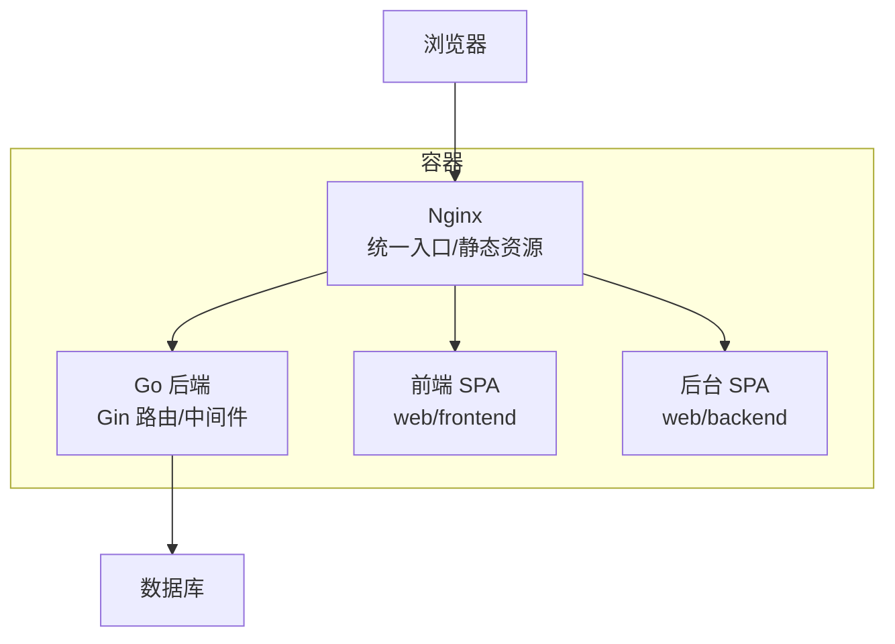
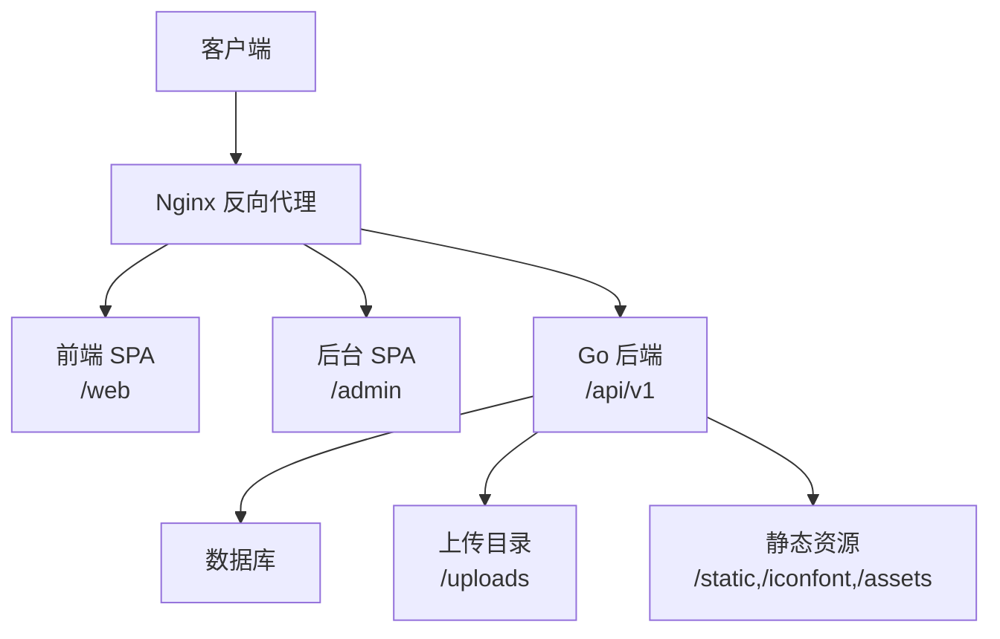
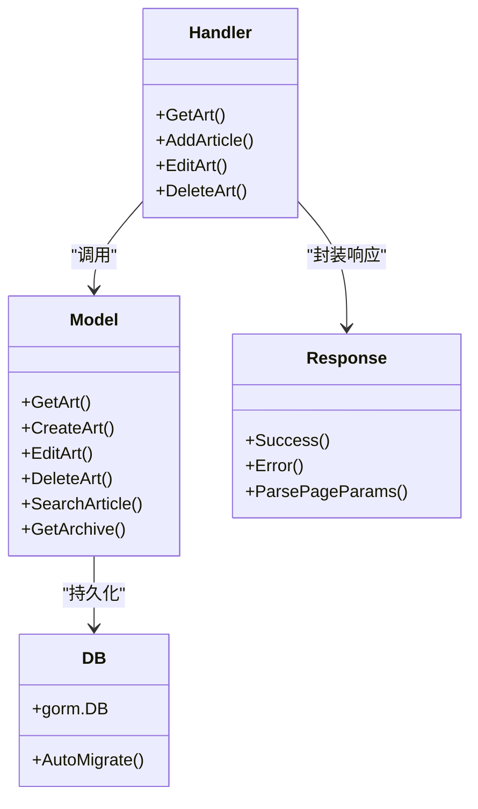
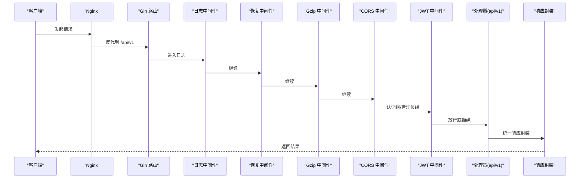
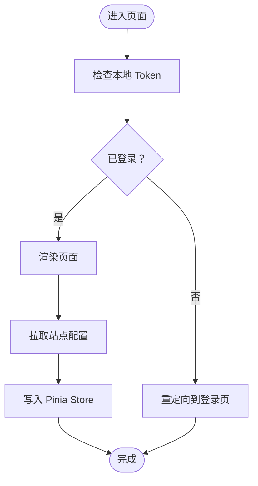
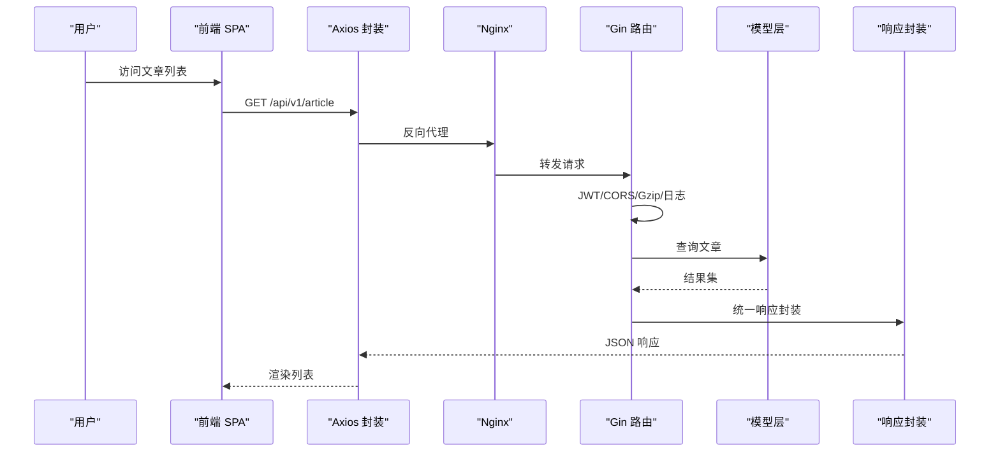
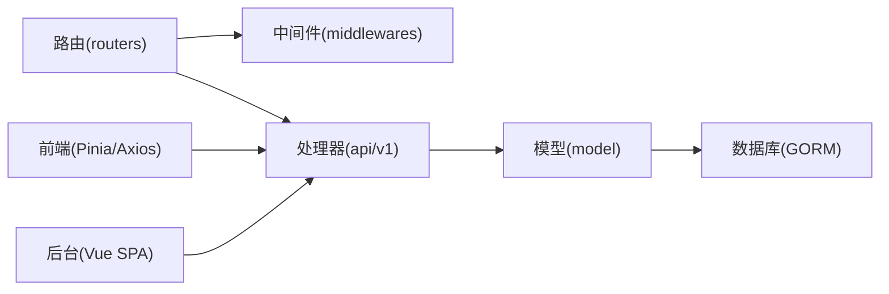

# 系统架构

<cite>
**本文引用的文件**
- [main.go](file://main.go)
- [routers.go](file://routers/routers.go)
- [jwt.go](file://middlewares/jwt.go)
- [cors.go](file://middlewares/cors.go)
- [Logger.go](file://middlewares/Logger.go)
- [rate_limit.go](file://middlewares/rate_limit.go)
- [DB.go](file://model/DB.go)
- [response.go](file://utils/response.go)
- [setting.go](file://utils/setting.go)
- [articles_v1.go](file://api/v1/articles_v1.go)
- [main.ts（前端）](file://web/frontend/src/main.ts)
- [main.ts（后台）](file://web/backend/src/main.ts)
- [router（前端）](file://web/frontend/src/router/index.ts)
- [router（后台）](file://web/backend/src/router/index.ts)
- [siteInfo.ts](file://web/frontend/src/stores/siteInfo.ts)
- [api.ts](file://web/frontend/src/services/api.ts)
- [docker-compose.yaml](file://docker-compose.yaml)
- [Dockerfile](file://Dockerfile)
</cite>

## 目录
1. [引言](#引言)
2. [项目结构](#项目结构)
3. [核心组件](#核心组件)
4. [架构总览](#架构总览)
5. [详细组件分析](#详细组件分析)
6. [依赖分析](#依赖分析)
7. [性能考量](#性能考量)
8. [故障排查指南](#故障排查指南)
9. [结论](#结论)
10. [附录](#附录)

## 引言
本文件为 YanBlog 的系统架构文档，面向架构师与高级开发者，聚焦以下目标：
- 展示前后端分离的整体架构与边界
- 解释 MVC 架构模式在本项目中的落地：表现层、业务逻辑层、数据访问层的职责划分
- 阐述 Gin 框架中间件模式如何实现横切关注点（JWT 认证、CORS、日志、限流）
- 描述 Vue 3 前端应用的组件化与 Pinia 状态管理
- 提供系统边界图、组件交互图与数据流图
- 说明技术选型与架构权衡、基础设施与可扩展性、部署拓扑

## 项目结构
YanBlog 采用“Go 后端 + Nginx 统一入口 + 前端/后台双 SPA”的混合部署形态：
- 后端：Gin Web 框架，路由集中注册，中间件统一接入，模型层基于 GORM
- 前端：Vue 3 + Vite 构建，使用 Element Plus 与 Pinia
- 后台：独立的 Vue SPA，路由与鉴权逻辑在前端完成
- 静态资源与上传目录由 Nginx 提供，Go 服务补充静态文件与配置下发
- Dockerfile 与 docker-compose 实现多阶段构建与统一镜像

图表来源
- [Dockerfile:26-89](file://Dockerfile#L26-L89)
- [docker-compose.yaml:1-16](file://docker-compose.yaml#L1-L16)

章节来源
- [Dockerfile:1-89](file://Dockerfile#L1-L89)
- [docker-compose.yaml:1-16](file://docker-compose.yaml#L1-L16)

## 核心组件
- 启动入口与生命周期
  - 应用启动顺序：配置校验 → JWT 密钥刷新 → 打印启动信息 → 初始化数据库 → 初始化路由
- 路由与中间件
  - Gin 路由集中注册，统一启用日志、恢复、Gzip、CORS
  - 按权限分组：公开组、认证组、管理员组
- 中间件体系
  - JWT 认证与管理员权限校验
  - CORS 跨域策略（按环境与配置动态调整）
  - 日志记录（含轮转）
  - 登录频率限制
- 数据访问层
  - GORM 支持 MySQL 与 SQLite，连接池与迁移策略
- 统一响应与参数解析
  - 统一响应封装、分页参数解析与边界保护
- 前端与后台
  - 前端：Pinia 状态管理、Axios 封装、路由守卫
  - 后台：Element Plus + 路由守卫 + 本地 Token 控制

章节来源
- [main.go:12-31](file://main.go#L12-L31)
- [routers.go:13-122](file://routers/routers.go#L13-L122)
- [jwt.go:100-157](file://middlewares/jwt.go#L100-L157)
- [cors.go:14-40](file://middlewares/cors.go#L14-L40)
- [Logger.go:15-103](file://middlewares/Logger.go#L15-L103)
- [rate_limit.go:50-98](file://middlewares/rate_limit.go#L50-L98)
- [DB.go:26-79](file://model/DB.go#L26-L79)
- [response.go:17-100](file://utils/response.go#L17-L100)
- [setting.go:14-171](file://utils/setting.go#L14-L171)

## 架构总览
YanBlog 采用“前后端分离 + Nginx 统一入口”的架构：
- 前端 SPA 与后台 SPA 通过 Nginx 提供静态资源
- Go 后端负责 API、静态文件与配置下发
- Nginx 作为反向代理与静态资源服务器，暴露统一端口
- Dockerfile 多阶段构建，最终镜像内同时包含前端产物、后台产物与后端二进制

图表来源
- [routers.go:29-36](file://routers/routers.go#L29-L36)
- [Dockerfile:44-61](file://Dockerfile#L44-L61)

章节来源
- [routers.go:13-122](file://routers/routers.go#L13-L122)
- [Dockerfile:26-89](file://Dockerfile#L26-L89)

## 详细组件分析

### MVC 架构模式与职责划分
- 表现层（Presentation）
  - 前端：Vue 3 组件化视图，路由驱动页面切换，Pinia 管理站点配置与主题等状态
  - 后台：Vue SPA，路由守卫控制登录态与菜单
  - 后端：Gin 路由处理器（api/v1/*）作为控制器，统一响应封装
- 业务逻辑层（Business Logic）
  - 后端处理器调用模型层进行数据操作与规则校验
  - 示例：文章增删改查、搜索、归档、热门/置顶、相邻/相关文章
- 数据访问层（Data Access）
  - GORM 模型与迁移，支持 MySQL/SQLite，连接池与 Ping 重试
  - 首次运行自动创建演示文章与默认管理员

图表来源
- [articles_v1.go:18-273](file://api/v1/articles_v1.go#L18-L273)
- [DB.go:26-79](file://model/DB.go#L26-L79)
- [response.go:17-100](file://utils/response.go#L17-L100)

章节来源
- [articles_v1.go:18-273](file://api/v1/articles_v1.go#L18-L273)
- [DB.go:26-79](file://model/DB.go#L26-L79)
- [response.go:17-100](file://utils/response.go#L17-L100)

### Gin 中间件模式与横切关注点
- 中间件链路
  - 日志记录 → 恢复处理 → Gzip 压缩 → CORS
  - 认证组：JWT 校验
  - 管理员组：JWT + 管理员权限校验
  - 登录接口：登录频率限制
- JWT 认证
  - 令牌签发与解析，过期校验，上下文注入用户名
  - 管理员权限中间件对角色进行二次校验
- CORS
  - 生产环境仅允许配置的站点 URL，开发模式允许所有来源
- 日志
  - 日志轮转与分级输出，记录请求耗时、大小、UA、错误等
- 登录限流
  - 基于内存的滑动窗口计数，封禁策略与定期清理

图表来源
- [routers.go:17-25](file://routers/routers.go#L17-L25)
- [jwt.go:100-157](file://middlewares/jwt.go#L100-L157)
- [Logger.go:15-103](file://middlewares/Logger.go#L15-L103)
- [cors.go:14-40](file://middlewares/cors.go#L14-L40)
- [rate_limit.go:50-98](file://middlewares/rate_limit.go#L50-L98)

章节来源
- [routers.go:13-122](file://routers/routers.go#L13-L122)
- [jwt.go:71-96](file://middlewares/jwt.go#L71-L96)
- [cors.go:14-40](file://middlewares/cors.go#L14-L40)
- [Logger.go:15-103](file://middlewares/Logger.go#L15-L103)
- [rate_limit.go:50-98](file://middlewares/rate_limit.go#L50-L98)

### Vue 3 前端组件化与状态管理
- 应用入口
  - 前端：Pinia、路由、Element Plus、懒加载指令
  - 后台：Element Plus、路由、图标注册
- 路由与守卫
  - 前端：基础路由、滚动行为、参数校验与 404
  - 后台：登录态守卫、标题设置、菜单跳转
- 状态管理
  - Pinia Store：站点配置（siteInfo），拉取/更新配置，本地覆盖（开发环境）
- API 封装
  - Axios 实例、请求/响应拦截、超时与网络错误处理、取消控制器

图表来源
- [router（后台）:164-183](file://web/backend/src/router/index.ts#L164-L183)
- [siteInfo.ts:188-218](file://web/frontend/src/stores/siteInfo.ts#L188-L218)
- [api.ts:28-64](file://web/frontend/src/services/api.ts#L28-L64)

章节来源
- [main.ts（前端）:1-28](file://web/frontend/src/main.ts#L1-L28)
- [main.ts（后台）:1-23](file://web/backend/src/main.ts#L1-L23)
- [router（前端）:1-73](file://web/frontend/src/router/index.ts#L1-L73)
- [router（后台）:1-185](file://web/backend/src/router/index.ts#L1-L185)
- [siteInfo.ts:1-260](file://web/frontend/src/stores/siteInfo.ts#L1-L260)
- [api.ts:1-137](file://web/frontend/src/services/api.ts#L1-L137)

### 数据流与请求处理流程
- 文章列表/详情/搜索/归档等请求经 Nginx 反代至 Go 后端
- 后端路由按权限组匹配，中间件链处理认证、限流、CORS、压缩与日志
- 处理器调用模型层执行业务逻辑，统一响应封装返回
- 前端通过 Axios 接口封装发起请求，后台配置通过静态资源或 API 下发

图表来源
- [routers.go:94-118](file://routers/routers.go#L94-L118)
- [articles_v1.go:92-98](file://api/v1/articles_v1.go#L92-L98)
- [api.ts:66-103](file://web/frontend/src/services/api.ts#L66-L103)
- [response.go:17-100](file://utils/response.go#L17-L100)

章节来源
- [routers.go:94-118](file://routers/routers.go#L94-L118)
- [articles_v1.go:92-98](file://api/v1/articles_v1.go#L92-L98)
- [api.ts:66-103](file://web/frontend/src/services/api.ts#L66-L103)
- [response.go:17-100](file://utils/response.go#L17-L100)

## 依赖分析
- 组件耦合
  - 路由层依赖中间件与处理器；处理器依赖模型层；模型层依赖数据库
  - 前端通过 Axios 与后端解耦，路由与状态管理相互独立
- 外部依赖
  - Gin、GORM、JWT、Logrus、Element Plus、Vite/Pinia
- 配置与环境
  - 配置文件支持环境变量替换与热重载，JWT 密钥在配置重载后刷新

图表来源
- [routers.go:3-11](file://routers/routers.go#L3-L11)
- [DB.go:1-17](file://model/DB.go#L1-L17)
- [setting.go:77-98](file://utils/setting.go#L77-L98)

章节来源
- [routers.go:3-11](file://routers/routers.go#L3-L11)
- [DB.go:1-17](file://model/DB.go#L1-L17)
- [setting.go:77-98](file://utils/setting.go#L77-L98)

## 性能考量
- 网络与传输
  - 启用 Gzip 压缩，减少响应体积
  - 前端 Axios 设置合理超时，避免长时间占用连接
- 数据库
  - 连接池配置与 Ping 重试，首次运行自动迁移与演示数据
- 前端
  - 懒加载指令与按需路由，降低首屏压力
  - Pinia 状态持久化与缓存策略（可按需扩展）

## 故障排查指南
- 配置问题
  - 启动前配置校验失败：检查配置文件路径与必填项
  - JWT 密钥变更后未生效：确认配置重载后中间件刷新密钥
- 认证与权限
  - 401 未授权：检查 Authorization 头格式与令牌有效期
  - 403 无权限：确认用户角色是否满足管理员要求
- 登录频繁被限流
  - 观察 IP 是否触发封禁窗口，等待冷却或降低请求频率
- 日志定位
  - 查看日志轮转文件与级别输出，结合响应状态与耗时定位问题
- 数据库
  - MySQL 连接失败：检查主机、端口、凭据与网络可达性
  - 首次运行未生成演示数据：确认文件路径与权限

章节来源
- [main.go:13-18](file://main.go#L13-L18)
- [jwt.go:100-157](file://middlewares/jwt.go#L100-L157)
- [rate_limit.go:50-98](file://middlewares/rate_limit.go#L50-L98)
- [Logger.go:15-103](file://middlewares/Logger.go#L15-L103)
- [DB.go:81-122](file://model/DB.go#L81-L122)

## 结论
YanBlog 通过“Go + Gin + Nginx + Vue 3”的组合实现了清晰的前后端分离与职责划分。中间件模式有效承载了认证、跨域、日志与限流等横切关注点；统一响应与参数解析提升了接口一致性与健壮性；前端采用组件化与 Pinia 管理关键状态，配合 Axios 封装与路由守卫，形成稳定的用户体验。Docker 多阶段构建与统一镜像进一步简化了部署与运维。

## 附录

### 技术选型与架构权衡
- Go + Gin：高性能、并发友好，适合 API 与静态资源服务
- GORM：简洁 ORM，支持多数据库，迁移与连接池完善
- Vue 3 + Pinia：现代化前端生态，组件化与状态管理成熟
- Nginx：静态资源与反向代理，统一入口与缓存优化
- Docker：多阶段构建与统一镜像，便于 CI/CD 与部署

### 基础设施与部署拓扑
- 单容器部署：通过 docker-compose 暴露统一端口，挂载上传、数据、配置卷
- 多容器/集群：可拆分为独立后端、前端与数据库服务，结合负载均衡与持久化存储
- 可扩展性：水平扩展后端节点，共享数据库与对象存储（上传目录可替换为对象存储）

章节来源
- [docker-compose.yaml:1-16](file://docker-compose.yaml#L1-L16)
- [Dockerfile:26-89](file://Dockerfile#L26-L89)